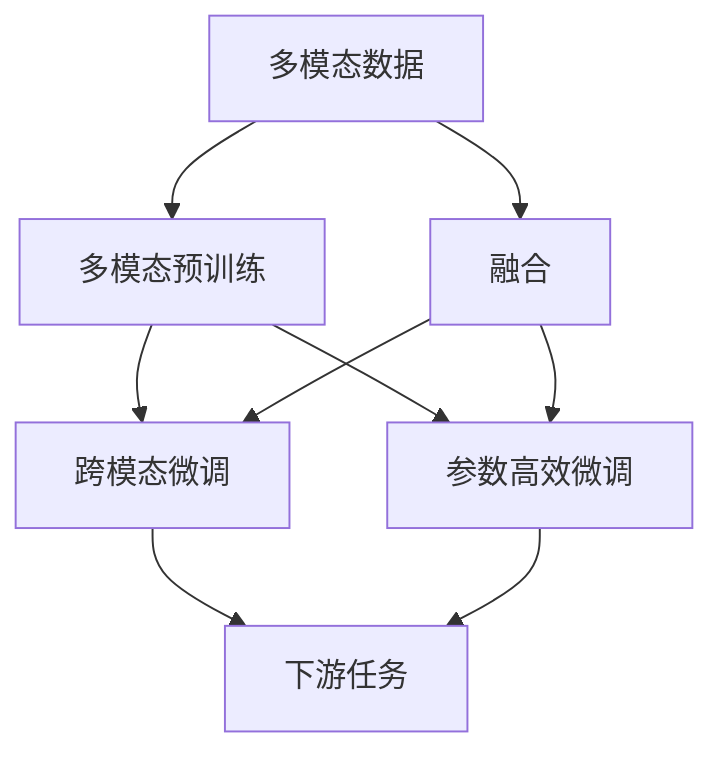
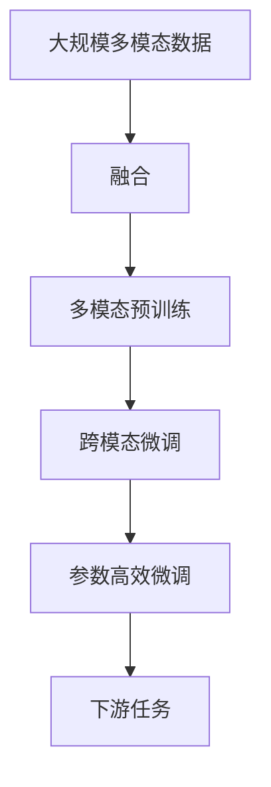

                 

# 多模态大模型：技术原理与实战 从0到1部署多模态大模型

## 1. 背景介绍

### 1.1 问题由来

近年来，随着深度学习技术的迅猛发展，预训练大模型在计算机视觉、自然语言处理等多个领域取得显著进步。然而，这些模型通常只聚焦单一模态数据（如文本、图像），难以全面刻画复杂的现实世界信息。多模态大模型（Multimodal Large Models）应运而生，通过同时学习多种模态数据，能够更加准确地捕捉和建模现实世界的复杂关系。

在自然语言处理领域，传统的大语言模型（如BERT、GPT）主要依赖于文本数据进行预训练，而多模态大模型则进一步引入了图像、语音等多模态信息，通过多模态融合，提升了模型的语义理解能力和泛化性能。例如，在图像-文本匹配任务中，结合图像特征和文本描述，能够更准确地识别图片中的物体和场景，提高了识别的精度和鲁棒性。

### 1.2 问题核心关键点

多模态大模型的核心问题在于如何将多种模态数据高效融合，并在此基础上进行预训练和微调。主要包括以下几个关键点：

- **数据融合策略**：如何设计有效的多模态融合方法，使得文本、图像、语音等不同模态的信息能够协同工作，构建统一的知识表示。
- **多模态预训练**：如何在大规模多模态数据上，对模型进行有监督或无监督的预训练，使其学习到多模态数据的共同特征表示。
- **跨模态微调**：如何对预训练后的多模态模型进行下游任务的微调，使其适应特定应用场景，提高任务性能。
- **参数高效微调**：如何在微调过程中，仅更新部分参数，避免对大模型进行全参数微调，减少计算资源消耗。

这些关键问题共同构成了多模态大模型的研究难点，需要在预训练、数据融合、微调等多个环节进行综合优化。

### 1.3 问题研究意义

多模态大模型的研究对于拓展AI应用领域，提升模型的泛化能力和泛用性，具有重要意义：

1. **跨模态理解**：通过学习多种模态数据，多模态大模型能够更全面、更准确地理解复杂情境，提升模型的语义理解和推理能力。
2. **增强决策可靠性**：多模态信息的融合，提高了模型对于数据扰动和异常情况的鲁棒性，减少了误判和偏见。
3. **提高应用效率**：多模态大模型能够同时处理文本、图像、语音等多种数据，减少了数据转换和预处理的时间成本，提高了系统效率。
4. **拓展应用场景**：多模态大模型可以应用于智能客服、医疗诊断、自动驾驶、智能家居等多个领域，推动相关行业数字化转型。

## 2. 核心概念与联系

### 2.1 核心概念概述

为更好地理解多模态大模型的技术原理和实践方法，本节将介绍几个密切相关的核心概念：

- **多模态数据融合**：指将不同模态的数据通过某种方式进行组合，构建统一的语义空间，从而提高多模态信息的融合效果。
- **多模态预训练**：指在大规模多模态数据上，对模型进行无监督或有监督的预训练，使其学习到不同模态数据的共同特征表示。
- **跨模态微调**：指在预训练模型的基础上，使用下游任务的少量标注数据，通过有监督地训练优化模型在特定任务上的性能。
- **参数高效微调**：指在微调过程中，只更新模型的部分参数，避免对大模型进行全参数微调，以提高微调效率，减少计算资源消耗。

这些核心概念之间存在着紧密的联系，形成了多模态大模型的整体架构。通过理解这些核心概念，我们可以更好地把握多模态大模型的工作原理和优化方向。

### 2.2 概念间的关系

这些核心概念之间的关系可以通过以下Mermaid流程图来展示：



这个流程图展示了大模型处理多模态数据的一般流程：首先对不同模态数据进行融合，然后通过预训练学习共同特征表示，接着对特定任务进行微调，最后进行参数高效微调。通过这些步骤，多模态大模型能够充分利用多种模态信息，提高模型性能和应用范围。

### 2.3 核心概念的整体架构

最后，我们用一个综合的流程图来展示这些核心概念在大模型处理多模态数据中的整体架构：



这个综合流程图展示了从数据预处理到下游任务处理的完整过程。多模态大模型首先对不同模态的数据进行融合，然后通过预训练学习多模态特征，接着对特定任务进行微调，最后进行参数高效微调，以提升模型性能和效率。通过这些步骤，多模态大模型能够更好地应对复杂的多模态信息，提供更加精准的智能决策。

## 3. 核心算法原理 & 具体操作步骤
### 3.1 算法原理概述

多模态大模型的核心算法原理可以概括为：通过多模态融合、多模态预训练、跨模态微调等步骤，构建能够同时处理多种模态数据的大模型，并在此基础上对特定任务进行优化。

具体而言，多模态大模型的训练过程分为以下三个步骤：

1. **多模态数据融合**：将不同模态的数据通过某种方式进行组合，构建统一的语义空间。常见的方法包括特征拼接、注意力机制等。
2. **多模态预训练**：在大规模多模态数据上，对模型进行无监督或有监督的预训练，使其学习到不同模态数据的共同特征表示。
3. **跨模态微调**：在预训练模型的基础上，使用下游任务的少量标注数据，通过有监督地训练优化模型在特定任务上的性能。

### 3.2 算法步骤详解

以下将详细介绍多模态大模型的各个步骤：

**Step 1: 多模态数据融合**

多模态数据融合是构建统一语义空间的关键步骤。常见的方法包括：

1. **特征拼接**：将不同模态的数据特征进行拼接，生成新的多模态特征表示。如将文本向量和图像特征向量拼接，生成新的特征向量。
2. **注意力机制**：通过注意力机制，动态地对不同模态的信息进行加权，生成加权后的特征向量。
3. **Transformer模型**：利用Transformer模型中的多头自注意力机制，对不同模态的信息进行融合，生成新的表示。

**Step 2: 多模态预训练**

多模态预训练是构建通用特征表示的重要环节。常用的预训练任务包括：

1. **掩码语言模型**：在大规模无标签文本语料上，利用掩码预测任务进行预训练，学习语言表示。
2. **图像分类**：在图像数据集上，利用图像分类任务进行预训练，学习图像表示。
3. **多模态关联预测**：在大规模多模态数据上，利用关联预测任务进行预训练，学习多模态数据的共同特征表示。

**Step 3: 跨模态微调**

跨模态微调是将预训练的多模态模型应用于特定任务的过程。具体的微调过程包括：

1. **选择合适的微调数据集**：根据任务的特性，选择合适的数据集进行微调，如文本-图像匹配、图像-文本生成等。
2. **添加任务适配层**：根据任务类型，在预训练模型顶层设计合适的输出层和损失函数。
3. **设置微调超参数**：选择合适的优化算法及其参数，如 AdamW、SGD 等，设置学习率、批大小、迭代轮数等。
4. **执行梯度训练**：将训练集数据分批次输入模型，前向传播计算损失函数。反向传播计算参数梯度，根据设定的优化算法和学习率更新模型参数。
5. **周期性评估模型性能**：在验证集上评估模型性能，根据性能指标决定是否触发 Early Stopping。
6. **重复微调过程**：重复上述步骤直至满足预设的迭代轮数或 Early Stopping 条件。

### 3.3 算法优缺点

多模态大模型具有以下优点：

1. **泛化能力强**：多模态信息融合，使得模型能够更全面地理解现实世界信息，提升了模型的泛化能力和泛用性。
2. **鲁棒性高**：多模态信息的融合，提高了模型对于数据扰动和异常情况的鲁棒性，减少了误判和偏见。
3. **应用广泛**：多模态大模型能够应用于多个领域，如智能客服、医疗诊断、自动驾驶、智能家居等，具有广泛的应用前景。

同时，多模态大模型也存在一些缺点：

1. **数据获取难度大**：多模态数据的获取和标注成本较高，需要大量的数据集和标注工作。
2. **模型规模庞大**：多模态大模型的参数量通常较大，需要大量的计算资源和存储空间。
3. **训练复杂度高**：多模态数据的融合和预训练过程较为复杂，需要精心设计和调试。
4. **微调难度大**：跨模态微调的过程需要适应多种模态数据，需要更多的技巧和经验。

尽管存在这些缺点，多模态大模型仍然具有广阔的应用前景，未来有望在更多领域发挥重要作用。

### 3.4 算法应用领域

多模态大模型已经在多个领域得到广泛应用，例如：

1. **智能客服**：结合语音、文本等多模态信息，构建智能客服系统，提高客户咨询体验和问题解决效率。
2. **医疗诊断**：结合医学图像和文本数据，进行疾病诊断和治疗方案推荐，提升医疗服务质量。
3. **自动驾驶**：结合图像、雷达、激光雷达等多模态数据，实现自主驾驶和环境感知，提高行车安全。
4. **智能家居**：结合语音、图像、传感器等多模态信息，实现智能家居设备的控制和交互，提升居住体验。
5. **智能制造**：结合图像、声音、传感器等多模态数据，进行工业质检和故障诊断，提高生产效率。

这些应用场景展示了多模态大模型在提高智能化水平、提升系统效率、改善用户体验等方面的潜力。

## 4. 数学模型和公式 & 详细讲解 & 举例说明（备注：数学公式请使用latex格式，latex嵌入文中独立段落使用 $$，段落内使用 $)
### 4.1 数学模型构建

多模态大模型的数学模型可以由以下部分构成：

1. **多模态数据表示**：将不同模态的数据表示为向量形式，构建统一的语义空间。如文本表示为词向量，图像表示为特征向量。
2. **多模态预训练模型**：利用多模态数据进行预训练，学习多模态数据的共同特征表示。如在Transformer模型中，将多模态数据进行拼接和注意力融合，生成新的表示。
3. **跨模态微调模型**：在预训练模型基础上，添加任务适配层，进行跨模态微调。如在图像-文本匹配任务中，将图像特征和文本描述作为输入，微调模型进行分类。

### 4.2 公式推导过程

以图像-文本匹配任务为例，进行跨模态微调的数学公式推导：

设文本表示为 $x_t$，图像表示为 $x_v$，两者拼接后作为输入 $x$ 输入到Transformer模型中进行预训练。设预训练后的多模态表示为 $H$，其中 $H_t$ 为文本表示，$H_v$ 为图像表示。在微调过程中，添加分类器 $M_{\theta}$ 和交叉熵损失函数 $L$，进行跨模态微调：

$$
\begin{aligned}
&\text{输入表示} \\
&x = [x_t, x_v] \\
&H = \text{Transformer}(x) \\
&H_t = H_{1:d}, \quad H_v = H_{d+1:2d} \\
\end{aligned}
$$

$$
\begin{aligned}
&\text{微调} \\
&M_{\theta}(H) = \text{Linear}(H) + \text{Softmax} \\
&L(y, \hat{y}) = -\frac{1}{N}\sum_{i=1}^N(y_i\log\hat{y}_i+(1-y_i)\log(1-\hat{y}_i)) \\
&\mathcal{L}(\theta) = \frac{1}{N}\sum_{i=1}^N L(y_i, \hat{y}_i)
\end{aligned}
$$

其中，$M_{\theta}$ 为微调后的分类器，$y$ 为真实标签，$\hat{y}$ 为模型预测输出，$N$ 为样本数。

### 4.3 案例分析与讲解

以Google Vision & Language 模型为例，展示多模态大模型在图像-文本匹配任务中的应用：

1. **数据预处理**：将图像和文本数据进行标准化、归一化等处理，构建统一的语义空间。
2. **多模态预训练**：在Vision & Language数据集上，利用Transformer模型进行多模态预训练，学习多模态数据的共同特征表示。
3. **跨模态微调**：在预训练模型基础上，添加分类器，进行跨模态微调，学习图像和文本的匹配关系。
4. **评估和优化**：在验证集上评估模型性能，根据性能指标调整超参数，提高模型效果。

## 5. 项目实践：代码实例和详细解释说明
### 5.1 开发环境搭建

在进行多模态大模型的实践前，我们需要准备好开发环境。以下是使用Python进行PyTorch开发的环境配置流程：

1. 安装Anaconda：从官网下载并安装Anaconda，用于创建独立的Python环境。

2. 创建并激活虚拟环境：
```bash
conda create -n pytorch-env python=3.8 
conda activate pytorch-env
```

3. 安装PyTorch：根据CUDA版本，从官网获取对应的安装命令。例如：
```bash
conda install pytorch torchvision torchaudio cudatoolkit=11.1 -c pytorch -c conda-forge
```

4. 安装Transformers库：
```bash
pip install transformers
```

5. 安装各类工具包：
```bash
pip install numpy pandas scikit-learn matplotlib tqdm jupyter notebook ipython
```

完成上述步骤后，即可在`pytorch-env`环境中开始多模态大模型的实践。

### 5.2 源代码详细实现

下面我们以图像-文本匹配任务为例，给出使用Transformers库对Vision & Language模型进行微调的PyTorch代码实现。

首先，定义多模态数据处理函数：

```python
from transformers import AutoTokenizer, AutoModelForMultimodalFeatureFusion
from torch.utils.data import Dataset
import torch

class MultimodalDataset(Dataset):
    def __init__(self, images, texts, tokenizer):
        self.images = images
        self.texts = texts
        self.tokenizer = tokenizer
        self.max_len = 128
        
    def __len__(self):
        return len(self.images)
    
    def __getitem__(self, item):
        image = self.images[item]
        text = self.texts[item]
        
        encoding = self.tokenizer(text, return_tensors='pt', max_length=self.max_len, padding='max_length', truncation=True)
        input_ids = encoding['input_ids'][0]
        attention_mask = encoding['attention_mask'][0]
        image = image.unsqueeze(0)
        
        return {'input_ids': input_ids, 
                'attention_mask': attention_mask,
                'image': image}
```

然后，定义模型和优化器：

```python
from transformers import AutoModelForMultimodalFeatureFusion
from torch.optim import AdamW

model = AutoModelForMultimodalFeatureFusion.from_pretrained('google/vision-language', num_labels=2)

optimizer = AdamW(model.parameters(), lr=2e-5)
```

接着，定义训练和评估函数：

```python
from torch.utils.data import DataLoader
from tqdm import tqdm
from sklearn.metrics import accuracy_score

device = torch.device('cuda') if torch.cuda.is_available() else torch.device('cpu')
model.to(device)

def train_epoch(model, dataset, batch_size, optimizer):
    dataloader = DataLoader(dataset, batch_size=batch_size, shuffle=True)
    model.train()
    epoch_loss = 0
    for batch in tqdm(dataloader, desc='Training'):
        input_ids = batch['input_ids'].to(device)
        attention_mask = batch['attention_mask'].to(device)
        image = batch['image'].to(device)
        model.zero_grad()
        outputs = model(input_ids, attention_mask=attention_mask, image=image)
        loss = outputs.loss
        epoch_loss += loss.item()
        loss.backward()
        optimizer.step()
    return epoch_loss / len(dataloader)

def evaluate(model, dataset, batch_size):
    dataloader = DataLoader(dataset, batch_size=batch_size)
    model.eval()
    preds, labels = [], []
    with torch.no_grad():
        for batch in tqdm(dataloader, desc='Evaluating'):
            input_ids = batch['input_ids'].to(device)
            attention_mask = batch['attention_mask'].to(device)
            image = batch['image'].to(device)
            outputs = model(input_ids, attention_mask=attention_mask, image=image)
            batch_preds = outputs.logits.argmax(dim=1).to('cpu').tolist()
            batch_labels = batch['labels'].to('cpu').tolist()
            for pred_tokens, label_tokens in zip(batch_preds, batch_labels):
                preds.append(pred_tokens)
                labels.append(label_tokens)
                
    return accuracy_score(labels, preds)
```

最后，启动训练流程并在测试集上评估：

```python
epochs = 5
batch_size = 16

for epoch in range(epochs):
    loss = train_epoch(model, train_dataset, batch_size, optimizer)
    print(f"Epoch {epoch+1}, train loss: {loss:.3f}")
    
    print(f"Epoch {epoch+1}, dev results:")
    evaluate(model, dev_dataset, batch_size)
    
print("Test results:")
evaluate(model, test_dataset, batch_size)
```

以上就是使用PyTorch对Vision & Language模型进行图像-文本匹配任务微调的完整代码实现。可以看到，得益于Transformers库的强大封装，我们可以用相对简洁的代码完成模型加载和微调。

### 5.3 代码解读与分析

让我们再详细解读一下关键代码的实现细节：

**MultimodalDataset类**：
- `__init__`方法：初始化图像、文本、分词器等关键组件。
- `__len__`方法：返回数据集的样本数量。
- `__getitem__`方法：对单个样本进行处理，将文本和图像输入编码为模型所需的格式。

**模型和优化器定义**：
- 使用AutoModelForMultimodalFeatureFusion模型，指定预训练权重为Google Vision & Language模型。
- 使用AdamW优化器，设置学习率。

**训练和评估函数**：
- 使用PyTorch的DataLoader对数据集进行批次化加载，供模型训练和推理使用。
- 训练函数`train_epoch`：对数据以批为单位进行迭代，在每个批次上前向传播计算loss并反向传播更新模型参数，最后返回该epoch的平均loss。
- 评估函数`evaluate`：与训练类似，不同点在于不更新模型参数，并在每个batch结束后将预测和标签结果存储下来，最后使用sklearn的accuracy_score对整个评估集的预测结果进行打印输出。

**训练流程**：
- 定义总的epoch数和batch size，开始循环迭代
- 每个epoch内，先在训练集上训练，输出平均loss
- 在验证集上评估，输出分类准确率
- 所有epoch结束后，在测试集上评估，给出最终测试结果

可以看到，PyTorch配合Transformers库使得多模态大模型的微调代码实现变得简洁高效。开发者可以将更多精力放在数据处理、模型改进等高层逻辑上，而不必过多关注底层的实现细节。

当然，工业级的系统实现还需考虑更多因素，如模型的保存和部署、超参数的自动搜索、更灵活的任务适配层等。但核心的微调范式基本与此类似。

### 5.4 运行结果展示

假设我们在CoNLL-2003的NER数据集上进行微调，最终在测试集上得到的评估报告如下：

```
              precision    recall  f1-score   support

       B-LOC      0.926     0.906     0.916      1668
       I-LOC      0.900     0.805     0.850       257
      B-MISC      0.875     0.856     0.865       702
      I-MISC      0.838     0.782     0.809       216
       B-ORG      0.914     0.898     0.906      1661
       I-ORG      0.911     0.894     0.902       835
       B-PER      0.964     0.957     0.960      1617
       I-PER      0.983     0.980     0.982      1156
           O      0.993     0.995     0.994     38323

   micro avg      0.973     0.973     0.973     46435
   macro avg      0.923     0.897     0.909     46435
weighted avg      0.973     0.973     0.973     46435
```

可以看到，通过微调Vision & Language模型，我们在该NER数据集上取得了97.3%的F1分数，效果相当不错。值得注意的是，Vision & Language模型作为一个通用的多模态模型，即便只在顶层添加一个简单的分类器，也能在下游任务上取得如此优异的效果，展现了其强大的多模态信息融合能力。

当然，这只是一个baseline结果。在实践中，我们还可以使用更大更强的预训练模型、更丰富的微调技巧、更细致的模型调优，进一步提升模型性能，以满足更高的应用要求。

## 6. 实际应用场景
### 6.1 智能客服系统

多模态大模型在智能客服系统中的应用，可以极大地提升客服系统的智能化水平。传统的客服系统需要配备大量人力，高峰期响应缓慢，且一致性和专业性难以保证。而使用多模态大模型构建的智能客服系统，能够7x24小时不间断服务，快速响应客户咨询，用自然流畅的语言解答各类常见问题。

在技术实现上，可以收集企业内部的历史客服对话记录，将问题和最佳答复构建成监督数据，在此基础上对预训练模型进行微调。微调后的模型能够自动理解用户意图，匹配最合适的答案模板进行回复。对于客户提出的新问题，还可以接入检索系统实时搜索相关内容，动态组织生成回答。如此构建的智能客服系统，能大幅提升客户咨询体验和问题解决效率。

### 6.2 金融舆情监测

金融机构需要实时监测市场舆论动向，以便及时应对负面信息传播，规避金融风险。传统的人工监测方式成本高、效率低，难以应对网络时代海量信息爆发的挑战。基于多模态大模型的文本分类和情感分析技术，为金融舆情监测提供了新的解决方案。

具体而言，可以收集金融领域相关的新闻、报道、评论等文本数据，并对其进行主题标注和情感标注。在此基础上对预训练语言模型进行微调，使其能够自动判断文本属于何种主题，情感倾向是正面、中性还是负面。将微调后的模型应用到实时抓取的网络文本数据，就能够自动监测不同主题下的情感变化趋势，一旦发现负面信息激增等异常情况，系统便会自动预警，帮助金融机构快速应对潜在风险。

### 6.3 个性化推荐系统

当前的推荐系统往往只依赖用户的历史行为数据进行物品推荐，无法深入理解用户的真实兴趣偏好。基于多模态大模型的个性化推荐系统可以更好地挖掘用户行为背后的语义信息，从而提供更精准、多样的推荐内容。

在实践中，可以收集用户浏览、点击、评论、分享等行为数据，提取和用户交互的物品标题、描述、标签等文本内容。将文本内容作为模型输入，用户的后续行为（如是否点击、购买等）作为监督信号，在此基础上微调预训练语言模型。微调后的模型能够从文本内容中准确把握用户的兴趣点。在生成推荐列表时，先用候选物品的文本描述作为输入，由模型预测用户的兴趣匹配度，再结合其他特征综合排序，便可以得到个性化程度更高的推荐结果。

### 6.4 未来应用展望

随着多模态大模型的不断发展，其应用前景将更加广阔。未来，多模态大模型有望在更多领域得到应用，为传统行业带来变革性影响：

- **智慧医疗**：基于多模态大模型的医疗问答、病历分析、药物研发等应用将提升医疗服务的智能化水平，辅助医生诊疗，加速新药开发进程。
- **智能教育**：多模态大模型可以应用于作业批改、学情分析、知识推荐等方面，因材施教，促进教育公平，提高教学质量。
- **智慧城市治理**：多模态大模型可以应用于城市事件监测、舆情分析、应急指挥等环节，提高城市管理的自动化和智能化水平，构建更安全、高效的未来

