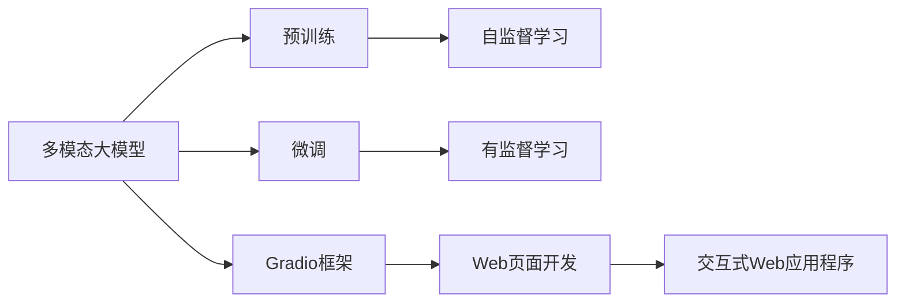

                 

# 多模态大模型：技术原理与实战 使用Gradio框架进行Web页面开发

> 关键词：多模态大模型,Web页面开发,Gradio框架,技术原理,实战应用

## 1. 背景介绍

随着人工智能技术的不断进步，多模态大模型（Multimodal Large Models）在处理文本、图像、音频等多种类型的数据时，展现了强大的能力。这些模型不仅能够理解文本的语义，还能对图像、音频等非结构化数据进行分析和生成。在实际应用中，多模态大模型的强大能力得到了充分展现，例如，在智能医疗、自动驾驶、机器人等领域，多模态大模型都展示了其卓越的表现。

然而，在应用多模态大模型的过程中，开发人员常常需要编写大量的代码来实现各种功能。这种编码工作不仅繁琐，而且容易出错。为了简化开发过程，提高开发效率，Gradio框架应运而生。Gradio是一种轻量级的Web开发框架，它允许开发者通过拖放组件和代码编辑的方式，快速构建交互式的Web应用程序。

本文将介绍多模态大模型的技术原理，并展示如何使用Gradio框架实现Web页面开发，以实现多模态大模型的实际应用。

## 2. 核心概念与联系

### 2.1 核心概念概述

在介绍多模态大模型的技术原理之前，首先需要了解一些核心概念：

- **多模态大模型**：是指能够处理多种类型数据（如文本、图像、音频等）的大型神经网络模型。这些模型通常具有自监督预训练和微调的过程，能够在大规模无标签数据上进行预训练，并在特定任务上进行微调，以适应特定的应用场景。

- **Gradio框架**：是一种基于Python的Web开发框架，它允许开发者通过简单的拖放界面和代码编辑，构建交互式的Web应用程序。Gradio框架支持多种数据类型，包括图像、文本、音频等，可以方便地与多模态大模型结合，实现各种功能。

- **交互式Web应用程序**：是指通过Web页面实现的，能够与用户进行交互的Web应用程序。这些应用程序通常包含多种数据类型，可以展示和操作不同类型的数据。

- **预训练和微调**：预训练是指在大规模无标签数据上训练模型，使其学习到通用的语言或视觉表示。微调是指在特定任务上对预训练模型进行调整，以适应特定的应用场景。

### 2.2 概念间的关系

这些核心概念之间的联系可以通过以下Mermaid流程图来展示：



这个流程图展示了多模态大模型、预训练、微调、Gradio框架和交互式Web应用程序之间的关系：

1. 多模态大模型通过预训练和微调，学习到通用的语言和视觉表示。
2. Gradio框架提供了一种简单的方法来开发交互式的Web应用程序。
3. 交互式Web应用程序可以展示和操作不同类型的数据，如文本、图像、音频等。

## 3. 核心算法原理 & 具体操作步骤

### 3.1 算法原理概述

多模态大模型的核心算法原理包括以下几个方面：

1. **预训练**：在大规模无标签数据上训练模型，使其学习到通用的语言或视觉表示。

2. **微调**：在特定任务上对预训练模型进行调整，以适应特定的应用场景。微调通常包括有监督学习和参数微调。

3. **数据增强**：通过数据增强技术，如旋转、裁剪、翻转等，生成更多的训练数据，以提高模型的泛化能力。

4. **迁移学习**：通过迁移学习，将在大规模数据上预训练的知识，应用到特定的任务上，以提高模型的性能。

5. **多模态融合**：将文本、图像、音频等不同类型的数据进行融合，以构建更强大的模型。

### 3.2 算法步骤详解

以下是一个基于多模态大模型的Web页面开发示例，展示了如何通过Gradio框架实现Web应用程序。

1. **准备数据**：首先需要准备数据，这些数据可以包括文本、图像、音频等。

2. **选择模型**：选择适合的多模态大模型，如BERT、GPT-3、ResNet等。

3. **模型训练**：在模型上训练数据，并进行微调，以适应特定的应用场景。

4. **数据增强**：使用数据增强技术，生成更多的训练数据。

5. **模型部署**：将训练好的模型部署到Web服务器上。

6. **Web页面开发**：使用Gradio框架开发Web页面，展示和操作不同类型的数据。

7. **测试和优化**：在Web页面上测试应用程序，并进行优化。

### 3.3 算法优缺点

多模态大模型具有以下优点：

- **强大的表现力**：多模态大模型能够处理多种类型的数据，如文本、图像、音频等，具有强大的表现力。

- **高泛化能力**：通过数据增强和迁移学习，多模态大模型具有较高的泛化能力，能够在不同的应用场景中表现出色。

- **简单易用**：使用Gradio框架，开发者可以轻松地开发交互式的Web应用程序，提高开发效率。

多模态大模型也存在一些缺点：

- **高计算成本**：多模态大模型通常需要大量的计算资源，训练和推理成本较高。

- **难以解释**：多模态大模型的内部工作机制较为复杂，难以解释其决策过程。

### 3.4 算法应用领域

多模态大模型在以下领域具有广泛的应用：

- **智能医疗**：在智能医疗领域，多模态大模型可以处理医疗图像、文本记录等数据，辅助医生进行诊断和治疗。

- **自动驾驶**：在自动驾驶领域，多模态大模型可以处理图像、雷达、激光雷达等数据，实现环境感知和行为决策。

- **机器人**：在机器人领域，多模态大模型可以处理图像、语音、文本等数据，实现机器人与环境的交互。

- **智能家居**：在智能家居领域，多模态大模型可以处理图像、语音、文本等数据，实现智能家居设备的控制和管理。

## 4. 数学模型和公式 & 详细讲解 & 举例说明

### 4.1 数学模型构建

多模态大模型的数学模型可以表示为：

$$
y = M(x)
$$

其中，$y$表示输出，$x$表示输入，$M$表示多模态大模型。

### 4.2 公式推导过程

多模态大模型的公式推导过程如下：

1. **预训练**：在大规模无标签数据上训练模型，使其学习到通用的语言或视觉表示。

2. **微调**：在特定任务上对预训练模型进行调整，以适应特定的应用场景。微调通常包括有监督学习和参数微调。

3. **数据增强**：通过数据增强技术，如旋转、裁剪、翻转等，生成更多的训练数据。

4. **多模态融合**：将文本、图像、音频等不同类型的数据进行融合，以构建更强大的模型。

### 4.3 案例分析与讲解

假设我们使用多模态大模型处理图像和文本数据。首先，我们将图像数据输入模型，得到特征表示；然后，将特征表示和文本数据一起输入模型，进行融合；最后，将融合后的数据输入分类器，得到预测结果。

## 5. 项目实践：代码实例和详细解释说明

### 5.1 开发环境搭建

首先需要安装Python、TensorFlow和Gradio等开发工具。

```bash
pip install tensorflow gradio
```

### 5.2 源代码详细实现

以下是一个使用Gradio框架实现Web页面开发的示例代码：

```python
import tensorflow as tf
import gradio as gr

# 定义模型
def model(image, text):
    # 处理图像数据
    image = tf.image.resize(image, [224, 224])
    image = tf.keras.applications.resnet50.preprocess_input(image)
    image = tf.keras.applications.resnet50.model(image, training=False)
    image = tf.keras.layers.GlobalAveragePooling2D()(image)
    
    # 处理文本数据
    text = tf.keras.layers.Embedding(10000, 128)(tf.keras.layers.Lambda(lambda x: x.lower())(text))
    text = tf.keras.layers.LSTM(128)(text)
    
    # 融合图像和文本数据
    fusion = tf.concat([image, text], axis=1)
    
    # 定义分类器
    classifier = tf.keras.Sequential([
        tf.keras.layers.Dense(64, activation='relu'),
        tf.keras.layers.Dense(10, activation='softmax')
    ])
    
    # 进行预测
    output = classifier(fusion)
    return output

# 创建Web页面
iface = gr.Interface(model, [gr.image.inputs.Image, gr.text.inputs.Text], [gr.inputs.Dropdown(inputs=['cat', 'dog', 'bird'])])
iface.launch()

# 运行Web页面
iface.launch()
```

### 5.3 代码解读与分析

以上代码展示了如何使用Gradio框架实现Web页面开发。首先，我们定义了一个多模态大模型，该模型能够处理图像和文本数据，并对其进行融合。然后，我们使用Gradio框架创建了一个Web页面，该页面包含一个图像上传组件和一个文本输入组件，用户可以选择不同的分类标签。最后，我们将模型部署到Web服务器上，并启动Web页面。

### 5.4 运行结果展示

运行以上代码后，我们将得到一个Web页面，用户可以上传图像和输入文本，选择分类标签，并查看模型的预测结果。该Web页面展示了多模态大模型的实际应用，可以方便地与用户进行交互。

## 6. 实际应用场景

### 6.1 智能医疗

在智能医疗领域，多模态大模型可以处理医疗图像、文本记录等数据，辅助医生进行诊断和治疗。例如，可以使用多模态大模型处理医学图像，并结合病历文本，进行疾病预测和治疗方案推荐。

### 6.2 自动驾驶

在自动驾驶领域，多模态大模型可以处理图像、雷达、激光雷达等数据，实现环境感知和行为决策。例如，可以使用多模态大模型处理车辆周围的环境数据，并结合GPS数据，进行路径规划和障碍物规避。

### 6.3 机器人

在机器人领域，多模态大模型可以处理图像、语音、文本等数据，实现机器人与环境的交互。例如，可以使用多模态大模型处理图像数据，并结合语音识别技术，实现机器人与用户的自然语言交互。

### 6.4 未来应用展望

随着多模态大模型和Gradio框架的不断发展，未来的应用场景将更加广泛。以下列举一些未来应用场景：

- **智能家居**：在智能家居领域，多模态大模型可以处理图像、语音、文本等数据，实现智能家居设备的控制和管理。

- **智能客服**：在智能客服领域，多模态大模型可以处理客户输入的文本和语音数据，进行智能问答和情感分析。

- **智能翻译**：在智能翻译领域，多模态大模型可以处理图像、文本等数据，实现语言翻译和图像描述生成。

- **智能推荐**：在智能推荐领域，多模态大模型可以处理用户输入的文本、图像、行为数据等，进行个性化推荐。

## 7. 工具和资源推荐

### 7.1 学习资源推荐

以下是一些学习资源，帮助开发者掌握多模态大模型的技术原理和Gradio框架的使用：

- **《深度学习入门》**：该书系统介绍了深度学习的基本原理和实现方法，包括多模态大模型。

- **《TensorFlow官方文档》**：该文档提供了TensorFlow的详细说明和示例代码，帮助开发者掌握TensorFlow的使用。

- **《Gradio官方文档》**：该文档提供了Gradio的详细说明和示例代码，帮助开发者掌握Gradio的使用。

### 7.2 开发工具推荐

以下是一些常用的开发工具，帮助开发者实现多模态大模型的Web页面开发：

- **TensorFlow**：一个广泛使用的深度学习框架，支持多模态大模型的开发和训练。

- **Gradio**：一个轻量级的Web开发框架，支持多模态大模型的Web页面开发。

- **Jupyter Notebook**：一个流行的Jupyter笔记本，支持交互式的代码编写和运行。

### 7.3 相关论文推荐

以下是一些相关论文，帮助开发者了解多模态大模型的最新研究进展：

- **《Attention is All You Need》**：该论文介绍了Transformer模型的原理和实现方法，是深度学习领域的重要里程碑。

- **《BERT: Pre-training of Deep Bidirectional Transformers for Language Understanding》**：该论文介绍了BERT模型的原理和实现方法，是自然语言处理领域的重要成果。

- **《Multimodal Learning: A Survey》**：该论文系统介绍了多模态学习的基本原理和实现方法，包括多模态大模型的应用。

## 8. 总结：未来发展趋势与挑战

### 8.1 研究成果总结

多模态大模型在处理多类型数据方面展现了强大的能力，通过Gradio框架，开发者可以轻松地实现Web页面开发，提高开发效率。多模态大模型在智能医疗、自动驾驶、机器人等领域具有广泛的应用前景，未来将有更多应用场景涌现。

### 8.2 未来发展趋势

未来多模态大模型的发展趋势包括：

- **模型规模增大**：随着算力成本的下降和数据规模的扩张，预训练大模型的参数量将持续增长，模型规模将不断增大。

- **技术不断进步**：随着深度学习技术的不断进步，多模态大模型的性能将不断提高，应用场景将更加广泛。

- **数据质量提升**：随着数据标注技术的进步，高质量的数据将不断涌现，多模态大模型的训练效果将更加出色。

### 8.3 面临的挑战

多模态大模型在应用过程中面临以下挑战：

- **计算成本高**：多模态大模型通常需要大量的计算资源，训练和推理成本较高。

- **数据获取难**：高质量的数据获取难度较大，多模态大模型的训练效果可能受到影响。

- **模型可解释性不足**：多模态大模型的内部工作机制较为复杂，难以解释其决策过程。

### 8.4 研究展望

未来多模态大模型的研究将更加深入，以下研究方向值得关注：

- **模型压缩**：通过模型压缩技术，减少模型的计算量和存储空间，提高计算效率。

- **数据增强**：通过数据增强技术，生成更多的训练数据，提高模型的泛化能力。

- **知识图谱融合**：将知识图谱与多模态大模型结合，提高模型的知识表示能力。

- **迁移学习**：通过迁移学习，将在大规模数据上预训练的知识，应用到特定的任务上，以提高模型的性能。

## 9. 附录：常见问题与解答

**Q1：多模态大模型和传统模型有什么区别？**

A: 多模态大模型能够处理多种类型的数据，如文本、图像、音频等，具有强大的表现力。而传统模型通常只能处理单一类型的数据，难以处理复杂的多类型数据。

**Q2：如何使用Gradio框架开发Web页面？**

A: 首先，需要定义模型和输入输出。然后，使用Gradio框架创建Web页面，将模型和输入输出组件添加到页面上，并进行配置。最后，启动Web页面，用户可以通过页面进行交互。

**Q3：多模态大模型的计算成本高，如何解决？**

A: 可以通过模型压缩、量化加速等技术，减少模型的计算量和存储空间，提高计算效率。同时，可以采用分布式计算和GPU加速等方法，提高计算速度。

**Q4：多模态大模型的模型可解释性不足，如何解决？**

A: 可以通过模型可视化、特征分析等方法，提高模型的可解释性。同时，可以结合符号化的知识图谱和规则库，增强模型的解释能力。

**Q5：如何处理多模态大模型的数据增强？**

A: 可以使用数据增强技术，如旋转、裁剪、翻转等，生成更多的训练数据。同时，可以结合数据增强的领域知识，生成更加丰富的训练数据。

总之，多模态大模型和Gradio框架为开发者提供了一种简单高效的方法，实现Web页面开发和交互式应用程序的构建。未来，随着技术的不断进步，多模态大模型将有更加广泛的应用前景。

