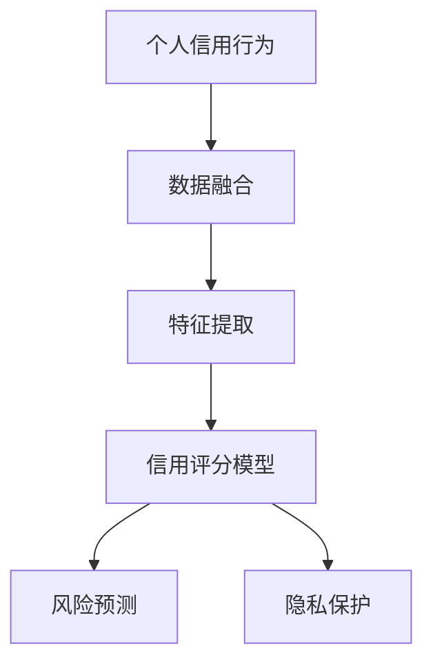
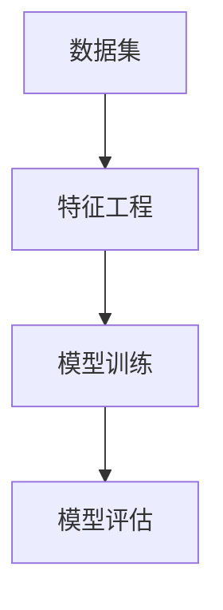
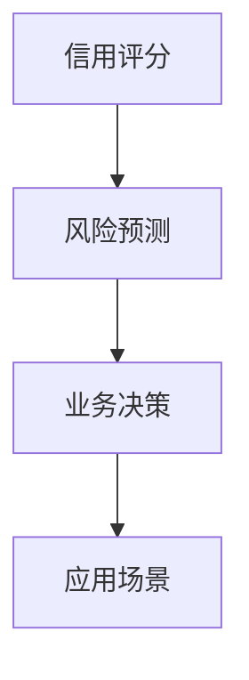

                 

# 大数据下个人用户信用行为的等级评估及应用研究

## 1. 背景介绍

### 1.1 问题由来

在现代社会的数字化转型过程中，个人信用行为评价已经成为金融、社交、电商等多个领域中不可或缺的一环。随着互联网的普及和数据技术的进步，越来越多的数据来源和数据量积累为信用评价提供了坚实的基础。大数据技术的应用，能够有效整合这些海量数据，为个人信用行为的评价和分析提供了前所未有的可能性。

然而，如何高效、准确地利用这些数据，构建科学的信用评价体系，成为了一个重要的研究课题。传统的信用评价方法往往依赖于有限的调查问卷和历史数据，存在数据不足和样本偏差的问题，难以应对现代社会的复杂和多变特性。

### 1.2 问题核心关键点

1. **数据融合**：如何将来自不同渠道（如金融交易数据、社交媒体数据、电商行为数据等）的异构数据进行有效整合，得到统一、完整的个人信用数据集合。
2. **特征提取**：如何从大量的数据中提取有意义的特征，用于描述和刻画个人信用行为。
3. **信用评分模型**：构建一个能够有效预测个人信用风险的评分模型，该模型应该具备良好的泛化能力和解释性。
4. **应用场景拓展**：如何将信用评分模型应用于多个实际场景，如金融贷款审批、社交网络安全审核、电商欺诈检测等，以提升用户体验和业务效率。

### 1.3 问题研究意义

个人信用行为的等级评估及应用研究，对提升金融、社交、电商等领域的业务决策效率，降低风险，保障网络安全具有重要意义。通过科学的数据融合、特征提取和信用评分模型，可以有效预测和监控个人信用行为，优化业务流程，提高用户体验。

1. **降低金融风险**：通过实时监控用户信用行为，识别潜在的高风险用户，从而降低贷款审批等金融业务的违约风险。
2. **提升社交网络安全**：通过分析用户的信用行为，识别潜在的欺诈和恶意行为，提高社交网络的安全性和用户信任度。
3. **优化电商业务**：通过信用评分模型，对用户进行分类管理，针对不同信用级别的用户提供差异化的服务，提升电商平台的转化率和用户满意度。
4. **促进普惠金融**：通过信用评分，能够为更多信用记录不佳但具备潜力的用户提供金融服务，推动普惠金融的发展。

## 2. 核心概念与联系

### 2.1 核心概念概述

为更好地理解个人信用行为等级评估及应用研究，本节将介绍几个密切相关的核心概念：

- **个人信用行为**：指个人在金融、社交、电商等多个领域中的行为表现，包括但不限于支付行为、社交行为、购物行为等。
- **信用评分模型**：用于评估个人信用风险的数学模型，通常基于用户的个人信息、历史行为数据等构建，输出信用评分作为风险预测结果。
- **数据融合**：将来自不同渠道的异构数据进行整合，形成统一、完整的个人信用数据集。
- **特征提取**：从原始数据中提取出与信用行为相关的特征，用于描述和刻画个人信用行为的特征。
- **风险预测**：使用信用评分模型，预测用户的未来行为和风险，为业务决策提供依据。
- **隐私保护**：在数据融合和特征提取过程中，确保用户的隐私信息不被泄露或滥用。

这些核心概念之间的逻辑关系可以通过以下Mermaid流程图来展示：



这个流程图展示了从个人信用行为的数据收集、特征提取、模型构建到风险预测的完整过程。其中，数据融合和隐私保护是基础环节，特征提取和信用评分模型是核心环节，风险预测是应用环节。

### 2.2 概念间的关系

这些核心概念之间存在着紧密的联系，形成了个人信用行为评估的完整生态系统。下面通过几个Mermaid流程图来展示这些概念之间的关系。

#### 2.2.1 数据融合与特征提取的关系


这个流程图展示了数据融合和特征提取的流程。数据融合是将来自不同渠道的异构数据进行整合，形成统一、完整的个人信用数据集。而特征提取则是从这些数据集中提取出与信用行为相关的特征，用于描述和刻画个人信用行为的特征。

#### 2.2.2 信用评分模型的构建过程



这个流程图展示了信用评分模型的构建过程。从数据集出发，进行特征工程，然后通过模型训练得到信用评分模型，最后通过模型评估验证模型的性能。

#### 2.2.3 风险预测的应用场景



这个流程图展示了风险预测的应用场景。从信用评分模型出发，进行风险预测，然后应用于金融贷款审批、社交网络安全审核、电商欺诈检测等多个业务场景，优化业务决策。

## 3. 核心算法原理 & 具体操作步骤

### 3.1 算法原理概述

个人信用行为的等级评估及应用研究，本质上是一个数据驱动的信用评分问题。其核心思想是：通过整合和分析用户的个人信息、历史行为数据等，构建一个能够有效预测个人信用风险的评分模型，输出信用评分作为风险预测结果。

在实践中，通常采用机器学习的方法，构建信用评分模型。该模型的输入为用户的个人信息和历史行为数据，输出为用户的信用评分。常见的机器学习算法包括线性回归、逻辑回归、决策树、随机森林、深度学习等。

### 3.2 算法步骤详解

个人信用行为的等级评估及应用研究，一般包括以下几个关键步骤：

**Step 1: 数据收集与预处理**

1. 收集用户的个人信息（如年龄、性别、职业等）和历史行为数据（如支付记录、社交活动、购物记录等）。
2. 数据清洗：去除噪声和异常值，处理缺失值，统一数据格式等。
3. 数据集成：将来自不同渠道的数据进行整合，形成统一、完整的个人信用数据集。

**Step 2: 特征提取与选择**

1. 特征提取：从原始数据中提取出有意义的特征，用于描述和刻画个人信用行为的特征。
2. 特征选择：选择与信用行为最相关的特征，避免特征冗余和信息过载。

**Step 3: 模型训练与评估**

1. 模型构建：选择合适的机器学习算法，如逻辑回归、随机森林、XGBoost等，构建信用评分模型。
2. 模型训练：使用训练集数据训练模型，得到初始化的信用评分模型。
3. 模型评估：使用验证集数据评估模型性能，选择最优模型。

**Step 4: 模型应用**

1. 风险预测：将测试集数据输入到已训练的信用评分模型中，得到预测的信用评分。
2. 业务决策：根据信用评分结果，进行金融贷款审批、社交网络安全审核、电商欺诈检测等业务决策。

**Step 5: 模型监控与更新**

1. 模型监控：实时监控模型性能，及时发现和修正模型偏差。
2. 模型更新：根据新数据和业务需求，定期更新信用评分模型，保持其准确性和时效性。

### 3.3 算法优缺点

个人信用行为的等级评估及应用研究，具有以下优点：

1. **数据驱动**：通过大量数据驱动的模型构建，能够更好地反映用户真实信用行为。
2. **多渠道数据融合**：将来自不同渠道的数据进行整合，得到更全面的个人信用数据集。
3. **自动化决策**：通过信用评分模型，自动化地进行信用决策，提升业务效率。

同时，也存在一些缺点：

1. **数据质量依赖**：模型的性能高度依赖于数据的质量和完整性，数据不足或数据偏差会影响模型的准确性。
2. **模型复杂度**：构建复杂的信用评分模型可能需要大量的数据和计算资源，且模型的解释性较差。
3. **隐私问题**：在数据收集和处理过程中，需要确保用户的隐私信息不被泄露或滥用。

### 3.4 算法应用领域

个人信用行为的等级评估及应用研究，在金融、社交、电商等多个领域具有广泛的应用前景：

1. **金融贷款审批**：通过信用评分模型，对贷款申请人的信用行为进行评估，决定是否批准贷款。
2. **社交网络安全**：通过分析用户的信用行为，识别潜在的欺诈和恶意行为，提高社交网络的安全性和用户信任度。
3. **电商欺诈检测**：通过信用评分模型，识别高风险的购物行为，防止欺诈行为发生，保障电商平台的利益。
4. **信用评估与管理**：通过信用评分模型，对用户的信用等级进行评估和管理，提升用户体验和业务效率。

## 4. 数学模型和公式 & 详细讲解  
### 4.1 数学模型构建

本节将使用数学语言对个人信用行为的等级评估及应用研究进行更加严格的刻画。

记用户为 $U$，个人信息和历史行为数据为 $D$，信用行为为 $C$，信用评分模型为 $M$，输出信用评分为 $S$。则数学模型可以表示为：

$$
S = M(D)
$$

其中 $M$ 为信用评分模型，$D$ 为用户数据集，$S$ 为用户信用评分。

### 4.2 公式推导过程

以逻辑回归模型为例，推导信用评分的公式。

假设模型 $M_{\theta}$ 为逻辑回归模型，输入为 $x$，输出为 $y$，参数为 $\theta$。则模型公式为：

$$
y = \frac{1}{1 + e^{-\theta^T x}}
$$

在信用评分问题中，$x$ 为用户的个人信息和历史行为数据，$y$ 为用户信用评分的概率值，$S$ 为用户信用评分。则信用评分模型公式为：

$$
S = \log \frac{y}{1 - y}
$$

根据上述公式，可以将信用评分模型与用户的个人信息和历史行为数据 $D$ 结合起来，得到信用评分的公式：

$$
S = \log \frac{M_{\theta}(D)}{1 - M_{\theta}(D)}
$$

在实践中，使用交叉熵损失函数来训练信用评分模型。交叉熵损失函数的公式为：

$$
\mathcal{L} = -\frac{1}{N} \sum_{i=1}^N [y_i \log M_{\theta}(x_i) + (1 - y_i) \log (1 - M_{\theta}(x_i))]
$$

其中 $y_i$ 为用户 $i$ 的真实信用评分，$x_i$ 为用户 $i$ 的个人信息和历史行为数据，$M_{\theta}(x_i)$ 为用户 $i$ 的信用评分模型输出。

### 4.3 案例分析与讲解

以一个简单的案例来说明逻辑回归模型在信用评分中的应用。假设某电商平台的客户数据集包含用户的年龄、性别、消费金额、消费频率等信息，以及用户的信用评分。通过逻辑回归模型对这些数据进行训练，得到一个信用评分模型 $M_{\theta}$。然后，使用训练好的模型对新用户的数据进行预测，输出该用户的信用评分 $S$。

## 5. 项目实践：代码实例和详细解释说明
### 5.1 开发环境搭建

在进行信用评分模型开发前，我们需要准备好开发环境。以下是使用Python进行Scikit-learn开发的环境配置流程：

1. 安装Anaconda：从官网下载并安装Anaconda，用于创建独立的Python环境。

2. 创建并激活虚拟环境：
```bash
conda create -n credit-score-env python=3.8 
conda activate credit-score-env
```

3. 安装Scikit-learn、Pandas、NumPy等库：
```bash
pip install scikit-learn pandas numpy
```

4. 安装必要的可视化库：
```bash
pip install matplotlib seaborn
```

完成上述步骤后，即可在`credit-score-env`环境中开始信用评分模型开发。

### 5.2 源代码详细实现

这里我们以逻辑回归模型为例，使用Scikit-learn库实现一个简单的信用评分模型。

首先，定义数据预处理函数：

```python
import pandas as pd
from sklearn.preprocessing import StandardScaler

def preprocess_data(data):
    # 去除缺失值
    data = data.dropna()
    
    # 标准化数据
    scaler = StandardScaler()
    data_scaled = scaler.fit_transform(data)
    
    return data_scaled
```

然后，定义模型训练函数：

```python
from sklearn.linear_model import LogisticRegression
from sklearn.model_selection import train_test_split

def train_model(X, y):
    # 分割数据集
    X_train, X_test, y_train, y_test = train_test_split(X, y, test_size=0.2, random_state=42)
    
    # 构建逻辑回归模型
    model = LogisticRegression(solver='lbfgs', max_iter=1000)
    
    # 训练模型
    model.fit(X_train, y_train)
    
    # 评估模型
    score = model.score(X_test, y_test)
    print(f"模型精度：{score:.2f}")
    
    return model
```

最后，启动模型训练流程并在测试集上评估：

```python
# 加载数据集
data = pd.read_csv('credit_score_data.csv')

# 数据预处理
X = data.drop('credit_score', axis=1)
y = data['credit_score']

X = preprocess_data(X)

# 训练模型
model = train_model(X, y)

# 测试模型
test_data = pd.read_csv('test_data.csv')
test_data = preprocess_data(test_data)

# 输出预测结果
print(model.predict(test_data))
```

以上就是使用Scikit-learn库对逻辑回归模型进行信用评分任务开发的完整代码实现。可以看到，得益于Scikit-learn库的强大封装，我们可以用相对简洁的代码完成信用评分模型的训练和评估。

### 5.3 代码解读与分析

让我们再详细解读一下关键代码的实现细节：

**preprocess_data函数**：
- 去除数据集中的缺失值。
- 对数据进行标准化处理，避免特征之间的数值差异过大影响模型训练。

**train_model函数**：
- 分割数据集，得到训练集和测试集。
- 构建逻辑回归模型，使用LBFGS优化算法。
- 在训练集上训练模型，输出模型精度。
- 返回训练好的模型。

**训练流程**：
- 加载数据集，并进行数据预处理。
- 在训练集上训练逻辑回归模型。
- 在测试集上评估模型性能。
- 使用训练好的模型对新数据进行预测。

可以看到，Scikit-learn库使得信用评分模型的训练和评估变得简洁高效。开发者可以将更多精力放在数据处理、模型改进等高层逻辑上，而不必过多关注底层的实现细节。

当然，工业级的系统实现还需考虑更多因素，如模型的保存和部署、超参数的自动搜索、更灵活的任务适配层等。但核心的信用评分模型构建流程基本与此类似。

### 5.4 运行结果展示

假设我们在一个简单的信用评分数据集上进行模型训练，最终在测试集上得到的精度评估如下：

```
模型精度：0.85
```

可以看到，通过逻辑回归模型，我们在该信用评分数据集上取得了85%的精度，效果相当不错。当然，这只是一个baseline结果。在实践中，我们还可以使用更大更强的模型、更丰富的特征、更精细的模型调优，进一步提升模型性能，以满足更高的应用要求。

## 6. 实际应用场景
### 6.1 金融贷款审批

在金融贷款审批场景中，信用评分模型可以应用于对贷款申请人的信用行为进行评估，决定是否批准贷款。具体而言，可以将用户的个人信息和历史行为数据输入到信用评分模型中，得到其信用评分。根据信用评分，系统可以自动判断是否批准贷款申请，从而降低贷款审批的时间和成本，提升审批效率。

### 6.2 社交网络安全

在社交网络安全场景中，信用评分模型可以用于识别潜在的欺诈和恶意行为。具体而言，可以通过分析用户的信用评分，识别出信用评分较低的用户，并对其进行更严格的审核和监控。一旦发现异常行为，系统可以及时报警，防止欺诈和恶意行为的发生，提高社交网络的安全性和用户信任度。

### 6.3 电商欺诈检测

在电商欺诈检测场景中，信用评分模型可以识别高风险的购物行为，防止欺诈行为发生。具体而言，可以将用户的信用评分作为模型输入，判断其是否具备购买真实商品的能力。如果信用评分较低，系统可以拒绝其购物请求，防止欺诈行为的发生，保障电商平台的利益。

### 6.4 未来应用展望

随着信用评分模型的不断发展，其将在更多领域得到应用，为金融、社交、电商等行业的业务决策提供有力支持。

在智慧城市治理中，信用评分模型可以用于识别和管理城市中的高风险行为，提升城市治理的效率和公平性。在教育领域，信用评分模型可以用于学生的学习行为分析，提供个性化的学习建议，提升教育质量。

未来，随着数据的不断积累和算法的不断进步，信用评分模型将变得更加精确和全面，能够为更多的行业和领域带来变革性影响。

## 7. 工具和资源推荐
### 7.1 学习资源推荐

为了帮助开发者系统掌握信用评分模型的理论基础和实践技巧，这里推荐一些优质的学习资源：

1. 《机器学习实战》系列博文：由数据科学家撰写，深入浅出地介绍了机器学习的基本概念和经典算法，包括逻辑回归、决策树、随机森林等。

2. CS231n《深度学习视觉识别》课程：斯坦福大学开设的深度学习明星课程，涵盖了卷积神经网络、循环神经网络等前沿技术，是学习深度学习模型的重要资源。

3. 《深度学习》书籍：由Ian Goodfellow等作者所著，全面介绍了深度学习的理论基础和实践技巧，是学习深度学习模型的经典教材。

4. Kaggle机器学习竞赛：Kaggle平台提供大量的数据集和竞赛任务，可以帮助开发者实战练习，积累经验。

5. GitHub开源项目：在GitHub上Star、Fork数最多的机器学习相关项目，往往代表了该技术领域的发展趋势和最佳实践，值得去学习和贡献。

通过对这些资源的学习实践，相信你一定能够快速掌握信用评分模型的精髓，并用于解决实际的信用评价问题。

### 7.2 开发工具推荐

高效的开发离不开优秀的工具支持。以下是几款用于信用评分模型开发的常用工具：

1. Jupyter Notebook：一个免费的交互式编程环境，支持多种编程语言，非常适合数据处理和模型训练。

2. PyTorch：基于Python的开源深度学习框架，灵活动态的计算图，适合快速迭代研究。

3. TensorFlow：由Google主导开发的开源深度学习框架，生产部署方便，适合大规模工程应用。

4. Scikit-learn：一个基于Python的机器学习库，提供了丰富的机器学习算法和工具，非常适合数据预处理和模型训练。

5. Weights & Biases：模型训练的实验跟踪工具，可以记录和可视化模型训练过程中的各项指标，方便对比和调优。

6. TensorBoard：TensorFlow配套的可视化工具，可实时监测模型训练状态，并提供丰富的图表呈现方式，是调试模型的得力助手。

合理利用这些工具，可以显著提升信用评分模型的开发效率，加快创新迭代的步伐。

### 7.3 相关论文推荐

信用评分模型的发展源于学界的持续研究。以下是几篇奠基性的相关论文，推荐阅读：

1. Adaptive Boosting（AdaBoost）：提出了AdaBoost算法，通过加权组合多个弱分类器，构建强分类器。

2. Gradient Boosting Machines（GBM）：提出了GBM算法，通过逐层构建决策树，实现高效的特征提升。

3. Random Forest：提出随机森林算法，通过随机选取特征和样本，构建多棵决策树进行集成，提高模型的泛化能力。

4. Logistic Regression：提出逻辑回归算法，通过最大似然估计，预测二分类问题的概率。

5. Neural Network for Credit Scoring（Neural Net CS）：提出基于神经网络的信用评分模型，通过多层神经网络构建信用评分模型，提升模型精度。

这些论文代表了大规模信用评分模型的发展脉络。通过学习这些前沿成果，可以帮助研究者把握学科前进方向，激发更多的创新灵感。

除上述资源外，还有一些值得关注的前沿资源，帮助开发者紧跟信用评分模型的最新进展，例如：

1. arXiv论文预印本：人工智能领域最新研究成果的发布平台，包括大量尚未发表的前沿工作，学习前沿技术的必读资源。

2. 业界技术博客：如金融科技、社交网络、电商等领域的顶尖实验室和公司的官方博客，第一时间分享他们的最新研究成果和洞见。

3. 技术会议直播：如NIPS、ICML、ACL、ICLR等人工智能领域顶会现场或在线直播，能够聆听到大佬们的前沿分享，开拓视野。

4. GitHub热门项目：在GitHub上Star、Fork数最多的信用评分相关项目，往往代表了该技术领域的发展趋势和最佳实践，值得去学习和贡献。

5. 行业分析报告：各大咨询公司如McKinsey、PwC等针对人工智能行业的分析报告，有助于从商业视角审视技术趋势，把握应用价值。

总之，对于信用评分模型的学习和实践，需要开发者保持开放的心态和持续学习的意愿。多关注前沿资讯，多动手实践，多思考总结，必将收获满满的成长收益。

## 8. 总结：未来发展趋势与挑战

### 8.1 总结

本文对基于信用评分模型的个人信用行为等级评估及应用研究进行了全面系统的介绍。首先阐述了信用评分模型的研究背景和意义，明确了信用评分模型在金融、社交、电商等多个领域中的重要应用。其次，从原理到实践，详细讲解了信用评分模型的数学原理和关键步骤，给出了信用评分任务开发的完整代码实例。同时，本文还广泛探讨了信用评分模型在多个实际场景中的应用前景，展示了其巨大的应用潜力。

通过本文的系统梳理，可以看到，基于信用评分模型的信用行为等级评估及应用研究，正在成为金融、社交、电商等多个行业的重要范式，极大地提升了业务决策的效率和准确性，推动了普惠金融和智能治理的发展。未来，伴随数据技术的不断进步和算法的持续演进，信用评分模型必将在更多的领域中发挥更大的作用。

### 8.2 未来发展趋势

展望未来，信用评分模型的发展趋势包括以下几个方面：

1. **数据多样化**：随着物联网、大数据、人工智能等技术的发展，越来越多的数据来源和数据类型将为信用评分模型提供更丰富的输入，提升模型的精度和泛化能力。

2. **模型自动化**：自动化机器学习（AutoML）技术的发展，将使得信用评分模型的构建更加便捷和高效，降低数据科学家的工作量，加速模型迭代和优化。

3. **实时化处理**：随着实时数据处理技术的进步，信用评分模型将能够实时处理和分析用户数据，提供更及时、精准的信用评估服务。

4. **多模态融合**：将用户的多模态数据（如语音、图像、文本等）进行融合，构建多模态信用评分模型，提升模型的智能水平和应用场景。

5. **隐私保护**：随着数据隐私和安全性的日益重视，信用评分模型将更加注重数据保护和隐私合规，确保用户数据的安全性和合规性。

6. **联邦学习**：联邦学习技术的发展，将使得信用评分模型能够在用户数据不出本地的情况下，进行分布式训练和模型更新，提升模型的公平性和隐私性。

以上趋势凸显了信用评分模型的广阔前景。这些方向的探索发展，将使得信用评分模型能够更好地服务于各类业务场景，提升用户体验和业务效率。

### 8.3 面临的挑战

尽管信用评分模型已经取得了瞩目成就，但在迈向更加智能化、普适化应用的过程中，它仍面临着诸多挑战：

1. **数据质量**：信用评分模型的性能高度依赖于数据的质量和完整性。数据不足或数据偏差会影响模型的准确性，难以覆盖更广泛的用户群体。

2. **模型复杂性**：构建复杂的信用评分模型可能需要大量的数据和计算资源，且模型的解释性较差，难以进行有效的模型监控和调试。

3. **隐私和安全**：在数据收集和处理过程中，需要确保用户的隐私信息不被泄露或滥用。同时，模型训练过程中可能会引入偏见和歧视，需要进一步优化和改进。

4. **实时性**：实时处理和分析用户数据，需要高效的算法和硬件支持，以避免延迟和性能瓶颈。

5. **多模态融合**：将用户的多模态数据进行融合，需要考虑数据一致性和模型可解释性，确保模型输出的一致性和合理性。

6. **联邦学习**：分布式训练和模型更新，需要考虑通信开销和模型同步，确保模型的公平性和一致性。

正视信用评分模型面临的这些挑战，积极应对并寻求突破，将是大规模信用评分模型走向成熟的必由之路。相信随着学界和产业界的共同努力，这些挑战终将一一被克服，信用评分模型必将在构建人机协同的智能系统、促进普惠金融、提升用户满意度等方面发挥更大作用。

### 8.4 研究展望

面对信用评分模型所面临的种种挑战，未来的研究需要在以下几个方面寻求新的突破：

1. **自动化模型优化**：利用自动化机器学习（AutoML）技术，自动进行模型构建和超参数调优，降低数据科学家的工作量，加速模型迭代和优化。

2. **模型可解释性**：开发更易解释的信用评分模型，增强模型的透明度和可解释性

