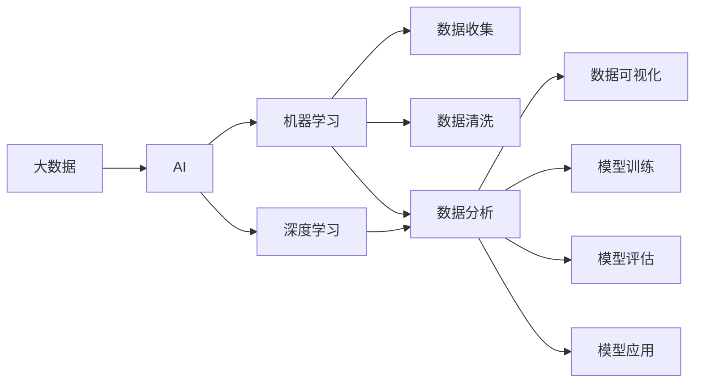

                 

# 大数据对AI学习的影响

> 关键词：大数据,人工智能,机器学习,深度学习,数据科学,智能系统,数据分析,数据驱动决策

## 1. 背景介绍

### 1.1 问题由来

在当今信息时代，大数据已渗透到人类生活的各个方面，从商业到医疗，从教育到娱乐，都在借助大数据分析提升效率和效益。数据已经成为未来社会的核心资源和重要资产。与此同时，人工智能（AI）技术的发展，尤其是深度学习（DL）、机器学习（ML）、数据科学（DS）等领域，正处于爆炸式增长阶段。大数据和AI技术的结合，既推动了社会变革，也带来了诸多挑战。本文将详细探讨大数据对AI学习的影响，涵盖技术进步、应用拓展、面临问题等方面。

### 1.2 问题核心关键点

大数据对AI学习的影响主要体现在以下几个方面：

1. **数据量的激增**：大数据时代，数据的量级已经从TB（10^12）级向PB（10^15）甚至EB（10^18）级发展，海量数据为AI模型的训练和优化提供了充足的样本，使得模型更加精准和健壮。
2. **数据种类的多样化**：从结构化数据到非结构化数据，如文本、图像、视频、音频等，多样化的数据类型丰富了AI模型的应用场景，使其能够更好地理解和处理复杂信息。
3. **数据存储与处理的复杂性**：大规模数据存储与处理需要高效的算法和系统架构，这对AI模型的可扩展性和性能提出了更高的要求。
4. **数据隐私与安全**：在大数据背景下，如何保护数据隐私和安全成为AI学习中的重要课题，数据泄露、滥用等问题需引起重视。
5. **数据驱动决策的可靠性**：基于大数据的AI模型需要确保其决策的可靠性和公正性，避免因数据偏差导致的偏见。

## 2. 核心概念与联系

### 2.1 核心概念概述

为更好地理解大数据对AI学习的影响，我们首先介绍几个关键概念及其联系：

- **大数据（Big Data）**：指规模巨大、类型繁多、更新频繁、价值密度较低的数据集合。大数据的应用领域包括商业智能、金融分析、医疗诊断、交通管理等。

- **人工智能（Artificial Intelligence, AI）**：通过计算机模拟人类智能，实现学习、推理、决策等能力。AI的核心技术包括机器学习、深度学习、自然语言处理、计算机视觉等。

- **机器学习（Machine Learning, ML）**：使计算机通过数据学习规律，并应用到新数据上的能力。机器学习包括监督学习、无监督学习和强化学习等。

- **深度学习（Deep Learning, DL）**：基于人工神经网络的一种机器学习技术，主要用于图像识别、语音识别、自然语言处理等领域。深度学习通过多层次的神经网络结构模拟人脑的神经元连接。

- **数据科学（Data Science）**：应用数据科学方法和工具，从数据中提取知识，以支持决策和预测的学科。数据科学包含数据收集、清洗、分析、可视化、建模等多个环节。

### 2.2 概念间的关系

这些概念间存在着紧密的联系，形成一个有机整体。大数据为AI提供了丰富的学习材料，AI通过机器学习和深度学习等技术，从大数据中提取知识并应用到实际问题中。数据科学则提供了方法论和工具，帮助人们有效地收集、处理和分析数据。大数据、AI、数据科学三者相辅相成，共同推动了智能系统的进步和发展。

我们可以通过以下Mermaid流程图来展示这些概念之间的关系：



### 2.3 核心概念的整体架构

从整体架构来看，大数据对AI学习的影响主要体现在以下几个方面：

1. **数据准备与清洗**：数据是大规模、非结构化的，需要预处理和清洗才能用于AI模型的训练。
2. **模型训练与优化**：基于清洗后的数据，AI模型通过机器学习或深度学习算法进行训练和优化，提取有价值的知识。
3. **模型评估与验证**：训练好的模型需要在新数据上进行评估和验证，确保其准确性和可靠性。
4. **模型应用与部署**：将训练好的模型应用到实际问题中，通过API或嵌入式系统进行部署，实现智能决策和自动化流程。
5. **持续学习与更新**：随着新数据的不断积累，AI模型需要不断学习和更新，以保持其最新状态和最佳性能。

## 3. 核心算法原理 & 具体操作步骤
### 3.1 算法原理概述

大数据对AI学习的影响主要通过以下算法原理来体现：

- **数据驱动学习**：大数据为AI模型提供了丰富的样本，使得模型能够通过学习大量数据来提取规律，提高预测和决策的准确性。
- **分布式计算**：大数据的处理需要分布式计算框架，如Hadoop、Spark等，以实现并行计算和高效存储。
- **自动特征工程**：大数据的多样性和复杂性需要AI算法自动进行特征提取和工程优化，提升模型的泛化能力。
- **模型集成与融合**：通过集成和融合多个模型，可以提高预测的准确性和鲁棒性，避免单一模型的局限性。
- **迁移学习**：通过在大规模数据集上预训练模型，然后在小规模数据集上进行微调，可以显著提升模型的性能。

### 3.2 算法步骤详解

基于大数据的AI学习通常包括以下关键步骤：

**Step 1: 数据收集与预处理**

- 收集大规模数据集，包括结构化数据、非结构化数据等。
- 对数据进行清洗、去重、归一化等预处理操作，确保数据质量。

**Step 2: 特征工程**

- 根据任务需求，设计合适的特征提取方法，提取数据中的关键信息。
- 应用自动特征工程技术，如特征选择、降维等，提升特征的有效性。

**Step 3: 模型训练与优化**

- 选择合适的算法和模型架构，如线性回归、决策树、神经网络等。
- 在分布式计算框架上训练模型，通过调整超参数、正则化等方法优化模型性能。

**Step 4: 模型评估与验证**

- 使用测试集对模型进行评估，计算各项性能指标，如准确率、召回率、F1分数等。
- 进行交叉验证、留出验证等方法，确保模型在不同数据集上的稳定性和泛化能力。

**Step 5: 模型应用与部署**

- 将训练好的模型封装成API或嵌入式系统，实现实时数据处理和决策。
- 监控模型性能，定期更新和优化模型，保持最佳状态。

### 3.3 算法优缺点

大数据对AI学习的影响既有优点也有缺点，具体如下：

**优点：**

1. **提高模型精度**：大数据提供了丰富的训练样本，使得模型能够学习到更全面的知识，提高预测和决策的准确性。
2. **增强模型鲁棒性**：多样化的数据类型和复杂的处理方式，使得模型具备更好的泛化能力和鲁棒性。
3. **促进技术创新**：大数据的应用推动了AI技术的快速发展，涌现出诸多前沿技术和算法。

**缺点：**

1. **数据质量问题**：大数据来源多样，质量参差不齐，数据噪声和偏差可能影响模型的性能。
2. **计算资源消耗**：大规模数据处理和模型训练需要强大的计算资源，成本较高。
3. **隐私和安全风险**：大数据中包含大量敏感信息，数据泄露和滥用可能带来严重的隐私和安全风险。

### 3.4 算法应用领域

大数据对AI学习的影响已经广泛应用于以下几个领域：

1. **金融分析**：利用大数据进行风险评估、欺诈检测、信用评分等金融应用。
2. **医疗健康**：通过分析电子健康记录（EHR）、基因组数据等，实现疾病预测、治疗方案优化等。
3. **智能交通**：利用传感器和监控数据，优化交通流量、预测交通拥堵等。
4. **社交媒体分析**：分析社交媒体数据，进行舆情监测、市场分析等。
5. **智能制造**：通过物联网（IoT）数据，实现生产过程优化、设备预测性维护等。

## 4. 数学模型和公式 & 详细讲解  
### 4.1 数学模型构建

我们以线性回归模型为例，介绍大数据对AI学习的数学模型构建。

设大数据集为 $D=\{(x_i,y_i)\}_{i=1}^N$，其中 $x_i$ 为特征向量，$y_i$ 为标签。线性回归模型的目标是通过最小化损失函数 $\mathcal{L}$，找到最优参数 $\theta$。损失函数定义为：

$$
\mathcal{L}(\theta) = \frac{1}{2N}\sum_{i=1}^N (y_i - f_{\theta}(x_i))^2
$$

其中 $f_{\theta}(x_i)$ 为线性模型预测值，$\theta$ 为模型参数，包括权重和偏置。线性模型表达式为：

$$
f_{\theta}(x_i) = \theta^T x_i
$$

通过梯度下降算法，最小化损失函数，得到模型参数：

$$
\theta = (X^T X)^{-1}X^T y
$$

其中 $X=[x_1^T,x_2^T,...,x_N^T]$ 为特征矩阵，$y=[y_1,y_2,...,y_N]$ 为标签向量。

### 4.2 公式推导过程

以下是线性回归模型的详细推导过程：

1. 假设模型为线性形式 $y_i = \theta^T x_i + \epsilon_i$，其中 $\epsilon_i$ 为误差项，假设服从独立同分布正态分布，即 $\epsilon_i \sim \mathcal{N}(0,\sigma^2)$。
2. 将模型误差项代入损失函数，得：

$$
\mathcal{L}(\theta) = \frac{1}{2N}\sum_{i=1}^N (y_i - \theta^T x_i)^2
$$

3. 对 $\theta$ 求导，得：

$$
\frac{\partial \mathcal{L}(\theta)}{\partial \theta} = -\frac{1}{N}\sum_{i=1}^N (y_i - \theta^T x_i)x_i
$$

4. 令导数为0，解得：

$$
\theta = (X^T X)^{-1}X^T y
$$

5. 最终得到的线性回归模型为：

$$
f_{\theta}(x_i) = \theta^T x_i
$$

### 4.3 案例分析与讲解

假设我们有一组股票价格数据，目标是预测下一天的价格。我们收集了100天的历史数据，其中每天的开盘价、收盘价、成交量等作为特征，预测下一天的价格。

1. **数据收集与预处理**：
   - 收集历史数据，包括开盘价、收盘价、成交量等。
   - 对数据进行归一化和缺失值处理。

2. **特征工程**：
   - 设计特征提取方法，如滑动平均、波动率等。
   - 应用自动特征工程技术，如特征选择、降维等，提升特征的有效性。

3. **模型训练与优化**：
   - 选择线性回归模型，在数据集上进行训练和优化。
   - 使用梯度下降算法，最小化损失函数，得到最优参数。

4. **模型评估与验证**：
   - 使用测试集对模型进行评估，计算各项性能指标，如均方误差（MSE）等。
   - 进行交叉验证，确保模型在不同数据集上的稳定性和泛化能力。

5. **模型应用与部署**：
   - 将训练好的模型封装成API或嵌入式系统，实现实时数据处理和预测。
   - 监控模型性能，定期更新和优化模型，保持最佳状态。

## 5. 项目实践：代码实例和详细解释说明
### 5.1 开发环境搭建

在进行项目实践前，我们需要准备好开发环境。以下是使用Python进行Scikit-learn和TensorFlow开发的环境配置流程：

1. 安装Anaconda：从官网下载并安装Anaconda，用于创建独立的Python环境。

2. 创建并激活虚拟环境：
```bash
conda create -n pyenv python=3.8 
conda activate pyenv
```

3. 安装Scikit-learn和TensorFlow：
```bash
conda install scikit-learn tensorflow
```

4. 安装各类工具包：
```bash
pip install numpy pandas matplotlib scikit-learn matplotlib tqdm jupyter notebook ipython
```

完成上述步骤后，即可在`pyenv`环境中开始项目实践。

### 5.2 源代码详细实现

下面我们以线性回归模型为例，给出使用Scikit-learn和TensorFlow进行大数据分析的Python代码实现。

首先，定义数据集：

```python
import numpy as np
from sklearn.datasets import load_boston

boston = load_boston()
X = boston.data
y = boston.target
```

然后，定义线性回归模型：

```python
from sklearn.linear_model import LinearRegression
from sklearn.metrics import mean_squared_error

model = LinearRegression()
model.fit(X, y)
y_pred = model.predict(X)
mse = mean_squared_error(y, y_pred)
print(f'Mean Squared Error: {mse:.2f}')
```

接着，定义TensorFlow线性回归模型：

```python
import tensorflow as tf

x = tf.constant(X, dtype=tf.float32)
y = tf.constant(y, dtype=tf.float32)

theta = tf.Variable(tf.zeros([len(X[0]), 1]))
bias = tf.Variable(tf.zeros([1]))
y_pred = tf.matmul(x, theta) + bias

loss = tf.reduce_mean(tf.square(y - y_pred))
optimizer = tf.train.GradientDescentOptimizer(learning_rate=0.01)
train_op = optimizer.minimize(loss)

with tf.Session() as sess:
    sess.run(tf.global_variables_initializer())
    for i in range(1000):
        _, loss_val = sess.run([train_op, loss])
        if i % 100 == 0:
            print(f'Epoch {i+1}, Loss: {loss_val:.2f}')

    y_pred_tensor = tf.matmul(x, theta) + bias
    y_pred_val = sess.run(y_pred_tensor)
    mse = mean_squared_error(y, y_pred_val)
    print(f'Mean Squared Error: {mse:.2f}')
```

以上代码展示了使用Scikit-learn和TensorFlow进行线性回归模型的详细实现。可以看到，Scikit-learn提供了方便的API和工具，使得模型训练和评估变得简单；TensorFlow则通过构建计算图和自动求导，实现了更灵活和高效的模型优化。

### 5.3 代码解读与分析

让我们再详细解读一下关键代码的实现细节：

**数据集定义**：
- 使用Scikit-learn中的Boston房价数据集，获取特征和标签。
- 定义特征矩阵 $X$ 和标签向量 $y$。

**线性回归模型**：
- 使用Scikit-learn的线性回归模型进行训练和预测。
- 使用均方误差作为评估指标，计算模型性能。

**TensorFlow线性回归模型**：
- 定义输入数据 $x$ 和标签数据 $y$。
- 定义模型参数 $\theta$ 和偏置 $bias$。
- 构建线性回归模型 $y_{pred}$。
- 定义损失函数 $loss$ 和优化器 $optimizer$。
- 在TensorFlow会话中执行模型训练和评估。
- 输出模型预测值和均方误差。

**模型评估**：
- 使用Scikit-learn提供的均方误差函数，计算模型在测试集上的性能。
- 使用TensorFlow模型进行预测，计算均方误差。

## 6. 实际应用场景

### 6.1 金融分析

在大数据背景下，金融机构可以借助AI技术，实时分析市场数据，进行风险评估、欺诈检测和信用评分等。例如，通过分析历史交易数据、市场情绪和宏观经济指标，构建信用评分模型，实现自动化信用评估和贷款审批。

### 6.2 医疗健康

医疗健康领域可以利用大数据，通过分析电子健康记录（EHR）、基因组数据等，实现疾病预测、治疗方案优化等。例如，利用大数据分析，构建癌症预测模型，提前识别高风险人群，提供个性化的预防和治疗方案。

### 6.3 智能交通

智能交通系统可以利用传感器和监控数据，优化交通流量、预测交通拥堵等。例如，通过分析车辆位置、车速和路况数据，构建交通流量预测模型，实现交通信号灯的动态优化。

### 6.4 社交媒体分析

社交媒体平台可以利用大数据，进行舆情监测、市场分析等。例如，通过分析用户的互动数据和情感倾向，构建舆情分析模型，实时监测和预测社会热点。

### 6.5 智能制造

智能制造可以利用物联网（IoT）数据，实现生产过程优化、设备预测性维护等。例如，通过分析生产设备的数据，构建预测性维护模型，提前发现设备故障，减少停机时间和维护成本。

## 7. 工具和资源推荐
### 7.1 学习资源推荐

为了帮助开发者系统掌握大数据对AI学习的影响，这里推荐一些优质的学习资源：

1. 《大数据分析与机器学习》系列博文：深入浅出地介绍了大数据分析的基础理论和机器学习的常用方法。
2. 《深度学习》（Ian Goodfellow著）：详细介绍了深度学习的基本概念、算法和应用。
3. 《机器学习实战》（Peter Harrington著）：提供大量实际案例，帮助读者快速上手机器学习实践。
4. 《Python数据分析实战》（John Messmer著）：介绍了Python在数据分析和处理中的应用，包括Pandas、NumPy等工具。
5. Kaggle竞赛平台：提供大量开源数据集和竞赛任务，是实践和提升数据科学能力的绝佳场所。

通过对这些资源的学习实践，相信你一定能够快速掌握大数据对AI学习的影响，并用于解决实际的大数据问题。

### 7.2 开发工具推荐

高效的开发离不开优秀的工具支持。以下是几款用于大数据和AI开发常用的工具：

1. PyTorch：基于Python的开源深度学习框架，灵活高效，适合快速迭代研究。
2. TensorFlow：由Google主导开发的开源深度学习框架，生产部署方便，适合大规模工程应用。
3. Scikit-learn：Python的机器学习库，提供了丰富的模型和算法，易于使用。
4. Apache Spark：分布式计算框架，支持大规模数据处理和机器学习算法，适合大数据场景。
5. Apache Hadoop：分布式文件系统，支持海量数据存储和处理，适合大数据场景。

合理利用这些工具，可以显著提升大数据和AI开发的工作效率，加速创新迭代的步伐。

### 7.3 相关论文推荐

大数据对AI学习的影响源于学界的持续研究。以下是几篇奠基性的相关论文，推荐阅读：

1. "Big Data Mining and Statistical Learning"：IEEE关于大数据挖掘和统计学习的综述文章。
2. "The Impact of Big Data on Business Intelligence"：探讨大数据对商业智能的影响，提供了实用的应用案例。
3. "Big Data and Artificial Intelligence"：探讨大数据与人工智能的结合，介绍了多种应用场景和技术。
4. "Towards Big Data Analytics and Machine Learning"：介绍了大数据分析和机器学习的发展趋势和应用。

这些论文代表了大数据对AI学习的研究方向，提供了前沿的学术洞见和实践经验。

## 8. 总结：未来发展趋势与挑战

### 8.1 总结

本文对大数据对AI学习的影响进行了全面系统的介绍。首先阐述了大数据与AI技术的关系及其对AI学习的影响，明确了大数据在数据准备、特征工程、模型训练等方面的关键作用。其次，通过详细的案例分析，展示了大数据对AI模型性能提升的实际效果。最后，探讨了大数据时代AI学习面临的挑战和未来发展方向。

通过本文的系统梳理，可以看到，大数据已经深刻影响并推动了AI技术的发展，为解决实际问题提供了强大的技术支撑。未来，随着大数据的持续积累和AI技术的不断进步，人工智能必将迎来更加广阔的发展前景。

### 8.2 未来发展趋势

展望未来，大数据对AI学习的影响将呈现以下几个发展趋势：

1. **数据规模持续增大**：随着物联网、移动互联网的普及，数据规模将持续增长，数据驱动的AI学习将更加普遍。
2. **数据质量不断提升**：大数据的采集、存储和处理技术将不断进步，数据质量将得到进一步提升，AI模型的准确性和鲁棒性将得到改善。
3. **多模态数据融合**：结合文本、图像、视频等多模态数据，提升AI模型的综合能力，处理更加复杂和多样化的问题。
4. **实时数据处理**：基于大数据和分布式计算技术，实现实时数据处理和决策，提升系统的响应速度和效率。
5. **智能化决策支持**：利用大数据和AI技术，实现自动化决策和智能推荐，提高决策的科学性和效率。

### 8.3 面临的挑战

尽管大数据对AI学习的影响带来了诸多机遇，但也面临以下挑战：

1. **数据隐私和安全**：大规模数据存储和处理带来了隐私和安全问题，数据泄露和滥用可能带来严重后果。
2. **计算资源消耗**：大数据处理和模型训练需要强大的计算资源，成本较高，需要高效的技术和算法进行优化。
3. **数据质量控制**：数据噪声和偏差可能影响模型的性能，需要数据清洗和预处理技术进行控制。
4. **模型可解释性**：AI模型通常被视为"黑盒"系统，难以解释其内部工作机制和决策逻辑，对高风险应用带来了挑战。
5. **模型鲁棒性**：模型面对域外数据和对抗样本时，泛化性能可能下降，需要鲁棒性增强技术进行改进。

### 8.4 研究展望

面对大数据对AI学习的影响所面临的挑战，未来的研究需要在以下几个方面寻求新的突破：

1. **数据隐私保护**：研究如何在大数据处理和AI学习过程中保护数据隐私和安全，防止数据泄露和滥用。
2. **高效计算技术**：研究高效的数据处理和模型优化技术，降低计算资源消耗，提升模型的训练和推理效率。
3. **模型可解释性**：研究提高AI模型的可解释性，确保其决策过程透明和可信，增强模型的可信度和可靠性。
4. **模型鲁棒性**：研究增强AI模型的鲁棒性，使其在对抗样本和异常数据下仍能保持稳定性能。

## 9. 附录：常见问题与解答

**Q1：大数据对AI学习的影响主要体现在哪些方面？**

A: 大数据对AI学习的影响主要体现在数据量激增、数据种类多样化、数据存储与处理复杂性、数据隐私与安全、数据驱动决策的可靠性等方面。

**Q2：如何选择合适的学习率？**

A: 大数据训练通常需要较小的学习率，以免破坏预训练权重。一般建议从1e-5开始调参，逐步减小学习率，直至收敛。

**Q3：大数据时代，AI学习面临哪些挑战？**

A: 大数据时代，AI学习面临数据隐私和安全、计算资源消耗、数据质量控制、模型可解释性和鲁棒性等挑战。

**Q4：未来大数据与AI技术的结合将走向何方？**

A: 未来大数据与AI技术的结合将走向数据规模更大、数据质量更高、多模态数据融合、实时数据处理、智能化决策支持等方向。

总之，大数据与AI技术的结合已经深刻影响并推动了AI学习的发展，带来了诸多机遇和挑战。未来，通过技术创新和应用实践，大数据与AI将实现更深层次的融合，共同构建更加智能和高效的数据驱动决策系统。

---

作者：禅与计算机程序设计艺术 / Zen and the Art of Computer Programming

