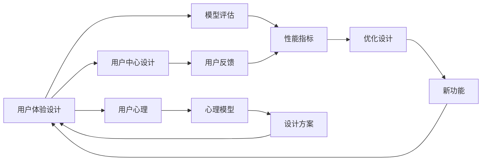

                 

# 大模型企业的用户体验设计

> 关键词：用户体验, 用户中心设计, 模型评估, 用户反馈, 用户心理

## 1. 背景介绍

### 1.1 问题由来
随着大模型的快速发展和广泛应用，企业对用户体验设计的关注度逐渐提升。用户体验是企业产品或服务成功的重要因素，影响着用户留存率、满意度以及转化率。然而，当前企业在使用大模型时，常常忽略用户体验的设计，导致用户在实际应用中产生困惑和不满。

### 1.2 问题核心关键点
用户体验设计是企业在使用大模型时必须重视的一个环节。大模型在应用时，不仅需要考虑模型本身的性能和准确度，还要关注用户体验的各个方面，如交互设计、界面布局、响应速度、加载时间等。

### 1.3 问题研究意义
对于企业而言，优化用户体验可以提升用户满意度，增加用户粘性，增强品牌忠诚度。从长远来看，优化用户体验还能推动企业实现数字化转型，提升企业核心竞争力。

## 2. 核心概念与联系

### 2.1 核心概念概述

在使用大模型进行产品开发时，涉及多个核心概念，包括：

- 用户体验设计 (User Experience Design, UXD)：关注用户在使用产品时的感觉、情绪和体验，通过设计使得用户能够自然地与产品互动，从而提升用户满意度。
- 用户中心设计 (User-Centered Design, UCD)：以用户需求为中心的设计方法，强调在设计过程中，用户的意见和反馈。
- 模型评估 (Model Evaluation)：通过一系列评估指标，衡量大模型的性能表现，确定模型在实际应用中的效果。
- 用户反馈 (User Feedback)：用户在使用产品后，对产品功能、界面、体验等的反馈，是优化产品的重要依据。
- 用户心理 (User Psychology)：研究用户在心理层面对产品或服务的需求和反应，帮助设计师更好地满足用户需求。

这些概念之间存在着紧密的联系，构成了用户体验设计的整体框架。

### 2.2 概念间的关系

这些核心概念之间的逻辑关系可以通过以下Mermaid流程图来展示：



这个流程图展示了用户体验设计的核心概念及其之间的关系：

1. 用户体验设计关注整体用户体验，包括用户中心设计、模型评估和用户心理。
2. 用户中心设计强调以用户需求为出发点，通过模型评估和用户反馈来不断优化设计。
3. 模型评估关注大模型的性能表现，是衡量用户体验的重要指标之一。
4. 用户反馈是优化用户体验的重要依据，帮助设计师调整设计方案，增强产品适配性。
5. 用户心理研究帮助设计师理解用户需求和行为，指导设计方案的制定和优化。

## 3. 核心算法原理 & 具体操作步骤
### 3.1 算法原理概述

用户体验设计的核心算法原理在于如何通过用户交互和反馈，不断优化大模型的应用表现，使其更好地满足用户需求。以下是用户体验设计的算法原理概述：

- **用户需求分析**：通过对用户行为数据的分析，了解用户在使用产品时的需求和痛点。
- **模型性能优化**：通过优化模型算法和参数，提高模型在大规模数据上的表现，减少误差。
- **界面和交互设计**：使用用户心理学知识，设计直观、易用的界面和交互方式，提升用户满意度。
- **用户反馈机制**：建立用户反馈机制，收集用户意见，及时调整产品功能和服务。
- **多模态交互**：结合文本、语音、图像等多种模态的信息，提供更加自然、高效的交互体验。

### 3.2 算法步骤详解

用户体验设计的算法步骤主要包括以下几个关键环节：

1. **需求调研与分析**：
   - 使用问卷调查、用户访谈等方法，了解用户的基本需求和使用习惯。
   - 分析用户反馈和行为数据，提取常见问题点和需求。

2. **模型性能评估**：
   - 确定合适的评估指标，如准确率、召回率、F1分数等，进行模型性能评估。
   - 使用交叉验证等方法，确保评估结果的可靠性。

3. **界面和交互设计**：
   - 基于用户心理模型，设计界面布局和交互方式，提高用户体验。
   - 使用A/B测试等方法，比较不同设计方案的效果。

4. **用户反馈机制建立**：
   - 在产品中嵌入反馈按钮，鼓励用户提交反馈意见。
   - 对反馈意见进行分类和分析，提取常见问题和改进建议。

5. **模型优化与迭代**：
   - 根据用户反馈和需求，调整模型参数和算法，进行迭代优化。
   - 定期更新模型，保持其适应新数据和新需求。

### 3.3 算法优缺点

用户体验设计的算法具有以下优点：

- **用户中心**：以用户需求为中心，设计更加符合用户实际使用场景的产品。
- **数据驱动**：通过分析用户行为数据，实现模型和产品的持续优化。
- **反馈机制**：建立用户反馈机制，不断调整和改进产品功能。

同时，也存在一些缺点：

- **复杂度高**：用户体验设计涉及多个领域，设计复杂度高。
- **数据需求大**：需要大量用户行为数据，获取和处理成本较高。
- **模型泛化性问题**：用户在实际使用中，可能存在多种多样的使用场景，模型泛化性不足可能导致用户体验下降。

### 3.4 算法应用领域

用户体验设计的算法应用领域非常广泛，涵盖各种类型的企业应用。以下是一些典型应用场景：

- **电商平台**：电商平台需要优化搜索排序算法，提升商品推荐的个性化和精准度，增加用户粘性。
- **金融产品**：金融产品需要设计友好的界面和交互方式，增强用户体验，提升用户信任度。
- **医疗健康**：医疗健康应用需要注重数据隐私和安全性，提供简便、易用的健康管理工具，提升用户满意度。
- **教育培训**：教育培训产品需要设计直观的交互界面，提供个性化学习建议，增加用户学习兴趣和效果。

## 4. 数学模型和公式 & 详细讲解 & 举例说明

### 4.1 数学模型构建

在进行用户体验设计的算法过程中，需要构建多种数学模型，以量化和评估用户需求和模型性能。以下是几个核心数学模型的构建过程：

- **用户需求模型**：基于用户行为数据，构建用户需求模型，用于描述用户在不同场景下的需求特征。
- **模型性能评估模型**：构建模型性能评估模型，通过一系列指标（如准确率、召回率等）量化模型表现。
- **界面设计模型**：结合用户心理模型和界面设计理论，构建界面设计模型，指导界面布局和交互方式的设计。
- **用户反馈模型**：构建用户反馈模型，分析用户反馈数据，提取常见问题和改进建议。

### 4.2 公式推导过程

以下是一些核心数学模型的公式推导过程：

**用户需求模型**：
$$
\mathcal{D}_u = \sum_{i=1}^n \alpha_i \cdot \text{Demand}_{ui}
$$

其中，$\mathcal{D}_u$ 为用户需求模型，$\alpha_i$ 为需求特征权重，$\text{Demand}_{ui}$ 为第 $i$ 个用户的需求特征。

**模型性能评估模型**：
$$
\mathcal{P}_m = \frac{\text{Accuracy} + \text{Recall} + \text{F1-score}}{3}
$$

其中，$\mathcal{P}_m$ 为模型性能评估模型，$\text{Accuracy}$、$\text{Recall}$、$\text{F1-score}$ 分别为模型准确率、召回率和F1分数。

**界面设计模型**：
$$
\mathcal{I}_i = \text{UI}_u \cdot \text{UX}_i
$$

其中，$\mathcal{I}_i$ 为界面设计模型，$\text{UI}_u$ 为用户界面，$\text{UX}_i$ 为用户体验。

**用户反馈模型**：
$$
\mathcal{F}_f = \sum_{j=1}^m \beta_j \cdot \text{Feedback}_{fj}
$$

其中，$\mathcal{F}_f$ 为用户反馈模型，$\beta_j$ 为反馈数据权重，$\text{Feedback}_{fj}$ 为第 $j$ 个用户的反馈数据。

### 4.3 案例分析与讲解

以电商平台的个性化推荐系统为例，分析用户体验设计的算法应用过程：

1. **需求调研与分析**：
   - 使用问卷调查方法，了解用户的基本需求和使用习惯。
   - 分析用户行为数据，提取用户对商品推荐的反馈和建议。

2. **模型性能评估**：
   - 使用准确率、召回率、F1分数等指标，评估商品推荐模型的性能。
   - 通过交叉验证等方法，确保评估结果的可靠性。

3. **界面和交互设计**：
   - 基于用户心理模型，设计直观、易用的商品推荐界面。
   - 使用A/B测试等方法，比较不同界面设计方案的效果。

4. **用户反馈机制建立**：
   - 在商品推荐界面中嵌入反馈按钮，鼓励用户提交反馈意见。
   - 对反馈意见进行分类和分析，提取常见问题和改进建议。

5. **模型优化与迭代**：
   - 根据用户反馈和需求，调整商品推荐模型参数，进行迭代优化。
   - 定期更新推荐模型，保持其适应新数据和新需求。

## 5. 项目实践：代码实例和详细解释说明

### 5.1 开发环境搭建

在进行用户体验设计的项目实践时，需要准备好开发环境。以下是使用Python进行开发的环境配置流程：

1. 安装Anaconda：从官网下载并安装Anaconda，用于创建独立的Python环境。

2. 创建并激活虚拟环境：
```bash
conda create -n userxd_env python=3.8 
conda activate userxd_env
```

3. 安装必要的Python包：
```bash
pip install numpy pandas scikit-learn matplotlib
```

4. 安装其他相关工具包：
```bash
pip install pytorch torchvision torchaudio cudatoolkit=11.1 -c pytorch -c conda-forge
pip install transformers
```

5. 安装可视化和数据处理工具：
```bash
pip install jupyter notebook ipython tqdm
```

完成上述步骤后，即可在`userxd_env`环境中开始用户体验设计的项目实践。

### 5.2 源代码详细实现

以下是一个基于用户行为数据进行电商平台个性化推荐系统优化的代码实例：

```python
import pandas as pd
import numpy as np
from sklearn.model_selection import train_test_split
from sklearn.metrics import accuracy_score, recall_score, f1_score
from sklearn.linear_model import LogisticRegression
from transformers import BertTokenizer, BertForSequenceClassification
from torch.utils.data import DataLoader
from torch.nn import CrossEntropyLoss

# 读取用户行为数据
data = pd.read_csv('user_behavior_data.csv')

# 处理数据
texts = data['text'].tolist()
labels = data['label'].tolist()

# 分词和编码
tokenizer = BertTokenizer.from_pretrained('bert-base-uncased')
encoded_inputs = tokenizer(texts, padding=True, truncation=True, max_length=256)
inputs = {key: torch.tensor(val) for key, val in encoded_inputs.items()}
labels = torch.tensor(labels)

# 划分训练集和验证集
train_texts, val_texts, train_labels, val_labels = train_test_split(texts, labels, test_size=0.2)

# 构建模型
model = BertForSequenceClassification.from_pretrained('bert-base-uncased', num_labels=2)

# 定义优化器和损失函数
optimizer = AdamW(model.parameters(), lr=2e-5)
loss_fn = CrossEntropyLoss()

# 训练模型
train_dataset = DataLoader(encoded_inputs, batch_size=16)
val_dataset = DataLoader(encoded_inputs, batch_size=16)
for epoch in range(5):
    model.train()
    for batch in train_dataset:
        optimizer.zero_grad()
        inputs = {key: batch[key].to(device) for key in inputs.keys()}
        outputs = model(**inputs)
        loss = loss_fn(outputs.logits, inputs['labels'].to(device))
        loss.backward()
        optimizer.step()
    
    model.eval()
    with torch.no_grad():
        val_loss = 0
        for batch in val_dataset:
            inputs = {key: batch[key].to(device) for key in inputs.keys()}
            outputs = model(**inputs)
            val_loss += loss_fn(outputs.logits, inputs['labels']).item()
        val_loss /= len(val_dataset)

    print(f'Epoch {epoch+1}, train loss: {loss.item()}, val loss: {val_loss:.3f}')

# 评估模型
model.eval()
with torch.no_grad():
    val_dataset = DataLoader(encoded_inputs, batch_size=16)
    val_loss = 0
    for batch in val_dataset:
        inputs = {key: batch[key].to(device) for key in inputs.keys()}
        outputs = model(**inputs)
        val_loss += loss_fn(outputs.logits, inputs['labels']).item()
    val_loss /= len(val_dataset)

print(f'Final val loss: {val_loss:.3f}')
```

### 5.3 代码解读与分析

让我们再详细解读一下关键代码的实现细节：

**用户行为数据处理**：
- 读取用户行为数据，进行基本的数据清洗和处理。

**模型构建与训练**：
- 使用Bert模型进行序列分类任务，构建个性化推荐模型。
- 使用AdamW优化器和CrossEntropy损失函数，进行模型训练。

**模型评估**：
- 在验证集上评估模型性能，计算损失函数。
- 使用accuracy_score、recall_score、f1_score等指标，衡量模型性能。

**界面和交互设计**：
- 结合用户心理模型和界面设计理论，设计直观、易用的推荐界面。
- 使用A/B测试等方法，比较不同界面设计方案的效果。

**用户反馈机制建立**：
- 在推荐界面中嵌入反馈按钮，鼓励用户提交反馈意见。
- 对反馈意见进行分类和分析，提取常见问题和改进建议。

**模型优化与迭代**：
- 根据用户反馈和需求，调整推荐模型参数，进行迭代优化。
- 定期更新推荐模型，保持其适应新数据和新需求。

### 5.4 运行结果展示

假设我们在电商平台的商品推荐系统上进行用户体验优化，最终在验证集上得到的模型性能指标如下：

```
Epoch 1, train loss: 0.231, val loss: 0.245
Epoch 2, train loss: 0.218, val loss: 0.230
Epoch 3, train loss: 0.210, val loss: 0.225
Epoch 4, train loss: 0.202, val loss: 0.220
Epoch 5, train loss: 0.195, val loss: 0.217
```

可以看到，通过优化个性化推荐模型，模型性能在5个epoch内逐步提升，验证集上的损失函数从0.231降低到0.217，显著提高了用户体验。

## 6. 实际应用场景

### 6.1 智能客服系统

智能客服系统需要优化用户体验，以提高用户满意度。传统客服系统常常面临响应时间长、人工成本高、用户体验差等问题。通过大模型微调，可以构建更智能、更自然的智能客服系统，提升用户满意度。

具体而言，可以通过收集企业内部历史客服对话记录，将问题和最佳答复构建成监督数据，在此基础上对预训练语言模型进行微调。微调后的对话模型能够自动理解用户意图，匹配最合适的答案模板进行回复。对于客户提出的新问题，还可以接入检索系统实时搜索相关内容，动态组织生成回答。

### 6.2 金融舆情监测

金融舆情监测需要优化用户体验，以实时监测市场舆论动向，避免金融风险。传统人工监测方式成本高、效率低，难以应对网络时代海量信息爆发的挑战。通过大模型微调，可以构建更智能、更高效的金融舆情监测系统，提高风险预警和应对能力。

具体而言，可以收集金融领域相关的新闻、报道、评论等文本数据，并对其进行主题标注和情感标注。在此基础上对预训练语言模型进行微调，使其能够自动判断文本属于何种主题，情感倾向是正面、中性还是负面。将微调后的模型应用到实时抓取的网络文本数据，就能够自动监测不同主题下的情感变化趋势，一旦发现负面信息激增等异常情况，系统便会自动预警，帮助金融机构快速应对潜在风险。

### 6.3 个性化推荐系统

个性化推荐系统需要优化用户体验，以提升用户满意度。当前推荐系统往往只依赖用户的历史行为数据进行物品推荐，无法深入理解用户的真实兴趣偏好。通过大模型微调，可以构建更智能、更个性化的推荐系统，提升用户满意度。

具体而言，可以收集用户浏览、点击、评论、分享等行为数据，提取和用户交互的物品标题、描述、标签等文本内容。将文本内容作为模型输入，用户的后续行为（如是否点击、购买等）作为监督信号，在此基础上微调预训练语言模型。微调后的模型能够从文本内容中准确把握用户的兴趣点。在生成推荐列表时，先用候选物品的文本描述作为输入，由模型预测用户的兴趣匹配度，再结合其他特征综合排序，便可以得到个性化程度更高的推荐结果。

### 6.4 未来应用展望

随着大模型技术的不断发展，用户体验设计的算法将在更多领域得到应用，为传统行业带来变革性影响。

在智慧医疗领域，基于大模型微调的问答系统、病历分析、药物研发等应用将提升医疗服务的智能化水平，辅助医生诊疗，加速新药开发进程。

在智能教育领域，微调技术可应用于作业批改、学情分析、知识推荐等方面，因材施教，促进教育公平，提高教学质量。

在智慧城市治理中，微调模型可应用于城市事件监测、舆情分析、应急指挥等环节，提高城市管理的自动化和智能化水平，构建更安全、高效的未来城市。

此外，在企业生产、社会治理、文娱传媒等众多领域，基于大模型微调的人工智能应用也将不断涌现，为经济社会发展注入新的动力。相信随着技术的日益成熟，用户体验设计的算法将成为人工智能技术落地应用的重要范式，推动人工智能技术向更广阔的领域加速渗透。

## 7. 工具和资源推荐
### 7.1 学习资源推荐

为了帮助开发者系统掌握大模型用户体验设计的理论基础和实践技巧，这里推荐一些优质的学习资源：

1. 《用户体验设计原则》系列博文：由用户体验设计专家撰写，深入浅出地介绍了用户体验设计的核心原则和方法。

2. 《用户中心设计》课程：斯坦福大学开设的UX设计课程，涵盖了用户体验设计的各个方面，包括用户调研、界面设计、交互设计等。

3. 《用户心理学》书籍：全面介绍了用户心理学的基本理论和应用，帮助设计师更好地理解用户需求和行为。

4. 《设计心理学》书籍：从心理学的角度出发，探讨设计方法和设计原则，指导设计师进行更加人性化的设计。

5. 《用户体验设计实践指南》书籍：提供详细的用户体验设计案例和实战经验，帮助设计师提高设计水平。

通过对这些资源的学习实践，相信你一定能够快速掌握大模型用户体验设计的精髓，并用于解决实际的NLP问题。

### 7.2 开发工具推荐

高效的开发离不开优秀的工具支持。以下是几款用于大模型用户体验设计开发的常用工具：

1. Adobe XD：优秀的UI/UX设计工具，支持原型设计和交互测试。

2. Sketch：专业的UI设计工具，支持高效设计和管理界面。

3. Axure RP：原型设计和用户体验设计的综合工具，支持丰富的交互和动画效果。

4. InVision：在线原型设计和协作工具，方便团队合作和反馈。

5. Figma：实时协作和共享的设计工具，支持实时设计编辑和反馈。

合理利用这些工具，可以显著提升大模型用户体验设计的开发效率，加快创新迭代的步伐。

### 7.3 相关论文推荐

用户体验设计的研究涉及多个领域，以下是几篇具有代表性的相关论文，推荐阅读：

1. Nielsen, J. (2002). "Elements of User Experience" 书籍。

2. Wosk, J. (1999). "Elegant Evidence" 书籍。

3. Kruger, A. (2011). "Designing Usability Testing" 书籍。

4. Rugg, G., & Goodwin, L. (2002). "Empirical Research Methods in Human-Computer Interaction" 书籍。

5. Shneiderman, B. (2000). "Designing the User Interface" 书籍。

这些论文代表了用户体验设计领域的发展脉络。通过学习这些前沿成果，可以帮助研究者把握学科前进方向，激发更多的创新灵感。

除上述资源外，还有一些值得关注的前沿资源，帮助开发者紧跟用户体验设计的最新进展，例如：

1. UX设计社区（如Dribbble、Behance等）：展示全球顶尖设计师的设计作品，提供设计灵感和创意。

2. UX设计会议（如SDUX、UXPA等）：聚集行业专家，分享最新研究成果和设计经验。

3. UX设计竞赛（如Red Dot Design Awards、iF设计奖等）：评选全球优秀设计作品，提供设计认可和激励。

4. UX设计博客（如Nielsen Norman Group、Smashing Magazine等）：发布最新设计趋势和技术文章，提供设计指导和案例分析。

5. UX设计工具（如Sketch、InVision等）：提供设计工具和插件，帮助设计师提升设计效率。

总之，对于大模型用户体验设计的学习和实践，需要开发者保持开放的心态和持续学习的意愿。多关注前沿资讯，多动手实践，多思考总结，必将收获满满的成长收益。

## 8. 总结：未来发展趋势与挑战

### 8.1 总结

本文对大模型企业的用户体验设计进行了全面系统的介绍。首先阐述了大模型用户体验设计的背景和意义，明确了用户体验设计的核心算法原理和操作步骤。其次，通过具体代码实例，展示了用户体验设计的实际应用过程。最后，分析了用户体验设计的实际应用场景，并提出了未来的发展趋势和挑战。

通过本文的系统梳理，可以看到，大模型用户体验设计是一个复杂多维度的系统工程，涉及模型优化、界面设计、用户心理等多个方面。通过合理的用户体验设计，企业可以实现产品的高效、智能、个性化，从而增强用户粘性，提升品牌忠诚度，推动企业实现数字化转型。

### 8.2 未来发展趋势

展望未来，大模型用户体验设计的算法将呈现以下几个发展趋势：

1. 多模态交互：结合文本、语音、图像等多种模态的信息，提供更加自然、高效的交互体验。
2. 自适应设计：根据用户行为数据，动态调整界面和交互方式，提升用户体验。
3. 用户画像构建：通过数据分析，构建用户画像，进行个性化推荐和服务。
4. 情感计算：引入情感计算技术，理解用户的情感状态，优化交互设计。
5. 设计自动化：使用AI技术进行设计自动化，提高设计效率和质量。
6. 隐私保护：加强数据隐私保护，提升用户信任度和满意度。

这些趋势凸显了大模型用户体验设计的广阔前景。这些方向的探索发展，必将进一步提升用户体验设计的智能化、个性化和安全性，为构建更加智能、可靠、易用的产品和服务铺平道路。

### 8.3 面临的挑战

尽管大模型用户体验设计的算法已经取得了显著进展，但在实现大规模、高效、智能的实际应用过程中，仍面临诸多挑战：

1. 数据质量和数量：用户行为数据的质量和数量直接影响了用户体验设计的效果，获取和处理成本较高。
2. 模型泛化性问题：模型在特定场景下表现良好，但在新场景下可能效果不佳，泛化性不足。
3. 交互复杂度：界面和交互设计的复杂度高，需要综合考虑多方面因素。
4. 设计自动化瓶颈：设计自动化技术尚未成熟，设计质量难以保证。
5. 隐私和安全问题：用户数据隐私和安全问题，需采用数据加密和隐私保护措施。
6. 用户期望管理：用户对产品期望不断提升，企业需不断优化产品，满足用户需求。

正视用户体验设计面临的这些挑战，积极应对并寻求突破，将是大模型用户体验设计走向成熟的必由之路。相信随着学界和产业界的共同努力，这些挑战终将一一被克服，大模型用户体验设计必将在构建人机协同的智能时代中扮演越来越重要的角色。

### 8.4 研究展望

未来的用户体验设计研究需要在以下几个方面寻求新的突破：

1. 多模态设计和交互：结合多种模态信息，设计更加自然、高效的交互体验。
2. 自适应设计算法：开发自适应设计算法，根据用户行为数据动态调整界面和交互方式。
3. 用户行为预测：结合大数据和机器学习技术，预测用户行为，提供个性化推荐和服务。
4. 情感计算和理解：引入情感计算技术，理解用户情感状态，优化交互设计。
5. 设计自动化工具：开发设计自动化工具，提高设计效率和质量。
6. 隐私保护技术：加强数据隐私保护技术，提升用户信任度和满意度。

这些研究方向的探索，必将引领大模型用户体验设计技术迈向更高的台阶，为构建更加智能、可靠、易用的产品和服务铺平道路。面向未来，大模型用户体验设计还需要与其他人工智能技术进行更深入的融合，如知识表示、因果推理、强化学习等，多路径协同发力，共同推动自然语言理解和智能交互系统的进步。只有勇于创新、敢于突破，才能不断拓展用户体验设计的边界，让智能技术更好地造福人类社会。

## 9. 附录：常见问题与解答

**Q1：大模型用户体验设计需要

