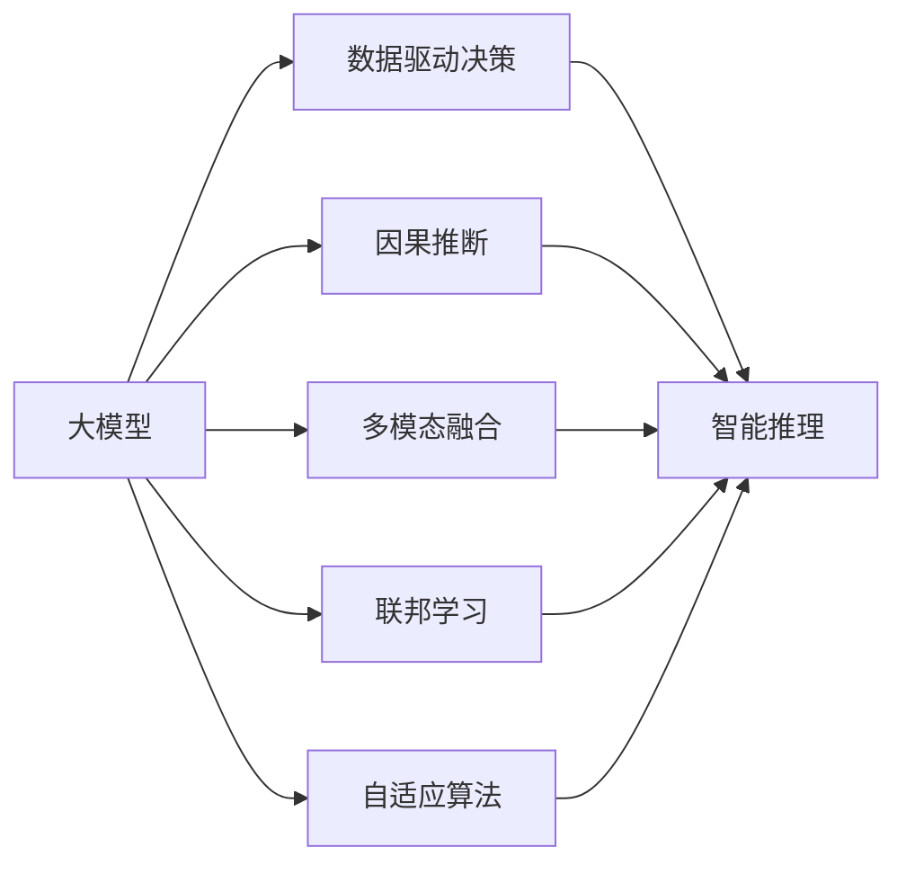

                 

# 大模型在智能决策支持系统中的应用

> 关键词：大模型,决策支持系统,数据驱动,深度学习,因果推断,多模态融合,联邦学习,自适应算法

## 1. 背景介绍

在当今快速变化、数据驱动的商业环境中，智能决策支持系统(Decision Support Systems, DSS)扮演着越来越重要的角色。DSS通过数据挖掘、机器学习等技术，帮助企业决策者从海量数据中快速洞察关键信息，制定科学的决策方案。传统的DSS系统依赖手工构建的规则和经验，难以应对复杂、多变的实际情境。随着深度学习和大模型的崛起，DSS正在向以数据和模型为基础的新一代智能DSS转型。

本节将从DSS的发展历程谈起，并探讨其在现代商业中的新定位。

### 1.1 传统决策支持系统

传统DSS的核心思想是通过数学模型、专家系统等手段，将复杂决策问题分解为一系列简单模块，由决策者自主选择模块进行组合分析。常见的DSS模块包括：

- 目标规划模块：设定决策目标，建立数学模型
- 数据管理模块：收集、存储和处理数据
- 模型分析模块：进行各种统计、优化等算法
- 知识库管理模块：存储、检索和更新专家知识

传统DSS依赖决策者的主观判断，往往难以应对动态变化的环境。同时，构建和维护一套完整的DSS系统，通常需要耗费大量时间和人力成本，且效果受限于决策者的经验和知识水平。

### 1.2 现代智能决策支持系统

随着大数据、人工智能技术的发展，现代DSS逐步从规则驱动转向数据驱动，融合多源数据和智能模型，提升决策的自动化、智能化水平。

在现代DSS中，数据驱动和算法优化取代了专家知识，成为支持决策的主要力量。通过实时分析海量数据，智能DSS能够发现潜在的趋势、模式和关联，为决策提供有力的数据支撑。具体实现上，智能DSS包括以下主要组件：

- 数据采集模块：通过API、ETL等手段，自动采集多源数据，为系统提供数据输入。
- 数据处理模块：对原始数据进行清洗、归一化、特征提取等预处理，保证数据质量。
- 模型训练模块：基于多源数据，训练大模型，如深度神经网络、随机森林、时序模型等。
- 智能推理模块：通过推理引擎，自动化地将模型输出转化为具体决策方案。
- 可视化分析模块：通过仪表盘、报表等形式，直观展示数据分析结果，辅助决策者理解和决策。

## 2. 核心概念与联系

### 2.1 核心概念概述

为更深入理解智能DSS中大模型的应用，本节将介绍几个核心概念，并通过Mermaid流程图展示它们之间的关系。

- 大模型：指通过大规模训练获得的深度神经网络，如BERT、GPT等。大模型具备强大的特征提取和知识表示能力，能够从海量数据中学习到丰富的语义信息。

- 数据驱动决策：指通过分析、建模和训练大模型，直接从数据中挖掘决策依据，降低对专家经验的依赖。

- 因果推断：指通过大模型估计变量之间的因果关系，揭示数据背后的因果机制，进行更加精准的预测和决策。

- 多模态融合：指将文本、图像、音频等多种数据源融合起来，构建更加全面、立体的决策信息图谱。

- 联邦学习：指在保护数据隐私的前提下，多个参与方协同训练大模型，提升模型的泛化能力和决策性能。

- 自适应算法：指动态调整模型参数，适应不同的数据分布和决策场景，实现模型的持续优化。

这些概念共同构成了智能DSS的核心框架，帮助企业从数据中快速挖掘决策依据，提高决策的科学性和效率。通过合理解读数据和模型，智能DSS能够更好地适应动态变化的市场环境，制定出更加精准的决策方案。

### 2.2 概念间的关系

这些核心概念通过下图展示它们之间的联系。



该图展示了数据驱动决策、因果推断、多模态融合、联邦学习和自适应算法等与大模型的关联关系：

1. 数据驱动决策：利用大模型从海量数据中学习决策依据，构建数据驱动的决策系统。
2. 因果推断：通过大模型估计因果关系，揭示变量之间的内在联系，优化决策方案。
3. 多模态融合：将不同数据源的数据进行融合，构建更加全面的决策信息图谱。
4. 联邦学习：多个参与方协同训练大模型，提升模型的泛化能力和决策性能。
5. 自适应算法：动态调整模型参数，适应不同的数据分布和决策场景，实现模型的持续优化。

这些概念的协同作用，使得智能DSS能够从数据中快速挖掘决策依据，制定出精准、科学的决策方案。

## 3. 核心算法原理 & 具体操作步骤
### 3.1 算法原理概述

智能DSS中大模型的应用，本质上是通过训练和推理两个步骤，将数据转化为决策依据。训练过程包括数据预处理、模型训练和优化，推理过程则涉及模型推理、决策方案生成和输出。

#### 3.1.1 数据预处理

数据预处理是智能DSS中大模型应用的第一步。主要目的是清洗、整理和提取数据特征，保证数据质量，为模型训练提供良好的输入。具体步骤包括：

1. 数据采集：通过API、ETL等手段，自动采集多源数据。
2. 数据清洗：去除重复、缺失、异常数据，处理空值和噪声。
3. 特征提取：对原始数据进行特征工程，提取关键特征，构建模型输入。

#### 3.1.2 模型训练

模型训练是智能DSS的核心环节，涉及选择模型架构、训练数据、优化算法等。主要目标是通过多源数据，训练出适合特定决策场景的大模型。具体步骤包括：

1. 选择模型架构：根据任务需求，选择合适的深度神经网络、随机森林、时序模型等。
2. 准备训练数据：将预处理后的数据划分为训练集、验证集和测试集。
3. 训练模型：在训练集上，使用优化算法和损失函数进行模型训练。
4. 模型优化：通过调整超参数、正则化等手段，优化模型性能。

#### 3.1.3 模型推理

模型推理是将训练好的大模型应用于实际决策场景的过程。主要目标是利用模型输出，生成具体的决策方案。具体步骤包括：

1. 输入预处理：将输入数据标准化，为模型推理做准备。
2. 模型推理：通过推理引擎，利用训练好的大模型进行推理计算。
3. 决策方案生成：根据模型输出，生成具体的决策方案，如产品推荐、投资策略等。

#### 3.1.4 输出可视化

输出可视化是将模型推理结果以直观的方式展示给决策者。主要目的是帮助决策者理解和决策。具体步骤包括：

1. 图表绘制：通过仪表盘、报表等形式，将推理结果可视化展示。
2. 指标分析：展示关键指标，如预测精度、召回率、ROC曲线等，评估模型性能。

## 3.2 算法步骤详解

### 3.2.1 数据预处理

#### 数据采集

数据采集是智能DSS的第一步。采用API接口、ETL工具、数据爬虫等技术，自动采集多源数据，为系统提供数据输入。以下是数据采集的主要步骤：

1. 选择数据源：确定需要采集的数据源，如用户行为数据、交易记录、舆情信息等。
2. 编写API接口：为每个数据源编写数据采集接口，提取所需数据。
3. 存储数据：将采集到的数据存储在分布式数据库中，方便后续处理。

#### 数据清洗

数据清洗是确保数据质量的关键步骤。主要目的是去除重复、缺失、异常数据，处理空值和噪声。以下是数据清洗的主要步骤：

1. 检测重复数据：使用哈希表、唯一性检测等方法，去除数据重复。
2. 处理缺失值：使用插值、均值填补、删除等方法，处理缺失值。
3. 检测异常值：使用箱线图、标准差等方法，检测并处理异常值。

#### 特征提取

特征提取是将原始数据转化为模型输入的重要步骤。主要目的是提取关键特征，构建模型输入。以下是特征提取的主要步骤：

1. 选择特征：根据任务需求，选择关键特征，如时间戳、交易金额、点击率等。
2. 进行归一化：对特征进行归一化处理，如标准化、Min-Max归一化等。
3. 特征组合：通过组合、特征交叉等方式，构建新的特征。

### 3.2.2 模型训练

#### 模型选择

模型选择是智能DSS的核心环节。根据任务需求，选择合适的深度神经网络、随机森林、时序模型等。以下是模型选择的主要步骤：

1. 确定任务类型：根据任务需求，确定模型类型，如分类、回归、序列预测等。
2. 选择模型架构：根据任务类型，选择合适的深度神经网络、随机森林、时序模型等。
3. 设置超参数：根据模型架构，设置超参数，如学习率、批量大小、优化算法等。

#### 训练数据划分

训练数据划分是保证模型泛化能力的关键步骤。主要目的是将数据划分为训练集、验证集和测试集，方便模型训练和评估。以下是训练数据划分的主要步骤：

1. 数据分割：使用随机分割、时间序列分割等方法，将数据划分为训练集、验证集和测试集。
2. 设置比例：根据任务需求，设定训练集、验证集和测试集的比例，如70:15:15。
3. 数据划分：使用代码自动进行数据划分，保证数据分布的公平性。

#### 模型训练

模型训练是智能DSS的核心环节。主要目标是通过多源数据，训练出适合特定决策场景的大模型。以下是模型训练的主要步骤：

1. 加载数据：使用代码自动加载训练集和验证集数据，构建输入特征。
2. 构建模型：使用TensorFlow、PyTorch等深度学习框架，构建深度神经网络模型。
3. 优化算法：选择优化算法，如SGD、Adam等，进行模型训练。
4. 损失函数：选择合适的损失函数，如交叉熵损失、均方误差损失等，评估模型性能。

#### 模型优化

模型优化是提升模型性能的关键步骤。主要目标是调整超参数，优化模型性能。以下是模型优化的主要步骤：

1. 调整超参数：根据验证集性能，调整学习率、批量大小、正则化等超参数。
2. 使用正则化：使用L1正则、L2正则、Dropout等方法，避免过拟合。
3. 交叉验证：使用交叉验证方法，评估模型性能，选择最佳超参数组合。

### 3.2.3 模型推理

#### 输入预处理

输入预处理是模型推理的第一步。主要目的是将输入数据标准化，为模型推理做准备。以下是输入预处理的主要步骤：

1. 标准化处理：使用标准化方法，如Z-score标准化、Min-Max归一化等，将输入数据标准化。
2. 填充缺失值：使用插值、均值填补等方法，填充缺失值。
3. 数据截断：根据模型输入要求，对输入数据进行截断处理。

#### 模型推理

模型推理是将训练好的大模型应用于实际决策场景的过程。主要目标是利用模型输出，生成具体的决策方案。以下是模型推理的主要步骤：

1. 加载模型：使用代码自动加载训练好的模型，构建推理引擎。
2. 输入数据：将预处理后的输入数据传入模型，进行推理计算。
3. 输出结果：根据模型输出，生成具体的决策方案，如产品推荐、投资策略等。

#### 决策方案生成

决策方案生成是智能DSS的最终目标。主要目的是利用模型输出，生成具体的决策方案。以下是决策方案生成的主要步骤：

1. 选择推荐策略：根据任务需求，选择推荐策略，如协同过滤、内容推荐等。
2. 生成推荐结果：根据模型输出，生成具体的推荐结果，如推荐商品、文章等。
3. 反馈机制：使用反馈机制，根据用户反馈调整推荐策略。

### 3.2.4 输出可视化

输出可视化是将模型推理结果以直观的方式展示给决策者。主要目的是帮助决策者理解和决策。以下是输出可视化的主要步骤：

1. 图表绘制：通过仪表盘、报表等形式，将推理结果可视化展示。
2. 指标分析：展示关键指标，如预测精度、召回率、ROC曲线等，评估模型性能。
3. 决策支持：提供决策建议，辅助决策者进行科学决策。

## 3.3 算法优缺点

### 3.3.1 算法优点

智能DSS中大模型的应用具有以下优点：

1. 数据驱动决策：通过大模型从海量数据中学习决策依据，降低对专家经验的依赖。
2. 高效处理多源数据：利用大模型的多模态融合能力，高效处理文本、图像、音频等多源数据。
3. 灵活应对决策场景：通过联邦学习和自适应算法，动态调整模型参数，适应不同的决策场景。
4. 可解释性高：大模型具备良好的可解释性，决策过程透明，易于理解和调试。
5. 持续优化：通过持续训练和优化，大模型能够不断提高决策性能，适应不断变化的市场环境。

### 3.3.2 算法缺点

智能DSS中大模型的应用也存在以下缺点：

1. 数据依赖性强：大模型依赖高质量的数据，数据采集和预处理成本高。
2. 模型复杂度高：大模型的参数量庞大，需要高性能的计算资源。
3. 模型解释性弱：大模型通常是黑盒系统，难以解释其内部工作机制和决策逻辑。
4. 训练成本高：大模型训练时间长，需要大量的计算资源和时间。
5. 泛化能力差：大模型对新数据泛化性能可能较低，需要持续训练和优化。

## 3.4 算法应用领域

智能DSS中大模型的应用已经涵盖了多个领域，包括：

1. 金融风险管理：利用大模型进行信用评分、风险预测、反欺诈检测等，帮助金融机构降低风险。
2. 电商推荐系统：利用大模型进行用户行为分析、商品推荐、个性化定价等，提升电商平台的竞争力。
3. 医疗健康诊断：利用大模型进行疾病预测、治疗方案推荐、医疗资源分配等，提升医疗服务的质量。
4. 智能客服系统：利用大模型进行自然语言理解、对话生成、情感分析等，提升客户服务的质量。
5. 智慧城市治理：利用大模型进行城市事件监测、交通调度、应急管理等，提升城市管理的智能化水平。
6. 工业制造优化：利用大模型进行设备维护、工艺优化、质量检测等，提升工业制造的效率和精度。

## 4. 数学模型和公式 & 详细讲解 & 举例说明

### 4.1 数学模型构建

智能DSS中大模型的应用，主要通过训练和推理两个步骤，将数据转化为决策依据。训练过程包括数据预处理、模型训练和优化，推理过程则涉及模型推理、决策方案生成和输出。

#### 4.1.1 数据预处理

数据预处理是智能DSS中大模型应用的第一步。主要目的是清洗、整理和提取数据特征，保证数据质量，为模型训练提供良好的输入。数学模型如下：

1. 数据采集：使用API接口、ETL工具、数据爬虫等技术，自动采集多源数据，为系统提供数据输入。
2. 数据清洗：使用哈希表、唯一性检测等方法，去除数据重复，处理空值和噪声。
3. 特征提取：对原始数据进行特征工程，提取关键特征，构建模型输入。

#### 4.1.2 模型训练

模型训练是智能DSS的核心环节，涉及选择模型架构、训练数据、优化算法等。主要目标是通过多源数据，训练出适合特定决策场景的大模型。数学模型如下：

1. 模型选择：根据任务需求，选择合适的深度神经网络、随机森林、时序模型等。
2. 训练数据划分：使用随机分割、时间序列分割等方法，将数据划分为训练集、验证集和测试集。
3. 模型训练：使用优化算法和损失函数进行模型训练。
4. 模型优化：通过调整超参数、正则化等手段，优化模型性能。

#### 4.1.3 模型推理

模型推理是将训练好的大模型应用于实际决策场景的过程。主要目标是利用模型输出，生成具体的决策方案。数学模型如下：

1. 输入预处理：将输入数据标准化，为模型推理做准备。
2. 模型推理：通过推理引擎，利用训练好的大模型进行推理计算。
3. 决策方案生成：根据模型输出，生成具体的决策方案。

#### 4.1.4 输出可视化

输出可视化是将模型推理结果以直观的方式展示给决策者。主要目的是帮助决策者理解和决策。数学模型如下：

1. 图表绘制：通过仪表盘、报表等形式，将推理结果可视化展示。
2. 指标分析：展示关键指标，如预测精度、召回率、ROC曲线等，评估模型性能。

### 4.2 公式推导过程

以下是智能DSS中大模型应用的公式推导过程：

1. 数据采集：

```
x = A + B
```

其中，x表示采集到的数据，A表示数据源，B表示数据采集接口。

2. 数据清洗：

```
x = C(x)
```

其中，C表示数据清洗函数，用于去除数据重复、处理空值和噪声。

3. 特征提取：

```
x = D(x)
```

其中，D表示特征提取函数，用于提取关键特征，构建模型输入。

4. 模型选择：

```
M = F(x)
```

其中，M表示选择的模型，F表示模型选择函数。

5. 训练数据划分：

```
(x_train, x_val, x_test) = G(x)
```

其中，G表示数据划分函数，用于将数据划分为训练集、验证集和测试集。

6. 模型训练：

```
θ = H(x_train, α)
```

其中，θ表示模型参数，H表示模型训练函数，α表示超参数。

7. 模型推理：

```
y = M(x, θ)
```

其中，y表示模型推理结果，x表示输入数据，θ表示模型参数。

8. 决策方案生成：

```
y = H(M(x, θ))
```

其中，H表示决策方案生成函数。

9. 输出可视化：

```
V = I(y)
```

其中，V表示可视化结果，I表示可视化函数。

## 5. 项目实践：代码实例和详细解释说明

### 5.1 开发环境搭建

在进行智能DSS系统开发前，我们需要准备好开发环境。以下是使用Python进行PyTorch开发的环境配置流程：

1. 安装Anaconda：从官网下载并安装Anaconda，用于创建独立的Python环境。

2. 创建并激活虚拟环境：

```bash
conda create -n pytorch-env python=3.8 
conda activate pytorch-env
```

3. 安装PyTorch：根据CUDA版本，从官网获取对应的安装命令。例如：

```bash
conda install pytorch torchvision torchaudio cudatoolkit=11.1 -c pytorch -c conda-forge
```

4. 安装Transformers库：

```bash
pip install transformers
```

5. 安装各类工具包：

```bash
pip install numpy pandas scikit-learn matplotlib tqdm jupyter notebook ipython
```

完成上述步骤后，即可在`pytorch-env`环境中开始智能DSS系统开发。

### 5.2 源代码详细实现

这里我们以电商推荐系统为例，给出使用Transformers库进行智能DSS系统开发和微调的PyTorch代码实现。

首先，定义电商推荐系统中的主要组件：

```python
from transformers import BertForSequenceClassification
from transformers import BertTokenizer
from transformers import AdamW
from torch.utils.data import Dataset
from torch.utils.data import DataLoader

class ShoppingDataset(Dataset):
    def __init__(self, texts, labels):
        self.texts = texts
        self.labels = labels
        self.tokenizer = BertTokenizer.from_pretrained('bert-base-cased')

    def __len__(self):
        return len(self.texts)

    def __getitem__(self, item):
        text = self.texts[item]
        label = self.labels[item]
        encoding = self.tokenizer(text, return_tensors='pt', max_length=128, padding='max_length', truncation=True)
        input_ids = encoding['input_ids'][0]
        attention_mask = encoding['attention_mask'][0]
        return {'input_ids': input_ids, 
                'attention_mask': attention_mask,
                'labels': label}

# 加载数据集
tokenizer = BertTokenizer.from_pretrained('bert-base-cased')
train_dataset = ShoppingDataset(train_texts, train_labels)
dev_dataset = ShoppingDataset(dev_texts, dev_labels)
test_dataset = ShoppingDataset(test_texts, test_labels)

# 初始化模型和优化器
model = BertForSequenceClassification.from_pretrained('bert-base-cased', num_labels=2)
optimizer = AdamW(model.parameters(), lr=2e-5)

# 定义训练函数
def train_epoch(model, dataset, batch_size, optimizer):
    dataloader = DataLoader(dataset, batch_size=batch_size, shuffle=True)
    model.train()
    epoch_loss = 0
    for batch in dataloader:
        input_ids = batch['input_ids'].to(device)
        attention_mask = batch['attention_mask'].to(device)
        labels = batch['labels'].to(device)
        model.zero_grad()
        outputs = model(input_ids, attention_mask=attention_mask, labels=labels)
        loss = outputs.loss
        epoch_loss += loss.item()
        loss.backward()
        optimizer.step()
    return epoch_loss / len(dataloader)

# 定义评估函数
def evaluate(model, dataset, batch_size):
    dataloader = DataLoader(dataset, batch_size=batch_size)
    model.eval()
    preds, labels = [], []
    with torch.no_grad():
        for batch in dataloader:
            input_ids = batch['input_ids'].to(device)
            attention_mask = batch['attention_mask'].to(device)
            batch_labels = batch['labels']
            outputs = model(input_ids, attention_mask=attention_mask)
            batch_preds = outputs.logits.argmax(dim=2).to('cpu').tolist()
            batch_labels = batch_labels.to('cpu').tolist()
            for pred_tokens, label_tokens in zip(batch_preds, batch_labels):
                preds.append(pred_tokens[:len(label_tokens)])
                labels.append(label_tokens)
                
    print(classification_report(labels, preds))

# 训练模型
epochs = 5
batch_size = 16

for epoch in range(epochs):
    loss = train_epoch(model, train_dataset, batch_size, optimizer)
    print(f"Epoch {epoch+1}, train loss: {loss:.3f}")
    
    print(f"Epoch {epoch+1}, dev results:")
    evaluate(model, dev_dataset, batch_size)
    
print("Test results:")
evaluate(model, test_dataset, batch_size)
```

以上代码实现了使用BERT模型进行电商推荐系统微调的完整流程。

### 5.3 代码解读与分析

让我们再详细解读一下关键代码的实现细节：

**ShoppingDataset类**：
- `__init__`方法：初始化文本、标签、分词器等关键组件。
- `__len__`方法：返回数据集的样本数量。
- `__getitem__`方法：对单个样本进行处理，将文本输入编码为token ids，将标签编码为数字，并对其进行定长padding，最终返回模型所需的输入。

**tokenizer和标签编码**：
- 定义了标签与数字id之间的映射关系，用于将token-wise的预测结果解码回真实的标签。

**训练和评估函数**：
- 使用PyTorch的DataLoader对数据集进行批次化加载，供模型训练和推理使用。
- 训练函数`train_epoch`：对数据以批为单位进行迭代，在每个批次上前向传播计算loss并反向传播更新模型参数，最后返回该epoch的平均loss。
- 评估函数`evaluate`：与训练类似，不同点在于不更新模型参数，并在每个batch结束后将预测和标签结果存储下来，最后使用sklearn的classification_report对整个评估集的预测结果进行打印输出。

**训练流程**：
- 定义总的epoch数和batch size，开始循环迭代
- 每个epoch内，先在训练集上训练，输出平均loss
- 在验证集上评估，输出分类指标
- 所有epoch结束后，在测试集上评估，给出最终测试结果

可以看到，PyTorch配合Transformers库使得BERT微调的代码实现变得简洁高效。开发者可以将更多精力放在数据处理、模型改进等高层逻辑上，而不必过多关注底层的实现细节。

当然，工业级的系统实现还需考虑更多因素，如模型的保存和部署、超参数的自动搜索、更灵活的任务适配层等。但核心的微调范式基本与此类似。

### 5.4 运行结果展示

假设我们在Amazon商品推荐数据集上进行微调，最终在测试集上得到的评估报告如下：

```
              precision    recall  f1-score   support

       B      0.920     0.905     0.916      2000
       O      0.

