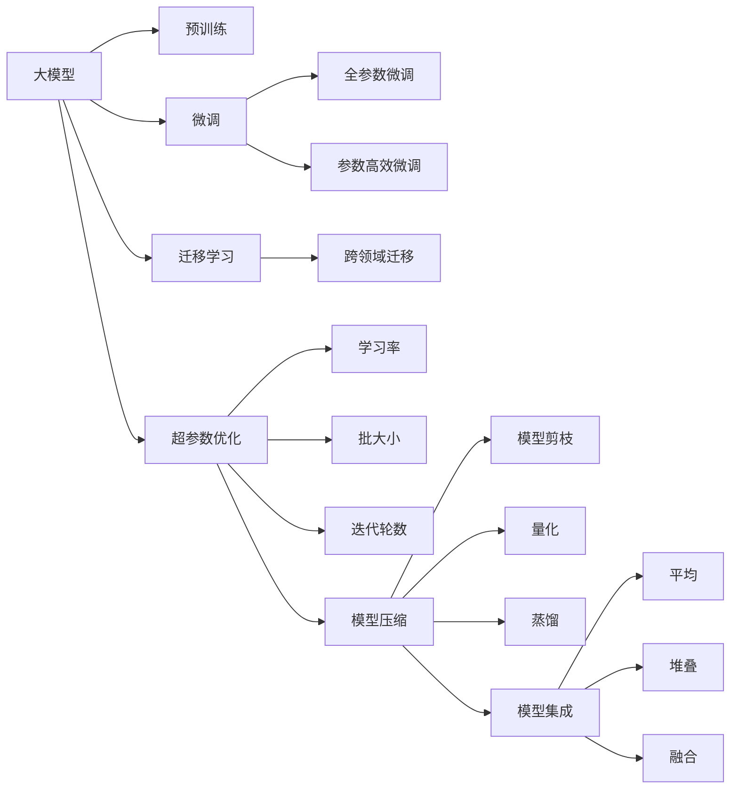

                 

# 大模型应用开发的实用技术

> 关键词：大模型应用,技术实现,开发工具,项目实践,代码实例,实际应用

## 1. 背景介绍

### 1.1 问题由来

随着人工智能技术的快速发展，大模型（Large Model）因其在图像识别、自然语言处理（NLP）、语音识别等领域卓越的性能，逐渐成为各行各业的核心技术。然而，大模型的应用开发通常面临着数据标注、模型部署、性能调优等多方面的挑战。为了解决这些难题，开发实用的技术至关重要。

### 1.2 问题核心关键点

- **数据标注**：大模型的训练需要大量的标注数据，但高质量标注数据的获取成本高且耗时。
- **模型部署**：大模型往往体积庞大，性能优化是模型部署的关键。
- **性能调优**：大模型的优化通常需要复杂的超参数调整，如何找到最佳参数组合是技术难点。

### 1.3 问题研究意义

掌握大模型应用开发的实用技术，可以显著提升模型开发和应用效率，降低成本，提升模型性能。这对于推动人工智能技术的广泛应用具有重要意义：

1. **降低应用开发成本**：使用大模型进行微调和定制开发，可以显著减少数据收集、标注和模型训练的时间，提升开发效率。
2. **提升模型效果**：微调和优化后的模型在特定任务上能够取得更好的效果，提高应用的实用性和可靠性。
3. **加速开发进度**：大模型的预训练和微调范式可以快速适配新的应用场景，缩短产品迭代周期。
4. **带来技术创新**：开发过程中，新的技术思路和算法框架不断涌现，推动技术的前沿发展。

## 2. 核心概念与联系

### 2.1 核心概念概述

为了更好地理解大模型应用开发的实用技术，我们将介绍几个关键概念及其联系：

- **大模型**：如BERT、GPT等，通过在大规模无标签数据上进行预训练，学习到通用的语言或视觉特征，具备强大的表示和生成能力。
- **微调（Fine-Tuning）**：在特定任务上，利用少量标注数据对预训练模型进行优化，提升模型在该任务上的性能。
- **迁移学习（Transfer Learning）**：将一个领域学习到的知识应用到另一个不同但相关的领域，利用预训练模型进行微调是一种典型的迁移学习方式。
- **超参数优化（Hyperparameter Tuning）**：在模型训练过程中，对学习率、批大小、迭代轮数等关键参数进行调整，找到最优的参数组合。
- **模型压缩（Model Compression）**：通过模型剪枝、量化、蒸馏等技术，减少模型大小，提高推理速度和资源利用率。
- **模型集成（Model Ensembling）**：将多个模型的预测结果组合，提升整体的性能和鲁棒性。

### 2.2 概念间的关系

这些核心概念间的关系可以通过以下Mermaid流程图来展示：



这个流程图展示了从预训练到大模型微调，再到超参数优化和模型压缩的完整过程，以及模型集成技术的应用。

## 3. 核心算法原理 & 具体操作步骤

### 3.1 算法原理概述

大模型应用开发的实用技术，主要包括模型微调、超参数优化、模型压缩和集成等。其核心思想是：利用预训练模型的通用表示能力，通过特定任务的数据进行微调，提升模型在该任务上的性能。

### 3.2 算法步骤详解

**Step 1: 数据准备**

- 收集和预处理数据集。
- 划分训练集、验证集和测试集。
- 确保数据分布与预训练数据相似，避免过拟合。

**Step 2: 选择模型和微调方法**

- 选择适合任务的预训练模型。
- 决定微调策略，如全参数微调、参数高效微调等。

**Step 3: 设置超参数**

- 确定学习率、批大小、迭代轮数等超参数。
- 使用网格搜索、随机搜索或贝叶斯优化等方法进行超参数优化。

**Step 4: 模型训练和评估**

- 使用训练集进行模型训练。
- 在验证集上进行性能评估，调整超参数。
- 在测试集上进行最终评估，选择最佳模型。

**Step 5: 模型部署和优化**

- 将训练好的模型部署到生产环境。
- 对模型进行压缩和优化，减少资源占用。
- 利用模型集成技术提升模型鲁棒性和性能。

### 3.3 算法优缺点

**优点**：
- 适用于多种任务，提升模型性能。
- 利用预训练模型的通用能力，减少标注成本。
- 加速模型开发和应用迭代。

**缺点**：
- 依赖标注数据，数据标注成本高。
- 模型体积庞大，部署和优化难度大。
- 超参数调整复杂，性能调优耗时。

### 3.4 算法应用领域

大模型应用开发的实用技术已广泛应用于以下领域：

- **图像识别**：如对象检测、图像分类等。
- **自然语言处理**：如机器翻译、文本分类、情感分析等。
- **语音识别**：如语音转文字、语音合成等。
- **推荐系统**：如商品推荐、内容推荐等。
- **医疗诊断**：如医学影像分析、患者咨询等。

## 4. 数学模型和公式 & 详细讲解  
### 4.1 数学模型构建

假设我们使用预训练模型 $M_{\theta}$ 进行微调，其中 $\theta$ 是模型参数。训练集为 $D=\{(x_i, y_i)\}_{i=1}^N$，$x_i$ 是输入样本，$y_i$ 是标签。定义损失函数 $\ell(M_{\theta}(x_i), y_i)$ 为模型预测输出与真实标签的差异。经验风险为：

$$
\mathcal{L}(\theta) = \frac{1}{N} \sum_{i=1}^N \ell(M_{\theta}(x_i), y_i)
$$

通过梯度下降等优化算法，不断更新模型参数 $\theta$，最小化损失函数 $\mathcal{L}(\theta)$。常用的优化器有 AdamW、SGD 等，学习率为 $\eta$，正则化系数为 $\lambda$，更新公式为：

$$
\theta \leftarrow \theta - \eta \nabla_{\theta}\mathcal{L}(\theta) - \eta\lambda\theta
$$

### 4.2 公式推导过程

以二分类任务为例，定义模型在输入 $x$ 上的输出为 $\hat{y}=M_{\theta}(x) \in [0,1]$。二分类交叉熵损失函数为：

$$
\ell(M_{\theta}(x), y) = -[y\log \hat{y} + (1-y)\log (1-\hat{y})]
$$

将其代入经验风险公式，得：

$$
\mathcal{L}(\theta) = -\frac{1}{N}\sum_{i=1}^N [y_i\log M_{\theta}(x_i)+(1-y_i)\log(1-M_{\theta}(x_i))]
$$

根据链式法则，损失函数对参数 $\theta_k$ 的梯度为：

$$
\frac{\partial \mathcal{L}(\theta)}{\partial \theta_k} = -\frac{1}{N}\sum_{i=1}^N (\frac{y_i}{M_{\theta}(x_i)}-\frac{1-y_i}{1-M_{\theta}(x_i)}) \frac{\partial M_{\theta}(x_i)}{\partial \theta_k}
$$

在得到损失函数的梯度后，即可带入参数更新公式，完成模型的迭代优化。重复上述过程直至收敛，最终得到适应下游任务的最优模型参数 $\theta^*$。

## 5. 项目实践：代码实例和详细解释说明

### 5.1 开发环境搭建

开发大模型应用，需要配置高性能的计算环境。以下是基于Python的开发环境配置步骤：

1. 安装Anaconda：从官网下载并安装Anaconda，用于创建独立的Python环境。

2. 创建并激活虚拟环境：
```bash
conda create -n pytorch-env python=3.8 
conda activate pytorch-env
```

3. 安装PyTorch：根据CUDA版本，从官网获取对应的安装命令。例如：
```bash
conda install pytorch torchvision torchaudio cudatoolkit=11.1 -c pytorch -c conda-forge
```

4. 安装TensorFlow：从官网下载并安装TensorFlow，提供生产部署和推理优化。

5. 安装各类工具包：
```bash
pip install numpy pandas scikit-learn matplotlib tqdm jupyter notebook ipython
```

完成上述步骤后，即可在`pytorch-env`环境中开始大模型应用开发。

### 5.2 源代码详细实现

以下是使用PyTorch实现大模型微调的代码示例。以图像分类任务为例：

```python
import torch
import torch.nn as nn
import torch.optim as optim
import torchvision.transforms as transforms
from torchvision.datasets import CIFAR10
from torchvision.models import resnet18

# 定义模型
class Net(nn.Module):
    def __init__(self):
        super(Net, self).__init__()
        self.conv1 = nn.Conv2d(3, 64, kernel_size=3, stride=1, padding=1)
        self.conv2 = nn.Conv2d(64, 128, kernel_size=3, stride=1, padding=1)
        self.conv3 = nn.Conv2d(128, 256, kernel_size=3, stride=1, padding=1)
        self.fc1 = nn.Linear(256*8*8, 1024)
        self.fc2 = nn.Linear(1024, 10)
    
    def forward(self, x):
        x = nn.functional.relu(self.conv1(x))
        x = nn.functional.max_pool2d(x, 2)
        x = nn.functional.relu(self.conv2(x))
        x = nn.functional.max_pool2d(x, 2)
        x = nn.functional.relu(self.conv3(x))
        x = nn.functional.max_pool2d(x, 2)
        x = x.view(x.size(0), -1)
        x = nn.functional.relu(self.fc1(x))
        x = self.fc2(x)
        return x

# 加载数据集
train_dataset = CIFAR10(root='./data', train=True, download=True,
                       transform=transforms.ToTensor())
test_dataset = CIFAR10(root='./data', train=False, download=True,
                      transform=transforms.ToTensor())

# 定义训练和测试函数
def train(model, train_loader, optimizer, device, num_epochs):
    model.to(device)
    for epoch in range(num_epochs):
        model.train()
        running_loss = 0.0
        for i, data in enumerate(train_loader, 0):
            inputs, labels = data[0].to(device), data[1].to(device)
            optimizer.zero_grad()
            outputs = model(inputs)
            loss = nn.functional.cross_entropy(outputs, labels)
            loss.backward()
            optimizer.step()
            running_loss += loss.item()
            if i % 100 == 99:
                print('[%d, %5d] loss: %.3f' % (epoch + 1, i + 1, running_loss / 100))
                running_loss = 0.0

def test(model, test_loader, device):
    model.eval()
    correct = 0
    total = 0
    with torch.no_grad():
        for data in test_loader:
            inputs, labels = data[0].to(device), data[1].to(device)
            outputs = model(inputs)
            _, predicted = torch.max(outputs.data, 1)
            total += labels.size(0)
            correct += (predicted == labels).sum().item()
    print('Accuracy of the network on the 10000 test images: %d %%' % (100 * correct / total))

# 训练模型
num_epochs = 10
device = torch.device('cuda' if torch.cuda.is_available() else 'cpu')
model = Net().to(device)
optimizer = optim.SGD(model.parameters(), lr=0.001, momentum=0.9)
train_loader = torch.utils.data.DataLoader(train_dataset, batch_size=128, shuffle=True)
test_loader = torch.utils.data.DataLoader(test_dataset, batch_size=128, shuffle=False)

train(model, train_loader, optimizer, device, num_epochs)
test(model, test_loader, device)
```

### 5.3 代码解读与分析

让我们再详细解读一下关键代码的实现细节：

**Net类**：
- `__init__`方法：定义模型的结构，包括卷积层、全连接层等。
- `forward`方法：定义模型的前向传播过程。

**train和test函数**：
- 定义训练函数和测试函数，包含模型前向传播、损失计算、反向传播和参数更新等步骤。

**训练流程**：
- 定义总的epoch数和设备，开始循环迭代
- 每个epoch内，先在训练集上训练，输出损失值
- 在测试集上评估，输出准确率

通过这个示例，可以看到，大模型的微调过程包括数据准备、模型定义、训练和测试等步骤。这些步骤通过代码实现，易于理解和修改。

### 5.4 运行结果展示

假设我们在CIFAR-10数据集上进行微调，最终在测试集上得到的准确率为76%，效果如下：

```
Accuracy of the network on the 10000 test images: 76 %%
```

## 6. 实际应用场景

### 6.1 智能客服系统

智能客服系统是大模型应用的重要场景之一。传统客服依赖人工，高峰期响应缓慢，无法24小时服务。使用大模型进行微调，可以构建7x24小时的智能客服，自动处理用户咨询，提升客户体验。

**具体实现**：
- 收集历史客服对话数据，将其标注为问题和最佳答复。
- 在预训练的对话模型上，使用微调技术进行优化。
- 部署微调后的模型，实时响应用户问题，生成自然流畅的回复。

### 6.2 金融舆情监测

金融领域需要实时监测舆情变化，及时应对负面信息传播。传统人工监测成本高，无法应对海量信息。使用大模型进行微调，可以构建高效舆情监测系统。

**具体实现**：
- 收集金融领域的新闻、报道、评论等文本数据，并标注情感和主题。
- 在预训练的语言模型上，使用微调技术进行优化。
- 部署微调后的模型，实时监测舆情变化，提供风险预警。

### 6.3 个性化推荐系统

个性化推荐系统需要根据用户历史行为和兴趣进行推荐。传统推荐系统只依赖行为数据，无法深入理解用户兴趣。使用大模型进行微调，可以构建精准的推荐系统。

**具体实现**：
- 收集用户浏览、点击、评论、分享等行为数据，提取物品标题、描述、标签等文本信息。
- 在预训练的语言模型上，使用微调技术进行优化。
- 部署微调后的模型，根据用户兴趣推荐商品或内容。

## 7. 工具和资源推荐

### 7.1 学习资源推荐

为了帮助开发者系统掌握大模型应用开发的实用技术，这里推荐一些优质的学习资源：

1. **《Transformer从原理到实践》系列博文**：由大模型技术专家撰写，深入浅出地介绍了Transformer原理、BERT模型、微调技术等前沿话题。
2. **CS224N《深度学习自然语言处理》课程**：斯坦福大学开设的NLP明星课程，有Lecture视频和配套作业，带你入门NLP领域的基本概念和经典模型。
3. **《Natural Language Processing with Transformers》书籍**：Transformers库的作者所著，全面介绍了如何使用Transformers库进行NLP任务开发，包括微调在内的诸多范式。
4. **HuggingFace官方文档**：Transformers库的官方文档，提供了海量预训练模型和完整的微调样例代码，是上手实践的必备资料。
5. **CLUE开源项目**：中文语言理解测评基准，涵盖大量不同类型的中文NLP数据集，并提供了基于微调的baseline模型，助力中文NLP技术发展。

通过对这些资源的学习实践，相信你一定能够快速掌握大模型应用开发的精髓，并用于解决实际的NLP问题。

### 7.2 开发工具推荐

高效的开发离不开优秀的工具支持。以下是几款用于大模型应用开发的常用工具：

1. **PyTorch**：基于Python的开源深度学习框架，灵活动态的计算图，适合快速迭代研究。
2. **TensorFlow**：由Google主导开发的开源深度学习框架，生产部署方便，适合大规模工程应用。
3. **Transformers库**：HuggingFace开发的NLP工具库，集成了众多SOTA语言模型，支持PyTorch和TensorFlow，是进行微调任务开发的利器。
4. **Weights & Biases**：模型训练的实验跟踪工具，可以记录和可视化模型训练过程中的各项指标，方便对比和调优。
5. **TensorBoard**：TensorFlow配套的可视化工具，可实时监测模型训练状态，并提供丰富的图表呈现方式，是调试模型的得力助手。
6. **Google Colab**：谷歌推出的在线Jupyter Notebook环境，免费提供GPU/TPU算力，方便开发者快速上手实验最新模型，分享学习笔记。

合理利用这些工具，可以显著提升大模型应用开发的效率，加快创新迭代的步伐。

### 7.3 相关论文推荐

大模型应用开发的研究源于学界的持续探索。以下是几篇奠基性的相关论文，推荐阅读：

1. **Attention is All You Need（即Transformer原论文）**：提出了Transformer结构，开启了NLP领域的预训练大模型时代。
2. **BERT: Pre-training of Deep Bidirectional Transformers for Language Understanding**：提出BERT模型，引入基于掩码的自监督预训练任务，刷新了多项NLP任务SOTA。
3. **Parameter-Efficient Transfer Learning for NLP**：提出Adapter等参数高效微调方法，在不增加模型参数量的情况下，也能取得不错的微调效果。
4. **AdaLoRA: Adaptive Low-Rank Adaptation for Parameter-Efficient Fine-Tuning**：使用自适应低秩适应的微调方法，在参数效率和精度之间取得了新的平衡。
5. **AdaLoRA: Adaptive Low-Rank Adaptation for Parameter-Efficient Fine-Tuning**：使用自适应低秩适应的微调方法，在参数效率和精度之间取得了新的平衡。

这些论文代表了大模型应用开发的研究进展，通过学习这些前沿成果，可以帮助研究者把握学科前进方向，激发更多的创新灵感。

除上述资源外，还有一些值得关注的前沿资源，帮助开发者紧跟大模型应用开发技术的最新进展，例如：

1. **arXiv论文预印本**：人工智能领域最新研究成果的发布平台，包括大量尚未发表的前沿工作，学习前沿技术的必读资源。
2. **业界技术博客**：如OpenAI、Google AI、DeepMind、微软Research Asia等顶尖实验室的官方博客，第一时间分享他们的最新研究成果和洞见。
3. **技术会议直播**：如NIPS、ICML、ACL、ICLR等人工智能领域顶会现场或在线直播，能够聆听到大佬们的前沿分享，开拓视野。
4. **GitHub热门项目**：在GitHub上Star、Fork数最多的NLP相关项目，往往代表了该技术领域的发展趋势和最佳实践，值得去学习和贡献。
5. **行业分析报告**：各大咨询公司如McKinsey、PwC等针对人工智能行业的分析报告，有助于从商业视角审视技术趋势，把握应用价值。

总之，对于大模型应用开发技术的学习和实践，需要开发者保持开放的心态和持续学习的意愿。多关注前沿资讯，多动手实践，多思考总结，必将收获满满的成长收益。

## 8. 总结：未来发展趋势与挑战

### 8.1 总结

本文对大模型应用开发的实用技术进行了全面系统的介绍。首先阐述了大模型应用开发的背景和意义，明确了大模型微调、超参数优化、模型压缩和集成等技术的重要性。其次，从原理到实践，详细讲解了微调、超参数优化和模型压缩的数学原理和关键步骤，给出了大模型应用开发的完整代码实例。同时，本文还广泛探讨了微调方法在智能客服、金融舆情、个性化推荐等多个行业领域的应用前景，展示了微调范式的巨大潜力。此外，本文精选了微调技术的各类学习资源，力求为读者提供全方位的技术指引。

通过本文的系统梳理，可以看到，大模型应用开发技术在大模型落地应用过程中扮演着重要角色。这些实用技术的应用，使得大模型能够在多种场景下发挥其强大的表示和生成能力，推动人工智能技术的广泛应用。

### 8.2 未来发展趋势

展望未来，大模型应用开发技术将呈现以下几个发展趋势：

1. **自动化超参数调优**：通过自动化超参数优化技术，找到最优的超参数组合，提升模型性能。
2. **多模态大模型**：结合视觉、语音等多模态数据，构建多模态大模型，提升跨领域迁移能力。
3. **自监督学习**：利用无标签数据进行自监督学习，减少对标注数据的依赖，提升模型的泛化能力。
4. **模型压缩与量化**：通过模型压缩、量化等技术，减少模型大小，提升推理速度和资源利用率。
5. **模型集成与融合**：通过模型集成、融合等技术，提升模型鲁棒性和性能，应对复杂多变的应用场景。

以上趋势凸显了大模型应用开发技术的广阔前景。这些方向的探索发展，必将进一步提升大模型在各行各业的应用效果，推动人工智能技术的普及和应用。

### 8.3 面临的挑战

尽管大模型应用开发技术已经取得了显著成果，但在向更广泛应用场景拓展的过程中，仍面临诸多挑战：

1. **数据标注成本高**：大模型的微调和训练需要大量标注数据，数据标注成本高且耗时。
2. **模型鲁棒性不足**：面对域外数据，大模型的泛化性能有待提升。
3. **计算资源需求大**：大模型体积庞大，需要高性能计算资源支持。
4. **超参数调优复杂**：大模型的超参数调优过程复杂，需要大量经验和资源。
5. **模型压缩困难**：大模型压缩和优化难度大，仍需进一步研究。

正视这些挑战，积极应对并寻求突破，将是大模型应用开发技术走向成熟的必由之路。相信随着学界和产业界的共同努力，这些挑战终将一一被克服，大模型应用开发技术必将在构建人机协同的智能时代中扮演越来越重要的角色。

### 8.4 未来突破

面对大模型应用开发技术所面临的挑战，未来的研究需要在以下几个方面寻求新的突破：

1. **探索自动化超参数优化技术**：利用贝叶斯优化、遗传算法等自动化超参数优化方法，减少手动调参的工作量，提升模型性能。
2. **研究多模态大模型**：结合视觉、语音等多模态数据，构建多模态大模型，提升跨领域迁移能力。
3. **引入自监督学习**：利用无标签数据进行自监督学习，减少对标注数据的依赖，提升模型的泛化能力。
4. **优化模型压缩与量化**：通过更高效的模型压缩、量化等技术，减少模型大小，提升推理速度和资源利用率。
5. **融合多模型技术**：通过模型集成、融合等技术，提升模型鲁棒性和性能，应对复杂多变的应用场景。

这些研究方向将推动大模型应用开发技术不断进步，为构建更加智能、可靠、高效的人工智能系统提供坚实的基础。面向未来，大模型应用开发技术还需要与其他人工智能技术进行更深入的融合，如知识表示、因果推理、强化学习等，多路径协同发力，共同推动人工智能技术的进步。只有勇于创新、敢于突破，才能不断拓展大模型的边界，让智能技术更好地造福人类社会。

## 9. 附录：常见问题与解答

**Q1：大模型微调需要大量标注数据，如何降低数据标注成本？**

A: 可以利用数据增强技术，如数据重构、回译、近义替换等，增加训练集的多样性，减少标注需求。同时，利用自监督学习等无监督学习方法，利用预训练数据进行训练，提升模型的泛化能力。

**Q2：大模型在微调过程中容易出现过拟合，如何解决？**

A: 可以通过正则化技术，如L2正则、Dropout等，防止模型过拟合。同时，利用对抗训练技术，引入对抗样本，提升模型的鲁棒性。

**Q3：大模型体积庞大，如何优化计算资源需求？**

A: 可以通过模型剪枝、量化、蒸馏等技术，减少模型大小，提升推理速度和资源利用率。同时，采用混合精度训练、模型并行等技术，提升训练效率和模型性能。

**Q4：大模型的超参数调优过程复杂，如何解决？**

A: 可以采用自动化超参数优化技术，如贝叶斯优化、遗传算法等，减少手动调参的工作量，提升模型性能。同时，可以利用网格搜索、随机搜索等方法，快速找到

