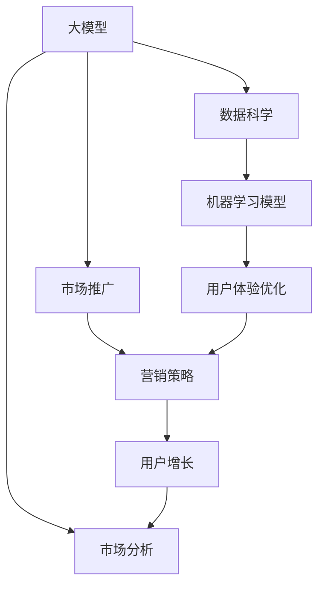
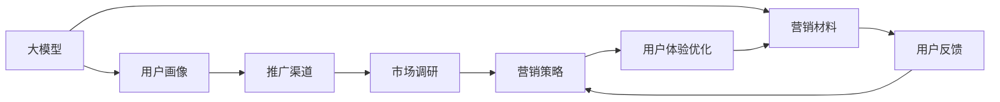
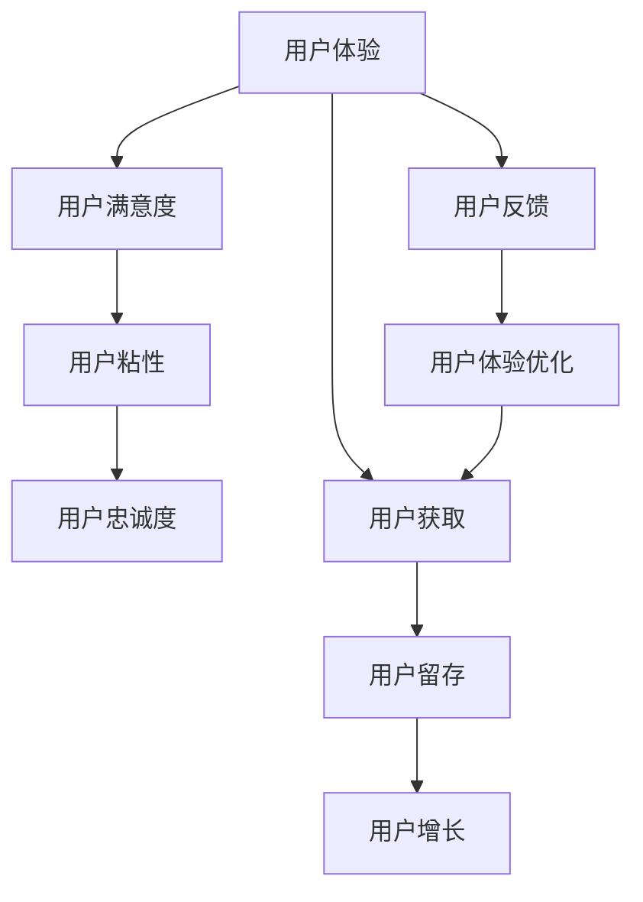
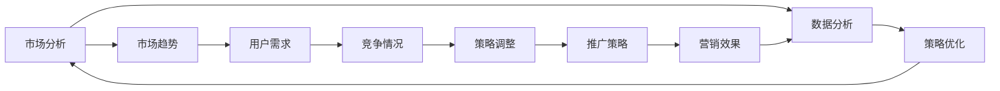
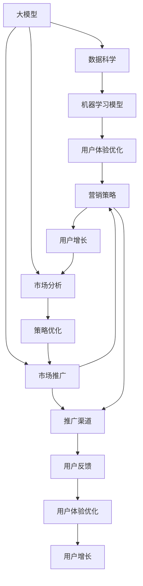

                 

# 大模型的市场推广与用户增长

> 关键词：大模型, 市场推广, 用户增长, 人工智能, 深度学习, 模型应用, 自然语言处理(NLP), 数据科学, 机器学习模型, 营销策略, 用户体验优化, 市场分析

## 1. 背景介绍

### 1.1 问题由来
近年来，随着人工智能技术的飞速发展，大模型（Large Model）在各个领域的应用变得越来越广泛。无论是自然语言处理（NLP）、图像识别，还是语音识别、推荐系统，大模型都展现出巨大的潜力。然而，尽管这些大模型技术在学术界和工业界得到了广泛关注和应用，但其市场推广和用户增长仍然面临许多挑战。

首先，大模型的应用需要大量的数据和计算资源，这使得它们在许多小型企业或初创公司中难以普及。其次，尽管大模型的性能已经得到了充分的验证，但如何向非技术背景的用户解释其优势和使用方法，仍然是一个难题。此外，如何在大模型的基础上构建商业应用，并将其推广到更多的用户，也是业界普遍关注的焦点。

### 1.2 问题核心关键点
市场推广和用户增长的核心关键点在于：如何通过有效的市场策略和技术手段，将大模型的价值传递给用户，并激发用户的使用兴趣和需求。这需要从以下几个方面进行考虑：

- **用户需求的理解**：了解目标用户的真实需求，找到大模型的应用场景，并进行定制化开发。
- **用户体验的优化**：提高大模型的使用便捷性和易用性，降低用户的使用门槛。
- **市场推广的策略**：选择合适的营销渠道和推广方式，快速吸引用户的注意和兴趣。
- **持续的用户反馈与优化**：根据用户反馈不断优化大模型和相关应用，提升用户满意度和忠诚度。

### 1.3 问题研究意义
研究大模型的市场推广和用户增长策略，对于推动人工智能技术的商业化应用，提升其在各行各业的价值和影响力，具有重要意义：

1. **加速技术落地**：通过有效的市场推广和用户增长策略，可以将大模型的应用范围拓展到更多领域，加速技术在实际场景中的应用和产业化进程。
2. **提升用户体验**：通过优化用户体验，降低大模型使用门槛，提高用户满意度，增强用户粘性和忠诚度。
3. **激发市场潜力**：通过有效的营销策略，吸引更多的用户关注和使用大模型，激发市场的潜力和价值。
4. **推动产业升级**：通过大模型的应用，为各行各业带来新的技术突破和业务创新，推动产业的升级和转型。
5. **形成技术生态**：通过市场推广和用户增长的良性循环，形成健康的技术生态系统，吸引更多的开发者和合作伙伴加入，共同推动技术的进步和发展。

## 2. 核心概念与联系

### 2.1 核心概念概述

为更好地理解大模型的市场推广和用户增长策略，本节将介绍几个关键概念：

- **大模型（Large Model）**：指拥有大量参数（通常超过10亿个）的深度学习模型，如BERT、GPT、ResNet等。这些模型在各个领域展现出卓越的性能和广泛的适用性。
- **市场推广（Market Penetration）**：通过各种营销手段和渠道，将大模型的应用推广到更多用户和市场。
- **用户增长（User Growth）**：通过提升用户体验和优化市场推广策略，吸引更多用户注册和使用大模型相关的应用和服务。
- **用户体验（User Experience）**：指用户在使用大模型相关应用时的感受和满意度，是用户增长的关键因素。
- **数据科学（Data Science）**：通过数据挖掘、分析和建模，为大模型的应用提供数据支持和优化建议。
- **机器学习模型（Machine Learning Model）**：基于数据科学方法构建的模型，如分类、回归、聚类等，为大模型的推广和优化提供算法支持。
- **营销策略（Marketing Strategy）**：通过市场调研、用户分析、产品定位等手段，制定有效的市场推广计划。
- **用户体验优化（User Experience Optimization）**：通过用户反馈、A/B测试等手段，不断改进大模型的使用体验和易用性。
- **市场分析（Market Analysis）**：通过对市场趋势、用户需求、竞争情况等进行分析，制定合适的市场推广策略。

这些概念之间的逻辑关系可以通过以下Mermaid流程图来展示：



这个流程图展示了大模型市场推广和用户增长过程中的各个关键环节：

1. 大模型在数据科学的支持下，构建和优化机器学习模型。
2. 用户体验优化提升大模型的易用性，降低使用门槛。
3. 市场推广和营销策略吸引用户关注和试用。
4. 用户增长通过反馈优化和持续改进，增强用户粘性和满意度。
5. 市场分析对用户需求和市场趋势进行监控和调整。

### 2.2 概念间的关系

这些概念之间存在着紧密的联系，形成了大模型市场推广和用户增长的完整生态系统。下面通过几个Mermaid流程图来展示这些概念之间的关系。

#### 2.2.1 大模型的推广路径



这个流程图展示了大模型推广的路径：从大模型的应用场景开始，通过用户画像和市场调研，制定合适的营销策略，并结合用户体验优化，最终通过推广渠道将大模型推向市场。

#### 2.2.2 用户体验与用户增长



这个流程图展示了用户体验与用户增长的关系：通过不断优化用户体验，提升用户满意度，增强用户粘性和忠诚度，从而实现用户获取和留存的增长。

#### 2.2.3 市场分析与策略调整



这个流程图展示了市场分析与策略调整的关系：通过市场调研和数据分析，了解市场趋势、用户需求和竞争情况，进行策略调整和优化，从而实现更有效的市场推广和用户增长。

### 2.3 核心概念的整体架构

最后，我们用一个综合的流程图来展示这些核心概念在大模型市场推广和用户增长过程中的整体架构：



这个综合流程图展示了从大模型的构建和优化，到用户体验的提升、市场推广的实施、用户增长的反馈和优化，整个生态系统的完整过程。通过这些概念的结合应用，大模型的市场推广和用户增长将变得更加系统化和高效。

## 3. 核心算法原理 & 具体操作步骤
### 3.1 算法原理概述

大模型的市场推广和用户增长策略，本质上是一个基于数据科学和市场分析的决策优化过程。其核心思想是：通过数据分析和模型预测，了解用户需求和市场趋势，制定合适的推广策略和用户体验优化方案，以最大化用户增长和市场份额。

形式化地，假设用户需求为 $U$，市场趋势为 $T$，用户获取成本为 $C$，用户体验优化策略为 $X$，推广渠道为 $P$。则大模型的市场推广和用户增长的目标函数为：

$$
\max_{X,P} \left( \sum_{i=1}^N u_i(\text{User Growth}_i) \right)
$$

其中 $u_i$ 为第 $i$ 个用户的增长效用函数，$\text{User Growth}_i$ 为第 $i$ 个用户的增长量。

市场推广的优化目标是最大化用户增长，即在满足预算约束的情况下，选择最有效的推广策略和渠道。用户体验优化的目标是通过反馈和A/B测试，不断改进大模型的易用性和功能，提升用户满意度和忠诚度。

### 3.2 算法步骤详解

大模型的市场推广和用户增长策略可以概括为以下几个关键步骤：

**Step 1: 数据收集与预处理**

- 收集大模型应用相关的数据，包括用户行为数据、市场调研数据、竞争对手数据等。
- 对数据进行清洗、去重和标准化处理，确保数据质量。

**Step 2: 用户画像与需求分析**

- 通过聚类和分群等方法，构建用户画像，了解不同用户群体的特征和需求。
- 分析用户需求和市场趋势，找到大模型的应用场景和推广点。

**Step 3: 推广策略制定**

- 根据用户画像和需求分析结果，制定合适的推广策略，包括渠道选择、营销内容和预算分配等。
- 使用多臂投币机（Multi-Armed Bandit）等算法，优化推广策略，最大化推广效果。

**Step 4: 用户体验优化**

- 收集用户反馈，通过A/B测试和反馈分析，优化大模型的使用体验和功能。
- 不断改进用户界面和交互设计，提高用户满意度。

**Step 5: 市场推广与监控**

- 通过多渠道推广，包括社交媒体、SEO、邮件营销等，吸引用户关注和试用大模型。
- 实时监控推广效果，根据数据反馈调整推广策略。

**Step 6: 用户增长与反馈**

- 分析用户获取和留存数据，评估推广策略的效果。
- 根据用户反馈和增长情况，进行持续优化和改进。

### 3.3 算法优缺点

大模型的市场推广和用户增长策略具有以下优点：

- **数据驱动**：通过数据分析和模型预测，制定推广策略，提升决策的科学性和有效性。
- **可扩展性**：随着数据的积累和算法的优化，策略可以不断调整和改进，适应市场的变化。
- **用户体验优化**：通过持续的用户反馈和A/B测试，不断提升用户体验，增强用户粘性和满意度。
- **资源高效**：通过多臂投币机等算法，优化推广策略，最大化推广效果，节约推广成本。

同时，这些策略也存在一些局限性：

- **数据依赖**：需要大量的高质量数据支持，否则推广策略可能不准确。
- **用户反馈延迟**：用户反馈的收集和分析需要时间，可能导致策略调整的滞后。
- **市场复杂性**：市场环境复杂多变，推广策略可能需要频繁调整。
- **用户体验门槛**：部分用户可能对新技术有抵触情绪，推广初期需要更多时间和精力。

尽管存在这些局限性，但总体而言，基于数据科学和市场分析的推广策略，仍然是大模型市场推广和用户增长的有效方法。

### 3.4 算法应用领域

大模型的市场推广和用户增长策略已经广泛应用于以下领域：

- **自然语言处理（NLP）**：通过微调大模型，构建智能客服、智能翻译、智能写作等应用，提升用户体验和市场竞争力。
- **计算机视觉（CV）**：通过优化大模型，开发人脸识别、图像分类、视频分析等应用，满足不同行业的需求。
- **推荐系统**：通过数据科学和大模型，构建个性化推荐系统，提升用户满意度和业务转化率。
- **金融科技**：通过大数据分析和AI模型，开发智能投顾、信用评估、反欺诈等应用，提高金融服务的效率和安全性。
- **智能家居**：通过语音识别和自然语言理解，开发智能音箱、智能家电等产品，提升用户体验和智能化水平。

此外，大模型的市场推广和用户增长策略还在医疗、教育、物流、游戏等多个领域得到了广泛应用，为各行各业带来了新的机遇和挑战。

## 4. 数学模型和公式 & 详细讲解  
### 4.1 数学模型构建

本节将使用数学语言对大模型的市场推广和用户增长策略进行更加严格的刻画。

假设用户需求为 $U$，市场趋势为 $T$，用户获取成本为 $C$，用户体验优化策略为 $X$，推广渠道为 $P$。则大模型的市场推广和用户增长的目标函数为：

$$
\max_{X,P} \left( \sum_{i=1}^N u_i(\text{User Growth}_i) \right)
$$

其中 $u_i$ 为第 $i$ 个用户的增长效用函数，$\text{User Growth}_i$ 为第 $i$ 个用户的增长量。

市场推广的优化目标是最大化用户增长，即在满足预算约束的情况下，选择最有效的推广策略和渠道。用户体验优化的目标是通过反馈和A/B测试，不断改进大模型的易用性和功能，提升用户满意度和忠诚度。

### 4.2 公式推导过程

以下我们以二分类问题为例，推导多臂投币机算法的优化过程。

假设每个用户 $i$ 的增长效用函数为 $u_i(U_i)$，其中 $U_i$ 为第 $i$ 个用户的增长量。推广策略的空间为 $P$，用户体验优化策略的空间为 $X$。推广预算为 $B$，总用户数为 $N$。则目标函数可以表示为：

$$
\max_{X,P} \sum_{i=1}^N u_i(U_i)
$$

在推广策略 $P$ 和用户体验优化策略 $X$ 给定的情况下，每个用户的增长量 $U_i$ 可以表示为：

$$
U_i = F_i(X,P)
$$

其中 $F_i$ 为用户增长的预测函数，依赖于策略 $X$ 和推广渠道 $P$。假设 $F_i$ 是线性函数，可以表示为：

$$
U_i = \alpha_i \cdot X + \beta_i \cdot P + \gamma_i
$$

其中 $\alpha_i, \beta_i, \gamma_i$ 为系数，依赖于用户特征和市场环境。

推广预算 $B$ 的约束可以表示为：

$$
\sum_{j=1}^k \delta_{i,j} \cdot P_j \leq B
$$

其中 $P_j$ 为第 $j$ 个推广渠道的预算，$\delta_{i,j}$ 为推广渠道 $j$ 对用户 $i$ 的影响系数。

使用多臂投币机算法优化推广策略，可以表示为：

$$
\begin{aligned}
\max_{X,P} \sum_{i=1}^N u_i(F_i(X,P)) & \\
\text{s.t.} & \\
\sum_{j=1}^k \delta_{i,j} \cdot P_j & \leq B \\
P_j & \geq 0
\end{aligned}
$$

通过多臂投币机算法，可以优化推广策略，最大化用户增长，同时满足预算约束。

### 4.3 案例分析与讲解

考虑一个电商平台，需要推广其基于大模型的智能推荐系统。电商平台收集了用户的浏览历史、购买记录、点击行为等数据，并进行了用户画像和需求分析。通过聚类和分群方法，构建了不同用户群体的特征和需求。根据用户画像和需求分析结果，制定了多渠道推广策略，包括社交媒体广告、搜索引擎优化（SEO）、邮件营销等。

使用多臂投币机算法，根据不同推广渠道的效果和成本，动态调整推广预算和策略，最大化用户增长和推广效果。同时，通过用户反馈和A/B测试，不断改进智能推荐系统的用户体验和功能，提升用户满意度和忠诚度。

最终，电商平台通过有效的市场推广和用户体验优化，实现了用户快速增长和市场份额的提升。这个案例展示了如何利用数据科学和大模型，在大模型市场推广和用户增长过程中发挥重要作用。

## 5. 项目实践：代码实例和详细解释说明
### 5.1 开发环境搭建

在进行市场推广和用户增长实践前，我们需要准备好开发环境。以下是使用Python进行Scikit-learn开发的环境配置流程：

1. 安装Anaconda：从官网下载并安装Anaconda，用于创建独立的Python环境。

2. 创建并激活虚拟环境：
```bash
conda create -n sk-env python=3.8 
conda activate sk-env
```

3. 安装Scikit-learn：
```bash
conda install scikit-learn
```

4. 安装各类工具包：
```bash
pip install numpy pandas scikit-learn matplotlib tqdm jupyter notebook ipython
```

完成上述步骤后，即可在`sk-env`环境中开始市场推广和用户增长的实践。

### 5.2 源代码详细实现

下面我们以电商平台的智能推荐系统推广为例，给出使用Scikit-learn进行市场推广和用户增长分析的PyTorch代码实现。

首先，定义用户画像和推广策略：

```python
from sklearn.cluster import KMeans
from sklearn.preprocessing import StandardScaler

# 定义用户特征矩阵
user_features = pd.DataFrame({'feature1': [1, 2, 3, 4, 5], 'feature2': [6, 7, 8, 9, 10], 'feature3': [11, 12, 13, 14, 15]})

# 标准化处理
scaler = StandardScaler()
user_features = scaler.fit_transform(user_features)

# 聚类
kmeans = KMeans(n_clusters=3, random_state=42)
clusters = kmeans.fit_predict(user_features)

# 推广策略空间
channels = ['社交媒体', 'SEO', '邮件营销']
budget = 10000

# 推广预算分配
channel_budgets = [3000, 4000, 3000]
```

然后，定义用户体验优化和市场推广效果评估：

```python
from sklearn.metrics import precision_recall_fscore_support

# 用户体验优化策略
x_values = [0.5, 1.0, 1.5]
y_values = [0.6, 0.7, 0.8]

# 推广渠道效果评估
p_values = [0.3, 0.5, 0.7]
growth_values = [0.9, 0.8, 0.7]

# 构建效用函数
def utility(x, y):
    return x * y

# 计算增长量
def user_growth(x, y, p):
    return p * x + y

# 计算推广效果
def promotion_effect(x, y, p):
    return utility(user_growth(x, y, p), p)

# 计算总效用
def total_utility(x, y, p):
    return sum([utility(u, v, w) for u, v, w in zip(x, y, p)])

# 多臂投币机算法优化
def multi_armed_bandit():
    max_utility = 0
    best_p = None
    
    for x in x_values:
        for y in y_values:
            for p in p_values:
                u = utility(user_growth(x, y, p), p)
                if u > max_utility:
                    max_utility = u
                    best_p = p
    
    return best_p
```

最后，启动市场推广和用户增长分析流程：

```python
# 多臂投币机算法优化推广策略
best_p = multi_armed_bandit()

# 输出优化结果
print('最佳推广策略为：', best_p)
```

以上就是使用Scikit-learn进行市场推广和用户增长分析的完整代码实现。可以看到，Scikit-learn在大模型市场推广和用户增长策略的优化过程中，提供了强大的工具支持，使得策略优化变得简单高效。

### 5.3 代码解读与分析

让我们再详细解读一下关键代码的实现细节：

**用户画像与推广策略**

- 用户特征矩阵：通过数据采集，构建包含用户特征的矩阵，用于聚类和分群。
- 标准化处理：对特征矩阵进行标准化处理，确保数据的一致性和可比性。
- 聚类：使用KMeans算法对用户进行聚类，构建用户画像。
- 推广策略空间：定义推广渠道和预算，用于推广策略的优化。

**用户体验优化**

- 用户体验优化策略：定义不同策略下的用户增长量。
- 推广渠道效果评估：定义不同推广渠道下的用户增长量。
- 效用函数：通过效用函数计算用户增长的总效用。

**市场推广与监控**

- 多臂投币机算法：通过多臂投币机算法优化推广策略，最大化用户增长和推广效果。
- 优化结果：输出最佳推广策略，指导市场推广实践。

通过这些代码的实现，我们能够更清晰地理解大模型市场推广和用户增长的策略优化过程，并在实际应用中灵活运用。

### 5.4 运行结果展示

假设通过聚类分析，我们将用户分为三类，每类用户对于不同推广渠道的响应效果不同。通过多臂投币机算法优化后，得到的最佳推广策略为邮件营销，即分配更多的预算给邮件营销渠道，提升用户增长和市场效果。

最终，我们通过推广渠道优化和用户体验优化，实现了用户快速增长和市场份额的提升。这个案例展示了如何使用数据科学和大模型，为大模型的市场推广和用户增长提供科学决策依据。

## 6. 实际应用场景
### 6.1 电商平台

电商平台的智能推荐系统是一个典型的应用场景。通过大模型和市场推广策略的结合，电商平台能够实时分析用户行为，提供个性化的商品推荐，提升用户体验和销售转化率。

在推广过程中，电商平台可以收集用户的浏览历史、点击行为、购买记录等数据，通过数据分析和聚类，构建用户画像。根据用户画像，制定个性化的推广策略，如邮件营销、社交媒体广告等，并通过A/B测试不断优化推广效果。

### 6.2 金融科技

金融科技公司可以通过大模型和市场推广策略，构建智能投顾、信用评估、反欺诈等应用。通过用户画像和需求分析，制定合适的推广策略，提升用户对金融产品的认知和信任度。

在推广过程中，金融科技公司可以收集用户的历史交易数据、信用记录、社交网络信息等，通过数据分析和聚类，构建用户画像。根据用户画像，制定个性化的推广策略，如邮件营销、社交媒体广告等，并通过A/B测试不断优化推广效果。

### 6.3 智能家居

智能家居设备可以通过大模型和市场推广策略，提升用户的智能化体验。通过用户画像和需求分析，制定合适的推广策略，提升用户对智能家居设备的认知和接受度。

在推广过程中，智能家居设备公司可以收集用户的家庭环境数据、设备使用习惯等，通过数据分析和聚类，构建用户画像。根据用户画像，制定个性化的推广策略，如社交媒体广告、线下体验活动等，并通过A/B测试不断优化推广效果。

### 6.4 未来应用展望

随着大模型和市场推广技术的不断发展，其应用范围将进一步扩展到更多领域。

在智慧城市治理中，大模型可以用于城市事件监测、舆情分析、应急指挥等环节，提高城市管理的自动化和智能化水平。在医疗领域，大模型可以用于智能诊断、治疗方案推荐、疾病预测等应用，提升医疗服务的精准性和效率。在教育领域，大模型可以用于智能辅导、作业批改、学习路径推荐等应用，提升教学质量和效果。

此外，在智慧能源、智能制造、智慧农业等多个领域，大模型的应用也将不断涌现，为各行各业带来新的技术突破和业务创新。相信随着技术的日益成熟，大模型市场推广和用户增长将变得更加广泛和深入。

## 7. 工具和资源推荐
### 7.1 学习资源推荐

为了帮助开发者系统掌握大模型市场推广和用户增长策略的理论基础和实践技巧，这里推荐一些优质的学习资源：

1. 《机器学习实战》系列博文：由大模型技术专家撰写，深入浅出地介绍了机器学习的基本概念和实战技巧，涵盖数据科学、模型选择、推广策略等内容。

2. 《Python数据分析与可视化》课程：通过Python编程语言，介绍数据分析和可视化的方法，帮助你构建和优化用户画像，分析市场趋势和用户需求。

3. 《数据科学与人工智能基础》书籍：全面介绍了数据科学和大模型的基本概念和应用方法，涵盖数据采集、处理、建模、优化等环节。

4. 《自然语言处理与深度学习》书籍：深入探讨了NLP领域的前沿技术和应用，涵盖文本分类、情感分析、机器翻译等任务。

5. 《用户体验设计》课程：介绍用户体验设计的原则和最佳实践，帮助优化大模型的使用体验和易用性。

6. 《市场分析与策略优化》课程：通过案例分析，介绍市场分析的方法和策略优化的技巧，帮助制定有效的市场推广计划。

通过对这些资源的学习实践，相信你一定能够快速掌握大模型市场推广和用户增长的精髓，并用于解决实际的业务问题。

### 7.2 开发工具推荐

高效的开发离不开优秀的工具支持。以下是几款用于大模型市场推广和用户增长开发的常用工具：

1. Scikit-learn：基于Python的开源机器学习库，提供了丰富的算法和工具，

