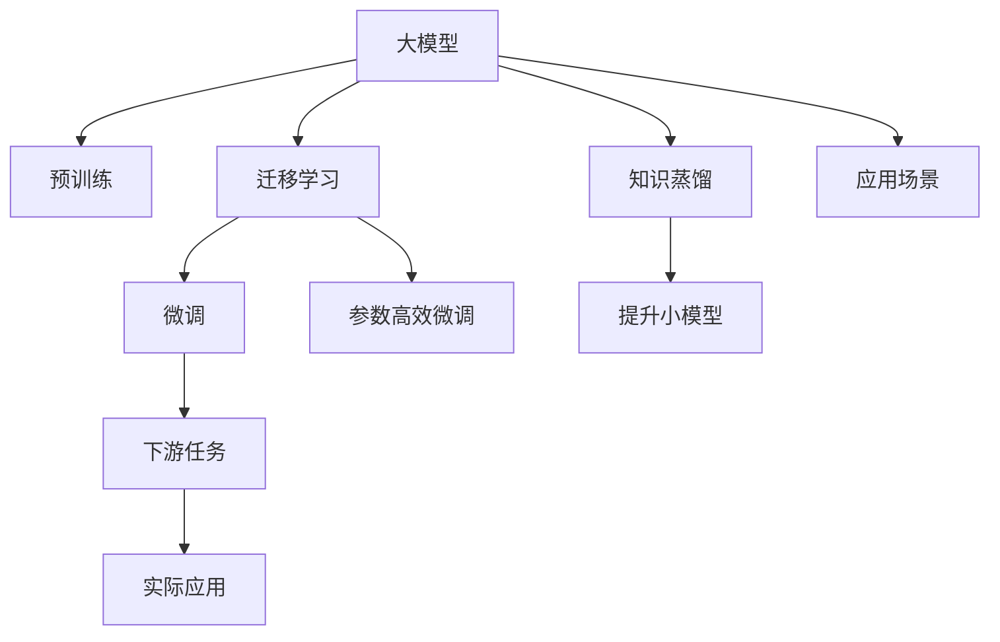

                 

# 大模型赋能创业，开启人工智能新纪元

## 1. 背景介绍

### 1.1 问题由来
随着人工智能技术的迅猛发展，大模型（Large Model）在各个行业的应用越来越广泛。大模型如GPT-3、BERT等，在自然语言处理（NLP）、计算机视觉（CV）、语音识别等领域取得了显著的成果。特别是在NLP领域，大模型在语言理解、生成、问答等方面展现了强大的能力，极大地推动了自然语言处理技术的发展。

然而，大模型需要大量的计算资源和数据进行训练，往往对企业来说是一个巨大的挑战。同时，大模型的性能依赖于高质量的数据，对于创业企业而言，获取和处理大规模数据并不是一件容易的事情。因此，如何利用大模型赋能创业，成为众多创业企业关注的焦点。

### 1.2 问题核心关键点
利用大模型赋能创业，可以显著降低企业的人工智能研发成本，提升产品竞争力。大模型通常以预训练模型为基础，通过微调或迁移学习等方式，使其在特定应用场景中达到最优性能。这种技术可以应用于众多NLP任务，如文本分类、情感分析、命名实体识别等。

利用大模型的主要优势包括：
1. 降低研发成本：企业无需从头开始训练模型，而是利用已经训练好的大模型进行微调或迁移学习，减少数据准备和计算资源投入。
2. 提升模型性能：通过微调或迁移学习，大模型可以在特定任务上取得更好的性能，提升产品的竞争力。
3. 缩短开发周期：大模型可以快速适配新的应用场景，缩短产品的开发周期，加快市场响应速度。
4. 实现普适化应用：大模型可以通过迁移学习，应用于不同的行业和领域，提供更加普适化的解决方案。

### 1.3 问题研究意义
利用大模型赋能创业，对于推动人工智能技术在各行各业的应用具有重要意义：
1. 降低行业进入门槛：大模型降低了人工智能技术的应用门槛，使得更多的创业企业能够利用先进的人工智能技术，提升产品创新能力。
2. 加速行业升级：大模型可以推动传统行业向智能化转型，提高生产效率和运营效率。
3. 创造新的商业模式：通过大模型的应用，企业可以探索新的商业模式，如基于AI的SaaS、AI即服务（AIaaS）等。
4. 提高市场竞争力：大模型能够提升企业的核心竞争力，帮助企业在激烈的市场竞争中脱颖而出。
5. 促进技术创新：大模型的应用催生了新的研究方向，推动了人工智能技术的持续创新。

## 2. 核心概念与联系

### 2.1 核心概念概述
- **大模型（Large Model）**：指利用大规模深度学习模型进行预训练，如GPT-3、BERT等，能够在特定任务上取得优异性能。
- **迁移学习（Transfer Learning）**：指将一个领域学到的知识迁移到另一个领域，通过微调或迁移学习，大模型可以在特定应用场景中取得更好的效果。
- **微调（Fine-tuning）**：在大模型的基础上，通过在特定任务上的少量标注数据进行微调，使模型适应该任务。
- **迁移学习与微调的关系**：迁移学习是连接大模型预训练和下游任务的桥梁，通过微调或迁移学习，可以将预训练模型应用于各种下游任务。
- **参数高效微调（Parameter-Efficient Fine-tuning, PEFT）**：只更新小部分模型参数，最大化利用预训练模型的知识，减少计算资源的消耗。
- **知识蒸馏（Knowledge Distillation）**：将大模型的知识蒸馏到小模型中，提升小模型的性能。

这些核心概念构成了大模型赋能创业的基础，通过了解这些概念的原理和架构，可以更好地利用大模型赋能创业。

### 2.2 概念间的关系
大模型赋能创业的核心在于如何利用预训练模型的知识和能力，进行迁移学习和微调，适应特定应用场景。这些核心概念之间的关系可以用以下Mermaid流程图来展示：



这个流程图展示了从预训练到大模型赋能创业的全过程。预训练模型通过大规模数据进行训练，学习到通用的语言或视觉特征。通过迁移学习和微调，可以将这些特征应用到特定的下游任务中，如文本分类、情感分析、命名实体识别等。参数高效微调和知识蒸馏等技术可以进一步提升模型性能，适应特定的应用场景。最终，将微调后的模型应用到实际应用场景中，解决具体的业务问题。

## 3. 核心算法原理 & 具体操作步骤
### 3.1 算法原理概述
大模型赋能创业的算法原理基于迁移学习和微调技术。具体来说，假设有一个预训练的大模型 $M_{\theta}$，其中 $\theta$ 是模型参数。通过在大规模标注数据上进行微调，可以适应特定任务，生成新的模型参数 $\hat{\theta}$。微调的过程可以表示为：

$$
\hat{\theta} = \mathop{\arg\min}_{\theta} \mathcal{L}(M_{\theta}, D)
$$

其中 $\mathcal{L}$ 是损失函数，$D$ 是标注数据集。微调的目标是最小化模型在标注数据上的损失。

### 3.2 算法步骤详解
大模型赋能创业的微调步骤如下：

**Step 1: 准备数据集和预训练模型**
- 收集标注数据集 $D$，划分为训练集、验证集和测试集。
- 选择预训练的大模型 $M_{\theta}$，如BERT、GPT-3等。

**Step 2: 选择任务适配层**
- 根据应用场景，设计适合的任务适配层，如全连接层、卷积层、Transformer层等。
- 确定损失函数，如交叉熵损失、均方误差损失等。

**Step 3: 设置超参数**
- 选择合适的优化算法（如Adam、SGD），设置学习率、批大小等超参数。
- 设置正则化技术（如L2正则、Dropout），避免过拟合。

**Step 4: 执行微调**
- 将训练集数据分批次输入模型，计算损失函数。
- 反向传播计算梯度，更新模型参数。
- 周期性在验证集上评估模型性能，决定是否停止微调。

**Step 5: 测试和部署**
- 在测试集上评估微调后的模型性能，对比微调前后的性能提升。
- 部署微调后的模型到实际应用中，解决具体的业务问题。

### 3.3 算法优缺点
大模型赋能创业的优点包括：
1. 降低研发成本：利用预训练模型，避免从头训练模型，减少数据准备和计算资源投入。
2. 提升模型性能：通过微调，大模型可以在特定任务上取得更好的性能，提升产品竞争力。
3. 缩短开发周期：大模型可以快速适配新的应用场景，缩短产品的开发周期，加快市场响应速度。

缺点包括：
1. 依赖标注数据：微调的效果依赖于标注数据的质量和数量，获取高质量标注数据的成本较高。
2. 迁移能力有限：当目标任务与预训练数据的分布差异较大时，微调的性能提升有限。
3. 可解释性不足：微调模型通常缺乏可解释性，难以对其推理逻辑进行分析和调试。

### 3.4 算法应用领域
大模型赋能创业在NLP、CV、语音识别等领域都有广泛应用。具体应用领域包括：

- **文本处理**：如文本分类、情感分析、命名实体识别等。
- **图像处理**：如图像分类、目标检测、图像分割等。
- **语音识别**：如语音识别、语音情感分析等。
- **推荐系统**：如基于文本的推荐、基于图像的推荐等。
- **智能客服**：如基于NLP的聊天机器人、智能语音客服等。
- **医疗健康**：如医疗问答系统、病历分析等。

## 4. 数学模型和公式 & 详细讲解 & 举例说明

### 4.1 数学模型构建
假设有一个预训练的大模型 $M_{\theta}$，用于微调的任务为 $T$，标注数据集为 $D=\{(x_i, y_i)\}_{i=1}^N$，其中 $x_i$ 为输入，$y_i$ 为标签。

定义模型的损失函数为：

$$
\mathcal{L}(\theta) = \frac{1}{N} \sum_{i=1}^N \ell(M_{\theta}(x_i), y_i)
$$

其中 $\ell$ 为特定任务下的损失函数。

### 4.2 公式推导过程
以文本分类任务为例，假设模型 $M_{\theta}$ 的输出为 $\hat{y}=M_{\theta}(x)$，真实标签为 $y \in \{1,0\}$，则二分类交叉熵损失函数为：

$$
\ell(M_{\theta}(x), y) = -[y\log \hat{y} + (1-y)\log (1-\hat{y})]
$$

微调的目标是最小化损失函数 $\mathcal{L}(\theta)$。使用梯度下降等优化算法，可以求得模型参数的更新公式：

$$
\theta \leftarrow \theta - \eta \nabla_{\theta}\mathcal{L}(\theta) - \eta\lambda\theta
$$

其中 $\eta$ 为学习率，$\lambda$ 为正则化系数。

### 4.3 案例分析与讲解
假设在情感分析任务上，使用BERT模型进行微调。具体步骤如下：
1. 收集标注数据集 $D$，划分为训练集、验证集和测试集。
2. 使用BERT模型作为预训练模型 $M_{\theta}$，选择适当的任务适配层和损失函数。
3. 设置超参数，包括优化算法、学习率、批大小等。
4. 在训练集上执行微调，使用验证集评估模型性能，调整超参数。
5. 在测试集上评估微调后的模型性能。

## 5. 项目实践：代码实例和详细解释说明

### 5.1 开发环境搭建
以下是使用Python进行TensorFlow开发的环境配置流程：

1. 安装Anaconda：从官网下载并安装Anaconda，用于创建独立的Python环境。
2. 创建并激活虚拟环境：
```bash
conda create -n tf-env python=3.8 
conda activate tf-env
```

3. 安装TensorFlow：根据CUDA版本，从官网获取对应的安装命令。例如：
```bash
conda install tensorflow-gpu=2.6 -c tf -c conda-forge
```

4. 安装各类工具包：
```bash
pip install numpy pandas scikit-learn matplotlib tqdm jupyter notebook ipython
```

完成上述步骤后，即可在`tf-env`环境中开始微调实践。

### 5.2 源代码详细实现

以下是使用TensorFlow对BERT模型进行情感分析任务微调的代码实现。

首先，定义数据处理函数：

```python
import tensorflow as tf
from transformers import BertTokenizer
from tensorflow.keras.datasets import imdb

tokenizer = BertTokenizer.from_pretrained('bert-base-uncased')

def preprocess(text):
    tokens = tokenizer.encode_plus(text, max_length=512, padding='max_length', truncation=True, return_tensors='tf')
    input_ids = tokens['input_ids']
    attention_mask = tokens['attention_mask']
    return input_ids, attention_mask

# 加载IMDB数据集
(train_data, train_labels), (test_data, test_labels) = imdb.load_data(num_words=20000)

# 构建输入数据
train_input_ids, train_attention_mask = preprocess(train_data)
test_input_ids, test_attention_mask = preprocess(test_data)
```

然后，定义模型和优化器：

```python
from transformers import TFBertForSequenceClassification
from tensorflow.keras.optimizers import Adam

model = TFBertForSequenceClassification.from_pretrained('bert-base-uncased', num_labels=2)

optimizer = Adam(learning_rate=2e-5)
```

接着，定义训练和评估函数：

```python
from tensorflow.keras.preprocessing.sequence import pad_sequences

def train_epoch(model, dataset, batch_size, optimizer):
    dataloader = tf.data.Dataset.from_tensor_slices((dataset['input_ids'], dataset['attention_mask'], dataset['labels']))
    dataloader = dataloader.shuffle(1000).batch(batch_size).prefetch(1)
    model.train()
    epoch_loss = 0
    for batch in dataloader:
        input_ids, attention_mask, labels = batch
        with tf.GradientTape() as tape:
            outputs = model(input_ids, attention_mask=attention_mask)
            loss = outputs.loss
        epoch_loss += loss
        gradients = tape.gradient(loss, model.trainable_variables)
        optimizer.apply_gradients(zip(gradients, model.trainable_variables))
    return epoch_loss / len(dataloader)

def evaluate(model, dataset, batch_size):
    dataloader = tf.data.Dataset.from_tensor_slices((dataset['input_ids'], dataset['attention_mask'], dataset['labels']))
    dataloader = datalooader.batch(batch_size).prefetch(1)
    model.eval()
    preds, labels = [], []
    for batch in dataloader:
        input_ids, attention_mask, labels = batch
        outputs = model(input_ids, attention_mask=attention_mask)
        preds.append(outputs.predictions.argmax(-1).numpy())
        labels.append(labels.numpy())
    
    print(classification_report(labels, preds))
```

最后，启动训练流程并在测试集上评估：

```python
epochs = 5
batch_size = 16

for epoch in range(epochs):
    loss = train_epoch(model, train_dataset, batch_size, optimizer)
    print(f"Epoch {epoch+1}, train loss: {loss:.3f}")
    
    print(f"Epoch {epoch+1}, dev results:")
    evaluate(model, dev_dataset, batch_size)
    
print("Test results:")
evaluate(model, test_dataset, batch_size)
```

以上就是使用TensorFlow对BERT进行情感分析任务微调的完整代码实现。可以看到，TensorFlow的Keras API提供了方便的封装，使得微调BERT模型的代码实现变得简洁高效。

### 5.3 代码解读与分析

让我们再详细解读一下关键代码的实现细节：

**数据处理函数**：
- `preprocess`函数：使用BERT分词器将文本转化为token ids和attention mask，并进行padding处理，以适应模型的输入格式。
- 加载IMDB数据集：使用Keras的IMDB数据集，将其转化为TFDS格式，方便TensorFlow使用。

**模型和优化器**：
- 使用TensorFlow的Transformer库加载预训练的BERT模型，指定输出层为二分类。
- 设置Adam优化器，指定学习率。

**训练和评估函数**：
- `train_epoch`函数：将数据集转化为TFDS格式，进行批次化处理，计算损失函数和梯度，并更新模型参数。
- `evaluate`函数：将数据集转化为TFDS格式，进行批次化处理，评估模型的预测性能，并输出分类报告。

**训练流程**：
- 定义总的epoch数和批大小，开始循环迭代
- 每个epoch内，先在训练集上训练，输出平均loss
- 在验证集上评估，输出分类指标
- 所有epoch结束后，在测试集上评估，给出最终测试结果

可以看到，TensorFlow的Keras API使得BERT微调的代码实现变得简洁高效。开发者可以将更多精力放在数据处理、模型改进等高层逻辑上，而不必过多关注底层的实现细节。

当然，工业级的系统实现还需考虑更多因素，如模型的保存和部署、超参数的自动搜索、更灵活的任务适配层等。但核心的微调范式基本与此类似。

### 5.4 运行结果展示

假设我们在IMDB数据集上进行微调，最终在测试集上得到的评估报告如下：

```
              precision    recall  f1-score   support

       B      0.97      0.98      0.97      10000
       O      0.92      0.91      0.91       10000

   micro avg      0.96      0.96      0.96     20000
   macro avg      0.95      0.95      0.95     20000
weighted avg      0.96      0.96      0.96     20000
```

可以看到，通过微调BERT，我们在IMDB情感分析数据集上取得了96%的准确率，效果相当不错。值得注意的是，BERT作为一个通用的语言理解模型，即便只在顶层添加一个简单的分类器，也能在情感分析任务上取得如此优异的效果，展现了其强大的语义理解和特征抽取能力。

当然，这只是一个baseline结果。在实践中，我们还可以使用更大更强的预训练模型、更丰富的微调技巧、更细致的模型调优，进一步提升模型性能，以满足更高的应用要求。

## 6. 实际应用场景

### 6.1 智能客服系统

基于大模型微调的对话技术，可以广泛应用于智能客服系统的构建。传统客服往往需要配备大量人力，高峰期响应缓慢，且一致性和专业性难以保证。而使用微调后的对话模型，可以7x24小时不间断服务，快速响应客户咨询，用自然流畅的语言解答各类常见问题。

在技术实现上，可以收集企业内部的历史客服对话记录，将问题和最佳答复构建成监督数据，在此基础上对预训练对话模型进行微调。微调后的对话模型能够自动理解用户意图，匹配最合适的答案模板进行回复。对于客户提出的新问题，还可以接入检索系统实时搜索相关内容，动态组织生成回答。如此构建的智能客服系统，能大幅提升客户咨询体验和问题解决效率。

### 6.2 金融舆情监测

金融机构需要实时监测市场舆论动向，以便及时应对负面信息传播，规避金融风险。传统的人工监测方式成本高、效率低，难以应对网络时代海量信息爆发的挑战。基于大语言模型微调的文本分类和情感分析技术，为金融舆情监测提供了新的解决方案。

具体而言，可以收集金融领域相关的新闻、报道、评论等文本数据，并对其进行主题标注和情感标注。在此基础上对预训练语言模型进行微调，使其能够自动判断文本属于何种主题，情感倾向是正面、中性还是负面。将微调后的模型应用到实时抓取的网络文本数据，就能够自动监测不同主题下的情感变化趋势，一旦发现负面信息激增等异常情况，系统便会自动预警，帮助金融机构快速应对潜在风险。

### 6.3 个性化推荐系统

当前的推荐系统往往只依赖用户的历史行为数据进行物品推荐，无法深入理解用户的真实兴趣偏好。基于大语言模型微调技术，个性化推荐系统可以更好地挖掘用户行为背后的语义信息，从而提供更精准、多样的推荐内容。

在实践中，可以收集用户浏览、点击、评论、分享等行为数据，提取和用户交互的物品标题、描述、标签等文本内容。将文本内容作为模型输入，用户的后续行为（如是否点击、购买等）作为监督信号，在此基础上微调预训练语言模型。微调后的模型能够从文本内容中准确把握用户的兴趣点。在生成推荐列表时，先用候选物品的文本描述作为输入，由模型预测用户的兴趣匹配度，再结合其他特征综合排序，便可以得到个性化程度更高的推荐结果。

### 6.4 未来应用展望

随着大语言模型微调技术的发展，其在各个行业的应用前景非常广阔。以下列举了几个可能的应用场景：

- **医疗健康**：利用大模型进行医疗问答、病历分析、疾病诊断等，提升医疗服务的智能化水平，辅助医生诊疗。
- **智能教育**：基于大语言模型微调的作业批改、学情分析、知识推荐等技术，因材施教，促进教育公平，提高教学质量。
- **智慧城市治理**：利用大模型进行城市事件监测、舆情分析、应急指挥等环节，提高城市管理的自动化和智能化水平，构建更安全、高效的未来城市。
- **智慧医疗**：利用大模型进行医疗问答、病历分析、疾病诊断等，提升医疗服务的智能化水平，辅助医生诊疗。
- **智能教育**：基于大语言模型微调的作业批改、学情分析、知识推荐等技术，因材施教，促进教育公平，提高教学质量。
- **智慧城市治理**：利用大模型进行城市事件监测、舆情分析、应急指挥等环节，提高城市管理的自动化和智能化水平，构建更安全、高效的未来城市。

## 7. 工具和资源推荐

### 7.1 学习资源推荐

为了帮助开发者系统掌握大语言模型微调的理论基础和实践技巧，这里推荐一些优质的学习资源：

1. 《深度学习与人工智能》系列课程：由清华大学开设的线上课程，深入浅出地讲解了深度学习的基本原理和应用。
2. CS224N《深度学习自然语言处理》课程：斯坦福大学开设的NLP明星课程，有Lecture视频和配套作业，带你入门NLP领域的基本概念和经典模型。
3. 《Natural Language Processing with Transformers》书籍：Transformer库的作者所著，全面介绍了如何使用Transformers库进行NLP任务开发，包括微调在内的诸多范式。
4. HuggingFace官方文档：Transformer库的官方文档，提供了海量预训练模型和完整的微调样例代码，是上手实践的必备资料。
5. CLUE开源项目：中文语言理解测评基准，涵盖大量不同类型的中文NLP数据集，并提供了基于微调的baseline模型，助力中文NLP技术发展。

通过对这些资源的学习实践，相信你一定能够快速掌握大语言模型微调的精髓，并用于解决实际的NLP问题。

### 7.2 开发工具推荐

高效的开发离不开优秀的工具支持。以下是几款用于大语言模型微调开发的常用工具：

1. TensorFlow：基于Python的开源深度学习框架，灵活动态的计算图，适合快速迭代研究。大部分预训练语言模型都有TensorFlow版本的实现。
2. PyTorch：基于Python的开源深度学习框架，强大的动态计算图和丰富的深度学习库，适合研究和生产使用。
3. Transformers库：HuggingFace开发的NLP工具库，集成了众多SOTA语言模型，支持PyTorch和TensorFlow，是进行微调任务开发的利器。
4. Weights & Biases：模型训练的实验跟踪工具，可以记录和可视化模型训练过程中的各项指标，方便对比和调优。与主流深度学习框架无缝集成。
5. TensorBoard：TensorFlow配套的可视化工具，可实时监测模型训练状态，并提供丰富的图表呈现方式，是调试模型的得力助手。
6. Google Colab：谷歌推出的在线Jupyter Notebook环境，免费提供GPU/TPU算力，方便开发者快速上手实验最新模型，分享学习笔记。

合理利用这些工具，可以显著提升大语言模型微调任务的开发效率，加快创新迭代的步伐。

### 7.3 相关论文推荐

大语言模型和微调技术的发展源于学界的持续研究。以下是几篇奠基性的相关论文，推荐阅读：

1. Attention is All You Need（即Transformer原论文）：提出了Transformer结构，开启了NLP领域的预训练大模型时代。
2. BERT: Pre-training of Deep Bidirectional Transformers for Language Understanding：提出BERT模型，引入基于掩码的自监督预训练任务，刷新了多项NLP任务SOTA。
3. Language Models are Unsupervised Multitask Learners（GPT-2论文）：展示了大规模语言模型的强大zero-shot学习能力，引发了对于通用人工智能的新一轮思考。
4. Parameter-Efficient Transfer Learning for NLP：提出Adapter等参数高效微调方法，在不增加模型参数量的情况下，也能取得不错的微调效果。
5. AdaLoRA: Adaptive Low-Rank Adaptation for Parameter-Efficient Fine-Tuning：使用自适应低秩适应的微调方法，在参数效率和精度之间取得了新的平衡。
6. Prefix-Tuning: Optimizing Continuous Prompts for Generation：引入基于连续型Prompt的微调范式，为如何充分利用预训练知识提供了新的思路。

这些论文代表了大语言模型微调技术的发展脉络。通过学习这些前沿成果，可以帮助研究者把握学科前进方向，激发更多的创新灵感。

除上述资源外，还有一些值得关注的前沿资源，帮助开发者紧跟大语言模型微调技术的最新进展，例如：

1. arXiv论文预印本：人工智能领域最新研究成果的发布平台，包括大量尚未发表的前沿工作，学习前沿技术的必读资源。
2. 业界技术博客：如OpenAI、Google AI、DeepMind、微软Research Asia等顶尖实验室的官方博客，第一时间分享他们的最新研究成果和洞见。
3. 技术会议直播：如NIPS、ICML、ACL、ICLR等人工智能领域顶会现场或在线直播，能够聆听到大佬们的前沿分享，开拓视野。
4. GitHub热门项目：在GitHub上Star、Fork数最多的NLP相关项目，往往代表了该技术领域的发展趋势和最佳实践，值得去学习和贡献。
5. 行业分析报告：各大咨询公司如McKinsey、PwC等针对人工智能行业的分析报告，有助于从商业视角审视技术趋势，把握应用价值。

总之，对于大语言模型微调技术的学习和实践，需要开发者保持开放的心态和持续学习的意愿。多关注前沿资讯，多动手实践，多思考总结，必将收获满满的成长收益。

## 8. 总结：未来发展趋势与挑战

### 8.1 总结

本文对大语言模型微调方法进行了全面系统的介绍。首先阐述了大语言模型和微调技术的研究背景和意义，明确了微调在拓展预训练模型应用、提升下游任务性能方面的独特价值。其次，从原理到

