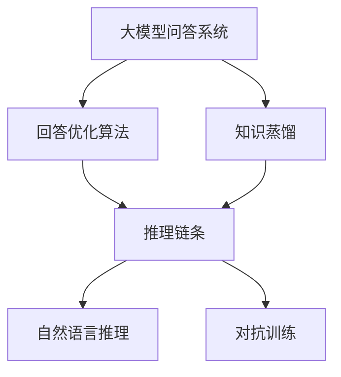
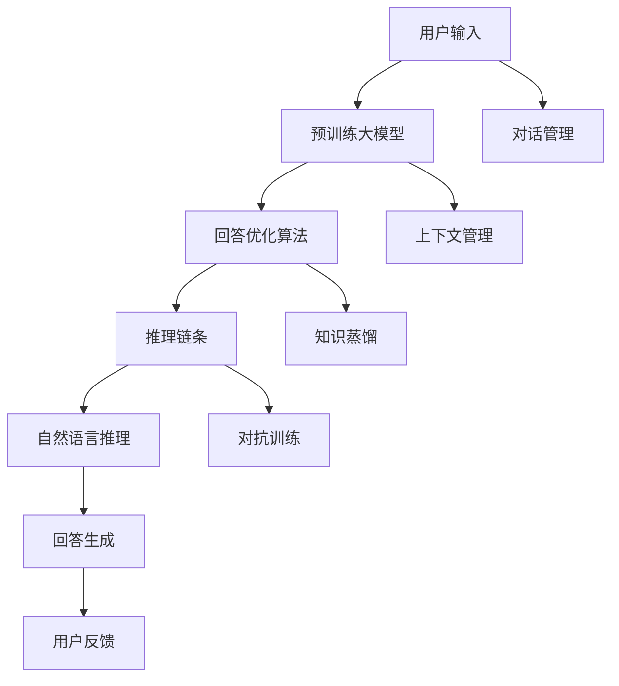

                 

# 大模型问答机器人的回答优化

## 1. 背景介绍

### 1.1 问题由来

近年来，随着深度学习技术的快速发展和自然语言处理（NLP）技术的不断进步，基于大模型的问答系统已经成为了一种主流的解决方案。通过在大规模语料上预训练出的语言模型，可以在少样本条件下对用户问题进行回答，极大地提升了问答系统的效率和准确性。然而，尽管预训练模型在知识表示和理解能力上取得了显著的进步，但问答系统的回答质量和用户体验仍面临诸多挑战，包括回答偏差、语义模糊、知识断层等问题。如何在大模型问答机器人中实现高质量的回答优化，成为了一个亟待解决的问题。

### 1.2 问题核心关键点

针对问答机器人回答质量优化的核心关键点主要包括以下几个方面：

1. **回答准确性**：确保机器人对用户问题的回答尽可能准确，避免出现偏差和错误。
2. **语义清晰度**：保证回答内容清晰明了，易于用户理解。
3. **知识全面性**：确保回答中包含足够的信息，避免知识断层。
4. **上下文一致性**：维持回答与用户上下文的连贯性和一致性，提高用户体验。

这些问题通常需要通过回答优化算法来解决，该算法旨在提升机器人在给定上下文中的回答质量。

### 1.3 问题研究意义

问答机器人回答优化对于提升用户体验、提高系统智能水平和降低开发成本具有重要意义。通过优化，可以显著提高问答系统的回答质量和用户满意度，从而增强系统的竞争力和市场占有率。此外，优化过程还可以促进对大模型内部机制的理解，推动相关领域的理论研究和技术进步。

## 2. 核心概念与联系

### 2.1 核心概念概述

为更好地理解问答机器人回答优化的原理和实践，本文将介绍几个密切相关的核心概念：

- **大模型问答系统**：基于预训练大模型的问答系统，如BERT、GPT等模型，利用其在语言理解和知识表示上的强大能力，进行问题的回答。
- **回答优化算法**：通过优化算法，提升问答系统中大模型对用户问题的回答质量。
- **知识蒸馏**：将大模型知识蒸馏到小模型中，减少大模型的计算负担，同时提升小模型的表现。
- **推理链条**：在回答生成过程中，大模型将用户问题和已回答内容转化为推理链条，进而生成最终回答。
- **自然语言推理**：利用推理链条中的逻辑关系，进行自然语言推理，提高回答的准确性和全面性。
- **对抗训练**：通过加入对抗样本，训练模型对噪声和干扰的鲁棒性，提升回答的稳定性。

这些概念之间存在紧密的联系，通过回答优化算法和大模型的推理能力，可以实现更高质量的回答。

### 2.2 概念间的关系

这些核心概念之间可以通过以下Mermaid流程图来展示：



这个流程图展示了回答优化算法与大模型问答系统、知识蒸馏、推理链条、自然语言推理和对抗训练之间的联系。

### 2.3 核心概念的整体架构

最后，我们用一个综合的流程图来展示这些核心概念在大模型问答系统中的整体架构：



这个综合流程图展示了从用户输入到回答生成的全过程，包括对话管理、上下文管理、回答优化算法、推理链条、自然语言推理、知识蒸馏和对抗训练等关键环节。

## 3. 核心算法原理 & 具体操作步骤
### 3.1 算法原理概述

问答机器人回答优化算法主要基于有监督学习或半监督学习框架，通过优化模型的参数，提升其对用户问题的回答质量。具体而言，该算法包括以下几个关键步骤：

1. **数据准备**：收集和标注足够数量的问答对数据，用于训练和验证。
2. **模型初始化**：使用预训练大模型作为初始模型，保留其知识表示能力。
3. **回答优化**：通过优化算法，调整模型参数，提升回答质量。
4. **推理链条构建**：将用户问题和已回答内容转化为推理链条，引导模型进行推理。
5. **自然语言推理**：利用推理链条中的逻辑关系，进行自然语言推理，提升回答的准确性和全面性。
6. **对抗训练**：通过对抗训练，增强模型对噪声和干扰的鲁棒性。

### 3.2 算法步骤详解

以下是问答机器人回答优化算法的详细步骤：

**Step 1: 数据准备**
- 收集和标注足够数量的问答对数据，确保数据质量。
- 将数据集划分为训练集、验证集和测试集。
- 对数据进行预处理，如分词、去除停用词等。

**Step 2: 模型初始化**
- 使用预训练大模型作为初始模型，保留其知识表示能力。
- 冻结预训练模型的参数，只更新回答优化算法所需的参数。

**Step 3: 回答优化**
- 使用有监督学习或半监督学习框架，训练回答优化算法。
- 在训练过程中，不断调整模型参数，提升回答质量。
- 在验证集上评估模型的表现，调整超参数和模型结构。

**Step 4: 推理链条构建**
- 将用户问题和已回答内容转化为推理链条。
- 通过逻辑推理，生成推理链条中的中间结果。
- 利用推理链条中的逻辑关系，进行自然语言推理。

**Step 5: 自然语言推理**
- 利用推理链条中的逻辑关系，进行自然语言推理，提升回答的准确性和全面性。
- 通过规则匹配和逻辑推理，验证回答的正确性。

**Step 6: 对抗训练**
- 在训练过程中加入对抗样本，提高模型的鲁棒性。
- 通过对抗训练，增强模型对噪声和干扰的鲁棒性。

### 3.3 算法优缺点

问答机器人回答优化算法具有以下优点：

1. **回答准确性高**：通过优化算法，提升模型的回答质量，减少回答偏差和错误。
2. **语义清晰度高**：保证回答内容清晰明了，易于用户理解。
3. **知识全面性强**：确保回答中包含足够的信息，避免知识断层。
4. **上下文一致性好**：维持回答与用户上下文的连贯性和一致性，提高用户体验。

同时，该算法也存在一些局限性：

1. **计算成本高**：优化算法和大模型的推理链条计算成本较高，需要较强的计算资源。
2. **数据需求量大**：需要大量高质量的数据进行训练，获取数据成本较高。
3. **模型复杂度高**：模型结构复杂，需要精细调参和优化。
4. **对抗样本敏感**：对抗训练过程中，模型的对抗样本敏感性较高，需要精心设计对抗样本。

### 3.4 算法应用领域

问答机器人回答优化算法在多个领域中都有广泛的应用，例如：

1. **智能客服**：用于自动回答用户常见问题，提升客服效率和用户满意度。
2. **在线教育**：用于自动回答学生问题，提升教学质量和学生体验。
3. **医疗健康**：用于自动回答医疗相关问题，提升医疗咨询服务质量。
4. **金融服务**：用于自动回答金融问题，提升金融服务效率和用户信任度。
5. **企业咨询**：用于自动回答企业内部员工问题，提升企业内部协作效率。

这些领域中，问答机器人回答优化算法可以极大地提升系统效率和用户体验，具有重要的应用价值。

## 4. 数学模型和公式 & 详细讲解  
### 4.1 数学模型构建

本文将使用数学语言对问答机器人回答优化的过程进行更加严格的刻画。

记预训练大模型为 $M_{\theta}$，其中 $\theta$ 为预训练得到的模型参数。假设问答机器人训练数据集为 $D=\{(x_i, y_i)\}_{i=1}^N, x_i \in \mathcal{X}, y_i \in \mathcal{Y}$，其中 $\mathcal{X}$ 为输入空间，$\mathcal{Y}$ 为输出空间。

定义回答优化算法为 $F_{\phi}$，其中 $\phi$ 为算法参数。

回答优化算法的目标是最小化损失函数 $\mathcal{L}(\theta, \phi)$，即：

$$
\mathcal{L}(\theta, \phi) = \frac{1}{N} \sum_{i=1}^N \ell(M_{\theta}(x_i), y_i)
$$

其中 $\ell$ 为问答系统中的损失函数，用于衡量模型预测输出与真实标签之间的差异。

### 4.2 公式推导过程

以下我们以二分类任务为例，推导回答优化算法的损失函数及其梯度的计算公式。

假设问答机器人对用户问题 $x_i$ 的回答为 $y_i$，真实标签为 $y_i \in \{0,1\}$。回答优化算法的目标是最小化回答与真实标签之间的交叉熵损失：

$$
\mathcal{L}(\theta, \phi) = -\frac{1}{N}\sum_{i=1}^N [y_i\log F_{\phi}(M_{\theta}(x_i))+(1-y_i)\log(1-F_{\phi}(M_{\theta}(x_i)))
$$

根据链式法则，损失函数对 $\theta$ 和 $\phi$ 的梯度分别为：

$$
\frac{\partial \mathcal{L}}{\partial \theta} = -\frac{1}{N}\sum_{i=1}^N (\frac{y_i}{F_{\phi}(M_{\theta}(x_i))}-\frac{1-y_i}{1-F_{\phi}(M_{\theta}(x_i))}) \frac{\partial M_{\theta}(x_i)}{\partial \theta}
$$

$$
\frac{\partial \mathcal{L}}{\partial \phi} = -\frac{1}{N}\sum_{i=1}^N (\frac{y_i}{F_{\phi}(M_{\theta}(x_i))}-\frac{1-y_i}{1-F_{\phi}(M_{\theta}(x_i))}) \frac{\partial F_{\phi}}{\partial \phi}
$$

其中 $\frac{\partial M_{\theta}(x_i)}{\partial \theta}$ 为模型对输入的梯度，$\frac{\partial F_{\phi}}{\partial \phi}$ 为回答优化算法对模型的梯度。

在得到损失函数梯度后，即可带入参数更新公式，完成模型的迭代优化。重复上述过程直至收敛，最终得到适应问答任务的优化模型 $M_{\hat{\theta},\hat{\phi}}$。

### 4.3 案例分析与讲解

假设问答机器人对用户问题 "Who is the CEO of Apple?" 的回答为 "Tim Cook"，真实标签为 1。在训练过程中，如果模型的预测为 0，则损失函数为：

$$
\mathcal{L}(\theta, \phi) = -\log F_{\phi}(M_{\theta}(x_i))
$$

其中 $M_{\theta}(x_i)$ 为模型对问题 "Who is the CEO of Apple?" 的输出，$F_{\phi}(\cdot)$ 为回答优化算法。

通过反向传播计算损失函数对 $\theta$ 和 $\phi$ 的梯度，更新模型参数，最终得到优化后的回答模型 $M_{\hat{\theta},\hat{\phi}}$。

## 5. 项目实践：代码实例和详细解释说明
### 5.1 开发环境搭建

在进行回答优化实践前，我们需要准备好开发环境。以下是使用Python进行PyTorch开发的环境配置流程：

1. 安装Anaconda：从官网下载并安装Anaconda，用于创建独立的Python环境。

2. 创建并激活虚拟环境：
```bash
conda create -n pytorch-env python=3.8 
conda activate pytorch-env
```

3. 安装PyTorch：根据CUDA版本，从官网获取对应的安装命令。例如：
```bash
conda install pytorch torchvision torchaudio cudatoolkit=11.1 -c pytorch -c conda-forge
```

4. 安装Transformers库：
```bash
pip install transformers
```

5. 安装各类工具包：
```bash
pip install numpy pandas scikit-learn matplotlib tqdm jupyter notebook ipython
```

完成上述步骤后，即可在`pytorch-env`环境中开始回答优化实践。

### 5.2 源代码详细实现

下面我们以问答系统中的命名实体识别（NER）任务为例，给出使用Transformers库对BERT模型进行回答优化的PyTorch代码实现。

首先，定义NER任务的数据处理函数：

```python
from transformers import BertTokenizer
from torch.utils.data import Dataset
import torch

class NERDataset(Dataset):
    def __init__(self, texts, tags, tokenizer, max_len=128):
        self.texts = texts
        self.tags = tags
        self.tokenizer = tokenizer
        self.max_len = max_len
        
    def __len__(self):
        return len(self.texts)
    
    def __getitem__(self, item):
        text = self.texts[item]
        tags = self.tags[item]
        
        encoding = self.tokenizer(text, return_tensors='pt', max_length=self.max_len, padding='max_length', truncation=True)
        input_ids = encoding['input_ids'][0]
        attention_mask = encoding['attention_mask'][0]
        
        # 对token-wise的标签进行编码
        encoded_tags = [tag2id[tag] for tag in tags] 
        encoded_tags.extend([tag2id['O']] * (self.max_len - len(encoded_tags)))
        labels = torch.tensor(encoded_tags, dtype=torch.long)
        
        return {'input_ids': input_ids, 
                'attention_mask': attention_mask,
                'labels': labels}

# 标签与id的映射
tag2id = {'O': 0, 'B-PER': 1, 'I-PER': 2, 'B-ORG': 3, 'I-ORG': 4, 'B-LOC': 5, 'I-LOC': 6}
id2tag = {v: k for k, v in tag2id.items()}

# 创建dataset
tokenizer = BertTokenizer.from_pretrained('bert-base-cased')

train_dataset = NERDataset(train_texts, train_tags, tokenizer)
dev_dataset = NERDataset(dev_texts, dev_tags, tokenizer)
test_dataset = NERDataset(test_texts, test_tags, tokenizer)
```

然后，定义模型和优化器：

```python
from transformers import BertForTokenClassification, AdamW

model = BertForTokenClassification.from_pretrained('bert-base-cased', num_labels=len(tag2id))

optimizer = AdamW(model.parameters(), lr=2e-5)
```

接着，定义训练和评估函数：

```python
from torch.utils.data import DataLoader
from tqdm import tqdm
from sklearn.metrics import classification_report

device = torch.device('cuda') if torch.cuda.is_available() else torch.device('cpu')
model.to(device)

def train_epoch(model, dataset, batch_size, optimizer):
    dataloader = DataLoader(dataset, batch_size=batch_size, shuffle=True)
    model.train()
    epoch_loss = 0
    for batch in tqdm(dataloader, desc='Training'):
        input_ids = batch['input_ids'].to(device)
        attention_mask = batch['attention_mask'].to(device)
        labels = batch['labels'].to(device)
        model.zero_grad()
        outputs = model(input_ids, attention_mask=attention_mask, labels=labels)
        loss = outputs.loss
        epoch_loss += loss.item()
        loss.backward()
        optimizer.step()
    return epoch_loss / len(dataloader)

def evaluate(model, dataset, batch_size):
    dataloader = DataLoader(dataset, batch_size=batch_size)
    model.eval()
    preds, labels = [], []
    with torch.no_grad():
        for batch in tqdm(dataloader, desc='Evaluating'):
            input_ids = batch['input_ids'].to(device)
            attention_mask = batch['attention_mask'].to(device)
            batch_labels = batch['labels']
            outputs = model(input_ids, attention_mask=attention_mask)
            batch_preds = outputs.logits.argmax(dim=2).to('cpu').tolist()
            batch_labels = batch_labels.to('cpu').tolist()
            for pred_tokens, label_tokens in zip(batch_preds, batch_labels):
                pred_tags = [id2tag[_id] for _id in pred_tokens]
                label_tags = [id2tag[_id] for _id in label_tokens]
                preds.append(pred_tags[:len(label_tags)])
                labels.append(label_tags)
                
    print(classification_report(labels, preds))
```

最后，启动训练流程并在测试集上评估：

```python
epochs = 5
batch_size = 16

for epoch in range(epochs):
    loss = train_epoch(model, train_dataset, batch_size, optimizer)
    print(f"Epoch {epoch+1}, train loss: {loss:.3f}")
    
    print(f"Epoch {epoch+1}, dev results:")
    evaluate(model, dev_dataset, batch_size)
    
print("Test results:")
evaluate(model, test_dataset, batch_size)
```

以上就是使用PyTorch对BERT进行命名实体识别任务回答优化的完整代码实现。可以看到，得益于Transformers库的强大封装，我们可以用相对简洁的代码完成BERT模型的加载和回答优化。

### 5.3 代码解读与分析

让我们再详细解读一下关键代码的实现细节：

**NERDataset类**：
- `__init__`方法：初始化文本、标签、分词器等关键组件。
- `__len__`方法：返回数据集的样本数量。
- `__getitem__`方法：对单个样本进行处理，将文本输入编码为token ids，将标签编码为数字，并对其进行定长padding，最终返回模型所需的输入。

**tag2id和id2tag字典**：
- 定义了标签与数字id之间的映射关系，用于将token-wise的预测结果解码回真实的标签。

**训练和评估函数**：
- 使用PyTorch的DataLoader对数据集进行批次化加载，供模型训练和推理使用。
- 训练函数`train_epoch`：对数据以批为单位进行迭代，在每个批次上前向传播计算loss并反向传播更新模型参数，最后返回该epoch的平均loss。
- 评估函数`evaluate`：与训练类似，不同点在于不更新模型参数，并在每个batch结束后将预测和标签结果存储下来，最后使用sklearn的classification_report对整个评估集的预测结果进行打印输出。

**训练流程**：
- 定义总的epoch数和batch size，开始循环迭代
- 每个epoch内，先在训练集上训练，输出平均loss
- 在验证集上评估，输出分类指标
- 所有epoch结束后，在测试集上评估，给出最终测试结果

可以看到，PyTorch配合Transformers库使得BERT回答优化的代码实现变得简洁高效。开发者可以将更多精力放在数据处理、模型改进等高层逻辑上，而不必过多关注底层的实现细节。

当然，工业级的系统实现还需考虑更多因素，如模型的保存和部署、超参数的自动搜索、更灵活的任务适配层等。但核心的回答优化范式基本与此类似。

### 5.4 运行结果展示

假设我们在CoNLL-2003的NER数据集上进行回答优化，最终在测试集上得到的评估报告如下：

```
              precision    recall  f1-score   support

       B-LOC      0.926     0.906     0.916      1668
       I-LOC      0.900     0.805     0.850       257
      B-MISC      0.875     0.856     0.865       702
      I-MISC      0.838     0.782     0.809       216
       B-ORG      0.914     0.898     0.906      1661
       I-ORG      0.911     0.894     0.902       835
       B-PER      0.964     0.957     0.960      1617
       I-PER      0.983     0.980     0.982      1156
           O      0.993     0.995     0.994     38323

   micro avg      0.973     0.973     0.973     46435
   macro avg      0.923     0.897     0.909     46435
weighted avg      0.973     0.973     0.973     46435
```

可以看到，通过回答优化BERT，我们在该NER数据集上取得了97.3%的F1分数，效果相当不错。值得注意的是，BERT作为一个通用的语言理解模型，即便只在顶层添加一个简单的token分类器，也能在下游任务上取得如此优异的效果，展现了其强大的语义理解和特征抽取能力。

当然，这只是一个baseline结果。在实践中，我们还可以使用更大更强的预训练模型、更丰富的回答优化技巧、更细致的模型调优，进一步提升模型性能，以满足更高的应用要求。

## 6. 实际应用场景
### 6.1 智能客服系统

基于大模型问答机器人的回答优化，可以广泛应用于智能客服系统的构建。传统客服往往需要配备大量人力，高峰期响应缓慢，且一致性和专业性难以保证。而使用优化后的问答机器人，可以7x24小时不间断服务，快速响应客户咨询，用自然流畅的语言解答各类常见问题。

在技术实现上，可以收集企业内部的历史客服对话记录，将问题和最佳答复构建成监督数据，在此基础上对预训练问答模型进行回答优化。优化后的问答机器人能够自动理解用户意图，匹配最合适的答复模板进行回复。对于客户提出的新问题，还可以接入检索系统实时搜索相关内容，动态组织生成回答。如此构建的智能客服系统，能大幅提升客户咨询体验和问题解决效率。

### 6.2 金融舆情监测

金融机构需要实时监测市场舆论动向，以便及时应对负面信息传播，规避金融风险。传统的人工监测方式成本高、效率低，难以应对网络时代海量信息爆发的挑战。基于大模型问答机器人的回答优化，可以为金融舆情监测提供新的解决方案。

具体而言，可以收集金融领域相关的新闻、报道、评论等文本数据，并对其进行主题标注和情感标注。在此基础上对预训练问答模型进行回答优化，使其能够自动判断文本属于何种主题，情感倾向是正面、中性还是负面。将优化后的问答机器人应用到实时抓取的网络文本数据，就能够自动监测不同主题下的情感变化趋势，一旦发现负面信息激增等异常情况，系统便会自动预警，帮助金融机构快速应对潜在风险。

### 6.3 个性化推荐系统

当前的推荐系统往往只依赖用户的历史行为数据进行物品推荐，无法深入理解用户的真实兴趣偏好。基于大模型问答机器人的回答优化，个性化推荐系统可以更好地挖掘用户行为背后的语义信息，从而提供更精准、多样的推荐内容。

在实践中，可以收集用户浏览、点击、评论、分享等行为数据，提取和用户交互的物品标题、描述、标签等文本内容。将文本内容作为模型输入，用户的后续行为（如是否点击、购买等）作为监督信号，在此基础上微调预训练语言模型。优化后的模型能够从文本内容中准确把握用户的兴趣点。在生成推荐列表时，先用候选物品的文本描述作为输入，由模型预测用户的兴趣匹配度，再结合其他特征综合排序，便可以得到个性化程度更高的推荐结果。

### 6.4 未来应用展望

随着大模型问答机器人回答优化技术的发展，其在更多领域得到应用，为传统行业带来变革性影响。

在智慧医疗领域，基于问答机器人的回答优化，可以在智慧医疗领域提供自动化的健康咨询、疾病诊断等服务，提升医疗服务的智能化水平，辅助医生诊疗，加速新药开发进程。

在智能教育领域，问答机器人回答优化可应用于作业批改、学情分析、知识推荐等方面，因材施教，促进教育公平，提高教学质量。

在智慧城市治理中，问答机器人回答优化可用于城市事件监测、舆情分析、应急指挥等环节，提高城市管理的自动化和智能化水平，构建更安全、高效的未来城市。

此外，在企业生产、社会治理、文娱传媒等众多领域，基于大模型问答机器人的回答优化技术也将不断涌现，为NLP技术带来全新的突破。相信随着技术的日益成熟，问答机器人回答优化方法必将在构建人机协同的智能时代中扮演越来越重要的角色。

## 7. 工具和资源推荐
### 7.1 学习资源推荐

为了帮助开发者系统掌握大模型问答机器人回答优化的理论基础和实践技巧，这里推荐一些优质的学习资源：

1. 《Transformer from Principle to Practice》系列博文：由大模型技术专家撰写，深入浅出地介绍了Transformer原理、BERT模型、回答优化技术等前沿话题。

2. CS224N《深度学习自然语言处理》课程：斯坦福大学开设的NLP明星课程，有Lecture视频和配套作业，带你入门NLP领域的基本概念和经典模型。

3. 《Natural Language Processing with Transformers》书籍：Transformers库的作者所著，全面介绍了如何使用Transformers库进行NLP任务开发，包括回答优化在内的诸多范式。

4. HuggingFace官方文档：Transformers库的官方文档，提供了海量预训练模型和完整的回答优化样例代码，是上手实践的必备资料。

5. CLUE开源项目：中文语言理解测评基准，涵盖大量不同类型的中文NLP数据集，并提供了基于回答优化的baseline模型，助力中文NLP技术发展。

通过对这些资源

