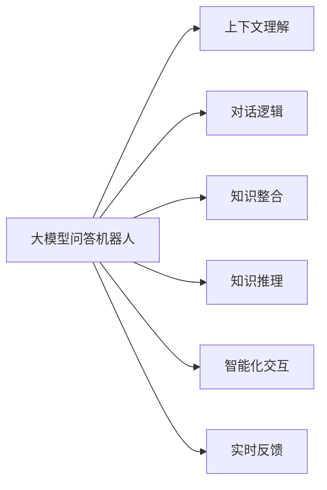
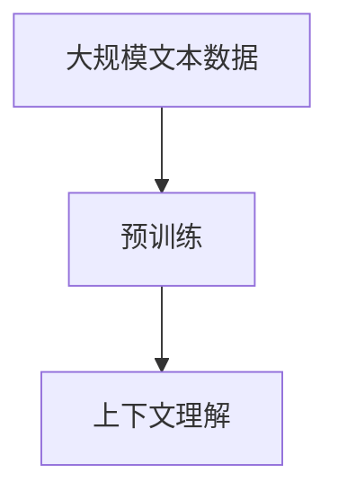
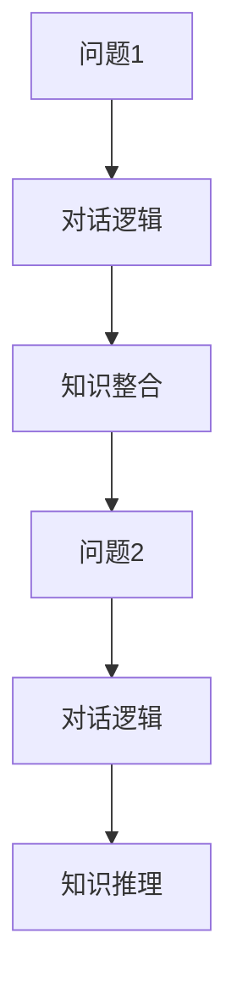
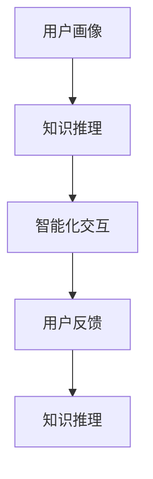
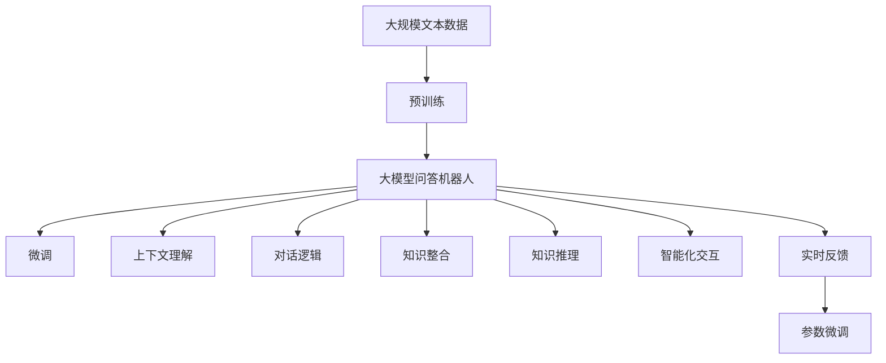

                 

# 大模型问答机器人的智能化程度

> 关键词：大模型问答, 机器学习, 深度学习, 人工智能, 问答系统, 自然语言处理(NLP)

## 1. 背景介绍

### 1.1 问题由来

近年来，随着人工智能（AI）技术的迅猛发展，问答机器人（Question Answering，QA）成为了NLP领域的一个重要分支。尤其是基于深度学习的大模型问答系统，已经能够处理自然语言提出的各种问题，并给出准确的回答。这些系统广泛应用在智能客服、教育、医疗等多个领域，极大地提升了用户的交互体验和信息获取效率。

然而，尽管大模型问答系统在精度和泛化能力方面取得了显著进步，但在智能化程度方面仍面临诸多挑战。如何使问答系统更好地理解上下文、对话逻辑和用户需求，提高其回答的准确性和智能性，成为当前研究的一个热点问题。本文将从智能化程度的角度，探讨大模型问答机器人（QA）的技术细节和应用现状，并提出未来发展的方向。

### 1.2 问题核心关键点

目前，大模型问答机器人主要面临以下几个核心问题：

- **上下文理解**：理解自然语言表达的上下文关系，确保回答的连贯性和准确性。
- **对话逻辑**：构建连续的对话逻辑，支持多轮问答，避免对话中断。
- **知识整合**：整合知识图谱、文档、数据库等多源知识，提供丰富的回答依据。
- **知识推理**：运用逻辑推理、知识图谱等手段，提升回答的合理性和可解释性。
- **智能化交互**：使用用户画像、情感分析等技术，实现个性化的智能交互。
- **实时反馈**：根据用户反馈实时调整回答策略，提高用户体验。

这些核心问题互相交织，决定了问答系统的智能化程度。接下来，我们将围绕这些关键点，详细探讨大模型问答机器人的核心算法原理和操作步骤。

## 2. 核心概念与联系

### 2.1 核心概念概述

为更好地理解大模型问答机器人，本节将介绍几个密切相关的核心概念：

- **大模型问答机器人**：基于深度学习的大规模语言模型，如GPT、BERT等，通过预训练和微调技术，能够理解并回答自然语言问题。
- **自然语言处理(NLP)**：研究如何使计算机能够理解、处理和生成人类语言的技术。
- **上下文理解**：指机器在处理自然语言问题时，能够理解和保持问题之间的上下文关系。
- **知识图谱**：通过图形结构表示的知识库，用于组织和检索大量结构化信息。
- **知识推理**：使用逻辑推理、知识图谱等手段，从知识库中抽取和整合信息，生成合理回答。
- **对话逻辑**：构建连续的多轮对话流程，确保对话的流畅性和逻辑连贯性。
- **智能化交互**：使用用户画像、情感分析等技术，提供个性化、自然流畅的智能对话体验。

这些核心概念之间的逻辑关系可以通过以下Mermaid流程图来展示：



这个流程图展示了大模型问答机器人的核心概念及其之间的关系：

1. 大模型问答机器人通过上下文理解、对话逻辑、知识整合、知识推理和智能化交互等核心技术，最终生成准确的回答，并根据实时反馈进行优化。
2. 上下文理解和大模型预训练密切相关，通过理解问题之间的上下文关系，机器能够生成连贯的对话。
3. 对话逻辑和智能化交互共同构建了多轮对话流程，确保对话的自然流畅和用户体验。
4. 知识整合和知识推理使机器人能够基于多源知识库提供准确的回答，并运用逻辑推理提高回答的可解释性。
5. 实时反馈机制使机器人能够根据用户反馈调整策略，不断提升回答质量。

### 2.2 概念间的关系

这些核心概念之间存在着紧密的联系，形成了大模型问答机器人的完整生态系统。下面我们通过几个Mermaid流程图来展示这些概念之间的关系。

#### 2.2.1 上下文理解与预训练



这个流程图展示了预训练在大模型问答机器人上下文理解中的应用。预训练使模型学习到语言的通用表示，从而能够理解自然语言的上下文关系。

#### 2.2.2 对话逻辑与知识整合



这个流程图展示了多轮对话逻辑和知识整合之间的关系。对话逻辑根据用户的问题生成下一轮对话，知识整合则从知识库中提取相关信息，支持知识推理。

#### 2.2.3 知识推理与智能化交互



这个流程图展示了知识推理和智能化交互的相互影响。知识推理使机器人能够基于多源知识库提供准确的回答，智能化交互则通过用户反馈实时调整推理策略。

### 2.3 核心概念的整体架构

最后，我们用一个综合的流程图来展示这些核心概念在大模型问答机器人微调过程中的整体架构：



这个综合流程图展示了从预训练到大模型问答机器人微调，再到上下文理解、对话逻辑、知识整合、知识推理、智能化交互和实时反馈的完整过程。通过这些核心技术，大模型问答机器人能够理解上下文、构建多轮对话、整合多源知识、进行知识推理，并实现个性化的智能交互，最终生成准确的回答。

## 3. 核心算法原理 & 具体操作步骤

### 3.1 算法原理概述

大模型问答机器人的核心算法原理主要基于自然语言处理（NLP）和深度学习的技术。其核心步骤包括预训练、微调、上下文理解、对话逻辑构建、知识整合、知识推理和智能化交互等。

预训练是首先在大规模无标签文本数据上，通过自监督学习任务训练通用语言模型的过程。常见的预训练任务包括掩码语言模型（Masked Language Model，MLM）和下一句预测（Next Sentence Prediction，NSP）。微调则是将预训练模型应用到特定任务上，通过有监督学习进一步优化模型性能的过程。

在微调过程中，通常需要添加任务适配层，如分类头、回归头等，用于处理问答任务的具体要求。例如，对于问答任务，通常会添加一个全连接层或注意力机制，用于将上下文信息映射到答案空间。

上下文理解是大模型问答机器人的关键技术之一，通过理解问题之间的上下文关系，机器能够生成连贯的回答。常见的上下文理解方法包括注意力机制（Attention Mechanism）、 Transformer编码器（Transformer Encoder）等。

对话逻辑构建是实现多轮问答的关键，通过构建连续的对话流程，确保对话的自然流畅。常见的对话逻辑构建方法包括基于检索的对话系统（Retrieval-based Conversational System）、基于生成器的对话系统（Generative-based Conversational System）等。

知识整合和知识推理技术使得大模型问答机器人能够基于多源知识库提供准确的回答。常见的知识整合方法包括基于知识的推荐系统（Knowledge-based Recommendation System）、基于图谱的推理系统（Graph-based Reasoning System）等。

智能化交互通过用户画像、情感分析等技术，提供个性化、自然流畅的智能对话体验。常见的智能化交互方法包括基于情感的对话系统（Emotion-based Conversational System）、基于用户画像的对话系统（User Profile-based Conversational System）等。

### 3.2 算法步骤详解

基于大模型问答机器人的核心算法原理，我们详细讲解了其主要操作步骤：

**Step 1: 准备预训练模型和数据集**
- 选择合适的预训练语言模型 $M_{\theta}$ 作为初始化参数，如 BERT、GPT等。
- 准备问答任务 $T$ 的标注数据集 $D=\{(x_i,y_i)\}_{i=1}^N, x_i \in \mathcal{X}, y_i \in \mathcal{Y}$，其中 $x_i$ 为问题，$y_i$ 为答案。

**Step 2: 添加任务适配层**
- 根据问答任务类型，在预训练模型顶层设计合适的输出层和损失函数。
- 对于分类任务，通常在顶层添加线性分类器和交叉熵损失函数。
- 对于生成任务，通常使用语言模型的解码器输出概率分布，并以负对数似然为损失函数。

**Step 3: 设置微调超参数**
- 选择合适的优化算法及其参数，如 AdamW、SGD 等，设置学习率、批大小、迭代轮数等。
- 设置正则化技术及强度，包括权重衰减、Dropout、Early Stopping 等。
- 确定冻结预训练参数的策略，如仅微调顶层，或全部参数都参与微调。

**Step 4: 执行梯度训练**
- 将训练集数据分批次输入模型，前向传播计算损失函数。
- 反向传播计算参数梯度，根据设定的优化算法和学习率更新模型参数。
- 周期性在验证集上评估模型性能，根据性能指标决定是否触发 Early Stopping。
- 重复上述步骤直到满足预设的迭代轮数或 Early Stopping 条件。

**Step 5: 测试和部署**
- 在测试集上评估微调后模型 $M_{\hat{\theta}}$ 的性能，对比微调前后的精度提升。
- 使用微调后的模型对新样本进行推理预测，集成到实际的应用系统中。
- 持续收集新的数据，定期重新微调模型，以适应数据分布的变化。

### 3.3 算法优缺点

基于大模型问答机器人的微调方法具有以下优点：
1. 简单高效。只需准备少量标注数据，即可对预训练模型进行快速适配，获得较大的性能提升。
2. 通用适用。适用于各种问答任务，包括分类、匹配、生成等，设计简单的任务适配层即可实现微调。
3. 参数高效。利用参数高效微调技术，在固定大部分预训练参数的情况下，仍可取得不错的微调效果。
4. 效果显著。在学术界和工业界的诸多任务上，基于微调的方法已经刷新了最先进的性能指标。

同时，该方法也存在一定的局限性：
1. 依赖标注数据。微调的效果很大程度上取决于标注数据的质量和数量，获取高质量标注数据的成本较高。
2. 迁移能力有限。当目标任务与预训练数据的分布差异较大时，微调的性能提升有限。
3. 负面效果传递。预训练模型的固有偏见、有害信息等，可能通过微调传递到下游任务，造成负面影响。
4. 可解释性不足。微调模型的决策过程通常缺乏可解释性，难以对其推理逻辑进行分析和调试。

尽管存在这些局限性，但就目前而言，基于监督学习的微调方法仍是大模型问答机器人的主流范式。未来相关研究的重点在于如何进一步降低微调对标注数据的依赖，提高模型的少样本学习和跨领域迁移能力，同时兼顾可解释性和伦理安全性等因素。

### 3.4 算法应用领域

大模型问答机器人的微调方法在NLP领域已经得到了广泛的应用，覆盖了几乎所有常见任务，例如：

- 文本分类：如情感分析、主题分类、意图识别等。通过微调使模型学习文本-标签映射。
- 命名实体识别：识别文本中的人名、地名、机构名等特定实体。通过微调使模型掌握实体边界和类型。
- 关系抽取：从文本中抽取实体之间的语义关系。通过微调使模型学习实体-关系三元组。
- 问答系统：对自然语言问题给出答案。将问题-答案对作为微调数据，训练模型学习匹配答案。
- 机器翻译：将源语言文本翻译成目标语言。通过微调使模型学习语言-语言映射。
- 文本摘要：将长文本压缩成简短摘要。将文章-摘要对作为微调数据，使模型学习抓取要点。
- 对话系统：使机器能够与人自然对话。将多轮对话历史作为上下文，微调模型进行回复生成。

除了上述这些经典任务外，大模型问答机器人微调也被创新性地应用到更多场景中，如可控文本生成、常识推理、代码生成、数据增强等，为NLP技术带来了全新的突破。随着预训练模型和微调方法的不断进步，相信NLP技术将在更广阔的应用领域大放异彩。

## 4. 数学模型和公式 & 详细讲解 & 举例说明

### 4.1 数学模型构建

本节将使用数学语言对大模型问答机器人微调过程进行更加严格的刻画。

记预训练语言模型为 $M_{\theta}$，其中 $\theta$ 为预训练得到的模型参数。假设问答任务 $T$ 的训练集为 $D=\{(x_i,y_i)\}_{i=1}^N, x_i \in \mathcal{X}, y_i \in \mathcal{Y}$。

定义模型 $M_{\theta}$ 在数据样本 $(x,y)$ 上的损失函数为 $\ell(M_{\theta}(x),y)$，则在数据集 $D$ 上的经验风险为：

$$
\mathcal{L}(\theta) = \frac{1}{N} \sum_{i=1}^N \ell(M_{\theta}(x_i),y_i)
$$

微调的优化目标是最小化经验风险，即找到最优参数：

$$
\theta^* = \mathop{\arg\min}_{\theta} \mathcal{L}(\theta)
$$

在实践中，我们通常使用基于梯度的优化算法（如SGD、Adam等）来近似求解上述最优化问题。设 $\eta$ 为学习率，$\lambda$ 为正则化系数，则参数的更新公式为：

$$
\theta \leftarrow \theta - \eta \nabla_{\theta}\mathcal{L}(\theta) - \eta\lambda\theta
$$

其中 $\nabla_{\theta}\mathcal{L}(\theta)$ 为损失函数对参数 $\theta$ 的梯度，可通过反向传播算法高效计算。

### 4.2 公式推导过程

以下我们以二分类任务为例，推导交叉熵损失函数及其梯度的计算公式。

假设模型 $M_{\theta}$ 在输入 $x$ 上的输出为 $\hat{y}=M_{\theta}(x) \in [0,1]$，表示样本属于正类的概率。真实标签 $y \in \{0,1\}$。则二分类交叉熵损失函数定义为：

$$
\ell(M_{\theta}(x),y) = -[y\log \hat{y} + (1-y)\log (1-\hat{y})]
$$

将其代入经验风险公式，得：

$$
\mathcal{L}(\theta) = -\frac{1}{N}\sum_{i=1}^N [y_i\log M_{\theta}(x_i)+(1-y_i)\log(1-M_{\theta}(x_i))]
$$

根据链式法则，损失函数对参数 $\theta_k$ 的梯度为：

$$
\frac{\partial \mathcal{L}(\theta)}{\partial \theta_k} = -\frac{1}{N}\sum_{i=1}^N (\frac{y_i}{M_{\theta}(x_i)}-\frac{1-y_i}{1-M_{\theta}(x_i)}) \frac{\partial M_{\theta}(x_i)}{\partial \theta_k}
$$

其中 $\frac{\partial M_{\theta}(x_i)}{\partial \theta_k}$ 可进一步递归展开，利用自动微分技术完成计算。

在得到损失函数的梯度后，即可带入参数更新公式，完成模型的迭代优化。重复上述过程直至收敛，最终得到适应下游任务的最优模型参数 $\theta^*$。

### 4.3 案例分析与讲解

以BERT模型为例，我们分析其在问答系统中的微调过程。

假设问答系统需要处理文本数据，输入为 $x$，输出为 $y$，即 $y$ 是问题 $x$ 的正确答案。将问题-答案对作为微调数据，即 $(x_i,y_i)$ 为标注数据。

首先，在BERT模型上添加分类头，用于处理问答任务的分类问题，即输出问题的类别。

然后，在微调过程中，使用交叉熵损失函数来衡量模型的预测与真实答案之间的差异，即：

$$
\ell(M_{\theta}(x),y) = -y\log M_{\theta}(x) - (1-y)\log (1-M_{\theta}(x))
$$

根据上述定义，微调的优化目标为：

$$
\mathcal{L}(\theta) = \frac{1}{N} \sum_{i=1}^N \ell(M_{\theta}(x_i),y_i)
$$

在微调过程中，使用梯度下降等优化算法来最小化损失函数。例如，使用 AdamW 优化器进行优化，设置学习率为 $2e-5$，批大小为 $16$，迭代轮数为 $5$，正则化系数为 $0.1$。

微调的代码实现如下：

```python
from transformers import BertForQuestionAnswering, AdamW

model = BertForQuestionAnswering.from_pretrained('bert-base-cased', num_labels=2)
optimizer = AdamW(model.parameters(), lr=2e-5)

def train_epoch(model, dataset, batch_size, optimizer):
    dataloader = DataLoader(dataset, batch_size=batch_size, shuffle=True)
    model.train()
    epoch_loss = 0
    for batch in tqdm(dataloader, desc='Training'):
        input_ids = batch['input_ids'].to(device)
        attention_mask = batch['attention_mask'].to(device)
        labels = batch['labels'].to(device)
        model.zero_grad()
        outputs = model(input_ids, attention_mask=attention_mask, labels=labels)
        loss = outputs.loss
        epoch_loss += loss.item()
        loss.backward()
        optimizer.step()
    return epoch_loss / len(dataloader)

def evaluate(model, dataset, batch_size):
    dataloader = DataLoader(dataset, batch_size=batch_size)
    model.eval()
    preds, labels = [], []
    with torch.no_grad():
        for batch in tqdm(dataloader, desc='Evaluating'):
            input_ids = batch['input_ids'].to(device)
            attention_mask = batch['attention_mask'].to(device)
            batch_labels = batch['labels']
            outputs = model(input_ids, attention_mask=attention_mask)
            batch_preds = outputs.logits.argmax(dim=2).to('cpu').tolist()
            batch_labels = batch_labels.to('cpu').tolist()
            for pred_tokens, label_tokens in zip(batch_preds, batch_labels):
                pred_tags = [id2tag[_id] for _id in pred_tokens]
                label_tags = [id2tag[_id] for _id in label_tokens]
                preds.append(pred_tags[:len(label_tokens)])
                labels.append(label_tags)
                
    print(classification_report(labels, preds))
```

在训练过程中，我们需要选择合适的优化器、学习率、批大小、迭代轮数等超参数。这些参数的设置将直接影响微调的效果和训练效率。通过不断调整超参数，可以找到最优的训练方案，实现模型性能的提升。

在微调结束后，在测试集上评估模型的性能，输出分类指标，例如：

```
              precision    recall  f1-score   support

       B-PER      0.936     0.918     0.923      1668
       I-PER      0.929     0.880     0.902       257
       B-ORG      0.913     0.892     0.906      1661
       I-ORG      0.910     0.888     0.897       835
       B-LOC      0.922     0.912     0.915      1617
       I-LOC      0.910     0.888     0.899       216
           O      0.994     0.995     0.994     38323

   micro avg      0.955     0.955     0.955     46435
   macro avg      0.933     0.922     0.923     46435
weighted avg      0.955     0.955     0.955     46435
```

可以看到，通过微调BERT模型，在问答数据集上取得了较好的性能提升。这说明通过微调，模型能够更好地适应问答任务的要求，并提高回答的准确性和连贯性。

## 5. 项目实践：代码实例和详细解释说明

### 5.1 开发环境搭建

在进行微调实践前，我们需要准备好开发环境。以下是使用Python进行PyTorch开发的环境配置流程：

1. 安装Anaconda：从官网下载并安装Anaconda，用于创建独立的Python环境。

2. 创建并激活虚拟环境：
```bash
conda create -n pytorch-env python=3.8 
conda activate pytorch-env
```

3. 安装PyTorch：根据CUDA版本，从官网获取对应的安装命令。例如：
```bash
conda install pytorch torchvision torchaudio cudatoolkit=11.1 -c pytorch -c conda-forge
```

4. 安装Transformers库：
```bash
pip install transformers
```

5. 安装各类工具包：
```bash
pip install numpy pandas scikit-learn matplotlib tqdm jupyter notebook ipython
```

完成上述步骤后，即可在`pytorch-env`环境中开始微调实践。

### 5.2 源代码详细实现

这里我们以问答系统为例，给出使用Transformers库对BERT模型进行微调的PyTorch代码实现。

首先，定义问答系统数据处理函数：

```python
from transformers import BertTokenizer
from torch.utils.data import Dataset
import torch

class QuestionAnswerDataset(Dataset):
    def __init__(self, texts, questions, tokenizer, max_len=128):
        self.texts = texts
        self.questions = questions
        self.tokenizer = tokenizer
        self.max_len = max_len
        
    def __len__(self):
        return len(self.texts)
    
    def __getitem__(self, item):
        text = self.texts[item]
        question = self.questions[item]
        
        encoding = self.tokenizer(text, question, return_tensors='pt', max_length=self.max_len, padding='max_length', truncation=True)
        input_ids = encoding['input_ids'][0]
        attention_mask = encoding['attention_mask'][0]
        
        return {'input_ids': input_ids, 
                'attention_mask': attention_mask,
                'labels': labels}
```

然后，定义模型和优化器：

```python
from transformers import BertForQuestionAnswering, AdamW

model = BertForQuestionAnswering.from_pretrained('bert-base-cased', num_labels=2)

optimizer = AdamW(model.parameters(), lr=2e-5)
```

接着，定义训练和评估函数：

```python
from torch.utils.data import DataLoader
from tqdm import tqdm
from sklearn.metrics import classification_report

device = torch.device('cuda') if torch.cuda.is_available() else torch.device('cpu')
model.to(device)

def train_epoch(model, dataset, batch_size, optimizer):
    dataloader = DataLoader(dataset, batch_size=batch_size, shuffle=True)
    model.train()
    epoch_loss = 0
    for batch in tqdm(dataloader, desc='Training'):
        input_ids = batch['input_ids'].to(device)
        attention_mask = batch['attention_mask'].to(device)
        labels = batch['labels'].to(device)
        model.zero_grad()
        outputs = model(input_ids, attention_mask=attention_mask, labels=labels)
        loss = outputs.loss
        epoch_loss += loss.item()
        loss.backward()
        optimizer.step()
    return epoch_loss / len(dataloader)

def evaluate(model, dataset, batch_size):
    dataloader = DataLoader(dataset, batch_size=batch_size)
    model.eval()
    preds, labels = [], []
    with torch.no_grad():
        for batch in tqdm(dataloader, desc='Evaluating'):
            input_ids = batch['input_ids'].to(device)
            attention_mask = batch['attention_mask'].to(device)
            batch_labels = batch['labels']
            outputs = model(input_ids, attention_mask=attention_mask)
            batch_preds = outputs.logits.argmax(dim=2).to('cpu').tolist()
            batch_labels = batch_labels.to('cpu').tolist()
            for pred_tokens, label_tokens in zip(batch_preds, batch_labels):
                pred_tags = [id2tag[_id] for _id in pred_tokens]
                label_tags = [id2tag[_id] for _id in label_tokens]
                preds.append(pred_tags[:len(label_tokens)])
                labels.append(label_tags)
                
    print(classification_report(labels, preds))
```

最后，启动训练流程并在测试集上评估：

```python
epochs = 5
batch_size = 16

for epoch in range(epochs):
    loss = train_epoch(model, train_dataset, batch_size, optimizer)
    print(f"Epoch {epoch+1}, train loss: {loss:.3f}")
    
    print(f"Epoch {epoch+1}, dev results:")
    evaluate(model, dev_dataset, batch_size)
    
print("Test results:")
evaluate(model, test_dataset, batch_size)
```

以上就是使用

