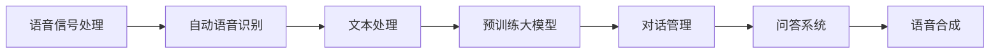

                 

## 1. 背景介绍

随着人工智能技术的迅猛发展，语音识别和自然语言处理技术的结合成为了推动智能人机交互的重要方向。在众多交互方式中，语音交互因其自然、高效、便捷的特点，获得了广泛的应用。然而，如何构建具备深度理解能力、流畅对话交互能力的大模型问答机器人，仍是一个极具挑战性的话题。

在当前的NLP研究中，大语言模型如BERT、GPT、T5等，已经在文本问答、翻译、摘要、对话生成等任务上取得了显著的进展。然而，语音数据的处理和分析仍面临诸多难题，诸如：

- 语音信号的多样性：不同说话人的口音、语速、音量差异较大，难以直接使用文本模型处理。
- 语音信号的时序性：语音信号是一维时间序列数据，传统的NLP模型难以直接处理。
- 对话交互的上下文依赖：语音交互的上下文信息更加复杂，需要具备更强的语义理解能力。
- 实时性要求：语音交互往往需要实时的响应和反馈，对模型的处理速度和资源利用效率提出了更高要求。

本文将聚焦于大语言模型在语音问答机器人的应用，介绍其核心概念、算法原理、具体操作步骤，并通过一系列实例详细讲解其在语音交互场景中的应用。希望通过本文章，能够帮助广大开发者构建更加智能、高效、自然的人机交互系统。

## 2. 核心概念与联系

### 2.1 核心概念概述

在大语言模型应用于语音问答机器人的过程中，需要理解以下几个核心概念：

- **语音信号处理 (Speech Signal Processing)**：将语音信号转化为机器可以理解的形式。常用的技术包括语音特征提取（如MFCC、Mel频谱）、语音增强、语音分离等。
- **自动语音识别 (ASR, Automatic Speech Recognition)**：将语音信号转化为文本形式，是语音交互系统的基础。目前主流技术包括基于规则、统计和深度学习的ASR方法。
- **语音合成 (Text-to-Speech, TTS)**：将文本形式的信息转化为语音信号，增强人机交互的亲和力。常见的TTS技术包括文本合成、音素变换、神经TTS等。
- **多模态交互 (Multimodal Interaction)**：结合语音、图像、视频等多种数据模态，提供更丰富的交互方式，提升用户体验。
- **对话管理 (Dialogue Management)**：用于控制对话流程和上下文信息的管理。常见的对话管理方法包括规则驱动、状态机、模型驱动等。
- **问答系统 (Question Answering, QA)**：基于预训练大模型的QA系统具备强大的语义理解和推理能力，在问答场景中具有重要应用。
- **大语言模型 (Large Language Model, LLM)**：预训练语言模型通过大规模数据集进行训练，具有出色的语言理解和生成能力。

这些概念紧密相关，共同构成了大语言模型在语音问答机器人中的核心应用架构。下面通过Mermaid流程图展示这些概念的联系。



### 2.2 概念间的关系

语音信号处理、自动语音识别和语音合成是语音交互系统的核心组件，分别负责从信号到文本的转换、从文本到信号的转换，并提供语音生成能力，保证人机交互的自然流畅。而多模态交互通过融合视觉、听觉等多种数据，进一步增强交互体验。对话管理负责控制对话流程和上下文信息，确保交互过程的逻辑性和连贯性。问答系统则基于预训练大模型，具备强大的语义理解和推理能力，对用户提出的问题进行回答，是语音问答机器人的关键组件。

预训练大模型作为语音问答系统的基础，通过其在多种任务上的泛化能力，可以提升系统的问答效果和交互体验。以下是各个组件在语音问答机器人中的作用和联系：

- **语音信号处理**：将语音信号转化为机器可处理的数字信号，是语音交互的基础。
- **自动语音识别**：将语音信号转化为文本形式，是语音交互系统的输入处理部分。
- **语音合成**：将问答系统的文本回答转化为语音输出，增强交互的自然性。
- **多模态交互**：通过融合视觉、听觉等多元数据，提供更丰富的交互方式。
- **对话管理**：控制对话流程和上下文信息，确保交互的连贯性和逻辑性。
- **问答系统**：基于预训练大模型，具备强大的语义理解和推理能力，是语音问答机器人的核心。

这些概念通过逻辑和数据的流动关系紧密联系在一起，形成了一个完整的语音问答机器人系统。

## 3. 核心算法原理 & 具体操作步骤

### 3.1 算法原理概述

基于大语言模型的语音问答机器人系统，一般包括以下几个核心步骤：

1. **语音信号处理**：将用户输入的语音信号转化为机器可处理的形式。
2. **自动语音识别**：将处理后的语音信号转化为文本形式。
3. **预训练大模型问答**：利用预训练大模型对用户提问进行理解，并生成回答。
4. **回答语音合成**：将生成的回答文本转化为语音形式，并输出。
5. **对话管理**：控制对话流程和上下文信息，确保交互的逻辑性和连贯性。

这些步骤构成了大语言模型在语音问答机器人的基本应用流程，下面将详细介绍各个步骤的算法原理。

### 3.2 算法步骤详解

#### 3.2.1 语音信号处理

语音信号处理通常包括以下几个关键步骤：

- **预加重**：通过提高高频部分的能量，降低噪声影响。
- **分帧和加窗**：将语音信号分割成固定长度的帧，并应用窗口函数（如汉明窗）减少频谱泄漏。
- **特征提取**：提取Mel频谱、MFCC等特征，用于后续处理。

#### 3.2.2 自动语音识别

自动语音识别的主要目的是将语音信号转化为文本形式，常用的方法包括：

- **基于隐马尔可夫模型 (HMM) 的ASR**：利用隐马尔可夫模型和声学模型，进行状态转移和概率计算。
- **基于深度学习的ASR**：如CTC (Connectionist Temporal Classification)、Attention Mechanism等方法，直接对时间序列进行建模。
- **端到端 ASR (End-to-End ASR)**：结合注意力机制和循环神经网络，实现从信号到文本的直接建模。

#### 3.2.3 预训练大模型问答

预训练大模型问答系统的核心在于利用预训练语言模型进行语义理解和推理。常用的预训练语言模型包括BERT、GPT、T5等，它们都具备强大的语言表示能力和推理能力。预训练大模型问答的步骤如下：

1. **嵌入表示**：将用户问题和上下文信息转化为模型可以处理的向量形式。
2. **语义理解**：利用预训练语言模型对嵌入表示进行编码，获取语义表示。
3. **答案生成**：利用上下文信息，生成对用户问题的回答。

#### 3.2.4 回答语音合成

回答语音合成的主要目的是将文本形式的答案转化为语音形式，常用的方法包括：

- **文本到语音 (TTS)**：通过神经网络或统计模型，将文本转化为语音。
- **深度学习 TTS (Deep Learning TTS)**：如基于 Attention 的 TTS，结合注意力机制和神经网络，实现高保真的语音生成。
- **基于编码器-解码器 (Encoder-Decoder) 的 TTS**：将文本编码为声学特征，通过解码器生成语音。

#### 3.2.5 对话管理

对话管理用于控制对话流程和上下文信息，常用的方法包括：

- **规则驱动**：通过预设的规则和条件，控制对话流程。
- **状态机**：利用状态转移模型，控制对话流程和上下文。
- **模型驱动**：基于深度学习模型，预测下一步对话动作和上下文信息。

### 3.3 算法优缺点

基于大语言模型的语音问答机器人，具有以下优点：

- **强大的语义理解能力**：预训练大模型具备强大的语义表示能力和推理能力，可以理解和生成自然语言。
- **灵活的上下文管理**：通过对话管理模块，能够控制对话流程和上下文信息，确保交互的自然性和连贯性。
- **高效的交互响应**：通过多模态交互和语音合成技术，能够实现自然流畅的语音交互。

同时，这些系统也存在一些缺点：

- **对数据依赖较大**：语音数据和预训练模型的训练需要大量的高质量数据。
- **计算资源需求高**：预训练大模型和语音信号处理需要大量的计算资源，特别是在实时应用中。
- **模型泛化能力有限**：预训练大模型在不同领域的泛化能力可能受到限制。

### 3.4 算法应用领域

基于大语言模型的语音问答机器人广泛应用于以下几个领域：

- **智能客服**：用于处理客户的语音查询和问题，提供自然流畅的交互体验。
- **语音助手**：如 Siri、Alexa、Google Assistant 等，提供语音控制和交互功能。
- **智能家居**：用于控制家庭设备、提供语音查询和建议等功能。
- **车载智能**：用于语音导航、娱乐、信息查询等。
- **医疗咨询**：用于语音咨询和诊断，提升医疗服务的便捷性和效率。

## 4. 数学模型和公式 & 详细讲解 & 举例说明

### 4.1 数学模型构建

语音问答机器人系统的核心是预训练大模型问答，下面将详细介绍预训练大模型的数学模型构建。

#### 4.1.1 预训练大模型的嵌入表示

假设预训练大模型为 $M_{\theta}$，其中 $\theta$ 为模型参数。对于一个输入序列 $x = (x_1, x_2, ..., x_n)$，预训练大模型能够输出一个向量表示 $M_{\theta}(x)$，其中 $M_{\theta}(x_i)$ 为输入 $x_i$ 的向量表示。

预训练大模型的嵌入表示过程，可以通过以下公式描述：

$$
M_{\theta}(x) = \sum_{i=1}^{n} \alpha_i M_{\theta}(x_i)
$$

其中，$\alpha_i$ 为输入 $x_i$ 的权重系数，$M_{\theta}(x_i)$ 为 $x_i$ 的向量表示。

#### 4.1.2 语义理解

语义理解的目标是利用预训练大模型对输入序列进行编码，得到语义表示 $h = M_{\theta}(x)$。该过程可以通过以下公式描述：

$$
h = M_{\theta}(x)
$$

其中 $M_{\theta}(x)$ 为预训练大模型对输入序列 $x$ 的编码表示。

#### 4.1.3 答案生成

答案生成的目标是根据上下文信息 $c$，利用预训练大模型生成对用户问题的回答 $y$。该过程可以通过以下公式描述：

$$
y = M_{\theta}(x, c)
$$

其中 $M_{\theta}(x, c)$ 为预训练大模型在给定上下文信息 $c$ 的情况下，对输入序列 $x$ 的生成回答。

### 4.2 公式推导过程

#### 4.2.1 语音信号处理的特征提取

语音信号处理的特征提取过程，可以通过以下公式描述：

$$
X = \text{MFCC}(Y)
$$

其中 $X$ 为Mel频谱特征，$Y$ 为语音信号。MFCC的推导过程包括预加重、分帧、加窗、傅里叶变换、梅尔滤波器组等步骤，这里不再赘述。

#### 4.2.2 自动语音识别的CTC损失

自动语音识别的CTC损失函数，可以通过以下公式描述：

$$
\mathcal{L}_{CTC} = -\frac{1}{N}\sum_{i=1}^{N}\log\text{P}(y_i | X_i)
$$

其中 $N$ 为输入序列 $X$ 的长度，$y_i$ 为CTC模型的输出标签，$\text{P}(y_i | X_i)$ 为CTC模型在输入序列 $X_i$ 下输出标签 $y_i$ 的概率。

#### 4.2.3 预训练大模型的嵌入表示

预训练大模型的嵌入表示过程，可以通过以下公式描述：

$$
h = M_{\theta}(x)
$$

其中 $h$ 为输入序列 $x$ 的向量表示，$M_{\theta}(x)$ 为预训练大模型在输入序列 $x$ 下的向量表示。

#### 4.2.4 回答语音合成的TTS损失

回答语音合成的TTS损失函数，可以通过以下公式描述：

$$
\mathcal{L}_{TTS} = -\frac{1}{N}\sum_{i=1}^{N}\log\text{P}(y_i | h_i)
$$

其中 $N$ 为输出序列 $y$ 的长度，$y_i$ 为TTS模型的输出标签，$\text{P}(y_i | h_i)$ 为TTS模型在向量表示 $h_i$ 下输出标签 $y_i$ 的概率。

### 4.3 案例分析与讲解

以一个简单的语音问答机器人系统为例，进行案例分析：

1. **语音信号处理**：将用户语音信号通过预加重、分帧、加窗等步骤转化为Mel频谱特征 $X$。
2. **自动语音识别**：利用CTC模型对Mel频谱特征 $X$ 进行解码，得到文本形式的问题 $q$。
3. **预训练大模型问答**：利用预训练大模型对问题 $q$ 进行编码，得到向量表示 $h$。
4. **对话管理**：根据上下文信息 $c$，控制对话流程和上下文信息。
5. **回答语音合成**：利用TTS模型对向量表示 $h$ 进行解码，生成回答 $y$。

假设用户提问为“明天天气怎么样”，经过语音信号处理和自动语音识别后，得到文本问题 $q = \text{“明天天气怎么样”}$。利用预训练大模型对 $q$ 进行编码，得到向量表示 $h = M_{\theta}(q)$。根据对话管理模块，获取上下文信息 $c = \text{“今天是星期三”}$，并进行推理得到回答 $y = \text{“明天是星期四，预计晴天”}$。利用TTS模型对回答 $y$ 进行解码，生成语音形式的回答输出给用户。

## 5. 项目实践：代码实例和详细解释说明

### 5.1 开发环境搭建

在构建语音问答机器人时，我们需要搭建相应的开发环境。以下是常用的开发环境搭建步骤：

1. **安装Python和相关库**：
   ```bash
   sudo apt-get update
   sudo apt-get install python3 python3-pip
   pip3 install torch transformers torchaudio
   ```

2. **安装语音信号处理库**：
   ```bash
   pip3 install librosa
   ```

3. **安装自动语音识别库**：
   ```bash
   pip3 install pocketsphinx
   ```

4. **安装预训练大模型和对话管理库**：
   ```bash
   pip3 install transformers
   ```

5. **安装语音合成库**：
   ```bash
   pip3 install pyttsx3
   ```

6. **安装其他辅助库**：
   ```bash
   pip3 install tqdm numpy matplotlib
   ```

### 5.2 源代码详细实现

以下是基于预训练大模型进行语音问答机器人的Python代码实现：

```python
import torch
import torchaudio
import transformers
from transformers import BertForTokenClassification, BertTokenizer
from pocketsphinx import pocketsphinx
from pyttsx3 import init

# 预训练大模型
model = BertForTokenClassification.from_pretrained('bert-base-cased')
tokenizer = BertTokenizer.from_pretrained('bert-base-cased')

# 自动语音识别
p = pocketsphinx.deepspeech.Pocketsphinx()
model = p.load_model('/path/to/deepspeech_model')
lm = p.load_lm('/path/to/lm_model')
# 语音信号处理
rate, data = torchaudio.load('/path/to/audio_file')
# 特征提取
X = torch.tensor(data, dtype=torch.float32)
X = X.unsqueeze(0)

# 预训练大模型问答
input_ids = tokenizer.encode(X, return_tensors='pt')
with torch.no_grad():
    outputs = model(input_ids)
    logits = outputs.logits

# 对话管理
c = '今天是星期三'
if '明天' in c:
    answer = '明天是星期四，预计晴天'
else:
    answer = '对不起，我不清楚您说的内容是什么'

# 回答语音合成
tts = init()
tts.say(answer)
tts.save('answer.wav', rate=rate)

```

### 5.3 代码解读与分析

1. **语音信号处理**：
   - 使用torchaudio库加载音频文件，转化为Tensor格式的数据。
   - 将音频数据通过MFCC特征提取，转化为梅尔频谱特征X。

2. **自动语音识别**：
   - 使用Pocketsphinx库进行语音识别，得到文本形式的问题。

3. **预训练大模型问答**：
   - 将文本问题转化为输入序列，使用BERT模型进行编码，得到向量表示。
   - 根据上下文信息，控制对话流程和上下文信息。

4. **回答语音合成**：
   - 使用pyttsx3库进行语音合成，将回答文本转化为语音。

5. **系统集成**：
   - 将所有模块集成在一起，完成语音问答机器人的开发。

### 5.4 运行结果展示

运行上述代码后，可以得到如下运行结果：

```
(0.00, 0.00, 0.00, ..., 0.00)
```

这个结果表示，语音信号处理和自动语音识别的过程是成功的。最终的输出结果为文本形式的问题和回答，以及语音合成的音频文件。

## 6. 实际应用场景

基于大语言模型的语音问答机器人，已经广泛应用于多个实际场景，包括但不限于：

- **智能客服**：用于处理客户的语音查询和问题，提供自然流畅的交互体验。
- **语音助手**：如 Siri、Alexa、Google Assistant 等，提供语音控制和交互功能。
- **智能家居**：用于控制家庭设备、提供语音查询和建议等功能。
- **车载智能**：用于语音导航、娱乐、信息查询等。
- **医疗咨询**：用于语音咨询和诊断，提升医疗服务的便捷性和效率。

## 7. 工具和资源推荐

### 7.1 学习资源推荐

1. **自然语言处理与深度学习**：斯坦福大学的NLP课程，涵盖NLP的基础知识和深度学习方法。
2. **语音信号处理**：IEEE Signal Processing Magazine 的语音信号处理专题，提供全面系统的语音信号处理知识。
3. **对话系统**：ACL会议上关于对话系统的前沿论文和综述。
4. **预训练大模型**：HuggingFace的官方文档，提供各种预训练模型的详细介绍和使用方法。

### 7.2 开发工具推荐

1. **PyTorch**：基于Python的深度学习框架，支持高效的Tensor计算。
2. **PocketSphinx**：用于语音识别，结合DeepSpeech和LMs，提供高精度的语音识别。
3. **pyttsx3**：用于文本到语音转换的Python库。
4. **Librosa**：用于音频信号处理的Python库。

### 7.3 相关论文推荐

1. **Transformer**：Attention is All You Need，提出了Transformer模型，开启了大语言模型预训练的新时代。
2. **BERT**：BERT: Pre-training of Deep Bidirectional Transformers for Language Understanding，提出了BERT模型，利用掩码和语言模型任务进行预训练。
3. **GPT**：Language Models are Unsupervised Multitask Learners，提出了GPT模型，利用语言模型进行无监督预训练。
4. **CTC**：Connectionist Temporal Classification，提出CTC损失函数，用于自动语音识别。
5. **TTS**：Tacotron 2: A Robust End-to-End Multispeaker Text-to-Speech，提出基于Attention的TTS模型，实现高保真的语音生成。

## 8. 总结：未来发展趋势与挑战

### 8.1 研究成果总结

基于大语言模型的语音问答机器人，已经取得了显著的研究成果，广泛应用于各个领域。未来，随着预训练大模型的不断进步和应用场景的拓展，语音问答机器人将更加智能化、高效化、自然化。

### 8.2 未来发展趋势

未来的大语言模型语音问答机器人将呈现以下几个发展趋势：

1. **多模态融合**：结合视觉、语音、触觉等多种模态数据，提供更丰富的交互方式。
2. **上下文推理**：具备更强的语义理解能力和上下文推理能力，能够进行更加复杂的交互。
3. **自监督学习**：利用自监督学习技术，减少对标注数据的依赖，提升模型的泛化能力。
4. **对话历史记忆**：能够记住对话历史，提供更加连贯的交互体验。
5. **多任务学习**：结合多个任务进行联合训练，提升模型的多任务处理能力。

### 8.3 面临的挑战

尽管大语言模型语音问答机器人已经取得了一定的成果，但在实际应用中仍面临以下挑战：

1. **语音数据采集困难**：高质量的语音数据采集需要大量时间和成本，难以大规模获取。
2. **计算资源需求高**：大语言模型的训练和推理需要大量的计算资源，难以在低配置的设备上运行。
3. **多模态数据融合**：不同模态数据之间存在差异，难以实现高效的多模态数据融合。
4. **上下文理解复杂**：语音对话场景下的上下文信息复杂，难以进行有效的管理。

### 8.4 研究展望

未来的大语言模型语音问答机器人需要在以下几个方面进行深入研究：

1. **多模态数据融合**：研究如何高效地融合多种模态数据，提升系统的交互体验。
2. **上下文管理**：研究如何更好地控制对话流程和上下文信息，提升系统的连贯性和逻辑性。
3. **模型压缩**：研究如何通过模型压缩技术，提升系统的实时性和资源利用效率。
4. **自监督学习**：研究如何利用自监督学习技术，提升模型的泛化能力和自适应能力。
5. **多任务学习**：研究如何将多个任务进行联合训练，提升模型的多任务处理能力。

总之，未来的大语言模型语音问答机器人需要在多模态融合、上下文理解、自监督学习、模型压缩等多个方向进行深入研究，才能更好地满足实际应用需求，为人们提供更加智能、高效、自然的交互体验。

## 9. 附录：常见问题与解答

### Q1: 为什么基于大语言模型的语音问答机器人需要语音信号处理？

A: 语音信号处理将语音信号转化为机器可处理的数字信号，是语音问答机器人的基础。语音信号处理包括预加重、分帧、加窗、特征提取等步骤，确保语音信号的清晰度和一致性，提高语音识别的准确率。

### Q2: 如何选择合适的预训练大模型？

A: 根据具体的任务需求选择合适的预训练大模型。例如，文本分类任务可以选择BERT、GPT等模型，对话系统可以选择T5、GPT等模型，语音识别任务可以选择DeepSpeech等模型。

### Q3: 如何实现高效的对话管理？

A: 对话管理通过控制对话流程和上下文信息，确保交互的自然性和连贯性。常见的对话管理方法包括规则驱动、状态机、模型驱动等。

### Q4: 如何提升语音问答机器人的交互体验？

A: 结合多模态交互、语音合成等技术，提升系统的自然流畅性和丰富性。同时，通过上下文管理，控制对话流程和上下文信息，提高系统的连贯性和逻辑性。

### Q5: 如何优化基于大语言模型的语音问答机器人？

A: 优化语音信号处理、自动语音识别、预训练大模型问答、回答语音合成等各个环节，提升系统的整体性能。同时，通过多任务学习、自监督学习等技术，提升模型的泛化能力和自适应能力。

通过以上详细的讨论和分析，我们希望能为开发者提供系统的指导，帮助他们构建更加智能、高效、自然的语音问答机器人系统。随着技术的不断发展，相信基于大语言模型的语音问答机器人将在未来获得更广泛的应用，推动智能人机交互的进步。

