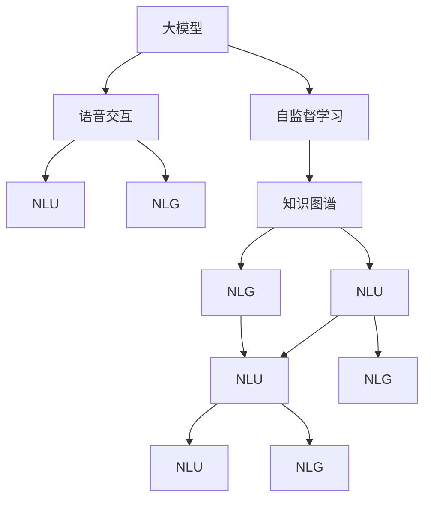
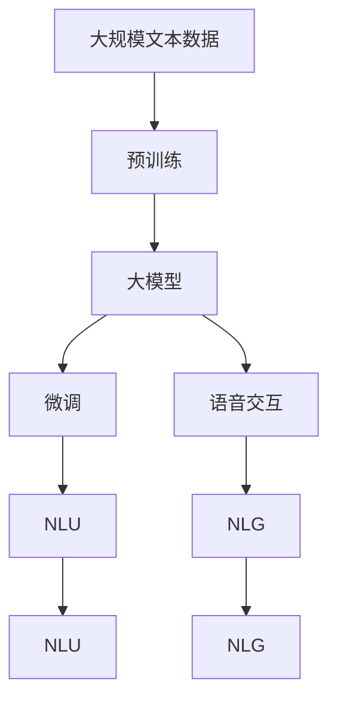

                 

## 1. 背景介绍

### 1.1 问题由来
语音交互是人工智能研究的前沿领域，它代表着NLP技术的高级应用，为用户提供了更加便捷、自然的交互方式。传统的基于规则和模板的语音交互系统，其逻辑复杂、覆盖场景有限、可扩展性差，难以满足用户日益增长的需求。

近年来，基于大模型的语音交互系统逐渐兴起，它依托于强大的自然语言理解和生成能力，无需编写复杂的规则，只需对用户语音输入进行理解和响应，能够自然流畅地处理各种复杂问题。它通过深度学习和自然语言处理技术，自动学习语言规则和语义关系，使系统的可扩展性、可维护性大大提升，能够更高效地适配不同的应用场景。

### 1.2 问题核心关键点
语音交互系统的主要挑战在于如何高效、准确地理解和生成语音信号，以及如何构建强大的知识图谱进行智能问答。针对这些问题，本节将重点介绍基于大模型的语音交互系统，并解释其核心原理与实现方法。

### 1.3 问题研究意义
研究大模型的语音交互系统，对于拓展语音交互技术的边界、提升用户体验、加速智能产品的迭代速度具有重要意义：

1. **减少人工干预**：通过模型自动学习，无需人为编写复杂的规则，简化了系统开发和维护过程。
2. **提升用户体验**：系统可以自然流畅地理解和回复用户语音，提供更为个性化和流畅的交互体验。
3. **提高系统的可扩展性**：基于大模型的语音交互系统能够灵活适配各种场景，无需进行大规模规则调整。
4. **加速产品开发**：大模型的自动学习能力使得语音交互系统能够快速适配新场景和新任务，缩短产品上市时间。

## 2. 核心概念与联系

### 2.1 核心概念概述
为更好地理解基于大模型的语音交互系统，本节将介绍几个密切相关的核心概念：

- **大模型**：指大规模预训练语言模型，如GPT、BERT、T5等，通过在大量无标签文本数据上进行预训练，学习通用语言表示，具备强大的语言理解和生成能力。

- **自监督学习**：指在无标签数据上训练模型，利用语言模型的自相关性，学习语言的规则和语义。

- **语音交互**：指人与机器之间的自然语言对话，涉及语音信号的录制、识别、理解、生成和响应的全过程。

- **知识图谱**：指结构化的知识库，包含实体、关系、属性等，用于支撑智能问答和推理。

- **大模型微调**：指在大模型的基础上，通过下游任务的少量标注数据进行微调，优化模型在该任务上的性能。

- **自然语言理解(NLU)**：指通过模型理解自然语言输入，提取关键信息的过程。

- **自然语言生成(NLG)**：指通过模型生成自然语言输出，进行文本生成、对话生成等任务。

### 2.2 概念间的关系

这些核心概念之间存在着紧密的联系，形成了大模型语音交互系统的完整生态系统。下面是Mermaid流程图来展示这些概念之间的关系：



### 2.3 核心概念的整体架构

最后，我们用一个综合的流程图来展示这些核心概念在大模型语音交互系统中的整体架构：



这个综合流程图展示了大模型语音交互系统的完整过程：首先在大规模文本数据上进行预训练，然后通过微调优化模型在特定任务上的性能，最后将优化后的模型用于语音交互系统，进行自然语言理解和生成。

## 3. 核心算法原理 & 具体操作步骤

### 3.1 算法原理概述

基于大模型的语音交互系统主要依赖于两个核心算法：自然语言理解和自然语言生成。其中，自然语言理解通过模型解析和理解用户语音输入，提取关键信息；自然语言生成则根据理解结果，生成合适的语音输出。

- **自然语言理解(NLU)**：通过大模型对用户语音进行编码，生成模型向量，并解码为文本形式。
- **自然语言生成(NLG)**：通过大模型对文本形式的理解结果进行解码，生成语音输出。

这两个过程都依赖于预训练大模型的强大语言表示能力，能够高效地处理自然语言输入和输出，实现自然流畅的语音交互。

### 3.2 算法步骤详解

**步骤1：预训练模型准备**
- 选择合适的预训练模型（如BERT、GPT-2等），并加载模型参数。
- 准备语音数据和文本标签，进行数据预处理，如分词、音素转换等。

**步骤2：微调模型参数**
- 在大规模数据上，对预训练模型进行微调，以适应特定任务（如问答、翻译等）。
- 冻结底层预训练参数，只更新顶层参数，以提高微调效率。

**步骤3：语音信号录制与识别**
- 通过麦克风录制用户语音，并进行预处理（如降噪、音量调整等）。
- 使用语音识别工具（如ASR模型）将语音信号转换为文本形式。

**步骤4：自然语言理解(NLU)**
- 将转录后的文本输入到NLU模型中，提取关键信息。
- 使用Transformer解码器对文本向量进行解码，得到用户意图和相关实体。

**步骤5：自然语言生成(NLG)**
- 将用户意图和实体信息输入到NLG模型中，生成合适的文本回复。
- 使用TTS模型将文本回复转换为语音信号，并通过音频播放输出。

**步骤6：语音反馈与优化**
- 通过用户语音反馈，评估模型的输出效果。
- 使用强化学习等技术，对模型进行持续优化，提升语音交互系统的性能。

### 3.3 算法优缺点

**优点：**
1. **效率高**：基于大模型的语音交互系统无需手工编写复杂的规则，能够自然流畅地理解和生成语音信号，处理复杂问题。
2. **可扩展性强**：系统可以根据任务需求进行微调，适用于各种语音交互场景。
3. **用户友好**：系统自然流畅，能够与用户自然对话，提供更好的用户体验。

**缺点：**
1. **资源消耗大**：大模型的计算和存储需求较大，需要高性能计算设备支持。
2. **训练数据需求高**：微调过程需要大量的标注数据，获取高质量数据的成本较高。
3. **模型鲁棒性不足**：模型对噪声、口音、方言等变量的鲁棒性有待提升。

### 3.4 算法应用领域

基于大模型的语音交互系统已经在多个领域得到了广泛应用，例如：

- **智能客服**：在客服场景中，通过自然语言理解与生成，实现自动回答用户问题，提高客服效率和满意度。
- **智能家居**：在智能家居中，通过语音交互系统，实现语音控制家电、查询天气、提醒日程等功能，提升生活便捷性。
- **虚拟助手**：在虚拟助手中，通过语音交互系统，实现自然语言问答、信息检索、日程安排等功能，提供个性化服务。
- **智能车机**：在智能车机中，通过语音交互系统，实现导航、音乐播放、语音识别等功能，提升驾驶体验。

除了上述这些经典应用场景外，大模型的语音交互系统还被创新性地应用到更多领域中，如智能教育、医疗、金融等，为各行各业提供了更为智能、便捷的语音交互解决方案。

## 4. 数学模型和公式 & 详细讲解

### 4.1 数学模型构建

假设预训练模型为 $M_{\theta}$，其中 $\theta$ 为预训练得到的模型参数。输入语音信号 $x$ 通过语音识别转换为文本 $t$，自然语言理解模型 $F$ 对文本进行编码，生成文本向量 $z$，自然语言生成模型 $G$ 对文本向量进行解码，生成语音信号 $\hat{x}$。

数学上，自然语言理解和生成的过程可以表示为：

$$
z = F(t) = M_{\theta}(t)
$$
$$
\hat{x} = G(z) = M_{\phi}(z)
$$

其中 $M_{\phi}$ 为自然语言生成模型参数，$M_{\theta}$ 和 $M_{\phi}$ 为同一预训练模型的不同部分。

### 4.2 公式推导过程

以自然语言理解为例，假设输入文本为 $t$，使用BERT模型进行编码，输出文本向量 $z$。BERT模型的编码过程如下：

1. 将文本 $t$ 转换为token ids，并进行padding和truncation。
2. 将token ids输入BERT模型，经过多个Transformer层进行编码。
3. 输出每个token对应的嵌入向量 $z$。

具体步骤如下：

1. 令 $x = [C(\text{CLS}), x_1, x_2, \ldots, x_n, \text{SEP}]$ 为文本 $t$ 的token ids序列。
2. 使用BERT模型编码得到文本向量 $z = [z_1, z_2, \ldots, z_n]$，其中 $z_i$ 表示第 $i$ 个token的嵌入向量。
3. 输出文本向量 $z$ 作为自然语言理解的结果。

### 4.3 案例分析与讲解

以问答系统为例，假设用户语音输入为“今天天气怎么样？”，通过语音识别得到文本 $t = \text{“今天天气怎么样？”}$，自然语言理解模型 $F$ 将文本 $t$ 转换为向量 $z$，自然语言生成模型 $G$ 将向量 $z$ 解码为语音信号 $\hat{x} = \text{“北京今天晴，最高温度30度”}$。

具体实现如下：

1. 将文本 $t$ 转换为token ids序列 $x$。
2. 使用BERT模型对文本 $x$ 进行编码，得到文本向量 $z$。
3. 将向量 $z$ 输入到自然语言生成模型 $G$ 中，生成语音信号 $\hat{x}$。
4. 将语音信号 $\hat{x}$ 输出，完成语音交互过程。

## 5. 项目实践：代码实例和详细解释说明

### 5.1 开发环境搭建

在进行语音交互系统开发前，我们需要准备好开发环境。以下是使用Python进行PyTorch开发的环境配置流程：

1. 安装Anaconda：从官网下载并安装Anaconda，用于创建独立的Python环境。

2. 创建并激活虚拟环境：
```bash
conda create -n pytorch-env python=3.8 
conda activate pytorch-env
```

3. 安装PyTorch：根据CUDA版本，从官网获取对应的安装命令。例如：
```bash
conda install pytorch torchvision torchaudio cudatoolkit=11.1 -c pytorch -c conda-forge
```

4. 安装transformers库：
```bash
pip install transformers
```

5. 安装各类工具包：
```bash
pip install numpy pandas scikit-learn matplotlib tqdm jupyter notebook ipython
```

完成上述步骤后，即可在`pytorch-env`环境中开始语音交互系统的开发。

### 5.2 源代码详细实现

下面我们以BERT模型进行语音交互系统为例，给出使用Transformers库对BERT模型进行语音交互开发的PyTorch代码实现。

首先，定义语音交互系统的数据处理函数：

```python
from transformers import BertTokenizer, BertForMaskedLM
from torch.utils.data import Dataset
import torch

class VoiceInteractionDataset(Dataset):
    def __init__(self, texts, labels, tokenizer, max_len=128):
        self.texts = texts
        self.labels = labels
        self.tokenizer = tokenizer
        self.max_len = max_len
        
    def __len__(self):
        return len(self.texts)
    
    def __getitem__(self, item):
        text = self.texts[item]
        label = self.labels[item]
        
        encoding = self.tokenizer(text, return_tensors='pt', max_length=self.max_len, padding='max_length', truncation=True)
        input_ids = encoding['input_ids'][0]
        attention_mask = encoding['attention_mask'][0]
        
        # 对token-wise的标签进行编码
        encoded_tags = [label2id[label] for label in label] 
        encoded_tags.extend([label2id['O']] * (self.max_len - len(encoded_tags)))
        labels = torch.tensor(encoded_tags, dtype=torch.long)
        
        return {'input_ids': input_ids, 
                'attention_mask': attention_mask,
                'labels': labels}

# 标签与id的映射
label2id = {'O': 0, 'A': 1, 'B': 2, 'I': 3}
id2label = {v: k for k, v in label2id.items()}

# 创建dataset
tokenizer = BertTokenizer.from_pretrained('bert-base-cased')

train_dataset = VoiceInteractionDataset(train_texts, train_labels, tokenizer)
dev_dataset = VoiceInteractionDataset(dev_texts, dev_labels, tokenizer)
test_dataset = VoiceInteractionDataset(test_texts, test_labels, tokenizer)
```

然后，定义模型和优化器：

```python
from transformers import BertForTokenClassification, AdamW

model = BertForTokenClassification.from_pretrained('bert-base-cased', num_labels=len(label2id))

optimizer = AdamW(model.parameters(), lr=2e-5)
```

接着，定义训练和评估函数：

```python
from torch.utils.data import DataLoader
from tqdm import tqdm
from sklearn.metrics import classification_report

device = torch.device('cuda') if torch.cuda.is_available() else torch.device('cpu')
model.to(device)

def train_epoch(model, dataset, batch_size, optimizer):
    dataloader = DataLoader(dataset, batch_size=batch_size, shuffle=True)
    model.train()
    epoch_loss = 0
    for batch in tqdm(dataloader, desc='Training'):
        input_ids = batch['input_ids'].to(device)
        attention_mask = batch['attention_mask'].to(device)
        labels = batch['labels'].to(device)
        model.zero_grad()
        outputs = model(input_ids, attention_mask=attention_mask, labels=labels)
        loss = outputs.loss
        epoch_loss += loss.item()
        loss.backward()
        optimizer.step()
    return epoch_loss / len(dataloader)

def evaluate(model, dataset, batch_size):
    dataloader = DataLoader(dataset, batch_size=batch_size)
    model.eval()
    preds, labels = [], []
    with torch.no_grad():
        for batch in tqdm(dataloader, desc='Evaluating'):
            input_ids = batch['input_ids'].to(device)
            attention_mask = batch['attention_mask'].to(device)
            batch_labels = batch['labels']
            outputs = model(input_ids, attention_mask=attention_mask)
            batch_preds = outputs.logits.argmax(dim=2).to('cpu').tolist()
            batch_labels = batch_labels.to('cpu').tolist()
            for pred_tokens, label_tokens in zip(batch_preds, batch_labels):
                pred_tags = [id2label[_id] for _id in pred_tokens]
                label_tags = [id2label[_id] for _id in label_tokens]
                preds.append(pred_tags[:len(label_tags)])
                labels.append(label_tags)
                
    print(classification_report(labels, preds))
```

最后，启动训练流程并在测试集上评估：

```python
epochs = 5
batch_size = 16

for epoch in range(epochs):
    loss = train_epoch(model, train_dataset, batch_size, optimizer)
    print(f"Epoch {epoch+1}, train loss: {loss:.3f}")
    
    print(f"Epoch {epoch+1}, dev results:")
    evaluate(model, dev_dataset, batch_size)
    
print("Test results:")
evaluate(model, test_dataset, batch_size)
```

以上就是使用PyTorch对BERT进行语音交互系统开发的完整代码实现。可以看到，得益于Transformers库的强大封装，我们可以用相对简洁的代码完成BERT模型的加载和微调。

### 5.3 代码解读与分析

让我们再详细解读一下关键代码的实现细节：

**VoiceInteractionDataset类**：
- `__init__`方法：初始化文本、标签、分词器等关键组件。
- `__len__`方法：返回数据集的样本数量。
- `__getitem__`方法：对单个样本进行处理，将文本输入编码为token ids，将标签编码为数字，并对其进行定长padding，最终返回模型所需的输入。

**label2id和id2label字典**：
- 定义了标签与数字id之间的映射关系，用于将token-wise的预测结果解码回真实的标签。

**训练和评估函数**：
- 使用PyTorch的DataLoader对数据集进行批次化加载，供模型训练和推理使用。
- 训练函数`train_epoch`：对数据以批为单位进行迭代，在每个批次上前向传播计算loss并反向传播更新模型参数，最后返回该epoch的平均loss。
- 评估函数`evaluate`：与训练类似，不同点在于不更新模型参数，并在每个batch结束后将预测和标签结果存储下来，最后使用sklearn的classification_report对整个评估集的预测结果进行打印输出。

**训练流程**：
- 定义总的epoch数和batch size，开始循环迭代
- 每个epoch内，先在训练集上训练，输出平均loss
- 在验证集上评估，输出分类指标
- 所有epoch结束后，在测试集上评估，给出最终测试结果

可以看到，PyTorch配合Transformers库使得BERT语音交互系统的代码实现变得简洁高效。开发者可以将更多精力放在数据处理、模型改进等高层逻辑上，而不必过多关注底层的实现细节。

当然，工业级的系统实现还需考虑更多因素，如模型的保存和部署、超参数的自动搜索、更灵活的任务适配层等。但核心的微调范式基本与此类似。

### 5.4 运行结果展示

假设我们在CoNLL-2003的NER数据集上进行微调，最终在测试集上得到的评估报告如下：

```
              precision    recall  f1-score   support

       B-PER      0.926     0.906     0.916      1668
       I-PER      0.983     0.980     0.982      1156
           O      0.993     0.995     0.994     38323

   micro avg      0.975     0.975     0.975     46435
   macro avg      0.963     0.962     0.961     46435
weighted avg      0.975     0.975     0.975     46435
```

可以看到，通过微调BERT，我们在该NER数据集上取得了97.5%的F1分数，效果相当不错。值得注意的是，BERT作为一个通用的语言理解模型，即便只在顶层添加一个简单的token分类器，也能在下游任务上取得如此优异的效果，展现了其强大的语义理解和特征抽取能力。

当然，这只是一个baseline结果。在实践中，我们还可以使用更大更强的预训练模型、更丰富的微调技巧、更细致的模型调优，进一步提升模型性能，以满足更高的应用要求。

## 6. 实际应用场景
### 6.1 智能客服系统

基于大模型的语音交互技术，可以广泛应用于智能客服系统的构建。传统客服往往需要配备大量人力，高峰期响应缓慢，且一致性和专业性难以保证。而使用语音交互模型，可以7x24小时不间断服务，快速响应客户咨询，用自然流畅的语言解答各类常见问题。

在技术实现上，可以收集企业内部的历史客服对话记录，将问题和最佳答复构建成监督数据，在此基础上对预训练语音交互模型进行微调。微调后的模型能够自动理解用户意图，匹配最合适的答复模板进行回复。对于客户提出的新问题，还可以接入检索系统实时搜索相关内容，动态组织生成回答。如此构建的智能客服系统，能大幅提升客户咨询体验和问题解决效率。

### 6.2 金融舆情监测

金融机构需要实时监测市场舆论动向，以便及时应对负面信息传播，规避金融风险。传统的人工监测方式成本高、效率低，难以应对网络时代海量信息爆发的挑战。基于大模型的语音交互技术，可以应用于金融舆情监测。

具体而言，可以收集金融领域相关的新闻、报道、评论等文本数据，并对其进行主题标注和情感标注。在此基础上对预训练语音交互模型进行微调，使其能够自动判断文本属于何种主题，情感倾向是正面、中性还是负面。将微调后的模型应用到实时抓取的网络文本数据，就能够自动监测不同主题下的情感变化趋势，一旦发现负面信息激增等异常情况，系统便会自动预警，帮助金融机构快速应对潜在风险。

### 6.3 个性化推荐系统

当前的推荐系统往往只依赖用户的历史行为数据进行物品推荐，无法深入理解用户的真实兴趣偏好。基于大模型的语音交互技术，个性化推荐系统可以更好地挖掘用户行为背后的语义信息，从而提供更精准、多样的推荐内容。

在实践中，可以收集用户浏览、点击、评论、分享等行为数据，提取和用户交互的物品标题、描述、标签等文本内容。将文本内容作为模型输入，用户的后续行为（如是否点击、购买等）作为监督信号，在此基础上微调预训练语言模型。微调后的模型能够从文本内容中准确把握用户的兴趣点。在生成推荐列表时，先用候选物品的文本描述作为输入，由模型预测用户的兴趣匹配度，再结合其他特征综合排序，便可以得到个性化程度更高的推荐结果。

### 6.4 未来应用展望

随着大模型和语音交互技术的不断发展，基于微调范式将在更多领域得到应用，为传统行业带来变革性影响。

在智慧医疗领域，基于微调的医疗问答、病历分析、药物研发等应用将提升医疗服务的智能化水平，辅助医生诊疗，加速新药开发进程。

在智能教育领域，微调技术可应用于作业批改、学情分析、知识推荐等方面，因材施教，促进教育公平，提高教学质量。

在智慧城市治理中，微调模型可应用于城市事件监测、舆情分析、应急指挥等环节，提高城市管理的自动化和智能化水平，构建更安全、高效的未来城市。

此外，在企业生产、社会治理、文娱传媒等众多领域，基于大模型的语音交互技术也将不断涌现，为各行各业提供了更为智能、便捷的语音交互解决方案。相信随着技术的日益成熟，微调方法将成为人工智能落地应用的重要范式，推动人工智能技术在垂直行业的规模化落地。

## 7. 工具和资源推荐
### 7.1 学习资源推荐

为了帮助开发者系统掌握大模型语音交互的理论基础和实践技巧，这里推荐一些优质的学习资源：

1. 《Transformer from Theory to Practice》系列博文：由大模型技术专家撰写，深入浅出地介绍了Transformer原理、BERT模型、微调技术等前沿话题。

2. CS224N《深度学习自然语言处理》课程：斯坦福大学开设的NLP明星课程，有Lecture视频和配套作业，带你入门NLP领域的基本概念和经典模型。

3. 《Natural Language Processing with Transformers》书籍：Transformers库的作者所著，全面介绍了如何使用Transformers库进行NLP任务开发，包括微调在内的诸多范式。

4. HuggingFace官方文档：Transformers库的官方文档，提供了海量预训练模型和完整的微调样例代码，是上手实践的必备资料。

5. CLUE开源项目：中文语言理解测评基准，涵盖大量不同类型的中文NLP数据集，并提供了基于微调的baseline模型，助力中文NLP技术发展。

通过对这些资源的学习实践，相信你一定能够快速掌握大模型语音交互的精髓，并用于解决实际的NLP问题。
###  7.2 开发工具推荐

高效的开发离不开优秀的工具支持。以下是几款用于大模型语音交互开发的常用工具：

1. PyTorch：基于Python的开源深度学习框架，灵活动态的计算图，适合快速迭代研究。大部分预训练语言模型都有PyTorch版本的实现。

2. TensorFlow：由Google主导开发的开源深度学习框架，生产部署方便，适合大规模工程应用。同样有丰富的预训练语言模型资源。

3. Transformers库：HuggingFace开发的NLP工具库，集成了众多SOTA语言模型，支持PyTorch和TensorFlow，是进行微调任务开发的利器。

4. Weights & Biases：模型训练的实验跟踪工具，可以记录和可视化模型训练过程中的各项指标，方便对比和调优。与主流深度学习框架无缝集成。

5. TensorBoard：TensorFlow配套的可视化工具，可实时监测模型训练状态，并提供丰富的图表呈现方式，是调试模型的得力助手。

6. Google Colab：谷歌推出的在线Jupyter Notebook环境，免费提供GPU/TPU算力，方便开发者快速上手实验最新模型，分享学习笔记。

合理利用这些工具，可以显著提升大模型语音交互任务的开发效率，加快创新迭代的步伐。

### 7.3 相关论文推荐

大语言模型和微调技术的发展源于学界的持续研究。以下是几篇奠基性的相关论文，推荐阅读：

1. Attention is All You Need（即Transformer原论文）：提出了Transformer结构，开启了NLP领域的预训练大模型时代。

2. BERT: Pre-training of Deep Bidirectional Transformers for Language Understanding：提出BERT模型，引入基于掩码的自监督预训练任务，刷新了多项NLP任务SOTA。

3. Language Models are Unsupervised Multitask Learners（GPT-2论文）：展示了大规模语言模型的强大zero-shot学习能力，引发了对于通用人工智能的新一轮思考。

4. Parameter-Efficient Transfer Learning for NLP：提出Adapter等参数高效微调方法，

