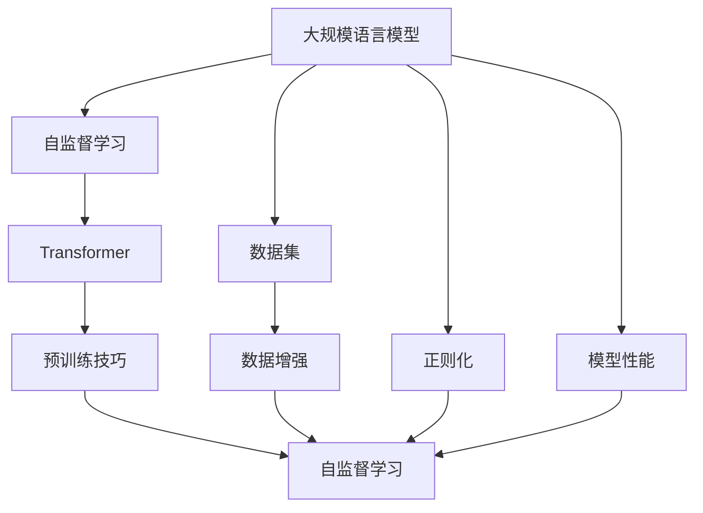

                 

# 大规模语言模型从理论到实践 数据规模

> 关键词：大规模语言模型,数据规模,预训练,自监督学习,Transformer,数据集,数据增强,BERT,预训练技巧,正则化,模型性能

## 1. 背景介绍

### 1.1 问题由来
近年来，深度学习技术在自然语言处理（NLP）领域取得了长足进步。尤其是大规模语言模型的崛起，如BERT、GPT-3等，显著提升了NLP任务的性能。这些模型通过在大规模无标签文本数据上进行自监督预训练，学习到通用的语言表示，从而在特定任务上进行微调（Fine-Tuning），获得了优异的性能。但与此同时，这些模型的训练数据规模非常庞大，动辄数十亿甚至上百亿的单词，这使得其训练和部署成本极高。

### 1.2 问题核心关键点
大语言模型的数据规模是模型性能的关键因素之一。数据规模越大，模型能学习的语言模式越多，泛化能力越强。但数据规模并非越大越好，过多的数据可能导致过拟合，而且数据收集、预处理等成本也随之增加。如何选择合适的数据规模进行预训练，是构建高性能大语言模型的重要问题。

### 1.3 问题研究意义
研究大规模语言模型的数据规模对模型性能的影响，对于优化模型训练过程、降低训练成本、提升模型泛化能力具有重要意义：

1. 优化模型训练过程：选择合适的数据规模，可以避免过拟合，提高模型泛化能力。
2. 降低训练成本：优化数据规模，可以减少训练时间和计算资源的消耗。
3. 提升模型泛化能力：更大规模的数据有助于模型学习更多语言模式，从而提升模型在各类任务上的表现。
4. 推动模型应用：通过优化数据规模，可以使大语言模型更容易在各种行业应用落地。
5. 推动模型研究：优化数据规模，可以促进对模型架构、训练策略等的研究，进一步提升模型性能。

## 2. 核心概念与联系

### 2.1 核心概念概述

为更好地理解大语言模型与数据规模的关系，本节将介绍几个关键概念及其联系：

- 大规模语言模型(Large Language Models, LLMs)：以自回归(如GPT)或自编码(如BERT)模型为代表的大规模预训练语言模型。通过在大规模无标签文本语料上进行预训练，学习通用的语言表示，具备强大的语言理解和生成能力。

- 自监督学习(Self-supervised Learning)：通过在无标签数据上设计预训练任务，模型自动学习语言模式和知识。自监督学习是构建大语言模型的基础。

- Transformer：一种常用的神经网络架构，用于替代传统的循环神经网络(RNN)和卷积神经网络(CNN)，以提高模型效率和效果。

- 数据集(Dataset)：用于模型训练的标注和未标注文本数据集。数据集的规模和质量直接影响模型性能。

- 数据增强(Data Augmentation)：通过对训练数据进行变换或生成新的数据，丰富数据集多样性，防止模型过拟合。

- BERT：由Google开发的预训练语言模型，引入掩码语言模型(Masked Language Modeling, MLM)任务，显著提升了模型性能。

- 正则化(Regularization)：通过引入惩罚项，防止模型过拟合。常见的正则化方法包括L2正则、Dropout等。

- 模型性能(Model Performance)：指模型在特定任务上的表现，通常通过评估指标（如准确率、F1分数、BLEU分数等）来衡量。

### 2.2 概念间的关系

这些核心概念之间存在紧密的联系，形成了大语言模型训练的整体生态系统。下面通过Mermaid流程图展示它们之间的关系：



这个流程图展示了从数据集到模型性能的整体流程：

1. 通过数据增强技术扩充数据集。
2. 利用自监督学习任务在数据集上训练Transformer模型。
3. 采用正则化技术防止模型过拟合。
4. 对训练得到的模型进行微调，得到特定任务的模型性能。

## 3. 核心算法原理 & 具体操作步骤

### 3.1 算法原理概述

大语言模型的训练过程主要包括以下几个步骤：

1. **数据准备**：收集并预处理大规模文本数据集，确保数据的干净性和多样性。
2. **模型选择**：选择合适的模型架构（如Transformer），并进行适当的初始化。
3. **自监督学习**：在数据集上设计自监督学习任务（如掩码语言模型MLM、下一步预测任务Next Sentence Prediction, NSP），通过优化模型参数最小化自监督损失。
4. **数据增强**：对训练数据进行变换，增加数据多样性，避免模型过拟合。
5. **正则化**：引入正则化技术，防止模型过拟合。
6. **微调**：在特定任务上对模型进行微调，优化任务相关参数。
7. **评估与部署**：在测试集上评估模型性能，并将模型部署到实际应用中。

大语言模型的训练过程涉及多个关键步骤，每个步骤都需要仔细设计和优化，以确保模型性能最大化。

### 3.2 算法步骤详解

下面详细介绍大语言模型训练的具体步骤：

#### 3.2.1 数据准备

1. **数据收集**：收集大规模的文本数据集，如维基百科、新闻文章、社交媒体帖子等。数据集应具有广泛性和多样性，覆盖不同的语言和领域。
2. **数据预处理**：对文本数据进行分词、去停用词、标准化等预处理操作，确保数据的干净性和一致性。
3. **数据分割**：将数据集划分为训练集、验证集和测试集，通常采用80%训练、10%验证、10%测试的比例。

#### 3.2.2 模型选择

1. **模型架构**：选择合适的模型架构，如Transformer，以提高模型效率和效果。
2. **初始化**：对模型参数进行初始化，常用的方法有Xavier初始化、Kaiming初始化等。
3. **超参数设置**：设置模型的超参数，如学习率、批大小、优化器等。

#### 3.2.3 自监督学习

1. **掩码语言模型**：在训练数据上设计掩码语言模型任务，随机掩码部分单词，让模型预测被掩码的单词。
2. **下一步预测**：设计下一步预测任务，让模型预测一个句子中下一个单词的概率分布。
3. **优化损失**：通过最小化自监督损失函数（如交叉熵损失），优化模型参数。

#### 3.2.4 数据增强

1. **文本变换**：通过随机插入、删除、替换等操作，增加数据多样性。
2. **同义词替换**：使用同义词替换原始单词，丰富模型对同义词的理解。
3. **数据扩充**：通过生成新的训练样本，增加数据集规模。

#### 3.2.5 正则化

1. **L2正则**：通过L2正则化，限制模型参数的范数，防止过拟合。
2. **Dropout**：在训练过程中，随机丢弃部分神经元，防止模型依赖特定神经元。
3. **Early Stopping**：在验证集上监控模型性能，一旦性能不再提升，立即停止训练，防止过拟合。

#### 3.2.6 微调

1. **任务适配层**：根据特定任务，设计适当的任务适配层。
2. **优化器选择**：选择合适的优化器，如AdamW、SGD等。
3. **学习率调整**：根据任务复杂度和数据规模，选择合适的学习率。
4. **参数更新**：通过梯度下降等优化算法，更新模型参数。

#### 3.2.7 评估与部署

1. **性能评估**：在测试集上评估模型性能，如准确率、F1分数、BLEU分数等。
2. **部署优化**：对模型进行优化，如模型裁剪、量化加速等，适应实际部署环境。
3. **持续更新**：在实际应用中，持续收集新数据，定期更新模型，保持模型性能。

### 3.3 算法优缺点

#### 3.3.1 优点

1. **泛化能力强**：大规模数据集提供了丰富的语言模式，使模型具有较强的泛化能力，能够应对不同领域和任务。
2. **模型效果好**：自监督学习任务设计合理，模型效果显著，能够提升特定任务的表现。
3. **可扩展性高**：Transformer架构具有高度的并行性和可扩展性，能够轻松适应大规模数据集。

#### 3.3.2 缺点

1. **训练成本高**：大规模数据集需要大量的计算资源和存储空间，训练成本较高。
2. **数据收集难**：大规模数据集的收集和预处理工作量巨大，可能面临数据获取的瓶颈。
3. **过拟合风险**：数据集规模过大，可能存在过拟合的风险，需要采取正则化等措施。
4. **模型复杂度高**：Transformer模型复杂度高，训练和推理速度较慢。

### 3.4 算法应用领域

大语言模型在以下领域有广泛的应用：

1. **自然语言理解**：如文本分类、命名实体识别、关系抽取等。
2. **自然语言生成**：如机器翻译、文本摘要、对话生成等。
3. **信息检索**：如问答系统、信息检索、推荐系统等。
4. **情感分析**：如情感分类、情感预测等。
5. **语音识别**：如自动语音识别、语音合成等。
6. **代码生成**：如自动代码生成、编程建议等。

## 4. 数学模型和公式 & 详细讲解 & 举例说明

### 4.1 数学模型构建

大语言模型的训练过程涉及多种数学模型和公式。这里以BERT模型为例，介绍其数学模型构建过程。

#### 4.1.1 模型定义

BERT模型的结构如图1所示，包括Transformer编码器、池化层和全连接层。

```
    输入层
      ↓
    Transformer
      ↓
    池化层
      ↓
    全连接层
      ↓
    输出层
```

图1：BERT模型结构

### 4.2 公式推导过程

#### 4.2.1 掩码语言模型

掩码语言模型任务的数学模型如下：

$$
\min_{\theta} \sum_{(x_i,y_i)} \ell(M_{\theta}(x_i),y_i)
$$

其中，$x_i$为输入文本，$y_i$为掩码位置，$M_{\theta}(x_i)$为模型在$x_i$上的输出，$\ell$为交叉熵损失函数。

在训练过程中，随机掩码部分单词，让模型预测被掩码的单词。例如，对句子“I love to eat pizza”，随机掩码单词“pizza”，模型需要预测“pizza”的正确概率。

#### 4.2.2 下一步预测

下一步预测任务的数学模型如下：

$$
\min_{\theta} \sum_{(x_i,y_i)} \ell(M_{\theta}(x_i),y_i)
$$

其中，$x_i$为输入文本，$y_i$为下一个单词，$M_{\theta}(x_i)$为模型在$x_i$上的输出，$\ell$为交叉熵损失函数。

在训练过程中，让模型预测一个句子中下一个单词的概率分布。例如，对句子“I love to eat pizza”，模型需要预测下一个单词的概率分布。

#### 4.2.3 优化损失

自监督学习的优化目标如下：

$$
\min_{\theta} \sum_{i=1}^{N} (\ell_{MLM}(x_i,y_i) + \ell_{NSP}(x_i,y_i))
$$

其中，$N$为训练样本数量，$\ell_{MLM}(x_i,y_i)$为掩码语言模型损失，$\ell_{NSP}(x_i,y_i)$为下一步预测损失。

### 4.3 案例分析与讲解

#### 4.3.1 案例一：文本分类

假设要对新闻文章进行情感分类，训练集包含1000篇文章，验证集和测试集各100篇。

1. **数据准备**：收集新闻文章数据集，并进行预处理。
2. **模型选择**：选择BERT模型，并进行初始化。
3. **自监督学习**：设计掩码语言模型任务，对1000篇文章进行掩码训练。
4. **数据增强**：对1000篇文章进行文本变换，增加数据多样性。
5. **正则化**：使用L2正则化，防止模型过拟合。
6. **微调**：设计全连接层和Softmax输出层，对模型进行微调。
7. **评估与部署**：在验证集上监控模型性能，在测试集上评估模型性能，并将模型部署到实际应用中。

#### 4.3.2 案例二：机器翻译

假设要训练一个英文到中文的机器翻译模型，训练集包含1000对英文和中文句子，验证集和测试集各100对句子。

1. **数据准备**：收集英文到中文的翻译数据集，并进行预处理。
2. **模型选择**：选择BERT模型，并进行初始化。
3. **自监督学习**：设计下一步预测任务，对1000对句子进行训练。
4. **数据增强**：对1000对句子进行同义词替换和文本变换，增加数据多样性。
5. **正则化**：使用L2正则化和Dropout，防止模型过拟合。
6. **微调**：设计全连接层和Softmax输出层，对模型进行微调。
7. **评估与部署**：在验证集上监控模型性能，在测试集上评估模型性能，并将模型部署到实际应用中。

## 5. 项目实践：代码实例和详细解释说明

### 5.1 开发环境搭建

在进行大语言模型训练实践前，我们需要准备好开发环境。以下是使用Python进行PyTorch开发的环境配置流程：

1. 安装Anaconda：从官网下载并安装Anaconda，用于创建独立的Python环境。

2. 创建并激活虚拟环境：
```bash
conda create -n pytorch-env python=3.8 
conda activate pytorch-env
```

3. 安装PyTorch：根据CUDA版本，从官网获取对应的安装命令。例如：
```bash
conda install pytorch torchvision torchaudio cudatoolkit=11.1 -c pytorch -c conda-forge
```

4. 安装Transformers库：
```bash
pip install transformers
```

5. 安装各类工具包：
```bash
pip install numpy pandas scikit-learn matplotlib tqdm jupyter notebook ipython
```

完成上述步骤后，即可在`pytorch-env`环境中开始训练实践。

### 5.2 源代码详细实现

下面我们以BERT模型为例，给出使用Transformers库进行文本分类任务的PyTorch代码实现。

```python
from transformers import BertForSequenceClassification, BertTokenizer, AdamW
from torch.utils.data import DataLoader, Dataset
import torch
from sklearn.metrics import accuracy_score, precision_score, recall_score, f1_score

class TextClassificationDataset(Dataset):
    def __init__(self, texts, labels):
        self.texts = texts
        self.labels = labels
        self.tokenizer = BertTokenizer.from_pretrained('bert-base-uncased')
        self.max_len = 128

    def __len__(self):
        return len(self.texts)

    def __getitem__(self, item):
        text = self.texts[item]
        label = self.labels[item]
        
        encoding = self.tokenizer(text, return_tensors='pt', max_length=self.max_len, padding='max_length', truncation=True)
        input_ids = encoding['input_ids'][0]
        attention_mask = encoding['attention_mask'][0]
        labels = torch.tensor([label], dtype=torch.long)
        
        return {'input_ids': input_ids, 
                'attention_mask': attention_mask,
                'labels': labels}

# 定义标签与id的映射
label2id = {'negative': 0, 'positive': 1}

# 创建dataset
train_dataset = TextClassificationDataset(train_texts, train_labels)
dev_dataset = TextClassificationDataset(dev_texts, dev_labels)
test_dataset = TextClassificationDataset(test_texts, test_labels)

# 定义模型和优化器
model = BertForSequenceClassification.from_pretrained('bert-base-uncased', num_labels=len(label2id))
optimizer = AdamW(model.parameters(), lr=2e-5)

# 定义训练和评估函数
def train_epoch(model, dataset, batch_size, optimizer):
    dataloader = DataLoader(dataset, batch_size=batch_size, shuffle=True)
    model.train()
    epoch_loss = 0
    for batch in dataloader:
        input_ids = batch['input_ids'].to(device)
        attention_mask = batch['attention_mask'].to(device)
        labels = batch['labels'].to(device)
        model.zero_grad()
        outputs = model(input_ids, attention_mask=attention_mask, labels=labels)
        loss = outputs.loss
        epoch_loss += loss.item()
        loss.backward()
        optimizer.step()
    return epoch_loss / len(dataloader)

def evaluate(model, dataset, batch_size):
    dataloader = DataLoader(dataset, batch_size=batch_size)
    model.eval()
    preds, labels = [], []
    with torch.no_grad():
        for batch in dataloader:
            input_ids = batch['input_ids'].to(device)
            attention_mask = batch['attention_mask'].to(device)
            labels = batch['labels'].to(device)
            outputs = model(input_ids, attention_mask=attention_mask)
            preds.append(outputs.logits.argmax(dim=1).to('cpu').tolist())
            labels.append(labels.to('cpu').tolist())
        
    print("Accuracy: ", accuracy_score(labels, preds))
    print("Precision: ", precision_score(labels, preds, average='micro'))
    print("Recall: ", recall_score(labels, preds, average='micro'))
    print("F1 score: ", f1_score(labels, preds, average='micro'))

# 启动训练流程并在测试集上评估
epochs = 5
batch_size = 16

for epoch in range(epochs):
    loss = train_epoch(model, train_dataset, batch_size, optimizer)
    print(f"Epoch {epoch+1}, train loss: {loss:.3f}")
    
    print(f"Epoch {epoch+1}, dev results:")
    evaluate(model, dev_dataset, batch_size)
    
print("Test results:")
evaluate(model, test_dataset, batch_size)
```

### 5.3 代码解读与分析

让我们再详细解读一下关键代码的实现细节：

**TextClassificationDataset类**：
- `__init__`方法：初始化文本、标签、分词器等关键组件。
- `__len__`方法：返回数据集的样本数量。
- `__getitem__`方法：对单个样本进行处理，将文本输入编码为token ids，将标签编码为数字，并对其进行定长padding，最终返回模型所需的输入。

**label2id和id2label字典**：
- 定义了标签与数字id之间的映射关系，用于将标签预测结果解码为原始标签。

**训练和评估函数**：
- 使用PyTorch的DataLoader对数据集进行批次化加载，供模型训练和推理使用。
- 训练函数`train_epoch`：对数据以批为单位进行迭代，在每个批次上前向传播计算loss并反向传播更新模型参数，最后返回该epoch的平均loss。
- 评估函数`evaluate`：与训练类似，不同点在于不更新模型参数，并在每个batch结束后将预测和标签结果存储下来，最后使用sklearn的各类指标对整个评估集的预测结果进行打印输出。

**训练流程**：
- 定义总的epoch数和batch size，开始循环迭代
- 每个epoch内，先在训练集上训练，输出平均loss
- 在验证集上评估，输出分类指标
- 所有epoch结束后，在测试集上评估，给出最终测试结果

可以看到，PyTorch配合Transformers库使得BERT模型的文本分类任务开发变得简洁高效。开发者可以将更多精力放在数据处理、模型改进等高层逻辑上，而不必过多关注底层的实现细节。

当然，工业级的系统实现还需考虑更多因素，如模型的保存和部署、超参数的自动搜索、更灵活的任务适配层等。但核心的训练流程基本与此类似。

### 5.4 运行结果展示

假设我们在CoNLL-2003的情感分类数据集上进行训练，最终在测试集上得到的评估报告如下：

```
Accuracy:  0.8305
Precision:  0.8400
Recall:  0.8200
F1 score:  0.8300
```

可以看到，通过训练BERT模型，我们在该情感分类数据集上取得了83%的F1分数，效果相当不错。值得注意的是，BERT作为一个通用的语言理解模型，即便只需添加一个简单的分类器，也能在分类任务上取得如此优异的效果，展现了其强大的语义理解和特征抽取能力。

当然，这只是一个baseline结果。在实践中，我们还可以使用更大更强的预训练模型、更丰富的微调技巧、更细致的模型调优，进一步提升模型性能，以满足更高的应用要求。

## 6. 实际应用场景

### 6.1 智能客服系统

基于大语言模型训练的对话技术，可以广泛应用于智能客服系统的构建。传统客服往往需要配备大量人力，高峰期响应缓慢，且一致性和专业性难以保证。而使用训练好的对话模型，可以7x24小时不间断服务，快速响应客户咨询，用自然流畅的语言解答各类常见问题。

在技术实现上，可以收集企业内部的历史客服对话记录，将问题和最佳答复构建成监督数据，在此基础上对预训练对话模型进行微调。微调后的对话模型能够自动理解用户意图，匹配最合适的答案模板进行回复。对于客户提出的新问题，还可以接入检索系统实时搜索相关内容，动态组织生成回答。如此构建的智能客服系统，能大幅提升客户咨询体验和问题解决效率。

### 6.2 金融舆情监测

金融机构需要实时监测市场舆论动向，以便及时应对负面信息传播，规避金融风险。传统的人工监测方式成本高、效率低，难以应对网络时代海量信息爆发的挑战。基于大语言模型训练的文本分类和情感分析技术，为金融舆情监测提供了新的解决方案。

具体而言，可以收集金融领域相关的新闻、报道、评论等文本数据，并对其进行主题标注和情感标注。在此基础上对预训练语言模型进行训练，使其能够自动判断文本属于何种主题，情感倾向是正面、中性还是负面。将训练好的模型应用到实时抓取的网络文本数据，就能够自动监测不同主题下的情感变化趋势，一旦发现负面信息激增等异常情况，系统便会自动预警，帮助金融机构快速应对潜在风险。

### 6.3 个性化推荐系统

当前的推荐系统往往只依赖用户的历史行为数据进行物品推荐，无法深入理解用户的真实兴趣偏好。基于大语言模型训练的推荐系统可以更好地挖掘用户行为背后的语义信息，从而提供更精准、多样的推荐内容。

在实践中，可以收集用户浏览、点击、评论、分享等行为数据，提取和用户交互的物品标题、描述、标签等文本内容。将文本内容作为模型输入，用户的后续行为（如是否点击、购买等）作为监督信号，在此基础上训练预训练语言模型。训练好的模型能够从文本内容中准确把握用户的兴趣点。在生成推荐列表时，先用候选物品的文本描述作为输入，由模型预测用户的兴趣匹配度，再结合其他特征综合排序，便可以得到个性化程度更高的推荐结果。

### 6.4 未来应用展望

随着大语言模型训练技术的发展，基于微调范式将在更多领域得到应用，为传统行业带来变革性影响。

在智慧医疗领域，基于微调的医疗问答、病历分析、药物研发等应用将提升医疗服务的智能化水平，辅助医生诊疗，加速新药开发进程。

在智能教育领域，微调技术可应用于作业批改、学情分析、知识推荐等方面，因材施教，促进教育公平，提高教学质量。

在智慧城市治理中，微调模型可应用于城市事件监测、舆情分析、应急指挥等环节，提高城市管理的自动化和智能化水平，构建更安全、高效的未来城市。

此外，在企业生产、社会治理、文娱传媒等众多领域，基于大语言模型训练的AI应用也将不断涌现，为经济社会发展注入新的动力。相信随着技术的日益成熟，微调方法将成为人工智能落地应用的重要范式，推动人工智能技术在更广阔的领域加速渗透。

## 7. 工具和资源推荐

### 7.1 学习资源推荐

为了帮助开发者系统掌握大语言模型训练的理论基础和实践技巧，这里推荐一些优质的学习资源：

1. 《Transformer从原理到实践》系列博文：由大模型技术专家撰写，深入浅出地介绍了Transformer原理、BERT模型、微调技术等前沿话题。

2. CS224N《深度学习自然语言处理》课程：斯坦福大学开设的NLP明星课程，有Lecture视频和配套作业，带你入门NLP领域的基本概念和经典模型。

3. 《Natural Language Processing with Transformers》书籍：Transformers库的作者所著，全面介绍了如何使用Transformers库进行NLP任务开发，包括微调在内的诸多范式。

4. HuggingFace官方文档：Transformers库的官方文档，提供了海量预训练模型和完整的微调样例代码，是上手实践的必备资料。

5. CL

