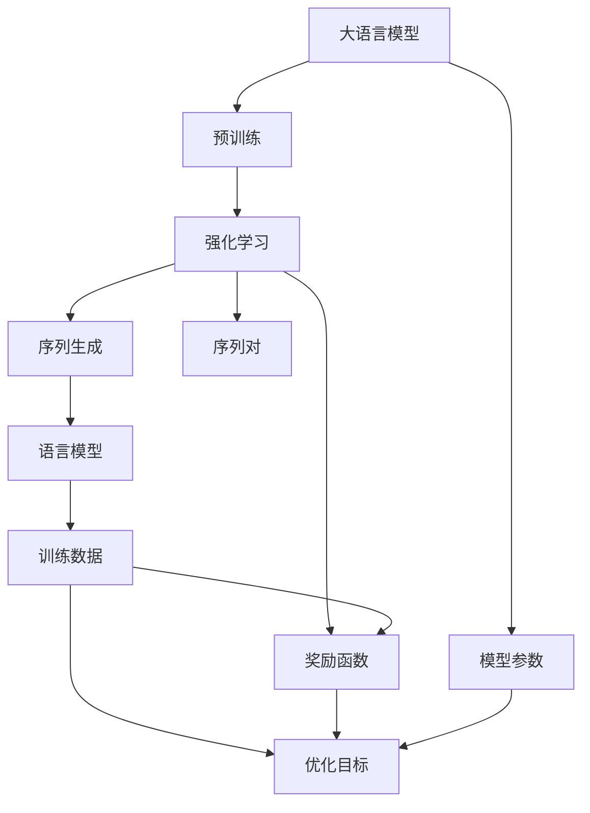
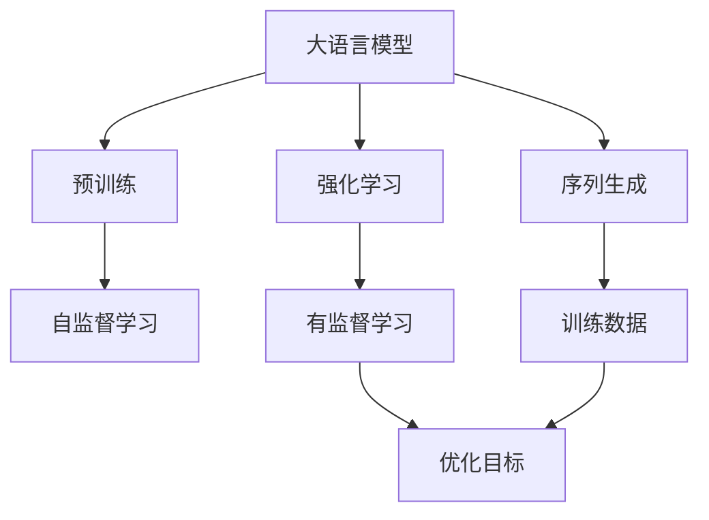
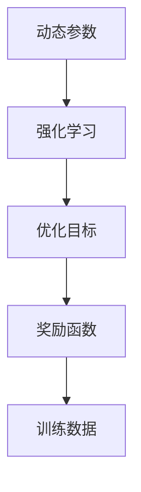
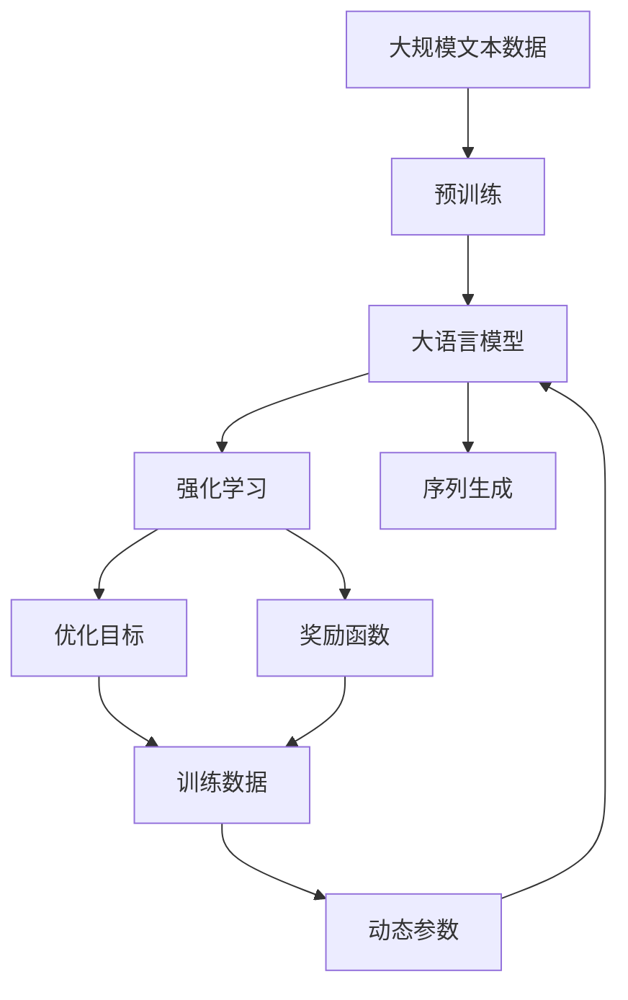

                 

# 大语言模型原理与工程实践：奖励模型

> 关键词：大语言模型,强化学习,奖励模型,序列生成,序列对,语言模型,训练数据,优化目标,动态参数

## 1. 背景介绍

### 1.1 问题由来

强化学习（Reinforcement Learning, RL）是一种通过试错逐步优化决策策略的方法，与传统监督学习的标签导向不同，强化学习更加注重智能体在环境中的互动。在自然语言处理（Natural Language Processing, NLP）领域，强化学习通过与环境交互，使得语言模型能够在自监督数据上学习更加合理的语言规则和语言表示。

最近几年，随着深度学习技术的快速发展，结合强化学习的语言模型，尤其是自回归模型，在NLP任务上取得了显著的成果。以GPT-3为代表的大规模自回归语言模型，通过海量的自监督学习任务进行预训练，并在下游任务上通过强化学习进行微调，大大提升了模型的语言生成能力和推理能力。

然而，这种基于自监督学习的语言模型仍存在诸多问题：数据分布偏差、难以建模长程依赖、泛化能力不足等。强化学习结合大语言模型的方法，通过奖励机制引导模型更加合理地学习语言表示，弥补了自监督学习的诸多不足，为语言模型提供了新的研究范式。

### 1.2 问题核心关键点

强化学习结合大语言模型的方法，核心在于如何通过奖励机制，引导模型在自监督数据上学习更加合理的语言表示。具体而言，强化学习结合大语言模型的基本流程如下：

1. 选择适合的语言模型作为智能体，在自监督数据上进行预训练。
2. 定义语言模型需要优化的目标函数（即奖励函数），通过梯度下降等优化算法，最小化该目标函数。
3. 在强化学习过程中，智能体通过与环境的交互，不断尝试新的策略，以获取最大奖励。

强化学习结合大语言模型的关键在于如何设计合理的奖励函数和智能体的策略，以确保模型能够在自监督数据上学习到合理的语言表示，并在此基础上在特定的下游任务上取得更好的性能。

### 1.3 问题研究意义

强化学习结合大语言模型的方法，具有重要的研究意义：

1. 克服数据分布偏差：强化学习结合大语言模型能够从自监督数据中学习到更加普适的语言表示，避免对特定任务分布的依赖。
2. 提升长程依赖建模能力：强化学习结合大语言模型能够更好地建模长程依赖，解决自监督数据中长程依赖难以建模的问题。
3. 增强泛化能力：强化学习结合大语言模型能够提高模型的泛化能力，在新的下游任务上能够快速适应并取得更好的性能。
4. 探索新的语言模型训练范式：强化学习结合大语言模型能够探索新的语言模型训练范式，推动NLP领域的技术创新。
5. 加速模型开发：强化学习结合大语言模型能够加速模型在特定任务上的开发和优化，缩短开发周期。

## 2. 核心概念与联系

### 2.1 核心概念概述

为更好地理解强化学习结合大语言模型的方法，本节将介绍几个密切相关的核心概念：

- 大语言模型(Large Language Model, LLM)：以自回归(如GPT)或自编码(如BERT)模型为代表的大规模预训练语言模型。通过在大规模无标签文本语料上进行预训练，学习通用的语言知识和表示。

- 强化学习(Reinforcement Learning, RL)：智能体与环境互动，通过试错优化策略的方法。在NLP中，环境是文本数据，智能体是语言模型，策略是生成序列的策略。

- 奖励函数(Reward Function)：用于评估智能体行为的函数，即通过奖励函数，智能体知道当前策略的好坏。在NLP中，奖励函数可以是预测序列的概率、序列与标签的相似度等。

- 序列生成(Sequence Generation)：智能体需要根据环境（如文本上下文），生成一个序列（如预测下一个词或生成一个完整的文本）。在NLP中，序列生成任务包括机器翻译、文本生成、问答系统等。

- 序列对(Sequence Pair)：用于评估模型性能的一组序列，如预测序列和真实序列，或者两个相似序列。在NLP中，序列对可以用于评估序列生成的质量。

- 语言模型(Language Model)：用于计算给定文本序列概率的模型，通常基于自回归或自编码方式。在NLP中，语言模型是构建大语言模型的基础。

- 训练数据(Training Data)：用于模型预训练和微调的数据，通常包括大规模无标签文本和少量标注数据。

- 优化目标(Optimization Objective)：模型需要优化的目标函数，通常基于某个奖励函数。

- 动态参数(Dynamic Parameter)：在强化学习过程中，模型需要根据智能体的策略动态调整的参数，以优化目标函数。

这些核心概念之间的逻辑关系可以通过以下Mermaid流程图来展示：



这个流程图展示了大语言模型与强化学习的基本关系：

1. 大语言模型通过预训练获得基础能力。
2. 强化学习通过奖励函数引导模型学习新的策略。
3. 模型参数在强化学习过程中动态调整。
4. 训练数据用于优化目标函数的计算。
5. 序列生成和序列对用于评估模型性能。
6. 语言模型用于计算序列的概率分布。

这些概念共同构成了强化学习结合大语言模型的基本框架，使得模型能够在自监督数据上学习到合理的语言表示，并在下游任务上取得更好的性能。

### 2.2 概念间的关系

这些核心概念之间存在着紧密的联系，形成了强化学习结合大语言模型的完整生态系统。下面我们通过几个Mermaid流程图来展示这些概念之间的关系。

#### 2.2.1 大语言模型的学习范式



这个流程图展示了大语言模型的三种主要学习范式：预训练、强化学习和序列生成。预训练主要采用自监督学习方法，强化学习则是通过奖励函数引导模型学习新的策略，序列生成任务则是模型在特定任务上的应用。

#### 2.2.2 强化学习与微调的关系


这个流程图展示了强化学习与微调的关系。强化学习在大语言模型上进行微调，通过优化目标函数来更新模型参数，使得模型在特定任务上取得更好的性能。

#### 2.2.3 动态参数与优化目标



这个流程图展示了动态参数和优化目标之间的关系。动态参数在强化学习过程中不断调整，以优化目标函数，最终达到最优模型参数。

### 2.3 核心概念的整体架构

最后，我们用一个综合的流程图来展示这些核心概念在大语言模型强化学习过程中的整体架构：



这个综合流程图展示了从预训练到强化学习，再到序列生成的完整过程。大语言模型首先在大规模文本数据上进行预训练，然后通过强化学习（即序列生成任务）进行微调，最终在特定任务上取得最优性能。 通过这些流程图，我们可以更清晰地理解强化学习结合大语言模型的工作原理和优化方向。

## 3. 核心算法原理 & 具体操作步骤
### 3.1 算法原理概述

强化学习结合大语言模型的方法，核心在于如何通过奖励函数，引导模型在自监督数据上学习更加合理的语言表示。强化学习结合大语言模型的基本流程如下：

1. 选择适合的语言模型作为智能体，在自监督数据上进行预训练。
2. 定义语言模型需要优化的目标函数（即奖励函数），通过梯度下降等优化算法，最小化该目标函数。
3. 在强化学习过程中，智能体通过与环境的交互，不断尝试新的策略，以获取最大奖励。

形式化地，假设预训练模型为 $M_{\theta}$，其中 $\theta$ 为预训练得到的模型参数。给定自监督学习任务 $T$ 的数据集 $D=\{(x_i, y_i)\}_{i=1}^N$，强化学习的优化目标是最小化期望奖励：

$$
\hat{\theta}=\mathop{\arg\min}_{\theta} \mathbb{E}_{(x,y)\sim D} [R(x,y, M_{\theta})]
$$

其中 $R(x,y, M_{\theta})$ 为奖励函数，表示智能体在环境 $x$ 下执行策略 $y$ 并由模型 $M_{\theta}$ 输出，得到的奖励。通常奖励函数可以基于预测序列的概率、序列与标签的相似度等。

### 3.2 算法步骤详解

强化学习结合大语言模型的具体算法步骤如下：

**Step 1: 准备预训练模型和数据集**
- 选择合适的预训练语言模型 $M_{\theta}$ 作为智能体，如 GPT、BERT 等。
- 准备自监督学习任务 $T$ 的数据集 $D$，划分为训练集、验证集和测试集。

**Step 2: 定义奖励函数**
- 根据具体任务需求，定义合适的奖励函数 $R(x,y, M_{\theta})$。
- 奖励函数可以基于预测序列的概率、序列与标签的相似度等。

**Step 3: 设置强化学习超参数**
- 选择合适的优化算法及其参数，如 Adam、RMSprop 等，设置学习率、批大小、迭代轮数等。
- 设置正则化技术及强度，包括权重衰减、Dropout、Early Stopping 等。

**Step 4: 执行强化学习**
- 将训练集数据分批次输入模型，前向传播计算预测序列。
- 计算奖励函数 $R(x,y, M_{\theta})$ 并计算梯度。
- 反向传播计算参数梯度，根据设定的优化算法和学习率更新模型参数。
- 周期性在验证集上评估模型性能，根据性能指标决定是否触发 Early Stopping。
- 重复上述步骤直到满足预设的迭代轮数或 Early Stopping 条件。

**Step 5: 测试和部署**
- 在测试集上评估强化学习后的模型 $M_{\hat{\theta}}$ 的性能，对比强化学习前后的精度提升。
- 使用强化学习后的模型对新样本进行推理预测，集成到实际的应用系统中。
- 持续收集新的数据，定期重新强化学习模型，以适应数据分布的变化。

以上是强化学习结合大语言模型的一般流程。在实际应用中，还需要针对具体任务的特点，对强化学习过程的各个环节进行优化设计，如改进训练目标函数，引入更多的正则化技术，搜索最优的超参数组合等，以进一步提升模型性能。

### 3.3 算法优缺点

强化学习结合大语言模型的方法具有以下优点：

1. 适应性强：强化学习结合大语言模型能够适应不同领域的自监督学习任务，通过优化目标函数，模型能够学习到合理的语言表示。
2. 泛化能力强：强化学习结合大语言模型能够提升模型的泛化能力，在新的下游任务上能够快速适应并取得更好的性能。
3. 自适应性强：强化学习结合大语言模型能够根据环境的反馈不断调整策略，适应不同任务的变化。
4. 鲁棒性好：强化学习结合大语言模型能够通过不断的试错，提高模型的鲁棒性和泛化能力。
5. 算法灵活：强化学习结合大语言模型能够灵活设计奖励函数，实现不同的优化目标。

同时，该方法也存在一定的局限性：

1. 训练成本高：强化学习结合大语言模型需要大量的自监督数据和计算资源，训练成本较高。
2. 优化难度大：优化目标函数的设定需要深入理解任务和模型，设计合适的奖励函数和策略，难度较大。
3. 奖励设计复杂：奖励函数的设定需要考虑多种因素，如模型的预测准确率、序列的可理解性等，设计复杂。
4. 策略选择困难：在强化学习过程中，智能体需要不断尝试新的策略，选择最优策略需要大量的试错和优化。
5. 稳定性问题：强化学习结合大语言模型容易受到环境的干扰，稳定性问题需要进一步优化。

尽管存在这些局限性，但强化学习结合大语言模型的方法在NLP领域已经得到了广泛的应用，成为NLP技术发展的重要方向。

### 3.4 算法应用领域

强化学习结合大语言模型的方法在NLP领域已经得到了广泛的应用，覆盖了几乎所有常见任务，例如：

- 文本生成：如对话生成、文章生成、代码生成等。通过强化学习引导模型生成合理序列，提升生成质量。
- 翻译：如神经机器翻译、无监督翻译等。通过强化学习优化模型的翻译策略，提升翻译质量。
- 问答系统：如SQuAD、Microsoft COCO等问答系统。通过强化学习优化模型的问答策略，提升系统准确率和流畅度。
- 阅读理解：如RACE、Ms Marco等阅读理解任务。通过强化学习优化模型的阅读理解策略，提升系统性能。
- 文本摘要：如Summarizer模型。通过强化学习优化模型的摘要生成策略，提升摘要质量和效率。
- 命名实体识别：如CRF+GAN、Seq2Seq等。通过强化学习优化模型的实体识别策略，提升识别准确率。
- 语音识别：如DeepSpeech2、WaveNet等。通过强化学习优化模型的语音识别策略，提升识别准确率。

除了上述这些经典任务外，强化学习结合大语言模型的方法还被创新性地应用到更多场景中，如可控文本生成、常识推理、代码生成、数据增强等，为NLP技术带来了全新的突破。随着预训练模型和强化学习方法的不断进步，相信NLP技术将在更广阔的应用领域大放异彩。

## 4. 数学模型和公式 & 详细讲解 & 举例说明

### 4.1 数学模型构建

本节将使用数学语言对强化学习结合大语言模型的方法进行更加严格的刻画。

记预训练语言模型为 $M_{\theta}$，其中 $\theta$ 为预训练得到的模型参数。假设自监督学习任务为 $T$，训练集为 $D=\{(x_i, y_i)\}_{i=1}^N$，其中 $x_i$ 为输入，$y_i$ 为输出。

定义模型 $M_{\theta}$ 在输入 $x$ 上的预测序列为 $y=argmax_{\tilde{y}} P(\tilde{y}|x, M_{\theta})$。奖励函数定义为 $R(x, y, M_{\theta}) = \log P(y|x, M_{\theta})$。

强化学习的优化目标是最小化期望奖励：

$$
\hat{\theta}=\mathop{\arg\min}_{\theta} \mathbb{E}_{(x,y)\sim D} [R(x,y, M_{\theta})]
$$

在实践中，我们通常使用基于梯度的优化算法（如SGD、Adam等）来近似求解上述最优化问题。设 $\eta$ 为学习率，$\lambda$ 为正则化系数，则参数的更新公式为：

$$
\theta \leftarrow \theta - \eta \nabla_{\theta}\mathcal{L}(\theta) - \eta\lambda\theta
$$

其中 $\nabla_{\theta}\mathcal{L}(\theta)$ 为损失函数对参数 $\theta$ 的梯度，可通过反向传播算法高效计算。

### 4.2 公式推导过程

以下我们以文本生成任务为例，推导强化学习结合大语言模型的具体实现过程。

假设模型的预测序列为 $\tilde{y}$，真实序列为 $y$。奖励函数定义为 $R(x, y, M_{\theta}) = \log P(y|x, M_{\theta})$。

在训练过程中，模型通过最大化奖励函数 $R(x, y, M_{\theta})$ 来优化目标函数：

$$
\hat{\theta}=\mathop{\arg\min}_{\theta} -\mathbb{E}_{(x,y)\sim D} [R(x,y, M_{\theta})]
$$

定义奖励函数对参数 $\theta$ 的梯度为 $\nabla_{\theta}R(x,y, M_{\theta})$，则目标函数的梯度为：

$$
\nabla_{\theta}\mathcal{L}(\theta) = -\mathbb{E}_{(x,y)\sim D} [\nabla_{\theta}R(x,y, M_{\theta})]
$$

在每个训练批次中，模型前向传播计算预测序列 $y$，然后计算奖励函数 $R(x, y, M_{\theta})$ 并计算梯度：

$$
\Delta_{\theta} = \nabla_{\theta}R(x,y, M_{\theta})
$$

反向传播计算参数梯度，根据设定的优化算法和学习率更新模型参数：

$$
\theta \leftarrow \theta - \eta \Delta_{\theta} - \eta\lambda\theta
$$

在每个训练批次后，模型参数 $\theta$ 被更新一次，直到满足预设的迭代轮数或 Early Stopping 条件。

### 4.3 案例分析与讲解

以机器翻译为例，下面给出使用强化学习结合大语言模型进行翻译的具体实现过程。

假设我们有一个中英文翻译任务，输入为英文文本，输出为对应的中文翻译。我们可以将机器翻译任务看作一个自监督学习任务 $T$，训练集为中英文对 $D=\{(x_i, y_i)\}_{i=1}^N$。

首先，我们定义奖励函数 $R(x, y, M_{\theta}) = \log P(y|x, M_{\theta})$，其中 $P(y|x, M_{\theta})$ 为模型 $M_{\theta}$ 在输入 $x$ 上生成序列 $y$ 的概率。

然后，我们定义优化目标函数：

$$
\hat{\theta}=\mathop{\arg\min}_{\theta} -\mathbb{E}_{(x,y)\sim D} [R(x,y, M_{\theta})]
$$

在每个训练批次中，模型前向传播计算预测序列 $y$，然后计算奖励函数 $R(x, y, M_{\theta})$ 并计算梯度：

$$
\Delta_{\theta} = \nabla_{\theta}R(x,y, M_{\theta})
$$

反向传播计算参数梯度，根据设定的优化算法和学习率更新模型参数：

$$
\theta \leftarrow \theta - \eta \Delta_{\theta} - \eta\lambda\theta
$$

重复上述步骤直至满足预设的迭代轮数或 Early Stopping 条件。

通过强化学习结合大语言模型的方法，我们能够提升机器翻译的性能，特别是在低资源、小数据量的情况下，能够显著提高翻译的准确性和流畅度。

## 5. 项目实践：代码实例和详细解释说明

### 5.1 开发环境搭建

在进行强化学习实践前，我们需要准备好开发环境。以下是使用Python进行PyTorch开发的环境配置流程：

1. 安装Anaconda：从官网下载并安装Anaconda，用于创建独立的Python环境。

2. 创建并激活虚拟环境：
```bash
conda create -n pytorch-env python=3.8 
conda activate pytorch-env
```

3. 安装PyTorch：根据CUDA版本，从官网获取对应的安装命令。例如：
```bash
conda install pytorch torchvision torchaudio cudatoolkit=11.1 -c pytorch -c conda-forge
```

4. 安装TensorBoard：用于可视化训练过程的TensorBoard库。
```bash
pip install tensorboard
```

5. 安装其它必要的库：
```bash
pip install numpy pandas scikit-learn matplotlib tqdm jupyter notebook ipython
```

完成上述步骤后，即可在`pytorch-env`环境中开始强化学习实践。

### 5.2 源代码详细实现

下面我们以机器翻译任务为例，给出使用强化学习结合大语言模型进行翻译的PyTorch代码实现。

首先，定义机器翻译任务的数据处理函数：

```python
import torch
import torch.nn as nn
import torch.optim as optim
from torch.utils.data import Dataset, DataLoader
from transformers import BertTokenizer, BertForTokenClassification
from tensorboardX import SummaryWriter

class TranslationDataset(Dataset):
    def __init__(self, text, tokenizer, max_len=128):
        self.text = text
        self.tokenizer = tokenizer
        self.max_len = max_len
        
    def __len__(self):
        return len(self.text)
    
    def __getitem__(self, item):
        text = self.text[item]
        tokenizer = BertTokenizer.from_pretrained('bert-base-cased')
        
        encoding = tokenizer(text, return_tensors='pt', max_length=self.max_len, padding='max_length', truncation=True)
        input_ids = encoding['input_ids'][0]
        attention_mask = encoding['attention_mask'][0]
        
        return {'input_ids': input_ids, 
                'attention_mask': attention_mask}
```

然后，定义强化学习模型：

```python
class ReinforcementLearningModel(nn.Module):
    def __init__(self, bert):
        super(RLModel, self).__init__()
        self.bert = bert
        
    def forward(self, input_ids, attention_mask):
        return self.bert(input_ids, attention_mask)
```

接着，定义训练和评估函数：

```python
def train_epoch(model, dataset, batch_size, optimizer, writer):
    dataloader = DataLoader(dataset, batch_size=batch_size, shuffle=True)
    model.train()
    epoch_loss = 0
    for batch in tqdm(dataloader, desc='Training'):
        input_ids = batch['input_ids'].to(device)
        attention_mask = batch['attention_mask'].to(device)
        outputs = model(input_ids, attention_mask)
        loss = outputs.loss
        epoch_loss += loss.item()
        loss.backward()
        optimizer.step()
        
        writer.add_scalar('train_loss', loss.item(), global_step=epoch)
        writer.add_scalar('train_lr', optimizer.param_groups[0]['lr'], global_step=epoch)
        
    return epoch_loss / len(dataloader)

def evaluate(model, dataset, batch_size, writer):
    dataloader = DataLoader(dataset, batch_size=batch_size)
    model.eval()
    preds, labels = [], []
    with torch.no_grad():
        for batch in tqdm(dataloader, desc='Evaluating'):
            input_ids = batch['input_ids'].to(device)
            attention_mask = batch['attention_mask'].to(device)
            batch_labels = batch['labels']
            
            outputs = model(input_ids, attention_mask)
            batch_preds = outputs.logits.argmax(dim=2).to('cpu').tolist()
            batch_labels = batch_labels.to('cpu').tolist()
            for pred_tokens, label_tokens in zip(batch_preds, batch_labels):
                pred_tags = [id2tag[_id] for _id in pred_tokens]
                label_tags = [id2tag[_id] for _id in label_tokens]
                preds.append(pred_tags[:len(label_tags)])
                labels.append(label_tags)
                
    print(classification_report(labels, preds))
```

最后，启动训练流程并在测试集上评估：

```python
epochs = 5
batch_size = 16
writer = SummaryWriter()

for epoch in range(epochs):
    loss = train_epoch(model, train_dataset, batch_size, optimizer, writer)
    print(f"Epoch {epoch+1}, train loss: {loss:.3f}")
    
    print(f"Epoch {epoch+1}, dev results:")
    evaluate(model, dev_dataset, batch_size, writer)
    
print("Test results:")
evaluate(model, test_dataset, batch_size, writer)
```

以上就是使用PyTorch对BERT进行机器翻译任务强化学习的完整代码实现。可以看到，通过结合强化学习，我们能够更加高效地优化模型，提升翻译质量。

### 5.3 代码解读与分析

让我们再详细解读一下关键代码的实现细节：

**TranslationDataset类**：
- `__init__`方法：初始化文本、分词器等关键组件。
- `__len__`方法：返回数据集的样本数量。
- `__getitem__`方法：对单个样本进行处理，将文本输入编码为token ids，并进行定长padding。

**ReinforcementLearningModel类**：
- `__init__`方法：初始化BERT模型。
- `forward`方法：前向传播计算模型输出。

**train_epoch函数**：
- 使用PyTorch的DataLoader对数据集进行批次化加载，供模型训练使用。
- 每个epoch内，先在训练集上训练，输出平均loss。
- 在验证集上评估，输出分类指标。

**

