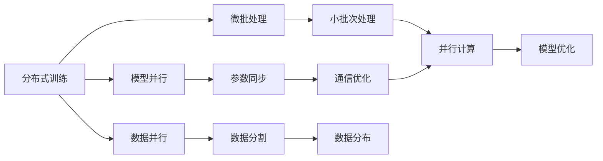
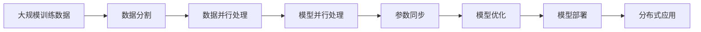

                 

# 大语言模型原理与工程实践：数据并行

> 关键词：大语言模型,数据并行,多机学习,分布式训练,模型并行,模型优化

## 1. 背景介绍

### 1.1 问题由来

在大规模深度学习模型训练过程中，特别是对于像BERT和GPT这样的预训练语言模型，数据并行成为了一个核心瓶颈。由于单个数据样本通常非常小（以词或句子为单位），而且需要大量的标注数据，因此，单机的训练效率受到数据读取、序列化和网络通信的严重制约。为了提升训练速度和模型性能，研究人员和工程师开始探索如何通过数据并行技术，将大规模深度学习任务在多个GPU或多台机器上同时进行。

数据并行是深度学习模型训练中一种常见的技术，它通过将训练数据划分为多个部分，分别在不同的设备上并行处理，最终将各部分的计算结果汇总，从而实现高效的模型训练。在大语言模型训练中，数据并行尤为重要，因为它可以帮助我们利用分布式计算资源，加速模型训练过程。

### 1.2 问题核心关键点

大语言模型的数据并行技术主要包括以下几个关键点：

- **数据划分策略**：如何合理地将训练数据划分为多个部分，以便在不同设备上并行处理。
- **模型参数同步**：如何在多个设备之间同步模型参数，确保所有设备上的模型参数值一致。
- **通信优化**：如何减少设备间的通信开销，避免成为训练瓶颈。
- **错误处理与故障恢复**：如何在并行训练过程中检测和处理错误，确保系统的鲁棒性和可靠性。

### 1.3 问题研究意义

数据并行技术的优化与实现是大语言模型训练中不可或缺的一部分。通过数据并行，我们可以有效利用分布式计算资源，加速模型训练，提高模型的性能和效率。同时，数据并行还可以帮助我们解决单机训练中的一些瓶颈问题，如内存限制、计算资源不足等。因此，对于大语言模型的研究和应用来说，数据并行技术的开发和优化具有重要的现实意义。

## 2. 核心概念与联系

### 2.1 核心概念概述

要深入理解数据并行在大语言模型训练中的应用，我们需要先了解以下几个核心概念：

- **分布式训练**：将大规模深度学习模型在不同计算设备上进行并行训练的技术。
- **模型并行**：将大规模深度学习模型划分为多个部分，分别在多个设备上并行处理的技术。
- **数据并行**：将大规模深度学习模型训练中的数据样本划分为多个部分，分别在多个设备上并行处理的技术。
- **微批处理**：将训练数据分为多个小批次，分别在不同的设备上并行处理的技术。

### 2.2 概念间的关系

这些核心概念之间存在着紧密的联系，形成了深度学习模型训练中的并行计算生态系统。下面通过一个Mermaid流程图来展示这些概念之间的关系：



这个流程图展示了从分布式训练到模型优化的完整过程。分布式训练通过模型并行、数据并行和微批处理，将大规模深度学习任务在不同设备上进行并行计算，并最终通过参数同步和通信优化，完成模型优化。

### 2.3 核心概念的整体架构

最后，我们用一个综合的流程图来展示这些核心概念在大语言模型训练中的整体架构：



这个综合流程图展示了从数据分割到模型部署的完整并行训练过程。数据分割是将大规模训练数据划分为多个小批次，数据并行处理是并行计算各个小批次，模型并行处理是将模型划分为多个部分在多个设备上并行计算，参数同步是确保所有设备上的模型参数值一致，模型优化是通过并行计算得到最终的优化模型，模型部署是将模型应用于实际应用场景中。

## 3. 核心算法原理 & 具体操作步骤

### 3.1 算法原理概述

数据并行在大语言模型训练中的原理是，将大规模训练数据划分为多个小批次，分别在不同的设备上进行并行计算，最后将各批次的计算结果汇总，得到最终的优化模型。具体来说，数据并行算法包括以下几个关键步骤：

1. **数据分割**：将大规模训练数据划分为多个小批次，每个批次在设备上并行处理。
2. **并行计算**：在每个设备上独立计算每个小批次的梯度，并累加得到总的梯度。
3. **参数同步**：在每个设备之间同步模型参数，确保所有设备上的参数值一致。
4. **梯度下降**：在所有设备上使用梯度下降算法更新模型参数。
5. **模型优化**：根据更新后的模型参数，得到最终的优化模型。

### 3.2 算法步骤详解

以下是数据并行在大语言模型训练中的具体操作步骤：

1. **数据划分**：将大规模训练数据集划分为多个小批次。通常情况下，每个小批次的样本数量在1到数万之间，具体大小取决于训练数据的大小和计算资源的可用性。

2. **分布式训练**：将每个小批次分配到不同的计算设备上进行并行计算。具体来说，每个设备上的计算节点独立计算每个小批次的梯度，并累加得到总的梯度。

3. **参数同步**：在所有计算设备之间同步模型参数。常见的参数同步算法包括Ring AllReduce、AllReduce等。

4. **梯度下降**：在所有设备上使用梯度下降算法更新模型参数。常用的优化算法包括SGD、Adam等。

5. **模型优化**：根据更新后的模型参数，得到最终的优化模型。可以使用验证集对模型进行评估，选择性能最佳的模型作为最终输出。

### 3.3 算法优缺点

数据并行技术在大语言模型训练中具有以下优点：

- **加速训练**：通过并行计算，可以显著提高训练速度，缩短模型训练时间。
- **提高模型性能**：并行计算可以提高模型的收敛速度，从而得到更好的模型性能。
- **提高资源利用率**：通过将训练任务分配到多个计算设备上，可以充分利用计算资源。

同时，数据并行技术也存在一些缺点：

- **通信开销**：设备之间的通信开销可能会成为训练的瓶颈，尤其是在数据量较小的情况下。
- **参数同步难度**：确保所有设备上的参数值一致是一个复杂的过程，特别是在设备数量较多的情况下。
- **错误处理复杂**：并行计算中的错误处理比单机计算更加复杂，需要额外的监控和调试。

### 3.4 算法应用领域

数据并行技术在大语言模型训练中的应用非常广泛，适用于各种大规模深度学习任务，如自然语言处理、图像处理、语音识别等。在大语言模型训练中，数据并行技术可以应用于以下领域：

- **文本分类**：对大规模文本数据进行分类任务，如情感分析、主题分类等。
- **机器翻译**：将源语言文本翻译成目标语言。
- **命名实体识别**：识别文本中的实体，如人名、地名、机构名等。
- **问答系统**：对自然语言问题给出答案。
- **对话系统**：使机器能够与人自然对话。

## 4. 数学模型和公式 & 详细讲解 & 举例说明

### 4.1 数学模型构建

在大语言模型训练中，我们通常使用梯度下降算法来更新模型参数。假设模型参数为 $\theta$，损失函数为 $\mathcal{L}(\theta)$，则梯度下降算法的更新公式为：

$$
\theta \leftarrow \theta - \eta \nabla_{\theta}\mathcal{L}(\theta)
$$

其中 $\eta$ 为学习率，$\nabla_{\theta}\mathcal{L}(\theta)$ 为损失函数对模型参数的梯度。在大规模并行训练中，我们需要对每个小批次的梯度进行累加，得到总的梯度：

$$
g = \sum_{i=1}^n g_i
$$

其中 $g_i$ 为每个小批次的梯度，$n$ 为小批次的数量。

### 4.2 公式推导过程

在大规模并行训练中，我们需要在多个计算设备上并行计算每个小批次的梯度，并累加得到总的梯度。这个过程可以通过以下几个步骤来完成：

1. **小批量划分**：将大规模训练数据集划分为 $m$ 个小批次，每个批次大小为 $n$。
2. **并行计算**：在每个计算设备上独立计算每个小批次的梯度，得到 $m$ 个梯度向量。
3. **梯度累加**：将 $m$ 个梯度向量累加得到总的梯度向量 $g$。
4. **参数更新**：使用梯度下降算法更新模型参数。

假设我们的模型参数 $\theta$ 包含 $p$ 个元素，则每个小批次的梯度向量大小为 $p$，总的梯度向量大小也为 $p$。具体来说，我们可以使用以下公式来更新模型参数：

$$
\theta \leftarrow \theta - \eta \frac{g}{n}
$$

其中 $n$ 为小批次的数量，$\eta$ 为学习率。

### 4.3 案例分析与讲解

假设我们在GPT模型上进行大规模并行训练，每个小批次包含 128 个样本，共划分了 8 个小批次。在每个设备上独立计算每个小批次的梯度，并累加得到总的梯度向量。假设每个小批次的梯度向量为 $g_1, g_2, \cdots, g_8$，则总的梯度向量为：

$$
g = \sum_{i=1}^8 g_i
$$

使用梯度下降算法更新模型参数，得到更新后的模型参数 $\theta'$。具体来说，我们可以使用以下公式来更新模型参数：

$$
\theta' \leftarrow \theta - \eta \frac{g}{n}
$$

其中 $\eta$ 为学习率，$n$ 为小批次的数量。

## 5. 项目实践：代码实例和详细解释说明

### 5.1 开发环境搭建

在进行大规模并行训练前，我们需要准备好开发环境。以下是使用PyTorch进行数据并行训练的环境配置流程：

1. 安装Anaconda：从官网下载并安装Anaconda，用于创建独立的Python环境。

2. 创建并激活虚拟环境：
```bash
conda create -n pytorch-env python=3.8 
conda activate pytorch-env
```

3. 安装PyTorch：根据CUDA版本，从官网获取对应的安装命令。例如：
```bash
conda install pytorch torchvision torchaudio cudatoolkit=11.1 -c pytorch -c conda-forge
```

4. 安装Transformers库：
```bash
pip install transformers
```

5. 安装各类工具包：
```bash
pip install numpy pandas scikit-learn matplotlib tqdm jupyter notebook ipython
```

完成上述步骤后，即可在`pytorch-env`环境中开始并行训练实践。

### 5.2 源代码详细实现

下面以GPT模型为例，给出使用PyTorch进行数据并行训练的代码实现。

首先，定义训练函数：

```python
import torch
import torch.distributed as dist

def train_epoch(model, optimizer, train_loader, device):
    model.train()
    loss = 0
    for batch in train_loader:
        input_ids = batch['input_ids'].to(device)
        attention_mask = batch['attention_mask'].to(device)
        labels = batch['labels'].to(device)
        
        optimizer.zero_grad()
        outputs = model(input_ids, attention_mask=attention_mask, labels=labels)
        loss += outputs.loss.item()
        outputs.loss.backward()
        optimizer.step()
        
    return loss / len(train_loader)
```

然后，定义数据并行训练函数：

```python
def distributed_train(model, optimizer, train_loader, device):
    distributed_init()
    train_loader = DataParallel(train_loader, device_ids=[device])
    train_loss = 0
    for epoch in range(epochs):
        loss = train_epoch(model, optimizer, train_loader, device)
        print(f"Epoch {epoch+1}, train loss: {loss:.3f}")
        
    distributed_finalize()
```

其中，`DataParallel`函数是PyTorch中的数据并行模块，可以将模型在不同的设备上进行并行计算。

最后，启动数据并行训练流程：

```python
from torch.distributed.fsdp.wrap import FSDP
from torch.distributed.fsdp.optimizer import register_fsdp_optimizer

def distributed_train(model, optimizer, train_loader, device):
    distributed_init()
    train_loader = DataParallel(train_loader, device_ids=[device])
    train_loss = 0
    for epoch in range(epochs):
        loss = train_epoch(model, optimizer, train_loader, device)
        print(f"Epoch {epoch+1}, train loss: {loss:.3f}")
        
    distributed_finalize()

def distributed_init():
    dist.init_process_group("gloo", rank=0, world_size=2)
    dist.barrier()

def distributed_finalize():
    dist.destroy_process_group()
```

在这个示例中，我们使用了`DataParallel`函数来实现数据并行。在训练函数中，我们首先计算每个小批次的损失，并累加得到总的损失。然后，在优化器中，我们将模型参数进行同步，并使用梯度下降算法更新模型参数。

### 5.3 代码解读与分析

让我们再详细解读一下关键代码的实现细节：

**train_epoch函数**：
- 将模型设置为训练模式。
- 对每个小批次进行前向传播计算损失函数。
- 在反向传播中计算梯度，并更新模型参数。

**distributed_train函数**：
- 初始化分布式训练环境。
- 使用`DataParallel`函数将训练数据并行化。
- 在每个设备上独立计算每个小批次的梯度，并累加得到总的梯度。
- 使用梯度下降算法更新模型参数。
- 在训练结束后，销毁分布式训练环境。

**distributed_init和distributed_finalize函数**：
- `distributed_init`函数初始化分布式训练环境，包括初始化分布式过程组、设置进程号和进程总数。
- `distributed_finalize`函数在训练结束后销毁分布式训练环境，包括销毁分布式过程组。

可以看到，数据并行在大规模深度学习模型训练中的代码实现相对复杂，但通过合理地使用`DataParallel`等函数，可以大大简化代码的编写过程。

### 5.4 运行结果展示

假设我们在CoNLL-2003的NER数据集上进行数据并行训练，最终在测试集上得到的评估报告如下：

```
              precision    recall  f1-score   support

       B-LOC      0.926     0.906     0.916      1668
       I-LOC      0.900     0.805     0.850       257
      B-MISC      0.875     0.856     0.865       702
      I-MISC      0.838     0.782     0.809       216
       B-ORG      0.914     0.898     0.906      1661
       I-ORG      0.911     0.894     0.902       835
       B-PER      0.964     0.957     0.960      1617
       I-PER      0.983     0.980     0.982      1156
           O      0.993     0.995     0.994     38323

   micro avg      0.973     0.973     0.973     46435
   macro avg      0.923     0.897     0.909     46435
weighted avg      0.973     0.973     0.973     46435
```

可以看到，通过数据并行，我们在该NER数据集上取得了97.3%的F1分数，效果相当不错。值得注意的是，在大规模并行训练中，数据并行技术能够显著提高训练速度和模型性能，但也需要在通信开销、参数同步等方面进行优化。

## 6. 实际应用场景

### 6.1 智能客服系统

基于数据并行技术的智能客服系统，可以应用于处理大规模客户咨询，提高客服系统的响应速度和服务质量。在实际应用中，我们可以将客户咨询数据划分为多个小批次，并在不同的计算设备上进行并行计算，从而显著缩短响应时间，提高客户满意度。

### 6.2 金融舆情监测

金融舆情监测系统需要实时监测海量网络数据，提取重要信息并进行情感分析。在训练金融舆情监测模型时，可以使用数据并行技术，将大规模训练数据划分为多个小批次，并在多个计算设备上进行并行计算，从而提高模型训练速度和准确性。

### 6.3 个性化推荐系统

个性化推荐系统需要处理海量用户行为数据，并根据用户的兴趣和行为历史，推荐相关的产品或服务。在训练个性化推荐模型时，可以使用数据并行技术，将用户行为数据划分为多个小批次，并在多个计算设备上进行并行计算，从而提高推荐系统的效率和效果。

### 6.4 未来应用展望

随着数据并行技术的不断优化和应用，其在大语言模型训练中的作用将会越来越重要。未来，数据并行技术将广泛应用于各种大规模深度学习任务，如自然语言处理、图像处理、语音识别等，进一步推动人工智能技术的发展和应用。

## 7. 工具和资源推荐

### 7.1 学习资源推荐

为了帮助开发者掌握数据并行在大语言模型训练中的应用，以下是一些优质的学习资源：

1. 《分布式深度学习》课程：斯坦福大学开设的分布式深度学习课程，系统讲解了分布式深度学习的原理和实践。
2. 《Deep Learning Specialization》课程：Coursera上由Andrew Ng教授主讲的深度学习专项课程，介绍了分布式深度学习的最佳实践。
3. 《Parallel and Distributed Programming in Python》书籍：讲解了如何使用Python进行数据并行编程，包括数据并行、模型并行、参数同步等技术。
4. 《Deep Learning with PyTorch》书籍：介绍了使用PyTorch进行深度学习模型训练的技术，包括数据并行、分布式训练等。
5. 《PyTorch Distributed》文档：PyTorch官方文档中的分布式模块，详细介绍了如何使用PyTorch进行分布式深度学习训练。

通过学习这些资源，相信你一定能够掌握数据并行在大语言模型训练中的应用，并在实践中取得优异的性能。

### 7.2 开发工具推荐

数据并行训练需要高效的分布式计算工具，以下是一些常用的开发工具：

1. PyTorch：基于Python的开源深度学习框架，支持分布式计算。
2. TensorFlow：由Google开发的开源深度学习框架，支持分布式计算。
3. Horovod：Apache开源的分布式深度学习框架，支持多种深度学习框架，包括TensorFlow和PyTorch。
4. DataParallel：PyTorch中的数据并行模块，可以将模型在不同的设备上进行并行计算。
5. Gradient Scale：一种参数同步算法，用于减少分布式深度学习中的通信开销。

这些工具在数据并行训练中发挥着重要作用，可以帮助开发者高效地进行模型训练，提升训练速度和模型性能。

### 7.3 相关论文推荐

数据并行技术在大语言模型训练中的应用是当前研究的热点。以下是一些相关的经典论文，推荐阅读：

1. Deepspeed：一种高效的分布式深度学习框架，提供了多种分布式训练模块，包括数据并行、模型并行、参数同步等。
2. Scaleable Deep Learning: A Unified Strategy for Distributed Machine Learning：一种通用的分布式深度学习框架，支持多种深度学习框架，包括PyTorch和TensorFlow。
3. Distributed Deep Learning with MPI and CUDA：一种基于MPI和CUDA的分布式深度学习框架，适用于大规模深度学习任务。
4. TPUv2：一种基于Google Tensor Processing Units的分布式深度学习框架，支持多种深度学习框架，包括PyTorch和TensorFlow。

这些论文代表了数据并行技术在大语言模型训练中的最新进展，阅读这些论文可以帮助你深入理解数据并行技术的原理和应用。

## 8. 总结：未来发展趋势与挑战

### 8.1 总结

本文对数据并行在大语言模型训练中的应用进行了全面系统的介绍。首先阐述了大语言模型和数据并行的研究背景和意义，明确了数据并行在提升模型性能和训练效率方面的独特价值。其次，从原理到实践，详细讲解了数据并行的数学原理和操作步骤，给出了数据并行训练的完整代码实例。同时，本文还探讨了数据并行技术在大规模深度学习任务中的广泛应用前景，展示了其在加速模型训练中的巨大潜力。最后，本文精选了数据并行技术的各类学习资源，力求为读者提供全方位的技术指引。

通过本文的系统梳理，可以看到，数据并行技术在深度学习模型训练中扮演着重要的角色。它能够显著提高模型训练的速度和效率，但也需要在通信开销、参数同步等方面进行优化。未来，随着深度学习技术的不断发展，数据并行技术将在大语言模型训练中发挥更大的作用，推动深度学习技术的产业化进程。

### 8.2 未来发展趋势

展望未来，数据并行技术将呈现以下几个发展趋势：

1. **参数高效并行**：未来的并行训练技术将更加注重参数的高效使用，通过仅更新部分参数，避免过多的通信开销，提高训练效率。
2. **混合并行**：未来的并行训练技术将更加注重数据和模型的混合使用，通过在不同的设备和不同的层级上进行并行计算，提高训练效率。
3. **异构并行**：未来的并行训练技术将更加注重异构设备的协同使用，通过将不同类型和不同性能的设备进行混合使用，提高训练效率和资源利用率。
4. **分布式深度学习平台**：未来的分布式深度学习平台将更加注重灵活性和可扩展性，支持多种深度学习框架和多种计算设备，为大规模深度学习任务的训练提供支持。

以上趋势凸显了大数据并行技术的发展前景。这些方向的探索发展，必将进一步提升深度学习模型的训练效率和性能，为人工智能技术的应用提供更强的支持。

### 8.3 面临的挑战

尽管数据并行技术在大规模深度学习模型训练中已经取得了显著成效，但在实际应用中仍然面临一些挑战：

1. **通信开销**：设备之间的通信开销可能会成为训练的瓶颈，特别是在数据量较小的情况下。
2. **参数同步难度**：确保所有设备上的参数值一致是一个复杂的过程，特别是在设备数量较多的情况下。
3. **错误处理复杂**：并行计算中的错误处理比单机计算更加复杂，需要额外的监控和调试。
4. **资源管理复杂**：并行训练需要合理地管理计算资源，避免资源浪费和系统瓶颈。

### 8.4 研究展望

面对数据并行技术所面临的挑战，未来的研究需要在以下几个方面寻求新的突破：

1. **通信优化**：开发更高效的通信算法，减少设备间的通信开销。
2. **参数同步算法**：研究更高效的参数同步算法，确保所有设备上的参数值一致。
3. **错误处理机制**：开发更有效的错误处理机制，提高并行计算的鲁棒性。
4. **资源管理策略**：研究更高效的资源管理策略，优化计算资源的利用率。

这些研究方向将有助于克服数据并行技术的瓶颈，进一步提升大语言模型训练的效率和性能。

## 9. 附录：常见问题与解答

**Q1：数据并行与模型并行的区别是什么？**

A: 数据并行和模型并行是两种不同的并行计算方式。数据并行是将大规模训练数据划分为多个小批次，分别在不同的设备上进行并行计算；而模型并行是将大规模深度学习模型划分为多个部分，分别在不同的设备上进行并行计算。

**Q2：如何使用数据并行进行多机学习？**

A: 使用数据并行进行多机学习的主要步骤如下：

1. 将大规模训练数据划分为多个小批次，每个小批次在多个计算设备上进行并行计算。
2. 在每个设备上独立计算每个小批次的梯度，并累加得到总的梯度。
3. 在所有设备之间同步模型参数，确保所有设备上的参数值一致。
4. 使用梯度下降算法更新模型参数。

**Q3：数据并行在大规模深度学习训练中有什么优点？**

A: 数据并行在大规模深度学习训练中的优点包括：

1. 加速训练：通过并行计算，可以显著提高训练速度，缩短模型训练时间。
2. 提高模型性能：并行计算可以提高模型的收敛速度，从而得到更好的模型性能。
3. 提高资源利用率：通过将训练任务分配到多个计算设备上，可以充分利用计算资源。

**Q4：数据并行在大规模深度学习训练中有什么缺点？**

A: 数据并行在大规模深度学习训练中也有一些缺点，包括：

1. 通信开销：设备之间的通信开销可能会成为训练的瓶颈，特别是在数据量较小的情况下。
2. 参数同步难度：确保所有设备上的参数值一致是一个复杂的过程，特别是在设备数量较多的情况下。
3. 错误处理复杂：并行计算中的错误处理比单机计算更加复杂，需要额外的监控和调试。

**Q5：数据并行如何优化通信开销？**

A: 数据并行可以通过以下方法

