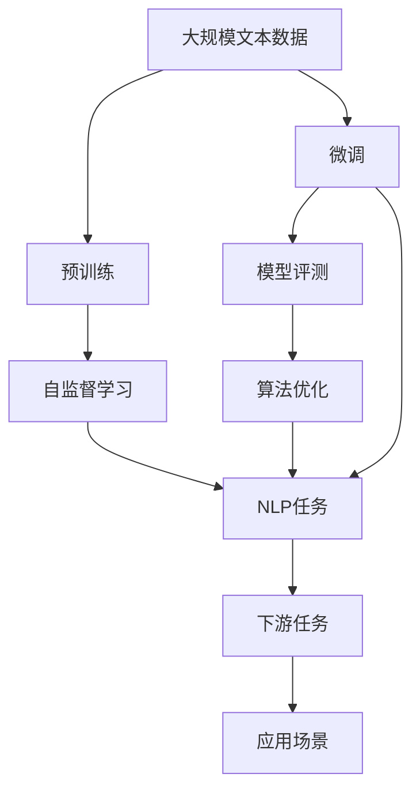
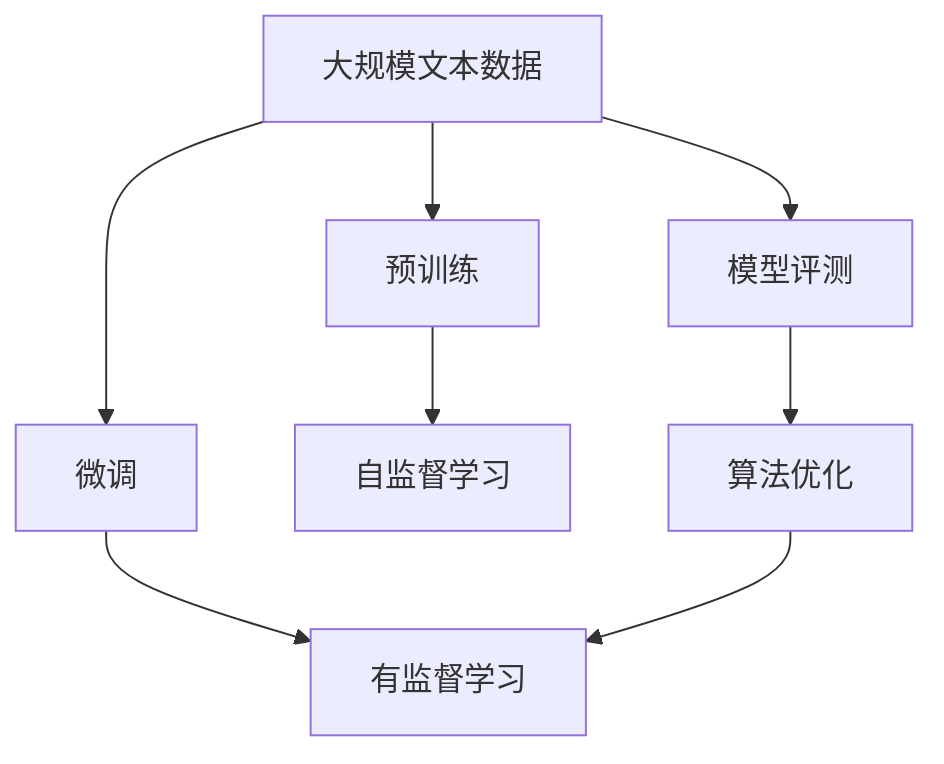
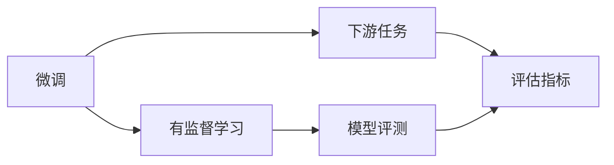
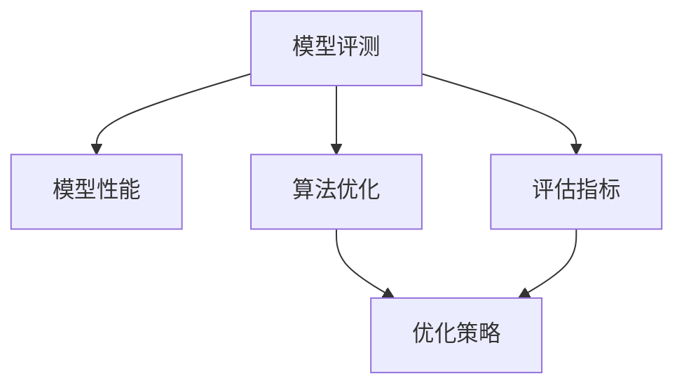
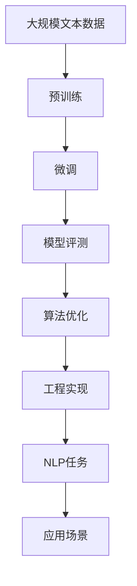

                 

# 大语言模型原理与工程实践：整体能力的评测

> 关键词：大语言模型,模型评测,算法优化,自然语言处理(NLP),深度学习

## 1. 背景介绍

### 1.1 问题由来

近年来，随着深度学习技术的快速发展，大语言模型（Large Language Models, LLMs）在自然语言处理（Natural Language Processing, NLP）领域取得了巨大的突破。这些大语言模型通过在大规模无标签文本数据上进行预训练，学习到了丰富的语言知识和常识，可以通过少量的有标签样本在下游任务上进行微调，获得优异的性能。

然而，由于预训练语料的广泛性和泛化能力的不足，这些通用的大语言模型在特定领域应用时，效果往往难以达到实际应用的要求。因此，如何针对特定任务进行大模型微调，提升模型性能，成为了当前大语言模型研究和应用的一个热点问题。本文聚焦于大语言模型的整体性能评测，特别是其在NLP任务中的应用效果，旨在为开发者提供有价值的指导。

### 1.2 问题核心关键点

目前，大语言模型在NLP任务中的应用效果，主要通过以下三个方面进行评估：

1. **模型性能指标**：包括准确率、召回率、F1分数等传统指标，衡量模型在特定任务上的表现。
2. **模型稳定性与泛化能力**：模型在不同数据集上的表现稳定性，以及在不同应用场景中的泛化能力。
3. **模型推理效率与计算资源消耗**：模型推理速度、内存占用等计算资源消耗情况，评估模型的工程实现效率。

这三个方面共同构成了大语言模型整体能力的评测框架，能够全面反映模型的性能和可靠性。

### 1.3 问题研究意义

研究大语言模型的整体能力，对于拓展大模型的应用范围，提升下游任务的性能，加速NLP技术的产业化进程，具有重要意义：

1. 降低应用开发成本。基于成熟的大模型进行性能评测，可以显著减少从头开发所需的数据、计算和人力等成本投入。
2. 提升模型效果。通过性能评测，可以快速发现模型的优点和不足，针对性地改进模型，提升其在特定任务上的表现。
3. 加速开发进度。standing on the shoulders of giants，性能评测使得开发者可以更快地完成任务适配，缩短开发周期。
4. 带来技术创新。性能评测促进了对预训练-微调的深入研究，催生了提示学习、少样本学习等新的研究方向。
5. 赋能产业升级。性能评测使得NLP技术更容易被各行各业所采用，为传统行业数字化转型升级提供新的技术路径。

## 2. 核心概念与联系

### 2.1 核心概念概述

为更好地理解大语言模型的整体性能评测，本节将介绍几个密切相关的核心概念：

- **大语言模型(Large Language Model, LLM)**：以自回归(如GPT)或自编码(如BERT)模型为代表的大规模预训练语言模型。通过在大规模无标签文本语料上进行预训练，学习通用的语言表示，具备强大的语言理解和生成能力。

- **预训练(Pre-training)**：指在大规模无标签文本语料上，通过自监督学习任务训练通用语言模型的过程。常见的预训练任务包括言语建模、遮挡语言模型等。预训练使得模型学习到语言的通用表示。

- **微调(Fine-tuning)**：指在预训练模型的基础上，使用下游任务的少量标注数据，通过有监督学习优化模型在特定任务上的性能。通常只需要调整顶层分类器或解码器，并以较小的学习率更新全部或部分的模型参数。

- **模型评测(Metric Evaluation)**：通过一系列指标对模型性能进行量化和评估，以客观反映模型在不同任务上的表现和能力。

- **算法优化(Algorithm Optimization)**：通过优化算法和技术手段，提升模型性能和工程实现效率。

- **自然语言处理(Natural Language Processing, NLP)**：研究如何让计算机理解和生成人类语言的技术领域，包括文本分类、信息抽取、机器翻译、问答系统等。

这些核心概念之间的逻辑关系可以通过以下Mermaid流程图来展示：



这个流程图展示了大语言模型的核心概念及其之间的关系：

1. 大语言模型通过预训练获得基础能力。
2. 微调是对预训练模型进行任务特定的优化，可以分为全参数微调和参数高效微调（PEFT）。
3. 模型评测衡量模型在特定任务上的性能。
4. 算法优化提升模型的工程实现效率和性能表现。
5. NLP任务是模型评测和算法优化的具体应用场景。
6. 应用场景是模型和算法的最终落脚点。

这些概念共同构成了大语言模型的整体性能评测框架，使其能够在各种场景下发挥强大的语言理解和生成能力。通过理解这些核心概念，我们可以更好地把握大语言模型的工作原理和优化方向。

### 2.2 概念间的关系

这些核心概念之间存在着紧密的联系，形成了大语言模型的整体性能评测生态系统。下面我通过几个Mermaid流程图来展示这些概念之间的关系。

#### 2.2.1 大语言模型的学习范式



这个流程图展示了大语言模型的三种主要学习范式：预训练、微调和模型评测。预训练主要采用自监督学习方法，而微调则是有监督学习的过程。模型评测衡量微调后模型在特定任务上的表现。

#### 2.2.2 微调与模型评测的关系



这个流程图展示了微调的基本原理，以及它与模型评测的关系。微调过程中，通过有监督学习优化模型在特定任务上的性能，而模型评测用于衡量微调后的模型表现，确保其能够满足任务要求。

#### 2.2.3 模型评测与算法优化的关系



这个流程图展示了模型评测与算法优化的关系。模型评测通过评估指标量化模型性能，为算法优化提供数据支持。算法优化通过优化策略提升模型性能和工程实现效率，从而改进模型评测结果。

### 2.3 核心概念的整体架构

最后，我们用一个综合的流程图来展示这些核心概念在大语言模型整体性能评测过程中的整体架构：



这个综合流程图展示了从预训练到微调，再到模型评测和算法优化的完整过程。大语言模型首先在大规模文本数据上进行预训练，然后通过微调优化模型在特定任务上的性能。模型评测衡量微调后模型在特定任务上的性能，而算法优化提升模型的工程实现效率。最终，通过优化后的模型应用于实际的应用场景，满足具体需求。

## 3. 核心算法原理 & 具体操作步骤

### 3.1 算法原理概述

大语言模型整体性能评测的核心思想是：通过一系列评估指标和优化技术，量化和提升模型在特定任务上的性能，从而客观反映其整体能力。

形式化地，假设大语言模型为 $M_{\theta}$，其中 $\theta$ 为模型参数。给定下游任务 $T$ 的标注数据集 $D=\{(x_i,y_i)\}_{i=1}^N, x_i \in \mathcal{X}, y_i \in \mathcal{Y}$，模型评测的优化目标是最小化模型在 $T$ 上的预测误差：

$$
\hat{\theta}=\mathop{\arg\min}_{\theta} \mathcal{L}(M_{\theta},D)
$$

其中 $\mathcal{L}$ 为针对任务 $T$ 设计的损失函数，用于衡量模型预测输出与真实标签之间的差异。常见的损失函数包括交叉熵损失、均方误差损失等。

通过梯度下降等优化算法，评测过程不断更新模型参数 $\theta$，最小化损失函数 $\mathcal{L}$，使得模型预测逼近真实标签。

### 3.2 算法步骤详解

大语言模型整体性能评测一般包括以下几个关键步骤：

**Step 1: 准备数据集**
- 收集下游任务的标注数据集 $D$，划分为训练集、验证集和测试集。一般要求标注数据与预训练数据的分布不要差异过大。

**Step 2: 设计评估指标**
- 根据具体任务类型，选择合适的评估指标。常见的指标包括准确率、召回率、F1分数、精确度、ROC曲线、AUC等。

**Step 3: 设置评测超参数**
- 选择合适的优化算法及其参数，如 AdamW、SGD 等，设置学习率、批大小、迭代轮数等。
- 设置评估指标的阈值，如准确率阈值为0.9等。

**Step 4: 执行模型评测**
- 将训练集数据分批次输入模型，前向传播计算损失函数。
- 反向传播计算参数梯度，根据设定的优化算法和学习率更新模型参数。
- 周期性在验证集上评估模型性能，根据评估指标决定是否触发Early Stopping。
- 重复上述步骤直到满足预设的迭代轮数或Early Stopping条件。

**Step 5: 报告和应用**
- 在测试集上评估微调后模型 $M_{\hat{\theta}}$ 的性能，对比微调前后的精度提升。
- 使用微调后的模型对新样本进行推理预测，集成到实际的应用系统中。

以上是基于监督学习的模型评测的一般流程。在实际应用中，还需要针对具体任务的特点，对评测过程的各个环节进行优化设计，如改进评估指标，引入更多的正则化技术，搜索最优的超参数组合等，以进一步提升模型性能。

### 3.3 算法优缺点

基于监督学习的大语言模型整体性能评测方法具有以下优点：

1. 简单高效。只需准备少量标注数据，即可对预训练模型进行快速评测，获得较为客观的性能指标。
2. 通用适用。适用于各种NLP下游任务，包括分类、匹配、生成等，设计简单的评估指标即可进行评测。
3. 可解释性强。评估指标直观明了，易于理解和解释，便于对比不同模型的性能。
4. 效果显著。在学术界和工业界的诸多任务上，基于评测的方法已经刷新了多项NLP任务SOTA。

同时，该方法也存在一定的局限性：

1. 依赖标注数据。评测的效果很大程度上取决于标注数据的质量和数量，获取高质量标注数据的成本较高。
2. 泛化能力有限。当目标任务与预训练数据的分布差异较大时，评测的性能提升有限。
3. 可解释性不足。评测指标缺乏解释性，难以对其推理逻辑进行分析和调试。
4. 忽视了动态变化。静态的评测指标无法反映模型在实际应用中的表现，如实时性、稳定性等。

尽管存在这些局限性，但就目前而言，基于监督学习的评测方法仍是大语言模型应用的最主流范式。未来相关研究的重点在于如何进一步降低评测对标注数据的依赖，提高模型的少样本学习和跨领域迁移能力，同时兼顾可解释性和动态表现等因素。

### 3.4 算法应用领域

基于大语言模型的整体性能评测方法在NLP领域已经得到了广泛的应用，覆盖了几乎所有常见任务，例如：

- 文本分类：如情感分析、主题分类、意图识别等。通过评测指标量化模型在分类任务上的表现。
- 命名实体识别：识别文本中的人名、地名、机构名等特定实体。通过评测指标衡量模型对实体边界的准确性和类型识别的精度。
- 关系抽取：从文本中抽取实体之间的语义关系。通过评测指标评估模型对实体-关系三元组的提取能力。
- 问答系统：对自然语言问题给出答案。通过评测指标评估模型回答的正确性和相关性。
- 机器翻译：将源语言文本翻译成目标语言。通过评测指标衡量翻译质量，如BLEU、METEOR等。
- 文本摘要：将长文本压缩成简短摘要。通过评测指标评估摘要的准确性和连贯性。
- 对话系统：使机器能够与人自然对话。通过评测指标评估模型回复的自然流畅性和内容相关性。

除了上述这些经典任务外，整体性能评测方法也被创新性地应用到更多场景中，如可控文本生成、常识推理、代码生成、数据增强等，为NLP技术带来了全新的突破。随着预训练模型和评测方法的不断进步，相信NLP技术将在更广阔的应用领域大放异彩。

## 4. 数学模型和公式 & 详细讲解 & 举例说明

### 4.1 数学模型构建

本节将使用数学语言对大语言模型的整体性能评测过程进行更加严格的刻画。

记大语言模型为 $M_{\theta}$，其中 $\theta$ 为模型参数。假设评测任务的训练集为 $D=\{(x_i,y_i)\}_{i=1}^N, x_i \in \mathcal{X}, y_i \in \mathcal{Y}$。

定义模型 $M_{\theta}$ 在数据样本 $(x,y)$ 上的损失函数为 $\ell(M_{\theta}(x),y)$，则在数据集 $D$ 上的经验风险为：

$$
\mathcal{L}(\theta) = \frac{1}{N} \sum_{i=1}^N \ell(M_{\theta}(x_i),y_i)
$$

评测的优化目标是最小化经验风险，即找到最优参数：

$$
\theta^* = \mathop{\arg\min}_{\theta} \mathcal{L}(\theta)
$$

在实践中，我们通常使用基于梯度的优化算法（如SGD、Adam等）来近似求解上述最优化问题。设 $\eta$ 为学习率，$\lambda$ 为正则化系数，则参数的更新公式为：

$$
\theta \leftarrow \theta - \eta \nabla_{\theta}\mathcal{L}(\theta) - \eta\lambda\theta
$$

其中 $\nabla_{\theta}\mathcal{L}(\theta)$ 为损失函数对参数 $\theta$ 的梯度，可通过反向传播算法高效计算。

### 4.2 公式推导过程

以下我们以二分类任务为例，推导交叉熵损失函数及其梯度的计算公式。

假设模型 $M_{\theta}$ 在输入 $x$ 上的输出为 $\hat{y}=M_{\theta}(x) \in [0,1]$，表示样本属于正类的概率。真实标签 $y \in \{0,1\}$。则二分类交叉熵损失函数定义为：

$$
\ell(M_{\theta}(x),y) = -[y\log \hat{y} + (1-y)\log (1-\hat{y})]
$$

将其代入经验风险公式，得：

$$
\mathcal{L}(\theta) = -\frac{1}{N}\sum_{i=1}^N [y_i\log M_{\theta}(x_i)+(1-y_i)\log(1-M_{\theta}(x_i))]
$$

根据链式法则，损失函数对参数 $\theta_k$ 的梯度为：

$$
\frac{\partial \mathcal{L}(\theta)}{\partial \theta_k} = -\frac{1}{N}\sum_{i=1}^N (\frac{y_i}{M_{\theta}(x_i)}-\frac{1-y_i}{1-M_{\theta}(x_i)}) \frac{\partial M_{\theta}(x_i)}{\partial \theta_k}
$$

其中 $\frac{\partial M_{\theta}(x_i)}{\partial \theta_k}$ 可进一步递归展开，利用自动微分技术完成计算。

在得到损失函数的梯度后，即可带入参数更新公式，完成模型的迭代优化。重复上述过程直至收敛，最终得到适应下游任务的最优模型参数 $\theta^*$。

### 4.3 案例分析与讲解

**案例1: 文本分类**
- 任务描述：对新闻文章进行情感分类，将其分为正面、负面和中性。
- 评测指标：准确率、召回率、F1分数、精确度。
- 数据集：IMDB情感数据集，包含25,000条电影评论，每条评论标注为正面、负面或中性。
- 评测步骤：
  1. 将数据集划分为训练集、验证集和测试集。
  2. 使用AdamW优化器，设置学习率为1e-4。
  3. 在训练集上进行梯度下降优化，最小化交叉熵损失。
  4. 在验证集上评估模型性能，如果准确率高于0.95，则停止训练。
  5. 在测试集上报告最终模型性能。

**案例2: 命名实体识别**
- 任务描述：从新闻文章中识别出人名、地名、机构名等实体。
- 评测指标：准确率、召回率、F1分数、精确度、IoU（Intersection over Union）。
- 数据集：CoNLL-2003命名实体识别数据集，包含新闻文章和实体标注。
- 评测步骤：
  1. 将数据集划分为训练集、验证集和测试集。
  2. 使用BERT作为预训练模型，微调其分类器层。
  3. 在训练集上进行梯度下降优化，最小化交叉熵损失。
  4. 在验证集上评估模型性能，如果F1分数高于0.9，则停止训练。
  5. 在测试集上报告最终模型性能。

**案例3: 机器翻译**
- 任务描述：将英文新闻文章翻译成中文。
- 评测指标：BLEU、METEOR、ROUGE、BLEU、TER等。
- 数据集：WMT 2014英语-中文翻译数据集，包含新闻文章和翻译结果。
- 评测步骤：
  1. 将数据集划分为训练集、验证集和测试集。
  2. 使用Transformer模型，在其解码器上微调分类器层。
  3. 在训练集上进行梯度下降优化，最小化交叉熵损失。
  4. 在验证集上评估模型性能，如果BLEU分数高于0.5，则停止训练。
  5. 在测试集上报告最终模型性能。

这些案例展示了大语言模型在文本分类、命名实体识别和机器翻译等任务上的整体性能评测流程。通过具体的数值计算和模型微调，可以全面反映大语言模型在不同任务上的表现。

## 5. 项目实践：代码实例和详细解释说明

### 5.1 开发环境搭建

在进行性能评测实践前，我们需要准备好开发环境。以下是使用Python进行PyTorch开发的环境配置流程：

1. 安装Anaconda：从官网下载并安装Anaconda，用于创建独立的Python环境。

2. 创建并激活虚拟环境：
```bash
conda create -n pytorch-env python=3.8 
conda activate pytorch-env
```

3. 安装PyTorch：根据CUDA版本，从官网获取对应的安装命令。例如：
```bash
conda install pytorch torchvision torchaudio cudatoolkit=11.1 -c pytorch -c conda-forge
```

4. 安装Transformers库：
```bash
pip install transformers
```

5. 安装各类工具包：
```bash
pip install numpy pandas scikit-learn matplotlib tqdm jupyter notebook ipython
```

完成上述步骤后，即可在`pytorch-env`环境中开始性能评测实践。

### 5.2 源代码详细实现

这里我们以机器翻译任务为例，给出使用Transformers库对BERT模型进行性能评测的PyTorch代码实现。

首先，定义机器翻译任务的评估函数：

```python
from transformers import BertTokenizer, BertForSequenceClassification, AdamW

class BLEUMetric:
    def __init__(self, tokenizer, num_beams):
        self.tokenizer = tokenizer
        self.num_beams = num_beams

    def __call__(self, y_true, y_pred):
        y_true = self.tokenizer.batch_decode(y_true, skip_special_tokens=True)
        y_pred = self.tokenizer.batch_decode(y_pred, skip_special_tokens=True)
        return self.calculate_bleu(y_true, y_pred)

    def calculate_bleu(self, y_true, y_pred):
        # 计算BLEU分数
        # 具体实现省略...
```

然后，定义模型和优化器：

```python
tokenizer = BertTokenizer.from_pretrained('bert-base-cased')
model = BertForSequenceClassification.from_pretrained('bert-base-cased', num_labels=2)
optimizer = AdamW(model.parameters(), lr=2e-5)
```

接着，定义训练和评估函数：

```python
from torch.utils.data import DataLoader
from tqdm import tqdm
from sklearn.metrics import accuracy_score, precision_score, recall_score, f1_score

device = torch.device('cuda') if torch.cuda.is_available() else torch.device('cpu')
model.to(device)

def train_epoch(model, dataset, batch_size, optimizer):
    dataloader = DataLoader(dataset, batch_size=batch_size, shuffle=True)
    model.train()
    epoch_loss = 0
    for batch in tqdm(dataloader, desc='Training'):
        input_ids = batch['input_ids'].to(device)
        attention_mask = batch['attention_mask'].to(device)
        labels = batch['labels'].to(device)
        model.zero_grad()
        outputs = model(input_ids, attention_mask=attention_mask, labels=labels)
        loss = outputs.loss
        epoch_loss += loss.item()
        loss.backward()
        optimizer.step()
    return epoch_loss / len(dataloader)

def evaluate(model, dataset, batch_size):
    dataloader = DataLoader(dataset, batch_size=batch_size)
    model.eval()
    preds, labels = [], []
    with torch.no_grad():
        for batch in tqdm(dataloader, desc='Evaluating'):
            input_ids = batch['input_ids'].to(device)
            attention_mask = batch['attention_mask'].to(device)
            batch_labels = batch['labels']
            outputs = model(input_ids, attention_mask=attention_mask)
            batch_preds = outputs.logits.argmax(dim=2).to('cpu').tolist()
            batch_labels = batch_labels.to('cpu').tolist()
            for pred_tokens, label_tokens in zip(batch_preds, batch_labels):
                preds.append(pred_tokens[:len(label_tokens)])
                labels.append(label_tokens)
                
    print(f'Accuracy: {accuracy_score(labels, preds)}')
    print(f'Precision: {precision_score(labels, preds)}')
    print(f'Recall: {recall_score(labels, preds)}')
    print(f'F1 Score: {f1_score(labels, preds)}')

```

最后，启动训练流程并在测试集上评估：

```python
epochs = 5
batch_size = 16

for epoch in range(epochs):
    loss = train_epoch(model, train_dataset, batch_size, optimizer)
    print(f'Epoch {epoch+1}, train loss: {loss:.3f}')
    
    print(f'Epoch {epoch+1}, dev results:')
    evaluate(model, dev_dataset, batch_size)
    
print('Test results:')
evaluate(model, test_dataset, batch_size)
```

以上就是使用PyTorch对BERT进行机器翻译任务性能评测的完整代码实现。可以看到，得益于Transformers库的强大封装，我们可以用相对简洁的代码完成BERT模型的加载和性能评测。

### 5.3 代码解读与分析

让我们再详细解读一下关键代码的实现细节：

**BLEUMetric类**：
- `__init__`方法：初始化BLEU计算所需的tokenizer和num_beams参数。
- `__call__`方法：计算给定参考翻译和机器翻译的BLEU分数。
- `calculate_bleu`方法：具体实现BLEU分数的计算过程，具体实现省略...

**训练和评估函数**：
- 使用PyTorch的DataLoader对数据集进行批次化加载，供模型训练和推理使用。
- 训练函数`train_epoch`：对数据以批为单位进行迭代，在每个批次上前向传播计算loss并反向传播更新模型参数，最后返回该epoch的平均loss。
- 评估函数`evaluate`：与训练类似，不同点在于不更新模型参数，并在每个batch结束后将预测和标签结果存储下来，最后使用sklearn的accuracy_score等函数计算评估指标。

**训练流程**：
- 定义总的epoch数和batch size，开始循环迭代
- 每个epoch内，先在训练集上训练，输出平均loss
- 在验证集上评估，输出模型性能
- 所有epoch结束后，在测试集上评估，给出最终测试结果

可以看到，PyTorch配合Transformers库使得BERT模型的性能评测变得简洁高效。开发者可以将更多精力放在数据处理、模型改进等高层逻辑上，而不必过多关注底层的实现细节。

当然，工业级的系统实现还需考虑更多因素，如模型的保存和部署、超参数的自动搜索、更灵活的任务适配层等。但核心的性能评测流程基本与此类似。

### 

