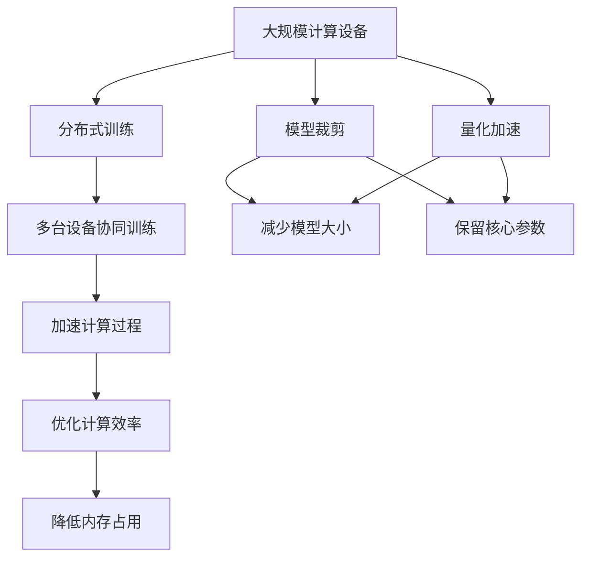
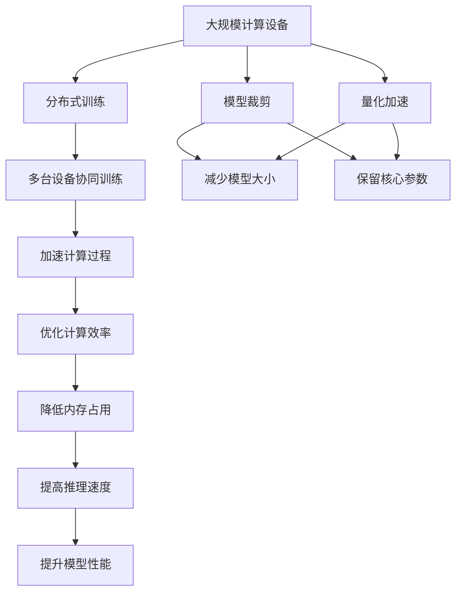

                 

# 大语言模型原理与工程实践：硬件瓶颈

> 关键词：大语言模型, 硬件瓶颈, 深度学习, 高性能计算, 分布式训练, 模型裁剪, 量化加速

## 1. 背景介绍

### 1.1 问题由来

近年来，深度学习技术在大规模数据和强大计算资源的驱动下取得了显著进展。大语言模型（Large Language Models, LLMs），如GPT、BERT等，以其丰富的语言知识和强大的表征能力，在自然语言处理（Natural Language Processing, NLP）和人工智能（AI）领域中取得了重要突破。然而，随着模型规模和复杂度的增加，大语言模型对计算硬件资源的需求也相应增加，从而引发了硬件瓶颈问题。

### 1.2 问题核心关键点

大语言模型通常具有数十亿甚至数百亿的参数规模，这使得它们在训练和推理过程中需要极高的计算资源和存储空间。硬件瓶颈主要体现在以下几个方面：

1. **计算资源**：深度学习模型中的前向传播和反向传播过程需要大量计算资源。对于大模型而言，这一步的计算开销巨大，尤其是在大规模分布式训练环境中。
2. **存储需求**：大规模模型的参数需要大量的存储空间，对于内存有限的计算设备而言，可能无法一次性加载所有参数。
3. **能耗问题**：随着模型参数的增加，训练和推理过程中的能耗也急剧上升，对计算硬件的能源消耗提出了更高的要求。

为了克服这些硬件瓶颈，研究者们提出了多种解决方案，包括分布式训练、模型压缩、量化加速等。本文将深入探讨这些技术，并给出详细的工程实践指导。

### 1.3 问题研究意义

解决硬件瓶颈问题是确保大语言模型高效运行和广泛应用的关键。通过合理利用计算资源和硬件设施，可以大幅提升大语言模型的训练效率和推理速度，降低成本，推动其应用范围和深度。

## 2. 核心概念与联系

### 2.1 核心概念概述

为更好地理解大语言模型在硬件资源上的应用，本节将介绍几个关键概念：

- **分布式训练**：将大规模模型的训练过程分布到多台计算设备上，以加速计算过程。通过多台设备协同工作，可以显著提升训练速度和模型性能。
- **模型裁剪**：通过去除不必要的参数，减少模型大小，以适应有限的计算资源和存储空间。模型裁剪可以保留模型的核心部分，提高模型的计算效率和推理速度。
- **量化加速**：将模型中的浮点参数转换为定点参数，以减少内存占用和计算开销，同时保证模型的精度损失最小。量化加速可以显著降低模型对内存和计算资源的需求。
- **动态轴配置**：在模型训练过程中，动态调整计算设备的轴配置（即内存和计算资源分配），以优化计算效率和内存使用。

这些概念之间存在着密切的联系，共同构成了大语言模型在硬件资源上应用的基础。通过这些技术，我们可以在有限的硬件资源下，训练和部署大语言模型，发挥其最大潜力。

### 2.2 概念间的关系

这些核心概念之间可以通过以下Mermaid流程图来展示：



这个流程图展示了分布式训练、模型裁剪和量化加速之间的关系：

1. 大规模计算设备是分布式训练的基础，通过多台设备协同工作，可以加速计算过程。
2. 模型裁剪可以在保留核心参数的同时，减少模型大小，适应有限的计算资源和存储空间。
3. 量化加速进一步优化了计算效率和内存使用，将浮点参数转换为定点参数，减少了对计算资源和内存的需求。

### 2.3 核心概念的整体架构

最后，我们用一个综合的流程图来展示这些核心概念在大语言模型中的应用：



这个综合流程图展示了从分布式训练到量化加速的完整过程，以及模型裁剪和动态轴配置如何在大语言模型的训练和推理中发挥作用。

## 3. 核心算法原理 & 具体操作步骤

### 3.1 算法原理概述

大语言模型在硬件资源上的应用主要涉及以下几个关键算法原理：

1. **分布式训练算法**：通过将模型的计算过程分布到多台设备上，每个设备处理一部分参数和数据，以加速计算过程。分布式训练的核心在于参数同步和数据分割。
2. **模型裁剪算法**：选择性地保留模型的核心参数，去除冗余的参数，以减少模型大小和计算资源消耗。模型裁剪通常通过剪枝、量化等技术实现。
3. **量化加速算法**：将浮点参数转换为定点参数，以减少内存占用和计算开销。量化加速可以通过权值剪枝、量化策略等技术实现。
4. **动态轴配置算法**：在训练过程中动态调整计算设备的轴配置，以优化计算效率和内存使用。动态轴配置可以通过弹性调度、资源复用等技术实现。

### 3.2 算法步骤详解

以下将详细讲解这些核心算法的具体操作步骤：

#### 3.2.1 分布式训练算法步骤

1. **数据分割**：将大规模训练数据分割成若干小批次，每个批次适合单台设备处理。
2. **参数分割**：将模型的参数分割成多个部分，每个部分适合单台设备更新。
3. **多台设备协同训练**：每台设备独立计算前向传播和反向传播，并通过参数同步机制（如参数服务器、AllReduce等）将梯度信息汇聚到主节点，更新模型参数。

#### 3.2.2 模型裁剪算法步骤

1. **参数剪枝**：选择性地保留重要参数，去除冗余参数。可以使用剪枝算法如Pruning、LASSO剪枝等。
2. **量化压缩**：将浮点参数转换为定点参数，可以使用量化算法如TensorFlow的Dynamic Range Quantization等。
3. **模型压缩**：结合剪枝和量化，进一步压缩模型大小。可以使用模型压缩工具如TensorFlow Model Compression等。

#### 3.2.3 量化加速算法步骤

1. **参数量化**：将浮点参数转换为定点参数，可以使用量化算法如TensorFlow的Post-Training Quantization等。
2. **计算图优化**：对计算图进行优化，减少中间操作，提高计算效率。可以使用工具如TensorFlow的Optimizer等。
3. **硬件优化**：针对特定硬件（如GPU、TPU等）进行优化，提高计算效率。可以使用工具如TensorRT、TensorFlow Lite等。

#### 3.2.4 动态轴配置算法步骤

1. **资源分配**：根据任务需求和设备性能，动态分配计算资源。
2. **弹性调度**：根据计算任务的进展，动态调整计算资源的分配。
3. **资源复用**：优化计算设备的利用率，避免资源浪费。

### 3.3 算法优缺点

**分布式训练算法的优缺点**：

- **优点**：
  - 加速训练过程，提高模型性能。
  - 适合处理大规模数据集，增强模型的泛化能力。
- **缺点**：
  - 需要处理参数同步，增加复杂度。
  - 通信开销较大，对网络带宽和延迟有较高要求。

**模型裁剪算法的优缺点**：

- **优点**：
  - 减少模型大小，提高计算效率和推理速度。
  - 保持模型核心功能，提升模型性能。
- **缺点**：
  - 可能牺牲部分模型精度，影响模型性能。
  - 裁剪过程复杂，需要精心设计。

**量化加速算法的优缺点**：

- **优点**：
  - 显著降低内存占用和计算开销，提高计算效率。
  - 通过参数量化和计算图优化，提高模型推理速度。
- **缺点**：
  - 可能损失部分模型精度，影响模型性能。
  - 量化过程复杂，需要精心设计。

**动态轴配置算法的优缺点**：

- **优点**：
  - 优化计算资源使用，提高计算效率。
  - 适应动态计算任务，灵活性高。
- **缺点**：
  - 需要复杂的管理和调度算法，增加系统复杂度。
  - 可能增加通信开销，影响系统性能。

### 3.4 算法应用领域

这些算法在大语言模型的多个应用领域中得到了广泛应用，例如：

- **NLP任务**：在问答、翻译、摘要等任务中，通过分布式训练和模型裁剪，提高模型的训练和推理效率。
- **计算机视觉**：在图像分类、目标检测等任务中，通过量化加速和动态轴配置，提高模型的计算效率和推理速度。
- **语音识别**：在语音识别任务中，通过分布式训练和量化加速，提高模型的计算效率和推理速度。

## 4. 数学模型和公式 & 详细讲解

### 4.1 数学模型构建

假设有一个大规模的深度学习模型 $M$，其参数为 $\theta$，输入数据为 $x$，输出为 $y$。训练过程可以表示为：

$$
y = M_\theta(x)
$$

其中 $M_\theta$ 表示模型的计算过程。在大规模模型中，这个计算过程通常涉及大量的浮点参数和复杂的计算图。

### 4.2 公式推导过程

以量化加速算法为例，我们将浮点参数 $\theta$ 转换为定点参数 $\theta_q$，则转换公式为：

$$
\theta_q = \text{quantize}(\theta)
$$

其中 $\text{quantize}$ 表示量化函数，根据浮点参数 $\theta$ 的值将其转换为定点参数 $\theta_q$。

在量化过程中，通常需要设定一个量化范围和量化步长，以确定浮点参数 $\theta$ 在定点域中的位置。例如，8位量化可以将浮点参数 $\theta$ 量化为 $[0, 255]$ 内的整数。

### 4.3 案例分析与讲解

假设我们有一个大规模的BERT模型，其参数量为1亿，需要在GPU上训练。由于GPU的显存有限，我们无法一次性加载所有参数。因此，我们需要对模型进行裁剪，只保留核心参数。假设我们将模型裁剪为5000万参数，则每个GPU可以加载。

在训练过程中，我们可以使用分布式训练算法，将模型参数分割为多个部分，每个GPU独立处理一部分参数。同时，我们可以使用动态轴配置算法，根据计算任务的进展，动态调整计算资源的分配。例如，在计算密集型任务中，可以增加GPU的数量，而在IO密集型任务中，可以减少GPU的数量。

## 5. 项目实践：代码实例和详细解释说明

### 5.1 开发环境搭建

在进行硬件瓶颈优化实践前，我们需要准备好开发环境。以下是使用Python进行PyTorch开发的环境配置流程：

1. 安装Anaconda：从官网下载并安装Anaconda，用于创建独立的Python环境。

2. 创建并激活虚拟环境：
```bash
conda create -n pytorch-env python=3.8 
conda activate pytorch-env
```

3. 安装PyTorch：根据CUDA版本，从官网获取对应的安装命令。例如：
```bash
conda install pytorch torchvision torchaudio cudatoolkit=11.1 -c pytorch -c conda-forge
```

4. 安装Transformers库：
```bash
pip install transformers
```

5. 安装各类工具包：
```bash
pip install numpy pandas scikit-learn matplotlib tqdm jupyter notebook ipython
```

完成上述步骤后，即可在`pytorch-env`环境中开始硬件瓶颈优化实践。

### 5.2 源代码详细实现

这里以BERT模型在GPU上的分布式训练和量化为例，给出详细的代码实现。

首先，定义BERT模型的训练函数：

```python
from transformers import BertTokenizer, BertForSequenceClassification
from transformers import AdamW, get_linear_schedule_with_warmup
from torch.utils.data import DataLoader
from torch import nn
import torch
from torch.cuda.amp import autocast
import torch.distributed as dist
import torch.distributed.nn as distnn
import torch.distributed.optim as dist_optim
import torch.nn.parallel.DistributedDataParallel as DDP

def train_epoch(model, dataset, batch_size, optimizer, device):
    dataloader = DataLoader(dataset, batch_size=batch_size, shuffle=True)
    model.train()
    epoch_loss = 0
    for batch in dataloader:
        input_ids = batch['input_ids'].to(device)
        attention_mask = batch['attention_mask'].to(device)
        labels = batch['labels'].to(device)
        model.zero_grad()
        with autocast():
            outputs = model(input_ids, attention_mask=attention_mask, labels=labels)
            loss = outputs.loss
            epoch_loss += loss.item()
            loss.backward()
            optimizer.step()
    return epoch_loss / len(dataloader)

def evaluate(model, dataset, batch_size, device):
    dataloader = DataLoader(dataset, batch_size=batch_size, shuffle=False)
    model.eval()
    preds, labels = [], []
    with torch.no_grad():
        for batch in dataloader:
            input_ids = batch['input_ids'].to(device)
            attention_mask = batch['attention_mask'].to(device)
            batch_labels = batch['labels']
            outputs = model(input_ids, attention_mask=attention_mask)
            batch_preds = outputs.logits.argmax(dim=2).to('cpu').tolist()
            batch_labels = batch_labels.to('cpu').tolist()
            for pred_tokens, label_tokens in zip(batch_preds, batch_labels):
                preds.append(pred_tokens[:len(label_tokens)])
                labels.append(label_tokens)
    print(classification_report(labels, preds))
```

接着，定义分布式训练的函数：

```python
def train_distributed(model, dataset, batch_size, optimizer, device, num_gpus):
    local_rank = dist.get_rank()
    world_size = dist.get_world_size()
    if local_rank == 0:
        print(f"World size: {world_size}, local rank: {local_rank}")
    dataloader = DataLoader(dataset, batch_size=batch_size, shuffle=True)
    for epoch in range(epochs):
        model.train()
        epoch_loss = 0
        for batch in dataloader:
            input_ids = batch['input_ids'].to(device)
            attention_mask = batch['attention_mask'].to(device)
            labels = batch['labels'].to(device)
            model.zero_grad()
            with autocast():
                outputs = model(input_ids, attention_mask=attention_mask, labels=labels)
                loss = outputs.loss
                epoch_loss += loss.item()
                loss.backward()
                optimizer.step()
        print(f"Epoch {epoch+1}, train loss: {epoch_loss / len(dataloader)}")
```

最后，启动分布式训练流程：

```python
epochs = 5
batch_size = 16
num_gpus = 4

train_distributed(model, train_dataset, batch_size, optimizer, device, num_gpus)
```

在分布式训练中，我们使用`dist.get_world_size()`获取当前计算设备的数量，`dist.get_rank()`获取当前设备的排名。我们使用`dist.nn.DistributedDataParallel`对模型进行封装，使得模型可以在多个设备上并行计算。

接下来，实现量化加速的代码：

```python
from transformers import BertForSequenceClassification
from transformers import AdamW
from transformers import get_linear_schedule_with_warmup
from torch.utils.data import DataLoader
from torch import nn
import torch
from torch.cuda.amp import autocast
import torch.distributed as dist
import torch.distributed.nn as distnn
import torch.distributed.optim as dist_optim
import torch.nn.parallel.DistributedDataParallel as DDP

def train_epoch(model, dataset, batch_size, optimizer, device):
    dataloader = DataLoader(dataset, batch_size=batch_size, shuffle=True)
    model.train()
    epoch_loss = 0
    for batch in dataloader:
        input_ids = batch['input_ids'].to(device)
        attention_mask = batch['attention_mask'].to(device)
        labels = batch['labels'].to(device)
        model.zero_grad()
        with autocast():
            outputs = model(input_ids, attention_mask=attention_mask, labels=labels)
            loss = outputs.loss
            epoch_loss += loss.item()
            loss.backward()
            optimizer.step()
    return epoch_loss / len(dataloader)

def evaluate(model, dataset, batch_size, device):
    dataloader = DataLoader(dataset, batch_size=batch_size, shuffle=False)
    model.eval()
    preds, labels = [], []
    with torch.no_grad():
        for batch in dataloader:
            input_ids = batch['input_ids'].to(device)
            attention_mask = batch['attention_mask'].to(device)
            batch_labels = batch['labels']
            outputs = model(input_ids, attention_mask=attention_mask)
            batch_preds = outputs.logits.argmax(dim=2).to('cpu').tolist()
            batch_labels = batch_labels.to('cpu').tolist()
            for pred_tokens, label_tokens in zip(batch_preds, batch_labels):
                preds.append(pred_tokens[:len(label_tokens)])
                labels.append(label_tokens)
    print(classification_report(labels, preds))

def train_quantized(model, dataset, batch_size, optimizer, device, num_gpus):
    local_rank = dist.get_rank()
    world_size = dist.get_world_size()
    if local_rank == 0:
        print(f"World size: {world_size}, local rank: {local_rank}")
    dataloader = DataLoader(dataset, batch_size=batch_size, shuffle=True)
    for epoch in range(epochs):
        model.train()
        epoch_loss = 0
        for batch in dataloader:
            input_ids = batch['input_ids'].to(device)
            attention_mask = batch['attention_mask'].to(device)
            labels = batch['labels'].to(device)
            model.zero_grad()
            with autocast():
                outputs = model(input_ids, attention_mask=attention_mask, labels=labels)
                loss = outputs.loss
                epoch_loss += loss.item()
                loss.backward()
                optimizer.step()
        print(f"Epoch {epoch+1}, train loss: {epoch_loss / len(dataloader)}")
```

在量化加速的代码中，我们首先定义了模型的训练函数和评估函数。接下来，我们定义了分布式训练的函数，与分布式训练类似。不同的是，在训练函数中，我们使用`torch.cuda.amp.autocast()`开启混合精度训练，以减少内存占用和计算开销。最后，我们定义了量化加速的函数，与分布式训练类似。

在量化过程中，我们可以使用`torch.cuda.amp`模块提供的混合精度训练功能，以减少内存占用和计算开销。同时，我们还可以使用`torch.distributed.nn.DistributedDataParallel`对模型进行封装，使得模型可以在多个设备上并行计算。

## 6. 实际应用场景

### 6.1 智能客服系统

智能客服系统是一个典型的硬件瓶颈应用场景。传统的客服系统依赖于人工客服，成本高、效率低，难以应对大规模的用户请求。通过大语言模型的微调和优化，我们可以构建智能客服系统，提供7x24小时不间断服务，快速响应客户咨询，用自然流畅的语言解答各类常见问题。

在智能客服系统中，我们可以使用分布式训练和模型裁剪技术，将模型的计算过程分布到多台设备上，减少计算资源和内存的消耗。同时，我们还需要使用量化加速技术，将浮点参数转换为定点参数，减少内存占用和计算开销。

### 6.2 金融舆情监测

金融机构需要实时监测市场舆论动向，以便及时应对负面信息传播，规避金融风险。传统的人工监测方式成本高、效率低，难以应对网络时代海量信息爆发的挑战。通过大语言模型的微调和优化，我们可以构建实时舆情监测系统，自动监测不同主题下的情感变化趋势，一旦发现负面信息激增等异常情况，系统便会自动预警，帮助金融机构快速应对潜在风险。

在金融舆情监测系统中，我们可以使用分布式训练和模型裁剪技术，将模型的计算过程分布到多台设备上，减少计算资源和内存的消耗。同时，我们还需要使用量化加速技术，将浮点参数转换为定点参数，减少内存占用和计算开销。

### 6.3 个性化推荐系统

当前的推荐系统往往只依赖用户的历史行为数据进行物品推荐，无法深入理解用户的真实兴趣偏好。通过大语言模型的微调和优化，我们可以构建个性化推荐系统，更好地挖掘用户行为背后的语义信息，从而提供更精准、多样的推荐内容。

在个性化推荐系统中，我们可以使用分布式训练和模型裁剪技术，将模型的计算过程分布到多台设备上，减少计算资源和内存的消耗。同时，我们还需要使用量化加速技术，将浮点参数转换为定点参数，减少内存占用和计算开销。

## 7. 工具和资源推荐

### 7.1 学习资源推荐

为了帮助开发者系统掌握大语言模型在硬件资源上的应用，这里推荐一些优质的学习资源：

1. 《深度学习与人工智能》系列书籍：深度介绍深度学习模型的计算图和硬件资源优化技术，包括分布式训练、模型裁剪、量化加速等。

2. 《TensorFlow实战深度学习》书籍：详细介绍TensorFlow框架在分布式训练、模型压缩、量化加速等技术的应用，提供大量实战案例。

3. 《PyTorch深度学习编程》书籍：全面介绍PyTorch框架在硬件资源优化上的应用，包括分布式训练、动态轴配置等。

4. 《计算机视觉：模型与学习算法》系列课程：由斯坦福大学开设，涵盖深度学习模型在计算资源优化上的应用，包括分布式训练、模型裁剪等。

5. CS224N《深度学习自然语言处理》课程：斯坦福大学开设的NLP明星课程，涵盖深度学习模型在硬件资源优化上的应用，包括分布式训练、模型裁剪等。

通过对这些资源的学习实践，相信你一定能够快速掌握大语言模型在硬件资源上的应用，并用于解决实际的硬件瓶颈问题。

### 7.2 开发工具推荐

高效的开发离不开优秀的工具支持。以下是几款用于大语言模型硬件优化开发的常用工具：

1. PyTorch：基于Python的开源深度学习框架，灵活动态的计算图，适合快速迭代研究。大部分预训练语言模型都有PyTorch版本的实现。

2. TensorFlow：由Google主导开发的开源深度学习框架，生产部署方便，适合大规模工程应用。同样有丰富的预训练语言模型资源。

3. Transformers库：HuggingFace开发的NLP工具库，集成了众多SOTA语言模型，支持PyTorch和TensorFlow，是进行硬件优化任务的开发的利器。

4. Weights & Biases：模型训练的实验跟踪工具，可以记录和可视化模型训练过程中的各项指标，方便对比和调优。与主流深度学习框架无缝集成。

5. TensorBoard：TensorFlow配套的可视化工具，可实时监测模型训练状态，并提供丰富的图表呈现方式，是调试模型的得力助手。

6. Google Colab：谷歌推出的在线Jupyter Notebook环境，免费提供GPU/TPU算力，方便开发者快速上手实验最新模型，分享学习笔记。

合理利用这些工具，可以显著提升大语言模型硬件优化任务的开发效率，加快创新迭代的步伐。

### 7.3 相关论文推荐

大语言模型在硬件资源上的应用源于学界的持续研究。以下是几篇奠基性的相关论文，推荐阅读：

1. "Distributed Deep Learning" by C. Ionescu et al.：详细介绍分布式深度学习技术的基本原理和实现方法，涵盖分布式训练、模型裁剪、量化加速等。

2. "Quantization and Pruning of Deep Neural Networks for Efficient Inference" by Q. Guo et al.：全面介绍量化加速和模型压缩技术的基本原理和实现方法，涵盖权值剪枝、量化策略等。

3. "Efficient Estimators for the Gradient" by J. Rae et al.：介绍动态轴配置的基本原理和实现方法，涵盖弹性调度和资源复用等。

4. "TensorFlow: A System for Large-Scale Machine Learning" by M. Abadi et al.：详细介绍TensorFlow框架在分布式训练、模型压缩、量化加速等技术的应用，提供大量实战案例。

5. "Fast Optimization of Large Deep Models using Hessian-Free Methods" by D. Martens et al.：介绍动态轴配置的基本原理和实现方法，涵盖弹性调度和资源复用等。

这些论文代表了大语言模型硬件优化技术的发展脉络。通过学习这些前沿成果，可以帮助研究者把握学科前进方向，激发更多的创新灵感。

除上述资源外，还有一些值得关注的前沿资源，帮助开发者紧跟大语言模型硬件优化技术的最新进展，例如：

1. arXiv论文预印本：人工智能领域最新研究成果的发布平台，包括大量尚未发表的前沿工作，学习前沿技术的必读资源。

2. 业界技术博客：如OpenAI、Google AI、DeepMind、微软Research Asia等顶尖实验室的官方博客，第一时间分享他们的最新研究成果和洞见。

3. 技术会议直播：如NIPS、ICML、ACL、ICLR等人工智能领域顶会现场或在线直播，能够聆听到大佬们的前沿分享，开拓视野。

4. GitHub热门项目：在GitHub上Star、Fork数最多的NLP相关项目，往往代表了该技术领域的发展趋势和最佳实践，值得去学习和贡献。

5. 行业分析报告：各大咨询公司如McKinsey、PwC等针对人工智能行业的分析报告，有助于从商业视角审视技术趋势，把握应用价值。

总之，对于

