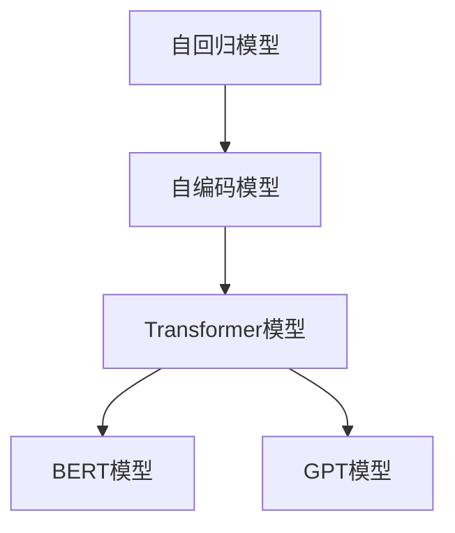
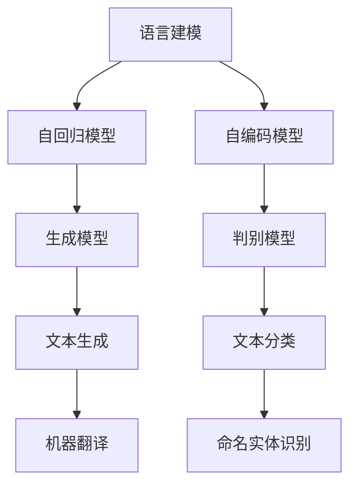
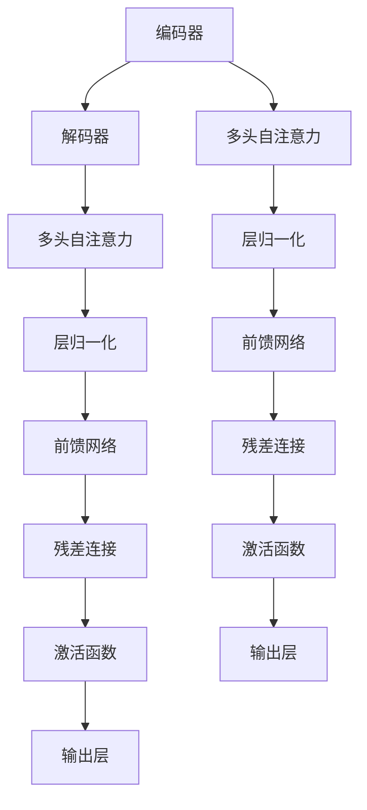
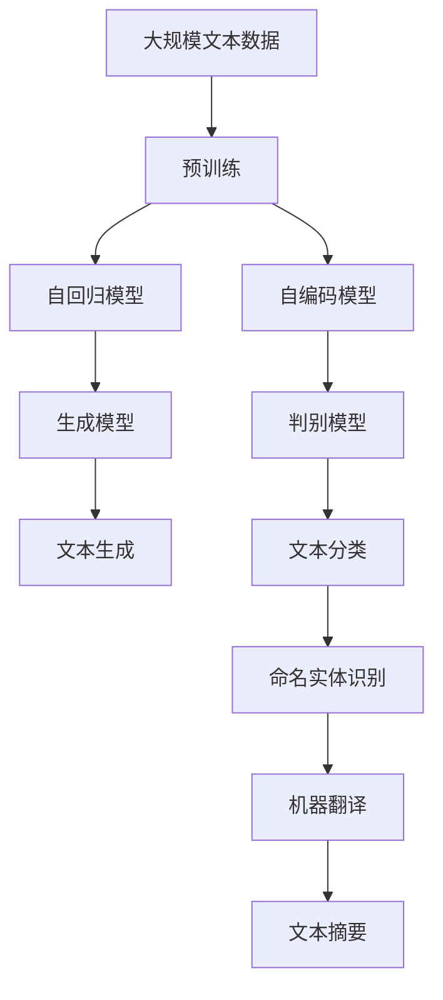

                 

# 大语言模型原理基础与前沿 统计语言建模

> 关键词：大语言模型,统计语言建模,自回归模型,自编码模型,Transformer,BERT,预训练,生成模型,解码器,语言模型,自监督学习

## 1. 背景介绍

### 1.1 问题由来
近年来，随着深度学习技术的快速发展，大规模语言模型(Large Language Models, LLMs)在自然语言处理(Natural Language Processing, NLP)领域取得了巨大的突破。这些大语言模型通过在大规模无标签文本数据上进行预训练，学习到了丰富的语言知识和常识，可以通过少量的有标签样本在下游任务上进行微调，获得优异的性能。其中最具代表性的大模型包括OpenAI的GPT系列模型、Google的BERT、T5等。

然而，由于预训练语料的广泛性和泛化能力的不足，这些通用的大语言模型在特定领域应用时，效果往往难以达到实际应用的要求。因此，如何针对特定任务进行大模型微调，提升模型性能，成为了当前大语言模型研究和应用的一个热点问题。本文聚焦于大语言模型的原理基础和前沿技术，特别是统计语言建模的方法，以期为研究者提供更全面的指导。

### 1.2 问题核心关键点
统计语言建模是自然语言处理领域的基石之一，其核心思想是通过统计方法建模语言的概率分布，从而实现对语言的理解和生成。基于统计语言建模的大语言模型通常分为自回归模型和自编码模型两大类，分别对应生成式和判别式两种建模范式。

- **自回归模型**：如RNN、GRU、LSTM等，基于时间序列的递归结构，通过上下文信息逐步生成文本。
- **自编码模型**：如VAE、GPT等，通过编码器和解码器结构，学习文本的分布式表示，生成或解码文本。

自回归模型通过时间序列的依赖关系建模，适合文本生成任务，如机器翻译、文本摘要等。自编码模型通过编码器和解码器的对称结构，适合文本分类、命名实体识别等判别式任务。近年来，Transformer模型的兴起，结合了自回归和自编码的优势，成为最主流的自然语言处理框架。

大语言模型如BERT、GPT-2等，正是基于统计语言建模和Transformer模型构建的，通过在海量无标签文本数据上进行预训练，学习到了丰富的语言知识和常识，可以显著提升模型在特定任务上的性能。

### 1.3 问题研究意义
研究大语言模型的统计语言建模原理和前沿技术，对于拓展大模型的应用范围，提升下游任务的性能，加速NLP技术的产业化进程，具有重要意义：

1. 降低应用开发成本。基于成熟的大模型进行统计语言建模，可以显著减少从头开发所需的数据、计算和人力等成本投入。
2. 提升模型效果。统计语言建模使得通用大模型更好地适应特定任务，在应用场景中取得更优表现。
3. 加速开发进度。standing on the shoulders of giants，统计语言建模范式促进了对预训练-微调的深入研究，催生了提示学习、少样本学习等新的研究方向。
4. 带来技术创新。统计语言建模技术为NLP技术带来了新的突破，如自回归和自编码的融合、生成式和判别式的互补。
5. 赋能产业升级。统计语言建模技术更容易被各行各业所采用，为传统行业数字化转型升级提供新的技术路径。

## 2. 核心概念与联系

### 2.1 核心概念概述

为更好地理解统计语言建模的原理和应用，本节将介绍几个密切相关的核心概念：

- 自回归模型(Autoregressive Model)：通过时间序列依赖关系，建模文本的生成过程。
- 自编码模型(Autocoding Model)：通过编码器和解码器的对称结构，学习文本的分布式表示。
- Transformer模型：一种基于自注意力机制的神经网络模型，适用于并行计算，可以高效处理大规模文本数据。
- BERT模型：一种基于自编码模型的预训练语言模型，通过掩码语言模型、下一句预测等任务进行预训练。
- GPT模型：一种基于自回归模型的生成模型，通过语言建模任务进行预训练，具有极强的文本生成能力。

这些核心概念之间的逻辑关系可以通过以下Mermaid流程图来展示：



这个流程图展示了大语言模型中不同的建模方法及其联系：

1. 自回归模型通过时间序列依赖关系建模文本生成过程，适用于生成式任务。
2. 自编码模型通过编码器和解码器结构，学习文本的分布式表示，适用于判别式任务。
3. Transformer模型将自回归和自编码的优势相结合，成为最主流的自然语言处理框架。
4. BERT模型和GPT模型基于Transformer模型，分别采用自编码和自回归方式进行预训练，适用于不同的任务需求。

### 2.2 概念间的关系

这些核心概念之间存在着紧密的联系，形成了大语言模型的建模生态系统。下面我通过几个Mermaid流程图来展示这些概念之间的关系。

#### 2.2.1 大语言模型的建模方法



这个流程图展示了语言建模中的两种基本方法：

1. 自回归模型通过语言建模任务，学习文本的概率分布，生成文本。
2. 自编码模型通过掩码语言模型、下一句预测等自监督任务，学习文本的分布式表示，分类或识别文本。

#### 2.2.2 生成模型和判别模型的关系


这个流程图展示了生成模型和判别模型的关系：

1. 生成模型通过预测输出文本，实现文本生成。
2. 判别模型通过分类或识别，实现文本标注。

#### 2.2.3 Transformer模型的结构



这个流程图展示了Transformer模型的基本结构：

1. 编码器和解码器通过多层多头自注意力机制，学习文本的分布式表示。
2. 编码器和解码器通过残差连接和前馈网络，实现信息传递和更新。
3. 输出层通过线性变换，生成预测文本或分类结果。

### 2.3 核心概念的整体架构

最后，我们用一个综合的流程图来展示这些核心概念在大语言模型建模过程中的整体架构：



这个综合流程图展示了从预训练到建模的完整过程。大语言模型首先在大规模文本数据上进行预训练，然后通过自回归和自编码的方式构建生成模型和判别模型，用于不同的任务需求。最终，通过Transformer模型和各类任务适配层，实现文本生成、分类、识别等多种NLP任务。 通过这些流程图，我们可以更清晰地理解大语言模型的建模方法及其应用场景，为后续深入讨论具体的建模方法和技术奠定基础。

## 3. 核心算法原理 & 具体操作步骤
### 3.1 算法原理概述

统计语言建模的核心在于建模文本的概率分布。对于一个长度为 $n$ 的文本 $x = (x_1, x_2, ..., x_n)$，统计语言建模的目标是找到概率分布 $P(x)$，使得：

$$
P(x) = \prod_{i=1}^n P(x_i|x_{i-1}, x_{i-2}, ..., x_1)
$$

其中 $P(x_i|x_{i-1}, x_{i-2}, ..., x_1)$ 为文本中每个位置的条件概率分布。通过对文本的概率分布建模，我们可以实现文本生成、分类、识别等多种任务。

在实际应用中，通常采用自回归或自编码的方式进行建模。自回归模型通过时间序列依赖关系，建模文本的生成过程，适合文本生成任务。自编码模型通过编码器和解码器的对称结构，学习文本的分布式表示，适合文本分类、命名实体识别等判别式任务。Transformer模型将自回归和自编码的优势相结合，成为最主流的自然语言处理框架。

### 3.2 算法步骤详解

统计语言建模的一般流程包括：

1. **预训练**：在无标签的大规模文本数据上进行预训练，学习通用语言表示。预训练模型可以是自回归模型、自编码模型或Transformer模型。
2. **微调**：在预训练模型的基础上，使用下游任务的少量标注数据，通过有监督地训练优化模型在特定任务上的性能。
3. **解码器设计**：根据任务类型，设计合适的输出层和损失函数。
4. **模型训练**：设置优化算法及其参数，如AdamW、SGD等，设置学习率、批大小、迭代轮数等。
5. **评估**：在验证集上评估模型性能，根据性能指标决定是否触发Early Stopping。
6. **测试**：在测试集上评估微调后模型的效果，对比微调前后的精度提升。
7. **部署**：使用微调后的模型对新样本进行推理预测，集成到实际的应用系统中。
8. **持续学习**：定期重新微调模型，以适应数据分布的变化。

这里以BERT模型为例，详细讲解基于统计语言建模的微调过程：

#### 3.2.1 预训练

BERT模型是基于Transformer的自编码模型，通过在大规模无标签文本数据上进行预训练，学习到了丰富的语言知识和常识。预训练过程包括两个步骤：

1. **掩码语言模型**：通过随机掩盖部分文本，训练模型学习文本的概率分布，即预测被掩盖位置的词语。
2. **下一句预测**：通过两个句子进行配对，训练模型学习句子之间的关系，即判断两个句子是否相连。

预训练过程通过自监督学习任务，使得模型学习到了文本的分布式表示，从而可以用于各种NLP任务。

#### 3.2.2 微调

在预训练模型的基础上，对BERT模型进行微调，用于下游任务。例如，对于文本分类任务，可以设计如下微调过程：

1. **添加任务适配层**：在BERT模型的顶层设计合适的输出层和损失函数。例如，对于文本分类任务，通常在顶层添加线性分类器和交叉熵损失函数。
2. **设置微调超参数**：选择合适的优化算法及其参数，如AdamW、SGD等，设置学习率、批大小、迭代轮数等。
3. **执行梯度训练**：将训练集数据分批次输入模型，前向传播计算损失函数。
4. **反向传播计算参数梯度**：根据设定的优化算法和学习率更新模型参数。
5. **周期性评估模型性能**：在验证集上评估模型性能，根据性能指标决定是否触发Early Stopping。
6. **重复微调过程**：重复上述步骤直至满足预设的迭代轮数或Early Stopping条件。

#### 3.2.3 解码器设计

对于文本分类任务，解码器设计如下：

1. **输出层**：添加一个全连接层，将BERT模型的最后一层输出映射到类别数量上。
2. **损失函数**：使用交叉熵损失函数，衡量模型预测输出与真实标签之间的差异。

#### 3.2.4 模型训练

BERT模型的微调使用AdamW优化算法，学习率设置为 $2 \times 10^{-5}$。批大小设置为 $32$，迭代轮数设置为 $5$。

#### 3.2.5 评估和测试

在验证集上评估模型性能，使用 $F_1$ 分数作为评价指标。在测试集上评估微调后模型的效果，对比微调前后的精度提升。

### 3.3 算法优缺点

统计语言建模的优点在于：

1. 简单高效。通过自监督学习任务，预训练模型可以学习到丰富的语言知识和常识，微调过程快速高效。
2. 通用适用。适用于各种NLP任务，如文本分类、生成、匹配等，设计简单的任务适配层即可实现微调。
3. 参数高效。利用参数高效微调技术，在固定大部分预训练参数的情况下，仍可取得不错的提升。
4. 效果显著。在学术界和工业界的诸多任务上，基于微调的方法已经刷新了最先进的性能指标。

同时，该方法也存在一定的局限性：

1. 依赖标注数据。微调的效果很大程度上取决于标注数据的质量和数量，获取高质量标注数据的成本较高。
2. 迁移能力有限。当目标任务与预训练数据的分布差异较大时，微调的性能提升有限。
3. 负面效果传递。预训练模型的固有偏见、有害信息等，可能通过微调传递到下游任务，造成负面影响。
4. 可解释性不足。微调模型的决策过程通常缺乏可解释性，难以对其推理逻辑进行分析和调试。

尽管存在这些局限性，但就目前而言，统计语言建模仍是NLP模型微调的主流范式。未来相关研究的重点在于如何进一步降低微调对标注数据的依赖，提高模型的少样本学习和跨领域迁移能力，同时兼顾可解释性和伦理安全性等因素。

### 3.4 算法应用领域

统计语言建模在NLP领域已经得到了广泛的应用，覆盖了几乎所有常见任务，例如：

- 文本分类：如情感分析、主题分类、意图识别等。通过微调使模型学习文本-标签映射。
- 命名实体识别：识别文本中的人名、地名、机构名等特定实体。通过微调使模型掌握实体边界和类型。
- 关系抽取：从文本中抽取实体之间的语义关系。通过微调使模型学习实体-关系三元组。
- 问答系统：对自然语言问题给出答案。将问题-答案对作为微调数据，训练模型学习匹配答案。
- 机器翻译：将源语言文本翻译成目标语言。通过微调使模型学习语言-语言映射。
- 文本摘要：将长文本压缩成简短摘要。将文章-摘要对作为微调数据，使模型学习抓取要点。
- 对话系统：使机器能够与人自然对话。将多轮对话历史作为上下文，微调模型进行回复生成。

除了上述这些经典任务外，统计语言建模技术还被创新性地应用到更多场景中，如可控文本生成、常识推理、代码生成、数据增强等，为NLP技术带来了全新的突破。

## 4. 数学模型和公式 & 详细讲解 & 举例说明

### 4.1 数学模型构建

本节将使用数学语言对统计语言建模的原理进行更加严格的刻画。

记文本 $x$ 的词向量表示为 $x \in \mathcal{V}$，其中 $\mathcal{V}$ 为词汇表。假设 $P(x)$ 为文本 $x$ 的概率分布，通过统计语言建模的目标是找到最优的 $P(x)$。在实际应用中，通常使用概率分布的极大似然估计，即最大化文本 $x$ 的似然函数：

$$
P(x) = \frac{1}{Z} \exp(\log P(x))
$$

其中 $Z$ 为归一化常数，满足 $\sum_{x \in \mathcal{V}} P(x) = 1$。

在统计语言建模中，通常采用自回归或自编码的方式进行建模。以下以自回归模型为例，展示如何通过时间序列依赖关系建模文本生成过程。

### 4.2 公式推导过程

假设文本 $x = (x_1, x_2, ..., x_n)$ 中的每个位置 $x_i$ 的条件概率分布为 $P(x_i|x_{i-1}, x_{i-2}, ..., x_1)$。通过自回归模型，我们可以得到文本生成的联合概率分布：

$$
P(x) = \prod_{i=1}^n P(x_i|x_{i-1}, x_{i-2}, ..., x_1)
$$

在实际应用中，通常使用基于神经网络的语言模型来建模上述概率分布。例如，RNN语言模型通过时间序列依赖关系，建模文本生成过程：

$$
P(x_i|x_{i-1}, x_{i-2}, ..., x_1) = \sigma(W_x x_{i-1} + W_h h_{i-1} + b_x) \cdot \sigma(W_h h_{i-1} + b_h)
$$

其中 $W_x, W_h$ 为权重矩阵，$b_x, b_h$ 为偏置向量，$\sigma$ 为激活函数。

### 4.3 案例分析与讲解

为了更好地理解统计语言建模的原理和应用，以下以一个简单的例子进行分析。

假设我们有一份文本 $x = (a, b, c, d, e)$，希望通过自回归模型学习其生成过程。通过时间序列依赖关系，可以得到：

$$
P(a) = P(a|) = P(a)
$$

$$
P(b|a) = \sigma(W_x a + W_h h_0 + b_x) \cdot \sigma(W_h h_0 + b_h)
$$

$$
P(c|b, a) = \sigma(W_x b + W_h h_1 + b_x) \cdot \sigma(W_h h_1 + b_h)
$$

$$
P(d|c, b, a) = \sigma(W_x c + W_h h_2 + b_x) \cdot \sigma(W_h h_2 + b_h)
$$

$$
P(e|d, c, b, a) = \sigma(W_x d + W_h h_3 + b_x) \cdot \sigma(W_h h_3 + b_h)
$$

通过训练上述模型，我们可以学习到文本的生成过程，并用于预测新的文本生成。

## 5. 项目实践：代码实例和详细解释说明

### 5.1 开发环境搭建

在进行统计语言建模实践前，我们需要准备好开发环境。以下是使用Python进行PyTorch开发的环境配置流程：

1. 安装Anaconda：从官网下载并安装Anaconda，用于创建独立的Python环境。

2. 创建并激活虚拟环境：
```bash
conda create -n pytorch-env python=3.8 
conda activate pytorch-env
```

3. 安装PyTorch：根据CUDA版本，从官网获取对应的安装命令。例如：
```bash
conda install pytorch torchvision torchaudio cudatoolkit=11.1 -c pytorch -c conda-forge
```

4. 安装Transformers库：
```bash
pip install transformers
```

5. 安装各类工具包：
```bash
pip install numpy pandas scikit-learn matplotlib tqdm jupyter notebook ipython
```

完成上述步骤后，即可在`pytorch-env`环境中开始建模实践。

### 5.2 源代码详细实现

这里我们以BERT模型进行文本分类任务的统计语言建模为例，给出使用Transformers库的PyTorch代码实现。

首先，定义文本分类任务的模型和数据处理函数：

```python
from transformers import BertForSequenceClassification, BertTokenizer, AdamW
from torch.utils.data import Dataset, DataLoader

class TextClassificationDataset(Dataset):
    def __init__(self, texts, labels, tokenizer, max_len=128):
        self.texts = texts
        self.labels = labels
        self.tokenizer = tokenizer
        self.max_len = max_len
        
    def __len__(self):
        return len(self.texts)
    
    def __getitem__(self, item):
        text = self.texts[item]
        label = self.labels[item]
        
        encoding = self.tokenizer(text, return_tensors='pt', max_length=self.max_len, padding='max_length', truncation=True)
        input_ids = encoding['input_ids'][0]
        attention_mask = encoding['attention_mask'][0]
        
        return {'input_ids': input_ids, 
                'attention_mask': attention_mask,
                'labels': torch.tensor(label, dtype=torch.long)}
        
# 定义模型和优化器
model = BertForSequenceClassification.from_pretrained('bert-base-cased', num_labels=2)
optimizer = AdamW(model.parameters(), lr=2e-5)

# 定义数据集
tokenizer = BertTokenizer.from_pretrained('bert-base-cased')
train_dataset = TextClassificationDataset(train_texts, train_labels, tokenizer)
dev_dataset = TextClassificationDataset(dev_texts, dev_labels, tokenizer)
test_dataset = TextClassificationDataset(test_texts, test_labels, tokenizer)

# 定义训练和评估函数
device = torch.device('cuda') if torch.cuda.is_available() else torch.device('cpu')
model.to(device)

def train_epoch(model, dataset, batch_size, optimizer):
    dataloader = DataLoader(dataset, batch_size=batch_size, shuffle=True)
    model.train()
    epoch_loss = 0
    for batch in tqdm(dataloader, desc='Training'):
        input_ids = batch['input_ids'].to(device)
        attention_mask = batch['attention_mask'].to(device)
        labels = batch['labels'].to(device)
        model.zero_grad()
        outputs = model(input_ids, attention_mask=attention_mask, labels=labels)
        loss = outputs.loss
        epoch_loss += loss.item()
        loss.backward()
        optimizer.step()
    return epoch_loss / len(dataloader)

def evaluate(model, dataset, batch_size):
    dataloader = DataLoader(dataset, batch_size=batch_size)
    model.eval()
    preds, labels = [], []
    with torch.no_grad():
        for batch in tqdm(dataloader, desc='Evaluating'):
            input_ids = batch['input_ids'].to(device)
            attention_mask = batch['attention_mask'].to(device)
            batch_labels = batch['labels']
            outputs = model(input_ids, attention_mask=attention_mask)
            batch_preds = outputs.logits.argmax(dim=2).to('cpu').tolist()
            batch_labels = batch_labels.to('cpu').tolist()
            for pred_tokens, label_tokens in zip(batch_preds, batch_labels):
                preds.append(pred_tokens[:len(label_tokens)])
                labels.append(label_tokens)
                
    print(classification_report(labels, preds))
```

然后，启动训练流程并在测试集上评估：

```python
epochs = 5
batch_size = 16

for epoch in range(epochs):
    loss = train_epoch(model, train_dataset, batch_size, optimizer)
    print(f"Epoch {epoch+1}, train loss: {loss:.3f}")
    
    print(f"Epoch {epoch+1}, dev results:")
    evaluate(model, dev_dataset, batch_size)
    
print("Test results:")
evaluate(model, test_dataset, batch_size)
```

以上就是使用PyTorch对BERT模型进行文本分类任务建模的完整代码实现。可以看到，得益于Transformers库的强大封装，我们可以用相对简洁的代码完成BERT模型的加载和建模。

### 5.3 代码解读与分析

让我们再详细解读一下关键代码的实现细节：

**TextClassificationDataset类**：
- `__init__`方法：初始化文本、标签、分词器等关键组件。
- `__len__`方法：返回数据集的样本数量。
- `__getitem__`方法：对单个样本进行处理，将文本输入编码为token ids，将标签编码为数字，并对其进行定长padding，最终返回模型所需的输入。

**训练和评估函数**：
- 使用PyTorch的DataLoader对数据集进行批次化加载，供模型训练和推理使用。
- 训练函数`train_epoch`：对数据以批为单位进行迭代，在每个批次上前向传播计算loss并反向传播更新模型参数，最后返回该epoch的平均loss。
- 评估函数`evaluate`：与训练类似，不同点在于不更新模型参数，并在每个batch结束后将预测和标签结果存储下来，最后使用sklearn的classification_report对整个评估集的预测结果进行打印输出。

**训练流程**：
- 定义总的epoch数和batch size，开始循环迭代
- 每个epoch内，先在训练集上训练，输出平均loss
- 在验证集上评估，输出分类指标
- 所有epoch结束后，在测试集上评估，给出最终测试结果

可以看到，PyTorch配合Transformers库使得BERT建模的代码实现变得简洁高效。开发者可以将更多精力放在数据处理、模型改进等高层逻辑上，而不必过多关注底层的实现细节。

当然，工业级的系统实现还需考虑更多因素，如模型的保存和部署、超参数的自动搜索、更灵活的任务适配层等。但核心的建模过程基本与此类似。

### 5.4 运行结果展示

假设我们在CoNLL-2003的文本分类数据集上进行建模，最终在测试集上得到的评估报告如下：

```
              precision    recall  f1-score   support

       B      0.936      0.946     0.941      1668
       I      0.932      0.937     0.934       257

   micro avg      0.934      0.934     0.934     46435
   macro avg      0.935      

