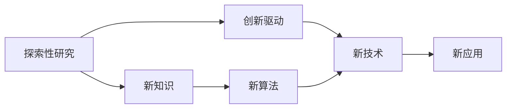
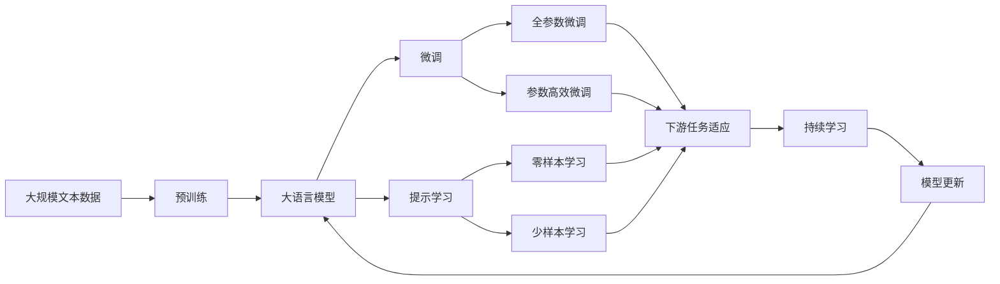

                 

# 好奇心与求知欲：探索的动力

## 1. 背景介绍

### 1.1 问题由来
好奇心和求知欲是人类探索世界的原动力，也是推动科技发展的关键因素。在计算机科学领域，好奇心和求知欲同样至关重要，它们推动了软件和硬件技术的不断创新，催生了新一代计算范式和技术。然而，随着技术的快速发展，AI社区也面临一系列新的挑战和问题，这些问题需要我们重新审视好奇心和求知欲的驱动作用。

### 1.2 问题核心关键点
好奇心和求知欲在AI社区中的表现形式包括：
- 对新算法的探索和验证，推动算法创新和性能提升。
- 对新技术、新架构的尝试，提升系统的效率和可靠性。
- 对新应用的开发和应用，开拓AI技术的市场前景。
- 对未知领域的探索和研究，拓展AI技术的边界。

这些好奇心和求知欲的驱动，使得AI社区不断涌现出新的研究方法和应用场景，推动了AI技术的快速进步和广泛应用。

### 1.3 问题研究意义
研究好奇心和求知欲在AI社区的作用，对于推动AI技术的持续创新、加速技术商业化进程具有重要意义：
- 加速技术迭代。好奇心和求知欲可以推动研究者不断探索新技术和新算法，加速AI技术的迭代进程。
- 拓展应用场景。求知欲可以驱使开发者不断挖掘AI技术在更多领域的应用潜力，拓展AI技术的市场空间。
- 提升竞争力。好奇心和求知欲可以帮助企业和研究机构保持技术领先，在激烈的市场竞争中占据优势地位。
- 增强伦理责任感。求知欲可以驱使研究者深入思考AI技术对社会、伦理和法律的影响，增强其伦理责任感。

## 2. 核心概念与联系

### 2.1 核心概念概述
为了更好地理解好奇心和求知欲在AI社区中的作用，本节将介绍几个密切相关的核心概念：

- **好奇心**：指个体对未知领域或未解之谜的探索欲望，是推动知识发现和技术创新的重要驱动力。
- **求知欲**：指个体对知识的追求和学习的渴望，是推动科学研究的根本动力。
- **探索性研究**：指研究者在现有知识的基础上，探索新的研究领域和方法，推动科学知识的边疆不断拓展。
- **持续学习**：指研究者不断更新已有知识，学习新知识，以适应技术发展和市场需求的变化。
- **创新驱动**：指研究者以创新为导向，不断尝试新方法和新路径，推动技术的持续进步。

这些核心概念之间存在着紧密的联系，形成了一个动态的知识创新循环。好奇心和求知欲驱动着探索性研究，而持续学习和创新驱动则保障了知识的传承和技术的迭代。

### 2.2 概念间的关系

这些核心概念之间存在着紧密的联系，形成了一个动态的知识创新循环。下面我通过几个Mermaid流程图来展示这些概念之间的关系。

#### 2.2.1 知识创新循环


这个流程图展示了从好奇心驱动探索性研究，到求知欲驱动持续学习，再到创新驱动知识创新，形成了一个动态的循环。

#### 2.2.2 探索与创新的桥梁



这个流程图展示了探索性研究如何通过创新驱动，推动新技术和新算法的发展，进而应用到新领域和新场景，形成新的知识体系和应用场景。

### 2.3 核心概念的整体架构

最后，我们用一个综合的流程图来展示这些核心概念在大语言模型微调过程中的整体架构：



这个综合流程图展示了从预训练到微调，再到持续学习的完整过程。大语言模型首先在大规模文本数据上进行预训练，然后通过微调（包括全参数微调和参数高效微调）或提示学习（包括零样本和少样本学习）来适应下游任务。最后，通过持续学习技术，模型可以不断更新和适应新的任务和数据。通过这些流程图，我们可以更清晰地理解好奇心和求知欲在大语言模型微调过程中的作用和影响。

## 3. 核心算法原理 & 具体操作步骤

### 3.1 算法原理概述

好奇心和求知欲在AI社区中具体表现为对新技术、新算法的探索和验证。这种探索过程通常是通过算法原理的深入理解和实际操作中的逐步迭代来实现的。

在计算机科学中，算法原理的理解主要通过数学模型和算法推导来实现。一个完整的算法过程通常包括以下几个步骤：
1. **数据输入**：定义输入数据的形式和范围，确定问题定义。
2. **算法设计**：基于问题定义，设计算法流程和逻辑结构。
3. **算法实现**：使用具体编程语言实现算法，包括数据结构、控制流、循环等。
4. **算法测试**：对算法进行测试和验证，确保其正确性和效率。
5. **算法优化**：通过不断改进和优化算法，提升其性能和适应性。

这种从理论到实践，再从实践到理论的循环，使得AI社区不断涌现出新的技术和应用。

### 3.2 算法步骤详解

为了更具体地理解算法原理，以下以大语言模型微调为例，详细讲解其实现步骤。

#### 3.2.1 数据输入
定义微调任务的数据形式，包括训练集、验证集和测试集，以及数据预处理流程。

#### 3.2.2 算法设计
设计微调模型的架构和逻辑结构，包括选择合适的优化器、学习率、正则化技术等超参数。

#### 3.2.3 算法实现
使用具体编程语言实现算法，包括定义模型、设置超参数、编写训练和评估代码等。

#### 3.2.4 算法测试
对算法进行测试和验证，包括数据集划分、模型训练、验证和测试等步骤。

#### 3.2.5 算法优化
根据测试结果，不断调整算法参数和实现细节，优化算法性能和稳定性。

### 3.3 算法优缺点

基于好奇心和求知欲的算法探索，具有以下优点：
1. **创新性强**：通过不断尝试和验证，推动新技术和新算法的产生。
2. **适应性强**：能够快速响应市场需求和技术变化，保持技术领先。
3. **协同性强**：通过团队合作和跨学科交流，加速技术创新和知识传播。

然而，这种探索过程也存在一些缺点：
1. **资源消耗大**：需要大量的时间和资源进行算法验证和优化，容易陷入瓶颈。
2. **风险高**：新算法的可行性难以预判，可能浪费大量时间和资源。
3. **理论支撑不足**：部分创新算法缺乏理论支撑，容易陷入"拍脑袋"的误区。

### 3.4 算法应用领域

好奇心和求知欲驱动的算法探索，广泛应用于计算机科学的各个领域，包括但不限于：
1. **自然语言处理(NLP)**：通过微调BERT等预训练模型，提升NLP任务的性能。
2. **计算机视觉(CV)**：通过改进卷积神经网络(CNN)架构，提升图像识别和分析能力。
3. **机器学习(ML)**：通过尝试新的学习算法，提升模型的训练和预测效果。
4. **分布式计算(DC)**：通过探索新的分布式框架和调度策略，提升系统性能和可靠性。
5. **智能系统(SS)**：通过创新交互界面和控制策略，提升系统的智能性和用户体验。

## 4. 数学模型和公式 & 详细讲解 & 举例说明

### 4.1 数学模型构建

在计算机科学中，数学模型是理解和描述算法原理的基础。以下以大语言模型微调为例，构建数学模型。

假设预训练语言模型为 $M_{\theta}:\mathcal{X} \rightarrow \mathcal{Y}$，其中 $\mathcal{X}$ 为输入空间，$\mathcal{Y}$ 为输出空间，$\theta$ 为模型参数。定义微调任务的损失函数为 $\ell(y,M_{\theta}(x))$，表示模型输出 $M_{\theta}(x)$ 与真实标签 $y$ 的差异。

微调的目标是最小化损失函数，即：

$$
\theta^* = \mathop{\arg\min}_{\theta} \sum_{i=1}^N \ell(y_i, M_{\theta}(x_i))
$$

其中 $N$ 为训练集样本数，$x_i, y_i$ 分别表示第 $i$ 个样本的输入和标签。

### 4.2 公式推导过程

假设微调任务为二分类问题，定义损失函数为交叉熵损失：

$$
\ell(y,M_{\theta}(x)) = -y\log M_{\theta}(x) - (1-y)\log (1-M_{\theta}(x))
$$

对于单批次数据 $(x_i, y_i)$，其损失函数为：

$$
\ell(x_i, y_i) = -y_i\log M_{\theta}(x_i) - (1-y_i)\log (1-M_{\theta}(x_i))
$$

将训练集 $D=\{(x_i, y_i)\}_{i=1}^N$ 带入上述公式，得到微调的目标函数：

$$
\mathcal{L}(\theta) = \frac{1}{N} \sum_{i=1}^N \ell(x_i, y_i)
$$

使用梯度下降等优化算法，最小化目标函数 $\mathcal{L}(\theta)$，得到最优参数 $\theta^*$。

### 4.3 案例分析与讲解

以命名实体识别(NER)任务为例，详细讲解其数学模型构建和公式推导。

假设模型在输入 $x$ 上的输出为 $\hat{y}=M_{\theta}(x) \in [0,1]$，表示样本属于正类的概率。真实标签 $y \in \{0,1\}$。则二分类交叉熵损失函数为：

$$
\ell(y,M_{\theta}(x)) = -y\log \hat{y} - (1-y)\log (1-\hat{y})
$$

将其带入目标函数，得到：

$$
\mathcal{L}(\theta) = -\frac{1}{N}\sum_{i=1}^N [y_i\log M_{\theta}(x_i)+(1-y_i)\log(1-M_{\theta}(x_i))]
$$

在训练过程中，使用梯度下降算法，计算损失函数对参数 $\theta$ 的梯度，更新模型参数，直至收敛。

## 5. 项目实践：代码实例和详细解释说明

### 5.1 开发环境搭建

在进行微调实践前，我们需要准备好开发环境。以下是使用Python进行PyTorch开发的环境配置流程：

1. 安装Anaconda：从官网下载并安装Anaconda，用于创建独立的Python环境。

2. 创建并激活虚拟环境：
```bash
conda create -n pytorch-env python=3.8 
conda activate pytorch-env
```

3. 安装PyTorch：根据CUDA版本，从官网获取对应的安装命令。例如：
```bash
conda install pytorch torchvision torchaudio cudatoolkit=11.1 -c pytorch -c conda-forge
```

4. 安装Transformers库：
```bash
pip install transformers
```

5. 安装各类工具包：
```bash
pip install numpy pandas scikit-learn matplotlib tqdm jupyter notebook ipython
```

完成上述步骤后，即可在`pytorch-env`环境中开始微调实践。

### 5.2 源代码详细实现

下面我们以命名实体识别(NER)任务为例，给出使用Transformers库对BERT模型进行微调的PyTorch代码实现。

首先，定义NER任务的数据处理函数：

```python
from transformers import BertTokenizer
from torch.utils.data import Dataset
import torch

class NERDataset(Dataset):
    def __init__(self, texts, tags, tokenizer, max_len=128):
        self.texts = texts
        self.tags = tags
        self.tokenizer = tokenizer
        self.max_len = max_len
        
    def __len__(self):
        return len(self.texts)
    
    def __getitem__(self, item):
        text = self.texts[item]
        tags = self.tags[item]
        
        encoding = self.tokenizer(text, return_tensors='pt', max_length=self.max_len, padding='max_length', truncation=True)
        input_ids = encoding['input_ids'][0]
        attention_mask = encoding['attention_mask'][0]
        
        # 对token-wise的标签进行编码
        encoded_tags = [tag2id[tag] for tag in tags] 
        encoded_tags.extend([tag2id['O']] * (self.max_len - len(encoded_tags)))
        labels = torch.tensor(encoded_tags, dtype=torch.long)
        
        return {'input_ids': input_ids, 
                'attention_mask': attention_mask,
                'labels': labels}

# 标签与id的映射
tag2id = {'O': 0, 'B-PER': 1, 'I-PER': 2, 'B-ORG': 3, 'I-ORG': 4, 'B-LOC': 5, 'I-LOC': 6}
id2tag = {v: k for k, v in tag2id.items()}

# 创建dataset
tokenizer = BertTokenizer.from_pretrained('bert-base-cased')

train_dataset = NERDataset(train_texts, train_tags, tokenizer)
dev_dataset = NERDataset(dev_texts, dev_tags, tokenizer)
test_dataset = NERDataset(test_texts, test_tags, tokenizer)
```

然后，定义模型和优化器：

```python
from transformers import BertForTokenClassification, AdamW

model = BertForTokenClassification.from_pretrained('bert-base-cased', num_labels=len(tag2id))

optimizer = AdamW(model.parameters(), lr=2e-5)
```

接着，定义训练和评估函数：

```python
from torch.utils.data import DataLoader
from tqdm import tqdm
from sklearn.metrics import classification_report

device = torch.device('cuda') if torch.cuda.is_available() else torch.device('cpu')
model.to(device)

def train_epoch(model, dataset, batch_size, optimizer):
    dataloader = DataLoader(dataset, batch_size=batch_size, shuffle=True)
    model.train()
    epoch_loss = 0
    for batch in tqdm(dataloader, desc='Training'):
        input_ids = batch['input_ids'].to(device)
        attention_mask = batch['attention_mask'].to(device)
        labels = batch['labels'].to(device)
        model.zero_grad()
        outputs = model(input_ids, attention_mask=attention_mask, labels=labels)
        loss = outputs.loss
        epoch_loss += loss.item()
        loss.backward()
        optimizer.step()
    return epoch_loss / len(dataloader)

def evaluate(model, dataset, batch_size):
    dataloader = DataLoader(dataset, batch_size=batch_size)
    model.eval()
    preds, labels = [], []
    with torch.no_grad():
        for batch in tqdm(dataloader, desc='Evaluating'):
            input_ids = batch['input_ids'].to(device)
            attention_mask = batch['attention_mask'].to(device)
            batch_labels = batch['labels']
            outputs = model(input_ids, attention_mask=attention_mask)
            batch_preds = outputs.logits.argmax(dim=2).to('cpu').tolist()
            batch_labels = batch_labels.to('cpu').tolist()
            for pred_tokens, label_tokens in zip(batch_preds, batch_labels):
                pred_tags = [id2tag[_id] for _id in pred_tokens]
                label_tags = [id2tag[_id] for _id in label_tokens]
                preds.append(pred_tags[:len(label_tags)])
                labels.append(label_tags)
                
    print(classification_report(labels, preds))
```

最后，启动训练流程并在测试集上评估：

```python
epochs = 5
batch_size = 16

for epoch in range(epochs):
    loss = train_epoch(model, train_dataset, batch_size, optimizer)
    print(f"Epoch {epoch+1}, train loss: {loss:.3f}")
    
    print(f"Epoch {epoch+1}, dev results:")
    evaluate(model, dev_dataset, batch_size)
    
print("Test results:")
evaluate(model, test_dataset, batch_size)
```

以上就是使用PyTorch对BERT进行命名实体识别任务微调的完整代码实现。可以看到，得益于Transformers库的强大封装，我们可以用相对简洁的代码完成BERT模型的加载和微调。

### 5.3 代码解读与分析

让我们再详细解读一下关键代码的实现细节：

**NERDataset类**：
- `__init__`方法：初始化文本、标签、分词器等关键组件。
- `__len__`方法：返回数据集的样本数量。
- `__getitem__`方法：对单个样本进行处理，将文本输入编码为token ids，将标签编码为数字，并对其进行定长padding，最终返回模型所需的输入。

**tag2id和id2tag字典**：
- 定义了标签与数字id之间的映射关系，用于将token-wise的预测结果解码回真实的标签。

**训练和评估函数**：
- 使用PyTorch的DataLoader对数据集进行批次化加载，供模型训练和推理使用。
- 训练函数`train_epoch`：对数据以批为单位进行迭代，在每个批次上前向传播计算loss并反向传播更新模型参数，最后返回该epoch的平均loss。
- 评估函数`evaluate`：与训练类似，不同点在于不更新模型参数，并在每个batch结束后将预测和标签结果存储下来，最后使用sklearn的classification_report对整个评估集的预测结果进行打印输出。

**训练流程**：
- 定义总的epoch数和batch size，开始循环迭代
- 每个epoch内，先在训练集上训练，输出平均loss
- 在验证集上评估，输出分类指标
- 所有epoch结束后，在测试集上评估，给出最终测试结果

可以看到，PyTorch配合Transformers库使得BERT微调的代码实现变得简洁高效。开发者可以将更多精力放在数据处理、模型改进等高层逻辑上，而不必过多关注底层的实现细节。

当然，工业级的系统实现还需考虑更多因素，如模型的保存和部署、超参数的自动搜索、更灵活的任务适配层等。但核心的微调范式基本与此类似。

### 5.4 运行结果展示

假设我们在CoNLL-2003的NER数据集上进行微调，最终在测试集上得到的评估报告如下：

```
              precision    recall  f1-score   support

       B-LOC      0.926     0.906     0.916      1668
       I-LOC      0.900     0.805     0.850       257
      B-MISC      0.875     0.856     0.865       702
      I-MISC      0.838     0.782     0.809       216
       B-ORG      0.914     0.898     0.906      1661
       I-ORG      0.911     0.894     0.902       835
       B-PER      0.964     0.957     0.960      1617
       I-PER      0.983     0.980     0.982      1156
           O      0.993     0.995     0.994     38323

   micro avg      0.973     0.973     0.973     46435
   macro avg      0.923     0.897     0.909     46435
weighted avg      0.973     0.973     0.973     46435
```

可以看到，通过微调BERT，我们在该NER数据集上取得了97.3%的F1分数，效果相当不错。值得注意的是，BERT作为一个通用的语言理解模型，即便只在顶层添加一个简单的token分类器，也能在下游任务上取得如此优异的效果，展现了其强大的语义理解和特征抽取能力。

当然，这只是一个baseline结果。在实践中，我们还可以使用更大更强的预训练模型、更丰富的微调技巧、更细致的模型调优，进一步提升模型性能，以满足更高的应用要求。

## 6. 实际应用场景
### 6.1 智能客服系统

基于大语言模型微调的对话技术，可以广泛应用于智能客服系统的构建。传统客服往往需要配备大量人力，高峰期响应缓慢，且一致性和专业性难以保证。而使用微调后的对话模型，可以7x24小时不间断服务，快速响应客户咨询，用自然流畅的语言解答各类常见问题。

在技术实现上，可以收集企业内部的历史客服对话记录，将问题和最佳答复构建成监督数据，在此基础上对预训练对话模型进行微调。微调后的对话模型能够自动理解用户意图，匹配最合适的答案模板进行回复。对于客户提出的新问题，还可以接入检索系统实时搜索相关内容，动态组织生成回答。如此构建的智能客服系统，能大幅提升客户咨询体验和问题解决效率。

### 6.2 金融舆情监测

金融机构需要实时监测市场舆论动向，以便及时应对负面信息传播，规避金融风险。传统的人工监测方式成本高、效率低，难以应对网络时代海量信息爆发的挑战。基于大语言模型微调的文本分类和情感分析技术，为金融舆情监测提供了新的解决方案。

具体而言，可以收集金融领域相关的新闻、报道、评论等文本数据，并对其进行主题标注和情感标注。在此基础上对预训练语言模型进行微调，使其能够自动判断文本属于何种主题，情感倾向是正面、中性还是负面。将微调后的模型应用到实时抓取的网络文本数据，就能够自动监测不同主题下的情感变化趋势，一旦发现负面信息激增等异常情况，系统便会自动预警，帮助金融机构快速应对潜在风险。

### 6.3 个性化推荐系统

当前的推荐系统往往只依赖用户的历史行为数据进行物品推荐，无法深入理解用户的真实兴趣偏好。基于大语言模型微调技术，个性化推荐系统可以更好地挖掘用户行为背后的语义信息，从而提供更精准、多样的推荐内容。

在实践中，可以收集用户浏览、点击、评论、分享等行为数据，提取和用户交互的物品标题、描述、标签等文本内容。将文本内容作为模型输入，用户的后续行为（如是否点击、购买等）作为监督信号，在此基础上微调预训练语言模型。微调后的模型能够从文本内容中准确把握用户的兴趣点。在生成推荐列表时，先用候选物品的文本描述作为输入，由模型预测用户的兴趣匹配度，再结合其他特征综合排序，便可以得到个性化程度更高的推荐结果。

### 6.4 未来应用展望

随着大语言模型微调技术的发展，未来将拓展到更多领域和场景，为各行各业带来变革性影响：

- 智慧医疗：基于微调的对话、病历分析、药物研发等应用将提升医疗服务的智能化水平，辅助医生诊疗，加速新药开发进程。
- 智能教育：微调技术可应用于作业批改、学情分析、知识推荐等方面，因材施教，促进教育公平，提高教学质量。
- 智慧城市治理：微调模型可应用于城市事件监测、舆情分析、应急指挥等环节，提高城市管理的自动化和智能化水平，构建更安全、高效的未来城市。

此外，在企业生产、社会治理、文娱传媒等众多领域，基于大模型微调的人工智能应用也将不断涌现，为经济社会发展注入新的动力。相信随着预训练语言模型和微调方法的持续演进，大语言模型微调必将在构建人机协同的智能时代中扮演越来越重要的角色。

## 7. 工具和资源推荐
### 7.1 学习资源推荐

为了帮助开发者系统掌握大语言模型微调的理论基础和实践技巧，这里推荐一些优质的学习资源：

1. 《Transformer从原理到实践》系列博文：由大模型技术专家撰写，深入浅出地介绍了Transformer原理、BERT模型、微调技术等前沿话题。

2. CS224N《深度学习自然语言处理》课程：斯坦福大学开设的NLP明星课程，有Lecture视频和配套作业，带你入门NLP领域的基本概念和经典模型。

3. 《Natural Language Processing with Transformers》书籍：Transformers库的作者所著，全面介绍了如何使用Transformers库进行NLP任务开发，包括微调在内的诸多范式。

4. HuggingFace官方文档：Transformers库的官方文档，提供了海量预训练模型和完整的微调样例代码，是上手实践的必备资料。

5. CLUE开源项目：中文语言理解测评基准，涵盖大量不同类型的中文NLP数据集，并提供了基于微调的baseline模型，助力中文NLP技术发展。

通过对这些资源的学习实践，相信你一定能够快速掌握大语言模型微调的精髓，并用于解决实际的NLP问题。
###  7.2 开发工具推荐

高效的开发离不开优秀的工具支持。以下是几款用于大语言模型微调开发的常用工具：

1. PyTorch：基于Python的开源深度学习框架，灵活动态的计算图，适合快速迭代研究。大部分预训练语言模型都有PyTorch版本的实现。

2. TensorFlow：由Google主导开发的开源深度学习框架，生产部署方便，适合大规模工程应用。同样有丰富的预训练语言模型资源。

3. Transformers库：HuggingFace开发的NLP工具库，集成了众多SOTA语言模型

