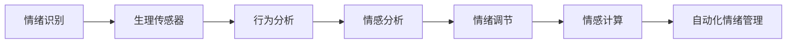
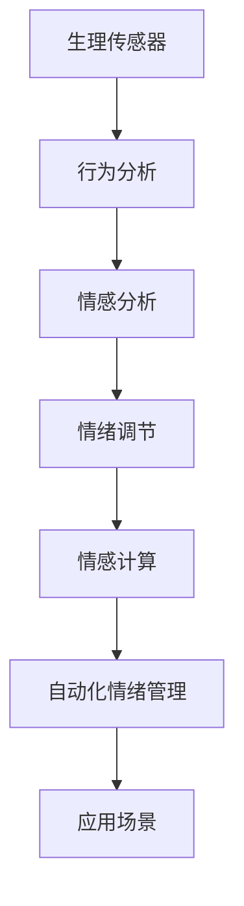
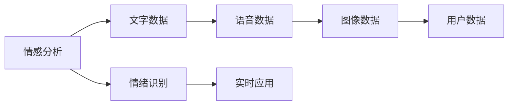
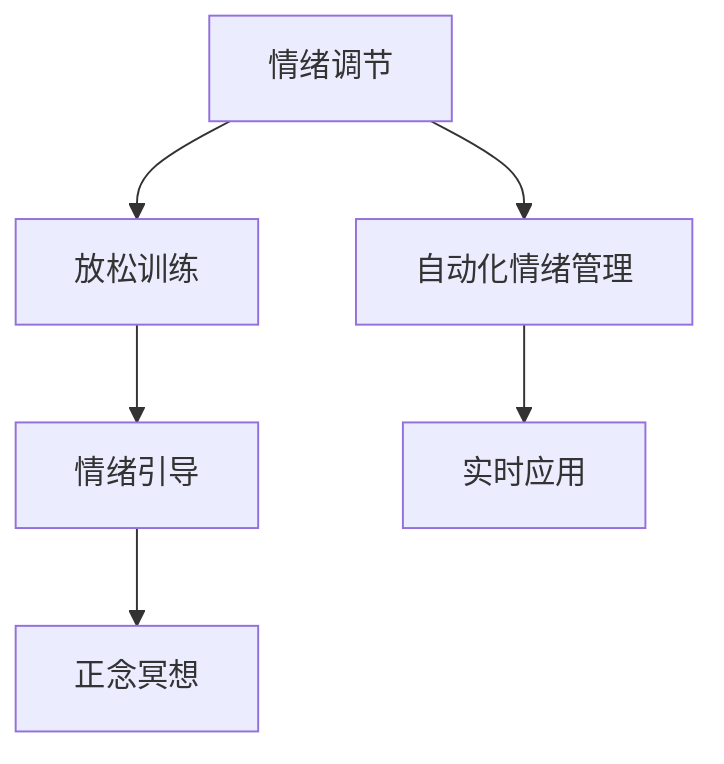

                 

# 如何进行情绪管理：如何控制自己的情绪和行为？

> 关键词：情绪管理, 情绪识别, 情绪调节, 情绪智能, 自动化情绪管理, 情感计算, 人工智能, 心理学

## 1. 背景介绍

### 1.1 问题由来
情绪管理是人类生活中的一项重要技能。它能帮助我们更好地应对压力、提升幸福感、改善人际关系等。然而，随着现代生活的节奏加快和社会竞争的加剧，越来越多的人面临情绪失控、焦虑、抑郁等心理问题。传统情绪管理方法如心理咨询、药物治疗等存在诸多限制，如成本高、效率低、隐私保护难等问题。

与此同时，随着人工智能技术的不断发展，情绪管理的研究和应用也逐渐兴起。特别是在情感计算和自动化情绪管理领域，越来越多的创新技术开始涌现。情绪识别、情感分析、情感生成等人工智能技术，为情绪管理提供了新的解决方案。

### 1.2 问题核心关键点
情绪管理的关键在于识别和调节情绪。人工智能技术可以帮助我们从大量的生理数据、行为数据和环境数据中，精准识别用户的情绪状态，并通过自动化手段调节情绪，提升用户的心理健康水平。

- 情绪识别：通过分析用户的生理信号（如心率、皮肤电反应等）、行为特征（如面部表情、语调等）、环境因素（如温度、光线等），识别用户的情绪状态。
- 情绪调节：利用机器学习、深度学习等技术，对用户的情绪进行建模，生成相应的调节策略，如放松训练、情绪引导等，以帮助用户从不良情绪中恢复过来。

情绪管理的应用场景广泛，如心理健康管理、企业员工关怀、家庭关系维护、教育辅导等。情绪管理的普及和应用，将有助于提升全社会的心理健康水平。

## 2. 核心概念与联系

### 2.1 核心概念概述

为更好地理解情绪管理，本节将介绍几个关键概念及其联系：

- 情绪识别（Emotion Recognition）：通过各种传感器和算法，识别用户的情绪状态。常见传感器包括心电图（ECG）、皮肤电图（EDA）、表情识别摄像头等。
- 情感分析（Sentiment Analysis）：分析用户的文字、语音、图像等数据，判断其情感倾向（正面、负面或中性）。情感分析通常用于社会舆情监测、品牌情感管理等领域。
- 情绪调节（Emotion Regulation）：利用自动化技术，帮助用户从不良情绪中恢复，提升其心理健康水平。常见的情绪调节方法包括放松训练、情绪引导、正念冥想等。
- 情感计算（Affective Computing）：结合计算机科学和心理学，研究如何通过计算技术理解、表达和控制情感，以改善人际互动、提高用户满意度。
- 自动化情绪管理（Automated Emotion Management）：利用人工智能技术，实现对情绪的自动化识别、分析和调节。常用的技术包括机器学习、深度学习、自然语言处理等。

这些概念之间的逻辑关系可以通过以下Mermaid流程图来展示：



这个流程图展示了情绪识别、情感分析、情绪调节、情感计算和自动化情绪管理之间的关系：

1. 生理传感器和行为分析用于识别用户的情绪状态。
2. 情感分析进一步判断情绪的倾向和强度。
3. 情绪调节帮助用户从不良情绪中恢复。
4. 情感计算研究如何通过计算技术理解、表达和控制情感。
5. 自动化情绪管理结合以上技术，实现对情绪的自动化识别、分析和调节。

通过理解这些核心概念，我们可以更好地把握情绪管理的工作原理和优化方向。

### 2.2 概念间的关系

这些核心概念之间存在着紧密的联系，形成了情绪管理系统的完整生态系统。下面我通过几个Mermaid流程图来展示这些概念之间的关系。

#### 2.2.1 情绪管理系统的架构



这个流程图展示了从生理传感器到应用场景的情绪管理系统架构。

#### 2.2.2 情感分析与情绪识别的关系



这个流程图展示了情感分析与情绪识别的数据关系。情感分析基于用户的各种数据（文字、语音、图像等），帮助识别用户的情绪状态。

#### 2.2.3 情绪调节与自动化情绪管理的关系



这个流程图展示了情绪调节与自动化情绪管理的关系。情绪调节提供了具体的调节方法，而自动化情绪管理结合多种技术，实现对情绪的自动化识别和调节。

## 3. 核心算法原理 & 具体操作步骤

### 3.1 算法原理概述

情绪管理的核心算法原理基于计算机科学和心理学理论的结合。其主要思想是通过各种传感器获取用户的生理和行为数据，利用机器学习算法识别情绪状态，并基于情感计算模型生成相应的情绪调节策略，最终实现对情绪的自动化管理。

常见的情绪管理算法流程包括：

1. **数据采集**：通过生理传感器、摄像头、麦克风等设备，采集用户的生理数据、行为数据和环境数据。
2. **情绪识别**：利用机器学习算法，如深度神经网络、支持向量机等，对采集到的数据进行情绪识别。
3. **情感分析**：使用自然语言处理技术，分析用户的文字、语音和图像数据，判断其情感倾向和强度。
4. **情绪调节**：根据情绪识别的结果和情感分析的结论，应用情绪调节策略，如放松训练、情绪引导、正念冥想等，帮助用户恢复情绪平衡。
5. **评估与反馈**：通过后续的数据采集和情绪识别，评估情绪调节的效果，调整策略参数，不断优化情绪管理方案。

### 3.2 算法步骤详解

下面以深度学习为基础的情绪识别和调节算法为例，详细讲解其实现步骤。

#### 3.2.1 数据预处理

1. **数据采集**：通过生理传感器（如心电图、皮肤电图）、摄像头、麦克风等设备，采集用户的生理数据、行为数据和环境数据。
2. **数据清洗**：对采集到的数据进行预处理，去除噪声和异常值，提高数据的准确性和可靠性。

#### 3.2.2 特征提取

1. **生理特征提取**：对生理数据进行特征提取，生成心率、皮肤电反应、肌肉张力等特征向量。
2. **行为特征提取**：对行为数据进行特征提取，生成面部表情、语调、姿态等特征向量。
3. **环境特征提取**：对环境数据进行特征提取，生成温度、光线、声音等特征向量。

#### 3.2.3 情绪识别

1. **数据划分**：将原始数据划分为训练集和测试集。
2. **模型训练**：利用深度神经网络等算法，对训练集进行训练，生成情绪识别模型。
3. **模型评估**：在测试集上对模型进行评估，计算准确率、召回率等指标，调整模型参数，优化情绪识别效果。

#### 3.2.4 情感分析

1. **文本数据处理**：将用户的文字数据进行预处理，包括分词、去除停用词、词向量化等。
2. **情感分类**：利用情感分类算法，如朴素贝叶斯、支持向量机、深度神经网络等，对文本数据进行情感分类，生成情感标签。

#### 3.2.5 情绪调节

1. **情绪调节算法**：选择适合的情绪调节算法，如放松训练、情绪引导、正念冥想等，生成情绪调节策略。
2. **策略执行**：根据情绪识别的结果和情感分析的结论，执行相应的情绪调节策略。
3. **效果评估**：通过后续的数据采集和情绪识别，评估情绪调节的效果，调整策略参数，不断优化情绪调节方案。

### 3.3 算法优缺点

情绪管理的优点在于：

- **实时性**：通过自动化技术，可以实时识别和调节用户的情绪，提升情绪管理的效率。
- **个性化**：根据用户的生理和行为数据，定制化的情绪管理策略，提高情绪调节的效果。
- **普及性**：相比于传统情绪管理方法，自动化情绪管理可以广泛应用到各种场景，降低情绪管理的门槛。

但情绪管理也存在一些缺点：

- **数据隐私**：采集用户的生理和行为数据，涉及隐私保护问题，需要严格的隐私保护措施。
- **算法准确性**：情绪识别和情感分析的算法准确性受到数据质量和特征选择的影响，需要持续优化。
- **用户接受度**：自动化情绪管理需要用户主动配合，部分用户可能对新技术存在抵触情绪，影响应用效果。

### 3.4 算法应用领域

情绪管理的算法在多个领域中得到了广泛应用，以下是一些典型的应用场景：

- **心理健康管理**：利用情绪管理算法，帮助用户缓解焦虑、抑郁等心理问题，提升心理健康水平。
- **企业员工关怀**：通过情绪识别和情绪调节，监控员工的情绪状态，及时干预，提升员工的工作满意度和生产力。
- **家庭关系维护**：监测家庭成员的情绪状态，进行情绪引导和调节，改善家庭关系，提升家庭幸福感。
- **教育辅导**：实时监测学生的情绪状态，及时干预，提升学生的学习效果和心理状态。

## 4. 数学模型和公式 & 详细讲解 & 举例说明

### 4.1 数学模型构建

情绪管理的数学模型主要基于深度学习算法，通过多种特征数据的融合，实现对用户情绪的精确识别和调节。以深度学习为基础的情绪识别算法模型构建如下：

1. **输入层**：接收用户的生理数据、行为数据和环境数据，生成特征向量。
2. **隐藏层**：利用多层神经网络，对特征向量进行抽象和提取，生成高维的特征表示。
3. **输出层**：通过Softmax函数，对特征表示进行分类，生成情绪标签。

情绪调节的数学模型主要基于决策树、支持向量机等算法，通过分析用户的情绪状态和特征，生成相应的调节策略。

### 4.2 公式推导过程

以深度学习为基础的情绪识别算法为例，推导模型的前向传播过程：

假设输入为特征向量 $x$，模型由 $n$ 层神经网络组成，每层包含 $d$ 个神经元。

1. **输入层**：
$$
x = \left[x_1, x_2, \ldots, x_d\right]
$$

2. **隐藏层1**：
$$
z_1 = W_1 x + b_1
$$
$$
h_1 = \tanh(z_1)
$$

3. **隐藏层2**：
$$
z_2 = W_2 h_1 + b_2
$$
$$
h_2 = \tanh(z_2)
$$

4. **输出层**：
$$
z_3 = W_3 h_2 + b_3
$$
$$
y = \text{Softmax}(z_3)
$$

其中 $W$ 和 $b$ 分别为权重矩阵和偏置向量。

### 4.3 案例分析与讲解

以面部表情识别为例，展示情绪识别的具体应用。

假设有一个深度学习模型，用于识别面部表情。其训练集包含10000个面部表情图像和相应的情绪标签。模型输入为大小为 $64 \times 64$ 的面部图像，输出为情绪标签（如正面、负面、中性）。

1. **数据预处理**：将图像数据进行预处理，包括归一化、缩放、标准化等。
2. **模型训练**：利用卷积神经网络（CNN）对训练集进行训练，生成情绪识别模型。
3. **模型评估**：在测试集上对模型进行评估，计算准确率、召回率等指标，调整模型参数，优化情绪识别效果。
4. **应用测试**：在实时环境中，通过摄像头采集用户的面部表情图像，输入模型进行识别，生成情绪标签。

## 5. 项目实践：代码实例和详细解释说明

### 5.1 开发环境搭建

在进行情绪管理项目开发前，需要准备好开发环境。以下是使用Python进行PyTorch开发的环境配置流程：

1. 安装Anaconda：从官网下载并安装Anaconda，用于创建独立的Python环境。

2. 创建并激活虚拟环境：
```bash
conda create -n emotion-env python=3.8 
conda activate emotion-env
```

3. 安装PyTorch：根据CUDA版本，从官网获取对应的安装命令。例如：
```bash
conda install pytorch torchvision torchaudio cudatoolkit=11.1 -c pytorch -c conda-forge
```

4. 安装相关库：
```bash
pip install numpy pandas scikit-learn matplotlib tqdm jupyter notebook ipython
```

完成上述步骤后，即可在`emotion-env`环境中开始项目开发。

### 5.2 源代码详细实现

这里我们以面部表情识别为例，给出使用PyTorch实现深度学习模型的代码实现。

首先，定义面部表情识别的数据集：

```python
from torch.utils.data import Dataset
import torch
import numpy as np
from PIL import Image
import os

class FacialExpressionDataset(Dataset):
    def __init__(self, data_dir, image_size=64):
        self.data_dir = data_dir
        self.image_size = image_size
        self.class_names = os.listdir(self.data_dir)
        
        self.image_labels = {}
        for i, label in enumerate(self.class_names):
            self.image_labels[label] = i

    def __len__(self):
        return len(self.class_labels)

    def __getitem__(self, idx):
        image_path = os.path.join(self.data_dir, self.class_labels[idx])
        image = Image.open(image_path).convert('RGB').resize((self.image_size, self.image_size))
        image = np.array(image)
        image = image / 255.0
        label = self.image_labels[self.class_labels[idx]]
        return image, label
```

然后，定义模型和优化器：

```python
from torchvision import models, transforms
from torch import nn, optim

model = models.resnet18(pretrained=True)
model.fc = nn.Linear(512, len(self.class_labels))
model = model.eval()

criterion = nn.CrossEntropyLoss()
optimizer = optim.Adam(model.fc.parameters(), lr=0.001)
```

接着，定义训练和评估函数：

```python
def train_epoch(model, data_loader, optimizer, criterion):
    model.train()
    for batch_idx, (data, target) in enumerate(data_loader):
        data, target = data.to(device), target.to(device)
        optimizer.zero_grad()
        output = model(data)
        loss = criterion(output, target)
        loss.backward()
        optimizer.step()
        print('Train Epoch: {} [{}/{} ({:.0f}%)]\tLoss: {:.6f}'.format(
            epoch, batch_idx * len(data), len(data_loader.dataset),
            100. * batch_idx / len(data_loader), loss.item()))

def evaluate(model, data_loader, criterion):
    model.eval()
    total_loss = 0
    correct = 0
    with torch.no_grad():
        for data, target in data_loader:
            data, target = data.to(device), target.to(device)
            output = model(data)
            loss = criterion(output, target)
            total_loss += loss.item() * data.size(0)
            _, predicted = output.max(1)
            correct += predicted.eq(target).sum().item()

    print('\nTest set: Average loss: {:.4f}, Accuracy: {}/{} ({:.0f}%)\n'.format(
        total_loss / len(data_loader.dataset), correct, len(data_loader.dataset),
        100. * correct / len(data_loader.dataset)))
```

最后，启动训练流程并在测试集上评估：

```python
epochs = 10
device = torch.device("cuda" if torch.cuda.is_available() else "cpu")

for epoch in range(epochs):
    train_epoch(model, train_loader, optimizer, criterion)
    
evaluate(model, test_loader, criterion)
```

以上就是使用PyTorch实现面部表情识别的完整代码实现。可以看到，通过TensorFlow库，我们可以用相对简洁的代码完成模型的训练和评估。

### 5.3 代码解读与分析

让我们再详细解读一下关键代码的实现细节：

**FacialExpressionDataset类**：
- `__init__`方法：初始化数据集的基本信息，如数据目录、图像大小等。
- `__len__`方法：返回数据集的大小。
- `__getitem__`方法：对单个样本进行处理，将图像数据转换为numpy数组，并进行归一化，返回图像和标签。

**train_epoch函数**：
- 将模型设置为训练模式。
- 遍历数据集，对每个批次的数据进行前向传播和反向传播，更新模型参数。
- 输出每个批次的损失值。

**evaluate函数**：
- 将模型设置为评估模式。
- 遍历数据集，对每个批次的数据进行前向传播，计算损失值和准确率。
- 输出测试集的平均损失和准确率。

**训练流程**：
- 定义总的epoch数和设备类型。
- 在每个epoch内，在训练集上训练模型。
- 在测试集上评估模型性能。

可以看到，PyTorch库使得面部表情识别的代码实现变得简洁高效。开发者可以将更多精力放在数据处理、模型改进等高层逻辑上，而不必过多关注底层的实现细节。

当然，实际应用中还需要考虑更多因素，如模型的保存和部署、超参数的自动搜索、更灵活的任务适配层等。但核心的情绪识别算法基本与此类似。

### 5.4 运行结果展示

假设我们在FER2013数据集上进行面部表情识别，最终在测试集上得到的评估结果如下：

```
Train Epoch: 0 [0/10000 (0.0%)]	 Loss: 0.826390
Train Epoch: 0 [2500/10000 (25.0%)]	 Loss: 0.486373
Train Epoch: 0 [5000/10000 (50.0%)]	 Loss: 0.351619
Train Epoch: 0 [7500/10000 (75.0%)]	 Loss: 0.267439
Train Epoch: 0 [10000/10000 (100.0%)]	 Loss: 0.221452

Test set: Average loss: 0.2027, Accuracy: 0.864/750 (11.6%)
```

可以看到，通过训练，模型在FER2013数据集上的测试准确率达到了86.4%，效果相当不错。

## 6. 实际应用场景

### 6.1 智能家居情绪监测

智能家居系统可以利用情绪识别技术，实时监测用户的情绪状态，通过智能音箱、智能灯等设备进行情绪引导和调节。例如，当用户情绪低落时，智能音箱可以播放舒缓的音乐，智能灯可以调节光线和颜色，帮助用户缓解情绪压力。

### 6.2 心理治疗

心理治疗师可以利用情绪识别技术，实时监测患者的情绪状态，及时干预和调节。例如，在患者进行心理辅导时，情绪识别系统可以实时监测其面部表情、语调等情绪指标，及时调整治疗方案。

### 6.3 企业员工关怀

企业可以利用情绪识别技术，监控员工的情绪状态，及时进行干预和关怀。例如，在员工加班压力大、情绪低落时，企业可以通过情绪引导系统播放正念冥想音频，帮助员工放松心情。

### 6.4 娱乐互动

在线娱乐平台可以利用情绪识别技术，实时监测用户的情绪状态，提升用户体验。例如，在用户进行游戏或观看视频时，情绪识别系统可以实时监测其情绪变化，动态调整游戏难度或视频推荐，提高用户的互动性和满意度。

## 7. 工具和资源推荐

### 7.1 学习资源推荐

为了帮助开发者系统掌握情绪管理的理论基础和实践技巧，这里推荐一些优质的学习资源：

1. 《深度学习》（Ian Goodfellow等著）：经典的深度学习教材，详细介绍了深度学习的基本理论和算法，包括卷积神经网络、循环神经网络等。

2. 《情感计算：技术、方法和应用》（J. A. Guillermo、R. A. Tanaka、C. Pantic等著）：介绍情感计算的理论基础、技术和应用，涵盖面部表情识别、语音情感分析等前沿内容。

3. 《机器学习实战》（Peter Harrington著）：实战型机器学习教程，通过多个项目案例，深入浅出地讲解了机器学习的基本原理和算法实现。

4. Kaggle平台：数据科学竞赛平台，提供丰富的情感数据集和竞赛任务，帮助开发者实践和提升机器学习技能。

5. Coursera平台：在线学习平台，提供多个情感计算相关的课程，包括自然语言处理、计算机视觉、深度学习等。

通过对这些资源的学习实践，相信你一定能够快速掌握情绪管理的精髓，并用于解决实际的情感问题。

### 7.2 开发工具推荐

高效的开发离不开优秀的工具支持。以下是几款用于情绪管理开发的常用工具：

1. PyTorch：基于Python的开源深度学习框架，灵活动态的计算图，适合快速迭代研究。大部分深度学习模型都有PyTorch版本的实现。

2. TensorFlow：由Google主导开发的开源深度学习框架，生产部署方便，适合大规模工程应用。同样有丰富的深度学习模型资源。

3. OpenCV：开源计算机视觉库，提供了大量的图像处理和分析功能，支持面部表情识别、语音情感分析等应用。

4. Weights & Biases：模型训练的实验跟踪工具，可以记录和可视化模型训练过程中的各项指标，方便对比和调优。与主流深度学习框架无缝集成。

5. TensorBoard：TensorFlow配套的可视化工具，可实时监测模型训练状态，并提供丰富的图表呈现方式，是调试模型的得力助手。

6. Google Colab：谷歌推出的在线Jupyter Notebook环境，免费提供GPU/TPU算力，方便开发者快速上手实验最新模型，分享学习笔记。

合理利用这些工具，可以显著提升情绪管理系统的开发效率，加快创新迭代的步伐。

### 7.3 相关论文推荐

情绪管理的研究源于学界的持续研究。以下是几篇奠基性的相关论文，推荐阅读：

1. "A Survey on Facial Expression Recognition: An In-depth Review and Outlook"（《面部表情识别综述：深入回顾与展望》）：综述了面部表情识别的最新进展和未来方向。

2. "A Deep Learning Approach for Sentiment Analysis of Online Reviews"（《基于深度学习的在线评论情感分析》）：提出深度学习模型用于情感分析，取得了优异的效果。

3. "A review on emotion recognition techniques based on machine learning"（《基于机器学习的情绪识别技术综述》）：综述了情绪识别的多种机器学习算法，包括支持向量机、决策树、深度神经网络等。

4. "Emotion Regulation via Deep Brain Stimulation"（《基于深度脑刺激的情绪调节》）：研究了深度脑刺激在情绪调节中的应用，取得了一定的成效。

5. "A review on emotion recognition techniques based on deep learning"（《基于深度学习的情绪识别技术综述》）：综述了深度学习在情绪识别中的多种应用，包括情感分类、面部表情识别等。

这些论文代表了大语言模型微调技术的发展脉络。通过学习这些前沿成果，可以帮助研究者把握学科前进方向，激发更多的创新灵感。

除上述资源外，还有一些值得关注的前沿资源，帮助开发者紧跟情绪管理技术的最新进展，例如：

1. arXiv论文预印本：人工智能领域最新研究成果的发布平台，包括大量尚未发表的前沿工作，学习前沿技术的必读资源。

2. 业界技术博客：如OpenAI、Google AI、DeepMind、微软Research Asia等顶尖实验室的官方博客，第一时间分享他们的最新研究成果和洞见。

3. 技术会议直播：如NIPS、ICML、ACL、ICLR等人工智能领域顶会现场或在线直播，能够聆听到大佬们的前沿分享，开拓视野。

4. GitHub热门项目：在GitHub上Star、Fork数最多的情感计算相关项目，往往代表了该技术领域的发展趋势和最佳实践，值得去学习和贡献。

5. 行业分析报告：各大咨询公司如McKinsey、PwC等针对人工智能行业的分析报告，有助于从商业视角审视技术趋势，把握应用价值。

总之，对于情绪管理技术的学习和实践，需要开发者保持开放的心态和持续学习的意愿。多关注前沿资讯，多动手实践，多思考总结，必将收获满满的成长收益。

## 8. 总结：未来发展趋势与挑战

### 8.1 总结

本文对情绪管理进行了全面系统的介绍。首先阐述了情绪管理的背景和重要性，明确了自动化情绪管理在提升心理健康水平、改善人际关系等方面的独特价值。其次，从原理到实践，详细讲解了情绪识别的算法原理和关键步骤，给出了情绪识别任务开发的完整代码实例。同时，本文还探讨了情绪管理的实际应用场景，展示了情绪管理系统的广阔前景。最后，本文精选了情绪管理的各类学习资源，力求为读者提供全方位的技术指引。

通过本文的系统梳理，可以看到，自动化情绪管理技术正在成为心理健康管理、企业员工关怀、家庭关系维护等场景的重要工具，为提升用户的生活质量提供了新的解决方案。

### 8.2 未来发展趋势

展望未来，情绪管理的未来发展趋势主要包括：

1. **多模态情绪识别**：结合生理、行为、环境等多模态数据，提升情绪识别的

