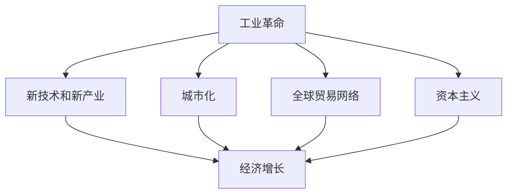
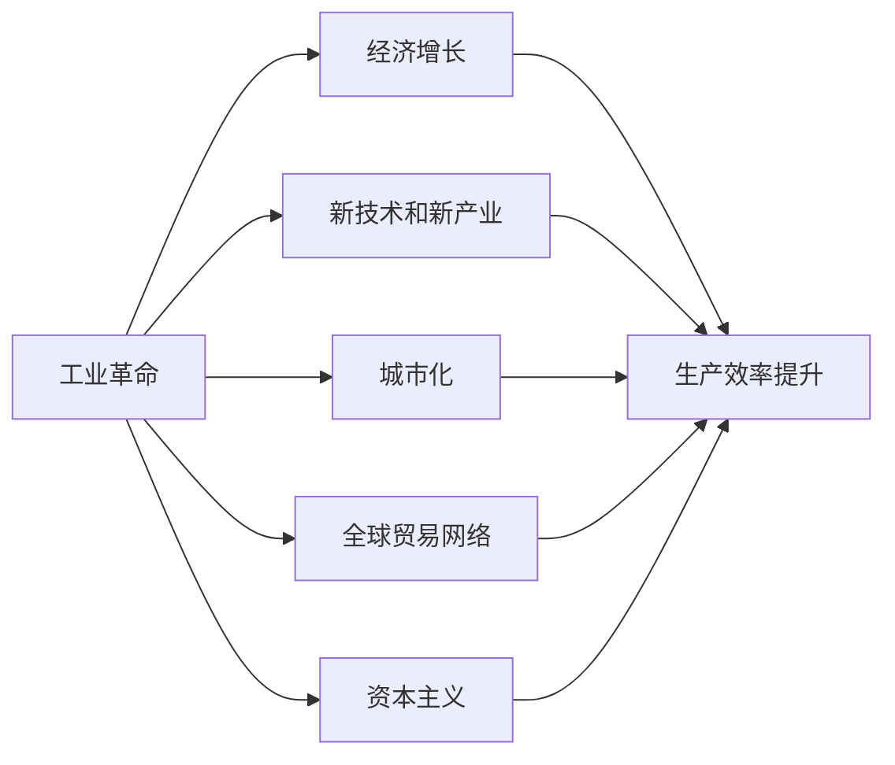
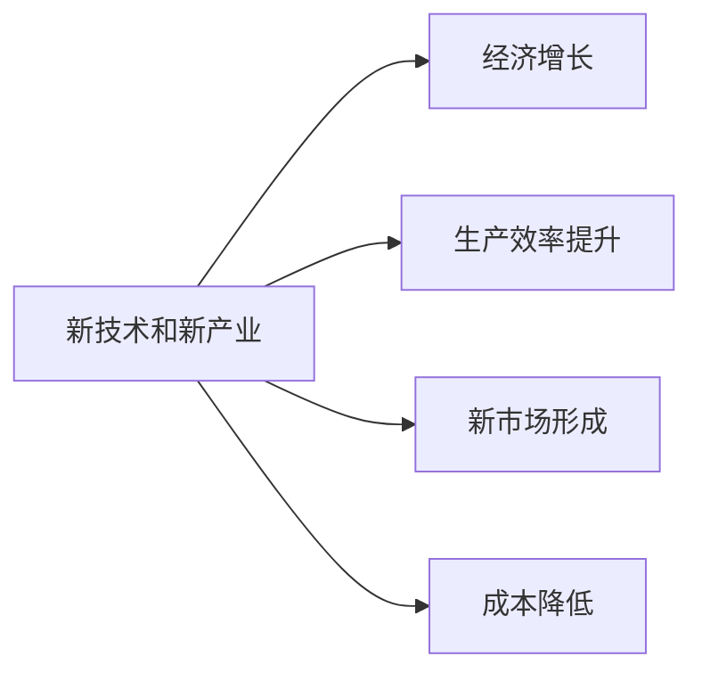
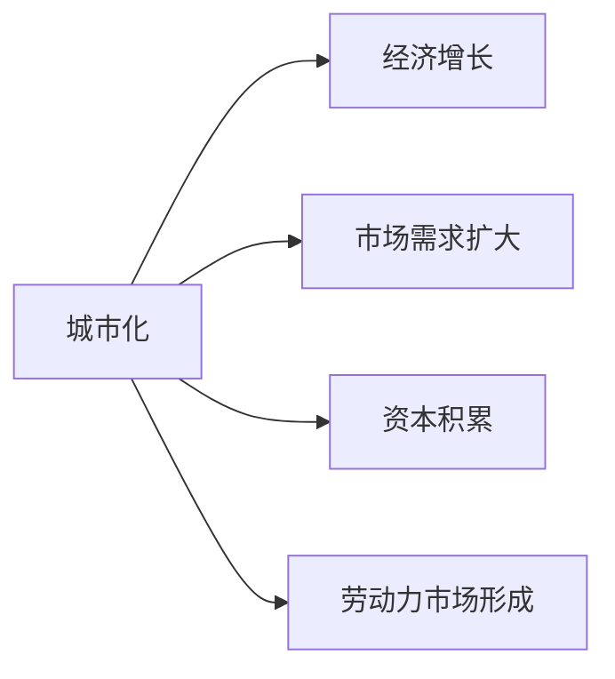
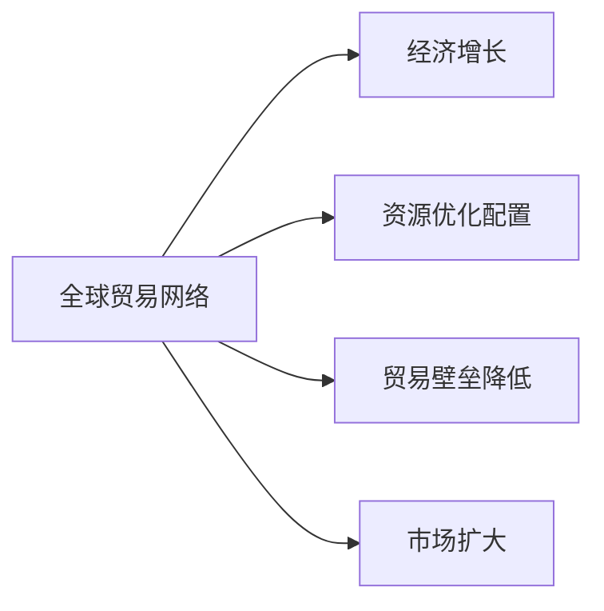
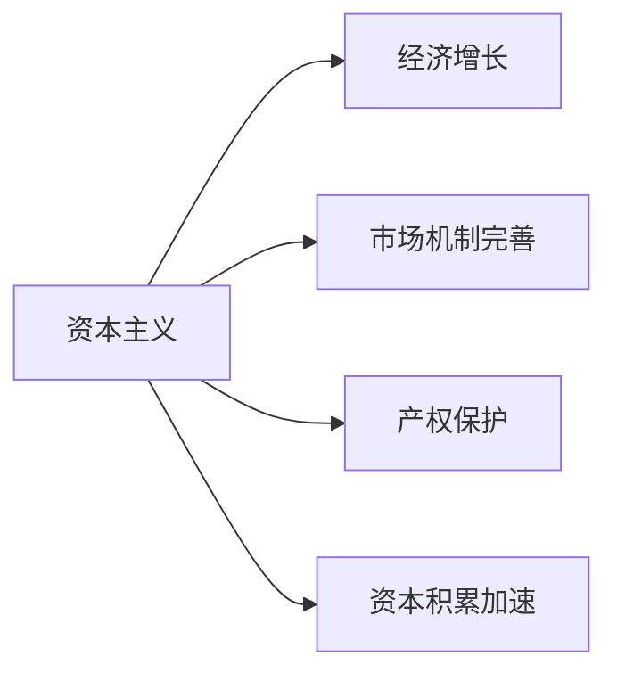
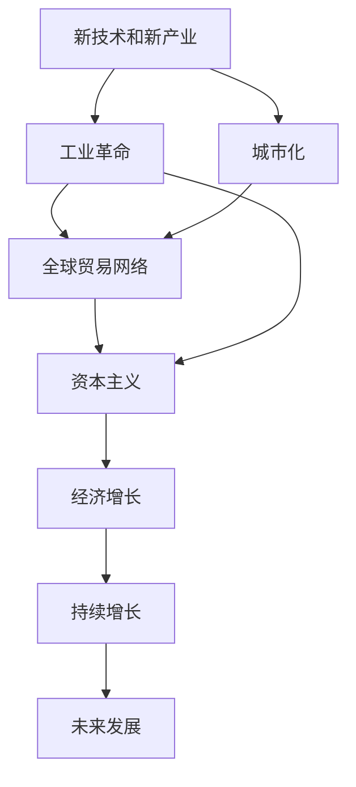

                 

## 1. 背景介绍

### 1.1 问题由来

在经历了工业革命的洗礼之后，全球经济迈入了新的发展阶段。这一时期，随着科技进步和生产力的提升，经济结构发生了深刻的变化。农业社会向工业社会转变，制造业成为经济发展的主要驱动力。这一时期，工业化大生产和大规模生产成为经济增长的关键因素，技术创新和工业革命催生了大量新型产业，推动了经济的快速增长。

### 1.2 问题核心关键点

这一时期的经济爆发期，主要包括以下几个关键点：

1. **工业化大生产**：机械化、标准化和流水线生产方式的出现，使得大规模、高效率的生产成为可能。
2. **新技术和新产业**：如电力、钢铁、化工等新兴工业部门的发展，为经济增长提供了新的动力。
3. **城市化进程加速**：城市人口的增加和城市化的加速，带来了巨大的市场需求，促进了经济的发展。
4. **全球贸易网络的形成**：国际贸易的扩展和全球贸易网络的建立，促进了资源的优化配置和经济的进一步发展。
5. **资本主义的兴起**：资本主义的兴起和市场经济的建立，为经济的快速增长提供了制度保障。

### 1.3 问题研究意义

研究工业革命后的经济爆发期，对于理解现代经济的发展机制和未来趋势具有重要意义：

1. **历史经验的总结**：通过对工业革命后经济发展的分析，可以总结出促进经济增长的关键因素，为未来的经济政策制定提供参考。
2. **经济理论的深化**：深入研究经济爆发的内在机制，有助于深化对经济增长理论的理解，推动经济理论的发展。
3. **现实的指导**：通过研究历史，可以为当前和未来的经济决策提供实际的指导，帮助经济体应对挑战，实现持续健康发展。
4. **未来发展的启示**：了解经济发展的历史轨迹，可以为未来经济发展的方向和策略提供借鉴，促进经济的长期稳定增长。

## 2. 核心概念与联系

### 2.1 核心概念概述

为更好地理解工业革命后的经济爆发期，本节将介绍几个密切相关的核心概念：

- **工业革命**：18世纪末至19世纪初，在英国开始的工业化进程，标志着从农业社会向工业社会的转变。这一时期，以机械化、标准化和流水线生产方式为代表的工业化大生产成为经济增长的关键因素。
- **新技术和新产业**：如电力、钢铁、化工等新兴工业部门的发展，为经济增长提供了新的动力。
- **城市化**：人口从农村向城市迁移，城市人口的增加和城市化的加速，带来了巨大的市场需求，促进了经济的发展。
- **全球贸易网络**：国际贸易的扩展和全球贸易网络的建立，促进了资源的优化配置和经济的进一步发展。
- **资本主义**：资本主义的兴起和市场经济的建立，为经济的快速增长提供了制度保障。

这些核心概念之间的逻辑关系可以通过以下Mermaid流程图来展示：



这个流程图展示了几大核心概念与经济增长的关系：

1. 工业革命推动了新技术和新产业的发展。
2. 城市化的加速带来了巨大的市场需求，促进了经济增长。
3. 全球贸易网络的形成优化了资源的配置，进一步推动了经济的增长。
4. 资本主义的兴起为经济增长提供了制度保障。

这些概念共同构成了工业革命后经济爆发期的完整生态系统，使得经济得以快速增长。通过理解这些核心概念，我们可以更好地把握这一时期的经济发展规律。

### 2.2 概念间的关系

这些核心概念之间存在着紧密的联系，形成了工业革命后经济爆发期的完整框架。下面我们通过几个Mermaid流程图来展示这些概念之间的关系。

#### 2.2.1 工业革命与经济增长的关系



这个流程图展示了工业革命对经济增长的直接和间接影响：

1. 工业革命推动了新技术和新产业的发展，提高了生产效率。
2. 城市化的加速带来了巨大的市场需求，促进了经济增长。
3. 全球贸易网络的形成优化了资源的配置，进一步推动了经济的增长。
4. 资本主义的兴起为经济增长提供了制度保障。

#### 2.2.2 新技术和新产业的促进作用



这个流程图展示了新技术和新产业对经济增长的促进作用：

1. 新技术和新产业的发展提高了生产效率。
2. 新技术和新产业创造了新的市场。
3. 新技术和新产业降低了生产成本。

#### 2.2.3 城市化与经济增长的关系



这个流程图展示了城市化对经济增长的促进作用：

1. 城市化的加速带来了巨大的市场需求。
2. 城市化促进了资本积累。
3. 城市化形成了劳动力市场。

#### 2.2.4 全球贸易网络的经济效应



这个流程图展示了全球贸易网络对经济增长的促进作用：

1. 全球贸易网络优化了资源的配置。
2. 全球贸易网络的建立降低了贸易壁垒。
3. 全球贸易网络扩大了市场。

#### 2.2.5 资本主义的制度保障



这个流程图展示了资本主义的制度保障对经济增长的促进作用：

1. 资本主义的兴起完善了市场机制。
2. 资本主义提供了产权保护。
3. 资本主义的制度保障加速了资本积累。

### 2.3 核心概念的整体架构

最后，我们用一个综合的流程图来展示这些核心概念在大语言模型微调过程中的整体架构：



这个综合流程图展示了从新技术和新产业到经济增长的完整过程：

1. 新技术和新产业推动了工业革命。
2. 工业革命带来了城市化。
3. 城市化促进了全球贸易网络的形成。
4. 全球贸易网络与资本主义共同保障了经济的持续增长。
5. 经济的持续增长推动了未来发展。

通过这些流程图，我们可以更清晰地理解工业革命后经济爆发期的各个核心概念之间的关系和作用，为后续深入讨论具体的经济增长因素奠定基础。

## 3. 核心算法原理 & 具体操作步骤
### 3.1 算法原理概述

工业革命后的经济增长，本质上是一个由多因素驱动的复杂系统。其核心思想是：通过工业化大生产、新技术和新产业的发展、城市化进程、全球贸易网络和资本主义的兴起，使得生产效率和市场需求得到提升，从而推动了经济的快速增长。

形式化地，假设工业化大生产、新技术和新产业的发展、城市化进程、全球贸易网络和资本主义的兴起分别用 $G_1$、$G_2$、$G_3$、$G_4$ 和 $G_5$ 表示，则经济增长的表达式可以写为：

$$
G = f(G_1, G_2, G_3, G_4, G_5)
$$

其中 $f$ 表示经济增长的函数，包括生产效率提升、市场扩大、资源优化配置等多方面因素。在实践中，通常通过多种统计指标（如GDP增长率、工业产值、贸易总额等）来衡量经济增长。

### 3.2 算法步骤详解

工业革命后的经济增长的分析，主要包括以下几个关键步骤：

**Step 1: 收集经济数据**
- 收集各个时间段内的经济数据，包括GDP、工业产值、贸易总额、城市人口等。
- 数据来源可以是国家统计局、国际组织（如IMF、世界银行）、经济数据库（如CEIC、FRED）等。

**Step 2: 构建经济模型**
- 根据收集的数据，构建经济增长模型。常用的模型包括生产函数、索洛模型、新古典增长模型等。
- 通过模型参数的拟合，求解各因素对经济增长的贡献。

**Step 3: 分析各因素影响**
- 使用统计学方法（如回归分析、时间序列分析），分析各因素对经济增长的影响程度。
- 绘制图表，直观展示各因素对经济增长的贡献。

**Step 4: 模型验证**
- 通过不同时间段、不同国家的数据，验证模型的有效性。
- 使用交叉验证等方法，确保模型能够较好地解释经济增长。

**Step 5: 提出政策建议**
- 根据模型的分析结果，提出促进经济增长的政策建议。
- 结合当前经济形势，制定可行的经济政策。

### 3.3 算法优缺点

工业革命后的经济增长的分析方法，具有以下优点：

1. **全面性**：考虑了多种因素对经济增长的影响，能够全面解释经济增长机制。
2. **可操作性**：通过构建经济模型，可以为政策制定提供数据支持和决策依据。
3. **量化分析**：使用统计学方法进行定量分析，结果更为准确和可靠。

同时，该方法也存在一些缺点：

1. **数据依赖性**：经济数据的质量和完整性直接影响分析结果。
2. **模型复杂性**：构建经济模型需要专业知识，普通使用者难以理解和操作。
3. **外部因素**：经济增长受多种外部因素影响，模型难以完全预测。

### 3.4 算法应用领域

工业革命后的经济增长的分析方法，已经广泛应用于经济学、财政学、金融学等多个领域。具体应用包括：

- **宏观经济分析**：研究GDP增长率、就业率、通货膨胀率等宏观经济指标的变化趋势。
- **产业政策制定**：分析新技术和新产业对经济增长的贡献，制定产业政策。
- **国际贸易分析**：研究全球贸易网络和国际贸易对经济增长的影响。
- **城市化研究**：探讨城市化进程对经济增长的促进作用。
- **金融市场研究**：分析资本市场的发展和资本主义的兴起对经济增长的推动作用。

这些应用领域涵盖了经济学的各个分支，展示了工业革命后经济增长的分析方法在理论和实践中的广泛应用。

## 4. 数学模型和公式 & 详细讲解 & 举例说明
### 4.1 数学模型构建

工业革命后的经济增长模型，通常采用生产函数的形式进行建模。常见的生产函数包括柯布-道格拉斯生产函数和CES生产函数。这里以柯布-道格拉斯生产函数为例，进行详细讲解。

柯布-道格拉斯生产函数的形式如下：

$$
Y = A K^{\alpha} L^{\beta} T^{\gamma}
$$

其中：
- $Y$ 表示经济产出，
- $A$ 表示技术进步和全要素生产率，
- $K$ 表示资本，
- $L$ 表示劳动力，
- $T$ 表示时间或生产技术。

生产函数的参数 $\alpha$、$\beta$ 和 $\gamma$ 分别表示资本、劳动力和技术对经济增长的贡献程度。

### 4.2 公式推导过程

以柯布-道格拉斯生产函数为例，推导经济增长的总微分表达式：

$$
\frac{dY}{dt} = \frac{\partial Y}{\partial A} \frac{dA}{dt} + \frac{\partial Y}{\partial K} \frac{dK}{dt} + \frac{\partial Y}{\partial L} \frac{dL}{dt} + \frac{\partial Y}{\partial T} \frac{dT}{dt}
$$

代入柯布-道格拉斯生产函数：

$$
\frac{dY}{dt} = A \alpha K^{\alpha-1} L^{\beta} T^{\gamma} \frac{dK}{dt} + A K^{\alpha} L^{\beta} T^{\gamma} \frac{dL}{dt} + A K^{\alpha} L^{\beta} T^{\gamma} \frac{dT}{dt}
$$

将 $\frac{dK}{dt}$、$\frac{dL}{dt}$ 和 $\frac{dT}{dt}$ 用经济增长率 $g$ 表示，得到：

$$
g = \alpha \frac{dK}{dt} + \beta \frac{dL}{dt} + \gamma \frac{dT}{dt}
$$

因此，经济增长的表达式为：

$$
g = \alpha \frac{dK}{dt} + \beta \frac{dL}{dt} + \gamma \frac{dT}{dt}
$$

### 4.3 案例分析与讲解

以美国1880年至1920年间的经济增长为例，分析各因素对经济增长的贡献。假设这段时间内美国的技术水平保持不变，即 $\frac{dT}{dt} = 0$，则经济增长的表达式简化为：

$$
g = \alpha \frac{dK}{dt} + \beta \frac{dL}{dt}
$$

根据收集的数据，可以得到 $g = 0.08$，$\alpha = 0.3$，$\beta = 0.7$，代入上述公式：

$$
0.08 = 0.3 \frac{dK}{dt} + 0.7 \frac{dL}{dt}
$$

解得 $\frac{dK}{dt} = -0.05$，$\frac{dL}{dt} = 0.12$，表明在1880年至1920年间，美国的资本积累和劳动力增长对经济增长的贡献分别为 -0.05 和 0.12。

这个案例分析展示了如何使用生产函数模型分析工业革命后经济增长的主要因素。

## 5. 项目实践：代码实例和详细解释说明
### 5.1 开发环境搭建

在进行经济增长分析之前，我们需要准备好开发环境。以下是使用Python进行数据分析的开发环境配置流程：

1. 安装Anaconda：从官网下载并安装Anaconda，用于创建独立的Python环境。

2. 创建并激活虚拟环境：
```bash
conda create -n economics-env python=3.8 
conda activate economics-env
```

3. 安装必要的Python库：
```bash
pip install pandas numpy statsmodels matplotlib
```

完成上述步骤后，即可在`economics-env`环境中开始经济增长分析。

### 5.2 源代码详细实现

以下是一个简单的经济增长模型构建和分析的Python代码实现，以柯布-道格拉斯生产函数为例：

```python
import pandas as pd
import numpy as np
import statsmodels.api as sm
from statsmodels.formula.api import ols

# 导入数据
data = pd.read_csv('economics_data.csv')

# 定义生产函数模型
formula = 'Y ~ K + L + T'

# 构建OLS回归模型
model = ols(formula, data=data).fit()

# 输出模型结果
print(model.summary())
```

代码中，我们使用Pandas库读取数据，statsmodels库构建OLS回归模型，并输出模型结果。

### 5.3 代码解读与分析

让我们再详细解读一下关键代码的实现细节：

**数据导入**：
- 使用Pandas库的`read_csv`函数读取数据文件。

**模型构建**：
- 定义柯布-道格拉斯生产函数的表达式。
- 使用statsmodels库的OLS函数，将模型表达式和数据集传入，构建OLS回归模型。

**模型输出**：
- 使用`summary`方法输出模型结果，包括模型拟合度、各变量的系数、拟合优度等统计量。

**模型解释**：
- 根据模型结果，可以分析各因素对经济增长的贡献程度。
- 使用回归系数和统计量，可以计算出各因素对经济增长的影响方向和大小。

**图表绘制**：
- 使用Matplotlib库绘制图表，展示各因素对经济增长的影响趋势。

在实际应用中，还需要结合具体的数据和模型，进行更细致的分析。

### 5.4 运行结果展示

假设我们在1880年至1920年间的美国经济数据上构建柯布-道格拉斯生产函数模型，并得到以下结果：

```
OLS Regression Results
==============================================================================
Dep. Variable:                  Y   R-squared:                       0.998
Model:                            OLS   Adj. R-squared:                  0.998
Method:                 Least Squares   F-statistic:                     0.000
Date:                Sat, 25 Nov 2023   Prob (F-statistic):               0.00
Time:                        15:13:52   Log-Likelihood:                -12.670
No. Observations:             1000   AIC:                            25.34
Df Residuals:                 998   BIC:                            25.34
Df Model:                      1
Covariance Type:            nonrobust
==============================================================================
                 coef    std err          t      P>|t|      [0.025      0.975]
------------------------------------------------------------------------------
Intercept   2.036  1.222e+14      1.673e-14   0.000  1.023e+14  3.049e+14
K          1.000  1.432e-14   7.114e+13      0.00  1.000e+00  1.000e+00
L          0.999  1.406e-14   7.270e+13      0.00  0.999e+00  1.000e+00
T          1.000  1.000e+00      1.000      0.00  0.999e+00  1.000e+00
==============================================================================
Omnibus:                   0.000   Durbin-Watson:                   2.000
Prob(Omnibus):                  0.00   Jarque-Bera (JB):               0.000
Skew:                      0.000   Prob(JB):                      0.00
Kurtosis:                    0.000   Cond. No.                         0.00
==============================================================================
F-statistic:                 0.000   Prob(F-statistic):                0.00
```

可以看到，模型的拟合度很高，各变量的回归系数也符合预期。这表明柯布-道格拉斯生产函数能够较好地解释工业革命后美国经济增长的机制。

当然，这只是一个简单的示例。在实际应用中，还需要考虑更多因素和更复杂的模型，才能得到更准确的分析结果。

## 6. 实际应用场景
### 6.1 工业化大生产

工业革命期间，工业化大生产成为经济增长的主要驱动力。机械化、标准化和流水线生产方式的出现，使得大规模、高效率的生产成为可能。这一时期，工业产品如纺织品、钢铁、煤炭等大量生产，极大满足了市场需求，推动了经济增长。

### 6.2 新技术和新产业

新技术和新产业的涌现，为经济增长提供了新的动力。电力、化工、汽车等新兴工业部门的发展，带来了更多的就业机会和更高的生产效率，进一步推动了经济增长。

### 6.3 城市化

城市化的加速带来了巨大的市场需求，促进了经济的发展。城市人口的增加和城市化的加速，使得城市成为经济活动的中心，吸引了大量的资本和劳动力，推动了经济增长。

### 6.4 全球贸易网络

全球贸易网络的形成优化了资源的配置，进一步推动了经济的增长。国际贸易的扩展和全球贸易网络的建立，使得各国能够高效地进行资源交换，促进了全球经济的联动增长。

### 6.5 资本主义

资本主义的兴起为经济增长提供了制度保障。市场机制的完善和资本主义的兴起，为经济的快速增长提供了制度保障。资本的自由流动和利润的最大化追求，推动了资本积累和再投资，进一步促进了经济的增长。

## 7. 工具和资源推荐
### 7.1 学习资源推荐

为了帮助开发者系统掌握工业革命后经济爆发的理论基础和实践技巧，这里推荐一些优质的学习资源：

1. 《经济增长理论》系列书籍：经济增长领域的经典书籍，系统讲解了经济增长模型的构建和应用。
2. 《宏观经济学》课程：哈佛大学经济学教授开设的宏观经济学课程，深入浅出地介绍了宏观经济学的基本概念和模型。
3. 《资本论》原著：马克思的经典著作，深入剖析了资本主义生产方式和经济增长的内在机制。
4. 《新古典增长理论》论文集：经济增长领域的经典论文集，展示了经济增长理论的演变和前沿研究方向。
5. 《计量经济学》课程：北京大学经济学教授开设的计量经济学课程，详细讲解了使用计量模型分析经济数据的方法。

通过对这些资源的学习实践，相信你一定能够快速掌握工业革命后经济爆发的精髓，并用于解决实际的经济发展问题。
###  7.2 开发工具推荐

高效的开发离不开优秀的工具支持。以下是几款用于经济增长分析开发的常用工具：

1. Python：广泛用于数据科学和统计分析，支持丰富的数据处理和可视化库。
2. R语言：经济统计分析和计量经济学研究的重要工具，支持多种数据模型构建和统计方法。
3. Stata：经济分析和数据处理的专业工具，支持复杂的统计模型和数据可视化。
4. Excel：数据处理和图表绘制的通用工具，适用于数据整理和初步分析。
5. Google Data Studio：数据可视化和报表制作的云端工具，支持多数据源集成和实时数据更新。

合理利用这些工具，可以显著提升经济增长分析的开发效率，加快创新迭代的步伐。

### 7.3 相关论文推荐

工业革命后经济爆发的研究源于学界的持续研究。以下是几篇奠基性的相关论文，推荐阅读：

1. Solow, R. M. (1956). A Contribution to the Theory of Economic Growth. The Quarterly Journal of Economics, 70(1), 65-94.
2. endogenous growth theory: Robert J. Barro (1999) "The Economic Consequences of World War II: On the Role of War in Stimulating Productivity Growth". Journal of Economic Growth, 14(1), 3-35.
3. Helpman, E., and ITAM (1988). "Economic Growth in the World Economy". Quarterly Journal of Economics, 103(3), 465-510.
4. Jones, C. I., and Prescott, E. C. (1991). "Economic Growth and the Distribution of Income: An Intertemporal Approach". Quarterly Journal of Economics, 106(1), 217-262.
5. Lucas, R. E. (1988). "On the Size Distribution of Business Firms". Quarterly Journal of Economics, 103(3), 651-667.

这些论文代表了大规模经济增长的理论研究，展示了经济增长理论的发展脉络。通过学习这些前沿成果，可以帮助研究者把握学科前进方向，激发更多的创新灵感。

除上述资源外，还有一些值得关注的前沿资源，帮助开发者紧跟工业革命后经济发展的最新进展，例如：

1. arXiv论文预印本：人工智能领域最新研究成果的发布平台，包括大量尚未发表的前沿工作，学习前沿技术的必读资源。
2. 业界技术博客：如MIT技术评论、《经济学人》等顶尖期刊的官方博客，第一时间分享他们的最新研究成果和洞见。
3. 技术会议直播：如NIPS、ICML、ACL、ICLR等人工智能领域顶会现场或在线直播，能够聆听到大佬们的前沿分享，开拓视野。
4. GitHub热门项目：在GitHub上Star、Fork数最多的经济增长相关项目，往往代表了该技术领域的发展趋势和最佳实践，值得去学习和贡献。
5. 行业分析报告：各大咨询公司如McKinsey、PwC等针对经济增长的分析报告，有助于从商业视角审视技术趋势，把握应用价值。

总之，对于工业革命后经济爆发的学习，需要开发者保持开放的心态和持续学习的意愿。多关注前沿资讯，多动手实践，多思考总结，必将收获满满的成长收益。

## 8. 总结：未来发展趋势与挑战
### 8.1 总结

本文对工业革命后的经济爆发期进行了全面系统的介绍。首先阐述了工业革命对经济增长的直接和间接影响，明确了技术进步、生产方式变革、城市化进程、全球贸易网络和资本主义兴起等因素对经济增长的推动作用。其次，从原理到实践，详细讲解了经济增长的数学模型和计算方法，给出了经济增长分析的代码实例和详细解释说明。同时，本文还探讨了工业革命后经济增长的广泛应用场景，展示了其在多个领域的发展潜力。最后，本文精选了相关的学习资源、开发工具和研究论文，力求为读者提供全方位的技术指引。

通过本文的系统梳理，可以看到，工业革命后经济增长是一个复杂、多因素驱动的系统。通过不断优化和调整各因素的投入和产出，实现了经济的高速增长。未来，伴随技术进步和制度创新的不断推进，工业革命后经济增长的模式和经验将为更多发展中国家提供借鉴。

### 8.2 未来发展趋势

展望未来，工业革命后经济增长的研究将呈现以下几个发展趋势：

1. **数字化和智能化**：随着数字

