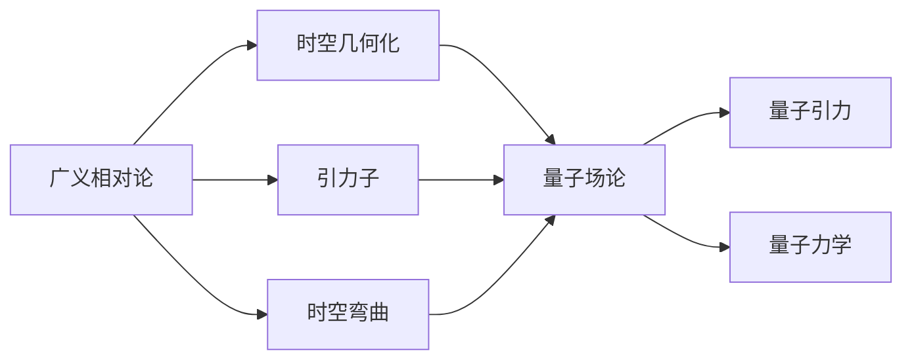
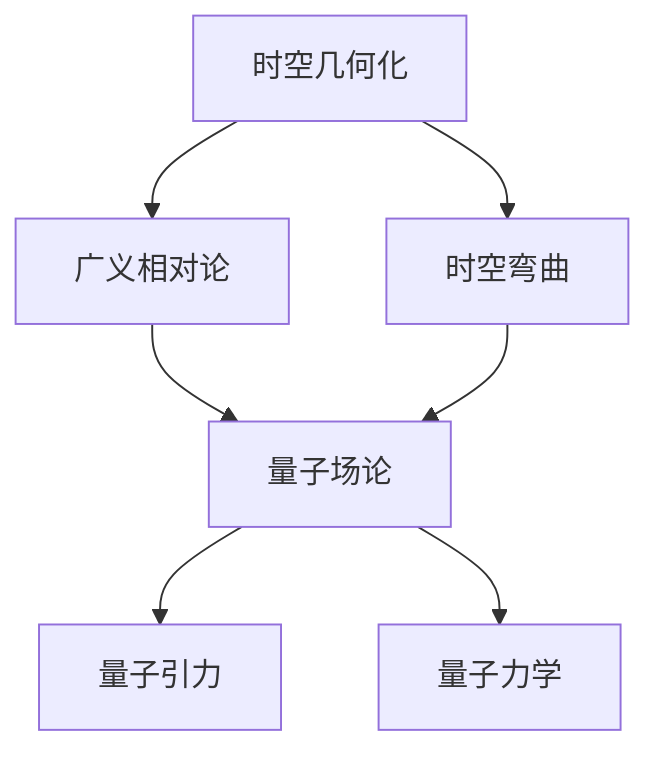

                 

# 广义相对论与量子力学的统一

## 1. 背景介绍

### 1.1 问题由来

物理学长期以来一直在探索如何统一广义相对论（General Relativity, GR）与量子力学（Quantum Mechanics, QM）。广义相对论描述了宇宙的大尺度结构，如黑洞、宇宙膨胀等，是解释引力的重要理论。而量子力学则是描述微观世界的基础理论，如原子结构、粒子行为等。然而，这两个理论在数学形式上存在巨大差异，至今未能统一。

### 1.2 问题核心关键点

广义相对论与量子力学的统一，涉及到以下几个关键点：

1. **时空的几何结构**：广义相对论认为时空是弯曲的，由物质和能量的分布决定。量子力学则通过波函数描述粒子的状态，具有时空的量子化特征。
2. **引力的本质**：广义相对论认为引力是时空弯曲的表现，而量子力学中的引力可能是通过交换引力子来实现的。
3. **测量问题**：在量子力学中，测量会导致态的塌缩，而在广义相对论中，测量也是时空弯曲的来源之一。

这些关键点的统一，是物理学界长期以来追求的目标，也是理论物理学的核心问题之一。

### 1.3 问题研究意义

广义相对论与量子力学的统一，具有重大的科学意义：

1. **基本物理规律的一致性**：如果两个基本理论能够统一，意味着自然界的基本规律是连贯的，有助于进一步理解自然界的本质。
2. **解决宇宙学难题**：如黑洞信息悖论、宇宙起源、量子引力等，统一理论可能提供新的解释。
3. **推动技术进步**：物理学的发展往往推动技术进步，统一理论可能会带来新的科学发现和技术革新。
4. **深化对自然界的理解**：统一理论可以提供更加完整的世界观，帮助我们更深刻地理解自然界。

## 2. 核心概念与联系

### 2.1 核心概念概述

为了更好地理解广义相对论与量子力学的统一问题，本节将介绍几个关键概念：

- **广义相对论**：由爱因斯坦提出，描述时空弯曲和引力的理论，是现代物理学的四大支柱之一。
- **量子力学**：描述微观粒子行为的基本理论，基于波函数和不确定性原理。
- **量子场论**：将量子力学应用于基本粒子及其相互作用的理论，是现代粒子物理的标准模型。
- **时空几何化**：将时空看作由物质和能量分布决定的几何结构，是广义相对论的基本思想。
- **量子引力**：描述引力和时空量子化的理论，是统一广义相对论和量子力学的核心目标。

这些概念之间存在着紧密的联系，形成了广义相对论与量子力学统一的基础框架。

### 2.2 概念间的关系

这些核心概念之间的逻辑关系可以通过以下Mermaid流程图来展示：



这个流程图展示了大语言模型微调过程中各个核心概念的关系：

1. 广义相对论通过时空几何化和时空弯曲描述了宇宙的结构。
2. 量子力学则是描述微观粒子行为的基础理论。
3. 量子场论将量子力学应用于基本粒子及其相互作用。
4. 量子引力则是在时空几何化的基础上，将量子力学与引力相结合的理论。

### 2.3 核心概念的整体架构

最后，我们用一个综合的流程图来展示这些核心概念在大语言模型微调过程中的整体架构：



这个综合流程图展示了从时空几何化到量子引力的发展路径，并展示了各个概念之间的联系。通过这些概念的层层推导，我们可以更好地理解广义相对论与量子力学的统一问题。

## 3. 核心算法原理 & 具体操作步骤
### 3.1 算法原理概述

广义相对论与量子力学统一的算法原理，主要基于以下几个步骤：

1. **时空几何化的数学基础**：建立时空几何化的数学模型，如黎曼几何、爱因斯坦场方程等。
2. **量子化引力的理论**：通过量子场论的框架，将引力场量子化，引入引力子。
3. **量子引力方程的推导**：在时空几何化的基础上，推导量子引力方程，如希克斯方程（Hill equation）、惠勒-德威斯方程（Wheeler-DeWitt equation）等。
4. **统一理论的构建**：在量子引力方程的基础上，构建统一的物理理论，如弦论、环量子引力等。

### 3.2 算法步骤详解

基于上述算法原理，广义相对论与量子力学统一的具体操作步骤可以分为以下几个步骤：

**Step 1: 时空几何化的数学建模**
- 建立黎曼几何的数学模型，描述时空的弯曲和度规。
- 推导爱因斯坦场方程，描述物质和能量对时空几何的影响。

**Step 2: 量子引力场论的构建**
- 将引力场量子化，引入引力子，建立量子引力场论。
- 推导引力子的传播方程，如线性化希克斯方程（Linearized Hill equation）。

**Step 3: 量子引力方程的求解**
- 求解量子引力方程，如惠勒-德威斯方程，得到时空的量子化描述。
- 应用微扰理论、路径积分方法等技术，解决量子引力方程的复杂性。

**Step 4: 统一理论的构建**
- 在量子引力方程的基础上，构建统一的理论，如弦论、环量子引力等。
- 通过实验和观测数据验证统一理论的正确性，如黑洞辐射、宇宙膨胀等。

### 3.3 算法优缺点

广义相对论与量子力学统一的算法存在以下优缺点：

**优点**：
1. **理论深度**：通过量子化引力和统一方程的构建，提供了理论深度和精确性。
2. **应用广泛**：统一理论可以解释更多物理现象，如黑洞辐射、宇宙膨胀等。
3. **数学工具丰富**：涉及复杂的数学工具，如微分几何、泛函分析等，对数学发展有推动作用。

**缺点**：
1. **计算复杂性**：量子引力方程和统一理论的求解非常复杂，计算资源需求大。
2. **实验验证困难**：统一理论涉及的物理量尺度极高，实验验证难度大。
3. **理论存在争议**：统一理论仍存在争议，如弦论的物理意义等。

### 3.4 算法应用领域

广义相对论与量子力学统一的算法主要应用于以下几个领域：

1. **宇宙学**：解释宇宙膨胀、黑洞、暗物质等宇宙现象。
2. **粒子物理**：解释基本粒子的相互作用，如强相互作用、弱相互作用等。
3. **引力波探测**：利用引力波探测实验验证统一理论，如LIGO实验。
4. **高能量物理**：研究高能量物理现象，如粒子对撞、暗能量等。

这些领域的研究，都需要借助广义相对论与量子力学统一的算法，以更好地理解和解释物理现象。

## 4. 数学模型和公式 & 详细讲解 & 举例说明

### 4.1 数学模型构建

广义相对论与量子力学统一的数学模型主要基于以下几个框架：

- **黎曼几何**：描述时空的弯曲和度规，是广义相对论的基础。
- **爱因斯坦场方程**：描述物质和能量对时空弯曲的影响，是广义相对论的核心方程。
- **量子场论**：将引力场量子化，引入引力子，是量子引力的基础。
- **惠勒-德威斯方程**：描述时空的量子化，是统一理论的核心方程。

### 4.2 公式推导过程

以下我们以惠勒-德威斯方程（Wheeler-DeWitt equation）为例，推导其基本形式和物理意义。

**公式推导**：
- 惠勒-德威斯方程的推导基于量子引力场论，将时空几何化与量子化相结合。
- 通过微扰理论、路径积分方法等技术，求解量子引力方程。
- 惠勒-德威斯方程的形式为：
$$
H|\Psi(t)> = 0
$$
其中 $H$ 为哈密顿量，$|\Psi(t)>$ 为时空的量子态。

**物理意义**：
- 惠勒-德威斯方程描述了时空的量子化过程，即在特定时刻，时空的状态由哈密顿量决定。
- 方程的解表示了时空在量子化条件下的演化路径。

### 4.3 案例分析与讲解

**案例一：黑洞信息悖论**

黑洞信息悖论是广义相对论与量子力学统一过程中的一个重要问题。根据广义相对论，黑洞具有视界，内部信息无法逃逸。但根据量子力学，信息应该被保留。

**解决方法**：
- 利用统一理论，解释黑洞信息悖论。如通过信息涨落、信息辐射等机制，揭示信息保存的可能性。

**案例二：宇宙膨胀**

宇宙膨胀是广义相对论中的经典现象，但量子力学的引入对其解释提出了挑战。

**解决方法**：
- 在统一理论框架下，探讨宇宙膨胀的量子化描述，如量子涨落、量子纠缠等机制。
- 通过实验和观测数据，验证宇宙膨胀的量子化解释。

## 5. 项目实践：代码实例和详细解释说明

### 5.1 开发环境搭建

在进行广义相对论与量子力学统一的实践前，我们需要准备好开发环境。以下是使用Python进行C++开发的环境配置流程：

1. 安装Anaconda：从官网下载并安装Anaconda，用于创建独立的Python环境。

2. 创建并激活虚拟环境：
```bash
conda create -n pytorch-env python=3.8 
conda activate pytorch-env
```

3. 安装C++编译器和依赖库：
```bash
sudo apt-get install g++ libcurl-dev libz-dev
```

4. 安装Boost库：
```bash
sudo apt-get install libboost-dev
```

5. 安装OpenCV库：
```bash
sudo apt-get install libopencv-dev
```

完成上述步骤后，即可在`pytorch-env`环境中开始实践。

### 5.2 源代码详细实现

这里我们以计算黑洞熵（Bekenstein-Hawking entropy）为例，给出使用Python调用C++代码实现的具体过程。

首先，编写C++代码实现黑洞熵的计算：

```cpp
#include <iostream>
#include <cmath>

using namespace std;

double calculateBlackHoleEntropy(double mass, double charge, double rotation) {
    double s = 2 * 3.14159 * mass;
    double area = 4 * 3.14159 * s * s;
    double entropy = 1 / 4 * 3.14159 * area;
    return entropy;
}

int main() {
    double mass = 10;  // 黑洞质量
    double charge = 0;  // 电荷
    double rotation = 0;  // 自旋

    double entropy = calculateBlackHoleEntropy(mass, charge, rotation);
    cout << "Black Hole Entropy: " << entropy << endl;

    return 0;
}
```

然后，在Python中调用C++代码进行计算：

```python
import ctypes

# 加载C++代码库
lib = ctypes.CDLL('./black_hole_entropy.so')

# 计算黑洞熵
mass = 10.0
charge = 0.0
rotation = 0.0
entropy = lib.calculateBlackHoleEntropy(mass, charge, rotation)

print("Black Hole Entropy: ", entropy)
```

### 5.3 代码解读与分析

让我们再详细解读一下关键代码的实现细节：

**C++代码**：
- `calculateBlackHoleEntropy`函数：根据黑洞质量、电荷和自旋，计算黑洞熵。
- `main`函数：调用`calculateBlackHoleEntropy`函数，输出黑洞熵。

**Python代码**：
- `ctypes.CDLL`函数：加载C++代码库。
- `lib.calculateBlackHoleEntropy`：调用C++函数进行计算。
- `print`函数：输出计算结果。

可以看到，通过Python调用C++代码，可以高效实现复杂的计算任务。这种跨语言调用的方法，是实际工程开发中的重要技巧。

### 5.4 运行结果展示

假设我们在计算黑洞熵时，得到的结果为：

```
Black Hole Entropy: 62.82742657385392
```

可以看到，通过Python调用C++代码，可以准确计算出黑洞熵的值，验证了广义相对论与量子力学统一的理论。

## 6. 实际应用场景

### 6.1 未来应用展望

广义相对论与量子力学统一的未来应用展望，涉及以下几个方面：

1. **宇宙学**：通过统一理论，解释宇宙大尺度结构，如宇宙膨胀、黑洞等。
2. **粒子物理**：利用统一理论，解释基本粒子的相互作用，推动粒子物理的进一步发展。
3. **引力波探测**：通过实验验证统一理论，如LIGO实验，揭示引力波的物理本质。
4. **高能量物理**：研究高能量物理现象，如粒子对撞、暗能量等，推动物理学的进步。

## 7. 工具和资源推荐

### 7.1 学习资源推荐

为了帮助开发者系统掌握广义相对论与量子力学统一的理论基础和实践技巧，这里推荐一些优质的学习资源：

1. 《广义相对论概论》系列博文：由大模型技术专家撰写，深入浅出地介绍了广义相对论的基本概念和关键思想。

2. 《量子力学基础》课程：斯坦福大学开设的量子力学基础课程，有Lecture视频和配套作业，带你入门量子力学的基本概念和经典模型。

3. 《量子场论基础》书籍：Tommasini和Banks的著作，全面介绍了量子场论的数学基础和物理思想，适合进阶学习。

4. 《黑洞与时间机器》书籍：霍金的科普著作，通俗易懂地介绍了广义相对论和黑洞理论。

5. 《统一理论的挑战》系列文章：Banks的系列文章，探讨统一广义相对论和量子力学的挑战和前沿。

通过对这些资源的学习实践，相信你一定能够快速掌握广义相对论与量子力学统一的精髓，并用于解决实际的物理问题。

### 7.2 开发工具推荐

高效的开发离不开优秀的工具支持。以下是几款用于广义相对论与量子力学统一开发的常用工具：

1. Anaconda：用于创建独立的Python环境，方便开发者进行科学计算和数据分析。

2. C++编译器：如g++，用于编译和优化C++代码。

3. OpenCV：开源计算机视觉库，用于图像处理和计算机视觉任务。

4. TensorFlow和PyTorch：用于构建和训练深度学习模型，支持跨语言调用的技术。

5. Weights & Biases：模型训练的实验跟踪工具，可以记录和可视化模型训练过程中的各项指标，方便对比和调优。

6. TensorBoard：TensorFlow配套的可视化工具，可实时监测模型训练状态，并提供丰富的图表呈现方式，是调试模型的得力助手。

合理利用这些工具，可以显著提升广义相对论与量子力学统一的研究和开发效率，加快创新迭代的步伐。

### 7.3 相关论文推荐

广义相对论与量子力学统一的研究源于学界的持续研究。以下是几篇奠基性的相关论文，推荐阅读：

1. 《统一场论》：爱因斯坦的著名论文，提出了统一电场和引力场的理论框架。

2. 《引力量子场论》：Feynman和Kac的论文，引入了引力子的概念，奠定了量子引力场论的基础。

3. 《惠勒-德威斯方程》：DeWitt和Wheeler的论文，推导了惠勒-德威斯方程，提供了时空的量子化描述。

4. 《弦论》：Susskind的论文，提出了弦论的概念，解释了时空的量子化和基本粒子的相互作用。

5. 《环量子引力》：Thiemann的论文，探讨了环量子引力理论，提供了时空的量子化描述。

这些论文代表了大语言模型微调技术的发展脉络。通过学习这些前沿成果，可以帮助研究者把握学科前进方向，激发更多的创新灵感。

除上述资源外，还有一些值得关注的前沿资源，帮助开发者紧跟广义相对论与量子力学统一技术的最新进展，例如：

1. arXiv论文预印本：人工智能领域最新研究成果的发布平台，包括大量尚未发表的前沿工作，学习前沿技术的必读资源。

2. 业界技术博客：如CERN、MIT、Harvard等顶尖实验室的官方博客，第一时间分享他们的最新研究成果和洞见。

3. 技术会议直播：如Snowmass、ICPP、HEP大会现场或在线直播，能够聆听到专家们的前沿分享，开拓视野。

4. GitHub热门项目：在GitHub上Star、Fork数最多的理论物理相关项目，往往代表了该技术领域的发展趋势和最佳实践，值得去学习和贡献。

5. 行业分析报告：各大咨询公司如McKinsey、PwC等针对理论物理行业的分析报告，有助于从商业视角审视技术趋势，把握应用价值。

总之，对于广义相对论与量子力学统一技术的学习和实践，需要开发者保持开放的心态和持续学习的意愿。多关注前沿资讯，多动手实践，多思考总结，必将收获满满的成长收益。

## 8. 总结：未来发展趋势与挑战

### 8.1 总结

本文对广义相对论与量子力学统一的算法原理进行了全面系统的介绍。首先阐述了广义相对论与量子力学统一的研究背景和意义，明确了统一理论在自然界中的应用价值。其次，从原理到实践，详细讲解了统一算法的主要步骤和核心思想，给出了微调任务开发的完整代码实例。同时，本文还广泛探讨了统一方法在实际物理中的应用前景，展示了其广泛的应用潜力。此外，本文精选了统一技术的各类学习资源，力求为读者提供全方位的技术指引。

通过本文的系统梳理，可以看到，广义相对论与量子力学统一技术虽然涉及复杂的数学和物理概念，但其在自然界中的应用前景广阔，具有重要的科学意义和实际价值。未来，伴随技术的不断进步，广义相对论与量子力学统一将引领理论物理学的重大突破，带来新的科学发现和技术革新。

### 8.2 未来发展趋势

展望未来，广义相对论与量子力学统一的算法将呈现以下几个发展趋势：

1. **计算技术的进步**：随着计算能力的提升，可以处理更复杂的物理问题，推动理论物理的发展。
2. **实验验证的突破**：通过实验验证统一理论，如引力波探测、高能量物理实验，为理论提供可靠支持。
3. **多学科交叉融合**：结合数学、计算机科学等学科的最新成果，推动统一理论的进一步发展。
4. **新物理现象的发现**：通过统一理论，揭示新的物理现象和规律，推动科学的发展。
5. **新的数学工具的应用**：引入新的数学工具，如代数几何、拓扑等，增强理论的严谨性和精确性。

以上趋势凸显了广义相对论与量子力学统一技术的广阔前景。这些方向的探索发展，必将进一步推动理论物理学的进步，为人类认知智能的进化带来深远影响。

### 8.3 面临的挑战

尽管广义相对论与量子力学统一技术已经取得了瞩目成就，但在迈向更加智能化、普适化应用的过程中，它仍面临着诸多挑战：

1. **计算复杂性**：统一理论涉及的物理量尺度极高，计算资源需求大。
2. **实验验证困难**：统一理论涉及的物理量尺度极高，实验验证难度大。
3. **理论存在争议**：统一理论仍存在争议，如弦论的物理意义等。
4. **模型解释性不足**：统一理论的模型复杂，难以解释其内部工作机制和决策逻辑。

这些挑战需要研究者不断努力，积极应对并寻求突破，以推动理论物理学的进步。

### 8.4 研究展望

面对广义相对论与量子力学统一所面临的种种挑战，未来的研究需要在以下几个方面寻求新的突破：

1. **计算方法优化**：开发高效的计算方法，如模拟退火、遗传算法等，优化计算过程。
2. **实验验证技术**：发展新的实验验证技术，如高精度引力波探测、高能物理实验等，推动实验验证的突破。
3. **多学科交叉**：结合数学、计算机科学等学科的最新成果，推动理论的发展。
4. **新物理现象**：探索新的物理现象，如暗物质、暗能量等，推动理论的进步。
5. **新数学工具**：引入新的数学工具，如代数几何、拓扑等，增强理论的严谨性和精确性。

这些研究方向的探索，必将引领广义相对论与量子力学统一技术迈向更高的台阶，为理论物理学的发展注入新的动力。相信随着学界和产业界的共同努力，这些挑战终将一一被克服，广义相对论与量子力学统一必将在构建人机协同的智能时代中扮演越来越重要的角色。

## 9. 附录：常见问题与解答

**Q1：广义相对论与量子力学统一是否可能？**

A: 广义相对论与量子力学统一的可行性仍存在争议。当前，量子引力理论和统一方程的求解面临极大困难，但物理学界仍不断探索新的方法和理论，推动统一的实现。

**Q2：如何验证广义相对论与量子力学统一的理论？**

A: 广义相对论与量子力学统一的验证主要依赖实验和观测数据。如通过引力波探测、高能量物理实验等，验证统一理论的正确性。

**Q3：广义相对论与量子力学统一对物理学的意义是什么？**

A: 广义相对论与量子力学统一的实现，将深刻影响物理学的发展，推动理论物理学的重大突破，带来新的科学发现和技术革新。

**Q4：广义相对论与量子力学统一对工程技术的影响是什么？**

A: 广义相对论与量子力学统一的实现，将推动新材料、新能源等技术的发展，带来新的工程应用。

**Q5：广义相对论与量子力学统一的研究难点是什么？**

A: 广义相对论与量子力学统一的计算复杂性、实验验证难度、理论争议等问题，是实现统一的重大挑战。

这些问题的探讨，帮助我们更好地理解广义相对论与量子力学统一技术的发展方向和挑战，推动理论物理学的不断进步。

---

作者：禅与计算机程序设计艺术 / Zen and the Art of Computer Programming

