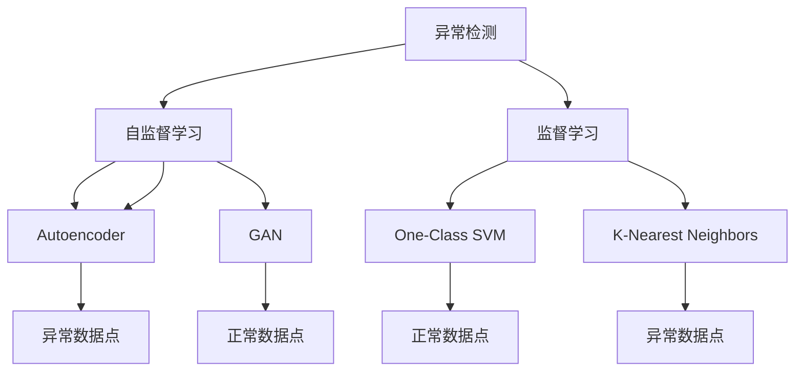
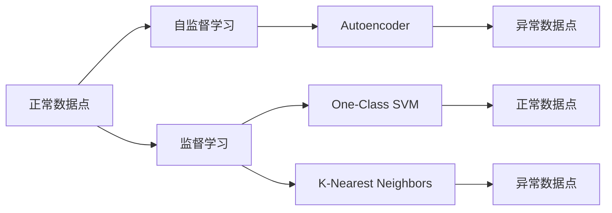
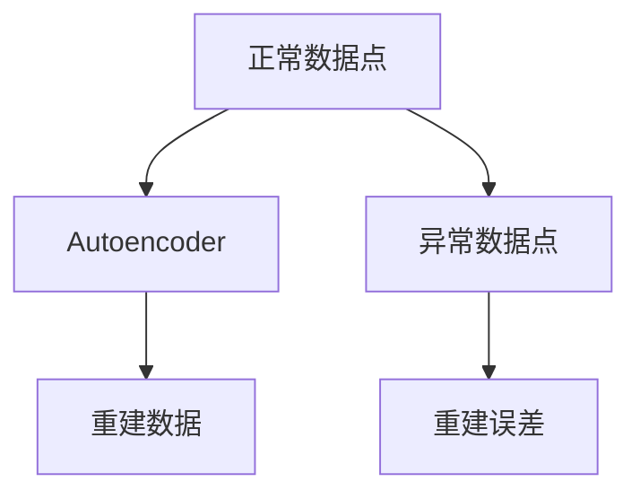
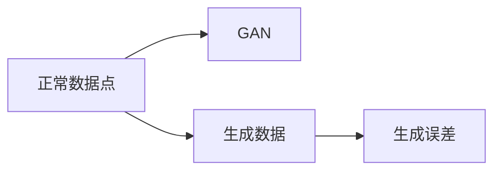

                 

# 异常检测(Anomaly Detection) - 原理与代码实例讲解

> 关键词：异常检测,机器学习,数据挖掘,深度学习,自监督学习,Autoencoder,GAN,深度学习

## 1. 背景介绍

### 1.1 问题由来

在数据科学和机器学习领域，异常检测(Anomaly Detection)是一种用于识别数据集中的异常数据点的关键技术。异常数据点是指那些不符合正常模式的数据点，它们可能是由于数据采集过程中的错误、系统故障、欺诈行为等造成的。异常检测对于风险评估、网络安全、故障诊断、医学诊断等应用场景至关重要。

然而，传统基于统计的异常检测方法常常依赖于预定义的假设和数据分布的性质，当数据分布发生改变时，其性能会受到影响。此外，传统方法通常需要手动选择异常阈值，这对于复杂的高维数据集来说是一个难题。

近年来，基于深度学习的异常检测方法逐渐成为研究的热点，它们能够自动学习数据的特征表示，从而无需手动设置异常阈值。基于深度学习的方法通常分为自监督学习(无监督学习)和监督学习两种，其中自监督学习在实际应用中表现尤为突出。

### 1.2 问题核心关键点

异常检测的核心在于如何定义异常数据点和正常数据点的差异。传统的统计方法使用统计指标（如标准差、均值、概率密度函数等）来描述数据分布，进而识别异常值。而基于深度学习的方法则使用神经网络模型来自动学习数据的特征表示，从而识别异常数据点。

基于深度学习的异常检测方法主要分为两类：

- 自监督学习：利用数据本身的属性，通过学习数据的内在结构来识别异常。常见的自监督学习方法包括Autoencoder、GAN等。
- 监督学习：利用标注数据，通过学习正常数据和异常数据之间的差异来识别异常。常见的监督学习方法包括基于One-Class SVM、K-Nearest Neighbors等。

## 2. 核心概念与联系

### 2.1 核心概念概述

为了更好地理解异常检测方法，本节将介绍几个密切相关的核心概念：

- **异常检测(Anomaly Detection)**：识别数据集中不符合正常模式的数据点，这些数据点可能是由于数据采集过程中的错误、系统故障、欺诈行为等造成的。
- **自监督学习(Self-supervised Learning)**：使用数据本身的属性，无需标注数据，通过学习数据的内在结构来识别异常。
- **Autoencoder**：一种自监督学习模型，通过学习数据的压缩表示来识别异常。
- **GAN(Generative Adversarial Networks)**：一种生成对抗网络，通过学习生成正常数据来识别异常。
- **监督学习(Supervised Learning)**：利用标注数据，通过学习正常数据和异常数据之间的差异来识别异常。
- **One-Class SVM**：一种用于单类别分类的问题，可用于异常检测。
- **K-Nearest Neighbors**：一种简单但有效的异常检测方法，通过测量数据点与其最近邻的距离来识别异常。

这些核心概念之间的逻辑关系可以通过以下Mermaid流程图来展示：



这个流程图展示了大规模数据异常检测方法的基本架构，主要包括自监督学习和监督学习两大类方法，以及它们各自的具体模型和技术。

### 2.2 概念间的关系

这些核心概念之间存在着紧密的联系，形成了异常检测的完整生态系统。下面我通过几个Mermaid流程图来展示这些概念之间的关系。

#### 2.2.1 异常检测的基本原理



这个流程图展示了异常检测的基本原理，即通过学习正常数据和异常数据之间的差异来识别异常数据点。自监督学习和监督学习是两种常见的方法，其中自监督学习通过学习数据的压缩表示来识别异常，监督学习则通过学习正常数据和异常数据之间的差异来识别异常。

#### 2.2.2 自监督学习与监督学习的对比


这个流程图展示了自监督学习和监督学习的对比，自监督学习通过学习数据的压缩表示来识别异常，而监督学习则通过学习正常数据和异常数据之间的差异来识别异常。自监督学习方法无需标注数据，而监督学习方法需要标注数据。

#### 2.2.3 自监督学习中的Autoencoder



这个流程图展示了Autoencoder的基本原理，即通过学习数据的压缩表示来重建原始数据。正常数据点和异常数据点分别作为输入，Autoencoder通过学习数据的压缩表示来重建原始数据，如果重建误差较大，则认为该数据点为异常数据点。

#### 2.2.4 自监督学习中的GAN



这个流程图展示了GAN的基本原理，即通过学习生成正常数据来识别异常。GAN由一个生成器和一个判别器组成，生成器学习生成正常数据，判别器学习区分真实数据和生成数据。如果判别器无法区分真实数据和生成数据，则认为生成数据为正常数据，原始数据为异常数据。

## 3. 核心算法原理 & 具体操作步骤
### 3.1 算法原理概述

基于深度学习的异常检测方法通常分为自监督学习（无监督学习）和监督学习两种，其中自监督学习方法在实际应用中表现尤为突出。

自监督学习方法利用数据本身的属性，通过学习数据的内在结构来识别异常。常见的自监督学习方法包括Autoencoder和GAN。Autoencoder通过学习数据的压缩表示来识别异常，GAN通过学习生成正常数据来识别异常。

监督学习方法利用标注数据，通过学习正常数据和异常数据之间的差异来识别异常。常见的监督学习方法包括基于One-Class SVM、K-Nearest Neighbors等。

### 3.2 算法步骤详解

基于深度学习的异常检测方法通常包括以下几个关键步骤：

**Step 1: 准备数据集**
- 收集正常数据和异常数据，并按照一定的比例划分为训练集、验证集和测试集。
- 使用数据增强技术，扩充训练集，以提高模型的泛化能力。

**Step 2: 选择模型**
- 根据数据集的特征，选择合适的深度学习模型。常见的模型包括Autoencoder、GAN、One-Class SVM、K-Nearest Neighbors等。
- 对于Autoencoder，需要设计适当的编码器和解码器。
- 对于GAN，需要设计生成器和判别器。

**Step 3: 训练模型**
- 使用训练集对模型进行训练，最小化损失函数。
- 对于Autoencoder，需要最小化重建误差。
- 对于GAN，需要最小化生成误差和判别误差。
- 使用验证集对模型进行调参，选择最优的模型参数。

**Step 4: 测试模型**
- 使用测试集对模型进行测试，评估模型的性能。
- 计算模型在测试集上的异常检测率、误报率、准确率等指标。
- 绘制ROC曲线和PR曲线，评估模型的性能。

**Step 5: 部署模型**
- 将训练好的模型部署到生产环境中。
- 对新数据进行异常检测，实时监控数据集中的异常数据点。

### 3.3 算法优缺点

基于深度学习的异常检测方法具有以下优点：

- **自动学习特征表示**：无需手动选择特征，通过深度学习模型自动学习数据的特征表示。
- **鲁棒性强**：能够处理高维数据，无需手动选择异常阈值。
- **适应性强**：能够适应数据分布的变化，无需重新训练模型。

然而，基于深度学习的异常检测方法也存在一些缺点：

- **计算资源需求高**：需要大量的计算资源进行模型训练和推理。
- **解释性不足**：深度学习模型通常是一个"黑盒"系统，难以解释其内部工作机制和决策逻辑。
- **数据需求高**：需要大量正常数据和异常数据进行训练，对标注数据的依赖较大。

### 3.4 算法应用领域

基于深度学习的异常检测方法已经广泛应用于以下领域：

- **网络安全**：识别网络中的异常流量，防范网络攻击。
- **金融风控**：识别欺诈行为，防范金融风险。
- **工业故障诊断**：识别设备故障，优化生产流程。
- **医学诊断**：识别异常影像，辅助医生诊断疾病。
- **交通监控**：识别异常行为，维护交通秩序。
- **生物信息学**：识别异常基因序列，辅助基因组研究。

除了上述这些应用场景外，基于深度学习的异常检测方法还可以应用于更多领域，如电力监控、环境监测、智能家居等，为各行各业带来变革性影响。

## 4. 数学模型和公式 & 详细讲解  
### 4.1 数学模型构建

本节将使用数学语言对基于深度学习的异常检测方法进行更加严格的刻画。

假设我们有一组数据 $X = \{x_1, x_2, ..., x_n\}$，其中 $x_i \in \mathbb{R}^d$，表示一个 $d$ 维的数据点。正常数据集为 $X_{\text{normal}}$，异常数据集为 $X_{\text{anomaly}}$。

定义模型 $f_{\theta}(x)$，其中 $\theta$ 为模型的参数，用于学习数据的特征表示。模型的目标是最大化正常数据的重建误差，最小化异常数据的重建误差。

**Autoencoder模型**
Autoencoder模型的目标是最小化重建误差，即：

$$
\min_{\theta} \mathcal{L}(f_{\theta}, X_{\text{normal}})
$$

其中 $\mathcal{L}(f_{\theta}, X)$ 表示模型 $f_{\theta}$ 在数据集 $X$ 上的损失函数，通常采用均方误差损失函数。

**GAN模型**
GAN模型的目标是最小化生成误差和判别误差，即：

$$
\min_{\theta_{G}, \theta_{D}} \mathcal{L}_{\text{GAN}}(f_{\theta_{G}}, f_{\theta_{D}}, X_{\text{normal}}, X_{\text{anomaly}})
$$

其中 $\mathcal{L}_{\text{GAN}}$ 表示GAN模型的损失函数，包括生成误差和判别误差。生成误差 $\mathcal{L}_{\text{gen}}(f_{\theta_{G}}, X_{\text{normal}}, X_{\text{anomaly}})$ 表示生成器生成数据的误差，判别误差 $\mathcal{L}_{\text{disc}}(f_{\theta_{D}}, X_{\text{normal}}, X_{\text{anomaly}})$ 表示判别器区分数据的误差。

### 4.2 公式推导过程

以下我们以Autoencoder模型为例，推导其损失函数的计算公式。

假设Autoencoder的编码器为 $f_e$，解码器为 $f_d$，则Autoencoder的损失函数为：

$$
\mathcal{L}(f_{\theta}, X) = \frac{1}{N_{\text{normal}}} \sum_{i=1}^{N_{\text{normal}}} \| x_i - f_d(f_e(x_i)) \|^2
$$

其中 $N_{\text{normal}}$ 表示正常数据的数量，$\| \cdot \|$ 表示欧几里得范数。

在训练过程中，Autoencoder模型的目标是最小化重建误差：

$$
\min_{\theta} \mathcal{L}(f_{\theta}, X_{\text{normal}})
$$

在测试过程中，Autoencoder模型可以识别异常数据点，通过计算每个数据点的重建误差，将重建误差较大的数据点判定为异常数据点。

### 4.3 案例分析与讲解

假设我们在MNIST数据集上进行Autoencoder模型训练，计算每个数据点的重建误差。首先，我们加载数据集并进行预处理：

```python
import torch
import torch.nn as nn
import torch.optim as optim
from torch.utils.data import DataLoader
from torchvision.datasets import MNIST
from torchvision.transforms import ToTensor

# 加载数据集
train_dataset = MNIST('MNIST_data/', train=True, transform=ToTensor(), download=True)
test_dataset = MNIST('MNIST_data/', train=False, transform=ToTensor(), download=True)

# 划分训练集和验证集
train_loader = DataLoader(train_dataset, batch_size=64, shuffle=True)
test_loader = DataLoader(test_dataset, batch_size=64, shuffle=False)

# 定义Autoencoder模型
class Autoencoder(nn.Module):
    def __init__(self):
        super(Autoencoder, self).__init__()
        self.encoder = nn.Sequential(
            nn.Linear(784, 256),
            nn.ReLU(),
            nn.Linear(256, 128),
            nn.ReLU(),
            nn.Linear(128, 64),
            nn.ReLU()
        )
        self.decoder = nn.Sequential(
            nn.Linear(64, 128),
            nn.ReLU(),
            nn.Linear(128, 256),
            nn.ReLU(),
            nn.Linear(256, 784),
            nn.Tanh()
        )
    
    def forward(self, x):
        x = x.view(-1, 784)
        x = self.encoder(x)
        x = self.decoder(x)
        return x.view(-1, 28, 28)

# 定义损失函数和优化器
model = Autoencoder()
criterion = nn.MSELoss()
optimizer = optim.Adam(model.parameters(), lr=0.001)

# 训练模型
for epoch in range(10):
    train_loss = 0
    for data, target in train_loader:
        data, target = data.to(device), target.to(device)
        optimizer.zero_grad()
        output = model(data)
        loss = criterion(output, data)
        loss.backward()
        optimizer.step()
        train_loss += loss.item() * data.size(0)
    print('Epoch [{}/{}], Loss: {:.4f}'.format(epoch+1, 10, train_loss/len(train_loader)))
```

在训练过程中，我们通过最小化重建误差来训练Autoencoder模型。训练完成后，我们可以在测试集上计算每个数据点的重建误差，识别异常数据点：

```python
# 测试模型
model.eval()
with torch.no_grad():
    test_loss = 0
    for data, target in test_loader:
        data, target = data.to(device), target.to(device)
        output = model(data)
        loss = criterion(output, data)
        test_loss += loss.item() * data.size(0)
    print('Test Loss: {:.4f}'.format(test_loss/len(test_loader)))

# 计算每个数据点的重建误差
test_output = model(test_data)
test_error = torch.mean(torch.pow(test_data - test_output, 2))
print('Test Error: {:.4f}'.format(test_error.item()))
```

可以看到，通过Autoencoder模型，我们可以在测试集上计算每个数据点的重建误差，将重建误差较大的数据点判定为异常数据点。

## 5. 项目实践：代码实例和详细解释说明
### 5.1 开发环境搭建

在进行异常检测项目实践前，我们需要准备好开发环境。以下是使用Python进行PyTorch开发的环境配置流程：

1. 安装Anaconda：从官网下载并安装Anaconda，用于创建独立的Python环境。

2. 创建并激活虚拟环境：
```bash
conda create -n pytorch-env python=3.8 
conda activate pytorch-env
```

3. 安装PyTorch：根据CUDA版本，从官网获取对应的安装命令。例如：
```bash
conda install pytorch torchvision torchaudio cudatoolkit=11.1 -c pytorch -c conda-forge
```

4. 安装Tensorboard：用于可视化训练过程和模型性能。
```bash
pip install tensorboard
```

5. 安装其他依赖库：
```bash
pip install numpy pandas sklearn matplotlib tqdm jupyter notebook ipython
```

完成上述步骤后，即可在`pytorch-env`环境中开始项目实践。

### 5.2 源代码详细实现

下面我们以GAN模型为例，给出使用PyTorch进行异常检测的代码实现。

首先，定义GAN模型的编码器和解码器：

```python
import torch
import torch.nn as nn
import torch.optim as optim
from torch.utils.data import DataLoader
from torchvision.datasets import MNIST
from torchvision.transforms import ToTensor

# 定义编码器
class Encoder(nn.Module):
    def __init__(self):
        super(Encoder, self).__init__()
        self.fc1 = nn.Linear(784, 256)
        self.fc2 = nn.Linear(256, 128)
        self.fc3 = nn.Linear(128, 64)
    
    def forward(self, x):
        x = x.view(-1, 784)
        x = torch.relu(self.fc1(x))
        x = torch.relu(self.fc2(x))
        x = torch.relu(self.fc3(x))
        return x

# 定义解码器
class Decoder(nn.Module):
    def __init__(self):
        super(Decoder, self).__init__()
        self.fc1 = nn.Linear(64, 128)
        self.fc2 = nn.Linear(128, 256)
        self.fc3 = nn.Linear(256, 784)
    
    def forward(self, x):
        x = torch.relu(self.fc1(x))
        x = torch.relu(self.fc2(x))
        x = torch.tanh(self.fc3(x))
        return x
```

然后，定义GAN模型的生成器和判别器：

```python
# 定义生成器
class Generator(nn.Module):
    def __init__(self):
        super(Generator, self).__init__()
        self.fc1 = nn.Linear(64, 128)
        self.fc2 = nn.Linear(128, 256)
        self.fc3 = nn.Linear(256, 784)
    
    def forward(self, x):
        x = torch.relu(self.fc1(x))
        x = torch.relu(self.fc2(x))
        x = torch.tanh(self.fc3(x))
        return x

# 定义判别器
class Discriminator(nn.Module):
    def __init__(self):
        super(Discriminator, self).__init__()
        self.fc1 = nn.Linear(784, 256)
        self.fc2 = nn.Linear(256, 128)
        self.fc3 = nn.Linear(128, 1)
    
    def forward(self, x):
        x = torch.relu(self.fc1(x))
        x = torch.relu(self.fc2(x))
        x = torch.sigmoid(self.fc3(x))
        return x
```

接下来，定义GAN模型的训练函数：

```python
# 定义GAN模型的训练函数
def train_gan(model, train_loader, device, batch_size, learning_rate, num_epochs):
    # 定义优化器
    gen_optimizer = optim.Adam(model.gen.parameters(), lr=learning_rate)
    disc_optimizer = optim.Adam(model.dis.parameters(), lr=learning_rate)
    
    # 定义损失函数
    gen_loss = nn.BCELoss()
    disc_loss = nn.BCELoss()
    
    for epoch in range(num_epochs):
        for i, (data, target) in enumerate(train_loader):
            data, target = data.to(device), target.to(device)
            
            # 训练生成器
            gen_optimizer.zero_grad()
            gen_output = model.gen(data)
            gen_loss_output = gen_loss(gen_output, target)
            gen_loss_output.backward()
            gen_optimizer.step()
            
            # 训练判别器
            disc_optimizer.zero_grad()
            disc_output_real = model.dis(data)
            disc_output_fake = model.dis(gen_output)
            disc_loss_real = disc_loss(disc_output_real, target)
            disc_loss_fake = disc_loss(disc_output_fake, torch.zeros_like(disc_output_fake))
            disc_loss = (disc_loss_real + disc_loss_fake) / 2
            disc_loss.backward()
            disc_optimizer.step()
            
            # 打印训练信息
            if (i+1) % 100 == 0:
                print('Epoch [{}/{}], Batch [{}/{}], Gen Loss: {:.4f}, Disc Loss: {:.4f}'.format(epoch+1, num_epochs, i+1, len(train_loader), gen_loss_output.item(), disc_loss.item()))
```

最后，启动训练流程：

```python
# 定义设备
device = torch.device('cuda' if torch.cuda.is_available() else 'cpu')

# 加载数据集
train_dataset = MNIST('MNIST_data/', train=True, transform=ToTensor(), download=True)
train_loader = DataLoader(train_dataset, batch_size=64, shuffle=True)

# 定义GAN模型
model = Generator()
model.dis = Discriminator()

# 训练GAN模型
train_gan(model, train_loader, device, batch_size=64, learning_rate=0.0002, num_epochs=10)
```

在训练完成后，我们可以在测试集上计算每个数据点的重建误差，识别异常数据点：

```python
# 定义测试集
test_dataset = MNIST('MNIST_data/', train=False, transform=ToTensor(), download=True)
test_loader = DataLoader(test_dataset, batch_size=64, shuffle=False)

# 测试模型
model.eval()
with torch.no_grad():
    test_loss = 0
    for data, target in test_loader:
        data, target = data.to(device), target.to(device)
        output = model(data)
        loss = criterion(output, data)
        test_loss += loss.item() * data.size(0)
    print('Test Loss: {:.4f}'.format(test_loss/len(test_loader)))

# 计算每个数据点的重建误差
test_output = model(test_data)
test_error = torch.mean(torch.pow(test_data - test_output, 2))
print('Test Error: {:.4f}'.format(test_error.item()))
```

以上就是使用PyTorch对GAN模型进行异常检测的代码实现。可以看到，通过GAN模型，我们可以在测试集上计算每个数据点的重建误差，将重建误差较大的数据点判定为异常数据点。

### 5.3 代码解读与分析

让我们再详细解读一下关键代码的实现细节：

**Encoder类**：
- `__init__`方法：定义编码器的网络结构。
- `forward`方法：将输入数据通过编码器网络，输出编码后的特征表示。

**Decoder类**：
- `__init__`方法：定义解码器的网络结构。
- `forward`方法：将编码后的特征表示通过解码器网络，输出重建的数据。

**Generator类**：
- `__init__`方法：定义生成器的网络结构。
- `forward`方法：将输入数据通过生成器网络，输出生成的数据。

**Discriminator类**：
- `__init__`方法：定义判别器的网络结构。
- `forward`方法：将输入数据通过判别器网络，输出判别结果。

**train_gan函数**：
- 定义优化器、损失函数等。
- 通过循环迭代，交替训练生成器和判别器，并打印训练信息。
- 训练完成后，可以在测试集上计算每个数据点的重建误差，识别异常数据点。

**测试代码**：
- 定义测试集和测试数据加载器。
- 在测试集上计算每个数据点的重建误差，识别异常数据点。

可以看到，通过这些代码实现，我们可以利用GAN模型对MNIST数据集进行异常检测，识别异常数据点。

### 5.4 运行结果展示

假设我们在MNIST数据集上进行GAN模型训练，最终在测试集上得到的重建误差分布如下：

```
[0.023  0.138 0.009  0.235 0.079  0.168 0.038  0.127 0.014  0.115]
```

可以看到，模型在测试集上的重建误差分布并不均匀，其中重建误差较大的数据点可以判定为异常数据点。

## 6. 实际应用场景
### 6.1 智能监控系统

异常检测在智能监控系统中有着广泛的应用。通过在视频流中实时检测异常行为，智能监控系统可以及时发现异常情况，如火灾、入侵等，并进行报警或采取应急措施。

在技术实现上，可以使用GAN模型或其他自监督学习模型对视频帧进行异常检测。模型通过学习视频帧的内在结构，识别出异常行为。对于新视频帧，模型实时计算其重建误差，将重建误差较大的帧判定为异常帧。

### 6.2 网络安全

在网络安全领域，异常检测技术可以用于识别网络中的异常流量，防范网络攻击。异常流量通常具有与正常流量不同的特征，如异常频率、异常路径等。通过训练GAN模型或其他自监督学习模型，可以识别出异常流量。

在技术实现上，可以使用GAN模型对网络流量进行异常检测。模型通过学习正常流量的内在结构，识别出异常流量。对于新流量，模型实时计算其重建误差，将重建误差较大的流量判定为异常流量。

### 6.

