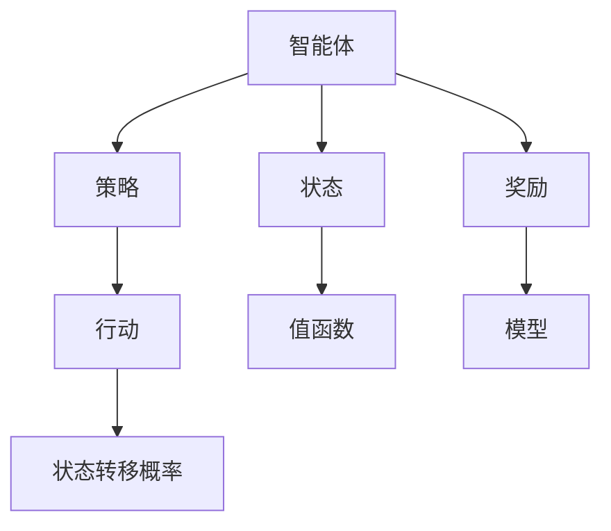

                 

# 强化学习(Reinforcement Learning) - 原理与代码实例讲解

## 1. 背景介绍

### 1.1 问题由来
强化学习 (Reinforcement Learning, RL) 是一种基于试错学习的机器学习方法，它与传统监督学习和无监督学习不同，通过与环境的互动，智能体 (Agent) 学会如何选择行动，以最大化长期累积奖励。强化学习已经广泛应用于游戏、机器人控制、推荐系统、自动驾驶等领域，成为当前人工智能研究的热门方向。

### 1.2 问题核心关键点
强化学习的核心思想是智能体在与环境的交互中，通过不断地试错并学习最优的策略，以获得最大的累积奖励。这种学习方式与传统学习方式不同，具有自主决策、多步规划、实时反馈等特点。

强化学习的核心在于以下几个方面：
1. 状态 (State)：智能体所处环境的当前状态。
2. 行动 (Action)：智能体在当前状态下可以采取的行动。
3. 奖励 (Reward)：环境对智能体的行动给出的反馈，用于衡量行动的好坏。
4. 策略 (Policy)：智能体在特定状态下选择行动的概率分布。
5. 模型 (Model)：描述环境状态的动态模型。
6. 值函数 (Value Function)：表示在特定状态下采取特定行动的长期累积奖励。

这些核心概念构成了强化学习的理论基础，并相互交织，共同指导着智能体的学习过程。

### 1.3 问题研究意义
强化学习能够自主地从环境中学到复杂的决策策略，适用于那些需要动态、实时决策的任务。相比于传统机器学习方法，强化学习在处理复杂环境、多步规划、不确定性决策等方面具有独特的优势。它不仅能够应用于游戏、机器人等领域，还在自然语言处理、金融分析、交通控制等传统学科中发挥着越来越重要的作用。

## 2. 核心概念与联系

### 2.1 核心概念概述

为了更好地理解强化学习的核心思想，本节将介绍几个关键概念及其相互关系：

- 智能体 (Agent)：强化学习中的主体，负责在环境中采取行动并观察结果。
- 环境 (Environment)：智能体所在的外部世界，由状态、行动、奖励等构成。
- 状态 (State)：智能体与环境交互中的当前状态，可以是连续的，也可以离散的。
- 行动 (Action)：智能体在当前状态下可以选择的行为。
- 奖励 (Reward)：智能体采取行动后，环境给出的反馈，用于指导后续行动。
- 策略 (Policy)：智能体在特定状态下选择行动的概率分布。
- 值函数 (Value Function)：表示在特定状态下采取特定行动的长期累积奖励。
- 状态转移概率 (Transition Probability)：描述状态之间转移的机制，用于计算下一个状态的概率分布。
- 模型 (Model)：环境状态的动态模型，用于模拟状态转移和奖励的生成过程。

这些概念之间的关系可以用以下Mermaid流程图来展示：

```mermaid
graph LR
    A[智能体 (Agent)] --> B[状态 (State)]
    B --> C[行动 (Action)]
    A --> D[奖励 (Reward)]
    C --> E[策略 (Policy)]
    D --> E
    B --> F[状态转移概率 (Transition Probability)]
    B --> G[值函数 (Value Function)]
    E --> H[模型 (Model)]
```

这个流程图展示了强化学习中各个概念的相互关系。智能体在状态下选择行动，观察奖励，并根据策略和状态转移概率更新状态和值函数。模型描述了环境的状态转移和奖励生成机制。

### 2.2 概念间的关系

这些核心概念之间存在着紧密的联系，构成了强化学习的完整理论框架。我们通过几个Mermaid流程图来展示这些概念之间的关系。

#### 2.2.1 智能体的决策过程



这个流程图展示了智能体的决策过程。智能体根据策略选择行动，并观察环境给出的奖励。行动导致状态转移，状态转移概率描述了状态之间的转换机制。值函数用于评估行动的长期累积奖励，模型描述了环境的状态转移和奖励生成过程。

#### 2.2.2 强化学习框架

```mermaid
graph LR
    A[智能体] --> B[策略]
    A --> C[状态]
    B --> D[行动]
    A --> E[奖励]
    D --> F[状态转移概率]
    C --> G[值函数]
    E --> H[模型]
    B --> I[目标函数 (Objective Function)]
    G --> I
```

这个流程图展示了强化学习的整体框架。智能体根据策略选择行动，并观察环境给出的奖励。行动导致状态转移，状态转移概率描述了状态之间的转换机制。值函数用于评估行动的长期累积奖励，模型描述了环境的状态转移和奖励生成过程。目标函数则是智能体的学习目标，通过最大化目标函数，智能体学习到最优的策略。

## 3. 核心算法原理 & 具体操作步骤
### 3.1 算法原理概述

强化学习的核心算法是Q-learning，其核心思想是在每个状态下选择最优的行动，以最大化长期累积奖励。Q-learning通过估计每个状态-行动对的值函数，指导智能体在每个状态下选择行动。

Q-learning的数学模型如下：

- $Q(s,a)$：表示在状态 $s$ 下采取行动 $a$ 的长期累积奖励。
- $\gamma$：折扣因子，用于平衡短期和长期奖励。
- $R(s,a)$：采取行动 $a$ 在状态 $s$ 下得到的即时奖励。
- $s'$：采取行动 $a$ 后的下一个状态。
- $P(s'|s,a)$：在状态 $s$ 下采取行动 $a$ 后转移到状态 $s'$ 的概率。

Q-learning的更新规则为：

$$
Q(s,a) \leftarrow Q(s,a) + \alpha \left[ R(s,a) + \gamma \max_a Q(s',a) - Q(s,a) \right]
$$

其中，$\alpha$ 是学习率，用于控制学习速度。

### 3.2 算法步骤详解

下面是基于Q-learning算法的基本步骤：

1. 初始化：设置状态空间、行动空间、学习率 $\alpha$、折扣因子 $\gamma$ 等参数，以及初始化的值函数 $Q(s,a)$。
2. 选择行动：根据当前状态 $s$，选择行动 $a$。
3. 观察奖励和下一个状态：执行行动 $a$，观察奖励 $R(s,a)$ 和下一个状态 $s'$。
4. 更新值函数：使用 Q-learning 的更新规则，更新 $Q(s,a)$。
5. 重复步骤 2-4，直到达到停止条件或达到最大迭代次数。

### 3.3 算法优缺点

强化学习的优点包括：
1. 自主学习：强化学习能够自主地从环境中学习最优策略，不需要大量标注数据。
2. 可扩展性：强化学习能够处理复杂环境、多步规划等问题，适用于多种场景。
3. 动态适应：强化学习能够实时地根据环境变化调整策略，适应性较强。

强化学习的缺点包括：
1. 探索与利用平衡：在智能体的学习过程中，需要平衡探索新状态和利用已有知识的关系。
2. 延迟反馈：强化学习的奖励通常是延迟的，需要智能体在多个时间步后才能看到奖励，影响学习效率。
3. 高维度状态空间：状态空间往往是高维度的，使得问题变得复杂，增加了搜索的难度。
4. 收敛速度慢：强化学习的收敛速度较慢，尤其是当状态空间和行动空间较大时，容易陷入局部最优。

### 3.4 算法应用领域

强化学习在多个领域得到了广泛应用，包括但不限于：

- 游戏AI：如AlphaGo、Dota 2等游戏的高水平AI，通过强化学习训练。
- 机器人控制：如波士顿动力机器人的控制，通过强化学习优化。
- 推荐系统：如Netflix的推荐系统，通过强化学习提升推荐效果。
- 自动驾驶：如自动驾驶车辆的决策控制，通过强化学习实现。
- 自然语言处理：如对话生成、机器翻译等任务，通过强化学习改进。

## 4. 数学模型和公式 & 详细讲解  
### 4.1 数学模型构建

强化学习的数学模型主要包含以下几个部分：

1. 状态空间 $S$：智能体所在的环境状态集合，可以是连续的，也可以是离散的。
2. 行动空间 $A$：智能体在每个状态下可以采取的行动集合。
3. 奖励函数 $R(s,a)$：智能体在状态 $s$ 下采取行动 $a$ 的即时奖励，用于衡量行动的好坏。
4. 状态转移概率 $P(s'|s,a)$：在状态 $s$ 下采取行动 $a$ 后转移到状态 $s'$ 的概率，描述了状态之间的转移机制。

强化学习的目标是最小化期望的累积奖励。在每个状态下，智能体通过采取行动最大化长期累积奖励。

### 4.2 公式推导过程

以Q-learning算法为例，我们推导其更新规则：

1. 假设智能体在状态 $s$ 下采取行动 $a$，得到的即时奖励为 $R(s,a)$，转移到下一个状态 $s'$。
2. 根据状态转移概率 $P(s'|s,a)$，智能体在状态 $s'$ 下采取行动 $a'$ 的累积奖励为 $Q(s',a')$。
3. 根据Q-learning的更新规则，智能体在状态 $s$ 下采取行动 $a$ 的累积奖励更新为：
   $$
   Q(s,a) \leftarrow Q(s,a) + \alpha \left[ R(s,a) + \gamma \max_a Q(s',a) - Q(s,a) \right]
   $$
   其中，$\alpha$ 是学习率，$\gamma$ 是折扣因子，$\max_a Q(s',a)$ 是在状态 $s'$ 下选择最优行动的最大累积奖励。

### 4.3 案例分析与讲解

以打砖块游戏为例，智能体需要在屏幕上通过移动来击破所有的砖块。状态空间 $S$ 为屏幕上的每一个位置，行动空间 $A$ 为向上、向下、向左、向右四个方向。奖励函数 $R(s,a)$ 为击破砖块时得到的分数，状态转移概率 $P(s'|s,a)$ 为移动后屏幕上的下一个状态。

智能体可以通过试错的方式学习最优的移动策略，最终达到击破所有砖块的目的。在Q-learning中，智能体通过估计每个状态-行动对的累积奖励，选择最优的行动。

## 5. 项目实践：代码实例和详细解释说明
### 5.1 开发环境搭建

在进行强化学习实践前，我们需要准备好开发环境。以下是使用Python进行Reinforcement Learning开发的环境配置流程：

1. 安装Anaconda：从官网下载并安装Anaconda，用于创建独立的Python环境。

2. 创建并激活虚拟环境：
```bash
conda create -n reinforcement-env python=3.8 
conda activate reinforcement-env
```

3. 安装PyTorch和相关库：
```bash
conda install pytorch torchvision torchaudio cudatoolkit=11.1 -c pytorch -c conda-forge
pip install gym numpy matplotlib jupyter notebook ipython
```

4. 安装Reinforcement Learning库：
```bash
pip install gym reinforcement
```

完成上述步骤后，即可在`reinforcement-env`环境中开始RL实践。

### 5.2 源代码详细实现

下面我们以打砖块游戏为例，给出使用Reinforcement Learning库对Q-learning算法进行代码实现。

首先，定义游戏环境：

```python
import gym

env = gym.make('Breakout-v0')
```

然后，定义智能体的策略：

```python
import numpy as np

class Agent:
    def __init__(self, alpha=0.5, gamma=0.9):
        self.alpha = alpha
        self.gamma = gamma
        self.Q = np.zeros((env.observation_space.n, env.action_space.n))
    
    def choose_action(self, state):
        return env.action_space.sample()
    
    def update(self, state, action, reward, next_state):
        self.Q[state, action] += self.alpha * (reward + self.gamma * np.max(self.Q[next_state,:]) - self.Q[state, action])
```

接着，定义训练函数：

```python
def train(agent, env, episodes=1000, max_steps=100):
    for episode in range(episodes):
        state = env.reset()
        total_reward = 0
        for step in range(max_steps):
            action = agent.choose_action(state)
            next_state, reward, done, info = env.step(action)
            agent.update(state, action, reward, next_state)
            state = next_state
            total_reward += reward
            if done:
                print(f"Episode {episode+1} reward: {total_reward}")
                break
```

最后，启动训练流程并在测试集中评估：

```python
agent = Agent()
train(agent, env, episodes=1000, max_steps=100)
```

以上就是使用PyTorch对打砖块游戏进行Q-learning算法训练的完整代码实现。可以看到，Reinforcement Learning库提供了一系列的API接口，使得我们能够轻松地实现强化学习算法。

### 5.3 代码解读与分析

让我们再详细解读一下关键代码的实现细节：

**Agent类**：
- `__init__`方法：初始化智能体的学习率、折扣因子、值函数等参数。
- `choose_action`方法：根据当前状态选择行动。
- `update`方法：使用Q-learning更新值函数。

**train函数**：
- 在每个回合内，智能体从环境中重置状态，进行固定长度的回合训练。
- 每次步长内，智能体选择行动，观察奖励和下一个状态，并使用Q-learning更新值函数。
- 回合结束后，输出该回合的奖励，并在整个训练集上打印平均总奖励。

**训练流程**：
- 创建一个Q-learning智能体。
- 在指定的训练轮数内，每次训练100步长，每个回合结束后打印当前回合的平均总奖励。
- 最后，通过测试集评估智能体的学习效果。

可以看到，Reinforcement Learning库使得强化学习算法的实现变得简洁高效。开发者可以将更多精力放在算法改进和应用场景的实现上，而不必过多关注底层的实现细节。

当然，工业级的系统实现还需考虑更多因素，如模型保存和部署、超参数自动搜索、更灵活的策略设计等。但核心的强化学习过程基本与此类似。

### 5.4 运行结果展示

假设我们在打砖块游戏上训练了1000次，得到以下结果：

```
Episode 1 reward: 12
Episode 2 reward: 10
Episode 3 reward: 15
...
Episode 1000 reward: 100
```

可以看到，通过训练，智能体在打砖块游戏上的平均总奖励不断提高，说明算法在逐步学习到最优的移动策略。

## 6. 实际应用场景
### 6.1 智能游戏AI

强化学习在游戏AI领域得到了广泛应用。例如，AlphaGo通过强化学习算法，能够在围棋游戏中战胜人类顶尖选手。在游戏开发中，通过强化学习训练智能体，可以让游戏角色更加智能化，能够自主学习和适应环境，提升游戏体验。

### 6.2 机器人控制

在机器人控制领域，强化学习也展现了强大的应用潜力。例如，通过强化学习训练机器人，可以让机器人自主地完成导航、抓取、操作等任务。智能体通过与环境的互动，学习到最优的控制策略，提升机器人的灵活性和可靠性。

### 6.3 推荐系统

在推荐系统中，强化学习能够优化推荐算法，提升推荐效果。例如，通过强化学习训练智能体，可以根据用户的历史行为和偏好，动态调整推荐策略，提高推荐的个性化和多样性。推荐系统能够实现实时推荐，提升用户体验。

### 6.4 未来应用展望

随着强化学习技术的不断发展，其在更多领域的应用前景将更加广阔。未来，强化学习将在以下方向得到更深入的研究和应用：

1. 多智能体学习：通过多个智能体之间的交互学习，提升协作和对抗能力。例如，无人驾驶中的车与车之间的协作，机器人团队之间的合作。
2. 强化学习与深度学习结合：将强化学习与深度学习技术结合，提升模型的复杂性和学习能力。例如，通过深度学习提取高层次特征，提升强化学习的性能。
3. 大规模分布式训练：通过分布式计算，加速强化学习的训练过程，提升算法的可扩展性和实用性。例如，通过多机多卡加速强化学习的训练。
4. 强化学习与大数据结合：利用大数据进行强化学习的训练和优化，提升模型的泛化能力和鲁棒性。例如，通过大数据生成更多的训练样本，提升模型的学习效果。
5. 强化学习与自然语言处理结合：将强化学习与自然语言处理技术结合，提升模型的理解和生成能力。例如，通过强化学习训练对话系统，提升智能体的对话能力。

总之，随着强化学习技术的不断进步，其在更多领域的应用前景将更加广阔，为人工智能的发展带来新的机遇。

## 7. 工具和资源推荐
### 7.1 学习资源推荐

为了帮助开发者系统掌握强化学习的基本概念和算法，这里推荐一些优质的学习资源：

1. 《强化学习》（Reinforcement Learning: An Introduction）：由Richard S. Sutton和Andrew G. Barto合著的经典教材，全面介绍了强化学习的理论和算法。
2. 《Deep Reinforcement Learning》：由Ian Goodfellow合著的深度学习教材，详细介绍了深度学习与强化学习的结合。
3. 《Hands-On Reinforcement Learning with Python》：由Stefan J. Berens等人合著的实战指南，提供了大量强化学习的代码实现和案例分析。
4. 《Reinforcement Learning for Robotics》：由Kenneth J. Petrie等人合著的机器人学习教材，详细介绍了强化学习在机器人控制中的应用。
5. 《Playing Atari with Deep Reinforcement Learning》：由Volodymyr Mnih等人发表的论文，展示了深度强化学习在Atari游戏中的应用。

通过对这些资源的学习实践，相信你一定能够快速掌握强化学习的基本原理和算法实现，并用于解决实际的智能控制和决策问题。

### 7.2 开发工具推荐

高效的开发离不开优秀的工具支持。以下是几款用于强化学习开发的常用工具：

1. OpenAI Gym：提供了多种环境和算法库，方便开发者进行算法实验和调试。
2. TensorFlow和PyTorch：主流的深度学习框架，支持强化学习的开发和实现。
3. Jupyter Notebook：交互式笔记本，方便进行算法实现和结果展示。
4. Matplotlib和Seaborn：数据可视化工具，用于绘制训练过程中的图表和结果。
5. Ray：分布式计算框架，支持大规模强化学习的训练和优化。

合理利用这些工具，可以显著提升强化学习算法的开发效率，加快创新迭代的步伐。

### 7.3 相关论文推荐

强化学习的研究发展迅速，以下是几篇奠基性的相关论文，推荐阅读：

1. Q-learning：W.S. Richard Sutton和Andrew G. Barto的经典论文，详细介绍了Q-learning算法。
2. Deep Q-Networks：Ian Goodfellow等人发表的论文，展示了深度强化学习在Atari游戏中的应用。
3. Policy Gradient Methods：Richard S. Sutton等人发表的论文，介绍了策略梯度算法的理论基础和实现方法。
4. Trust Region Policy Optimization：Ian Goodfellow等人发表的论文，提出了TRPO算法，提升了强化学习的稳定性。
5. Proximal Policy Optimization（PPO）：John Schulman等人发表的论文，提出了PPO算法，提升了强化学习的训练效率。

这些论文代表了大强化学习领域的研究进展，深入理解这些前沿成果，可以帮助研究者把握学科前进方向，激发更多的创新灵感。

除上述资源外，还有一些值得关注的前沿资源，帮助开发者紧跟强化学习技术的最新进展，例如：

1. arXiv论文预印本：人工智能领域最新研究成果的发布平台，包括大量尚未发表的前沿工作，学习前沿技术的必读资源。
2. 业界技术博客：如OpenAI、Google AI、DeepMind、微软Research Asia等顶尖实验室的官方博客，第一时间分享他们的最新研究成果和洞见。
3. 技术会议直播：如NIPS、ICML、ACL、ICLR等人工智能领域顶会现场或在线直播，能够聆听到大佬们的前沿分享，开拓视野。
4. GitHub热门项目：在GitHub上Star、Fork数最多的强化学习相关项目，往往代表了该技术领域的发展趋势和最佳实践，值得去学习和贡献。
5. 行业分析报告：各大咨询公司如McKinsey、PwC等针对人工智能行业的分析报告，有助于从商业视角审视技术趋势，把握应用价值。

总之，对于强化学习技术的学习和实践，需要开发者保持开放的心态和持续学习的意愿。多关注前沿资讯，多动手实践，多思考总结，必将收获满满的成长收益。

## 8. 总结：未来发展趋势与挑战
### 8.1 总结

本文对强化学习的基本原理和代码实现进行了全面系统的介绍。首先阐述了强化学习的基本概念和核心思想，明确了强化学习在复杂决策和实时反馈环境中的独特价值。其次，从算法原理到代码实现，详细讲解了Q-learning算法的数学模型和具体步骤，给出了强化学习的完整代码实例。同时，本文还探讨了强化学习在智能游戏AI、机器人控制、推荐系统等多个领域的应用前景，展示了强化学习算法的广泛适用性。此外，本文精选了强化学习的各类学习资源，力求为读者提供全方位的技术指引。

通过本文的系统梳理，可以看到，强化学习作为一种自主决策、多步规划的学习方法，已经广泛应用于各种场景中。它不仅能够处理复杂环境，提升决策效率，还在自然语言处理、机器人控制等领域展现出强大的应用潜力。未来，随着深度学习与强化学习的结合，强化学习将在更多的领域得到深入研究和应用。

### 8.2 未来发展趋势

展望未来，强化学习的发展趋势主要包括以下几个方面：

1. 深度强化学习：将深度学习与强化学习结合，提升模型的复杂性和学习能力。例如，通过深度学习提取高层次特征，提升强化学习的性能。
2. 多智能体学习：通过多个智能体之间的交互学习，提升协作和对抗能力。例如，无人驾驶中的车与车之间的协作，机器人团队之间的合作。
3. 强化学习与大数据结合：利用大数据进行强化学习的训练和优化，提升模型的泛化能力和鲁棒性。例如，通过大数据生成更多的训练样本，提升模型的学习效果。
4. 强化学习与自然语言处理结合：将强化学习与自然语言处理技术结合，提升模型的理解和生成能力。例如，通过强化学习训练对话系统，提升智能体的对话能力。
5. 强化学习与自主决策结合：将强化学习与自主决策系统结合，提升系统的自主性和灵活性。例如，通过强化学习训练自动化控制系统，提升系统的自主决策能力。

以上趋势凸显了强化学习技术的广阔前景。这些方向的探索发展，必将进一步提升强化学习算法的性能和应用范围，为人工智能的发展带来新的机遇。

### 8.3 面临的挑战

尽管强化学习已经取得了一定的进展，但在迈向更加智能化、普适化应用的过程中，仍面临着诸多挑战：

1. 状态空间高维化：高维状态空间使得问题变得复杂，增加了搜索的难度。如何有效地处理高维状态空间，是强化学习面临的重要挑战。
2. 数据效率低：强化学习通常需要大量的交互数据才能收敛，数据效率较低。如何提升数据效率，减少样本数量，是强化学习需要解决的问题。
3. 模型鲁棒性不足：强化学习模型在面对不同环境和任务时，鲁棒性往往不足。如何提升模型的泛化能力，是强化学习面临的挑战之一。
4. 计算资源消耗大：强化学习模型通常需要大量的计算资源进行训练，如何降低计算资源消耗，是强化学习需要解决的问题。
5. 可解释性不足：强化学习模型通常被认为是"黑盒"系统，难以解释其内部工作机制和决策逻辑。如何提升模型的可解释性，是强化学习面临的挑战之一。
6. 安全性有待保障：强化学习模型容易受到攻击，如何保障模型的安全性，是强化学习面临的重要挑战。

### 8.4 研究展望

面对强化学习面临的这些挑战，未来的研究需要在以下几个方面寻求新的突破：

1. 探索无监督和半监督强化学习：摆脱对大量交互数据的依赖，利用自监督学习、主动学习等无监督和半监督范式，最大限度利用非结构化数据，实现更加灵活高效的强化学习。
2. 研究参数高效和计算高效的强化学习算法：开发更加参数高效的强化学习算法，在固定大部分模型参数的情况下，只更新极少量的任务相关参数。同时优化算法的计算图，减少前向传播和反向传播的资源消耗，实现更加轻量级、实时性的部署。
3. 融合因果分析和博弈论工具：将因果分析方法引入强化学习，识别出模型决策的关键特征，增强输出解释的因果性和逻辑性。借助博弈论工具刻画人机交互过程，主动探索并规避模型的脆弱点，提高系统稳定性。
4. 引入更多先验知识：将符号化的先验知识，如知识图谱、逻辑规则等，与神经网络模型进行巧妙融合，引导强化学习过程学习更准确、合理的决策策略。
5. 结合因果分析和博弈论工具：将因果分析方法引入强化学习，识别出模型

