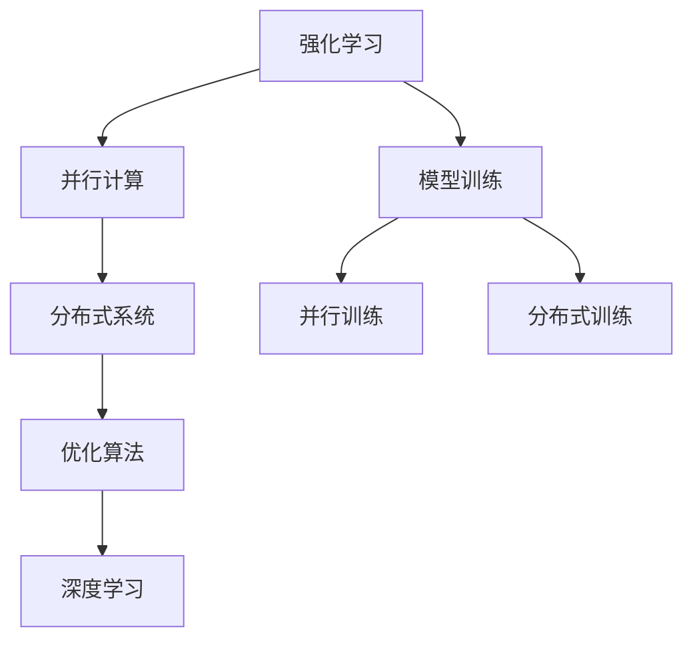
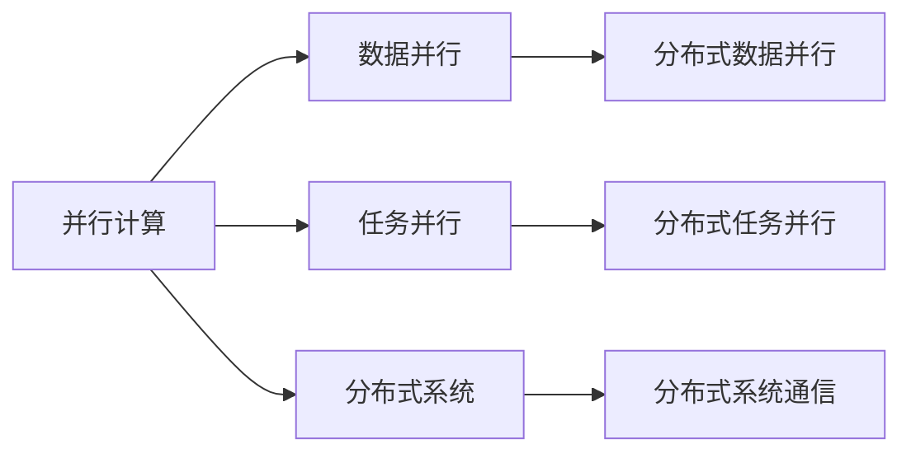
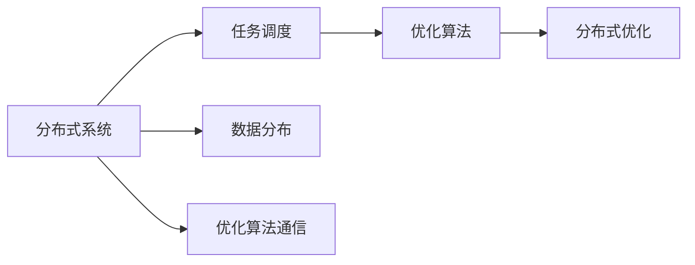
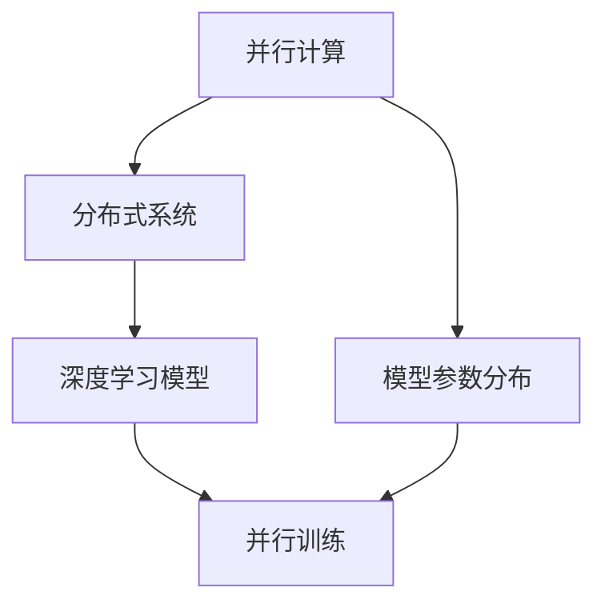
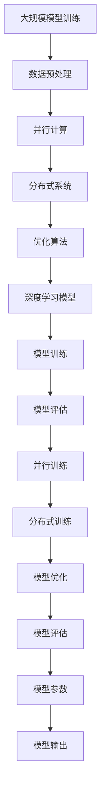

                 

# 强化学习Reinforcement Learning的并行与分布式实现方案

> 关键词：强化学习, 并行计算, 分布式系统, 优化算法, 深度学习, 强化学习框架

## 1. 背景介绍

### 1.1 问题由来
强化学习 (Reinforcement Learning, RL) 是一种通过与环境交互学习最优策略的机器学习方法。其在机器人控制、游戏AI、自动驾驶、资源调度等领域有着广泛的应用。随着强化学习模型的复杂度不断提高，训练这些模型对计算资源的需求也在增加，传统的串行训练方式无法满足需求。为了加速模型训练，提高训练效率，并行与分布式训练成为了研究的热点。

### 1.2 问题核心关键点
并行与分布式强化学习训练涉及的核心关键点包括：
- 并行策略设计：如何合理设计并行策略，以充分利用计算资源，提高训练效率。
- 分布式通信机制：如何在分布式系统中高效传递信息，减少通信开销，提高系统吞吐量。
- 优化算法设计：如何设计高效的优化算法，加快模型参数的收敛速度。
- 分布式优化同步：如何在分布式优化过程中保持各节点之间的一致性，避免模型参数的不一致性问题。
- 负载均衡：如何在分布式系统中均衡分配任务，避免某些节点过载。
- 可扩展性：如何在系统规模扩大的同时，保证性能不显著下降。

### 1.3 问题研究意义
研究并行与分布式强化学习训练，对于提升强化学习模型训练效率，加速模型应用落地具有重要意义：

1. 加速模型训练：并行与分布式训练可以在短时间内完成单机的训练任务，大幅提升训练速度。
2. 提高模型精度：并行与分布式训练可以在更大规模的数据集上训练模型，提高模型的泛化能力和精度。
3. 降低资源成本：并行与分布式训练可以利用多台计算机的资源，降低单个计算任务的硬件成本。
4. 应对复杂任务：强化学习模型在复杂任务上需要更多的计算资源和时间，并行与分布式训练可以有效应对。
5. 增强系统可靠性：分布式系统的高可用性可以降低单点故障的风险，提高系统的整体可靠性。

## 2. 核心概念与联系

### 2.1 核心概念概述

为更好地理解并行与分布式强化学习训练方法，本节将介绍几个密切相关的核心概念：

- 并行计算(Parallel Computing)：指在多台计算机上同时执行计算任务，以达到提高计算速度的目的。常见的并行计算方法包括数据并行、任务并行、分治法等。
- 分布式系统(Distributed System)：指由多个计算机节点组成的网络，通过网络通信实现数据的共享和协同计算。分布式系统通常包括数据分布、任务调度、通信机制等关键组件。
- 优化算法(Optimization Algorithm)：指在模型参数空间中搜索最优解的算法，如梯度下降、Adam等。
- 深度学习(Deep Learning)：指使用深度神经网络模型进行学习和预测的机器学习方法，与强化学习有诸多相似之处。
- 强化学习框架(Reinforcement Learning Framework)：指用于构建和管理强化学习模型的软件工具，提供模型构建、训练、评估等功能的封装。

这些核心概念之间的逻辑关系可以通过以下Mermaid流程图来展示：



这个流程图展示了这个过程中各个概念之间的联系：

1. 强化学习模型训练可以通过并行计算加速，利用多台计算机的计算资源。
2. 并行计算可以在分布式系统中实现，通过网络通信共享数据。
3. 分布式系统中的数据分布和任务调度可以由优化算法控制。
4. 强化学习模型可以与深度学习模型结合，利用深度神经网络进行学习。
5. 最终目标是通过这些技术，加速模型训练，提高模型精度和应用效率。

### 2.2 概念间的关系

这些核心概念之间存在着紧密的联系，形成了强化学习并行与分布式训练的完整生态系统。下面我通过几个Mermaid流程图来展示这些概念之间的关系。

#### 2.2.1 并行计算与分布式系统的关系



这个流程图展示并行计算与分布式系统之间的关系：

1. 并行计算可以通过数据并行和任务并行实现。
2. 数据并行和任务并行都可以通过分布式系统实现，通过网络通信传递数据。
3. 分布式系统可以通过不同的通信机制实现数据和任务的共享。

#### 2.2.2 分布式系统与优化算法的联系



这个流程图展示分布式系统与优化算法之间的关系：

1. 分布式系统通过任务调度控制任务的执行。
2. 优化算法可以在分布式系统中执行，通过任务调度分配任务。
3. 优化算法之间的通信也是分布式系统的重要组成部分。

#### 2.2.3 并行计算与深度学习的结合



这个流程图展示并行计算与深度学习模型之间的联系：

1. 并行计算可以通过分布式系统实现，将深度学习模型的参数分布到多个节点。
2. 深度学习模型可以在分布式系统中并行训练，提高训练速度。
3. 分布式系统中的数据分布和任务调度可以优化模型的并行训练过程。

### 2.3 核心概念的整体架构

最后，我们用一个综合的流程图来展示这些核心概念在大规模模型训练过程中的整体架构：



这个综合流程图展示了从数据预处理到模型输出的大规模模型训练过程：

1. 数据预处理：对大规模数据集进行预处理，如归一化、采样、切分等。
2. 并行计算：利用并行计算加速模型训练过程。
3. 分布式系统：通过分布式系统管理并行计算任务。
4. 优化算法：通过优化算法更新模型参数。
5. 深度学习模型：使用深度神经网络模型进行模型训练。
6. 模型训练：在深度学习模型上执行并行训练。
7. 模型评估：在评估数据集上评估模型性能。
8. 模型优化：根据评估结果优化模型参数。
9. 模型输出：得到优化后的模型，用于实际应用。

通过这个流程图，我们可以更清晰地理解并行与分布式强化学习训练过程中各个组件的作用，为后续深入讨论具体的训练方法和技术奠定基础。

## 3. 核心算法原理 & 具体操作步骤
### 3.1 算法原理概述

并行与分布式强化学习训练的原理是将强化学习模型的训练任务分解为多个子任务，在多台计算机上并行执行，以加速训练过程。其核心思想是通过并行计算和分布式系统，将计算任务分布到多个节点，每个节点负责计算模型的某个部分或某部分的数据。同时，通过优化算法控制模型的参数更新，以提高训练效率和模型精度。

形式化地，设强化学习模型为 $M$，训练数据集为 $D=\{(x_i,y_i)\}_{i=1}^N$，优化算法为 $A$。假设训练任务可以划分为 $K$ 个子任务，每个子任务在节点 $n$ 上执行。则并行与分布式训练的过程可以表示为：

$$
\min_{M} \sum_{k=1}^K \mathcal{L}(M,\{x_i,y_i\}_k)
$$

其中 $\mathcal{L}$ 为损失函数，用于衡量模型预测输出与真实标签之间的差异。

### 3.2 算法步骤详解

并行与分布式强化学习训练一般包括以下几个关键步骤：

**Step 1: 准备数据和计算资源**
- 收集并预处理大规模数据集，划分为训练集、验证集和测试集。
- 准备并配置计算资源，如CPU、GPU、网络带宽等。

**Step 2: 设计并行策略**
- 根据数据特性和计算资源，设计合理的并行策略。常见的策略包括数据并行、任务并行、分治法等。
- 设计并行训练的通信机制，如数据同步、模型同步等。

**Step 3: 设计分布式系统架构**
- 设计分布式系统的拓扑结构，包括数据分布和任务调度策略。
- 配置节点之间的通信机制，包括消息传递、数据传输等。

**Step 4: 实现优化算法**
- 选择合适的优化算法，如梯度下降、Adam等，设置相应的超参数。
- 实现分布式优化算法，如Spark、Horovod等，控制节点之间的通信和同步。

**Step 5: 执行并行训练**
- 将训练数据切分为多个子集，分配到不同的节点上进行并行训练。
- 在每个节点上执行分布式优化算法，更新模型参数。
- 周期性在验证集上评估模型性能，根据性能指标决定是否触发Early Stopping。
- 重复上述步骤直到满足预设的迭代轮数或Early Stopping条件。

**Step 6: 测试和部署**
- 在测试集上评估并行训练后模型，对比单节点训练的性能。
- 使用并行训练后的模型对新样本进行推理预测，集成到实际应用系统中。
- 持续收集新的数据，定期重新训练模型，以适应数据分布的变化。

以上是并行与分布式强化学习训练的一般流程。在实际应用中，还需要针对具体任务的特点，对训练过程的各个环节进行优化设计，如改进训练目标函数，引入更多的通信优化技术，搜索最优的超参数组合等，以进一步提升模型性能。

### 3.3 算法优缺点

并行与分布式强化学习训练具有以下优点：
1. 加速模型训练：通过并行计算和分布式系统，可以在短时间内完成大规模模型的训练任务。
2. 提高模型精度：在更大规模的数据集上训练模型，提高模型的泛化能力和精度。
3. 降低资源成本：利用多台计算机的资源，降低单个计算任务的硬件成本。
4. 应对复杂任务：强化学习模型在复杂任务上需要更多的计算资源和时间，并行与分布式训练可以有效应对。
5. 增强系统可靠性：分布式系统的高可用性可以降低单点故障的风险，提高系统的整体可靠性。

同时，该方法也存在一定的局限性：
1. 通信开销：并行和分布式训练需要频繁的通信，增加了通信开销。
2. 参数一致性：不同节点上的模型参数需要保持一致，否则可能会导致模型失效。
3. 系统设计复杂：并行与分布式训练系统设计复杂，需要考虑通信、同步、调度等多方面问题。
4. 可扩展性：系统的可扩展性可能受到硬件和软件限制。
5. 数据分布：数据分布不均可能导致某些节点的计算任务过多或过少。

尽管存在这些局限性，但就目前而言，并行与分布式强化学习训练方法仍是大规模模型训练的重要手段。未来相关研究的重点在于如何进一步降低通信开销，提高系统可靠性，优化系统设计，以及提高系统可扩展性。

### 3.4 算法应用领域

并行与分布式强化学习训练在许多领域都有广泛的应用：

- 游戏AI：在复杂的游戏中，如围棋、星际争霸等，并行与分布式训练可以大幅缩短训练时间，提升游戏AI的性能。
- 自动驾驶：在自动驾驶系统中，强化学习用于控制车辆行为，并行与分布式训练可以提高模型的决策速度和稳定性。
- 机器人控制：在机器人控制系统中，强化学习用于优化机器人行为，并行与分布式训练可以加速模型训练，提高控制精度。
- 金融预测：在金融预测系统中，强化学习用于预测股票价格、汇率等，并行与分布式训练可以处理大量历史数据，提高预测精度。
- 自然语言处理：在自然语言处理中，强化学习用于语言模型训练、文本生成等，并行与分布式训练可以提高模型性能，加速新语料的处理。
- 资源调度：在云计算、物联网等领域，强化学习用于资源调度优化，并行与分布式训练可以提高调度效率，降低资源成本。

除了上述这些经典应用外，并行与分布式强化学习训练也被创新性地应用到更多场景中，如智能推荐系统、个性化广告、智能供应链等，为人工智能技术带来了新的突破。随着预训练语言模型和微调方法的不断进步，相信并行与分布式强化学习训练技术也将不断拓展应用领域，为人工智能技术的发展注入新的动力。

## 4. 数学模型和公式 & 详细讲解  
### 4.1 数学模型构建

本节将使用数学语言对并行与分布式强化学习训练过程进行更加严格的刻画。

设强化学习模型为 $M_{\theta}:\mathcal{X} \rightarrow \mathcal{Y}$，其中 $\mathcal{X}$ 为输入空间，$\mathcal{Y}$ 为输出空间，$\theta \in \mathbb{R}^d$ 为模型参数。假设训练数据集为 $D=\{(x_i,y_i)\}_{i=1}^N$，其中 $x_i \in \mathcal{X}$ 为输入，$y_i \in \mathcal{Y}$ 为输出。

定义模型 $M_{\theta}$ 在数据样本 $(x,y)$ 上的损失函数为 $\ell(M_{\theta}(x),y)$，则在数据集 $D$ 上的经验风险为：

$$
\mathcal{L}(\theta) = \frac{1}{N} \sum_{i=1}^N \ell(M_{\theta}(x_i),y_i)
$$

并行与分布式训练的目标是最小化经验风险，即找到最优参数：

$$
\theta^* = \mathop{\arg\min}_{\theta} \mathcal{L}(\theta)
$$

在实践中，我们通常使用基于梯度的优化算法（如SGD、Adam等）来近似求解上述最优化问题。设 $\eta$ 为学习率，则参数的更新公式为：

$$
\theta \leftarrow \theta - \eta \nabla_{\theta}\mathcal{L}(\theta)
$$

其中 $\nabla_{\theta}\mathcal{L}(\theta)$ 为损失函数对参数 $\theta$ 的梯度，可通过反向传播算法高效计算。

### 4.2 公式推导过程

以下我们以二分类任务为例，推导梯度下降算法的数学过程。

假设模型 $M_{\theta}$ 在输入 $x$ 上的输出为 $\hat{y}=M_{\theta}(x) \in [0,1]$，表示样本属于正类的概率。真实标签 $y \in \{0,1\}$。则二分类交叉熵损失函数定义为：

$$
\ell(M_{\theta}(x),y) = -[y\log \hat{y} + (1-y)\log (1-\hat{y})]
$$

将其代入经验风险公式，得：

$$
\mathcal{L}(\theta) = -\frac{1}{N}\sum_{i=1}^N [y_i\log M_{\theta}(x_i)+(1-y_i)\log(1-M_{\theta}(x_i))]
$$

根据链式法则，损失函数对参数 $\theta_k$ 的梯度为：

$$
\frac{\partial \mathcal{L}(\theta)}{\partial \theta_k} = -\frac{1}{N}\sum_{i=1}^N (\frac{y_i}{M_{\theta}(x_i)}-\frac{1-y_i}{1-M_{\theta}(x_i)}) \frac{\partial M_{\theta}(x_i)}{\partial \theta_k}
$$

其中 $\frac{\partial M_{\theta}(x_i)}{\partial \theta_k}$ 可进一步递归展开，利用自动微分技术完成计算。

在得到损失函数的梯度后，即可带入参数更新公式，完成模型的迭代优化。重复上述过程直至收敛，最终得到适应下游任务的最优模型参数 $\theta^*$。

## 5. 项目实践：代码实例和详细解释说明
### 5.1 开发环境搭建

在进行并行与分布式强化学习训练实践前，我们需要准备好开发环境。以下是使用Python进行PyTorch开发的环境配置流程：

1. 安装Anaconda：从官网下载并安装Anaconda，用于创建独立的Python环境。

2. 创建并激活虚拟环境：
```bash
conda create -n pytorch-env python=3.8 
conda activate pytorch-env
```

3. 安装PyTorch：根据CUDA版本，从官网获取对应的安装命令。例如：
```bash
conda install pytorch torchvision torchaudio cudatoolkit=11.1 -c pytorch -c conda-forge
```

4. 安装相关库：
```bash
pip install gym gym-rl
pip install ray
```

完成上述步骤后，即可在`pytorch-env`环境中开始并行与分布式强化学习训练实践。

### 5.2 源代码详细实现

这里我们以分布式DQN为例，给出使用Ray分布式框架进行并行训练的PyTorch代码实现。

首先，定义DQN模型的代码：

```python
import torch
import torch.nn as nn
import torch.optim as optim
from torch.distributions import Categorical

class DQN(nn.Module):
    def __init__(self, input_dim, output_dim):
        super(DQN, self).__init__()
        self.fc1 = nn.Linear(input_dim, 64)
        self.fc2 = nn.Linear(64, 64)
        self.fc3 = nn.Linear(64, output_dim)

    def forward(self, x):
        x = F.relu(self.fc1(x))
        x = F.relu(self.fc2(x))
        x = self.fc3(x)
        return x

```

然后，定义DQN代理的代码：

```python
class DQNAgent:
    def __init__(self, model, device, optimizer):
        self.model = model
        self.optimizer = optimizer
        self.device = device
        self.memory = []

    def choose_action(self, state):
        state = torch.tensor(state, dtype=torch.float32).to(self.device)
        probs = self.model(state).softmax(dim=1)
        action = Categorical(probs).sample().item()
        return action

    def remember(self, state, action, reward, next_state, done):
        self.memory.append((state, action, reward, next_state, done))

    def act(self, epsilon):
        if np.random.rand() <= epsilon:
            return random.randrange(0, 4)
        else:
            return self.choose_action(state)

    def replay(self, batch_size):
        mini_batch = np.random.choice(len(self.memory), batch_size)
        for state, action, reward, next_state, done in mini_batch:
            state = torch.tensor(state, dtype=torch.float32).to(self.device)
            next_state = torch.tensor(next_state, dtype=torch.float32).to(self.device)
            target = reward + (0.99 if done else 0)
            q_values = self.model(state).gather(dim=1, index=torch.tensor([action]))
            target_q_values = self.model(next_state).detach().max(dim=1)[0]
            loss = F.mse_loss(q_values, target_q_values)
            self.optimizer.zero_grad()
            loss.backward()
            self.optimizer.step()
```

最后，定义并行训练的代码：

```python
from ray import tune
from ray.rllib.agents.ppo import PPOTrainer
from ray.rllib.examples.env.train import env

def train(env, model, optimizer, **kwargs):
    def get_env(env):
        env.seed(0)
        return env

    def get_agent(env):
        return PPOTrainer(env.observation_space, env.action_space, model, optimizer, **kwargs)

    def run_training(train_config):
        env_config = {"config": {"env": get_env, "exploration_config": {"type": "epsilon"}, "num_workers": 2, "evaluation_config": {"evaluation_interval": 100}}
        agent = get_agent(env)
        trainer = PPOTrainer(agent, **train_config)
        results = trainer.train(train_config)
        return results

    def experiment_train(trial):
        kwargs = {
            "num_workers": trial.config["num_workers"],
            "sgd_minibatch_size": trial.config["sgd_minibatch_size"],
            "sgd_learning_rate": trial.config["sgd_learning_rate"],
            "sgd_model_learning_rate": trial.config["sgd_model_learning_rate"],
            "sgd_optimizer": trial.config["sgd_optimizer"],
            "sgd_batch_mode": trial.config["sgd_batch_mode"]
        }
        results = run_training(env, model, optimizer, **kwargs)
        return results

    results = tune.run(experiment_train, config=tune.TuneConfig(num_samples=10))
    return results
```

完整代码如下：

```python
import gym
import numpy as np
import torch
import torch.nn as nn
import torch.optim as optim
from torch.distributions import Categorical
from ray import tune
from ray.rllib.agents.ppo import PPOTrainer

class DQN(nn.Module):
    def __init__(self, input_dim, output_dim):
        super(DQN, self).__init__()
        self.fc1 = nn.Linear(input_dim, 64)
        self.fc2 = nn.Linear(64, 64)
        self.fc3 = nn.Linear(64, output_dim)

    def forward(self, x):
        x = F.relu(self.fc1(x))
        x = F.relu(self.fc2(x))
        x = self.fc3(x)
        return x

class DQNAgent:
    def __init__(self, model, device, optimizer):
        self.model = model
        self.optimizer = optimizer
        self.device = device
        self.memory = []

    def choose_action(self, state):
        state = torch.tensor(state, dtype=torch.float32).to(self.device)
        probs = self.model(state).softmax(dim=1)
        action = Categorical(probs).sample().item()
        return action

    def remember(self, state, action, reward, next_state, done):
        self.memory.append((state, action, reward, next_state, done))

    def act(self, epsilon):
        if np.random.rand() <= epsilon:
            return random.randrange(0, 4)
        else:
            return self.choose_action(state)

    def replay(self, batch_size):
        mini_batch = np.random.choice(len(self.memory), batch_size)
        for state, action, reward, next_state, done in mini_batch:
            state = torch.tensor(state, dtype=torch.float32).to(self.device)
            next_state = torch.tensor(next_state, dtype=torch.float32).to(self.device)
            target = reward + (0.99 if done else 0)
            q_values = self.model(state).gather(dim=1, index=torch.tensor([action]))
            target_q_values = self.model(next_state).detach().max(dim=1)[0]
            loss = F.mse_loss(q_values, target_q_values)
            self.optimizer.zero_grad()
            loss.backward()
            self.optimizer.step()

def train(env, model, optimizer, **kwargs):
    def get_env(env):
        env.seed(0)
        return env

    def get_agent(env):
        return PPOTrainer(env.observation_space, env.action_space, model, optimizer, **kwargs)

    def run_training(train_config):
        env_config = {"config": {"env": get_env, "exploration_config": {"type": "epsilon"}, "num_workers": 2, "evaluation_config": {"evaluation_interval": 100}}
        agent = get_agent(env)
        trainer = PPOTrainer(agent, **train_config)
        results = trainer.train(train_config)
        return results

    def experiment_train(trial):
        kwargs = {
            "num_workers": trial.config["num_workers"],
            "sgd_minibatch_size": trial.config["sgd_minibatch_size"],
            "sgd_learning_rate": trial.config["sgd_learning_rate"],
            "sgd_model_learning_rate": trial.config["sgd_model_learning_rate"],
            "sgd_optimizer": trial.config["sgd_optimizer"],
            "sgd_batch_mode": trial.config["sgd_batch_mode"]
        }
        results = run_training(env, model, optimizer, **kwargs)
        return results

    results = tune.run(experiment_train, config=t

