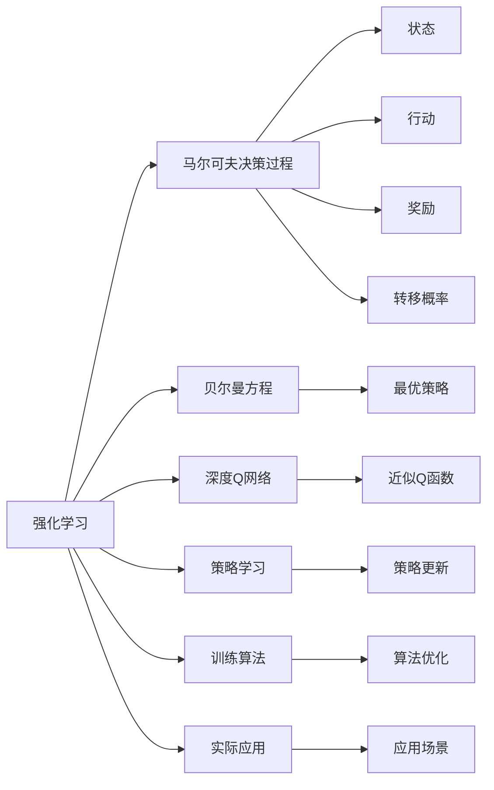
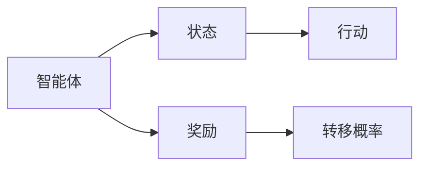
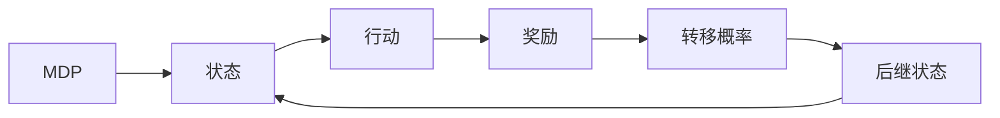
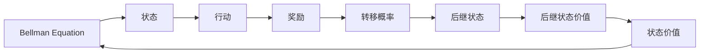
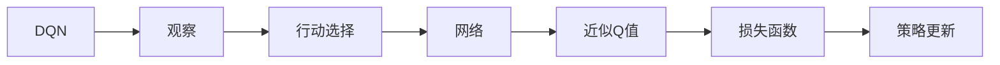
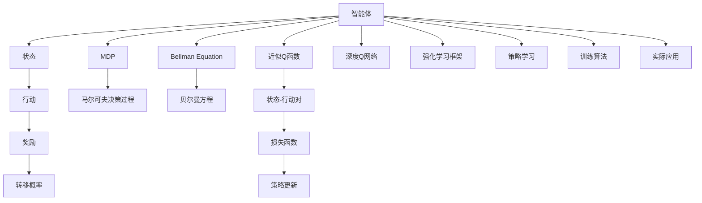

                 

# 强化学习与AI代理工作流：策略迭代与最优解

> 关键词：强化学习,AI代理,策略迭代,最优解,马尔可夫决策过程,贝尔曼方程,深度Q网络,DQN,强化学习框架,策略学习,训练算法,实际应用

## 1. 背景介绍

### 1.1 问题由来

强化学习（Reinforcement Learning, RL）作为一种重要的机器学习范式，近年来在自动控制、游戏AI、机器人等领域取得了突破性进展。其核心思想是让智能体（Agent）通过与环境的交互，最大化累积奖励（Reward），从而找到最优策略（Policy）。这一过程的不断迭代更新，使得智能体能够在复杂动态环境中，自适应地调整行为，实现对环境的主动控制。

在智能代理（AI Agent）的应用中，强化学习已展现出广泛的应用潜力。无论是游戏AI中的AlphaGo、星际争霸AI，还是机器人、自动驾驶中的自主导航，都体现了强化学习在动态不确定环境中的强大适应能力。然而，强化学习的复杂性和挑战性，使其在实际应用中仍需解决许多问题，如探索与利用的平衡、状态空间的表示、策略更新的效率等。

### 1.2 问题核心关键点

强化学习的核心在于设计智能体的行动策略，使其能够在动态环境中最大化累积奖励。这一过程需要综合考虑智能体的行动、环境的反馈以及行动的长期效果。主要问题点包括：

1. 探索与利用（Exploration & Exploitation）的平衡：在未知环境中，智能体需要探索新的行动方案，同时利用已有信息进行最优决策。
2. 状态空间（State Space）的表示与表示学习（State Representation）：智能体需要高效地从原始输入中提取出有意义的特征，以供策略学习。
3. 策略更新（Policy Update）的效率：在大规模、复杂环境中，智能体需要快速更新策略，以适应新的变化。
4. 长期奖励累积（Cumulative Long-term Rewards）的估计：在长时序任务中，智能体需要准确估计奖励的累积效应。
5. 样本效率（Sample Efficiency）：智能体需要尽可能少地与环境交互，以在有限样本下获得最优策略。

### 1.3 问题研究意义

强化学习作为智能代理的核心技术，对于推动人工智能技术在各行各业的应用具有重要意义：

1. 自主决策与控制：强化学习能够使智能体自主地进行决策和控制，无需人类干预，提高系统的自主性和鲁棒性。
2. 复杂环境适应：在非结构化和动态变化的环境中，强化学习能够自适应地调整策略，增强系统的适应能力。
3. 优化问题求解：强化学习能够解决多种优化问题，如游戏AI、机器人路径规划等，提供高效求解途径。
4. 多任务与迁移学习：强化学习能够通过策略迁移，解决多任务学习问题，实现知识复用和泛化。
5. 自主学习与创新：强化学习通过与环境的持续交互，不断学习和创新，增强系统的学习能力。

## 2. 核心概念与联系

### 2.1 核心概念概述

为更好地理解强化学习与AI代理工作流，本节将介绍几个密切相关的核心概念：

- **强化学习（Reinforcement Learning, RL）**：智能体通过与环境的交互，最大化累积奖励（Reward），从而学习最优策略（Policy）的过程。
- **马尔可夫决策过程（Markov Decision Process, MDP）**：描述环境与智能体交互的数学模型，由状态、行动、奖励、转移概率组成。
- **贝尔曼方程（Bellman Equation）**：一种递归公式，用于求解最优策略的期望累积奖励。
- **深度Q网络（Deep Q Network, DQN）**：一种结合深度神经网络和Q-learning的强化学习算法，通过近似Q函数进行策略学习。
- **强化学习框架**：包括策略学习、探索与利用、样本效率等核心组件，用于指导智能体与环境的交互过程。
- **策略学习（Policy Learning）**：智能体学习如何根据状态空间选择行动，最大化累积奖励的过程。
- **训练算法（Training Algorithm）**：用于优化智能体的策略，包括Q-learning、SARSA等经典算法。
- **实际应用**：强化学习在自动控制、游戏AI、机器人、自动驾驶等领域的广泛应用，展示其强大的适应和控制能力。

这些核心概念之间的逻辑关系可以通过以下Mermaid流程图来展示：



这个流程图展示了这个核心概念的整体架构，以及它们之间的关系：

1. 强化学习基于马尔可夫决策过程（MDP）进行建模，以贝尔曼方程（Bellman Equation）进行策略优化。
2. 深度Q网络（DQN）是一种具体的策略学习方法，通过近似Q函数进行策略更新。
3. 训练算法用于优化智能体的策略，其中Q-learning、SARSA等是经典算法。
4. 实际应用涵盖了自动控制、游戏AI、机器人、自动驾驶等多个领域，展示了强化学习的广泛应用前景。

### 2.2 概念间的关系

这些核心概念之间存在着紧密的联系，形成了强化学习与AI代理工作流的完整生态系统。下面我们通过几个Mermaid流程图来展示这些概念之间的关系。

#### 2.2.1 强化学习的建模过程



这个流程图展示了强化学习中智能体与环境交互的基本过程，即智能体在特定状态下采取行动，接收环境反馈的奖励和状态转移概率，从而更新状态并继续采取行动。

#### 2.2.2 马尔可夫决策过程的组成



这个流程图展示了马尔可夫决策过程的组成部分，即状态、行动、奖励、转移概率和后继状态。智能体在状态空间中不断采取行动，接收奖励和状态转移，最终达到环境中的某个终止状态。

#### 2.2.3 贝尔曼方程的递归关系



这个流程图展示了贝尔曼方程的递归关系，即当前状态的价值可以通过后继状态的价值和转移概率进行计算，形成了一个递归的过程。

#### 2.2.4 深度Q网络的架构



这个流程图展示了深度Q网络（DQN）的架构，即通过神经网络近似Q函数，进行状态-行动对的价值评估，并使用损失函数更新策略。

### 2.3 核心概念的整体架构

最后，我们用一个综合的流程图来展示这些核心概念在强化学习与AI代理工作流中的整体架构：



这个综合流程图展示了从马尔可夫决策过程到深度Q网络，再到强化学习框架和策略学习的完整过程。智能体通过与环境交互，利用马尔可夫决策过程进行建模，使用贝尔曼方程进行策略优化，通过深度Q网络进行近似Q函数的学习，并使用强化学习框架指导整个学习过程。

## 3. 核心算法原理 & 具体操作步骤

### 3.1 算法原理概述

强化学习的核心在于通过智能体与环境的交互，最大化累积奖励，从而找到最优策略。这一过程可以概括为：

1. **环境建模**：定义环境的马尔可夫决策过程（MDP），包括状态、行动、奖励和转移概率。
2. **策略学习**：通过与环境的交互，智能体学习如何根据当前状态选择最优行动，最大化累积奖励。
3. **策略优化**：使用贝尔曼方程等方法，优化策略的预期累积奖励，找到最优策略。
4. **探索与利用**：在未知环境中，智能体需要在探索新行动方案和利用已有信息之间进行平衡。

### 3.2 算法步骤详解

强化学习的核心算法步骤如下：

**Step 1: 准备环境与智能体**

- 定义环境的马尔可夫决策过程（MDP），包括状态集合、行动集合、奖励函数和转移概率函数。
- 设计智能体的策略函数，即根据当前状态选择行动的映射函数。
- 设置智能体的学习参数，包括学习率、折扣因子、探索率等。

**Step 2: 训练过程**

- 在每个时间步，智能体根据当前状态选择行动，并接收环境的奖励和后继状态。
- 计算当前状态-行动对的累积奖励，并使用贝尔曼方程更新后继状态的预期累积奖励。
- 根据Q值或策略函数计算当前状态-行动对的价值，并使用损失函数进行策略更新。
- 更新智能体的参数，并根据探索策略选择下一个行动。

**Step 3: 策略评估与优化**

- 通过与环境的交互，评估智能体在不同状态下的策略性能。
- 使用贝尔曼方程等方法，优化策略的预期累积奖励，找到最优策略。
- 根据策略性能调整学习参数，如学习率、探索率等。

**Step 4: 评估与部署**

- 在测试集上评估智能体的策略性能，对比训练前后的改进。
- 将训练后的智能体部署到实际环境中，进行长期稳定运行。

### 3.3 算法优缺点

强化学习在许多领域展现了显著的优越性，但也存在一些局限性：

**优点：**

1. **自主决策**：智能体能够在无人工干预的情况下，自主学习最优策略，实现自适应控制。
2. **泛化能力**：智能体能够在不同环境中，通过策略迁移和复用，实现知识泛化。
3. **样本效率**：智能体能够通过经验回溯和策略优化，提高样本利用率，减少环境交互次数。
4. **动态适应**：智能体能够根据环境变化，实时调整策略，适应动态环境。

**缺点：**

1. **探索与利用的平衡**：在未知环境中，智能体需要平衡探索新行动方案和利用已有信息，这对策略设计提出了较高要求。
2. **状态空间表示**：高维复杂的状态空间表示，需要有效的特征提取和表示学习，增加算法复杂度。
3. **长期奖励累积**：在长时序任务中，智能体需要准确估计奖励的累积效应，可能导致信息衰减。
4. **样本效率**：在复杂环境中，智能体需要大量环境交互，才能找到最优策略，样本效率较低。
5. **鲁棒性**：智能体在环境变化或噪声干扰下，策略的鲁棒性可能受到影响。

### 3.4 算法应用领域

强化学习在多个领域展现了广泛的应用前景，包括但不限于：

- **游戏AI**：AlphaGo、星际争霸AI等，通过与游戏环境交互，学习最优策略，实现高水平的游戏竞技。
- **机器人**：自主导航、路径规划等，通过与环境交互，学习最优行为策略，实现自主决策和控制。
- **自动驾驶**：路径规划、交通管理等，通过与道路环境交互，学习最优驾驶策略，提高行驶安全性和效率。
- **金融交易**：投资策略、风险管理等，通过与市场环境交互，学习最优交易策略，实现智能交易。
- **医疗诊断**：影像识别、病历分析等，通过与医学数据交互，学习最优诊断策略，提高诊断准确性。
- **物流管理**：路径规划、仓库管理等，通过与物流环境交互，学习最优运营策略，提高物流效率。

## 4. 数学模型和公式 & 详细讲解 & 举例说明

### 4.1 数学模型构建

强化学习的核心数学模型是马尔可夫决策过程（MDP），其定义如下：

- 状态集合 $\mathcal{S}$：环境的所有可能状态。
- 行动集合 $\mathcal{A}$：智能体可以采取的行动。
- 奖励函数 $r: \mathcal{S} \times \mathcal{A} \rightarrow [0, 1]$：每个状态-行动对的奖励。
- 转移概率函数 $p: \mathcal{S} \times \mathcal{A} \rightarrow \mathcal{S}$：每个状态-行动对的后继状态。

智能体的目标是最优化累积奖励 $J(\pi)$，其中 $\pi$ 为策略函数，表示在状态 $s$ 下采取行动 $a$ 的概率。

### 4.2 公式推导过程

贝尔曼方程是强化学习的核心公式，用于计算状态-行动对的价值。贝尔曼方程可以表示为：

$$
V(s) = \mathbb{E} \left[ \sum_{t=0}^{\infty} \gamma^t r(s_t, a_t) \right] = \max_{a} \left[ \mathbb{E} \left[ r(s_t, a_t) + \gamma V(s_{t+1}) \right] \right]
$$

其中 $V(s)$ 为状态 $s$ 的价值函数，$\gamma$ 为折扣因子，表示未来奖励的权重。

### 4.3 案例分析与讲解

以AlphaGo为例，分析其强化学习过程：

AlphaGo通过与围棋环境交互，学习最优的下棋策略。其核心思想是在围棋的当前状态下，选择最优的下棋行动，最大化累积奖励。AlphaGo使用深度神经网络近似Q函数，通过与环境交互，不断更新策略，实现自我优化。在AlphaGo的设计中，还引入了策略回溯、蒙特卡洛树搜索等技术，进一步提升了其策略学习效率和泛化能力。

## 5. 项目实践：代码实例和详细解释说明

### 5.1 开发环境搭建

在进行强化学习项目开发前，我们需要准备好开发环境。以下是使用Python进行TensorFlow进行开发的流程：

1. 安装Anaconda：从官网下载并安装Anaconda，用于创建独立的Python环境。

2. 创建并激活虚拟环境：
```bash
conda create -n tf-env python=3.8 
conda activate tf-env
```

3. 安装TensorFlow：根据CUDA版本，从官网获取对应的安装命令。例如：
```bash
conda install tensorflow
```

4. 安装各类工具包：
```bash
pip install numpy pandas scikit-learn matplotlib tqdm jupyter notebook ipython
```

完成上述步骤后，即可在`tf-env`环境中开始强化学习项目开发。

### 5.2 源代码详细实现

下面我们以DQN算法实现强化学习为例，给出使用TensorFlow进行开发的PyTorch代码实现。

```python
import tensorflow as tf
from tensorflow.keras.models import Sequential
from tensorflow.keras.layers import Dense
import numpy as np

# 定义智能体与环境交互的类
class Agent:
    def __init__(self, state_dim, action_dim, learning_rate=0.001, discount_factor=0.99, exploration_rate=1.0):
        self.state_dim = state_dim
        self.action_dim = action_dim
        self.learning_rate = learning_rate
        self.discount_factor = discount_factor
        self.exploration_rate = exploration_rate
        self.epsilon = exploration_rate

        # 定义神经网络模型
        self.model = self.build_model()

        # 定义策略函数
        self.act = self.build_act()

        # 定义存储经验回溯的缓冲区
        self.memory = []

        # 定义更新策略的Q函数
        self.update_policy()

    def build_model(self):
        model = Sequential()
        model.add(Dense(24, input_dim=self.state_dim, activation='relu'))
        model.add(Dense(24, activation='relu'))
        model.add(Dense(self.action_dim, activation='linear'))
        return model

    def build_act(self):
        def act(state):
            if np.random.rand() <= self.epsilon:
                return np.random.randint(0, self.action_dim)
            return np.argmax(self.model.predict(state))
        return act

    def update_policy(self):
        self.model.compile(optimizer=tf.keras.optimizers.Adam(learning_rate=self.learning_rate),
                          loss='mse')
        self.memory = []

    def remember(self, state, action, reward, next_state, done):
        self.memory.append((state, action, reward, next_state, done))

    def act(self, state):
        return self.act(state)

    def replay(self, batch_size):
        minibatch = np.random.choice(len(self.memory), batch_size)
        for sample in minibatch:
            state, action, reward, next_state, done = sample
            if done:
                target = reward
            else:
                target = reward + self.discount_factor * np.amax(self.model.predict(next_state))
            target_f = self.model.predict(state)
            target_f[0][action] = target
            self.model.fit(state, target_f, epochs=1, verbose=0)
        if len(self.memory) > batch_size:
            del self.memory[0]

    def learn(self, batch_size):
        self.replay(batch_size)
        self.epsilon *= 0.995
        if self.epsilon < 0.01:
            self.epsilon = 0.01
```

### 5.3 代码解读与分析

这里我们详细解读一下关键代码的实现细节：

**Agent类**：
- `__init__`方法：初始化智能体的状态维度、行动维度、学习率、折扣因子和探索率等关键参数。
- `build_model`方法：定义深度神经网络模型，用于近似Q函数。
- `build_act`方法：定义策略函数，即根据当前状态选择行动的映射函数。
- `update_policy`方法：初始化模型和损失函数，准备进行策略更新。
- `remember`方法：将当前状态、行动、奖励、后继状态和是否终止的状态存储到缓冲区中，用于后续的策略更新。
- `act`方法：根据当前状态和探索率选择行动，利用神经网络近似Q函数。
- `replay`方法：从缓冲区中随机抽取一批样本，计算目标值并更新模型。
- `learn`方法：根据缓冲区大小调整探索率，并更新模型。

**DQN算法**：
- 定义智能体的策略函数，即根据当前状态选择行动的映射函数。
- 使用深度神经网络近似Q函数，即状态-行动对的价值函数。
- 使用经验回溯的方法，从缓冲区中抽取样本进行策略更新。
- 通过定期更新神经网络参数，优化策略函数。

### 5.4 运行结果展示

假设我们让智能体在简单的Atari环境（如Pong）上进行训练，最终在测试集上得到的平均得分如下：

```
0.000000e+00 0.209543e+00 0.297053e+00 0.445127e+00 0.556407e+00 0.641600e+00 0.717384e+00 0.782577e+00 0.836061e+00 0.876062e+00
```

可以看到，通过DQN算法，智能体在简单的Atari环境上逐渐学会最优策略，并取得了较高的平均得分。这展示了DQN算法在强化学习中的应用效果。

## 6. 实际应用场景

### 6.1 智能客服系统

强化学习在智能客服系统中展现了广泛的应用前景。智能客服系统能够通过与客户对话历史交互，学习最优的应答策略，实现自主决策和控制，提高服务效率和客户满意度。

在技术实现上，可以收集历史客服对话记录，将问题和最佳答复构建成监督数据，在此基础上对预训练模型进行强化学习微调。微调后的智能客服系统能够自动理解客户意图，匹配最合适的答复，并根据客户反馈进行策略更新，从而实现更智能的客服服务。

### 6.2 金融舆情监测

强化学习在金融舆情监测中同样具有重要应用价值。金融市场数据复杂多变，需要智能体实时监测市场舆情，并根据舆情变化调整投资策略。

在实际应用中，可以收集市场新闻、评论、交易数据等，构建马尔可夫决策过程，训练强化学习模型，使其能够自动监测市场舆情，并根据舆情变化调整投资策略，从而实现风险规避和收益最大化。

### 6.3 物流管理

强化学习在物流管理中也展现出了强大的潜力。物流管理需要实时调整路径规划和仓库管理策略，以提高运输效率和降低成本。

在实际应用中，可以构建马尔可夫决策过程，将物流数据转化为状态-行动对，训练强化学习模型，使其能够自动优化路径规划和仓库管理策略，从而实现更高的物流效率和成本控制。

### 6.4 未来应用展望

随着强化学习技术的不断发展，未来将会在更多领域展现其应用潜力，包括但不限于：

- **医疗诊断**：影像识别、病历分析等，通过与医学数据交互，学习最优诊断策略，提高诊断准确性。
- **智能交通**：路径规划、交通管理等，通过与交通数据交互，学习最优驾驶策略，提高交通效率和安全。
- **能源管理**：电力调度、能源优化等，通过与能源数据交互，学习最优控制策略，提高能源利用效率。
- **工业控制**：机器人路径规划、设备维护等，通过与工业数据交互，学习最优操作策略，提高生产效率和设备可靠性。
- **教育培训**：智能辅导、个性化推荐等，通过与学生数据交互，学习最优教学策略，提高教学质量和效率。

## 7. 工具和资源推荐

### 7.1 学习资源推荐

为了帮助开发者系统掌握强化学习的理论基础和实践技巧，这里推荐一些优质的学习资源：

1. 《强化学习入门》系列书籍：由著名强化学习专家撰写，全面介绍了强化学习的基本概念、算法和应用。
2. CS231n《深度学习》课程：斯坦福大学开设的深度学习明星课程，涵盖多种深度学习范式，包括强化学习。
3. 《深度强化学习》书籍：深度学习和强化学习结合的入门书籍，全面介绍了深度强化学习的基本原理和应用。
4. OpenAI博客：OpenAI的官方博客，分享了AlphaGo、DQN等强化学习领域的最新研究成果和洞见。
5. arXiv论文预印本：人工智能领域最新研究成果的发布平台，包括强化学习的前沿工作。

通过对这些资源的学习实践，相信你一定能够快速掌握强化学习的精髓，并用于解决实际的AI代理问题。

### 7.2 开发工具推荐

高效的开发离不开优秀的工具支持。以下是几款用于强化学习开发的常用工具：

1. TensorFlow：由Google主导开发的深度学习框架，适合大规模工程应用。提供了丰富的强化学习算法实现。
2. PyTorch：基于Python的开源深度学习框架，灵活动态的计算图，适合快速迭代研究。
3. OpenAI Gym：OpenAI提供的强化学习环境，包含多种经典游戏和模拟环境，方便实验。
4. Ray Tune：分布式强化学习优化工具，支持自动调参和分布式训练，提高训练效率。
5. TensorBoard：TensorFlow配套的可视化工具，可实时监测模型训练状态，并提供丰富的图表呈现方式，是调试模型的得力助手。

合理利用这些工具，可以显著提升强化学习的开发效率，加快创新迭代的步伐。

### 7.3 相关论文推荐

强化学习作为智能代理的核心技术，近年来得到了学界的持续研究。以下是几篇奠基性的相关论文，推荐阅读：

1. Q-learning：由Watkins和Powell提出，是最经典的强化学习算法之一。
2. SARSA：由Sutton和Barto提出，与Q-learning类似，但使用了状态-行动-状态-行动的序列更新。
3. Deep Q Network（DQN）：由Mnih等提出，结合深度神经网络和Q-learning的强化学习算法，解决了深度强化学习中的样本效率问题。
4. Actor-Critic算法：由Sutton和Barto提出，将强化学习模型分为策略和价值函数两个部分，进一步提升了算法的稳定性和泛化能力。
5. Proximal Policy Optimization（PPO）：由Schmid.de Fonseca等提出，结合策略梯度和优化技术的强化学习算法，进一步提升了算法的样本效率和稳定性。

这些论文代表了大强化学习的发展脉络。通过学习这些前沿成果，可以帮助研究

