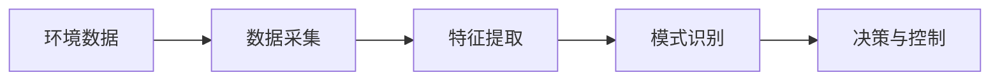
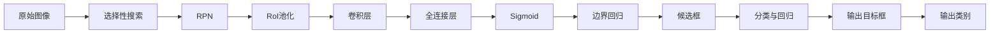

                 

# 感知（Perception）是指Agent从环境中收集信息并从中提取相关知识的能力

感知是人工智能（AI）的核心能力之一，是使机器能够理解并处理复杂环境的基础。在本博客中，我们将探讨感知的基本概念、核心算法、操作步骤，以及其在实际应用中的运用和未来发展趋势。

## 1. 背景介绍

### 1.1 问题由来

感知作为人工智能的关键任务，其重要性不言而喻。然而，在过去，感知技术常常被视为计算机视觉和自然语言处理等特定领域的专有技术，未被广泛理解与应用。近年来，随着深度学习和大数据技术的发展，感知技术逐渐成熟并推广到更广泛的领域，成为人工智能不可或缺的一部分。

### 1.2 问题核心关键点

感知技术的核心在于其能够从环境中的大量数据中提取有用的信息，并以结构化的形式输出。其关键点包括：

- 数据采集：感知系统必须能够有效且高效地收集环境数据。
- 特征提取：感知系统应能自动提取和选择与任务相关的特征。
- 模式识别：感知系统应能识别并分类环境中的模式，以适应不同的任务。
- 输出生成：感知系统需将提取的信息转化为结构化数据，用于决策或控制。

## 2. 核心概念与联系

### 2.1 核心概念概述

- **感知（Perception）**：是指Agent从环境中收集信息并从中提取相关知识的能力。
- **数据采集（Data Collection）**：是感知系统的第一步，通过各种传感器获取环境数据。
- **特征提取（Feature Extraction）**：通过算法分析数据，提取出有用的特征。
- **模式识别（Pattern Recognition）**：将特征与预定义的类别或模型进行匹配，识别环境中的模式。
- **决策与控制（Decision and Control）**：基于模式识别的结果，做出决策或控制动作。

### 2.2 概念间的关系

感知系统的工作流程可以通过以下Mermaid流程图来展示：



这个流程图展示了感知系统从数据采集到决策与控制的完整流程，其中数据采集、特征提取、模式识别和决策与控制是感知系统的核心组成部分。

## 3. 核心算法原理 & 具体操作步骤

### 3.1 算法原理概述

感知系统的算法原理主要基于统计学习和深度学习，通过训练数据集来识别模式和提取特征。常见的感知算法包括：

- **卷积神经网络（CNN）**：用于图像处理和计算机视觉任务。
- **循环神经网络（RNN）**：用于序列数据处理，如语音识别和自然语言处理。
- **强化学习（RL）**：用于在动态环境中进行决策和控制。

### 3.2 算法步骤详解

以卷积神经网络（CNN）为例，其步骤包括：

1. **数据准备**：收集和标注训练数据集，如图像和标签。
2. **模型构建**：设计CNN网络结构，包括卷积层、池化层和全连接层。
3. **模型训练**：使用训练数据集训练模型，最小化损失函数。
4. **模型评估**：在验证集上评估模型性能，调整超参数。
5. **模型应用**：在测试集上测试模型性能，并应用于实际任务。

### 3.3 算法优缺点

CNN的优点包括：

- **自动特征提取**：无需手动设计特征提取器，能自动学习输入数据的特征。
- **参数共享**：卷积核在不同位置和层中共享，减少模型参数量。
- **并行计算**：卷积操作可并行计算，加快训练和推理速度。

其缺点包括：

- **参数量多**：大型CNN需要大量参数，可能过拟合。
- **局部性假设**：CNN假设局部区域的相关性，难以捕捉全局信息。
- **需要大量标注数据**：训练大型CNN需要大量标注数据，成本高。

### 3.4 算法应用领域

CNN已广泛应用于计算机视觉、图像处理、医疗影像分析等领域，如目标检测、人脸识别、医学影像诊断等。RNN则用于自然语言处理和语音识别任务，如机器翻译、文本生成、语音识别等。

## 4. 数学模型和公式 & 详细讲解 & 举例说明

### 4.1 数学模型构建

以CNN为例，其数学模型构建如下：

$$
y = \sigma(\text{Conv}(\text{Relu}(\text{Conv}(x; \theta_1)), \theta_2) + \text{FC}(\text{Relu}(\text{MaxPool}(\text{Conv}(x; \theta_1)), \theta_3))
$$

其中，$y$为输出，$x$为输入，$\theta_i$为各层参数，$\sigma$为激活函数，$\text{Conv}$为卷积操作，$\text{Relu}$为ReLU激活函数，$\text{MaxPool}$为最大池化操作，$\text{FC}$为全连接层。

### 4.2 公式推导过程

以目标检测为例，目标检测模型通常采用两阶段方法，如Faster R-CNN：

1. **感兴趣区域（ROI）提取**：通过CNN提取图像中的候选区域。
2. **分类与回归**：对每个候选区域进行分类和边界回归。

假设$N$为候选区域数，$C$为类别数，$x_i$为第$i$个候选区域的特征向量，$y_i$为第$i$个候选区域的标签（0或1，0为背景，1为前景）。分类损失函数为交叉熵损失，回归损失函数为均方误差损失。

分类损失函数为：

$$
\mathcal{L}_{\text{cls}} = -\frac{1}{N} \sum_{i=1}^N y_i \log \sigma(z_i) + (1 - y_i) \log(1 - \sigma(z_i))
$$

其中，$z_i = W_1x_i + b_1$，$W_1$为分类层权重，$b_1$为偏置项，$\sigma$为sigmoid函数。

回归损失函数为：

$$
\mathcal{L}_{\text{reg}} = \frac{1}{N} \sum_{i=1}^N \frac{1}{2}(y_i - S(z_i))^2
$$

其中，$y_i$为第$i$个候选区域的真实边界框，$S(z_i)$为预测边界框，$S(z_i) = W_2 \sigma(W_3z_i + b_2)$，$W_2$和$W_3$为回归层权重，$b_2$为偏置项。

### 4.3 案例分析与讲解

以目标检测模型Faster R-CNN为例，其分为两个阶段：

1. **候选框生成（Region Proposal）**：通过选择性搜索算法（Selective Search）或RPN（Region Proposal Network）生成候选区域。
2. **候选框分类与回归**：对每个候选区域进行分类和边界回归，输出最终目标框和类别。

Faster R-CNN的总体流程图如下：



该流程图中，原始图像通过选择性搜索生成候选区域，RPN对候选区域进行分类和回归，RoI池化将候选区域特征映射到固定大小，卷积层和全连接层对RoI池化后的特征进行分类和回归，最终输出目标框和类别。

## 5. 项目实践：代码实例和详细解释说明

### 5.1 开发环境搭建

开发环境搭建步骤如下：

1. **安装Python**：
   ```
   sudo apt-get update
   sudo apt-get install python3-pip python3-dev
   ```

2. **安装PyTorch**：
   ```
   pip3 install torch torchvision
   ```

3. **安装TensorFlow**：
   ```
   pip3 install tensorflow
   ```

4. **安装TensorBoard**：
   ```
   pip3 install tensorboard
   ```

5. **安装OpenCV**：
   ```
   pip3 install opencv-python
   ```

6. **安装Pillow**：
   ```
   pip3 install Pillow
   ```

### 5.2 源代码详细实现

以下是一个简单的CNN代码实现，用于图像分类任务：

```python
import torch
import torch.nn as nn
import torch.optim as optim

# 定义CNN模型
class CNN(nn.Module):
    def __init__(self):
        super(CNN, self).__init__()
        self.conv1 = nn.Conv2d(3, 64, kernel_size=3, padding=1)
        self.pool1 = nn.MaxPool2d(kernel_size=2, stride=2)
        self.conv2 = nn.Conv2d(64, 128, kernel_size=3, padding=1)
        self.pool2 = nn.MaxPool2d(kernel_size=2, stride=2)
        self.fc1 = nn.Linear(128 * 7 * 7, 1024)
        self.fc2 = nn.Linear(1024, 10)
        self.dropout = nn.Dropout(0.5)

    def forward(self, x):
        x = self.pool1(torch.relu(self.conv1(x)))
        x = self.pool2(torch.relu(self.conv2(x)))
        x = x.view(-1, 128 * 7 * 7)
        x = self.dropout(torch.relu(self.fc1(x)))
        x = self.fc2(x)
        return x

# 定义数据集
train_dataset = datasets.MNIST(root='data', train=True, transform=transforms.ToTensor(), download=True)
test_dataset = datasets.MNIST(root='data', train=False, transform=transforms.ToTensor(), download=True)

# 定义数据加载器
train_loader = torch.utils.data.DataLoader(train_dataset, batch_size=64, shuffle=True)
test_loader = torch.utils.data.DataLoader(test_dataset, batch_size=64, shuffle=False)

# 定义模型、损失函数和优化器
model = CNN()
criterion = nn.CrossEntropyLoss()
optimizer = optim.Adam(model.parameters(), lr=0.001)

# 定义训练和测试函数
def train(model, data_loader, optimizer, criterion):
    model.train()
    for epoch in range(num_epochs):
        for i, (inputs, labels) in enumerate(data_loader):
            optimizer.zero_grad()
            outputs = model(inputs)
            loss = criterion(outputs, labels)
            loss.backward()
            optimizer.step()
            if (i + 1) % 100 == 0:
                print('Epoch [{}/{}], Step [{}/{}], Loss: {:.4f}'
                      .format(epoch + 1, num_epochs, i + 1, len(data_loader), loss.item()))

def test(model, data_loader, criterion):
    model.eval()
    total_loss = 0
    with torch.no_grad():
        for inputs, labels in data_loader:
            outputs = model(inputs)
            loss = criterion(outputs, labels)
            total_loss += loss.item()
    print('Test Loss: {:.4f}'
          .format(total_loss / len(data_loader)))

# 训练和测试
num_epochs = 10
train(model, train_loader, optimizer, criterion)
test(model, test_loader, criterion)
```

### 5.3 代码解读与分析

这段代码实现了基于PyTorch的CNN模型，用于图像分类任务。模型包括两个卷积层、两个池化层和两个全连接层。训练函数`train`对模型进行梯度下降，测试函数`test`在测试集上评估模型性能。

## 6. 实际应用场景

### 6.1 智能监控系统

智能监控系统通过感知技术，实时捕捉和分析环境中的各种数据，如视频、声音、传感器数据等。通过深度学习模型，系统能够自动识别异常行为和事件，如入侵、火灾等，并及时报警。

### 6.2 自动驾驶

自动驾驶系统通过感知技术，实时捕捉和分析道路上的各种信息，如车辆、行人、交通信号等。通过深度学习模型，系统能够自动识别目标位置和行为，做出驾驶决策。

### 6.3 医疗影像分析

医疗影像分析通过感知技术，实时捕捉和分析医学影像数据，如CT、MRI等。通过深度学习模型，系统能够自动识别病变区域和异常情况，辅助医生诊断。

## 7. 工具和资源推荐

### 7.1 学习资源推荐

1. **《深度学习》一书**：Ian Goodfellow等著，全面介绍深度学习理论和技术，涵盖感知系统等核心概念。
2. **CS231n课程**：斯坦福大学开设的计算机视觉课程，提供丰富的感知系统实现案例。
3. **OpenCV官方文档**：OpenCV图像处理库的官方文档，提供丰富的图像处理和感知系统实现。

### 7.2 开发工具推荐

1. **PyTorch**：强大的深度学习框架，支持多种模型和算法。
2. **TensorFlow**：谷歌开发的深度学习框架，支持大规模分布式训练。
3. **TensorBoard**：可视化工具，实时监测模型训练状态和性能。
4. **Jupyter Notebook**：交互式编程环境，支持快速实验和调试。

### 7.3 相关论文推荐

1. **《ImageNet Classification with Deep Convolutional Neural Networks》**：Alex Krizhevsky等，提出CNN模型，并用于ImageNet图像分类。
2. **《Rethinking the Inception Architecture for Computer Vision》**：Christian Szegedy等，提出Inception模型，提升CNN模型性能。
3. **《Deep Residual Learning for Image Recognition》**：Kaiming He等，提出ResNet模型，解决深度网络梯度消失问题。

## 8. 总结：未来发展趋势与挑战

### 8.1 研究成果总结

感知技术作为人工智能的核心，已经取得了显著的进展，广泛应用于计算机视觉、自然语言处理、智能监控等领域。未来，感知技术将继续发展，推动人工智能技术的广泛应用。

### 8.2 未来发展趋势

1. **多模态感知**：未来感知技术将融合多种传感器和信息源，实现多模态感知，提升系统性能和鲁棒性。
2. **联邦学习**：通过分布式训练和联邦学习，感知系统可以在不泄露隐私的情况下，从大量分布式数据中提取知识。
3. **自监督学习**：通过自监督学习，感知系统可以在没有标注数据的情况下，自动提取和生成有用信息。
4. **边缘计算**：感知系统将在边缘计算设备上运行，提升实时性和效率。

### 8.3 面临的挑战

1. **数据隐私和安全**：大量感知系统依赖于传感器和用户数据，如何保护数据隐私和安全，是一个重要挑战。
2. **系统复杂性**：感知系统涉及多种传感器和信息源，系统设计和实现复杂性增加，需要跨学科知识。
3. **计算资源**：感知系统需要大量计算资源，如何优化计算性能，是一个重要挑战。

### 8.4 研究展望

未来，感知技术将与其他人工智能技术结合，如强化学习、因果推理等，形成更加智能化的系统。同时，感知技术将融入物联网、边缘计算等领域，提升系统的实时性和效率，推动人工智能技术的广泛应用。

## 9. 附录：常见问题与解答

**Q1：感知技术能否应用于所有领域？**

A: 感知技术可以应用于许多领域，但并非所有领域都适合使用。例如，一些领域需要大量标注数据，而感知技术在标注数据较少的情况下效果不佳。因此，在应用感知技术时，需要根据具体领域的特点和需求，选择合适的技术和方法。

**Q2：感知系统如何处理大规模数据？**

A: 感知系统通常使用分布式计算和并行计算，如GPU、TPU等，来处理大规模数据。同时，系统可以使用数据采样和数据增强等方法，减少计算量和内存占用。

**Q3：感知系统如何处理数据缺失和噪声？**

A: 感知系统通常使用数据清洗和数据补全等方法，处理数据缺失和噪声。例如，使用插值方法补全缺失值，使用平滑滤波器处理噪声等。

**Q4：感知系统如何提高准确性和鲁棒性？**

A: 感知系统通常使用多种模型和方法，如集成学习、对抗训练等，提高准确性和鲁棒性。例如，通过集成多个感知模型，提高系统的鲁棒性和准确性。

**Q5：感知系统如何实现自适应？**

A: 感知系统通常使用自适应算法，如强化学习、动态系统等，实现自适应。例如，通过强化学习，感知系统可以自动调整参数和模型，适应不同的环境和任务。

---

作者：禅与计算机程序设计艺术 / Zen and the Art of Computer Programming

