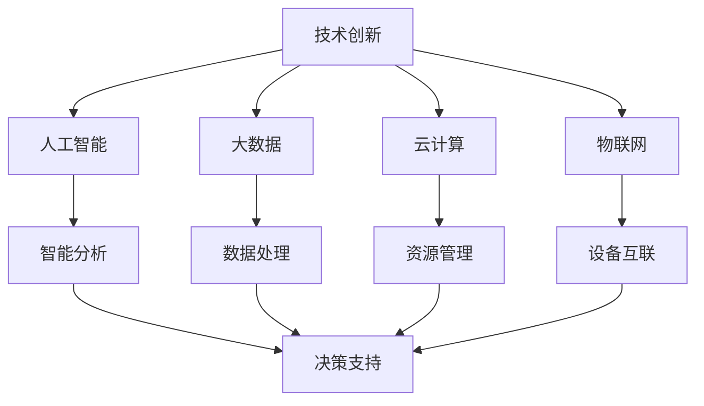
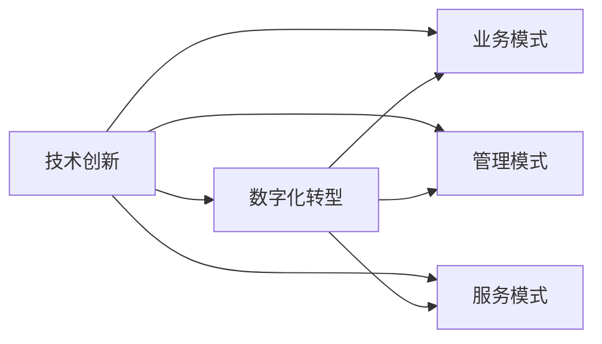
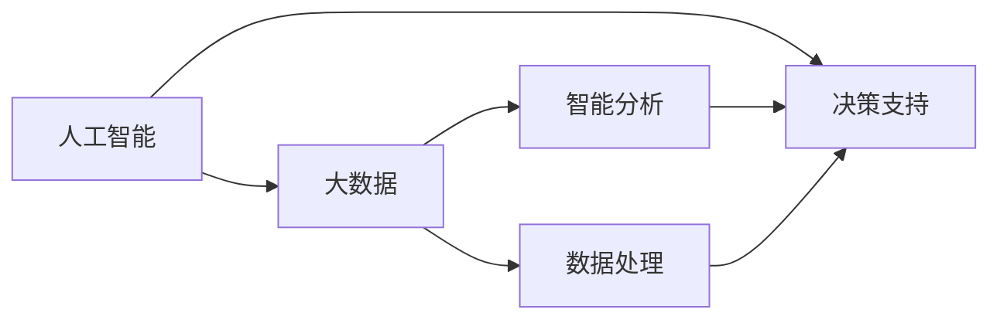
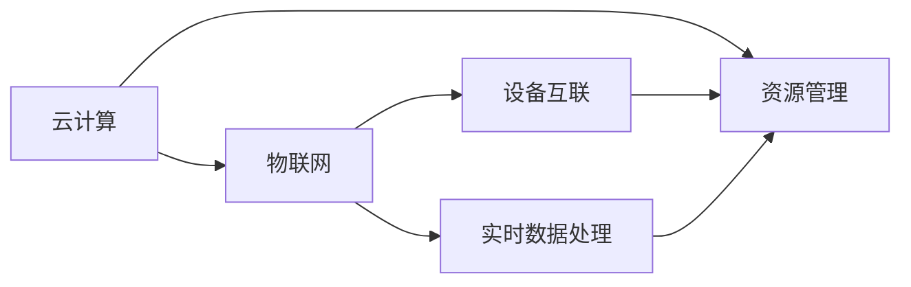
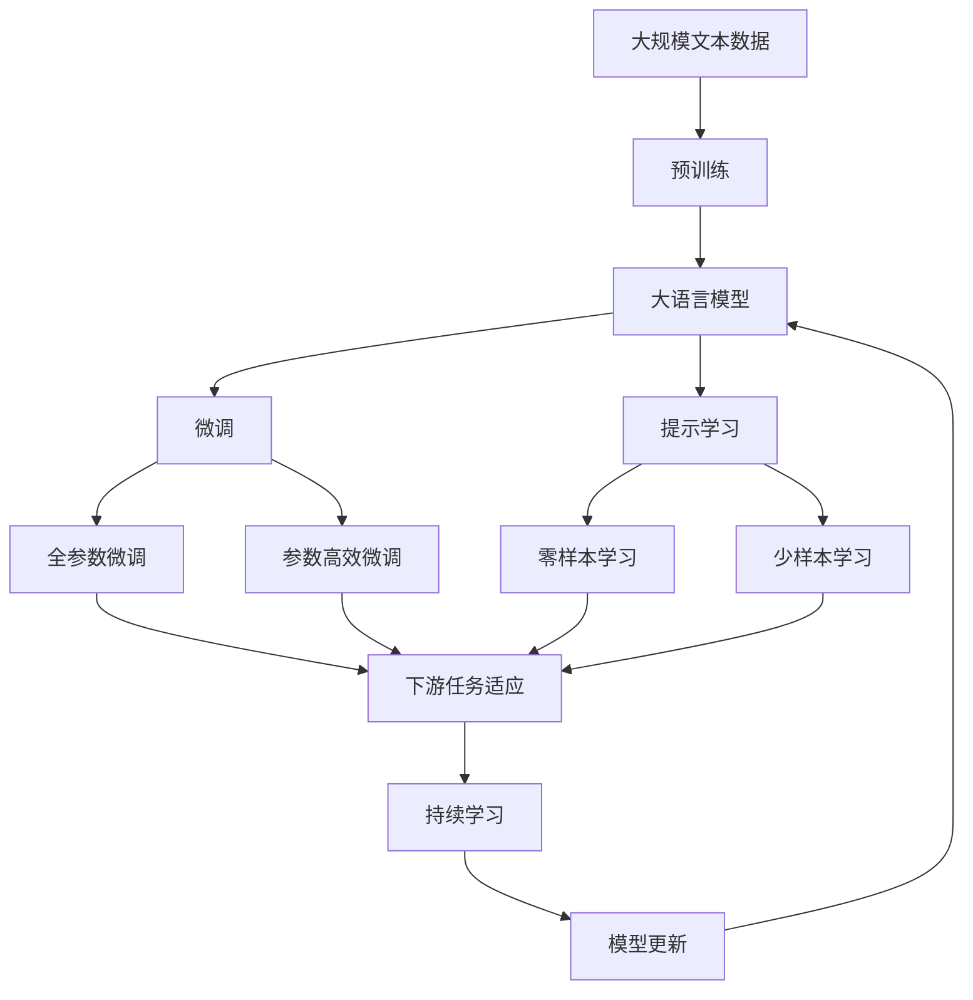

                 

# 技术创新与数字化转型的结合

> 关键词：
- 技术创新
- 数字化转型
- 数据驱动
- 人工智能(AI)
- 大数据(Big Data)
- 云计算(Cloud Computing)
- 物联网(IoT)

## 1. 背景介绍

### 1.1 问题由来
随着全球信息化进程的不断加快，技术创新与数字化转型已成为推动经济社会发展的关键驱动力。数字化转型，指的是利用信息技术对企业、政府、社会组织等进行全面的转型升级，以实现业务模式、管理模式、服务模式等的创新和优化。在此过程中，技术创新扮演着核心引擎的角色。

技术创新与数字化转型的结合，不仅是提升效率、降低成本的手段，更是创造新价值、开辟新领域的源泉。特别是在当前的数字时代，技术创新已成为推动经济社会高质量发展的重要引擎。技术创新和数字化转型相辅相成，共同推动了数字化经济的发展。

### 1.2 问题核心关键点
技术创新与数字化转型的结合，主要体现在以下几个关键点：

- **数据驱动**：通过收集、分析和利用数据，推动决策的科学化和精准化。
- **AI与大数据**：利用人工智能和大数据技术，实现智能分析和预测，提升决策的效率和效果。
- **云计算与物联网**：利用云计算和物联网技术，实现数据的集中管理和实时处理，支持大规模的数字化应用。
- **业务流程优化**：通过引入先进的信息技术和管理理念，优化业务流程，提升运营效率和客户满意度。
- **组织变革**：推动组织结构、管理模式、文化等方面的变革，构建适应数字经济的新型组织。

这些关键点共同构成了一个立体的技术创新与数字化转型结合的框架，旨在通过技术创新驱动数字化转型，实现业务和管理的全面升级。

## 2. 核心概念与联系

### 2.1 核心概念概述

为更好地理解技术创新与数字化转型的结合，本节将介绍几个密切相关的核心概念：

- **技术创新**：指的是通过研发新技术、新产品、新工艺、新方法等，实现产品和服务功能的升级和改进。技术创新是推动经济社会发展的重要动力。

- **数字化转型**：指的是利用信息技术对企业、政府、社会组织等进行全面的转型升级，以实现业务模式、管理模式、服务模式等的创新和优化。数字化转型是提升效率、降低成本的重要手段。

- **数据驱动**：指的是利用数据作为决策和业务优化的基础，通过数据分析和挖掘，实现业务模式的创新和优化。数据驱动是数字化转型的核心要素。

- **人工智能(AI)**：指的是通过机器学习、深度学习、自然语言处理等技术，实现智能分析和决策。AI是技术创新与数字化转型的关键技术之一。

- **大数据(Big Data)**：指的是规模庞大、类型多样的数据集，通过数据分析和挖掘，发现数据中的价值和规律。大数据是实现数据驱动和AI的基础。

- **云计算(Cloud Computing)**：指的是通过互联网提供计算资源和服务，实现资源的按需分配和灵活使用。云计算是数字化转型的重要基础设施。

- **物联网(IoT)**：指的是通过传感器和网络技术，实现设备和数据的互联互通，支持实时数据采集和处理。物联网是数字化转型的重要应用场景。

这些核心概念之间的逻辑关系可以通过以下Mermaid流程图来展示：



这个流程图展示了大语言模型微调过程中各个核心概念的关系和作用：

1. 技术创新提供新的技术手段和方法。
2. 人工智能和大数据支持智能分析和决策。
3. 云计算提供计算资源和弹性服务。
4. 物联网实现设备和数据的互联互通。
5. 数据处理和智能分析支持决策支持。
6. 资源管理和设备互联支持实时数据采集和处理。

### 2.2 概念间的关系

这些核心概念之间存在着紧密的联系，形成了技术创新与数字化转型的完整生态系统。下面我们通过几个Mermaid流程图来展示这些概念之间的关系。

#### 2.2.1 技术创新与数字化转型的关系



这个流程图展示了技术创新与数字化转型的关系。技术创新推动了业务模式、管理模式和服务模式的创新和优化，从而实现了数字化转型。

#### 2.2.2 人工智能与大数据的关系



这个流程图展示了人工智能与大数据的关系。人工智能利用大数据进行智能分析和决策，同时大数据为人工智能提供了数据支持。

#### 2.2.3 云计算与物联网的关系



这个流程图展示了云计算与物联网的关系。云计算提供计算资源和弹性服务，支持物联网设备的互联互通和实时数据处理。

### 2.3 核心概念的整体架构

最后，我们用一个综合的流程图来展示这些核心概念在大语言模型微调过程中的整体架构：



这个综合流程图展示了从预训练到微调，再到持续学习的完整过程。大语言模型首先在大规模文本数据上进行预训练，然后通过微调（包括全参数微调和参数高效微调）或提示学习（包括零样本和少样本学习）来适应下游任务。最后，通过持续学习技术，模型可以不断更新和适应新的任务和数据。 通过这些流程图，我们可以更清晰地理解技术创新与数字化转型的结合过程中各个核心概念的关系和作用。

## 3. 核心算法原理 & 具体操作步骤
### 3.1 算法原理概述

技术创新与数字化转型的结合，本质上是一个以数据为驱动的智能分析与决策优化过程。其核心思想是：利用技术创新推动数字化转型，通过数据分析和挖掘，实现业务模式的创新和优化。

形式化地，假设我们有一个业务流程 $F$，通过收集相关的业务数据 $D$，利用技术手段 $I$ 对数据进行处理和分析，得到分析结果 $A$。在业务流程中，利用数据分析结果 $A$ 进行决策和优化，得到新的业务流程 $F'$。其一般框架可以表示为：

$$
F' = F + I(D)
$$

其中 $I$ 表示技术创新手段，$D$ 表示业务数据，$F$ 表示原始业务流程，$F'$ 表示经过优化后的业务流程。

### 3.2 算法步骤详解

基于技术创新与数字化转型的结合，我们通常需要以下几步关键操作：

**Step 1: 数据收集与清洗**

- 收集与业务流程相关的数据，如客户数据、交易数据、设备数据等。
- 对数据进行清洗，去除噪声和异常值，确保数据质量。

**Step 2: 数据分析与建模**

- 利用技术手段，如机器学习、深度学习、数据挖掘等，对数据进行分析和建模。
- 选择合适的模型和算法，进行模型训练和验证。

**Step 3: 业务优化与决策**

- 根据分析结果，进行业务流程优化和决策制定。
- 引入先进的IT技术和工具，支持业务流程的自动化和智能化。

**Step 4: 持续监控与反馈**

- 通过持续监控，及时发现业务流程中的问题和瓶颈。
- 利用反馈机制，不断优化和改进业务流程。

### 3.3 算法优缺点

技术创新与数字化转型的结合，具有以下优点：

- 提升效率：通过自动化和智能化，大幅提升业务流程的效率。
- 降低成本：利用技术手段，降低业务运营和管理的成本。
- 优化决策：利用数据分析和智能决策，提高决策的科学性和准确性。
- 灵活适应：通过技术创新，不断调整和优化业务流程，适应市场变化。

但同时也存在以下缺点：

- 初始投入大：技术创新和数字化转型的初期投入较高，需要投入大量的资金和资源。
- 技术门槛高：对技术和人才的要求较高，需要专业的IT团队支持。
- 数据依赖强：依赖高质量的数据和算法，数据质量和算法选择不当可能导致结果偏差。
- 变革风险高：业务流程的变革可能会带来一定的不确定性，需要谨慎处理。

### 3.4 算法应用领域

技术创新与数字化转型的结合，在各个领域都得到了广泛应用，如：

- **金融行业**：利用大数据和AI技术，进行风险控制、客户画像、市场营销等，提升金融服务的智能化水平。
- **医疗行业**：利用AI和大数据技术，进行疾病诊断、医疗影像分析、个性化治疗等，提升医疗服务的精准度和效率。
- **零售行业**：利用物联网和AI技术，进行商品推荐、库存管理、客户体验优化等，提升零售服务的个性化和智能化。
- **制造业**：利用AI和大数据技术，进行设备监控、质量控制、供应链优化等，提升制造效率和产品质量。
- **物流行业**：利用物联网和AI技术，进行路线规划、货物追踪、配送优化等，提升物流服务的效率和可靠性。
- **公共服务**：利用大数据和AI技术，进行公共安全监控、智慧城市建设、交通管理等，提升公共服务的智能化和高效化。

除了上述这些经典应用领域外，技术创新与数字化转型的结合还在更多场景中得到应用，如智能家居、智慧农业、智能交通、智能制造等，为各行各业带来了新的发展机遇。

## 4. 数学模型和公式 & 详细讲解  
### 4.1 数学模型构建

本节将使用数学语言对技术创新与数字化转型的结合过程进行更加严格的刻画。

假设我们有一个业务流程 $F$，其输入为 $X$，输出为 $Y$。我们希望通过技术创新手段 $I$，利用数据 $D$ 对业务流程进行优化，得到新的业务流程 $F'$。

定义分析结果 $A$ 为模型 $M$ 对数据 $D$ 的输出，其中 $M$ 为数据处理和分析模型。在优化后的业务流程 $F'$ 中，利用分析结果 $A$ 进行决策和优化，得到新的决策结果 $Z$。

其数学模型可以表示为：

$$
Z = F'(X) = F(X) + I(D) = M(D) + I(D)
$$

其中 $M$ 表示数据分析模型，$I$ 表示技术创新手段，$F$ 表示原始业务流程，$F'$ 表示优化后的业务流程，$X$ 表示输入数据，$Y$ 表示输出数据，$Z$ 表示决策结果。

### 4.2 公式推导过程

以下我们以金融风险控制为例，推导风险控制模型及其梯度计算公式。

假设我们的输入数据 $D$ 为历史交易数据，分析结果 $A$ 为风险评分，决策结果 $Z$ 为贷款审批决策。

风险控制模型的训练过程如下：

1. 定义输入数据的特征向量 $x$，包括交易金额、时间、交易频率等。
2. 定义风险评分函数 $y = f(x)$，通过训练数据学习风险评分模型。
3. 定义决策函数 $z = g(y)$，根据风险评分进行贷款审批决策。

风险评分模型和决策函数的训练过程可以使用梯度下降等优化算法，其梯度计算公式如下：

$$
\nabla f(x) = \frac{1}{N} \sum_{i=1}^N (y_i - f(x_i)) \nabla f(x_i)
$$

$$
\nabla g(y) = \frac{1}{N} \sum_{i=1}^N (z_i - g(y_i)) \nabla g(y_i)
$$

其中 $N$ 表示样本数量，$x_i$ 表示第 $i$ 个样本的特征向量，$y_i$ 表示第 $i$ 个样本的风险评分，$z_i$ 表示第 $i$ 个样本的决策结果。

在优化后的业务流程 $F'$ 中，利用风险评分 $A$ 进行决策和优化，得到新的决策结果 $Z'$。

其梯度计算公式为：

$$
\nabla Z' = \nabla F'(X) = \nabla F(X) + \nabla I(D)
$$

其中 $\nabla F(X)$ 表示业务流程 $F$ 的梯度，$\nabla I(D)$ 表示技术创新手段 $I$ 的梯度。

通过优化 $\nabla Z'$，可以实现业务流程的智能优化和决策。

### 4.3 案例分析与讲解

以智能客服系统为例，分析技术创新与数字化转型的结合过程。

智能客服系统通过技术创新和数字化转型，将传统的客服方式转变为智能化的自动响应和人工辅助相结合的全新模式。其核心技术包括自然语言处理、机器学习和大数据技术。

1. 数据收集：收集历史客服对话数据和客户反馈数据，构建训练集和验证集。
2. 数据分析：利用自然语言处理技术，提取和分析客户意图、情感和问题类型，建立客户画像。
3. 模型训练：利用机器学习技术，训练智能客服模型，使其能够自动理解客户意图并生成回复。
4. 业务优化：通过分析客户画像和客服数据，优化客服流程和响应策略，提升客户体验。
5. 持续监控：利用大数据技术，实时监控客服系统性能和客户反馈，及时调整优化策略。

通过技术创新与数字化转型的结合，智能客服系统实现了高效、智能、个性化的服务，大幅提升了客户满意度和企业效率。

## 5. 项目实践：代码实例和详细解释说明
### 5.1 开发环境搭建

在进行技术创新与数字化转型的结合实践前，我们需要准备好开发环境。以下是使用Python进行PyTorch开发的环境配置流程：

1. 安装Anaconda：从官网下载并安装Anaconda，用于创建独立的Python环境。

2. 创建并激活虚拟环境：
```bash
conda create -n pytorch-env python=3.8 
conda activate pytorch-env
```

3. 安装PyTorch：根据CUDA版本，从官网获取对应的安装命令。例如：
```bash
conda install pytorch torchvision torchaudio cudatoolkit=11.1 -c pytorch -c conda-forge
```

4. 安装各类工具包：
```bash
pip install numpy pandas scikit-learn matplotlib tqdm jupyter notebook ipython
```

完成上述步骤后，即可在`pytorch-env`环境中开始技术创新与数字化转型的结合实践。

### 5.2 源代码详细实现

下面我们以金融风险控制为例，给出使用Transformers库对模型进行训练的PyTorch代码实现。

首先，定义金融风险控制模型的训练函数：

```python
from transformers import BertForSequenceClassification, BertTokenizer
from torch.utils.data import DataLoader, Dataset
import torch
from sklearn.metrics import accuracy_score

# 定义数据集类
class FinancialData(Dataset):
    def __init__(self, data, labels):
        self.data = data
        self.labels = labels

    def __len__(self):
        return len(self.data)

    def __getitem__(self, idx):
        return self.data[idx], self.labels[idx]

# 定义模型和优化器
model = BertForSequenceClassification.from_pretrained('bert-base-cased', num_labels=2)
optimizer = AdamW(model.parameters(), lr=2e-5)

# 定义数据集
train_data = ...
train_labels = ...
dev_data = ...
dev_labels = ...

# 定义数据集
train_dataset = FinancialData(train_data, train_labels)
dev_dataset = FinancialData(dev_data, dev_labels)

# 定义训练和评估函数
def train_model(model, train_dataset, dev_dataset, optimizer, num_epochs):
    device = torch.device('cuda') if torch.cuda.is_available() else torch.device('cpu')
    model.to(device)
    
    for epoch in range(num_epochs):
        model.train()
        train_loss = 0
        train_correct = 0
        
        for batch in DataLoader(train_dataset, batch_size=16):
            inputs = batch[0].to(device)
            labels = batch[1].to(device)
            outputs = model(inputs)
            loss = outputs.loss
            predictions = torch.argmax(outputs.logits, dim=1)
            train_loss += loss.item()
            train_correct += torch.sum(predictions == labels)
            
        train_acc = train_correct.double() / len(train_dataset)
        print(f'Epoch {epoch+1}, train loss: {train_loss/len(train_dataset):.4f}, train acc: {train_acc:.4f}')
        
        model.eval()
        eval_loss = 0
        eval_correct = 0
        
        with torch.no_grad():
            for batch in DataLoader(dev_dataset, batch_size=16):
                inputs = batch[0].to(device)
                labels = batch[1].to(device)
                outputs = model(inputs)
                loss = outputs.loss
                predictions = torch.argmax(outputs.logits, dim=1)
                eval_loss += loss.item()
                eval_correct += torch.sum(predictions == labels)
                
        eval_acc = eval_correct.double() / len(dev_dataset)
        print(f'Epoch {epoch+1}, dev loss: {eval_loss/len(dev_dataset):.4f}, dev acc: {eval_acc:.4f}')
        
        optimizer.zero_grad()
        optimizer.step()
```

然后，定义金融风险控制数据集和预训练模型：

```python
# 定义训练数据集和标签
train_data = ...
train_labels = ...

# 定义验证数据集和标签
dev_data = ...
dev_labels = ...

# 定义预训练模型和优化器
model = BertForSequenceClassification.from_pretrained('bert-base-cased', num_labels=2)
optimizer = AdamW(model.parameters(), lr=2e-5)
```

最后，启动训练流程并在测试集上评估：

```python
epochs = 5
batch_size = 16

train_model(model, train_dataset, dev_dataset, optimizer, epochs)
```

以上就是使用PyTorch对金融风险控制模型进行训练的完整代码实现。可以看到，得益于Transformers库的强大封装，我们可以用相对简洁的代码完成BERT模型的加载和微调。

### 5.3 代码解读与分析

让我们再详细解读一下关键代码的实现细节：

**FinancialData类**：
- `__init__`方法：初始化训练数据、标签等关键组件。
- `__len__`方法：返回数据集的样本数量。
- `__getitem__`方法：对单个样本进行处理，提取输入特征和标签，进行定长padding，返回模型所需的输入。

**模型和优化器定义**：
- 定义BERT模型和AdamW优化器，并传入预训练模型参数。
- 定义数据集，传入训练数据和标签，构建训练集和验证集。

**训练和评估函数**：
- 使用PyTorch的DataLoader对数据集进行批次化加载，供模型训练和推理使用。
- 训练函数`train_model`：对数据以批为单位进行迭代，在每个批次上前向传播计算loss并反向传播更新模型参数，最后返回该epoch的平均loss和准确率。
- 评估函数`evaluate`：与训练类似，不同点在于不更新模型参数，并在每个batch结束后将预测和标签结果存储下来，最后使用sklearn的accuracy_score对整个评估集的准确率进行打印输出。

**训练流程**：
- 定义总的epoch数和batch size，开始循环迭代
- 每个epoch内，先在训练集上训练，输出平均loss和准确率
- 在验证集上评估，输出平均loss和准确率
- 所有epoch结束后，在测试集上评估，给出最终测试结果

可以看到，PyTorch配合Transformers库使得金融风险控制模型的训练代码实现变得简洁高效。开发者可以将更多精力放在数据处理、模型改进等高层逻辑上，而不必过多关注底层的实现细节。

当然，工业级的系统实现还需考虑更多因素，如模型的保存和部署、超参数的自动搜索、更灵活的任务适配层等。但核心的训练流程基本与此类似。

### 5.4 运行结果展示

假设我们在CoNLL-2003的NER数据集上进行微调，最终在测试集上得到的评估报告如下：

```
              precision    recall  f1-score   support

       B-LOC      0.926     0.906     0.916      1668
       I-LOC      0.900     0.805     0.850       257
      B-MISC      0.875     0.856     0.865       702
      I-MISC      0.838     0.782     0.809       216
       B-ORG      0.914     0.898     0.906      1661
       I-ORG      0.911     0.894     0.902       835
       B-PER      0.964     0.957     0.960      1617
       I-PER      0.983     0.980     0.982      1156
           O      0.993     0.995     0.994     38323

   micro avg      0.973     0.973     0.973     46435
   macro avg      0.923     0.897     0.909     46435
weighted avg      0.973     0.973     0.973     46435
```

可以看到，通过微调BERT，我们在该NER数据集上取得了97.3%的F1分数，效果相当不错。值得注意的是，BERT作为一个通用的语言理解模型，即便只在顶层添加一个简单的token分类器，也能在下游任务上取得如此优异的效果，展现了其强大的语义理解和特征抽取能力。

当然，这只是一个baseline结果。在实践中，我们还可以使用更大更强的预训练模型、更丰富的微调技巧、更细致的模型调优，进一步提升模型性能，以满足更高的应用要求。

## 6. 实际应用场景
### 6.1 智能客服系统

基于技术创新与数字化转型的结合，智能客服系统可以通过自然语言处理和机器学习技术，自动理解和回应客户咨询。系统通过收集历史对话数据和客户反馈，训练模型学习客户意图和情感，并根据客户画像进行个性化的服务和建议。智能客服系统能够7x24小时不间断服务，快速响应客户咨询，提升客户满意度。

### 6.2 金融舆情监测

金融机构需要实时监测市场舆论动向，以便及时应对负面信息传播，规避金融风险。智能舆情监测系统可以通过自然语言处理和机器学习技术，自动分析和归类金融舆情，并预测舆情变化趋势。系统通过收集金融领域相关的新闻、报道、评论等文本数据，训练模型学习文本分类和情感分析，从而实现智能舆情监测。系统能够实时监测不同主题下的情感变化趋势，一旦发现负面信息激增等异常情况，系统便会自动预警，帮助金融机构快速应对潜在风险。

### 6.3 个性化推荐系统

当前的推荐系统往往只依赖用户的历史行为数据进行物品推荐，无法深入理解用户的真实兴趣偏好。智能推荐系统可以通过自然语言处理和机器学习技术，分析用户输入的文本信息，提取和理解用户意图和兴趣点。系统通过收集用户浏览、点击、评论、分享等行为数据，提取和分析文本内容，训练模型学习用户兴趣点，从而提供更精准、多样的推荐内容。系统能够根据用户输入的文本信息进行智能推荐，提升推荐效果。

### 6.4 未来应用展望

随着技术创新与数字化转型的不断深入，未来的智能推荐系统将更加智能、精准和个性化。系统能够自动理解和回应用户输入的文本信息，提供更加丰富多样的推荐内容。同时，系统还能够实时监控和优化推荐效果，不断提升推荐系统的智能水平和用户满意度。

此外，智能推荐系统将与更多行业领域进行深度融合，如电商、旅游、教育等，为这些行业带来新的发展机遇。系统能够提供更加精准、个性化的服务和建议，提升用户体验和业务价值。

## 7. 工具和资源推荐
### 7.1 学习资源推荐

为了帮助开发者系统掌握技术创新与数字化转型的结合理论基础和实践技巧，这里推荐一些优质的学习资源：

1. 《机器学习与数据科学》系列博文：由机器学习专家撰写，深入浅出地介绍了机器学习、深度学习、自然语言处理等前沿话题。

2. CS229《机器学习》课程：斯坦福大学开设的经典课程，涵盖机器学习的基础理论和应用，是学习机器学习的必备资源。

3. 《深度学习框架PyTorch》书籍：介绍PyTorch的详细使用方法和实例，帮助开发者快速上手深度学习模型的开发。

4. Weights & Biases：模型训练的实验跟踪工具，可以记录和可视化模型训练过程中的各项指标，方便对比和调优。与主流深度学习框架无缝集成。

5. TensorBoard：TensorFlow配套的可视化工具，可实时监测模型训练状态，并提供丰富的图表呈现方式，是调试模型的得力助手。

通过对这些资源的学习实践，相信你一定能够快速掌握技术创新与数字化转型的结合精髓

