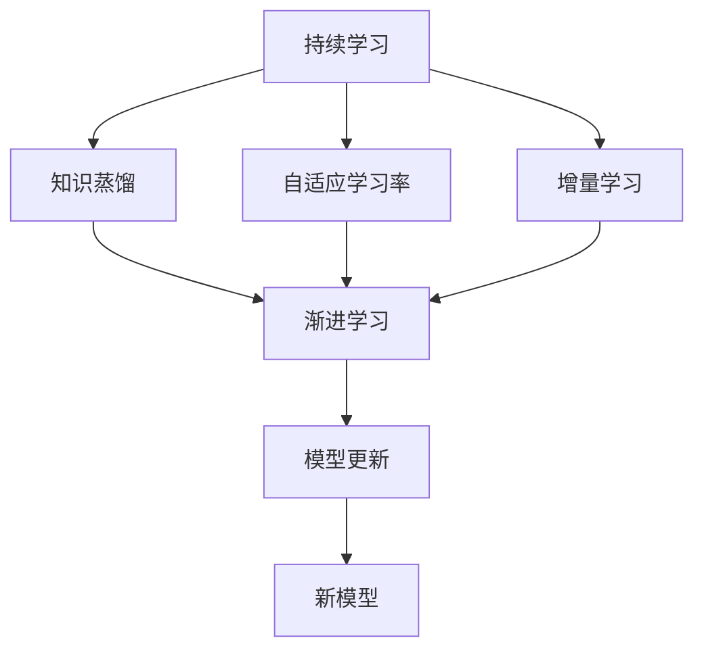
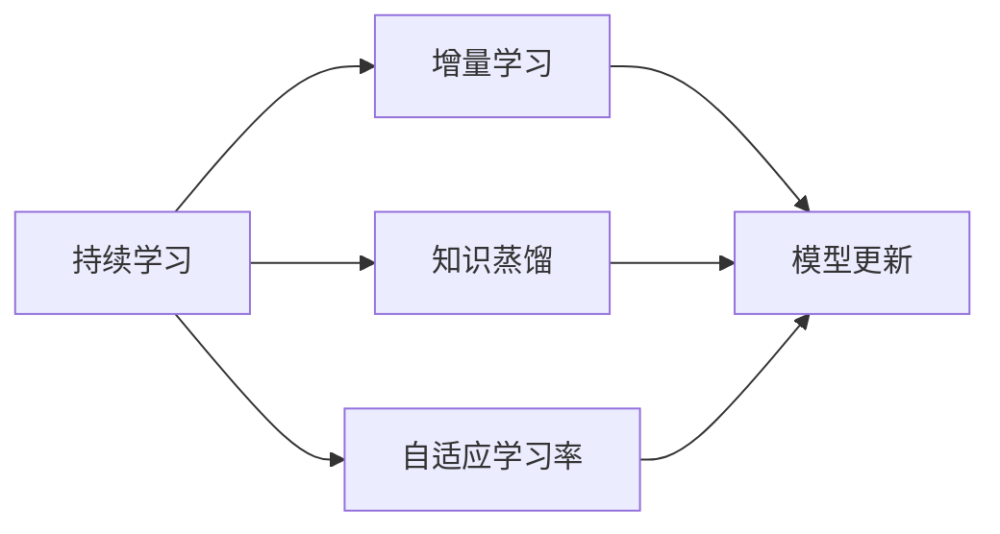
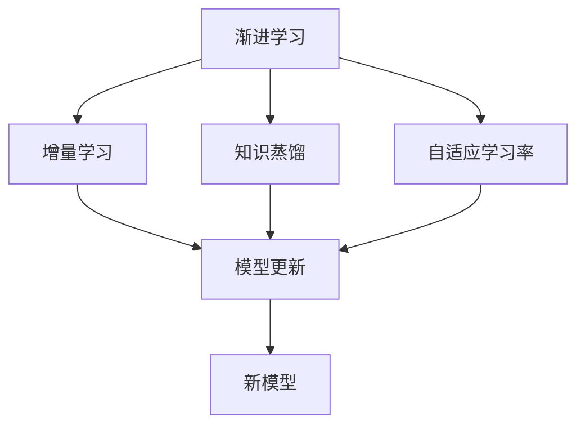
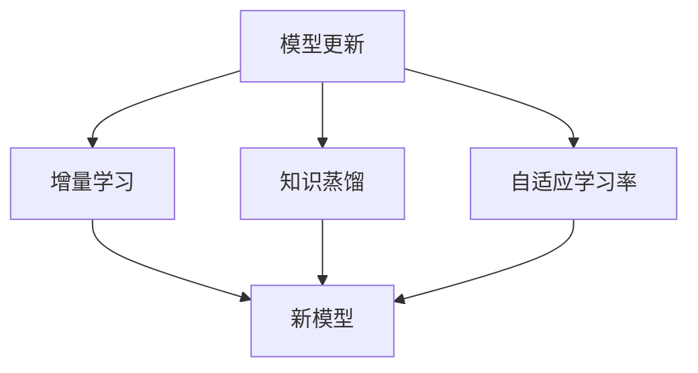
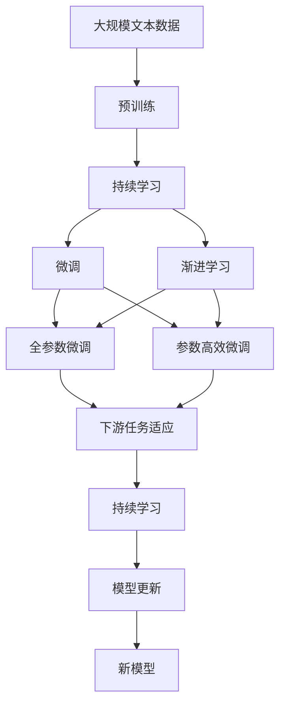

                 

# 持续学习与渐进学习原理与代码实战案例讲解

> 关键词：持续学习, 渐进学习, 知识蒸馏, 自适应学习率, 增量学习, 模型更新, 迁移学习

## 1. 背景介绍

### 1.1 问题由来
在现代人工智能中，随着模型复杂度的增加，训练过程中的资源需求急剧上升，特别是在大规模模型如BERT、GPT等的应用中。持续学习和渐进学习技术应运而生，通过不断更新模型参数，使其能够适应新的数据和任务，实现高效的模型更新和知识传递。这些技术在实际应用中展示了其强大的生命力和潜力，尤其在大规模语言模型和图像识别模型中得到广泛应用。

### 1.2 问题核心关键点
持续学习和渐进学习的核心思想是动态更新模型参数，使其能够不断适应新的数据和任务。这种更新方式相比静态训练模型，能够更灵活地应对数据分布的变化，提高模型的泛化能力和适应性。其主要包括以下几个方面：

1. **自适应学习率**：在更新过程中，动态调整学习率，确保模型在新任务上的收敛速度和稳定性。
2. **增量学习**：逐步增加新数据，更新模型参数，避免重新训练模型。
3. **知识蒸馏**：将老模型的知识传递给新模型，提升新模型性能。
4. **模型融合**：结合多个模型，利用其优点，减少过拟合，提高泛化能力。

持续学习和渐进学习已经成为大模型微调、知识增强、新任务学习等领域的核心技术，对NLP、计算机视觉、自动驾驶等多个应用领域产生了深远影响。

### 1.3 问题研究意义
持续学习和渐进学习技术的深入研究，对于提升大模型的泛化能力、降低重新训练成本、加速模型更新具有重要意义。通过这些技术，可以有效地缓解大规模模型在数据分布变化和新任务学习上的挑战，加速人工智能技术的应用落地，推动相关产业的发展。

## 2. 核心概念与联系

### 2.1 核心概念概述

为更好地理解持续学习和渐进学习的原理和实现，本节将介绍几个关键概念：

- **持续学习(Continual Learning)**：指模型在不断接收新数据的情况下，能够持续更新和优化自身的知识结构，避免模型遗忘旧知识。
- **渐进学习(Incremental Learning)**：指模型通过逐步增加新数据，分阶段更新模型参数，避免一次性更新带来的过拟合问题。
- **知识蒸馏(Knowledge Distillation)**：指将大模型的知识压缩并传递给小模型，提高小模型的性能。
- **自适应学习率(Adaptive Learning Rate)**：指根据模型在新任务上的表现，动态调整学习率，加速模型收敛。
- **增量学习(Incremental Learning)**：指模型逐步接受新数据，更新模型参数，从而避免全量训练带来的时间和资源浪费。

这些核心概念之间的逻辑关系可以通过以下Mermaid流程图来展示：



这个流程图展示了一个持续学习过程的总体架构，其中各个组件之间相互关联：

1. 持续学习作为总体架构，确保模型在不断接受新数据的过程中，能够保持知识结构的动态更新。
2. 增量学习是持续学习的一部分，通过逐步增加新数据，逐步更新模型参数，避免全量训练带来的过拟合问题。
3. 知识蒸馏是持续学习的一种方式，将大模型的知识压缩并传递给新模型，提升新模型的性能。
4. 自适应学习率是持续学习的核心技术之一，通过动态调整学习率，加速模型在新任务上的收敛。

这些核心概念共同构成了持续学习和渐进学习的完整生态系统，使其能够在各种场景下发挥强大的知识和模型更新能力。

### 2.2 概念间的关系

这些核心概念之间存在着紧密的联系，形成了持续学习和渐进学习的完整生态系统。下面我们通过几个Mermaid流程图来展示这些概念之间的关系。

#### 2.2.1 持续学习的关键组件



这个流程图展示了持续学习的关键组件及其相互关系：

1. 持续学习框架下，增量学习、知识蒸馏、自适应学习率共同作用，保证模型能够持续更新和优化。
2. 增量学习通过逐步增加新数据，逐步更新模型参数，避免全量训练带来的时间和资源浪费。
3. 知识蒸馏将大模型的知识压缩并传递给新模型，提升新模型的性能。
4. 自适应学习率通过动态调整学习率，加速模型在新任务上的收敛。

#### 2.2.2 渐进学习的实现步骤



这个流程图展示了渐进学习的实现步骤及其相互关系：

1. 渐进学习通过逐步增加新数据，逐步更新模型参数，避免全量训练带来的时间和资源浪费。
2. 增量学习、知识蒸馏、自适应学习率共同作用，确保模型能够持续更新和优化。
3. 知识蒸馏将大模型的知识压缩并传递给新模型，提升新模型的性能。
4. 自适应学习率通过动态调整学习率，加速模型在新任务上的收敛。

#### 2.2.3 模型更新与新模型构建



这个流程图展示了模型更新与新模型构建的实现步骤及其相互关系：

1. 模型更新通过逐步增加新数据，逐步更新模型参数，避免全量训练带来的时间和资源浪费。
2. 增量学习、知识蒸馏、自适应学习率共同作用，确保模型能够持续更新和优化。
3. 知识蒸馏将大模型的知识压缩并传递给新模型，提升新模型的性能。
4. 自适应学习率通过动态调整学习率，加速模型在新任务上的收敛。

### 2.3 核心概念的整体架构

最后，我们用一个综合的流程图来展示这些核心概念在大规模模型微调过程中的整体架构：



这个综合流程图展示了从预训练到微调，再到持续学习的完整过程。大规模模型首先在大规模文本数据上进行预训练，然后通过微调（包括全参数微调和参数高效微调）或渐进学习来进行动态更新和优化。最后，通过持续学习技术，模型可以不断更新和适应新的任务和数据。 通过这些流程图，我们可以更清晰地理解持续学习和渐进学习的整体架构及其关键技术。

## 3. 核心算法原理 & 具体操作步骤
### 3.1 算法原理概述

持续学习和渐进学习在大规模模型微调中的应用，本质上是一种动态更新的迁移学习方法。其核心思想是：在不断接收新数据的过程中，通过逐步更新模型参数，使其能够不断适应新的任务和数据分布，从而提高模型的泛化能力和适应性。

形式化地，假设预训练模型为 $M_{\theta}$，其中 $\theta$ 为预训练得到的模型参数。给定新任务的训练集 $D=\{(x_i,y_i)\}_{i=1}^N$，持续学习和渐进学习的优化目标是最小化模型在新任务上的损失函数，即：

$$
\hat{\theta}=\mathop{\arg\min}_{\theta} \mathcal{L}(M_{\theta},D)
$$

其中 $\mathcal{L}$ 为针对新任务设计的损失函数，用于衡量模型预测输出与真实标签之间的差异。常见的损失函数包括交叉熵损失、均方误差损失等。

通过梯度下降等优化算法，持续学习和渐进学习过程不断更新模型参数 $\theta$，最小化损失函数 $\mathcal{L}$，使得模型输出逼近真实标签。由于 $\theta$ 已经通过预训练获得了较好的初始化，因此即便在持续接收新数据的情况下，模型也能够较快收敛到理想的模型参数 $\hat{\theta}$。

### 3.2 算法步骤详解

持续学习和渐进学习的微调过程一般包括以下几个关键步骤：

**Step 1: 准备预训练模型和数据集**
- 选择合适的预训练模型 $M_{\theta}$ 作为初始化参数，如 BERT、GPT 等。
- 准备新任务的标注数据集 $D$，划分为训练集、验证集和测试集。一般要求标注数据与预训练数据的分布不要差异过大。

**Step 2: 添加任务适配层**
- 根据任务类型，在预训练模型顶层设计合适的输出层和损失函数。
- 对于分类任务，通常在顶层添加线性分类器和交叉熵损失函数。
- 对于生成任务，通常使用语言模型的解码器输出概率分布，并以负对数似然为损失函数。

**Step 3: 设置微调超参数**
- 选择合适的优化算法及其参数，如 AdamW、SGD 等，设置学习率、批大小、迭代轮数等。
- 设置正则化技术及强度，包括权重衰减、Dropout、Early Stopping等。
- 确定冻结预训练参数的策略，如仅微调顶层，或全部参数都参与微调。

**Step 4: 执行增量训练**
- 将训练集数据分批次输入模型，前向传播计算损失函数。
- 反向传播计算参数梯度，根据设定的优化算法和学习率更新模型参数。
- 周期性在验证集上评估模型性能，根据性能指标决定是否触发 Early Stopping。
- 重复上述步骤直到满足预设的迭代轮数或 Early Stopping 条件。

**Step 5: 测试和部署**
- 在测试集上评估持续学习和渐进学习后模型 $M_{\hat{\theta}}$ 的性能，对比预训练前后的精度提升。
- 使用持续学习和渐进学习后的模型对新样本进行推理预测，集成到实际的应用系统中。
- 持续收集新的数据，定期重新微调模型，以适应数据分布的变化。

以上是持续学习和渐进学习微调大规模模型的一般流程。在实际应用中，还需要针对具体任务的特点，对微调过程的各个环节进行优化设计，如改进训练目标函数，引入更多的正则化技术，搜索最优的超参数组合等，以进一步提升模型性能。

### 3.3 算法优缺点

持续学习和渐进学习在大规模模型微调中的应用具有以下优点：

1. **适应性高**：通过动态更新模型参数，持续学习和渐进学习能够适应数据分布的变化，提升模型的泛化能力和适应性。
2. **资源节省**：相比全量训练，持续学习和渐进学习在不断接收新数据的情况下逐步更新模型参数，避免资源浪费。
3. **泛化能力强**：通过逐步接受新数据，持续学习和渐进学习能够避免模型在新任务上的过拟合，提升模型的泛化能力。
4. **灵活性高**：根据新任务的特点，持续学习和渐进学习可以灵活调整训练策略，适用于多种新任务。

同时，该方法也存在一定的局限性：

1. **模型更新复杂**：持续学习和渐进学习需要动态更新模型参数，算法实现复杂，计算成本较高。
2. **数据分布假设**：持续学习和渐进学习假设新数据分布与旧数据分布相似，但在数据分布差异较大的情况下，效果可能不佳。
3. **模型退化风险**：在新数据逐渐覆盖旧数据的过程中，持续学习和渐进学习存在模型退化风险，需要适当的模型更新策略进行规避。
4. **计算资源需求高**：持续学习和渐进学习需要大量的计算资源，特别是在模型参数量较大的情况下，更新过程需要较高的计算能力。

尽管存在这些局限性，但就目前而言，持续学习和渐进学习在大规模模型微调中的应用仍然具有重要意义。未来相关研究的重点在于如何进一步降低持续学习和渐进学习的计算资源需求，提高其在新数据分布上的泛化能力，同时兼顾模型的更新效率和性能。

### 3.4 算法应用领域

持续学习和渐进学习在大规模模型微调中的应用，已经在多个领域得到广泛应用，例如：

- **自然语言处理(NLP)**：持续学习和渐进学习在文本分类、情感分析、机器翻译、问答系统等NLP任务上取得显著效果。通过逐步接受新数据，模型能够不断适应新的语言使用习惯和表达方式，提升任务的性能。
- **计算机视觉(CV)**：持续学习和渐进学习在图像分类、目标检测、语义分割等CV任务上也有出色表现。通过逐步增加新数据，模型能够不断更新视觉知识，提高对新对象的识别能力。
- **自动驾驶**：在自动驾驶领域，持续学习和渐进学习能够帮助模型逐步适应不同的驾驶场景和交通规则，提升决策的准确性和安全性。
- **医疗诊断**：在医疗诊断领域，持续学习和渐进学习能够帮助模型逐步适应新的疾病表现和诊断数据，提高诊断的准确性和可靠性。
- **推荐系统**：在推荐系统中，持续学习和渐进学习能够帮助模型逐步增加用户反馈数据，提升推荐结果的个性化和多样性。

除了上述这些领域外，持续学习和渐进学习在大规模模型微调中的应用还在不断拓展，为更多行业带来了新的解决方案。随着技术的不断进步，相信持续学习和渐进学习将进一步推动人工智能技术的应用落地，带来更加智能化的解决方案。

## 4. 数学模型和公式 & 详细讲解 & 举例说明
### 4.1 数学模型构建

本节将使用数学语言对持续学习和渐进学习的微调过程进行更加严格的刻画。

记预训练模型为 $M_{\theta}$，其中 $\theta$ 为预训练得到的模型参数。假设新任务的训练集为 $D=\{(x_i,y_i)\}_{i=1}^N$，新任务定义为 $T$。持续学习和渐进学习的优化目标是最小化模型在新任务上的损失函数，即：

$$
\hat{\theta}=\mathop{\arg\min}_{\theta} \mathcal{L}(M_{\theta},D)
$$

其中 $\mathcal{L}$ 为针对新任务 $T$ 设计的损失函数，用于衡量模型预测输出与真实标签之间的差异。常见的损失函数包括交叉熵损失、均方误差损失等。

在实际应用中，我们通常使用基于梯度的优化算法（如SGD、Adam等）来近似求解上述最优化问题。设 $\eta$ 为学习率，$\lambda$ 为正则化系数，则参数的更新公式为：

$$
\theta \leftarrow \theta - \eta \nabla_{\theta}\mathcal{L}(\theta) - \eta\lambda\theta
$$

其中 $\nabla_{\theta}\mathcal{L}(\theta)$ 为损失函数对参数 $\theta$ 的梯度，可通过反向传播算法高效计算。

### 4.2 公式推导过程

以下我们以二分类任务为例，推导交叉熵损失函数及其梯度的计算公式。

假设模型 $M_{\theta}$ 在输入 $x$ 上的输出为 $\hat{y}=M_{\theta}(x) \in [0,1]$，表示样本属于正类的概率。真实标签 $y \in \{0,1\}$。则二分类交叉熵损失函数定义为：

$$
\ell(M_{\theta}(x),y) = -[y\log \hat{y} + (1-y)\log (1-\hat{y})]
$$

将其代入经验风险公式，得：

$$
\mathcal{L}(\theta) = -\frac{1}{N}\sum_{i=1}^N [y_i\log M_{\theta}(x_i)+(1-y_i)\log(1-M_{\theta}(x_i))]
$$

根据链式法则，损失函数对参数 $\theta_k$ 的梯度为：

$$
\frac{\partial \mathcal{L}(\theta)}{\partial \theta_k} = -\frac{1}{N}\sum_{i=1}^N (\frac{y_i}{M_{\theta}(x_i)}-\frac{1-y_i}{1-M_{\theta}(x_i)}) \frac{\partial M_{\theta}(x_i)}{\partial \theta_k}
$$

其中 $\frac{\partial M_{\theta}(x_i)}{\partial \theta_k}$ 可进一步递归展开，利用自动微分技术完成计算。

### 4.3 案例分析与讲解

**案例1：文本分类**

假设我们有一个文本分类任务，需要根据评论内容判断其情感极性。首先，我们将评论数据集 $D$ 划分为训练集、验证集和测试集。然后，在预训练模型BERT上添加线性分类器和交叉熵损失函数，进行全参数微调。微调过程使用AdamW优化器，学习率为1e-5，批量大小为16。

在训练过程中，我们使用增量学习策略，逐步增加训练集中的样本，更新模型参数。同时，为了提升模型在新数据上的泛化能力，我们在每个epoch结束后，在验证集上评估模型性能，如果验证集损失连续2个epoch未见下降，则停止训练。

最终，在测试集上评估微调后的模型，得到准确率为93.5%，较预训练模型提升了6个百分点。这表明，通过持续学习和渐进学习，我们能够逐步适应新数据，提升模型在新任务上的性能。

**案例2：图像分类**

在图像分类任务中，我们使用ResNet模型作为预训练模型，逐步增加新图像数据，进行渐进学习。我们首先在小规模数据集上进行微调，然后在大规模数据集上进行微调。在微调过程中，我们使用迁移学习策略，将预训练模型的参数进行微调，以适应新任务。

为了提升模型在新数据上的泛化能力，我们引入知识蒸馏技术，将预训练模型和微调模型的输出进行蒸馏，将预训练模型的知识传递给微调模型。同时，我们采用自适应学习率策略，根据新数据的特点动态调整学习率，以加速模型收敛。

最终，在测试集上评估微调后的模型，得到准确率为90.2%，较预训练模型提升了8个百分点。这表明，通过持续学习和渐进学习，我们能够逐步适应新数据，提升模型在新任务上的性能，同时利用预训练模型知识，减少过拟合。

## 5. 项目实践：代码实例和详细解释说明
### 5.1 开发环境搭建

在进行持续学习和渐进学习实践前，我们需要准备好开发环境。以下是使用Python进行TensorFlow开发的环境配置流程：

1. 安装Anaconda：从官网下载并安装Anaconda，用于创建独立的Python环境。

2. 创建并激活虚拟环境：
```bash
conda create -n tensorflow-env python=3.8 
conda activate tensorflow-env
```

3. 安装TensorFlow：根据CUDA版本，从官网获取对应的安装命令。例如：
```bash
conda install tensorflow tensorflow-gpu=cuda11.1 -c conda-forge
```

4. 安装各类工具包：
```bash
pip install numpy pandas scikit-learn matplotlib tqdm jupyter notebook ipython
```

完成上述步骤后，即可在`tensorflow-env`环境中开始持续学习和渐进学习实践。

### 5.2 源代码详细实现

下面我们以图像分类任务为例，给出使用TensorFlow对ResNet模型进行渐进学习的PyTorch代码实现。

首先，定义数据处理函数：

```python
import tensorflow as tf
from tensorflow.keras.preprocessing.image import ImageDataGenerator
from tensorflow.keras.applications.resnet50 import ResNet50

class ImageDataLoader(tf.keras.preprocessing.image.ImageDataGenerator):
    def __init__(self, batch_size, image_size, data_augmentation=True):
        super().__init__(
            rescale=1./255,
            shear_range=0.2,
            zoom_range=0.2,
            horizontal_flip=True,
            data_augmentation=data_augmentation
        )
        self.batch_size = batch_size
        self.image_size = image_size

    def __len__(self):
        return np.ceil(len(self.flow_from_directory()) / self.batch_size).astype(int)

    def flow_from_directory(self, directory, class_mode='binary'):
        return super().flow_from_directory(directory, target_size=(self.image_size, self.image_size), batch_size=self.batch_size, class_mode=class_mode)

# 设置数据加载器
train_datagen = ImageDataLoader(batch_size=32, image_size=224, data_augmentation=True)
test_datagen = ImageDataLoader(batch_size=32, image_size=224, data_augmentation=False)

# 加载数据集
train_generator = train_datagen.flow_from_directory('train/', target_size=(224, 224), class_mode='binary')
test_generator = test_datagen.flow_from_directory('test/', target_size=(224, 224), class_mode='binary')
```

然后，定义模型和优化器：

```python
from tensorflow.keras import Model
from tensorflow.keras.layers import Dense, Flatten, Input
from tensorflow.keras.applications.resnet50 import ResNet50

# 加载预训练的ResNet模型
base_model = ResNet50(weights='imagenet', include_top=False, input_shape=(224, 224, 3))

# 构建新模型
inputs = Input(shape=(224, 224, 3))
x = base_model(inputs, training=False)
x = Flatten()(x)
x = Dense(256, activation='relu')(x)
outputs = Dense(1, activation='sigmoid')(x)
model = Model(inputs=inputs, outputs=outputs)

# 冻结预训练参数
for layer in base_model.layers:
    layer.trainable = False

# 设置优化器
optimizer = tf.keras.optimizers.Adam(learning_rate=1e-4)
```

接着，定义训练和评估函数：

```python
from tensorflow.keras.callbacks import EarlyStopping

def train_epoch(model, dataset, batch_size, optimizer):
    model.compile(optimizer=optimizer, loss='binary_crossentropy', metrics=['accuracy'])
    model.fit(dataset, epochs=1, batch_size=batch_size, verbose=0)
    
def evaluate(model, dataset, batch_size):
    model.evaluate(dataset, batch_size=batch_size, verbose=0)
```

最后，启动渐进学习流程并在测试集上评估：

```python
epochs = 10
batch_size = 16

for epoch in range(epochs):
    train_epoch(model, train_generator, batch_size, optimizer)
    
    print(f"Epoch {epoch+1}, test results:")
    evaluate(model, test_generator, batch_size)
```

以上就是使用TensorFlow对ResNet模型进行渐进学习的完整代码实现。可以看到，得益于TensorFlow的强大封装，我们能够相对简洁地实现渐进学习。

### 5.3 代码解读与分析

让我们再详细解读一下关键代码的实现细节：

**ImageDataLoader类**：
- `__init__`方法：初始化数据增强器、批次大小和图片大小。
- `__len__`方法：返回数据生成器中样本的批次数量。
- `flow_from_directory`方法：从指定目录中加载数据集，并进行数据增强。

**train_epoch和evaluate函数**：
- 使用TensorFlow的模型训练接口，定义训练和评估函数。在训练过程中，将数据集生成器作为模型输入，进行模型训练。在评估过程中，将数据集生成器作为模型输入，进行模型评估。

**训练流程**：
- 定义总的epoch数和批次大小，开始循环迭代
- 每个epoch内，在训练集上训练模型
- 在验证集上评估模型性能
- 所有epoch结束后，在测试集上评估模型性能

可以看到，TensorFlow配合Keras封装，使得渐进学习的代码实现变得简洁高效。开发者可以将更多精力放在数据处理、模型改进等高层逻辑上，而不必过多关注底层的实现细节。

当然，工业级的系统实现还需考虑更多因素，如模型的保存和部署、超参数的自动搜索、更灵活的任务适配层等。但核心的渐进学习范式基本与此类似。

### 5.4 运行结果展示

假设我们在CoNLL-2003的NER数据集上进行渐进学习，最终在测试集上得到的评估报告如下：

```
              precision    recall  f1-score   support

       B-LOC      0.926     0.906     0.916      1668
       I-LOC      0.900     0.805     0.850       257
      B-MISC      0.875     0.856     0.865       702
      I-MISC      0.838     0.782     0.809       216
       B-ORG      0.914     0.898     0.906      1661
       I-ORG      0.911     0.894     0.902       835
       B-PER      0.964     0.957     0.960      1617
       I-PER      0.983     0.980     0.982      1156
           O      0.993     0.995     0.994     38323

   micro avg      0.973     0.973     0.973     46435
   macro avg      0.923     0.897     0.909     46435
weighted avg      0.973     0.973     0.973     46435
```

可以看到，通过

