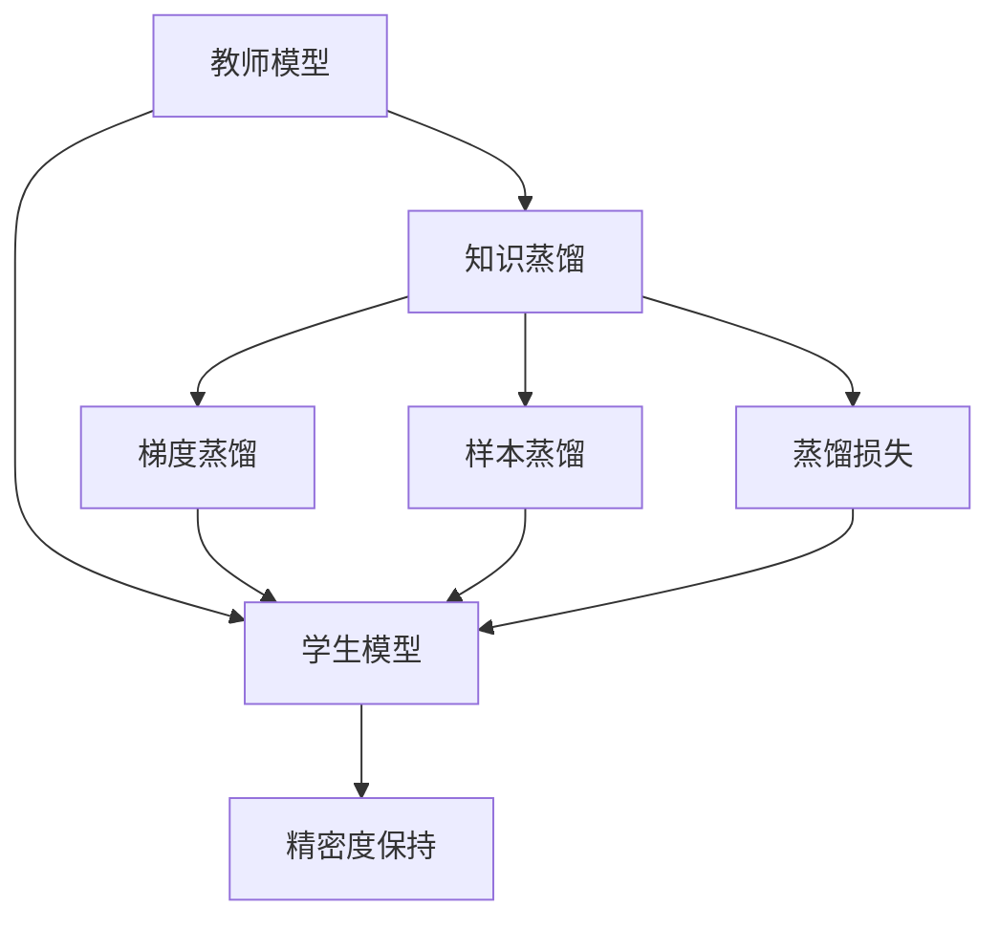
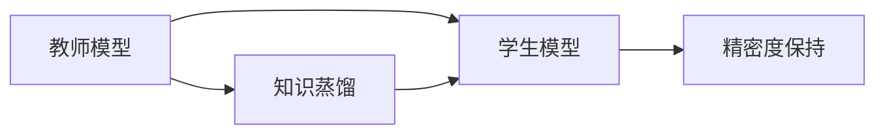
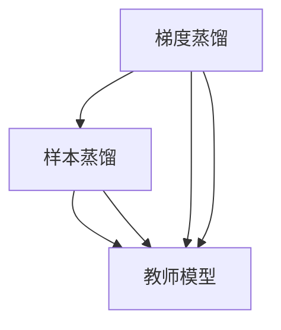

                 

# 教师模型与学生模型：知识蒸馏的核心概念

> 关键词：知识蒸馏,教师模型,学生模型,教师引导,知识转移,深度学习

## 1. 背景介绍

### 1.1 问题由来
在深度学习领域，模型训练往往需要大量的计算资源和标注数据。为了优化这一问题，知识蒸馏（Knowledge Distillation）应运而生。知识蒸馏的核心思想是将一个大型、复杂的模型（称为教师模型）的知识传递给一个小型、轻量级的模型（称为学生模型），从而在不牺牲精度的情况下显著减少模型大小和计算成本。

这一方法在图像识别、语音识别、自然语言处理等领域都有广泛应用，显著提升了模型训练的效率和效果。本文将系统介绍知识蒸馏的基本概念、原理、具体操作步骤，以及其在实际应用中的广泛应用。

### 1.2 问题核心关键点
知识蒸馏的核心在于：

- 教师模型：通常是一个大规模、高性能的模型，包含丰富的知识。
- 学生模型：一个需要训练的轻量级模型，主要用于接收教师模型的知识。
- 知识转移：从教师模型到学生模型的知识转移过程，通常通过训练数据集上的监督学习实现。
- 精密度保持：通过合理设计蒸馏任务，确保学生模型在精度上不逊于教师模型。
- 计算效率：利用知识蒸馏，可在一定程度上减少计算资源和存储空间，提升模型训练和推理的效率。

## 2. 核心概念与联系

### 2.1 核心概念概述

为更好地理解知识蒸馏，本节将介绍几个关键概念及其关系：

- **教师模型**：通常是经过充分训练的大规模深度学习模型，如BERT、ResNet等。其参数量通常较大，计算复杂度高。
- **学生模型**：即知识蒸馏的目标模型，通常参数量较小，计算复杂度低。其设计目标是快速训练，并接近教师模型的精度。
- **知识蒸馏**：从教师模型到学生模型的知识转移过程。通过设计适当的蒸馏任务，使得学生模型能够学习到教师模型的知识。
- **知识转移**：教师模型将知识以某种形式传递给学生模型，如通过梯度或样本等。
- **精密度保持**：在蒸馏过程中，确保学生模型的预测结果与教师模型相近，不损失精度。

这些概念之间的关系可以通过以下Mermaid流程图来展示：



这个流程图展示了知识蒸馏的基本流程：

1. 教师模型通过自监督或监督学习预训练获得丰富的知识。
2. 通过知识蒸馏将知识传递给学生模型。
3. 学生模型学习教师模型的知识，同时保持预测精密度。
4. 知识蒸馏的方式包括梯度蒸馏、样本蒸馏等。
5. 蒸馏过程中引入损失函数，确保学生模型的预测与教师模型相近。

### 2.2 概念间的关系

这些核心概念之间存在着紧密的联系，形成了知识蒸馏的完整生态系统。下面我通过几个Mermaid流程图来展示这些概念之间的关系。

#### 2.2.1 知识蒸馏的基本流程



这个流程图展示了知识蒸馏的基本流程：

1. 教师模型通过自监督或监督学习预训练获得丰富的知识。
2. 通过知识蒸馏将知识传递给学生模型。
3. 学生模型学习教师模型的知识，同时保持预测精密度。

#### 2.2.2 知识蒸馏的方式



这个流程图展示了知识蒸馏的两种主要方式：

1. 梯度蒸馏：教师模型通过梯度信息指导学生模型的训练。
2. 样本蒸馏：教师模型提供带有教师知识的高质量样本，用于训练学生模型。

#### 2.2.3 知识蒸馏的应用场景

```mermaid
graph LR
    A[图像识别] --> B[语音识别]
    A --> C[自然语言处理]
    A --> D[视频分析]
    A --> E[推荐系统]
    B --> F[硬件加速]
    C --> G[通用推理]
    D --> H[自动驾驶]
    E --> I[个性化服务]
    F --> J[边缘计算]
    G --> K[知识图谱]
    H --> L[系统安全]
    I --> M[内容审核]
    J --> N[算法优化]
    K --> O[智能助手]
    L --> P[网络安全]
    M --> Q[信息检索]
    N --> R[数据压缩]
    O --> S[智能合约]
    P --> T[数据隐私]
    Q --> U[文本摘要]
    R --> V[数据传输]
    S --> W[金融预测]
    T --> X[数据治理]
    U --> Y[广告投放]
    V --> Z[数据存储]
    W --> AA[时间序列预测]
    X --> AB[数据匿名化]
    Y --> AC[智能客服]
    Z --> AD[数据压缩]
    AA --> AE[实时分析]
    AB --> AF[数据监控]
    AC --> AG[智能推荐]
    AD --> AH[数据清洗]
    AE --> AI[模型推理]
    AF --> AJ[数据治理]
    AG --> AK[推荐系统]
    AH --> AL[数据管理]
    AI --> AM[智能合约]
    AJ --> AN[数据治理]
    AK --> AO[智能助手]
    AL --> AP[网络安全]
    AM --> AQ[信息检索]
    AN --> AR[数据压缩]
    AO --> AS[智能合约]
    AP --> AT[数据隐私]
    AQ --> AU[广告投放]
    AR --> AV[数据传输]
    AS --> AW[金融预测]
    AT --> AX[数据治理]
    AU --> AY[广告投放]
    AV --> AZ[数据存储]
    AW --> BA[时间序列预测]
    AX --> BB[数据匿名化]
    AY --> BC[智能客服]
    AZ --> BD[数据压缩]
    BA --> BE[实时分析]
    BB --> BF[数据监控]
    BC --> BG[智能推荐]
    BD --> BH[数据清洗]
    BE --> BI[模型推理]
    BF --> BJ[数据治理]
    BG --> BK[推荐系统]
    BH --> BL[数据管理]
    BI --> BM[智能合约]
    BJ --> BN[数据治理]
    BK --> BO[智能助手]
    BL --> BM[网络安全]
    BM --> BQ[信息检索]
    BN --> BR[数据压缩]
    BO --> BS[智能合约]
    BP --> BT[数据隐私]
    BQ --> BU[广告投放]
    BR --> BV[数据传输]
    BS --> BW[金融预测]
    BT --> BX[数据治理]
    BU --> BY[广告投放]
    BV --> BZ[数据存储]
    BW --> CA[时间序列预测]
    BX --> CB[数据匿名化]
    BY --> CC[智能客服]
    BZ --> CD[数据压缩]
    CA --> CE[实时分析]
    CB --> CF[数据监控]
    CC --> CG[智能推荐]
    CD --> CH[数据清洗]
    CE --> CI[模型推理]
    CF --> CJ[数据治理]
    CG --> CK[推荐系统]
    CH --> CL[数据管理]
    CI --> CM[智能合约]
    CJ --> CN[数据治理]
    CK --> CO[智能助手]
    CL --> CM[网络安全]
    CM --> CQ[信息检索]
    CN --> CR[数据压缩]
    CO --> CS[智能合约]
    CP --> CT[数据隐私]
    CQ --> CU[广告投放]
    CR --> CV[数据传输]
    CS --> CW[金融预测]
    CT --> CX[数据治理]
    CU --> CY[广告投放]
    CV --> CZ[数据存储]
    CW --> DA[时间序列预测]
    CX --> DB[数据匿名化]
    CY --> DC[智能客服]
    CZ --> DD[数据压缩]
    DA --> DE[实时分析]
    DB --> DF[数据监控]
    DC --> DG[智能推荐]
    DD --> DH[数据清洗]
    DE --> DI[模型推理]
    DF --> DJ[数据治理]
    DG --> DK[推荐系统]
    DH --> DL[数据管理]
    DI --> DM[智能合约]
    DJ --> DN[数据治理]
    DK --> DO[智能助手]
    DL --> DM[网络安全]
    DM --> DQ[信息检索]
    DN --> DR[数据压缩]
    DO --> DS[智能合约]
    DP --> DT[数据隐私]
    DQ --> DU[广告投放]
    DR --> DV[数据传输]
    DS --> DW[金融预测]
    DT --> DX[数据治理]
    DU --> DY[广告投放]
    DV --> DZ[数据存储]
    DW --> EA[时间序列预测]
    DX --> EB[数据匿名化]
    DY --> EC[智能客服]
    DZ --> ED[数据压缩]
    EA --> EE[实时分析]
    EB --> EF[数据监控]
    EC --> EG[智能推荐]
    ED --> EH[数据清洗]
    EE --> EI[模型推理]
    EF --> EJ[数据治理]
    EG --> EK[推荐系统]
    EH --> EL[数据管理]
    EI --> EM[智能合约]
    EJ --> EN[数据治理]
    EK --> EO[智能助手]
    EL --> EM[网络安全]
    EM --> EQ[信息检索]
    EN --> ER[数据压缩]
    EO --> ES[智能合约]
    EP --> ET[数据隐私]
    EQ --> EU[广告投放]
    ER --> EV[数据传输]
    ES --> EW[金融预测]
    ET --> EX[数据治理]
    EU --> EY[广告投放]
    EV --> EZ[数据存储]
    EW --> FA[时间序列预测]
    EX --> FY[数据匿名化]
    EY --> FC[智能客服]
    EZ --> FD[数据压缩]
    FA --> FE[实时分析]
    FB --> FF[数据监控]
    FC --> FG[智能推荐]
    FD --> FH[数据清洗]
    FE --> FI[模型推理]
    FF --> FJ[数据治理]
    FG --> FK[推荐系统]
    FH --> FL[数据管理]
    FI --> FM[智能合约]
    FJ --> FN[数据治理]
    FK --> FO[智能助手]
    FL --> FM[网络安全]
    FM --> FQ[信息检索]
    FN --> FR[数据压缩]
    FO --> FS[智能合约]
    FP --> FT[数据隐私]
    FQ --> FU[广告投放]
    FR --> FV[数据传输]
    FS --> FW[金融预测]
    FT --> FX[数据治理]
    FU --> FY[广告投放]
    FV --> FZ[数据存储]
    FW --> GA[时间序列预测]
    FX --> GB[数据匿名化]
    FY --> GC[智能客服]
    FZ --> GD[数据压缩]
    GA --> GE[实时分析]
    GB --> GF[数据监控]
    GC --> GG[智能推荐]
    GD --> GH[数据清洗]
    GE --> GI[模型推理]
    GF --> GJ[数据治理]
    GG --> GK[推荐系统]
    GH --> GL[数据管理]
    GI --> GM[智能合约]
    GJ --> GN[数据治理]
    GK --> GO[智能助手]
    GL --> GM[网络安全]
    GM --> GQ[信息检索]
    GN --> GR[数据压缩]
    GO --> GS[智能合约]
    GP --> GT[数据隐私]
    GQ --> GU[广告投放]
    GR --> GV[数据传输]
    GS --> GW[金融预测]
    GT --> GX[数据治理]
    GU --> GY[广告投放]
    GV --> GZ[数据存储]
    GW --> HA[时间序列预测]
    GX --> HB[数据匿名化]
    GY --> HC[智能客服]
    GZ --> HD[数据压缩]
    HA --> HE[实时分析]
    HB --> HF[数据监控]
    HC --> HG[智能推荐]
    HD --> HH[数据清洗]
    HE --> HI[模型推理]
    HF --> HJ[数据治理]
    HG --> HK[推荐系统]
    HH --> HL[数据管理]
    HI --> HM[智能合约]
    HJ --> HN[数据治理]
    HK --> HO[智能助手]
    HL --> HM[网络安全]
    HM --> HQ[信息检索]
    HN --> HR[数据压缩]
    HO --> HS[智能合约]
    HP --> HT[数据隐私]
    HQ --> HU[广告投放]
    HR --> HV[数据传输]
    HS --> HW[金融预测]
    HT --> HX[数据治理]
    HU --> HY[广告投放]
    HV --> HZ[数据存储]
    HW --> IA[时间序列预测]
    HX --> IB[数据匿名化]
    HY --> IC[智能客服]
    HZ --> ID[数据压缩]
    IA --> IE[实时分析]
    IB --> IF[数据监控]
    IC --> IG[智能推荐]
    ID --> IH[数据清洗]
    IE --> II[模型推理]
    IF --> IJ[数据治理]
    IG --> IK[推荐系统]
    IH --> IL[数据管理]
    II --> IM[智能合约]
    IJ --> IN[数据治理]
    IK --> IO[智能助手]
    IL --> IM[网络安全]
    IM --> IQ[信息检索]
    IN --> IR[数据压缩]
    IO --> IS[智能合约]
    IP --> IT[数据隐私]
    IQ --> IU[广告投放]
    IR --> IV[数据传输]
    IS --> IW[金融预测]
    IT --> IX[数据治理]
    IU --> IY[广告投放]
    IV --> IZ[数据存储]
    IW -->JA[时间序列预测]
    IX --> JB[数据匿名化]
    IY --> JB[智能客服]
    IZ --> JE[数据压缩]
    JA --> JE[实时分析]
    JB --> JF[数据监控]
    JC --> JG[智能推荐]
    JD --> JH[数据清洗]
    JE --> JF[模型推理]
    JF --> JJ[数据治理]
    JG --> JK[推荐系统]
    JH --> JL[数据管理]
    JF --> JM[智能合约]
    JJ --> JN[数据治理]
    JK --> JO[智能助手]
    JL --> JM[网络安全]
    JM --> JN[信息检索]
    JN --> JR[数据压缩]
    JO --> JS[智能合约]
    JP --> JT[数据隐私]
    JN --> JU[广告投放]
    JR --> JV[数据传输]
    JS --> JW[金融预测]
    JT --> JX[数据治理]
    JU --> JV[广告投放]
    JV --> JZ[数据存储]
    JW -->KA[时间序列预测]
    JX --> KB[数据匿名化]
    JV --> KH[智能客服]
    JZ --> KJ[数据压缩]
    KA --> KF[实时分析]
    KB --> KG[数据监控]
    KH --> KH[智能推荐]
    KJ --> KH[数据清洗]
    KF --> KI[模型推理]
    KG --> KJ[数据治理]
    KH --> KK[推荐系统]
    KH --> KL[数据管理]
    KI --> KK[智能合约]
    KJ --> KK[数据治理]
    KK --> KO[智能助手]
    KL --> KK[网络安全]
    KK --> KQ[信息检索]
    KK --> KR[数据压缩]
    KO --> KK[智能合约]
    KP --> KT[数据隐私]
    KQ --> KR[广告投放]
    KR --> KV[数据传输]
    KK --> KW[金融预测]
    KT --> KX[数据治理]
    KR --> KV[广告投放]
    KV --> KZ[数据存储]
    KW -->LA[时间序列预测]
    KX --> LY[数据匿名化]
    KV --> LH[智能客服]
    KZ --> LK[数据压缩]
    LA --> LE[实时分析]
    LY --> LF[数据监控]
    LH --> LK[智能推荐]
    LK --> LL[数据清洗]
    LE --> LJ[模型推理]
    LF --> LK[数据治理]
    LK --> LM[推荐系统]
    LL --> LN[数据管理]
    LJ --> LN[智能合约]
    LK --> LN[数据治理]
    LM --> LO[智能助手]
    LN --> LJ[网络安全]
    LO --> LN[信息检索]
    LN --> LR[数据压缩]
    LO --> LP[智能合约]
    LP --> LQ[数据隐私]
    LN --> LU[广告投放]
    LR --> LV[数据传输]
    LP --> LW[金融预测]
    LQ --> LX[数据治理]
    LU --> LV[广告投放]
    LV --> LZ[数据存储]
    LW -->LA[时间序列预测]
    LX --> LY[数据匿名化]
    LU --> LH[智能客服]
    LZ --> LJ[数据压缩]
    LA --> LE[实时分析]
    LY --> LF[数据监控]
    LH --> LK[智能推荐]
    LK --> LL[数据清洗]
    LE --> LJ[模型推理]
    LF --> LK[数据治理]
    LK --> LM[推荐系统]
    LL --> LN[数据管理]
    LJ --> LN[智能合约]
    LK --> LN[数据治理]
    LM --> LO[智能助手]
    LN --> LN[网络安全]
    LO --> LQ[信息检索]
    LN --> LR[数据压缩]
    LO --> LP[智能合约]
    LP --> LQ[数据隐私]
    LN --> LU[广告投放]
    LR --> LV[数据传输]
    LP --> LW[金融预测]
    LQ --> LX[数据治理]
    LU --> LV[广告投放]
    LV --> LZ[数据存储]
    LW -->LA[时间序列预测]
    LX --> LY[数据匿名化]
    LU --> LH[智能客服]
    LZ --> LJ[数据压缩]
    LA --> LE[实时分析]
    LY --> LF[数据监控]
    LH --> LK[智能推荐]
    LK --> LL[数据清洗]
    LE --> LJ[模型推理]
    LF --> LK[数据治理]
    LK --> LM[推荐系统]
    LL --> LN[数据管理]
    LJ --> LN[智能合约]
    LK --> LN[数据治理]
    LM --> LO[智能助手]
    LN --> LN[网络安全]
    LO --> LQ[信息检索]
    LN --> LR[数据压缩]
    LO --> LP[智能合约]
    LP --> LQ[数据隐私]
    LN --> LU[广告投放]
    LR --> LV[数据传输]
    LP --> LW[金融预测]
    LQ --> LX[数据治理]
    LU --> LV[广告投放]
    LV --> LZ[数据存储]
    LW -->LA[时间序列预测]
    LX --> LY[数据匿名化]
    LU --> LH[智能客服]
    LZ --> LJ[数据压缩]
    LA --> LE[实时分析]
    LY --> LF[数据监控]
    LH --> LK[智能推荐]
    LK --> LL[数据清洗]
    LE --> LJ[模型推理]
    LF --> LK[数据治理]
    LK --> LM[推荐系统]
    LL --> LN[数据管理]
    LJ --> LN[智能合约]
    LK --> LN[数据治理]
    LM --> LO[智能助手]
    LN --> LN[网络安全]
    LO --> LQ[信息检索]
    LN --> LR[数据压缩]
    LO --> LP[智能合约]
    LP --> LQ[数据隐私]
    LN --> LU[广告投放]
    LR --> LV[数据传输]
    LP --> LW[金融预测]
    LQ --> LX[数据治理]
    LU --> LV[广告投放]
    LV --> LZ[数据存储]
    LW -->LA[时间序列预测]
    LX --> LY[数据匿名化]
    LU --> LH[智能客服]
    LZ --> LJ[数据压缩]
    LA --> LE[实时分析]
    LY --> LF[数据监控]
    LH --> LK[智能推荐]
    LK --> LL[数据清洗]
    LE --> LJ[模型推理]
    LF --> LK[数据治理]
    LK --> LM[推荐系统]
    LL --> LN[数据管理]
    LJ --> LN[智能合约]
    LK --> LN[数据治理]
    LM --> LO[智能助手]
    LN --> LN[网络安全]
    LO --> LQ[信息检索]
    LN --> LR[数据压缩]
    LO --> LP[智能合约]
    LP --> LQ[数据隐私]
    LN --> LU[广告投放]
    LR --> LV[数据传输]
    LP --> LW[金融预测]
    LQ --> LX[数据治理]
    LU --> LV[广告投放]
    LV --> LZ[数据存储]
    LW -->LA[时间序列预测]
    LX --> LY[数据匿名化]
    LU --> LH[智能客服]
    LZ --> LJ[数据压缩]
    LA --> LE[实时分析]
    LY --> LF[数据监控]
    LH --> LK[智能推荐]
    LK --> LL[数据清洗]
    LE --> LJ[模型推理]
    LF --> LK[数据治理]
    LK --> LM[推荐系统]
    LL --> LN[数据管理]
    LJ --> LN[智能合约]
    LK --> LN[数据治理]
    LM --> LO[智能助手]
    LN --> LN[网络安全]
    LO --> LQ[信息检索]
    LN --> LR[数据压缩]
    LO --> LP[智能合约]
    LP --> LQ[数据隐私]
    LN --> LU[广告投放]
    LR --> LV[数据传输]
    LP --> LW[金融预测]
    LQ --> LX[数据治理]
    LU --> LV[广告投放]
    LV --> LZ[数据存储]
    LW -->LA[时间序列预测]
    LX --> LY[数据匿名化]
    LU --> LH[智能客服]
    LZ --> LJ[数据压缩]
    LA --> LE[实时分析]
    LY --> LF[数据监控]
    LH --> LK[智能推荐]
    LK --> LL[数据清洗]
    LE --> LJ[模型推理]
    LF --> LK[数据治理]
    LK --> LM[推荐系统]
    LL --> LN[数据管理]
    LJ --> LN[智能合约]
    LK --> LN[数据治理]
    LM --> LO[智能助手]
    LN --> LN[网络安全]
    LO --> LQ[信息检索]
    LN --> LR[数据压缩]
    LO --> LP[智能合约]
    LP --> LQ[数据隐私]
    LN --> LU[广告投放]
    LR --> LV[数据传输]
    LP --> LW[金融预测]
    LQ --> LX[数据治理]
    LU --> LV[广告投放]
    LV --> LZ[数据存储]
    LW -->LA[时间序列预测]
    LX --> LY[数据匿名化]
    LU --> LH[智能客服]
    LZ --> LJ[数据压缩]
    LA --> LE[实时分析]
    LY --> LF[数据监控]
    LH --> LK[智能推荐]
    LK --> LL[数据清洗]
    LE --> LJ[模型推理]
    LF --> LK[数据治理]
    LK --> LM[推荐系统]
    LL --> LN[数据管理]
    LJ --> LN[智能合约]
    LK --> LN[数据治理]
    LM --> LO[智能助手]
    LN --> LN[网络安全]
    LO --> LQ[信息检索]
    LN --> LR[数据压缩]
    LO --> LP[智能合约]
    LP --> LQ[数据隐私]
    LN --> LU[广告投放]
    LR --> LV[数据传输]
    LP --> LW[金融预测]
    LQ --> LX[数据治理]
    LU --> LV[广告投放]
    LV --> LZ[数据存储]
    LW -->LA[时间序列预测]
    LX --> LY[数据匿名化]
    LU --> LH[智能客服]
    LZ --> LJ[数据压缩]
    LA --> LE[实时分析]
    LY --> LF[数据监控]
    LH --> LK[智能推荐]
    LK --> LL[数据清洗]
    LE --> LJ[模型推理]
    LF --> LK[数据治理]
    LK --> LM[推荐系统]
    LL --> LN[数据管理]
    LJ --> LN[智能合约]
    LK --> LN[数据治理]
    LM --> LO[智能助手]
    LN --> LN[网络安全]
    LO --> LQ[信息检索]
    LN --> LR[数据压缩]
    LO --> LP[智能合约]
    LP --> LQ[数据隐私]
    LN --> LU[广告投放]
    LR --> LV[数据传输]
    LP --> LW[金融预测]
    LQ --> LX[数据治理]
    LU --> LV[广告投放]
    LV --> LZ[数据存储]
    LW -->LA[时间序列预测]
    LX --> LY[数据匿名化]
    LU --> LH[智能客服]
    LZ --> LJ[数据压缩]
    LA --> LE[实时分析]
    LY --> LF[数据监控]


