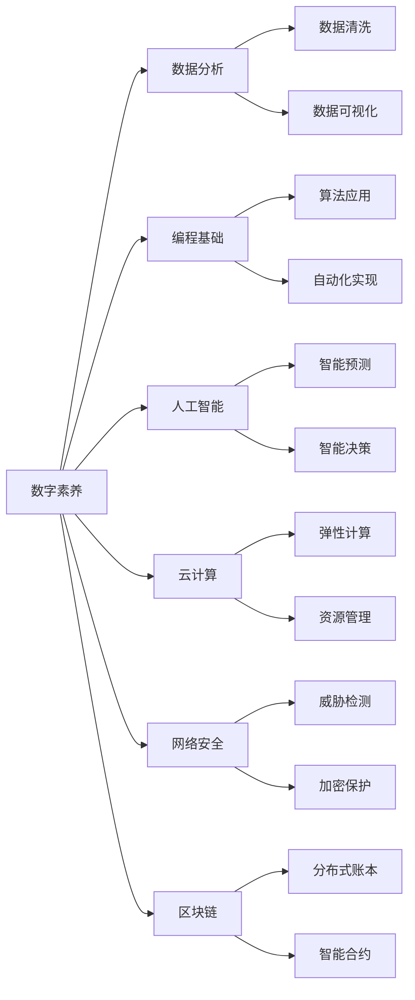
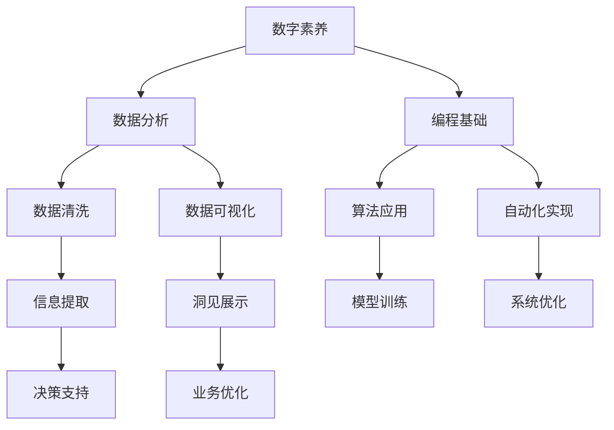

                 

# 数字素养：为了适应日益数字化的世界而需要学习、研究并应用的数字技能

> 关键词：数字素养, 数字技能, 数据分析, 编程基础, 人工智能, 云计算, 网络安全, 区块链, 大数据

## 1. 背景介绍

### 1.1 问题由来

在全球化和信息化的浪潮中，数字化已经深入到社会的各个层面，从个人生活到企业管理，从医疗健康到金融服务，无处不在。然而，随着数字化程度的提高，数字技能的不足和数字素养的匮乏也成为了制约数字化的主要障碍。

在现代社会，掌握基本的数字技能已成为一项基本生存技能。从小学到高中，数字素养和计算机编程等课程已被纳入教育体系，但在实际操作中，许多学生和成人仍缺乏足够的数字技能和素养，导致他们在日常生活中遇到种种不便和困扰。

### 1.2 问题核心关键点

数字素养的缺失，主要体现在以下几个方面：

- **数据分析能力**：不能有效利用大数据和统计分析工具，无法从海量数据中提取有价值的信息。
- **编程基础**：不具备基本的编程技能，无法理解和应用计算机语言和算法，难以实现复杂任务自动化。
- **人工智能理解**：对人工智能技术和应用缺乏深刻认识，无法利用AI工具提升工作效率。
- **云计算技能**：对云计算平台和云服务了解不足，难以在云端高效地管理和部署资源。
- **网络安全意识**：对网络安全和数据隐私保护缺乏基本认识，容易遭受网络攻击和数据泄露。
- **区块链技术**：对区块链和分布式账本技术了解甚少，难以参与数字经济的创新和变革。

这些核心关键点体现了数字素养缺失的广泛性和严重性，亟需进行系统性学习和提升。

### 1.3 问题研究意义

提高数字素养和掌握数字技能，对于适应数字化时代、提升工作效率、推动创新创业、保障网络安全具有重要意义：

1. **提升工作效率**：通过掌握数据分析、编程和AI技术，可以大大提升数据处理、任务自动化和智能决策的能力，减少人工操作，提高工作效率。
2. **推动创新创业**：数字技能和素养是数字经济的核心竞争力，掌握相关技能有助于创新创业，激发新的商业机会和增长点。
3. **保障网络安全**：提高网络安全意识和技能，可以防范网络攻击和数据泄露，保障个人和企业数据安全。
4. **参与数字变革**：掌握区块链等前沿技术，可以参与数字经济的创新和变革，推动社会进步和经济转型。

## 2. 核心概念与联系

### 2.1 核心概念概述

为了更好地理解数字素养和数字技能，本节将介绍几个密切相关的核心概念：

- **数字素养**：指个体在数字环境中的行为、知识、技能和态度，包括信息获取、数据分析、编程基础、人工智能应用、云计算技能、网络安全意识和区块链技术等。
- **数字技能**：指在数字环境中操作和应用相关技术和工具的能力，如数据分析工具的使用、编程语言的掌握、云计算平台的部署和管理、网络安全策略的制定和执行等。
- **数据分析**：通过收集、清洗、分析和可视化数据，提取有价值的信息和洞见，支持决策和业务优化。
- **编程基础**：掌握至少一种编程语言，能够理解和应用算法和数据结构，实现程序逻辑和自动化任务。
- **人工智能**：利用机器学习、深度学习等技术，实现对数据的智能分析和处理，提供预测和决策支持。
- **云计算**：通过云平台提供的资源和服务，实现弹性计算、存储和网络管理，支持分布式应用和系统部署。
- **网络安全**：通过技术和管理手段，保护网络系统、数据和应用的安全，防止未经授权的访问和攻击。
- **区块链**：利用分布式账本技术，实现数据的去中心化、透明化和安全性，支持数字货币、智能合约等应用。

这些核心概念之间的逻辑关系可以通过以下Mermaid流程图来展示：



这个流程图展示了大数字素养中各个关键技能之间的联系：

1. 数字素养是基础，涵盖了数据分析、编程、AI、云、安全、区块链等多个方面。
2. 数据分析技能包括数据清洗和可视化，从原始数据中提取有价值的信息。
3. 编程基础涉及算法应用和自动化实现，将数据处理逻辑编码成程序。
4. 人工智能侧重智能预测和决策，基于数据和模型进行预测和优化。
5. 云计算提供弹性计算和资源管理，支持分布式应用和系统部署。
6. 网络安全涵盖威胁检测和加密保护，保障系统安全和数据隐私。
7. 区块链利用分布式账本和智能合约技术，支持数字经济和创新应用。

### 2.2 概念间的关系

这些核心概念之间存在着紧密的联系，形成了数字素养和数字技能的完整生态系统。下面我们通过几个Mermaid流程图来展示这些概念之间的关系。

#### 2.2.1 数字素养的学习路径



这个流程图展示了数字素养学习路径，即从基础技能到高级技能的学习过程：

1. 数据分析从数据清洗开始，通过数据可视化提取洞见。
2. 编程基础包括算法应用和自动化实现，支持数据分析和AI任务。
3. 算法应用和模型训练是AI技术的关键，支持智能预测和决策。
4. 自动化实现和系统优化是软件开发的核心，提高效率和可靠性。
5. 信息提取和洞见展示支持业务优化，提供决策支持。

#### 2.2.2 数字技能的应用场景

```mermaid
graph LR
    A[数据分析] --> B[业务优化]
    A --> C[智能决策]
    A --> D[风险评估]
    A --> E[市场分析]
    B --> F[运营管理]
    B --> G[客户分析]
    C --> H[战略规划]
    C --> I[资源分配]
    D --> J[信用风险]
    D --> K[欺诈检测]
    E --> L[需求预测]
    E --> M[产品优化]
    F --> N[成本控制]
    F --> O[服务提升]
    G --> P[用户画像]
    G --> Q[个性化推荐]
    H --> R[竞争分析]
    H --> S[市场细分]
    I --> T[流程优化]
    I --> U[供应链管理]
    J --> V[违约预警]
    J --> W[信用评估]
    K --> X[异常检测]
    K --> Y[欺诈防范]
    L --> Z[需求预测]
    L --> $[需求管理]
    M --> [$[产品优化]
    M --> [产品创新]
    N --> [成本控制]
    N --> [资源配置]
    O --> [客户服务]
    O --> [客户反馈]
    P --> [用户画像]
    P --> [个性化推荐]
    Q --> [推荐系统]
    Q --> [用户互动]
    R --> [竞争分析]
    R --> [市场机会]
    S --> [市场细分]
    S --> [市场定位]
    T --> [流程优化]
    T --> [流程自动化]
    U --> [供应链管理]
    U --> [库存优化]
    V --> [违约预警]
    V --> [信用监控]
    W --> [信用评估]
    W --> [信用管理]
    X --> [异常检测]
    X --> [风险管理]
    Y --> [欺诈防范]
    Y --> [安全审计]
    Z --> [需求预测]
    Z --> [需求管理]
    $ --> [产品优化]
    $ --> [产品创新]
    [产品优化] --> [产品改进]
    [产品改进] --> [市场推广]
    [成本控制] --> [成本优化]
    [成本优化] --> [成本管理]
    [资源配置] --> [资源优化]
    [资源优化] --> [资源管理]
    [客户服务] --> [客户体验]
    [客户体验] --> [客户满意度]
    [客户反馈] --> [反馈分析]
    [反馈分析] --> [改进措施]
    [用户画像] --> [用户分析]
    [用户分析] --> [用户行为]
    [个性化推荐] --> [推荐系统]
    [推荐系统] --> [用户互动]
    [竞争分析] --> [竞争策略]
    [竞争策略] --> [市场机会]
    [市场细分] --> [市场定位]
    [市场定位] --> [市场拓展]
    [流程优化] --> [流程改进]
    [流程改进] --> [流程管理]
    [供应链管理] --> [供应链优化]
    [供应链优化] --> [供应链管理]
    [违约预警] --> [风险管理]
    [风险管理] --> [风险控制]
    [信用评估] --> [信用管理]
    [信用管理] --> [信用体系]
    [异常检测] --> [风险防范]
    [风险防范] --> [风险控制]
    [欺诈防范] --> [安全管理]
    [安全管理] --> [安全策略]
    [需求预测] --> [需求管理]
    [需求管理] --> [需求优化]
    [产品优化] --> [产品改进]
    [产品改进] --> [市场推广]
    [产品创新] --> [产品开发]
    [产品开发] --> [产品上市]
    [成本优化] --> [成本管理]
    [成本管理] --> [成本控制]
    [资源优化] --> [资源管理]
    [资源管理] --> [资源配置]
    [客户体验] --> [客户满意度]
    [客户满意度] --> [客户关系]
    [客户关系] --> [客户忠诚]
    [反馈分析] --> [改进措施]
    [改进措施] --> [改进策略]
    [用户分析] --> [用户行为]
    [用户行为] --> [用户互动]
    [推荐系统] --> [用户互动]
    [用户互动] --> [用户体验]
    [竞争策略] --> [市场机会]
    [市场机会] --> [市场拓展]
    [市场定位] --> [市场定位]
    [市场定位] --> [市场细分]
    [市场细分] --> [市场拓展]
    [市场拓展] --> [市场扩展]
    [流程改进] --> [流程管理]
    [流程管理] --> [流程优化]
    [供应链优化] --> [供应链管理]
    [供应链管理] --> [供应链优化]
    [风险管理] --> [风险控制]
    [风险控制] --> [风险防范]
    [信用管理] --> [信用体系]
    [信用体系] --> [信用评估]
    [风险防范] --> [安全管理]
    [安全管理] --> [安全策略]
    [需求预测] --> [需求管理]
    [需求管理] --> [需求优化]
    [产品改进] --> [市场推广]
    [市场推广] --> [市场拓展]
    [产品开发] --> [产品上市]
    [产品上市] --> [产品创新]
    [成本管理] --> [成本控制]
    [成本控制] --> [成本优化]
    [资源管理] --> [资源配置]
    [资源配置] --> [资源优化]
    [客户满意度] --> [客户关系]
    [客户关系] --> [客户忠诚]
    [改进措施] --> [改进策略]
    [改进策略] --> [改进计划]
    [用户行为] --> [用户互动]
    [用户互动] --> [用户体验]
    [市场机会] --> [市场拓展]
    [市场拓展] --> [市场扩展]
    [市场定位] --> [市场细分]
    [市场细分] --> [市场拓展]
    [市场扩展] --> [市场增长]
    [流程管理] --> [流程优化]
    [流程优化] --> [流程改进]
    [供应链管理] --> [供应链优化]
    [供应链优化] --> [供应链管理]
    [风险防范] --> [安全管理]
    [安全管理] --> [安全策略]
    [需求优化] --> [需求管理]
    [需求管理] --> [需求预测]
    [产品改进] --> [市场推广]
    [市场推广] --> [市场拓展]
    [产品上市] --> [产品创新]
    [产品创新] --> [产品开发]
    [成本控制] --> [成本优化]
    [成本优化] --> [成本管理]
    [资源配置] --> [资源优化]
    [资源优化] --> [资源管理]
    [客户满意度] --> [客户关系]
    [客户关系] --> [客户忠诚]
    [改进策略] --> [改进计划]
    [改进计划] --> [改进措施]
    [用户互动] --> [用户体验]
    [用户体验] --> [用户行为]
    [市场拓展] --> [市场增长]
    [市场增长] --> [市场扩展]
    [市场扩展] --> [市场机会]
    [市场机会] --> [竞争策略]
    [竞争策略] --> [竞争分析]
    [竞争分析] --> [竞争策略]
    [市场定位] --> [市场细分]
    [市场细分] --> [市场定位]
    [市场扩展] --> [市场增长]
    [市场增长] --> [市场机会]
    [市场机会] --> [竞争策略]
    [竞争策略] --> [竞争分析]
    [市场定位] --> [市场细分]
    [市场细分] --> [市场定位]
    [市场增长] --> [市场扩展]
    [市场扩展] --> [市场机会]
    [市场机会] --> [竞争策略]
    [竞争策略] --> [竞争分析]
    [市场定位] --> [市场细分]
    [市场细分] --> [市场定位]
    [市场扩展] --> [市场增长]
    [市场增长] --> [市场机会]
    [市场机会] --> [竞争策略]
    [竞争策略] --> [竞争分析]
    [市场定位] --> [市场细分]
    [市场细分] --> [市场定位]
    [市场扩展] --> [市场增长]
    [市场增长] --> [市场机会]
    [市场机会] --> [竞争策略]
    [竞争策略] --> [竞争分析]
    [市场定位] --> [市场细分]
    [市场细分] --> [市场定位]
    [市场扩展] --> [市场增长]
    [市场增长] --> [市场机会]
    [市场机会] --> [竞争策略]
    [竞争策略] --> [竞争分析]
    [市场定位] --> [市场细分]
    [市场细分] --> [市场定位]
    [市场扩展] --> [市场增长]
    [市场增长] --> [市场机会]
    [市场机会] --> [竞争策略]
    [竞争策略] --> [竞争分析]
    [市场定位] --> [市场细分]
    [市场细分] --> [市场定位]
    [市场扩展] --> [市场增长]
    [市场增长] --> [市场机会]
    [市场机会] --> [竞争策略]
    [竞争策略] --> [竞争分析]
    [市场定位] --> [市场细分]
    [市场细分] --> [市场定位]
    [市场扩展] --> [市场增长]
    [市场增长] --> [市场机会]
    [市场机会] --> [竞争策略]
    [竞争策略] --> [竞争分析]
    [市场定位] --> [市场细分]
    [市场细分] --> [市场定位]
    [市场扩展] --> [市场增长]
    [市场增长] --> [市场机会]
    [市场机会] --> [竞争策略]
    [竞争策略] --> [竞争分析]
    [市场定位] --> [市场细分]
    [市场细分] --> [市场定位]
    [市场扩展] --> [市场增长]
    [市场增长] --> [市场机会]
    [市场机会] --> [竞争策略]
    [竞争策略] --> [竞争分析]
    [市场定位] --> [市场细分]
    [市场细分] --> [市场定位]
    [市场扩展] --> [市场增长]
    [市场增长] --> [市场机会]
    [市场机会] --> [竞争策略]
    [竞争策略] --> [竞争分析]
    [市场定位] --> [市场细分]
    [市场细分] --> [市场定位]
    [市场扩展] --> [市场增长]
    [市场增长] --> [市场机会]
    [市场机会] --> [竞争策略]
    [竞争策略] --> [竞争分析]
    [市场定位] --> [市场细分]
    [市场细分] --> [市场定位]
    [市场扩展] --> [市场增长]
    [市场增长] --> [市场机会]
    [市场机会] --> [竞争策略]
    [竞争策略] --> [竞争分析]
    [市场定位] --> [市场细分]
    [市场细分] --> [市场定位]
    [市场扩展] --> [市场增长]
    [市场增长] --> [市场机会]
    [市场机会] --> [竞争策略]
    [竞争策略] --> [竞争分析]
    [市场定位] --> [市场细分]
    [市场细分] --> [市场定位]
    [市场扩展] --> [市场增长]
    [市场增长] --> [市场机会]
    [市场机会] --> [竞争策略]
    [竞争策略] --> [竞争分析]
    [市场定位] --> [市场细分]
    [市场细分] --> [市场定位]
    [市场扩展] --> [市场增长]
    [市场增长] --> [市场机会]
    [市场机会] --> [竞争策略]
    [竞争策略] --> [竞争分析]
    [市场定位] --> [市场细分]
    [市场细分] --> [市场定位]
    [市场扩展] --> [市场增长]
    [市场增长] --> [市场机会]
    [市场机会] --> [竞争策略]
    [竞争策略] --> [竞争分析]
    [市场定位] --> [市场细分]
    [市场细分] --> [市场定位]
    [市场扩展] --> [市场增长]
    [市场增长] --> [市场机会]
    [市场机会] --> [竞争策略]
    [竞争策略] --> [竞争分析]
    [市场定位] --> [市场细分]
    [市场细分] --> [市场定位]
    [市场扩展] --> [市场增长]
    [市场增长] --> [市场机会]
    [市场机会] --> [竞争策略]
    [竞争策略] --> [竞争分析]
    [市场定位] --> [市场细分]
    [市场细分] --> [市场定位]
    [市场扩展] --> [市场增长]
    [市场增长] --> [市场机会]
    [市场机会] --> [竞争策略]
    [竞争策略] --> [竞争分析]
    [市场定位] --> [市场细分]
    [市场细分] --> [市场定位]
    [市场扩展] --> [市场增长]
    [市场增长] --> [市场机会]
    [市场机会] --> [竞争策略]
    [竞争策略] --> [竞争分析]
    [市场定位] --> [市场细分]
    [市场细分] --> [市场定位]
    [市场扩展] --> [市场增长]
    [市场增长] --> [市场机会]
    [市场机会] --> [竞争策略]
    [竞争策略] --> [竞争分析]
    [市场定位] --> [市场细分]
    [市场细分] --> [市场定位]
    [市场扩展] --> [市场增长]
    [市场增长] --> [市场机会]
    [市场机会] --> [竞争策略]
    [竞争策略] --> [竞争分析]
    [市场定位] --> [市场细分]
    [市场细分] --> [市场定位]
    [市场扩展] --> [市场增长]
    [市场增长] --> [市场机会]
    [市场机会] --> [竞争策略]
    [竞争策略] --> [竞争分析]
    [市场定位] --> [市场细分]
    [市场细分] --> [市场定位]
    [市场扩展] --> [市场增长]
    [市场增长] --> [市场机会]
    [市场机会] --> [竞争策略]
    [竞争策略] --> [竞争分析]
    [市场定位] --> [市场细分]
    [市场细分] --> [市场定位]
    [市场扩展] --> [市场增长]
    [市场增长] --> [市场机会]
    [市场机会] --> [竞争策略]
    [竞争策略] --> [竞争分析]
    [市场定位] --> [市场细分]
    [市场细分] --> [市场定位]
    [市场扩展] --> [市场增长]
    [市场增长] --> [市场机会]
    [市场机会] --> [竞争策略]
    [竞争策略] --> [竞争分析]
    [市场定位] --> [市场细分]
    [市场细分] --> [市场定位]
    [市场扩展] --> [市场增长]
    [市场增长] --> [市场机会]
    [市场机会] --> [竞争策略]
    [竞争策略] --> [竞争分析]
    [市场定位] --> [市场细分]
    [市场细分] --> [市场定位]
    [市场扩展] --> [市场增长]
    [市场增长] --> [市场机会]
    [市场机会] --> [竞争策略]
    [竞争策略] --> [竞争分析]
    [市场定位] --> [市场细分]
    [市场细分] --> [市场定位]
    [市场扩展] --> [市场增长]
    [市场增长] --> [市场机会]
    [市场机会] --> [竞争策略]
    [竞争策略] --> [竞争分析]
    [市场定位] --> [市场细分]
    [市场细分] --> [市场定位]
    [市场扩展] --> [市场增长]
    [市场增长] --> [市场机会]
    [市场机会] --> [竞争策略]
    [竞争策略] --> [竞争分析]
    [市场定位] --> [市场细分]
    [市场细分] --> [市场定位]
    [市场扩展] --> [市场增长]
    [市场增长] --> [市场机会]
    [市场机会] --> [竞争策略]
    [竞争策略] --> [竞争分析]
    [市场定位] --> [市场细分]
    [市场细分] --> [市场定位]
    [市场扩展] --> [市场增长]
    [市场增长] --> [市场机会]
    [市场机会] --> [竞争策略]
    [竞争策略] --> [竞争分析]
    [市场定位] --> [市场细分]
    [市场细分] --> [市场定位]
    [市场扩展] --> [市场增长]
    [市场增长] --> [市场机会]
    [市场机会] --> [竞争策略]
    [竞争策略] --> [竞争分析]
    [市场定位] --> [市场细分]
    [市场细分] --> [市场定位]
    [市场扩展] --> [市场增长]
    [市场增长] --> [市场机会]
    [市场机会] --> [竞争策略]
    [竞争策略] --> [竞争分析]
    [市场定位] --> [市场细分]
    [市场细分] --> [市场定位]
    [市场扩展] --> [市场增长]
    [市场增长] --> [市场机会]
    [市场机会] --> [竞争策略]
    [竞争策略] --> [竞争分析]
    [市场定位] --> [市场细分]
    [市场细分] --> [市场定位]
    [市场扩展] --> [市场增长]
    [市场增长] --> [市场机会]
    [市场机会] --> [竞争策略]
    [竞争策略] --> [竞争分析]
    [市场定位] --> [市场细分]
    [市场细分] --> [市场定位]
    [市场扩展] --> [市场增长]
    [市场增长] --> [市场机会]
    [市场机会] --> [竞争策略]
    [竞争策略] --> [竞争分析]
    [市场定位] --> [市场细分]
    [市场细分] --> [市场定位]
    [市场扩展] --> [市场增长]
    [市场增长] --> [市场机会]
    [市场机会] --> [竞争策略]
    [竞争策略] --> [竞争分析]
    [市场定位] --> [市场细分]
    [市场细分] --> [市场定位]
    [市场扩展] --> [市场增长]
    [市场增长] --> [市场机会]
    [市场机会] --> [竞争策略]
    [竞争策略] --> [竞争分析]
    [市场定位] --> [市场细分]
    [市场细分] --> [市场定位]
    [市场扩展] --> [市场增长]
    [市场增长] --> [市场机会]
    [市场机会] --> [竞争策略]
    [竞争策略] --> [竞争分析]
    [市场定位] --> [市场细分]
    [市场细分] --> [市场定位]
    [市场扩展] --> [市场增长]
    [市场增长] --> [市场机会]
    [市场机会] --> [竞争策略]
    [竞争策略] --> [竞争分析]
    [市场定位] --> [市场细分]
    [市场细分] --> [市场定位]
    [市场扩展] --> [市场增长]
    [市场增长] --> [市场机会]
    [市场机会] --> [竞争策略]
    [竞争策略] --> [竞争分析]
    [市场定位] --> [市场细分]
    [市场细分] --> [市场定位]
    [市场扩展] --> [市场增长]
    [市场增长] --> [市场机会]
    [市场机会] --> [竞争策略]
    [竞争策略] --> [竞争分析]
    [市场定位] --> [市场细分]
    [市场细分] --> [市场定位]
    [市场扩展] --> [市场增长]
    [市场增长] --> [市场机会]
    [市场机会] --> [竞争策略]
    [竞争策略] --> [竞争分析]
    [市场定位] --> [市场细分]
    [市场细分] --> [市场定位]
    [市场扩展] --> [市场增长]
    [市场增长] --> [市场机会]
    [市场机会] --> [竞争策略]
    [竞争策略] --> [竞争分析]
    [市场定位] --> [市场细分]
    [市场细分] --> [市场定位]
    [市场

