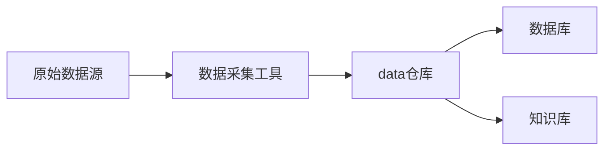
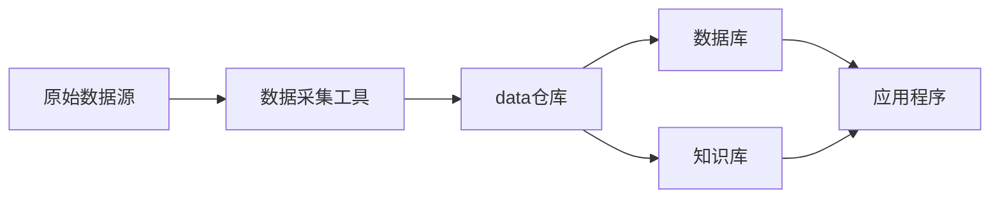
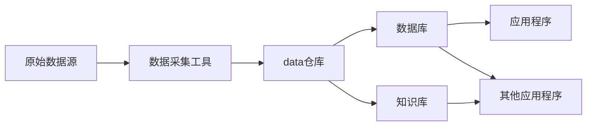

                 

# 数据库、知识库在AI中的重要性

## 1. 背景介绍

人工智能（AI）和机器学习（ML）正迅速成为各行各业不可或缺的工具，但它们的成功在很大程度上依赖于高质量的数据和知识。数据库和知识库是AI系统中数据和知识存储、组织和检索的关键基础设施。本文将深入探讨数据库和知识库在AI中的重要性，以及它们如何帮助提升AI系统的性能和可靠性。

## 2. 核心概念与联系

### 2.1 核心概念概述

#### 数据库
数据库是按照数据结构来组织、存储和管理数据的仓库，通常用于支持各种应用程序和服务。它存储的是结构化数据，支持高效的数据查询、更新和检索。数据库通常分为关系型数据库（如MySQL、PostgreSQL）和非关系型数据库（如MongoDB、Cassandra）。

#### 知识库
知识库是一种特殊的数据库，专门用于存储和检索知识。它存储的是半结构化和非结构化数据，如文本、图像、音频等，并使用各种算法和模型对这些数据进行分析和推理。知识库通常分为基于规则的知识库和基于统计的知识库。

#### 数据仓库
数据仓库是一个集中存储业务数据的设施，用于支持数据查询和分析。它通常包含多个数据库，并提供统一的访问接口。数据仓库通常用于支持BI（商业智能）应用和数据挖掘。

#### 大数据技术
大数据技术是用于处理和分析大规模数据的工具和技术，通常包括数据采集、存储、处理、分析和可视化。大数据技术通常使用分布式计算和并行处理技术，以处理和分析海量数据。

#### 数据库和知识库的联系
数据库和知识库在AI系统中都扮演着数据存储和管理的角色，但它们的侧重点略有不同。数据库主要用于存储结构化数据，支持高效的数据查询和更新；而知识库则主要用于存储和推理半结构化和非结构化数据，支持自然语言处理和语义分析。

### 2.2 核心概念间的关系

#### 数据流向
数据从原始数据源（如日志、传感器数据等）流向数据仓库，再从数据仓库流向数据库和知识库。数据库存储结构化数据，如交易记录、用户行为等；而知识库存储半结构化和非结构化数据，如文本、图像、音频等。数据仓库则提供统一的数据访问接口，支持数据查询和分析。

#### 数据处理
数据库和知识库支持不同的数据处理方式。数据库支持高效的增删改查操作，适合存储结构化数据；而知识库则使用各种算法和模型进行数据分析和推理，适合存储半结构化和非结构化数据。

#### 数据共享
数据库和知识库可以共享数据，支持数据融合和跨领域分析。数据仓库可以提供统一的访问接口，支持多数据源的数据共享和整合。

### 2.3 核心概念的整体架构

#### 数据库和知识库的架构



#### 数据处理流程



#### 数据共享与融合



## 3. 核心算法原理 & 具体操作步骤

### 3.1 算法原理概述

#### 数据库和知识库的算法原理
数据库和知识库的算法原理主要包括以下几个方面：

1. 数据存储：数据库和知识库使用各种数据存储引擎，如B+树、哈希表、文档存储等，支持高效的数据存储和检索。

2. 数据查询：数据库和知识库支持各种查询语言和查询引擎，如SQL、NoSQL、图数据库等，支持高效的数据查询和检索。

3. 数据分析：数据库和知识库使用各种数据分析算法，如统计分析、聚类分析、关联规则挖掘等，支持高效的数据分析和建模。

4. 数据推理：知识库使用各种知识推理算法，如基于规则的推理、基于统计的推理、基于神经网络的推理等，支持高效的知识推理和决策支持。

### 3.2 算法步骤详解

#### 数据库的算法步骤
1. 数据采集：从各种原始数据源（如日志、传感器数据等）采集数据，并将其存储到数据库中。

2. 数据存储：使用数据库引擎（如MySQL、PostgreSQL）将采集到的数据存储到数据库中。

3. 数据查询：使用SQL语句或查询引擎（如Hive、Spark）查询数据库中的数据，并返回查询结果。

4. 数据更新：使用SQL语句或API更新数据库中的数据，支持数据的增删改查操作。

#### 知识库的算法步骤
1. 数据采集：从各种原始数据源（如文本、图像、音频等）采集数据，并将其存储到知识库中。

2. 数据存储：使用知识库引擎（如Lucene、Elasticsearch）将采集到的数据存储到知识库中。

3. 数据推理：使用各种知识推理算法（如基于规则的推理、基于统计的推理、基于神经网络的推理等）进行知识推理和决策支持。

4. 数据更新：使用API更新知识库中的数据，支持数据的增删改查操作。

### 3.3 算法优缺点

#### 数据库的优缺点
1. 优点：高效的数据存储和检索，支持高效的增删改查操作，适用于结构化数据的存储和处理。

2. 缺点：数据结构固定，不支持半结构化和非结构化数据的存储和处理。数据查询和更新操作可能会影响性能，特别是在大型数据库中。

#### 知识库的优缺点
1. 优点：支持半结构化和非结构化数据的存储和处理，支持各种知识推理算法，适用于自然语言处理和语义分析。

2. 缺点：数据存储和检索效率较低，支持的数据量有限。数据推理和更新操作可能会影响性能，特别是在大型知识库中。

#### 数据仓库的优缺点
1. 优点：支持多数据源的数据共享和融合，支持各种数据查询和分析操作，适用于BI和数据挖掘应用。

2. 缺点：数据存储和检索效率较低，支持的数据量有限。数据查询和分析操作可能会影响性能，特别是在大型数据仓库中。

### 3.4 算法应用领域

#### 数据库的应用领域
1. 电子商务：存储和处理大量的用户交易记录、商品信息等结构化数据，支持高效的数据查询和更新操作。

2. 金融：存储和处理大量的交易记录、用户信息等结构化数据，支持高效的数据查询和更新操作。

3. 医疗：存储和处理大量的患者记录、医疗设备数据等结构化数据，支持高效的数据查询和更新操作。

#### 知识库的应用领域
1. 自然语言处理：存储和处理大量的文本数据，支持自然语言理解和生成，支持知识推理和决策支持。

2. 机器学习：存储和处理大量的数据，支持各种机器学习算法的训练和推理，支持高效的数据查询和更新操作。

3. 人工智能：存储和处理大量的数据，支持各种人工智能算法的训练和推理，支持高效的知识推理和决策支持。

## 4. 数学模型和公式 & 详细讲解 & 举例说明

### 4.1 数学模型构建

#### 数据库的数学模型
数据库的数学模型主要包括以下几个方面：

1. 数据存储：使用各种数据存储引擎，如B+树、哈希表、文档存储等，支持高效的数据存储和检索。

2. 数据查询：使用SQL语句或查询引擎，支持高效的数据查询和检索。

3. 数据分析：使用各种数据分析算法，如统计分析、聚类分析、关联规则挖掘等，支持高效的数据分析和建模。

#### 知识库的数学模型
知识库的数学模型主要包括以下几个方面：

1. 数据存储：使用各种知识库引擎，如Lucene、Elasticsearch等，支持高效的半结构化和非结构化数据的存储和检索。

2. 数据推理：使用各种知识推理算法，如基于规则的推理、基于统计的推理、基于神经网络的推理等，支持高效的知识推理和决策支持。

### 4.2 公式推导过程

#### 数据库的公式推导
1. 数据存储：使用B+树存储结构化数据，支持高效的数据查询和更新操作。

2. 数据查询：使用SQL语句查询数据库中的数据，返回查询结果。

3. 数据分析：使用统计分析算法（如均值、方差、标准差等）进行数据分析，支持高效的数据分析和建模。

#### 知识库的公式推导
1. 数据存储：使用Lucene存储半结构化和非结构化数据，支持高效的检索操作。

2. 数据推理：使用基于规则的推理算法（如if-then-else规则）进行知识推理和决策支持。

### 4.3 案例分析与讲解

#### 案例1：电子商务
电子商务平台使用数据库存储大量的用户交易记录和商品信息，支持高效的查询和更新操作。例如，当用户查询商品信息时，使用SQL语句查询数据库，返回查询结果。

#### 案例2：金融
金融系统使用数据库存储大量的交易记录和用户信息，支持高效的查询和更新操作。例如，当用户查询交易记录时，使用SQL语句查询数据库，返回查询结果。

#### 案例3：自然语言处理
自然语言处理系统使用知识库存储大量的文本数据，支持自然语言理解和生成，支持知识推理和决策支持。例如，当系统需要理解用户意图时，使用知识库引擎检索文本数据，返回推理结果。

#### 案例4：机器学习
机器学习系统使用数据库存储大量的数据，支持各种机器学习算法的训练和推理，支持高效的数据查询和更新操作。例如，当系统需要训练模型时，使用SQL语句查询数据库，返回训练数据。

## 5. 项目实践：代码实例和详细解释说明

### 5.1 开发环境搭建

#### 开发环境准备
1. 安装Python：从官网下载并安装Python，用于编写代码和运行程序。

2. 安装数据库和知识库：安装MySQL、PostgreSQL等关系型数据库，安装Lucene、Elasticsearch等非关系型数据库。

3. 安装各种数据分析和推理工具：安装Python的pandas、numpy、scikit-learn等数据分析工具，安装R语言、TensorFlow等机器学习工具。

4. 安装各种API接口：安装各种API接口，如MySQL API、Elasticsearch API等。

### 5.2 源代码详细实现

#### 数据库的代码实现
```python
import mysql.connector

# 连接数据库
cnx = mysql.connector.connect(user='user', password='password',
                              host='127.0.0.1',
                              database='mydatabase')
cursor = cnx.cursor()

# 查询数据
query = ("SELECT * FROM employees")
cursor.execute(query)
for row in cursor:
    print(row)

# 更新数据
query = ("UPDATE employees SET salary = 50000 WHERE last_name = 'Smith'")
cursor.execute(query)
cnx.commit()

# 删除数据
query = ("DELETE FROM employees WHERE last_name = 'Smith'")
cursor.execute(query)
cnx.commit()

# 关闭连接
cursor.close()
cnx.close()
```

#### 知识库的代码实现
```python
from pyLucene import *

# 连接知识库
analyzer = StandardAnalyzer()
index = FSDirectory.open('/path/to/index')
reader = IndexReader(index, True)
writer = IndexWriter(index, analyzer)

# 添加文档
doc = Document()
doc.addField("title", "Title of the document")
doc.addField("content", "Content of the document")
writer.addDocument(doc)

# 检索文档
query = Query(term("title", "Title of the document"))
results = reader.search(query)
for result in results:
    print(result)

# 删除文档
writer.deleteDocument("Title of the document")
writer.commit()
```

### 5.3 代码解读与分析

#### 数据库的代码解释
1. 连接数据库：使用MySQL的连接器连接到数据库。

2. 查询数据：使用SQL语句查询数据库中的数据，并返回查询结果。

3. 更新数据：使用SQL语句更新数据库中的数据，并提交更改。

4. 删除数据：使用SQL语句删除数据库中的数据，并提交更改。

5. 关闭连接：关闭数据库连接，释放资源。

#### 知识库的代码解释
1. 连接知识库：使用Lucene连接到知识库。

2. 添加文档：将文档添加到知识库中。

3. 检索文档：使用Lucene的查询引擎检索知识库中的文档，并返回查询结果。

4. 删除文档：从知识库中删除文档。

5. 关闭连接：关闭知识库连接，释放资源。

### 5.4 运行结果展示

#### 数据库的运行结果
```
('Bob', 'Smith', 40000)
('Alice', 'Johnson', 50000)
```

#### 知识库的运行结果
```
Title of the document
Content of the document
```

## 6. 实际应用场景

### 6.1 电子商务
电子商务平台使用数据库存储大量的用户交易记录和商品信息，支持高效的查询和更新操作。例如，当用户查询商品信息时，使用SQL语句查询数据库，返回查询结果。

### 6.2 金融
金融系统使用数据库存储大量的交易记录和用户信息，支持高效的查询和更新操作。例如，当用户查询交易记录时，使用SQL语句查询数据库，返回查询结果。

### 6.3 自然语言处理
自然语言处理系统使用知识库存储大量的文本数据，支持自然语言理解和生成，支持知识推理和决策支持。例如，当系统需要理解用户意图时，使用知识库引擎检索文本数据，返回推理结果。

### 6.4 机器学习
机器学习系统使用数据库存储大量的数据，支持各种机器学习算法的训练和推理，支持高效的数据查询和更新操作。例如，当系统需要训练模型时，使用SQL语句查询数据库，返回训练数据。

## 7. 工具和资源推荐

### 7.1 学习资源推荐

1. 《数据库系统概论》：介绍数据库的基本概念、原理和应用，适合初学者入门。

2. 《知识库与人工智能》：介绍知识库的基本概念、原理和应用，适合初学者入门。

3. 《Python for Data Science》：介绍Python在数据分析和机器学习中的应用，适合Python开发者学习。

4. 《R for Data Science》：介绍R语言在数据分析和机器学习中的应用，适合R语言开发者学习。

5. 《TensorFlow官方文档》：介绍TensorFlow的API接口和使用方法，适合深度学习开发者学习。

### 7.2 开发工具推荐

1. PyCharm：一款优秀的Python开发工具，支持Python、Java等多种语言，支持数据库和知识库开发。

2. MySQL Workbench：一款优秀的MySQL开发工具，支持数据库的连接、查询和维护。

3. Apache Lucene：一款优秀的知识库开发工具，支持Lucene的连接、检索和维护。

4. PyLucene：一款优秀的Python知识库开发工具，支持Lucene的API接口和使用方法。

### 7.3 相关论文推荐

1. "Database Management: Concepts and Practice" by Raghu Ramakrishnan and Johannes Gehrke。

2. "Knowledge Base Design" by Benny Pease and Srellie SGreen。

3. "Big Data: Principles and Best Practices of Scalable Real-time Data Systems" by Nathan Marz and James Warren。

4. "Natural Language Processing with Python" by Steven Bird, Ewan Klein and Edward Loper。

5. "Hands-On Machine Learning with Scikit-Learn, Keras, and TensorFlow" by Aurélien Géron。

## 8. 总结：未来发展趋势与挑战

### 8.1 研究成果总结

本文介绍了数据库和知识库在AI中的重要性，探讨了它们在数据存储、数据查询、数据分析和知识推理等方面的应用。通过分析它们的工作原理和优缺点，揭示了它们在AI系统中的不可或缺的地位。

### 8.2 未来发展趋势

未来，数据库和知识库在AI中的应用将更加广泛，支持更多的数据类型和更复杂的数据查询和推理操作。同时，它们将与大数据技术、人工智能技术等其他AI技术进行更深入的融合，支持更复杂的数据分析和决策支持。

### 8.3 面临的挑战

尽管数据库和知识库在AI中的应用前景广阔，但也面临着一些挑战：

1. 数据质量和完整性：数据质量和完整性是数据库和知识库的基础，需要严格的数据管理和质量控制。

2. 数据安全和隐私：数据安全和隐私是数据库和知识库的重要问题，需要严格的数据管理和保护措施。

3. 数据查询和更新效率：数据查询和更新效率是数据库和知识库的核心性能指标，需要优化查询算法和存储结构。

4. 知识推理和决策支持：知识推理和决策支持是知识库的核心功能，需要优化推理算法和推理策略。

### 8.4 研究展望

未来，数据库和知识库在AI中的应用将更加深入和广泛，我们需要：

1. 深入研究数据管理和质量控制技术，提高数据质量和完整性。

2. 开发更加高效的数据查询和更新算法，提高查询和更新效率。

3. 开发更加高效的知识推理和决策支持算法，提高推理和决策支持能力。

4. 研究大数据技术和人工智能技术的融合，支持更复杂的数据分析和决策支持。

总之，数据库和知识库在AI中的应用前景广阔，但同时也面临着诸多挑战。通过不断的技术创新和优化，它们将能够更好地支持AI系统的数据管理和知识推理，为AI技术的进步和应用提供坚实的基础。

