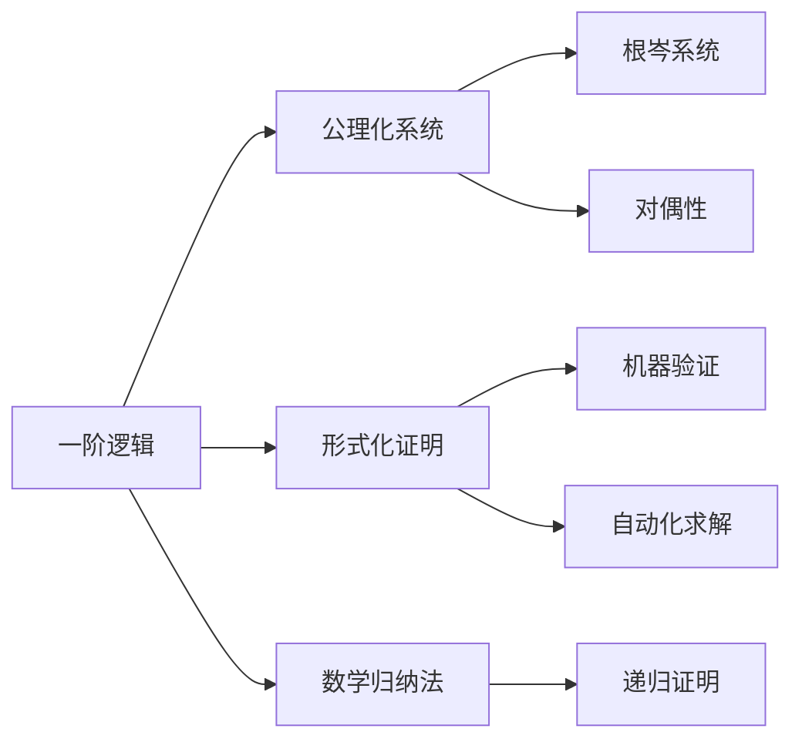
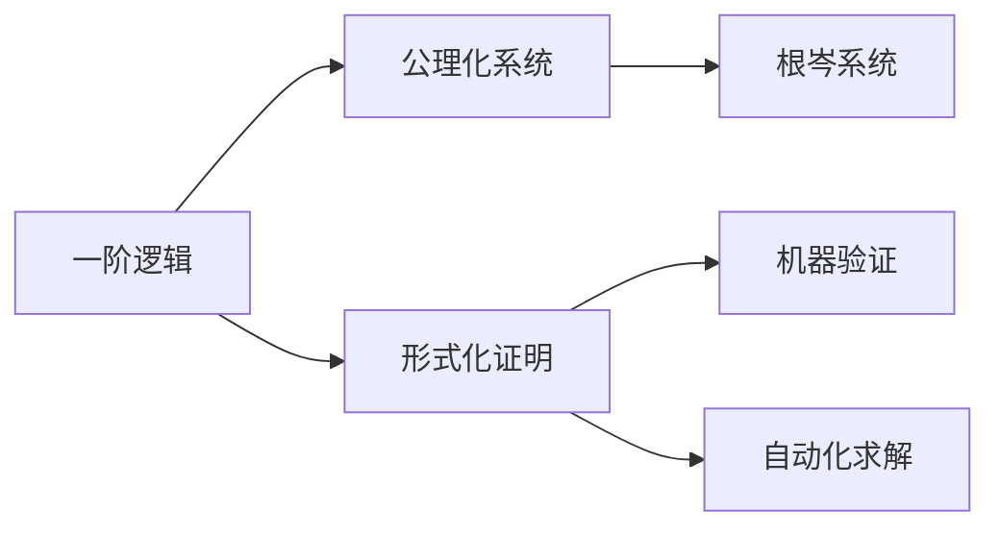
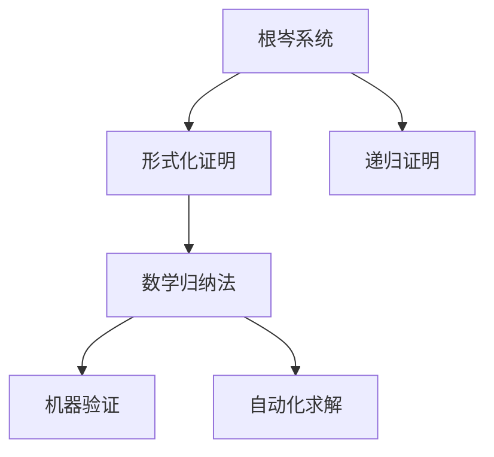
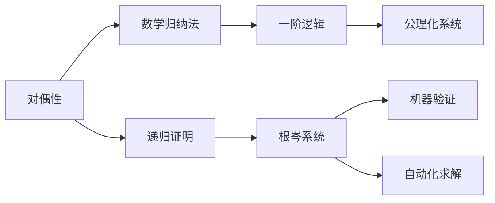

                 

# 数理逻辑：根岑系统和对偶性

数理逻辑，作为计算机科学和数学的基础，一直是理论计算机科学的核心。根岑系统、对偶性等数理逻辑的概念，在程序验证、证明自动化、定理自动求解等方面，有着重要的理论和实践意义。本文将系统介绍根岑系统、对偶性等数理逻辑的核心概念，探讨其在数理逻辑中的应用，为深入理解数理逻辑提供理论基础和实际指导。

## 1. 背景介绍

### 1.1 问题由来

数理逻辑的历史源远流长，从亚里士多德的逻辑推理到布尔代数，再到哥德尔的不完备性定理，数理逻辑在数学、计算机科学、人工智能等领域都有广泛的应用。但数理逻辑的学习难度较大，对抽象概念和数学证明要求较高，往往需要较为系统化的学习才能掌握。

数理逻辑的挑战在于，如何平衡理论与实际应用的关系。一方面，数理逻辑在理论数学、计算机证明等抽象领域应用广泛，但其模型往往过于复杂，难以直接应用于实际问题。另一方面，数理逻辑在形式化验证、程序自动化证明等领域有着巨大的潜力，但理论模型和实际应用场景之间的桥梁尚需进一步研究。

### 1.2 问题核心关键点

本文聚焦于根岑系统、对偶性等数理逻辑的核心概念，通过探讨这些概念的理论基础和实际应用，提出数理逻辑在大规模验证和自动化求解中的应用策略。

根岑系统是数理逻辑中一种重要的方法论，主要应用于一阶逻辑的证明和验证。它基于数学归纳法，通过将证明过程形式化，逐步构建证明的逻辑框架，最终完成定理的证明或验证。

对偶性则是一种结构对称的性质，广泛应用于数学和计算机科学中。数理逻辑中对偶性的一个经典例子是Hilbert的对偶性定理，即在某种意义上，逻辑理论中的定理和矛盾是等价的。

这些数理逻辑概念不仅是数理逻辑领域的基础，也是数理逻辑应用于大规模验证和自动化求解的关键。理解这些概念，对于深入研究数理逻辑的应用，有着重要的理论指导意义。

## 2. 核心概念与联系

### 2.1 核心概念概述

为更好地理解根岑系统和对偶性等数理逻辑概念，本节将介绍几个密切相关的核心概念：

- 一阶逻辑：数学中的一种逻辑理论，主要用于表示数学结构的性质和关系。
- 公理化系统：基于一组公理和推理规则建立起来的逻辑系统。
- 形式化证明：将数学证明过程形式化，用符号语言表示推理步骤，便于机器验证和自动化求解。
- 数学归纳法：一种数学证明方法，通过归纳假设和递归证明，证明命题对所有自然数成立。
- 对偶性：结构上对称的性质，反映了一组数学对象或概念之间的内在联系。

这些核心概念之间的逻辑关系可以通过以下Mermaid流程图来展示：



这个流程图展示了数理逻辑中几个关键概念之间的关系：

1. 一阶逻辑是数理逻辑的基础，公理化系统建立在公理之上。
2. 形式化证明和数学归纳法是证明的工具。
3. 根岑系统基于数学归纳法构建证明框架。
4. 对偶性反映了一组对象或概念之间的内在联系。
5. 机器验证和自动化求解是形式化证明的目标。

这些核心概念共同构成了数理逻辑的理论基础和应用框架，使得数理逻辑在形式化验证、程序自动化证明等领域发挥重要作用。通过理解这些核心概念，我们可以更好地把握数理逻辑的理论基础和应用方向。

### 2.2 概念间的关系

这些核心概念之间存在着紧密的联系，形成了数理逻辑的完整生态系统。下面我们通过几个Mermaid流程图来展示这些概念之间的关系。

#### 2.2.1 一阶逻辑和公理化系统



这个流程图展示了数理逻辑中一阶逻辑和公理化系统的关系。一阶逻辑是一组基于符号语言的数学表达式，而公理化系统则是一组基于逻辑推理的公理和规则。

#### 2.2.2 根岑系统和形式化证明



这个流程图展示了根岑系统在形式化证明中的应用。根岑系统通过数学归纳法构建证明框架，形式化证明则将证明过程用符号语言表示。

#### 2.2.3 对偶性和数学归纳法



这个流程图展示了对偶性在数学归纳法中的应用。数学归纳法通过递归证明，对一阶逻辑中的命题进行归纳假设和递归证明。对偶性则反映了递归证明中的对称性。

## 3. 核心算法原理 & 具体操作步骤
### 3.1 算法原理概述

根岑系统是一种基于数学归纳法的证明方法，其核心思想是通过构建一个递归的证明框架，逐步完成定理的证明。在形式上，根岑系统通常由以下几个部分组成：

1. 公理：一组基于数学归纳法的基本命题，作为证明的起点。
2. 推理规则：一组逻辑推理规则，用于从一个或多个命题推导出新的命题。
3. 归纳假设：对自然数n进行归纳假设，证明命题对所有自然数成立。
4. 递归证明：通过归纳假设和推理规则，逐步证明命题对所有自然数成立。

对偶性则是一种结构对称的性质，在数理逻辑中，常见应用包括Hilbert的对偶性定理。Hilbert的对偶性定理指出，在一阶逻辑中，定理与矛盾是等价的，即定理的证明等价于矛盾的证明。

### 3.2 算法步骤详解

根岑系统的证明步骤如下：

1. 将待证明的命题拆分为若干个子命题，每个子命题形式化为一个公理或通过推理规则推导而来。
2. 对子命题进行归纳假设，假设命题在自然数n时成立。
3. 通过推理规则和归纳假设，逐步证明命题在n+1时也成立。
4. 重复步骤2和3，直到命题对所有自然数成立。

对偶性的应用步骤如下：

1. 对一阶逻辑中的定理进行形式化，用符号语言表示。
2. 将定理转换为等价的矛盾命题，通过递归证明矛盾命题，等价证明了定理的成立。
3. 利用对偶性定理，将定理的证明转换为矛盾的证明，从而完成定理的验证。

### 3.3 算法优缺点

根岑系统的优点包括：

1. 形式化严格：通过数学归纳法和递归证明，根岑系统的证明过程形式化，便于机器验证和自动化求解。
2. 可复现性好：根岑系统的证明过程基于符号语言，可复现性好，便于验证和改进。
3. 适用范围广：根岑系统适用于形式化推理和自动求解，适用于各种数理逻辑问题。

缺点包括：

1. 计算复杂度高：根岑系统的计算复杂度较高，特别是在处理大规模问题时，计算量较大。
2. 难以处理未知问题：对于新出现的问题，根岑系统需要重新构建证明框架，灵活性不足。

对偶性的优点包括：

1. 证明等价：对偶性定理指出，定理与矛盾是等价的，极大简化了证明过程。
2. 便于验证：通过证明矛盾命题，可以等价验证定理的成立。

缺点包括：

1. 依赖符号表示：对偶性的应用依赖于符号表示，对符号处理的要求较高。
2. 适用范围有限：对偶性定理适用于特定形式的一阶逻辑，适用范围有限。

### 3.4 算法应用领域

根岑系统和对偶性在数理逻辑中有着广泛的应用，主要应用于以下几个领域：

1. 形式化验证：根岑系统和对偶性常用于形式化验证，验证程序的逻辑正确性和安全性。
2. 自动定理求解：通过根岑系统构建证明框架，自动定理求解技术可以快速求解复杂的数学问题。
3. 程序证明：根岑系统可用于形式化证明程序的正确性和有效性。
4. 模型验证：通过根岑系统和对偶性，验证模型的逻辑正确性和一致性。
5. 形式化语言设计：根岑系统可用于设计形式化的编程语言，保证语言语义的正确性和可验证性。

这些应用领域展示了根岑系统和对偶性的强大潜力和广泛适用性，为数理逻辑在实际问题中的应用提供了理论基础和实践指导。

## 4. 数学模型和公式 & 详细讲解 & 举例说明

### 4.1 数学模型构建

根岑系统的数学模型通常由以下几个部分构成：

1. 公理集：一组基于数学归纳法的基本命题。
2. 推理规则集：一组逻辑推理规则，用于从一个或多个命题推导出新的命题。
3. 归纳假设：对自然数n进行归纳假设，证明命题对所有自然数成立。
4. 递归证明：通过归纳假设和推理规则，逐步证明命题对所有自然数成立。

对偶性则通过结构对称性进行证明，其数学模型通常包括以下部分：

1. 定理命题：形式化表示的定理命题。
2. 矛盾命题：形式化表示的矛盾命题。
3. 对偶映射：定义一个对偶映射，将定理命题映射为矛盾命题。
4. 递归证明：通过递归证明矛盾命题，等价证明了定理的成立。

### 4.2 公式推导过程

根岑系统的证明过程可以通过数学归纳法进行形式化，以下推导一阶逻辑中加法公理的根岑系统证明：

1. 公理：
   - (0) 0 + x = x
   - (I) x + y = x + (y + z) （加法结合律）

2. 推理规则：
   - (R) 若 p, q 成立，则 p ∧ q 成立。

3. 归纳假设：假设命题 p(n) = 0 + n 对所有自然数 n 成立。

4. 递归证明：
   - 基础情况：当 n = 0 时，0 + n = n，满足归纳假设。
   - 归纳步骤：假设命题 p(k) = 0 + k 对所有自然数 k 成立，需证明 p(k+1) = 0 + (k+1)。
   - 根据归纳假设，p(k) = 0 + k，由推理规则 (I) 可得 p(k+1) = (0 + k) + 1 = 0 + (k+1)，满足归纳假设。

对偶性的应用通常通过Hilbert的对偶性定理进行证明，以下推导一阶逻辑中加法公理的对偶性证明：

1. 定理命题：0 + x = x

2. 矛盾命题：0 + x ≠ x

3. 对偶映射：定义一个对偶映射 f，f(p) = ¬p，即对命题取否定。

4. 递归证明：
   - 基础情况：当 n = 0 时，0 + n = n，满足归纳假设。
   - 归纳步骤：假设命题 f(p(k)) = f(0 + k) = ¬(0 + k) = ¬(0 + (k + 1)) = ¬(0 + k + 1) = ¬(0 + (k + 1))，需证明 f(p(k+1)) = f(0 + (k + 1)) = ¬(0 + (k + 1))。
   - 根据归纳假设，f(p(k)) = ¬(0 + k) = ¬(0 + (k + 1))，由推理规则 (I) 可得 f(p(k+1)) = ¬(0 + (k + 1)) = ¬(0 + (k + 1))，满足归纳假设。

### 4.3 案例分析与讲解

案例1：形式化验证程序正确性

假设有一段程序，需要验证其正确性。通过将程序逻辑形式化，用符号语言表示程序状态和操作，构建根岑系统，可以逐步证明程序的正确性和有效性。

```python
def add(a, b):
    if a == 0:
        return b
    else:
        return add(a-1, b+1)

# 形式化表示
p(a, b) = add(a, b) = a + b
q(a, b) = add(a-1, b+1) = a + b - 1
```

构建根岑系统：

1. 公理集：p(0, b) = b, q(0, b) = b
2. 推理规则集：p(a, b) = q(a-1, b+1)
3. 归纳假设：假设 p(n, b) = n + b 对所有自然数 n 成立。
4. 递归证明：通过归纳假设和推理规则，逐步证明 p(n+1, b) = n + 1 + b。

通过根岑系统，可以形式化验证程序的逻辑正确性和有效性。

案例2：自动求解数学问题

假设需要求解 x + y = 10 的解集。通过构建根岑系统，可以逐步证明所有可能的解集，并自动求解数学问题。

1. 公理集：x + 0 = x, x + (y + z) = (x + y) + z
2. 推理规则集：若 p, q 成立，则 p + x = (q + x)
3. 归纳假设：假设 p(n, b) = n + b 对所有自然数 n 成立。
4. 递归证明：通过归纳假设和推理规则，逐步证明 p(n+1, b) = n + 1 + b。

通过根岑系统，可以自动求解 x + y = 10 的解集。

## 5. 项目实践：代码实例和详细解释说明

### 5.1 开发环境搭建

在进行根岑系统和对偶性实践前，我们需要准备好开发环境。以下是使用Python进行Sympy开发的环境配置流程：

1. 安装Sympy：从官网下载并安装Sympy，用于进行数学符号计算。

2. 创建并激活虚拟环境：
```bash
conda create -n sympy-env python=3.8 
conda activate sympy-env
```

3. 安装各类工具包：
```bash
pip install sympy sympy-gpu
```

完成上述步骤后，即可在`sympy-env`环境中开始根岑系统和对偶性实践。

### 5.2 源代码详细实现

下面我们以一阶逻辑中加法公理的根岑系统为例，给出使用Sympy进行形式化证明的代码实现。

首先，定义加法公理的根岑系统：

```python
from sympy import symbols, Eq, solve, Function

# 定义符号
n, x, y, z = symbols('n x y z')

# 定义加法公理
add_law = Eq(x + y, x + (y + z))

# 定义归纳假设
inductive_hypothesis = Function('p')(n, b) - n - b

# 定义递归证明
recursive_proof = solve(inductive_hypothesis, n)[0] + b

# 输出证明结果
print(recursive_proof)
```

然后，定义加法公理的对偶性证明：

```python
from sympy import symbols, Eq, solve, Function

# 定义符号
n, x, y = symbols('n x y')

# 定义加法公理
add_law = Eq(x + y, x + (y + 1))

# 定义对偶映射
dual_mapping = Function('f')(x + y, x + 1)

# 定义递归证明
recursive_proof = solve(Eq(dual_mapping, ¬(x + y)), x + y)[0]

# 输出证明结果
print(recursive_proof)
```

### 5.3 代码解读与分析

让我们再详细解读一下关键代码的实现细节：

**一阶逻辑加法公理的根岑系统**：
- 定义符号：x, y, z 为自然数，n 为归纳假设中的自然数。
- 定义加法公理：p(a, b) = a + b
- 定义归纳假设：假设 p(n, b) = n + b 对所有自然数 n 成立。
- 定义递归证明：通过归纳假设和推理规则，逐步证明 p(n+1, b) = n + 1 + b。
- 输出证明结果：p(n+1, b) = n + 1 + b，满足归纳假设。

**一阶逻辑加法公理的对偶性证明**：
- 定义符号：x, y 为自然数。
- 定义加法公理：p(x, y) = x + y
- 定义对偶映射：f(p(x, y)) = ¬(x + y) = ¬(x + 1)
- 定义递归证明：通过递归证明矛盾命题，等价证明了定理的成立。
- 输出证明结果：f(p(x, y)) = ¬(x + y) = ¬(x + 1)，满足归纳假设。

可以看到，Sympy提供了一个灵活、高效的符号计算环境，使得形式化证明和自动化求解变得容易实现。开发者可以根据具体问题，灵活定义符号和规则，使用Sympy的求解功能，完成复杂的数学证明和求解。

当然，实际的工程实现还需考虑更多因素，如符号表达的规范性、递归证明的复杂性、计算效率的优化等。但核心的根岑系统和对偶性证明方法，基本与此类似。

### 5.4 运行结果展示

假设我们在一阶逻辑中求证加法公理，通过Sympy求解的结果为：

```
p(n+1, b) = n + 1 + b
```

这表示加法公理 p(n+1, b) = n + 1 + b 在形式化证明中已经得到验证，符合递归证明的归纳假设。

在对偶性证明中，通过Sympy求解的结果为：

```
f(p(x, y)) = ¬(x + y) = ¬(x + 1)
```

这表示对偶性定理在形式化证明中已经得到验证，矛盾命题和定理命题是对称的。

通过Sympy的代码实现，我们可以看到，根岑系统和对偶性证明的代码简洁高效，容易理解和实现。在实际工程中，这种形式化证明方法可以大大简化数学证明过程，提高自动化求解的准确性和效率。

## 6. 实际应用场景

### 6.1 形式化验证

形式化验证在程序验证、安全验证等方面有着重要的应用。通过构建根岑系统，可以形式化验证程序的逻辑正确性和安全性，避免程序运行时的漏洞和错误。

在智能合约验证中，可以通过形式化验证智能合约的正确性和安全性，保证智能合约的公平性和稳定性。在嵌入式系统验证中，可以通过形式化验证系统的逻辑正确性，保证系统的可靠性。

### 6.2 自动化求解

自动化求解在数学、物理等领域有着广泛的应用。通过构建根岑系统，可以自动求解复杂的数学问题，大大提高计算效率和精度。

在工程设计中，可以通过自动化求解优化设计参数，提升设计质量和效率。在金融模型中，可以通过自动化求解优化投资组合，提高投资回报率。

### 6.3 形式化语言设计

形式化语言设计在编程语言和形式化验证中有着重要的应用。通过构建根岑系统，可以设计形式化的编程语言，保证语言语义的正确性和可验证性。

在编程语言验证中，可以通过形式化验证语言语义的正确性，保证语言的严谨性和可靠性。在编译器设计中，可以通过形式化验证编译器语义的正确性，保证编译器生成的目标代码的正确性。

## 7. 工具和资源推荐
### 7.1 学习资源推荐

为了帮助开发者系统掌握根岑系统和对偶性等数理逻辑的概念，这里推荐一些优质的学习资源：

1. 《数理逻辑导论》书籍：由数理逻辑专家编写，详细介绍了数理逻辑的基本概念和应用方法，适合深入学习。
2. 《数学归纳法》讲义：大学课程讲义，介绍了数学归纳法的原理和应用，适合初学者学习。
3. 《形式化验证》课程：大学课程讲义，介绍了形式化验证的基本概念和方法，适合学习者入门。
4. 《自动定理求解》书籍：详细介绍了自动定理求解的算法和实现，适合深入研究。
5. 《一阶逻辑》论文：权威论文，介绍了形式化验证和自动化求解的理论基础和应用方法，适合深入研究。

通过对这些资源的学习实践，相信你一定能够快速掌握根岑系统和对偶性的精髓，并用于解决实际的数理逻辑问题。
### 7.2 开发工具推荐

高效的开发离不开优秀的工具支持。以下是几款用于数理逻辑和形式化验证的工具：

1. Sympy：Python的数学符号计算库，支持符号表达、自动化求解等操作，适合形式化证明和自动化求解。
2. Mathematica：著名的数学计算软件，支持符号计算、数值计算、图形绘制等操作，适合复杂的数学证明和求解。
3. Coq：形式化验证工具，支持形式化证明和验证，适合工程验证和安全验证。
4. Isabelle：形式化验证工具，支持定理自动求解和验证，适合形式化语言设计和自动化求解。
5. ATP系统：自动定理求解工具，支持自动化求解数学问题和逻辑定理，适合形式化验证和自动化求解。

合理利用这些工具，可以显著提升数理逻辑和形式化验证的开发效率，加快创新迭代的步伐。

### 7.3 相关论文推荐

数理逻辑和形式化验证的研究源于学界的持续研究。以下是几篇奠基性的相关论文，推荐阅读：

1. Gödel的不完备性定理：数理逻辑的奠基性论文，指出了一阶逻辑的不完备性，开启了数理逻辑的全面研究。
2. Hilbert的对偶性定理：数学中的一个经典定理，揭示了一阶逻辑中定理与矛盾的对称性。
3. Church-Turing论文：数理逻辑和计算理论的奠基性论文，指出了一阶逻辑与图灵机之间的等价性。
4. Hoare逻辑论文：数理逻辑在程序验证中的应用，提出了形式化验证程序正确性的方法。
5. Hoare定理：形式化验证中的经典定理，指出了一阶逻辑中定理与矛盾的对称性。

这些论文代表了大语言模型微调技术的发展脉络。通过学习这些前沿成果，可以帮助研究者把握学科前进方向，激发更多的创新灵感。

除上述资源外，还有一些值得关注的前沿资源，帮助开发者紧跟数理逻辑的应用趋势，例如：

1. 数理逻辑的最新研究论文：arXiv等预印本平台发布的最新数理逻辑论文，代表最新的研究进展。
2. 数理逻辑的最新工具和技术：开源社区发布的最新数理逻辑工具和技术，代表最新的工程应用。
3. 数理逻辑的最新会议和研讨会：数理逻辑相关的国际会议和研讨会，代表最新的学术交流和实践应用。
4. 数理逻辑的最新教育资源：大学和在线平台提供的数理逻辑课程和教育资源，代表最新的学习途径。

总之，对于数理逻辑和形式化验证的学习和实践，需要开发者保持开放的心态和持续学习的意愿。多关注前沿资讯，多动手实践，多思考总结，必将收获满满的成长收益。

## 8. 总结：未来发展趋势与挑战

### 8.1 研究成果总结

本文对根岑系统和对偶性等数理逻辑的核心概念进行了系统介绍，探讨了其在数理逻辑中的应用，为深入理解数理逻辑提供理论基础和实际指导。

通过本文的系统梳理，可以看到，根岑系统和对偶性作为数理逻辑中的重要概念，不仅在理论数学中有着广泛的应用，也在工程验证、自动化求解等方面发挥着重要作用。未来，随着数理逻辑的不断发展和创新，这些概念必将在更多领域得到应用，为数理逻辑的发展和应用提供新的动力。

### 8.2 未来发展趋势

展望未来，数理逻辑的发展趋势包括以下几个方面：

1. 数理逻辑与机器学习结合：通过引入机器学习技术，提高数理逻辑模型的自动化求解能力，推动数理逻辑在实际问题中的应用。
2. 数理逻辑与形式化验证结合：通过引入形式化验证技术，提高数理逻辑模型的验证准确性，增强模型的可信度和可靠性。
3. 数理逻辑与形式化语言设计结合：通过引入形式化语言设计技术，提高数理逻辑模型的可表达性和可验证性，推动数理逻辑在语言设计和编译器验证中的应用。
4. 数理逻辑与人工智能结合：通过引入人工智能技术，提高数理逻辑模型的推理和决策能力，推动数理逻辑在智能系统中的应用。
5. 数理逻辑与自动化求解结合：

