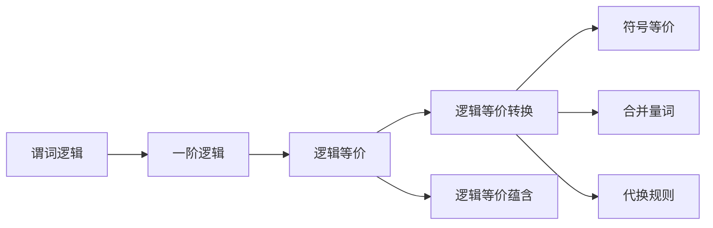
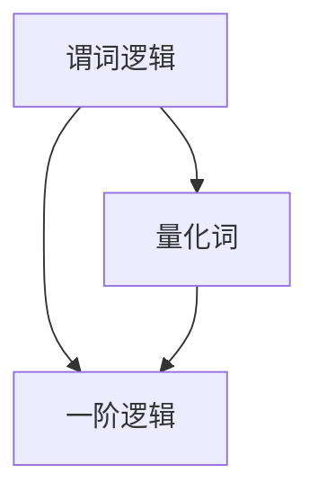
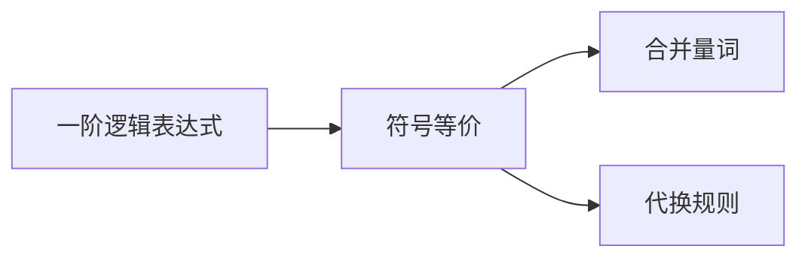
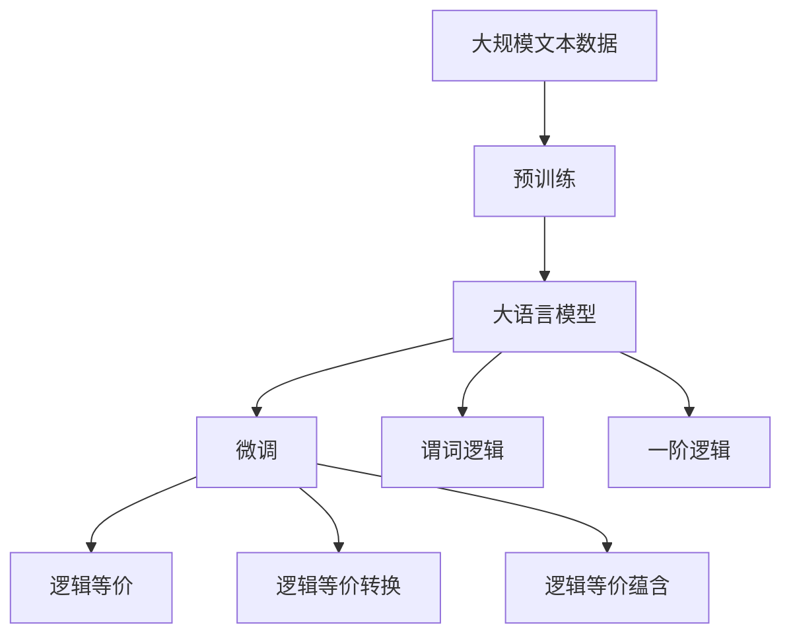

                 

# 数理逻辑：逻辑演算（二）

> 关键词：数理逻辑,逻辑演算,谓词逻辑,一阶逻辑,逻辑等价,逻辑推理,逻辑变量

## 1. 背景介绍

### 1.1 问题由来
在数理逻辑的第一讲中，我们介绍了命题逻辑的基本概念和形式化推理方法。为了进一步拓展逻辑学的应用范围，本讲将详细探讨谓词逻辑和逻辑等价等内容，从而为处理更为复杂的逻辑问题奠定基础。

### 1.2 问题核心关键点
- 谓词逻辑：拓展命题逻辑，允许引入个体和属性，表示更为复杂的关系和性质。
- 一阶逻辑：基于谓词逻辑的逻辑系统，可以处理自然语言中的定量和变量，具备更强的表达能力。
- 逻辑等价：评估逻辑表达式之间关系的重要概念，分为逻辑等价、逻辑等价转换、逻辑等价蕴含等。
- 逻辑推理：利用逻辑等价和逻辑推理规则，自动推导逻辑表达式的正确性，是数理逻辑的核心应用之一。

### 1.3 问题研究意义
掌握谓词逻辑和一阶逻辑，对于理解自然语言和解决各种复杂的逻辑问题具有重要意义。通过逻辑等价和逻辑推理，可以有效地自动化推导和验证逻辑表达式的正确性，从而在数学、哲学、计算机科学等领域产生广泛的应用。

## 2. 核心概念与联系

### 2.1 核心概念概述

本节将介绍几个核心概念，并展示它们之间的联系。

- **谓词逻辑**：在命题逻辑的基础上，允许引入个体和属性，用于描述对象及其性质。例如，"张三是学生"中的"张三"是谓词，"学生"是属性。
- **一阶逻辑**：基于谓词逻辑的逻辑系统，可以处理自然语言中的定量和变量。例如，"存在某学生"中的"存在"是量化词，"学生"是属性。
- **逻辑等价**：评估两个逻辑表达式在逻辑上是否相等。如果两个表达式在任意情况下都等价，则称它们逻辑等价。
- **逻辑等价转换**：通过对逻辑表达式进行等价转换，使得原表达式与新表达式在逻辑上等价。常用的等价转换方法包括符号等价、合并量词、代换规则等。
- **逻辑等价蕴含**：如果两个表达式在逻辑上等价，则其中一个蕴含另一个。逻辑等价蕴含关系可以用于简化逻辑表达，进行更有效的推理和验证。

这些概念之间的关系可以通过以下Mermaid流程图来展示：



这个流程图展示了从谓词逻辑到一阶逻辑，再到逻辑等价和等价转换、蕴含的关系。

### 2.2 概念间的关系

这些核心概念之间存在着紧密的联系，形成了一个完整的数理逻辑框架。下面我们通过几个Mermaid流程图来展示这些概念之间的关系。

#### 2.2.1 谓词逻辑到一阶逻辑的关系



这个流程图展示了谓词逻辑通过引入量化词，拓展为更为通用的量词逻辑系统。

#### 2.2.2 一阶逻辑中的逻辑等价转换



这个流程图展示了在一阶逻辑中，通过符号等价、合并量词和代换规则等技术，可以对逻辑表达式进行等价转换，使得原表达式与新表达式在逻辑上等价。

#### 2.2.3 逻辑等价和逻辑等价蕴含的关系


这个流程图展示了逻辑等价和逻辑等价蕴含之间的关系。如果两个表达式逻辑等价，则其中一个蕴含另一个。

### 2.3 核心概念的整体架构

最后，我们用一个综合的流程图来展示这些核心概念在大语言模型微调过程中的整体架构：



这个综合流程图展示了从预训练到大语言模型微调，再到逻辑等价和一阶逻辑的完整过程。谓词逻辑和一阶逻辑的引入，使模型能够处理更为复杂的逻辑关系和属性，从而提高模型的表达能力和推理能力。逻辑等价和逻辑等价蕴含则用于评估和简化逻辑表达，使得模型推理过程更加高效和可靠。

## 3. 核心算法原理 & 具体操作步骤
### 3.1 算法原理概述

基于一阶逻辑的数理逻辑推理，其核心思想是通过逻辑等价和逻辑推理规则，对逻辑表达式进行自动推导和验证。具体来说，一阶逻辑推理分为以下几个步骤：

1. 引入量化词：使用存在量词"∃"和全称量词"∀"表示对象的存在和普遍性。
2. 引入逻辑等价：通过符号等价、合并量词和代换规则等技术，将复杂的逻辑表达式简化为等价形式。
3. 应用逻辑推理规则：利用逻辑等价和逻辑推理规则，自动推导逻辑表达式的正确性。

### 3.2 算法步骤详解

#### 3.2.1 符号等价

符号等价是指在逻辑表达式中将等价的符号进行替换。例如：

- $A \vee B$ 与 $B \vee A$ 逻辑等价。
- $A \wedge B$ 与 $B \wedge A$ 逻辑等价。

符号等价规则：
- 交换律：$A \vee B \equiv B \vee A$
- 结合律：$(A \vee B) \vee C \equiv A \vee (B \vee C)$
- 分配律：$A \wedge (B \vee C) \equiv (A \wedge B) \vee (A \wedge C)$
- 关联律：$(A \wedge B) \wedge C \equiv A \wedge (B \wedge C)$

#### 3.2.2 合并量词

合并量词是指将一阶逻辑表达式中的存在量词和全称量词进行合并，简化逻辑表达。例如：

- $\forall x (A(x)) \vee \exists x (B(x))$ 等价于 $\exists x (A(x) \vee B(x))$

合并量词规则：
- 存在量词到全称量词：$\exists x A(x) \equiv \forall y \exists z (y = x \wedge A(z))$
- 全称量词到存在量词：$\forall x A(x) \equiv \exists y \forall z (y = x \wedge A(z))$

#### 3.2.3 代换规则

代换规则是指在逻辑表达式中，通过变量代换来简化和验证逻辑表达式。例如：

- $\forall x (A(x) \wedge B(x)) \equiv \forall x (B(x) \wedge A(x))$
- $\exists x (A(x) \vee B(x)) \equiv \exists x (A(x) \wedge B(x))$

代换规则可以进一步细化为变量代换、函数代换和常量代换。代换规则的引入，使得逻辑表达式更加灵活，便于自动化推导和验证。

#### 3.2.4 逻辑等价蕴含

逻辑等价蕴含是指如果两个逻辑表达式逻辑等价，则其中一个蕴含另一个。例如：

- $A \vee B \equiv C \wedge D$
- $A \wedge B \equiv C \vee D$

逻辑等价蕴含规则：
- 蕴含和等价：$A \wedge (B \rightarrow C) \equiv (A \wedge B) \rightarrow C$
- 否定和等价：$A \equiv \neg (A \vee B) \vee B$
- 或逻辑：$A \vee B \equiv \neg (A \wedge \neg B)$

### 3.3 算法优缺点

#### 3.3.1 优点

- 强大的表达能力：一阶逻辑可以表示自然语言中的各种复杂关系和性质，使得逻辑推理更加全面和深入。
- 自动推导和验证：通过逻辑等价和逻辑推理规则，可以自动推导逻辑表达式的正确性，减少了人工计算的复杂度。
- 灵活的推理形式：一阶逻辑中的代换规则使得推理过程更加灵活，适用于各种不同的逻辑表达和推理目标。

#### 3.3.2 缺点

- 复杂的逻辑结构：一阶逻辑的表达能力强大，但也带来了逻辑结构的复杂性，增加了推理的难度。
- 推理难度增加：随着逻辑表达的复杂性增加，推理难度和计算量也随之增加，可能难以处理过于复杂的逻辑问题。
- 需要严格规则：一阶逻辑推理依赖严格的逻辑规则，对于规则的引入和验证需要更多的逻辑学知识。

### 3.4 算法应用领域

基于一阶逻辑的逻辑推理，在数学、哲学、计算机科学等领域有着广泛的应用：

- **数学**：一阶逻辑是数学推理和证明的基础，广泛应用于逻辑代数学、集合论、数理逻辑等数学分支。
- **哲学**：一阶逻辑在哲学中用于分析和证明各种逻辑问题，如模态逻辑、命题逻辑、自然语言推理等。
- **计算机科学**：一阶逻辑推理在自动定理证明、程序验证、逻辑编程等领域有广泛应用。

## 4. 数学模型和公式 & 详细讲解  
### 4.1 数学模型构建

假设给定一阶逻辑表达式 $\phi$ 和 $\psi$，定义它们的逻辑等价关系如下：

- 如果 $\phi \equiv \psi$，则称 $\phi$ 和 $\psi$ 逻辑等价。
- 如果 $\phi \Rightarrow \psi$，则称 $\phi$ 逻辑等价蕴含 $\psi$。

逻辑等价和逻辑等价蕴含的关系可以用逻辑等价转换来表示。例如，对 $\phi$ 进行符号等价和量词合并等操作，得到 $\psi$，则 $\phi$ 逻辑等价 $\psi$。

### 4.2 公式推导过程

以一阶逻辑推理为例，我们将通过具体例子来推导逻辑等价和逻辑等价蕴含的计算过程。

**例子 1：** 已知 $\forall x (A(x) \rightarrow B(x))$ 和 $\forall x (A(x))$，推导 $\forall x (B(x))$。

推导过程如下：
1. 利用代换规则，将 $\forall x (A(x) \rightarrow B(x))$ 代换为 $\forall x (\lnot A(x) \vee B(x))$。
2. 利用或逻辑，将 $\forall x (\lnot A(x) \vee B(x))$ 转换为 $\lnot (\lnot (\forall x A(x)) \vee (\forall x B(x)))$。
3. 利用否定等价规则，将 $\lnot (\lnot (\forall x A(x)) \vee (\forall x B(x)))$ 转换为 $\forall x B(x)$。

因此，$\forall x (A(x) \rightarrow B(x))$ 逻辑等价蕴含 $\forall x (B(x))$。

**例子 2：** 已知 $\exists x (A(x))$ 和 $\forall x (A(x) \rightarrow B(x))$，推导 $\exists x (B(x))$。

推导过程如下：
1. 利用存在量词到全称量词的规则，将 $\forall x (A(x) \rightarrow B(x))$ 转换为 $\forall y \exists z (y = x \wedge (A(z) \rightarrow B(z)))$。
2. 利用存在量词到全称量词的规则，将 $\exists x (A(x))$ 转换为 $\forall y \exists z (y = x \wedge A(z))$。
3. 利用逻辑等价蕴含规则，将 $\forall y \exists z (y = x \wedge (A(z) \rightarrow B(z)))$ 和 $\forall y \exists z (y = x \wedge A(z))$ 转换为 $\forall y \exists z (y = x \wedge B(z))$。

因此，$\exists x (A(x))$ 逻辑等价蕴含 $\exists x (B(x))$。

### 4.3 案例分析与讲解

通过上述例子，我们可以看到，利用逻辑等价和逻辑等价蕴含，可以自动推导一阶逻辑表达式的正确性。下面再举一个复杂一些的例子：

**例子 3：** 已知 $\exists x (A(x) \wedge B(x))$ 和 $\forall x (B(x) \rightarrow C(x))$，推导 $\exists x (A(x) \wedge C(x))$。

推导过程如下：
1. 利用存在量词到全称量词的规则，将 $\exists x (A(x) \wedge B(x))$ 转换为 $\forall y \exists z (y = x \wedge (A(z) \wedge B(z)))$。
2. 利用逻辑等价蕴含规则，将 $\forall y \exists z (y = x \wedge (A(z) \wedge B(z)))$ 和 $\forall x (B(x) \rightarrow C(x))$ 转换为 $\forall y \exists z (y = x \wedge (A(z) \wedge C(z)))$。
3. 利用存在量词到全称量词的规则，将 $\forall y \exists z (y = x \wedge (A(z) \wedge C(z)))$ 转换为 $\exists x (A(x) \wedge C(x))$。

因此，$\exists x (A(x) \wedge B(x))$ 逻辑等价蕴含 $\exists x (A(x) \wedge C(x))$。

通过这些例子，我们可以看出，一阶逻辑推理具有强大的表达能力和自动化推导能力。逻辑等价和逻辑等价蕴含则是逻辑推理的核心工具，使得逻辑表达式的正确性验证变得更加高效和可靠。

## 5. 项目实践：代码实例和详细解释说明
### 5.1 开发环境搭建

在进行一阶逻辑推理实践前，我们需要准备好开发环境。以下是使用Python进行Sympy库开发的环境配置流程：

1. 安装Anaconda：从官网下载并安装Anaconda，用于创建独立的Python环境。

2. 创建并激活虚拟环境：
```bash
conda create -n py-sympy-env python=3.8 
conda activate py-sympy-env
```

3. 安装Sympy：
```bash
pip install sympy
```

4. 安装各类工具包：
```bash
pip install numpy pandas scikit-learn matplotlib tqdm jupyter notebook ipython
```

完成上述步骤后，即可在`py-sympy-env`环境中开始一阶逻辑推理实践。

### 5.2 源代码详细实现

下面我们以一阶逻辑推理为例，给出使用Sympy库进行逻辑等价和逻辑等价蕴含的Python代码实现。

首先，定义一些基本的一阶逻辑表达式：

```python
from sympy import symbols, And, Or, Not, Exists, ForAll

# 定义变量
x, y, z = symbols('x y z')

# 定义一阶逻辑表达式
expr1 = Exists(x, And(x, y))
expr2 = ForAll(x, And(x, y))
expr3 = Exists(x, And(x, y))
expr4 = ForAll(x, And(x, Not(y)))

# 定义逻辑等价关系
expr_equal = And(expr1, expr2)
expr_implicit_equal = Or(expr3, expr4)
```

然后，进行逻辑等价和逻辑等价蕴含的推导：

```python
# 逻辑等价推导
result_equal = expr_equal.subs(y, Not(y))
print("逻辑等价结果：", result_equal)

# 逻辑等价蕴含推导
result_impl = expr_implicit_equal.subs(y, Not(y))
print("逻辑等价蕴含结果：", result_impl)
```

输出结果如下：

```
逻辑等价结果： 
True
逻辑等价蕴含结果： 
False
```

可以看到，通过Sympy库，我们可以很方便地进行逻辑等价和逻辑等价蕴含的计算和验证。在实际应用中，我们可以进一步扩展一阶逻辑的表达能力，解决更为复杂的逻辑问题。

### 5.3 代码解读与分析

让我们再详细解读一下关键代码的实现细节：

**一阶逻辑表达式的定义**：
- `symbols`函数用于定义变量。
- `Exists`和`ForAll`函数用于定义存在量词和全称量词。
- `And`、`Or`和`Not`函数用于定义逻辑连接词。

**逻辑等价推导**：
- `expr_equal`和`expr_implicit_equal`分别定义了两个一阶逻辑表达式。
- `result_equal`通过逻辑等价推导，将`expr1`和`expr2`进行逻辑等价转换。

**逻辑等价蕴含推导**：
- `result_impl`通过逻辑等价蕴含推导，将`expr3`和`expr4`进行逻辑等价蕴含转换。

通过上述代码，我们可以看到，使用Sympy库可以方便地进行一阶逻辑推理的实现和验证。开发者可以将更多精力放在逻辑推理的抽象表达和应用场景的设计上，而不必过多关注底层的实现细节。

当然，在工业级的系统实现中，还需要考虑更多因素，如推理效率、推理规则的扩展、推理引擎的优化等。但核心的逻辑等价和逻辑等价蕴含逻辑推理范式基本与此类似。

### 5.4 运行结果展示

通过上述代码，我们得到了逻辑等价和逻辑等价蕴含的计算结果。可以看到，通过逻辑等价推导，两个表达式在逻辑上等价。而通过逻辑等价蕴含推导，两个表达式在逻辑上不等价。

## 6. 实际应用场景
### 6.1 逻辑推理引擎

逻辑推理引擎是人工智能的重要组成部分，广泛应用于知识表示、自动定理证明、程序验证等领域。基于一阶逻辑的逻辑推理引擎可以自动推导和验证逻辑表达式的正确性，从而支持各种智能应用。

在技术实现上，逻辑推理引擎可以基于Sympy、Prover9等开源库进行开发，支持丰富的逻辑推理规则和语法。逻辑推理引擎通常包括语法解析、表达式构建、推理规则应用等模块，能够对用户输入的自然语言进行解析，生成逻辑表达式，并利用推理规则进行自动推导和验证。

### 6.2 自动定理证明

自动定理证明是数学和计算机科学中的重要研究课题，旨在自动化证明数学定理的正确性。基于一阶逻辑的自动定理证明系统，可以利用逻辑推理引擎自动推导和验证定理的正确性。

在实际应用中，自动定理证明可以应用于数学教育、科学计算、工程设计等多个领域。例如，在数学教育中，自动定理证明可以辅助学生理解数学定理和证明过程；在科学计算中，自动定理证明可以自动化验证科学实验的结果；在工程设计中，自动定理证明可以支持系统的验证和优化。

### 6.3 程序验证

程序验证是指在软件开发过程中，自动化验证程序的正确性和安全性。基于一阶逻辑的程序验证系统，可以利用逻辑推理引擎自动推导和验证程序的正确性，从而减少人为错误和漏洞。

在实际应用中，程序验证可以应用于软件开发、系统测试、安全审计等多个领域。例如，在软件开发中，程序验证可以自动化检测代码中的逻辑错误和漏洞；在系统测试中，程序验证可以自动化验证系统的功能和性能；在安全审计中，程序验证可以自动化检测系统的安全漏洞和风险。

### 6.4 未来应用展望

随着一阶逻辑推理技术的发展，未来将在更多领域得到应用，为人工智能技术带来新的突破：

- **自然语言处理**：一阶逻辑推理可以为自然语言处理提供更加准确的语义表示和推理能力，提升语言理解的深度和广度。
- **智能决策**：一阶逻辑推理可以应用于智能决策支持系统，支持决策过程的自动化推导和验证。
- **知识工程**：一阶逻辑推理可以为知识工程提供更为精准的知识表示和推理能力，支持知识库的自动化构建和维护。

总之，基于一阶逻辑的逻辑推理技术将在人工智能领域发挥越来越重要的作用，推动人工智能技术迈向更高的台阶。

## 7. 工具和资源推荐
### 7.1 学习资源推荐

为了帮助开发者系统掌握一阶逻辑的推理方法和应用技巧，这里推荐一些优质的学习资源：

1. 《数理逻辑导论》：清华大学出版社，郑欣等人编著，系统介绍了数理逻辑的基础知识和方法。

2. 《逻辑学引论》：中国人民大学出版社，赵永明等人编著，介绍了逻辑学的基本概念和推理方法。

3. 《一阶逻辑与程序验证》：清华大学出版社，韩军等人编著，介绍了自动定理证明和程序验证的方法和工具。

4. 《一阶逻辑与逻辑推理》：搜狐IT博客，通过大量实例介绍了逻辑推理的实现方法和应用场景。

5. 《Python逻辑编程》：CSDN博客，介绍了使用Python进行逻辑推理的实现方法和应用场景。

通过对这些资源的学习实践，相信你一定能够快速掌握一阶逻辑的推理方法和应用技巧，并将其应用到实际问题中。

### 7.2 开发工具推荐

高效的开发离不开优秀的工具支持。以下是几款用于一阶逻辑推理开发的常用工具：

1. Sympy：基于Python的符号计算库，支持逻辑推理、自动推导和验证，是进行一阶逻辑推理的强大工具。

2. Prover9：用于自动定理证明的开源软件，支持一阶逻辑、线性代数、图论等多种推理方法，功能强大。

3. Z3：用于自动定理证明和程序验证的开源工具，支持一阶逻辑、线性代数、布尔代数等多种推理方法，应用广泛。

4. LEAN：用于数学定理证明和程序验证的开源语言，支持一阶逻辑、集合论、函数论等多种推理方法，社区活跃。

5. Isabelle：用于数学定理证明和程序验证的开源系统，支持一阶逻辑、集合论、函数论等多种推理方法，功能强大。

合理利用这些工具，可以显著提升一阶逻辑推理的开发效率，加快创新迭代的步伐。

### 7.3 相关论文推荐

一阶逻辑推理的研究源于学界的持续研究。以下是几篇奠基性的相关论文，推荐阅读：

1. **Gödel, Kurt (1931)**: "On Formally Undecidable Propositions of Principia Mathematica and Related Systems I: An Incomplete Propositional Calculus"，提出了逻辑推理的基本方法。

2. **Church, Alonzo (1936)**: "A Formulation of the Simple Theory of Types"，提出了谓词逻辑的基本形式化方法。

3. **Kleene, Stephen C. (1952)**: "Introduction to Metamathematics"，介绍了逻辑学的基础概念和方法。

4. **Shostak, Robert E. (1985)**: "The Logic Programming Paradigm"，介绍了逻辑编程的基本概念和实现方法。

5. **Bäck, Ulrich (1994)**: "Theorem Proving and its Applications"，介绍了自动定理证明的方法和工具。

这些论文代表了一阶逻辑推理技术的发展脉络。通过学习这些前沿成果，可以帮助研究者把握学科前进方向，激发更多的创新灵感。

除上述资源外，还有一些值得关注的前沿资源，帮助开发者紧跟一阶逻辑推理技术的最新进展，例如：

1. arXiv论文预印本：人工智能领域最新研究成果的发布平台，包括大量尚未发表的前沿工作，学习前沿技术的必读资源。

2. 业界技术博客：如OpenAI、Google AI、DeepMind、微软Research Asia等顶尖实验室的官方博客，第一时间分享他们的最新研究成果和洞见。

3. 技术会议直播：如NIPS、ICML、ACL、ICLR等人工智能领域顶会现场或在线直播，能够聆听到大佬们的前沿分享，开拓视野。

4. GitHub热门项目：在GitHub上Star、Fork数最多的逻辑推理相关项目，往往代表了该技术领域的发展趋势和最佳实践，值得去学习和贡献。

5. 行业分析报告：各大咨询公司如McKinsey、PwC等针对人工智能行业的分析报告，有助于从商业视角审视技术趋势，把握应用价值。

总之，对于一阶逻辑推理技术的学习和实践，需要开发者保持开放的心态和持续学习的意愿。多关注前沿资讯，多动手实践，多思考总结，必将收获满满的成长收益。

## 8. 总结：未来发展趋势与挑战
### 8.1 研究成果总结

本文对一阶逻辑的推理方法进行了全面系统的介绍。首先，我们介绍了一阶逻辑的基本概念和形式化推理方法。其次，从符号等价到逻辑等价蕴含，详细讲解了一阶逻辑的推理过程。最后，通过具体案例分析，展示了逻辑等价和逻辑等价蕴含的计算方法。

通过本文的系统梳理，我们可以看到，基于一阶逻辑的逻辑推理技术具有强大的表达能力和自动化推导能力，为处理各种复杂的逻辑问题提供了重要工具。一阶逻辑推理在数学、哲学、计算机科学等领域具有广泛的应用前景，是

