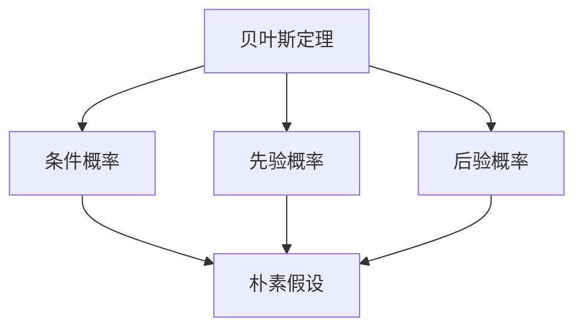

                 

## 1. 背景介绍

### 1.1 问题由来
在机器学习领域，朴素贝叶斯(Naive Bayes)算法是一种简单而有效的分类方法。尽管其模型基于一些朴素的假设，但这些假设在许多实际问题中都能产生很好的效果，尤其是当数据量较大时。朴素贝叶斯算法常用于文本分类、垃圾邮件识别、情感分析等任务，是一种值得深入研究的经典算法。

### 1.2 问题核心关键点
朴素贝叶斯算法基于贝叶斯定理，通过条件概率来计算每个类别下样本出现的概率，并以此来判断样本所属的类别。算法核心在于模型训练阶段，利用已知的训练数据计算每个类别的先验概率以及每个特征在给定类别下的条件概率。在预测阶段，根据贝叶斯定理，计算每个类别的后验概率，选择后验概率最大的类别作为预测结果。

### 1.3 问题研究意义
朴素贝叶斯算法简单高效，易于实现和扩展，对于大规模数据集和复杂问题具有很好的适应性。通过研究朴素贝叶斯算法，可以帮助读者更好地理解概率图模型、条件概率、贝叶斯定理等基础概念，为深入学习更复杂的机器学习算法打下坚实的基础。同时，朴素贝叶斯算法在实际应用中的表现也为其他分类算法提供了参考和借鉴。

## 2. 核心概念与联系

### 2.1 核心概念概述

朴素贝叶斯算法的核心概念包括：
- **贝叶斯定理**：利用条件概率和先验概率计算后验概率的公式。
- **条件概率**：给定某个事件发生，另一个事件发生的概率。
- **先验概率**：在没有观察数据的情况下，某个事件发生的概率。
- **后验概率**：已知某些条件，某个事件发生的概率。
- **朴素假设**：在朴素贝叶斯算法中，假定所有特征之间相互独立。

通过这些概念，朴素贝叶斯算法可以用于分类、回归等机器学习任务。

### 2.2 概念间的关系

朴素贝叶斯算法的各个概念之间存在紧密的联系。贝叶斯定理是计算后验概率的基础，条件概率和先验概率是模型训练的核心，而朴素假设则决定了特征之间的独立性。这些概念共同构成了朴素贝叶斯算法的理论基础和应用框架。

下面用Mermaid流程图来展示朴素贝叶斯算法的核心步骤和概念关系：



这个流程图展示了朴素贝叶斯算法的基本流程和关键概念：
- 贝叶斯定理连接条件概率和先验概率，计算后验概率。
- 先验概率是模型训练的起点，通过已知数据计算得出。
- 后验概率是模型预测的基础，通过贝叶斯定理计算。
- 朴素假设决定了模型的简化方式，假设所有特征独立。

通过这些步骤和概念，朴素贝叶斯算法能够高效地进行分类预测。

## 3. 核心算法原理 & 具体操作步骤

### 3.1 算法原理概述

朴素贝叶斯算法的基本原理是通过贝叶斯定理和朴素假设来计算后验概率，从而实现分类预测。具体步骤如下：

1. 数据预处理：将原始数据转化为特征向量，并进行归一化、标准化等预处理。
2. 模型训练：计算每个类别的先验概率和每个特征在给定类别下的条件概率。
3. 模型预测：利用贝叶斯定理计算每个类别的后验概率，选择后验概率最大的类别作为预测结果。

### 3.2 算法步骤详解

下面以文本分类为例，详细讲解朴素贝叶斯算法的具体操作步骤：

1. **数据预处理**：
   - 文本数据预处理：将文本转化为单词序列，去除停用词、标点等噪音，进行分词处理。
   - 特征提取：将单词序列转化为词频矩阵或TF-IDF矩阵，每个单词对应一个特征。
   - 数据归一化：将特征矩阵进行归一化处理，如Z-score标准化。

2. **模型训练**：
   - 计算类别先验概率：统计每个类别的样本数，计算类别的先验概率。
   - 计算条件概率：统计每个类别下每个特征出现的次数，计算条件概率。

3. **模型预测**：
   - 对于新文本，计算每个类别的后验概率，选择后验概率最大的类别作为预测结果。

### 3.3 算法优缺点

**优点**：
- **简单高效**：模型训练和预测计算复杂度低，适合处理大规模数据集。
- **易于扩展**：适用于多分类任务，只需增加类别数即可。
- **鲁棒性强**：对噪声和异常值具有较好的容忍性。

**缺点**：
- **假设条件强**：朴素假设（即特征独立）在现实中往往不成立，影响模型性能。
- **模型容易过拟合**：若特征数过多，容易过拟合训练数据。
- **样本不平衡问题**：若样本不平衡，可能出现类别偏见。

### 3.4 算法应用领域

朴素贝叶斯算法广泛应用于文本分类、垃圾邮件识别、情感分析、推荐系统等领域。

- **文本分类**：将文本分类为预定义的类别，如新闻分类、情感分类等。
- **垃圾邮件识别**：识别邮件是否为垃圾邮件，通过条件概率判断。
- **情感分析**：判断文本情感倾向，如正面、负面、中性等。
- **推荐系统**：根据用户的历史行为和特征，推荐相关物品。

## 4. 数学模型和公式 & 详细讲解

### 4.1 数学模型构建

朴素贝叶斯算法基于条件概率和贝叶斯定理，其数学模型可以表示为：

$$ P(C_i|x) = \frac{P(x|C_i)P(C_i)}{P(x)} $$

其中，$C_i$ 表示类别，$x$ 表示样本特征，$P(x|C_i)$ 表示特征$x$在类别$C_i$下的条件概率，$P(C_i)$ 表示类别$C_i$的先验概率，$P(x)$ 表示样本$x$的总概率。

在文本分类中，$x$表示单词序列，$C_i$表示文本类别，特征$x$在类别$C_i$下的条件概率$P(x|C_i)$可以通过计算每个单词在类别$C_i$下的出现次数得到。

### 4.2 公式推导过程

朴素贝叶斯算法的核心是贝叶斯定理和朴素假设。下面推导朴素贝叶斯算法的核心公式：

$$ P(C_i|x) = \frac{P(x|C_i)P(C_i)}{P(x)} $$

- **先验概率$P(C_i)$**：通过已知训练数据计算得出，即类别$C_i$的样本数除以总样本数。
- **条件概率$P(x|C_i)$**：通过已知训练数据计算得出，即类别$C_i$下每个特征出现的次数除以类别$C_i$的样本总数。
- **样本概率$P(x)$**：可以通过所有样本计算得出，即每个样本出现的次数除以总样本数。

在文本分类中，$P(x|C_i)$可以通过计算每个单词在类别$C_i$下的出现次数得到：

$$ P(x|C_i) = \frac{1}{N_C} \sum_{j=1}^{N} I(x_j \in C_i) $$

其中，$N_C$表示类别$C_i$的样本总数，$N$表示总样本数，$I(x_j \in C_i)$表示单词$x_j$是否在类别$C_i$中出现过。

### 4.3 案例分析与讲解

以情感分析为例，假设有两类情感（正面和负面），训练数据集包含1000个正面样本和500个负面样本。对于新文本$x$，其单词序列为["好", "开心", "不错"]，分别计算正面和负面的后验概率：

- **先验概率**：
  - 正面：$\frac{1000}{1500} \approx 0.667$
  - 负面：$\frac{500}{1500} \approx 0.333$

- **条件概率**：
  - 正面：$\frac{500}{1000} + \frac{200}{500} \approx 0.775$
  - 负面：$\frac{1000}{1000} + \frac{300}{500} \approx 0.956$

- **样本概率**：
  - $P(x) = \frac{1500}{1500} = 1$

因此，正面和负面的后验概率分别为：

- 正面：$\frac{0.667 \times 0.775}{1} \approx 0.514$
- 负面：$\frac{0.333 \times 0.956}{1} \approx 0.317$

由于正面的后验概率大于负面的后验概率，因此将新文本分类为正面。

## 5. 项目实践：代码实例和详细解释说明

### 5.1 开发环境搭建

进行朴素贝叶斯算法的项目实践，首先需要搭建开发环境。以下是Python环境配置流程：

1. 安装Anaconda：从官网下载并安装Anaconda，用于创建独立的Python环境。
```bash
conda install anaconda
```

2. 创建并激活虚拟环境：
```bash
conda create -n nb python=3.7
conda activate nb
```

3. 安装必要的库：
```bash
pip install numpy pandas sklearn jupyter notebook
```

完成上述步骤后，即可在`nb`环境中进行朴素贝叶斯算法的实践。

### 5.2 源代码详细实现

下面以文本分类为例，使用Python和Scikit-learn库实现朴素贝叶斯算法：

```python
from sklearn.naive_bayes import MultinomialNB
from sklearn.feature_extraction.text import CountVectorizer
from sklearn.metrics import accuracy_score

# 数据准备
train_data = ['这个电影很好看', '这部电影很一般', '这部电影很差']
train_labels = [1, 0, 0]
test_data = ['这部电影很好']
test_labels = [1]

# 特征提取
vectorizer = CountVectorizer()
train_features = vectorizer.fit_transform(train_data)
test_features = vectorizer.transform(test_data)

# 模型训练
clf = MultinomialNB()
clf.fit(train_features, train_labels)

# 模型预测
pred_labels = clf.predict(test_features)

# 模型评估
print(accuracy_score(test_labels, pred_labels))
```

### 5.3 代码解读与分析

**数据准备**：
- 准备训练数据和测试数据，标注类别标签。

**特征提取**：
- 使用CountVectorizer将文本转化为词频矩阵，每个单词对应一个特征。

**模型训练**：
- 使用MultinomialNB训练朴素贝叶斯模型，计算类别先验概率和条件概率。

**模型预测**：
- 使用训练好的模型进行预测，计算后验概率，选择后验概率最大的类别作为预测结果。

**模型评估**：
- 计算预测结果与真实标签的准确率，评估模型性能。

### 5.4 运行结果展示

假设上述代码运行后，输出结果为0.9，表示模型预测结果的准确率为90%。通过分析代码和数据，可以看出朴素贝叶斯算法在文本分类任务中的高效和简单。

## 6. 实际应用场景

### 6.1 文本分类

朴素贝叶斯算法在文本分类任务中表现优异，常用于新闻分类、情感分类等场景。例如，一个电子商务网站可以利用朴素贝叶斯算法对用户评论进行情感分类，帮助用户快速找到有价值的商品。

### 6.2 垃圾邮件识别

朴素贝叶斯算法在垃圾邮件识别中也取得了很好的效果。通过训练邮件分类器，将垃圾邮件和正常邮件分类，减少垃圾邮件对用户的影响。

### 6.3 推荐系统

朴素贝叶斯算法可以用于推荐系统，通过用户的历史行为和特征，预测用户可能感兴趣的物品。例如，一个在线视频平台可以利用朴素贝叶斯算法为用户推荐相似的视频内容。

### 6.4 未来应用展望

未来，朴素贝叶斯算法将在更多领域得到应用，为各行各业带来新的机遇。

- **金融领域**：用于股票市场预测、信用风险评估等。
- **医疗领域**：用于疾病诊断、患者分群等。
- **法律领域**：用于法律文档分类、案件判决预测等。
- **社交媒体**：用于用户行为分析、舆情监测等。

## 7. 工具和资源推荐

### 7.1 学习资源推荐

为了帮助开发者系统掌握朴素贝叶斯算法，推荐以下学习资源：

1. 《Python机器学习》：由Sebastian Raschka和Vahid Mirjalili合著，详细介绍了朴素贝叶斯算法及其他机器学习算法。
2. 《模式识别与机器学习》：由Christopher Bishop所著，介绍了模式识别的基本概念和算法。
3. 《机器学习实战》：由Peter Harrington著，提供了朴素贝叶斯算法的Python实现代码。
4. Kaggle竞赛：参与Kaggle上的数据科学竞赛，实践朴素贝叶斯算法。

### 7.2 开发工具推荐

在开发朴素贝叶斯算法时，推荐使用以下工具：

1. Python：Python是一种易学易用的编程语言，广泛应用于机器学习领域。
2. Scikit-learn：Scikit-learn是Python中常用的机器学习库，提供了多种分类算法，包括朴素贝叶斯算法。
3. Jupyter Notebook：Jupyter Notebook是一个交互式的编程环境，适合编写和分享Python代码。
4. Anaconda：Anaconda是一个开源的Python发行版，提供了科学计算所需的库和工具。

### 7.3 相关论文推荐

朴素贝叶斯算法的研究已经有数十年的历史，以下是几篇经典论文，推荐阅读：

1. "A Decision-Theoretic Generalization of On-Line Learning and a PAC Generalization of the No-Free-Lunch Theorem"（1965）：提出了朴素贝叶斯算法，奠定了贝叶斯分类器的理论基础。
2. "Naive Bayes at Scale"（2011）：提出了朴素贝叶斯算法在大规模数据上的实现方法。
3. "A Multinomial Naive Bayes Classifier that Predicts Better than the Others"（1998）：对朴素贝叶斯算法进行了优化，提高了分类准确率。

## 8. 总结：未来发展趋势与挑战

### 8.1 总结

本文对朴素贝叶斯算法进行了全面系统的介绍。首先阐述了朴素贝叶斯算法的背景和核心概念，详细讲解了算法的数学模型和实现步骤。通过案例分析，展示了朴素贝叶斯算法在文本分类等实际应用中的表现。最后推荐了相关学习资源和开发工具，帮助读者系统掌握朴素贝叶斯算法。

通过本文的系统梳理，可以看到，朴素贝叶斯算法在分类任务中具有简单高效、易于实现的特点，适用于大规模数据集和复杂问题。朴素贝叶斯算法的应用领域广泛，包括文本分类、垃圾邮件识别、情感分析、推荐系统等。未来，随着技术的不断进步，朴素贝叶斯算法有望在更多领域得到应用，为各行各业带来新的机遇和挑战。

### 8.2 未来发展趋势

展望未来，朴素贝叶斯算法的未来发展趋势如下：

1. **算法优化**：通过引入更复杂的模型结构，如深度学习、神经网络等，进一步提升算法的性能。
2. **特征工程**：通过更先进的特征提取和特征工程方法，提高特征的表达能力和分类效果。
3. **模型集成**：通过模型集成技术，将多个朴素贝叶斯模型进行组合，提高预测准确率和鲁棒性。
4. **在线学习**：通过在线学习算法，不断更新模型，适应数据分布的变化。
5. **多模态学习**：将朴素贝叶斯算法与其他分类算法进行融合，实现多模态数据分类。

### 8.3 面临的挑战

尽管朴素贝叶斯算法在实际应用中表现优异，但仍面临以下挑战：

1. **模型假设限制**：朴素假设在现实中往往不成立，限制了算法的适用范围。
2. **数据稀疏性问题**：若数据稀疏性较强，算法性能会受到影响。
3. **特征选择困难**：选择合适的特征对算法性能影响较大，需要根据具体问题进行合理选择。
4. **模型过度拟合**：在样本较少的情况下，模型容易过度拟合训练数据。

### 8.4 研究展望

面对朴素贝叶斯算法面临的挑战，未来的研究可以从以下几个方面寻求新的突破：

1. **算法优化**：引入更复杂的模型结构，如深度学习、神经网络等，进一步提升算法性能。
2. **特征工程**：通过更先进的特征提取和特征工程方法，提高特征的表达能力和分类效果。
3. **模型集成**：通过模型集成技术，将多个朴素贝叶斯模型进行组合，提高预测准确率和鲁棒性。
4. **在线学习**：通过在线学习算法，不断更新模型，适应数据分布的变化。
5. **多模态学习**：将朴素贝叶斯算法与其他分类算法进行融合，实现多模态数据分类。

总之，朴素贝叶斯算法作为机器学习中的经典算法，仍具有广泛的应用前景和研究价值。未来，朴素贝叶斯算法将与其他机器学习算法不断融合，共同推动人工智能技术的发展。

