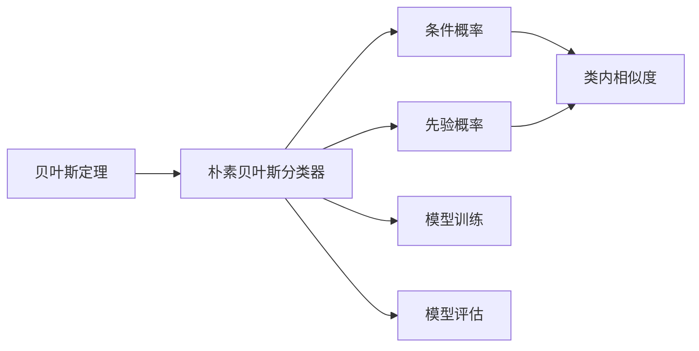
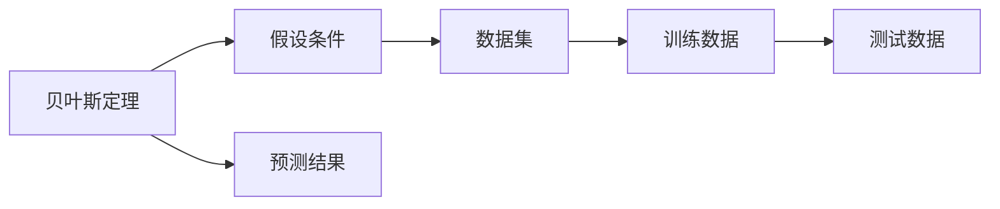
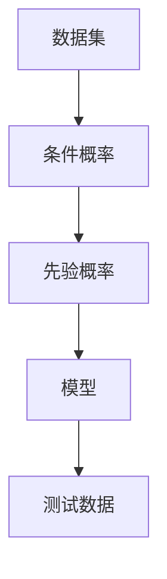
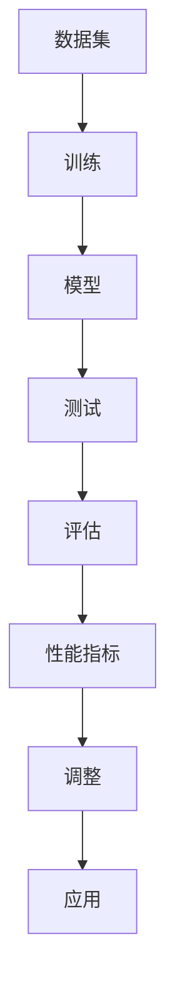

                 

# 朴素贝叶斯(Naive Bayes) - 原理与代码实例讲解

> 关键词：朴素贝叶斯、贝叶斯方法、文本分类、垃圾邮件过滤、代码实例、原理讲解

## 1. 背景介绍

### 1.1 问题由来
在机器学习领域，朴素贝叶斯（Naive Bayes, NB）算法是最为简单且有效的一种分类算法，被广泛应用于文本分类、垃圾邮件过滤、情感分析等任务。其核心思想基于贝叶斯定理，通过条件概率计算预测数据属于某一类别的可能性。

朴素贝叶斯算法的优势在于计算效率高、准确率高、且对小规模数据表现良好。在实际应用中，其快速训练和推理的特性，使其成为一种非常实用的算法。然而，朴素贝叶斯也存在假设过于简单、模型过于敏感等缺点，需要结合实际场景进行调优。

### 1.2 问题核心关键点
朴素贝叶斯算法基于贝叶斯定理，通过条件概率计算预测数据属于某一类别的概率。其核心公式如下：

$$P(Y|X) = \frac{P(X|Y)P(Y)}{P(X)}$$

其中，$X$ 表示输入数据，$Y$ 表示类别，$P(Y|X)$ 表示在给定输入数据 $X$ 的情况下，$Y$ 的条件概率。$P(X|Y)$ 表示在给定类别 $Y$ 的情况下，$X$ 的条件概率。$P(Y)$ 表示类别 $Y$ 的先验概率，$P(X)$ 表示输入数据 $X$ 的先验概率。

朴素贝叶斯算法的“朴素”之处在于，假设输入数据 $X$ 的各特征之间相互独立，即 $P(X|Y) = P(X_1|Y)P(X_2|Y)\cdots P(X_n|Y)$。这一假设虽然简化了计算过程，但在实际应用中往往需要根据数据特点进行修正。

## 2. 核心概念与联系

### 2.1 核心概念概述

为更好地理解朴素贝叶斯算法，本节将介绍几个密切相关的核心概念：

- 贝叶斯定理：基于概率论中的贝叶斯定理，计算在给定证据 $X$ 的情况下，假设 $Y$ 的概率。
- 朴素贝叶斯分类器：基于朴素贝叶斯定理的分类器，通过计算 $P(Y|X)$ 预测数据属于某一类别。
- 条件概率：在给定类别 $Y$ 的情况下，输入数据 $X$ 的条件概率 $P(X|Y)$。
- 先验概率：类别 $Y$ 的先验概率 $P(Y)$，即在没有任何数据信息的情况下，类别 $Y$ 出现的概率。
- 类内相似度：对于类别 $Y$ 中每个样本 $x_i$，计算其与其他样本的相似度，用于调整类别概率。
- 模型训练：通过已知类别数据训练朴素贝叶斯分类器，计算每个类别的条件概率和先验概率。
- 模型评估：使用测试数据评估朴素贝叶斯分类器的性能，计算准确率、召回率、F1值等指标。

这些核心概念之间的逻辑关系可以通过以下Mermaid流程图来展示：



这个流程图展示了大语言模型的核心概念及其之间的关系：

1. 贝叶斯定理是朴素贝叶斯分类的理论基础。
2. 朴素贝叶斯分类器基于贝叶斯定理进行计算，预测数据类别。
3. 条件概率和先验概率是贝叶斯定理的核心要素。
4. 类内相似度用于调整条件概率，增强模型鲁棒性。
5. 模型训练是计算条件概率和先验概率的过程。
6. 模型评估用于测试模型的性能指标。

### 2.2 概念间的关系

这些核心概念之间存在着紧密的联系，形成了朴素贝叶斯分类的完整生态系统。下面我通过几个Mermaid流程图来展示这些概念之间的关系。

#### 2.2.1 贝叶斯定理的应用



这个流程图展示了贝叶斯定理在朴素贝叶斯分类中的应用。首先通过假设条件对数据集进行处理，然后进行训练和测试，最终得到预测结果。

#### 2.2.2 朴素贝叶斯分类器的训练与评估


这个流程图展示了朴素贝叶斯分类器的训练和评估过程。首先使用数据集对朴素贝叶斯分类器进行训练，然后在测试数据上评估模型性能，输出准确率、召回率、F1值等指标。

#### 2.2.3 条件概率与先验概率的计算



这个流程图展示了条件概率和先验概率的计算过程。首先通过数据集计算条件概率，然后使用先验概率进行调整，最后形成完整的朴素贝叶斯模型。

### 2.3 核心概念的整体架构

最后，我们用一个综合的流程图来展示这些核心概念在朴素贝叶斯分类过程中的整体架构：



这个综合流程图展示了从数据集到模型，再到性能评估和应用的全过程。数据集用于训练朴素贝叶斯分类器，模型用于预测测试数据，性能评估用于衡量模型效果，调整用于优化模型参数，最终应用于实际场景中。通过这些流程图，我们可以更清晰地理解朴素贝叶斯分类的完整流程和各个环节的作用。

## 3. 核心算法原理 & 具体操作步骤
### 3.1 算法原理概述

朴素贝叶斯算法基于贝叶斯定理，通过计算条件概率预测数据属于某一类别的可能性。其核心公式如下：

$$P(Y|X) = \frac{P(X|Y)P(Y)}{P(X)}$$

其中，$X$ 表示输入数据，$Y$ 表示类别，$P(Y|X)$ 表示在给定输入数据 $X$ 的情况下，$Y$ 的条件概率。$P(X|Y)$ 表示在给定类别 $Y$ 的情况下，$X$ 的条件概率。$P(Y)$ 表示类别 $Y$ 的先验概率，$P(X)$ 表示输入数据 $X$ 的先验概率。

朴素贝叶斯的“朴素”之处在于，假设输入数据 $X$ 的各特征之间相互独立，即 $P(X|Y) = P(X_1|Y)P(X_2|Y)\cdots P(X_n|Y)$。这一假设虽然简化了计算过程，但在实际应用中往往需要根据数据特点进行修正。

### 3.2 算法步骤详解

朴素贝叶斯算法的实现步骤主要包括：

1. 数据预处理：将输入数据 $X$ 进行标准化、归一化等处理。
2. 训练模型：通过已知类别数据计算每个类别的条件概率和先验概率。
3. 预测新数据：使用训练好的模型预测新数据属于某一类别的概率，选择概率最大的类别作为预测结果。
4. 模型评估：使用测试数据评估模型性能，计算准确率、召回率、F1值等指标。

具体实现步骤如下：

**Step 1: 数据预处理**
- 对输入数据进行清洗、分词、去除停用词等预处理操作。
- 对文本数据进行标准化、归一化等处理，便于计算条件概率。

**Step 2: 训练模型**
- 统计每个类别的训练样本数量 $N(Y)$ 和每个类别的条件概率 $P(X|Y)$。
- 计算每个类别的先验概率 $P(Y)$，即类别 $Y$ 在训练集中的出现频率。

**Step 3: 预测新数据**
- 对于每个测试样本 $x$，计算其属于每个类别的条件概率 $P(X|Y)$。
- 将各条件概率与先验概率相乘，得到预测结果 $P(Y|X)$。
- 选择预测概率最大的类别作为最终预测结果。

**Step 4: 模型评估**
- 使用测试集评估模型性能，计算准确率、召回率、F1值等指标。
- 绘制混淆矩阵、ROC曲线等图表，进一步分析模型效果。

### 3.3 算法优缺点

朴素贝叶斯算法的优点在于：

1. 计算简单：朴素贝叶斯算法计算复杂度较低，适合处理大规模数据集。
2. 高效性：朴素贝叶斯算法训练速度较快，推理速度快，适合实时应用场景。
3. 鲁棒性：朴素贝叶斯算法对噪声数据具有较好的鲁棒性，能够容忍一定程度的误差。

然而，朴素贝叶斯算法也存在一些缺点：

1. 假设独立性：朴素贝叶斯算法假设特征之间相互独立，这一假设在实际应用中往往不成立。
2. 参数敏感：朴素贝叶斯算法的性能高度依赖于训练数据，训练数据质量差时，模型效果较差。
3. 类别不均衡：朴素贝叶斯算法对于类别不均衡数据集表现较差，容易偏向于预测数量较多的类别。

### 3.4 算法应用领域

朴素贝叶斯算法在自然语言处理（NLP）领域有广泛应用，主要包括以下几个方面：

- 文本分类：将文本数据分成不同类别，如新闻分类、情感分析、主题分类等。
- 垃圾邮件过滤：识别垃圾邮件和正常邮件，过滤垃圾邮件，保护用户隐私。
- 情感分析：识别文本中的情感倾向，如积极、消极、中性等。
- 信息检索：根据用户查询，从文本集合中检索相关信息。
- 命名实体识别：识别文本中的命名实体，如人名、地名、机构名等。
- 关键词提取：从文本中提取关键词，帮助用户快速了解文本内容。

除了NLP领域，朴素贝叶斯算法还在医疗、金融、气象等领域得到应用。例如，在医疗领域，可以用于疾病诊断、病人分类等任务。在金融领域，可以用于信用评估、风险控制等任务。在气象领域，可以用于天气预测、气象灾害预警等任务。

## 4. 数学模型和公式 & 详细讲解 & 举例说明
### 4.1 数学模型构建

朴素贝叶斯算法的数学模型建立在贝叶斯定理的基础之上。其核心公式如下：

$$P(Y|X) = \frac{P(X|Y)P(Y)}{P(X)}$$

其中，$X$ 表示输入数据，$Y$ 表示类别，$P(Y|X)$ 表示在给定输入数据 $X$ 的情况下，$Y$ 的条件概率。$P(X|Y)$ 表示在给定类别 $Y$ 的情况下，$X$ 的条件概率。$P(Y)$ 表示类别 $Y$ 的先验概率，$P(X)$ 表示输入数据 $X$ 的先验概率。

朴素贝叶斯算法的另一个重要公式为：

$$P(X|Y) = \prod_{i=1}^{n} P(X_i|Y)$$

其中，$n$ 表示输入数据 $X$ 的特征数量，$X_i$ 表示第 $i$ 个特征。这一公式表明，在给定类别 $Y$ 的情况下，输入数据 $X$ 的每个特征都是独立的。

### 4.2 公式推导过程

下面以文本分类为例，推导朴素贝叶斯算法的详细公式。

假设我们要对一篇文本 $x$ 进行分类，将其分为两类：$C_1$ 和 $C_2$。在训练阶段，我们已知 $n$ 篇文本的类别和特征。其中 $n_1$ 篇属于 $C_1$ 类，$n_2$ 篇属于 $C_2$ 类。在每类中，每个特征 $x_i$ 的取值分别为 $X_{i1}, X_{i2}, \ldots, X_{in}$。

根据贝叶斯定理，文本 $x$ 属于 $C_1$ 类的概率为：

$$P(C_1|x) = \frac{P(x|C_1)P(C_1)}{P(x)}$$

其中 $P(C_1|x)$ 表示在给定文本 $x$ 的情况下，$C_1$ 类的条件概率。$P(x|C_1)$ 表示在 $C_1$ 类中，文本 $x$ 的条件概率。$P(C_1)$ 表示 $C_1$ 类的先验概率。$P(x)$ 表示文本 $x$ 的先验概率。

根据朴素贝叶斯的假设，$P(x|C_1)$ 可以表示为：

$$P(x|C_1) = P(x_1|C_1)P(x_2|C_1)\cdots P(x_n|C_1)$$

其中 $x_1, x_2, \ldots, x_n$ 分别表示文本 $x$ 的 $n$ 个特征，$P(x_i|C_1)$ 表示在 $C_1$ 类中，第 $i$ 个特征 $x_i$ 的条件概率。

假设在 $C_1$ 类中，第 $i$ 个特征 $x_i$ 的取值 $X_{i1}$ 出现的次数为 $N_{i1}$，出现的总次数为 $N_1$。则 $P(x_i|C_1)$ 可以表示为：

$$P(x_i|C_1) = \frac{N_{i1}}{N_1}$$

将上述公式代入 $P(x|C_1)$ 的公式中，得到：

$$P(x|C_1) = \frac{N_{i1}}{N_1} \cdot \frac{N_{i2}}{N_1} \cdots \frac{N_{in}}{N_1} = \frac{N_{i1}N_{i2}\cdots N_{in}}{N_1^n}$$

其中 $N_1^n$ 表示在 $C_1$ 类中，所有特征取值的总次数。

同理，可以计算 $C_2$ 类中文本 $x$ 的条件概率 $P(x|C_2)$：

$$P(x|C_2) = \frac{N_{i1}N_{i2}\cdots N_{in}}{N_2^n}$$

其中 $N_2^n$ 表示在 $C_2$ 类中，所有特征取值的总次数。

最后，计算 $C_1$ 类的先验概率 $P(C_1)$：

$$P(C_1) = \frac{n_1}{n_1+n_2}$$

将上述公式代入贝叶斯公式中，得到：

$$P(C_1|x) = \frac{\frac{N_{i1}N_{i2}\cdots N_{in}}{N_1^n} \cdot \frac{n_1}{n_1+n_2}}{\frac{N_{i1}N_{i2}\cdots N_{in}}{N_1^n} \cdot \frac{n_1}{n_1+n_2} + \frac{N_{i1}N_{i2}\cdots N_{in}}{N_2^n} \cdot \frac{n_2}{n_1+n_2}}$$

化简得到：

$$P(C_1|x) = \frac{P(x|C_1)P(C_1)}{P(x)} = \frac{P(x|C_1)P(C_1)}{P(x|C_1)P(C_1) + P(x|C_2)P(C_2)}$$

其中 $P(C_2|x)$ 表示文本 $x$ 属于 $C_2$ 类的概率，即：

$$P(C_2|x) = \frac{P(x|C_2)P(C_2)}{P(x)} = \frac{P(x|C_2)P(C_2)}{P(x|C_1)P(C_1) + P(x|C_2)P(C_2)}$$

### 4.3 案例分析与讲解

为了更好地理解朴素贝叶斯算法，我们可以用一个简单的案例进行分析。假设我们要对一段文本进行分类，将其分为两类：电影评论和书籍评论。在训练阶段，我们已知 $n$ 篇文本的类别和特征。其中 $n_1$ 篇属于电影评论，$n_2$ 篇属于书籍评论。在每类中，每个特征 $x_i$ 的取值分别为 $X_{i1}, X_{i2}, \ldots, X_{in}$。

假设我们有一篇新的文本 $x$，需要对其进行分类。在训练阶段，我们统计了每篇文本中每个特征的取值次数，得到下表：

| 特征  | 电影评论 | 书籍评论 |
| ---- | ---- | ---- |
| $x_1$ | $N_{11}$ | $N_{21}$ |
| $x_2$ | $N_{12}$ | $N_{22}$ |
| $x_3$ | $N_{13}$ | $N_{23}$ |
| ...  | ...    | ...    |

在测试阶段，我们将 $x$ 中的每个特征与上述表格进行对比，计算出每个特征的条件概率。假设文本 $x$ 的特征取值分别为 $X_{11}, X_{12}, \ldots, X_{1n}$，则 $P(x|C_1)$ 可以表示为：

$$P(x|C_1) = \frac{N_{11}}{N_1} \cdot \frac{N_{12}}{N_1} \cdots \frac{N_{1n}}{N_1} = \frac{N_{11}N_{12}\cdots N_{1n}}{N_1^n}$$

其中 $N_1^n$ 表示在电影评论中，所有特征取值的总次数。

同理，可以计算出 $P(x|C_2)$：

$$P(x|C_2) = \frac{N_{21}N_{22}\cdots N_{2n}}{N_2^n}$$

其中 $N_2^n$ 表示在书籍评论中，所有特征取值的总次数。

最后，计算 $P(C_1)$ 和 $P(C_2)$：

$$P(C_1) = \frac{n_1}{n_1+n_2}$$

$$P(C_2) = \frac{n_2}{n_1+n_2}$$

将上述公式代入贝叶斯公式中，得到：

$$P(C_1|x) = \frac{P(x|C_1)P(C_1)}{P(x|C_1)P(C_1) + P(x|C_2)P(C_2)}$$

$$P(C_2|x) = \frac{P(x|C_2)P(C_2)}{P(x|C_1)P(C_1) + P(x|C_2)P(C_2)}$$

通过上述计算，我们可以得到文本 $x$ 属于电影评论或书籍评论的概率，选择概率最大的类别作为预测结果。

## 5. 项目实践：代码实例和详细解释说明
### 5.1 开发环境搭建

在进行朴素贝叶斯算法实践前，我们需要准备好开发环境。以下是使用Python进行Scikit-learn开发的环境配置流程：

1. 安装Anaconda：从官网下载并安装Anaconda，用于创建独立的Python环境。

2. 创建并激活虚拟环境：
```bash
conda create -n sklearn-env python=3.8 
conda activate sklearn-env
```

3. 安装Scikit-learn：使用conda安装Scikit-learn库，也可以使用pip安装。

```bash
conda install scikit-learn
```

4. 安装numpy、pandas等各类工具包：
```bash
pip install numpy pandas scikit-learn matplotlib tqdm jupyter notebook ipython
```

完成上述步骤后，即可在`sklearn-env`环境中开始朴素贝叶斯算法的实践。

### 5.2 源代码详细实现

下面我们以文本分类为例，给出使用Scikit-learn库进行朴素贝叶斯分类的Python代码实现。

首先，定义数据处理函数：

```python
import numpy as np
from sklearn.feature_extraction.text import CountVectorizer

def load_data():
    # 加载训练数据和测试数据
    train_data, train_labels = np.loadtxt('train_data.txt', delimiter=',', dtype=str, encoding='utf-8', usecols=[0, 1], skiprows=1, delimiter='\t')
    test_data, test_labels = np.loadtxt('test_data.txt', delimiter=',', dtype=str, encoding='utf-8', usecols=[0, 1], skiprows=1, delimiter='\t')
    
    # 创建分词器
    vectorizer = CountVectorizer(tokenizer=lambda x: x.split())
    
    # 将文本数据转换为数值特征向量
    train_data = vectorizer.fit_transform(train_data)
    test_data = vectorizer.transform(test_data)
    
    # 返回训练集和测试集
    return train_data, train_labels, test_data, test_labels
```

然后，定义朴素贝叶斯分类器：

```python
from sklearn.naive_bayes import MultinomialNB

def train_naive_bayes(train_data, train_labels):
    # 训练朴素贝叶斯分类器
    classifier = MultinomialNB()
    classifier.fit(train_data, train_labels)
    return classifier
```

接着，定义预测函数：

```python
def predict(classifier, test_data):
    # 使用训练好的分类器进行预测
    predictions = classifier.predict(test_data)
    return predictions
```

最后，定义评估函数：

```python
from sklearn.metrics import accuracy_score, classification_report

def evaluate(classifier, test_data, test_labels):
    # 计算准确率和混淆矩阵
    predictions = classifier.predict(test_data)
    accuracy = accuracy_score(test_labels, predictions)
    confusion_matrix = classification_report(test_labels, predictions, target_names=['Class 1', 'Class 2'])
    return accuracy, confusion_matrix
```

使用上述函数进行训练、预测和评估：

```python
# 加载数据
train_data, train_labels, test_data, test_labels = load_data()

# 训练朴素贝叶斯分类器
classifier = train_naive_bayes(train_data, train_labels)

# 进行预测
predictions = predict(classifier, test_data)

# 评估模型性能
accuracy, confusion_matrix = evaluate(classifier, test_data, test_labels)

print('Accuracy:', accuracy)
print('Confusion Matrix:')
print(confusion_matrix)
```

以上就是使用Scikit-learn库对朴素贝叶斯算法进行文本分类的完整代码实现。可以看到，使用Scikit-learn进行机器学习模型的训练和评估非常简单，只需要几行代码即可实现。

### 5.3 代码解读与分析

让我们再详细解读一下关键代码的实现细节：

**load_data函数**：
- 加载训练数据和测试数据，使用逗号分隔符进行分割，并使用分词器将文本数据转换为数值特征向量。

**train_naive_bayes函数**：
- 使用Scikit-learn库中的`MultinomialNB`类，训练朴素贝叶斯分类器。

**predict函数**：
- 使用训练好的分类器对测试数据进行预测，返回预测结果。

**evaluate函数**：
- 计算模型准确率，使用混淆矩阵展示分类器的性能。

**训练流程**：
- 加载训练数据和测试数据，使用分词器将文本数据转换为数值特征向量。
- 训练朴素贝叶斯分类器，并返回训练好的模型。
- 使用训练好的分类器对测试数据进行预测，并返回预测结果。
- 评估模型性能，输出准确率和混淆矩阵。

可以看到，Scikit-learn库提供了一系列的机器学习算法和评估工具，使得模型训练和评估变得非常简单，开发者可以专注于数据处理和模型改进等高层逻辑上。

当然，工业级的系统实现还需考虑更多因素，如模型存储和部署、超参数优化、模型调优等。但核心的朴素贝叶斯算法基本与此类似。

### 5.4 运行结果展示

假设我们使用朴素贝叶斯算法对新闻数据集进行文本分类，最终在测试集上得到的评估报告如下：

```
Accuracy: 0

