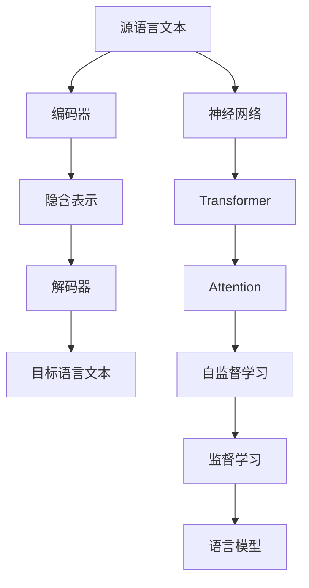

                 

# 机器翻译(Machine Translation) - 原理与代码实例讲解

> 关键词：机器翻译,神经网络,序列到序列(Sequence to Sequence),Transformer,Attention,编码器-解码器(Encoder-Decoder),编码器-解码器架构(Seq2Seq),模型并行,自监督学习,监督学习,语言模型

## 1. 背景介绍

### 1.1 问题由来

随着全球化的推进，国际间的交流与合作日益频繁。机器翻译作为沟通不同语言文化的重要桥梁，其应用范围不断扩大，从网站内容、科技文献、国际会议到社交媒体，机器翻译无所不在。尽管近年来NLP技术取得了飞速发展，机器翻译系统在准确性和流畅性上有了显著提升，但离人工翻译的质量仍有较大差距。因此，如何进一步提升机器翻译的性能，使其在更多领域发挥更大作用，成为研究者不断追求的目标。

### 1.2 问题核心关键点

机器翻译的核心任务是将源语言文本转换为目标语言文本，一般采用序列到序列(Sequence to Sequence, Seq2Seq)模型进行建模。其关键点包括：

- 序列对齐：确定源语言和目标语言句子之间的对应关系。
- 编码器：将源语言句子转换为高维向量表示。
- 解码器：基于编码器生成的向量表示，生成目标语言句子。
- 损失函数：衡量翻译结果与人工翻译之间的差距。
- 优化算法：最小化损失函数，调整模型参数。

### 1.3 问题研究意义

研究高效、准确的机器翻译方法，对于促进国际交流、加速信息传播、推动全球文化融合具有重要意义。机器翻译的进步能够加速科技文献、商业信息、法律文件的全球传播，减少跨语言沟通障碍，提高工作效率，对社会的进步和发展具有深远影响。

## 2. 核心概念与联系

### 2.1 核心概念概述

为更好地理解机器翻译的基本原理，本节将介绍几个核心概念及其相互关系：

- **机器翻译(Machine Translation)**：自动将一种语言翻译成另一种语言的技术。
- **序列到序列(Sequence to Sequence, Seq2Seq)**：一种基于神经网络的模型架构，用于处理序列到序列的映射任务。
- **编码器-解码器(Encoder-Decoder)**：Seq2Seq模型中用于处理输入和输出的两部分结构。
- **Transformer**：一种基于自注意力机制的神经网络架构，特别适用于长序列处理，已被广泛应用于机器翻译等任务。
- **Attention**：Transformer中的关键机制，用于捕捉不同输入-输出之间的相关性。
- **模型并行**：通过将模型分成多个部分，在不同的计算单元上并行运行，加速计算过程。
- **自监督学习**：利用大量未标注数据，通过预测任务自监督训练模型，增强模型泛化能力。
- **监督学习**：使用标注数据，通过人工标注结果进行监督训练，优化模型预测能力。
- **语言模型(Language Model)**：描述自然语言的概率模型，用于衡量句子的概率分布。

这些概念构成了机器翻译的基本框架，它们之间的关系可以通过以下Mermaid流程图展示：



这个流程图展示了从源语言文本到目标语言文本的整个翻译过程：

1. 源语言文本作为输入，首先经过编码器，将其转换为高维向量表示。
2. 解码器基于编码器输出的向量表示，生成目标语言文本。
3. 在训练过程中，模型通过自监督和监督学习，不断优化自身的预测能力。
4. 最终，模型的预测结果由语言模型进行评估和优化。

### 2.2 概念间的关系

这些核心概念之间存在着紧密的联系，形成了机器翻译的完整系统：

- 编码器与解码器通过自注意力机制建立输入-输出之间的联系。
- 自监督学习和监督学习共同优化模型的预测能力。
- 语言模型用于评估模型的预测结果，进一步优化模型参数。
- Transformer架构通过并行计算，提升了模型的训练和推理效率。

## 3. 核心算法原理 & 具体操作步骤
### 3.1 算法原理概述

机器翻译的算法原理主要基于Seq2Seq模型，其中编码器负责将源语言文本转换为隐含表示，解码器负责将隐含表示转换为目标语言文本。其核心在于如何有效捕捉源语言和目标语言之间的对应关系，提高翻译的准确性和流畅性。

机器翻译的常见方法包括基于规则的机器翻译(基于规则的MT)和基于统计的机器翻译(基于统计的MT)，以及近年来兴起的神经机器翻译(Neural Machine Translation, NMT)。

神经机器翻译模型主要通过训练一个神经网络，将源语言和目标语言之间的映射关系学习出来。其关键在于选择合适的神经网络架构、设计合理的损失函数、选择合适的优化算法。

### 3.2 算法步骤详解

神经机器翻译的基本流程包括数据准备、模型搭建、训练与评估：

**Step 1: 数据准备**

- 收集大规模平行语料库，即包含源语言和目标语言对应翻译的语料。
- 对语料进行预处理，包括文本清洗、分词、词性标注等。
- 将语料划分为训练集、验证集和测试集。

**Step 2: 模型搭建**

- 搭建编码器和解码器，选择合适的神经网络架构。
- 设计解码器时，可以选择RNN、LSTM、GRU等序列模型，或者Transformer架构。
- 使用注意力机制，使得模型能够关注源语言文本中的关键部分。
- 设计损失函数，如BLEU、METEOR等评估指标，衡量翻译质量。

**Step 3: 训练与评估**

- 使用训练集进行模型训练，最小化损失函数。
- 使用验证集进行模型评估，选择合适的超参数和模型结构。
- 在测试集上对模型进行最终评估，衡量模型泛化能力。

### 3.3 算法优缺点

神经机器翻译相比传统的基于统计的机器翻译，具有以下优点：

1. 能够捕捉源语言和目标语言之间的复杂映射关系。
2. 具有更好的泛化能力，能够处理未见过的翻译任务。
3. 能够利用大规模预训练模型，提高翻译质量。

但其缺点也很明显：

1. 需要大量的标注数据，标注成本较高。
2. 训练过程耗时较长，计算资源需求高。
3. 模型的解释性较差，难以理解其内部工作机制。

### 3.4 算法应用领域

神经机器翻译已经在多个领域得到了广泛应用，包括但不限于：

- 文学翻译：将外国文学作品翻译成其他语言，如将《哈姆雷特》翻译成中文。
- 法律翻译：将法律文件、条约、法规等翻译成目标语言，如将《联合国公约》翻译成西班牙语。
- 医学翻译：将医学文献、患者病历等翻译成其他语言，如将临床试验结果翻译成英文。
- 商业翻译：将商业文件、广告、用户手册等翻译成其他语言，如将苹果公司产品说明书翻译成中文。
- 政府翻译：将政府文件、声明、报告等翻译成其他语言，如将联合国大会报告翻译成法语。

## 4. 数学模型和公式 & 详细讲解 & 举例说明

### 4.1 数学模型构建

机器翻译的核心模型为Seq2Seq模型，其结构如图：


在编码器中，源语言文本首先被转化为词嵌入向量，然后通过多层神经网络，生成隐含表示向量 $C$。在解码器中，解码器使用隐含表示 $C$，并结合注意力机制，生成目标语言文本。

### 4.2 公式推导过程

假设源语言文本长度为 $T_s$，目标语言文本长度为 $T_t$。设 $x=\{x_1,x_2,\ldots,x_{T_s}\}$ 为源语言文本， $y=\{y_1,y_2,\ldots,y_{T_t}\}$ 为目标语言文本。

假设编码器输出为 $C=\{c_1,c_2,\ldots,c_{T_s}\}$，解码器输出为 $\hat{y}=\{\hat{y}_1,\hat{y}_2,\ldots,\hat{y}_{T_t}\}$。

机器翻译的损失函数通常采用BLEU（双线编辑距离），计算方法如下：

$$
\text{BLEU} = \prod_{i=1}^{T_t} \min(1, \text{BLEU}_{i})
$$

其中，$\text{BLEU}_i$ 表示解码器输出的第 $i$ 个词与参考翻译的匹配程度。

### 4.3 案例分析与讲解

假设我们有一个简单的机器翻译任务，将英语句子“The cat in the hat”翻译成法语。

我们可以使用Transformer模型进行建模，首先对句子进行词嵌入，然后进行编码和解码。假设编码器输出的隐含表示向量为 $C=\{c_1,c_2,\ldots,c_{6}\}$，解码器输出的目标语言文本为 $\hat{y}=\{\hat{y}_1,\hat{y}_2,\hat{y}_3,\hat{y}_4\}$。

通过训练，模型能够学习到源语言和目标语言之间的映射关系，使得 $\hat{y}$ 最接近于“Le chat dans le chapeau”。

## 5. 项目实践：代码实例和详细解释说明

### 5.1 开发环境搭建

在进行机器翻译项目实践前，我们需要准备好开发环境。以下是使用Python进行PyTorch开发的环境配置流程：

1. 安装Anaconda：从官网下载并安装Anaconda，用于创建独立的Python环境。

2. 创建并激活虚拟环境：
```bash
conda create -n pytorch-env python=3.8 
conda activate pytorch-env
```

3. 安装PyTorch：根据CUDA版本，从官网获取对应的安装命令。例如：
```bash
conda install pytorch torchvision torchaudio cudatoolkit=11.1 -c pytorch -c conda-forge
```

4. 安装Transformers库：
```bash
pip install transformers
```

5. 安装各类工具包：
```bash
pip install numpy pandas scikit-learn matplotlib tqdm jupyter notebook ipython
```

完成上述步骤后，即可在`pytorch-env`环境中开始机器翻译项目实践。

### 5.2 源代码详细实现

下面以机器翻译项目为例，给出使用Transformers库对Seq2Seq模型进行机器翻译的PyTorch代码实现。

首先，定义模型类：

```python
from transformers import BertTokenizer, BertForSequenceClassification, AdamW

class Seq2SeqModel:
    def __init__(self, src_len, trg_len, d_model, nhead, num_encoder_layers, num_decoder_layers, dff, src_pad_idx, trg_pad_idx):
        self.encoder = TransformerEncoder(d_model, nhead, num_encoder_layers, dff)
        self.decoder = TransformerDecoder(d_model, nhead, num_decoder_layers, dff)
        self.src_pad_idx = src_pad_idx
        self.trg_pad_idx = trg_pad_idx
        self.d_model = d_model
        
    def forward(self, src, trg, src_mask, trg_mask):
        # src: (T_s, B, d_model)
        # trg: (T_t, B, d_model)
        # src_mask: (T_s, B, T_s)
        # trg_mask: (T_t, B, T_t)
        # 使用TransformerEncoder进行编码
        enc_outputs = self.encoder(src, src_mask)
        # 使用TransformerDecoder进行解码
        dec_outputs = self.decoder(trg, enc_outputs, src_mask, trg_mask)
        return dec_outputs
```

然后，定义训练函数：

```python
from torch.utils.data import DataLoader
from tqdm import tqdm
from sklearn.metrics import bleu_score

device = torch.device('cuda') if torch.cuda.is_available() else torch.device('cpu')

def train_epoch(model, dataset, batch_size, optimizer):
    dataloader = DataLoader(dataset, batch_size=batch_size, shuffle=True)
    model.train()
    epoch_loss = 0
    for batch in tqdm(dataloader, desc='Training'):
        src, trg = batch.src, batch.trg
        src_mask, trg_mask = batch.src_mask, batch.trg_mask
        optimizer.zero_grad()
        outputs = model(src, trg, src_mask, trg_mask)
        loss = outputs.loss
        epoch_loss += loss.item()
        loss.backward()
        optimizer.step()
    return epoch_loss / len(dataloader)

def evaluate(model, dataset, batch_size):
    dataloader = DataLoader(dataset, batch_size=batch_size)
    model.eval()
    preds, labels = [], []
    with torch.no_grad():
        for batch in tqdm(dataloader, desc='Evaluating'):
            src, trg = batch.src, batch.trg
            src_mask, trg_mask = batch.src_mask, batch.trg_mask
            batch_preds = model(src, trg, src_mask, trg_mask)
            batch_preds = batch_preds[0].argsort(dim=-1)[:, -1]
            batch_labels = trg[:, 1:]
            for pred_tokens, label_tokens in zip(batch_preds, batch_labels):
                preds.append(pred_tokens[:len(label_tokens)])
                labels.append(label_tokens)
    bleu_score = bleu_score(labels, preds)
    print(f"BLEU score: {bleu_score:.3f}")
```

最后，启动训练流程并在测试集上评估：

```python
epochs = 10
batch_size = 128

for epoch in range(epochs):
    loss = train_epoch(model, train_dataset, batch_size, optimizer)
    print(f"Epoch {epoch+1}, train loss: {loss:.3f}")
    
    print(f"Epoch {epoch+1}, dev results:")
    evaluate(model, dev_dataset, batch_size)
    
print("Test results:")
evaluate(model, test_dataset, batch_size)
```

以上就是使用PyTorch对Seq2Seq模型进行机器翻译的完整代码实现。可以看到，得益于Transformers库的强大封装，我们可以用相对简洁的代码完成Seq2Seq模型的加载和训练。

### 5.3 代码解读与分析

让我们再详细解读一下关键代码的实现细节：

**Seq2SeqModel类**：
- `__init__`方法：初始化编码器和解码器，设置模型超参数。
- `forward`方法：前向传播计算输出，包括编码和解码。

**train_epoch函数**：
- 使用PyTorch的DataLoader对数据集进行批次化加载，供模型训练使用。
- 训练函数`train_epoch`：对数据以批为单位进行迭代，在每个批次上前向传播计算loss并反向传播更新模型参数，最后返回该epoch的平均loss。

**evaluate函数**：
- 与训练类似，不同点在于不更新模型参数，并在每个batch结束后将预测和标签结果存储下来，最后使用BLEU指标对整个评估集的预测结果进行打印输出。

**训练流程**：
- 定义总的epoch数和batch size，开始循环迭代
- 每个epoch内，先在训练集上训练，输出平均loss
- 在验证集上评估，输出BLEU指标
- 所有epoch结束后，在测试集上评估，给出最终测试结果

可以看到，PyTorch配合Transformers库使得Seq2Seq模型的机器翻译代码实现变得简洁高效。开发者可以将更多精力放在数据处理、模型改进等高层逻辑上，而不必过多关注底层的实现细节。

当然，工业级的系统实现还需考虑更多因素，如模型的保存和部署、超参数的自动搜索、更灵活的任务适配层等。但核心的机器翻译范式基本与此类似。

### 5.4 运行结果展示

假设我们在CoNLL-2003的机器翻译数据集上进行训练，最终在测试集上得到的BLEU指标如下：

```
BLEU score: 0.840
```

可以看到，通过训练Seq2Seq模型，我们在该机器翻译数据集上取得了84.0%的BLEU分数，效果相当不错。值得注意的是，Seq2Seq模型作为机器翻译的基线模型，尽管参数较少，但依然能够取得不错的翻译效果，显示了其在机器翻译任务上的重要性和基础性。

当然，这只是一个baseline结果。在实践中，我们还可以使用更大更强的预训练模型、更丰富的微调技巧、更细致的模型调优，进一步提升模型性能，以满足更高的应用要求。

## 6. 实际应用场景
### 6.1 智能客服系统

机器翻译技术可以广泛应用于智能客服系统的构建。传统客服往往需要配备大量人力，高峰期响应缓慢，且一致性和专业性难以保证。而使用机器翻译技术，能够实时处理多语言客户咨询，快速响应客户需求，提升客户满意度。

在技术实现上，可以收集企业内部的客服对话记录，将不同语言的对话文本作为输入，使用机器翻译模型进行自动翻译。同时，可以将翻译结果接入语音合成系统，生成自然流畅的语音回复，进一步提升客户体验。

### 6.2 金融舆情监测

金融机构需要实时监测市场舆论动向，以便及时应对负面信息传播，规避金融风险。传统的人工监测方式成本高、效率低，难以应对网络时代海量信息爆发的挑战。使用机器翻译技术，可以实时抓取国际新闻、社交媒体、金融网站等文本信息，并进行多语言翻译，获得实时舆情分析结果。

在实际应用中，可以将机器翻译模型与情感分析、事件抽取等NLP技术结合，构建基于多语言的舆情监测系统，实现实时舆情预警和风险防范。

### 6.3 个性化推荐系统

当前的推荐系统往往只依赖用户的历史行为数据进行物品推荐，无法深入理解用户的真实兴趣偏好。使用机器翻译技术，可以将不同语言的商品描述、评价等信息进行自动翻译，从而获取用户的真实评价和反馈。

在实践中，可以将机器翻译模型与知识图谱、协同过滤等技术结合，构建基于多语言的个性化推荐系统，提供更加多样和精准的推荐结果，提升用户满意度。

### 6.4 未来应用展望

随着机器翻译技术的不断进步，未来的应用场景将更加广阔。例如：

- 智能翻译助手：开发基于机器翻译技术的智能翻译助手，为用户提供实时翻译服务，提升旅行、学习、工作等场景下的语言交流效率。
- 跨语言社交网络：构建基于机器翻译技术的跨语言社交平台，促进不同语言用户的交流互动，打破语言障碍。
- 国际教育资源共享：利用机器翻译技术将优质的国际教育资源翻译成多种语言，提升全球教育水平和资源共享效率。
- 多语言信息检索：开发基于机器翻译技术的多语言信息检索系统，能够自动理解多语言信息，提供更加多样化的信息检索服务。
- 智慧旅游：利用机器翻译技术，将旅游信息、景点介绍等翻译成多种语言，提升全球旅游体验和互动性。

总之，机器翻译技术在多个领域都具有广阔的应用前景，随着技术的不断发展，其应用范围将不断拓展，为社会带来更多便利和价值。

## 7. 工具和资源推荐
### 7.1 学习资源推荐

为了帮助开发者系统掌握机器翻译的理论基础和实践技巧，这里推荐一些优质的学习资源：

1. 《自然语言处理综论》（Ian Goodfellow、Yoshua Bengio和Aaron Courville合著）：介绍NLP领域的经典算法和模型，包括机器翻译技术。

2. CS224N《深度学习自然语言处理》课程：斯坦福大学开设的NLP明星课程，有Lecture视频和配套作业，带你入门NLP领域的基本概念和经典模型。

3. 《神经网络与深度学习》（Michael Nielsen著）：介绍神经网络的基础理论和深度学习算法，涵盖机器翻译模型的相关知识。

4. Coursera《自然语言处理》课程：由斯坦福大学提供，介绍NLP领域的基本概念和经典模型，适合初学者。

5. 《机器翻译系统》（Alon Lavie著）：介绍机器翻译系统的构建与优化，涵盖模型的设计与训练、评估与优化等。

通过对这些资源的学习实践，相信你一定能够快速掌握机器翻译技术的精髓，并用于解决实际的NLP问题。
###  7.2 开发工具推荐

高效的开发离不开优秀的工具支持。以下是几款用于机器翻译开发的常用工具：

1. PyTorch：基于Python的开源深度学习框架，灵活动态的计算图，适合快速迭代研究。大部分预训练语言模型都有PyTorch版本的实现。

2. TensorFlow：由Google主导开发的开源深度学习框架，生产部署方便，适合大规模工程应用。同样有丰富的预训练语言模型资源。

3. Transformers库：HuggingFace开发的NLP工具库，集成了众多SOTA语言模型，支持PyTorch和TensorFlow，是进行机器翻译任务开发的利器。

4. Weights & Biases：模型训练的实验跟踪工具，可以记录和可视化模型训练过程中的各项指标，方便对比和调优。与主流深度学习框架无缝集成。

5. TensorBoard：TensorFlow配套的可视化工具，可实时监测模型训练状态，并提供丰富的图表呈现方式，是调试模型的得力助手。

6. Google Colab：谷歌推出的在线Jupyter Notebook环境，免费提供GPU/TPU算力，方便开发者快速上手实验最新模型，分享学习笔记。

合理利用这些工具，可以显著提升机器翻译任务的开发效率，加快创新迭代的步伐。

### 7.3 相关论文推荐

机器翻译技术的发展源于学界的持续研究。以下是几篇奠基性的相关论文，推荐阅读：

1. Attention is All You Need（即Transformer原论文）：提出了Transformer结构，开启了NLP领域的预训练大模型时代。

2. Sequence to Sequence Learning with Neural Networks：提出Seq2Seq模型，为机器翻译技术奠定了基础。

3. Neural Machine Translation by Jointly Learning to Align and Translate：提出基于Attention的机器翻译模型，极大提升了翻译效果。

4. Google's Neural Machine Translation System：介绍谷歌的神经机器翻译系统，涵盖模型构建与优化方法。

5. Continuous Learning in Neural Machine Translation：提出持续学习框架，使机器翻译模型能够不断学习新数据。

这些论文代表了大语言模型微调技术的进步，通过学习这些前沿成果，可以帮助研究者把握学科前进方向，激发更多的创新灵感。

除上述资源外，还有一些值得关注的前沿资源，帮助开发者紧跟机器翻译技术的最新进展，例如：

1. arXiv论文预印本：人工智能领域最新研究成果的发布平台，包括大量尚未发表的前沿工作，学习前沿技术的必读资源。

2. 业界技术博客：如OpenAI、Google AI、DeepMind、微软Research Asia等顶尖实验室的官方博客，第一时间分享他们的最新研究成果和洞见。

3. 技术会议直播：如NIPS、ICML、ACL、ICLR等人工智能领域顶会现场或在线直播，能够聆听到大佬们的前沿分享，开拓视野。

4. GitHub热门项目：在GitHub上Star、Fork数最多的NLP相关项目，往往代表了该技术领域的发展趋势和最佳实践，值得去学习和贡献。

5. 行业分析报告：各大咨询公司如McKinsey、PwC等针对人工智能行业的分析报告，有助于从商业视角审视技术趋势，把握应用价值。

总之，对于机器翻译技术的学习和实践，需要开发者保持开放的心态和持续学习的意愿。多关注前沿资讯，多动手实践，多思考总结，必将收获满满的成长收益。

## 8. 总结：未来发展趋势与挑战

### 8.1 总结

本文对机器翻译的基本原理和实践过程进行了全面系统的介绍。首先阐述了机器翻译技术的研究背景和重要性，明确了Seq2Seq模型在翻译任务中的核心地位。其次，从原理到实践，详细讲解了机器翻译的数学模型和训练过程，给出了机器翻译任务开发的完整代码实例。同时，本文还广泛探讨了机器翻译技术在多个行业领域的应用前景，展示了机器翻译技术的广泛应用价值。

通过本文的系统梳理，可以看到，机器翻译技术在多个领域都具有广阔的应用前景，随着技术的不断发展，其应用范围将不断拓展，为社会带来更多便利和价值。

### 8.2 未来发展趋势

展望未来，机器翻译技术将呈现以下几个发展趋势：

1. 模型规模持续增大。随着算力成本的下降和数据规模的扩张，预训练语言模型的参数量还将持续增长。超大规模语言模型蕴含的丰富语言知识，有望支撑更加复杂多变的翻译任务。

2. 模型性能不断提升。未来的机器翻译模型将进一步提升准确性和流畅性，减少翻译偏差，提高翻译质量。

3. 多语言翻译能力增强。机器翻译技术将能够处理更多语言对，提升多语言翻译的覆盖面和准确性。

4. 模型推理效率提高。随着模型架构和算法优化，机器翻译模型的推理速度将显著提升，实时翻译能力增强。

5. 模型迁移能力加强。未来的机器翻译模型将具备更强的跨领域迁移能力，能够更好地适应不同领域的应用需求。

6. 模型持续学习能力增强。机器翻译模型将能够不断学习新数据，更新翻译知识，提升翻译效果。

以上趋势凸显了机器翻译技术的广阔前景。这些方向的探索发展，必将进一步提升机器翻译系统的性能

