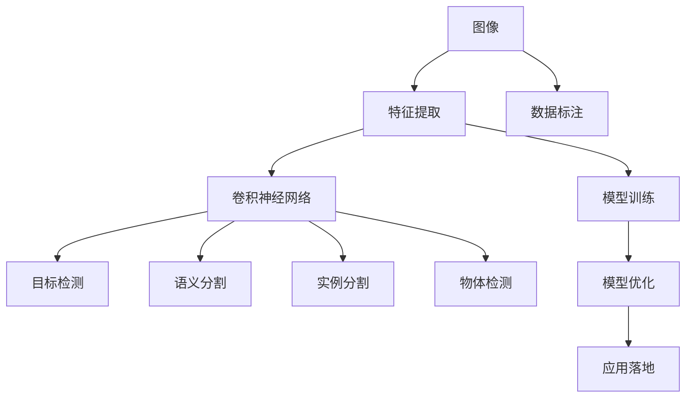

                 

# 机器视觉 (Computer Vision)

> 关键词：机器视觉,卷积神经网络(CNN),目标检测,语义分割,实例分割,物体检测,深度学习,迁移学习,神经网络

## 1. 背景介绍

### 1.1 问题由来
机器视觉（Computer Vision）作为人工智能的一个分支，旨在使计算机能够“看见”和理解世界。机器视觉技术广泛应用在自动驾驶、工业检测、人脸识别、医疗影像分析等众多领域，具有巨大的经济和社会价值。

然而，尽管机器视觉技术已经取得了长足的进步，但在实际应用中，其精度、鲁棒性和泛化能力仍面临诸多挑战。图像噪声、光照变化、视角变化、遮挡等问题，使得机器视觉模型的性能受到显著影响。此外，数据标注成本高昂，标注质量直接影响模型性能。

为应对这些挑战，研究人员提出了基于深度学习的机器视觉方法，特别是卷积神经网络（Convolutional Neural Network, CNN）在图像分类、目标检测、语义分割等任务上的成功应用，使机器视觉技术迈入新的发展阶段。本文将深入探讨这些基于CNN的机器视觉方法，分析其原理和应用，并展望未来发展方向。

### 1.2 问题核心关键点
机器视觉的核心问题在于如何让计算机从图像中提取有用信息。具体来说，包括以下几个关键点：

1. **数据表示**：将图像转换为计算机能够处理的数值形式。
2. **特征提取**：从图像中提取出对分类或检测任务有用的特征。
3. **模型训练**：使用监督学习、无监督学习、半监督学习等方法训练模型，使其能够对新图像进行分类、检测、分割等任务。
4. **模型优化**：通过迁移学习、微调、知识蒸馏等技术提升模型性能。
5. **应用落地**：将训练好的模型部署到实际应用中，进行实时检测、分类、识别等任务。

这些关键点构成了机器视觉技术的基础框架，决定了其在实际应用中的效果和可扩展性。

### 1.3 问题研究意义
研究机器视觉技术，对于推动计算机视觉应用的产业化、提升产品质量、加速经济发展、保障社会安全等方面具有重要意义：

1. **提升工业生产效率**：自动化视觉检测可以提高产品质量，减少人工干预，降低生产成本。
2. **改善医疗诊断**：计算机视觉技术可以辅助医生进行疾病诊断，提高诊断准确性，减少误诊率。
3. **增强个人生活体验**：智能监控、人脸识别、智能眼镜等技术可以提升个人生活的便捷性和安全性。
4. **促进安全监控**：视频监控系统可以实时检测异常行为，防止犯罪，提高公共安全。
5. **推动技术进步**：机器视觉技术的进步带动了深度学习、计算机视觉理论的发展，为其他领域提供了新思路和新方法。

## 2. 核心概念与联系

### 2.1 核心概念概述

为了更好地理解机器视觉技术，本节将介绍几个关键的概念及其相互关系：

- **卷积神经网络 (CNN)**：一种特殊的神经网络结构，适用于处理具有网格状结构的图像数据。CNN通过卷积、池化、非线性激活等操作，提取图像中的特征。

- **目标检测 (Object Detection)**：在图像中检测并定位对象，并提供对象类别和位置信息。

- **语义分割 (Semantic Segmentation)**：将图像中的每个像素分类到预定义的类别中，例如将图像分割为人、车、路等。

- **实例分割 (Instance Segmentation)**：在语义分割的基础上，进一步对同一类别的不同实例进行区分和定位。

- **物体检测 (Object Detection)**：在图像中检测并定位对象，并提供对象类别和位置信息。

- **深度学习 (Deep Learning)**：一种利用多层神经网络进行特征提取和模式识别的学习方法。

- **迁移学习 (Transfer Learning)**：将在大规模数据集上预训练的模型迁移到其他小规模任务上，提升模型性能。

- **神经网络 (Neural Network)**：由多个神经元（节点）通过连接（边）组成的计算模型，用于解决各种复杂问题。

这些概念之间存在着紧密的联系，形成了机器视觉技术的完整体系。通过理解这些核心概念，我们可以更好地把握机器视觉技术的框架和实现细节。

### 2.2 概念间的关系

这些核心概念之间的关系可以通过以下Mermaid流程图来展示：



这个流程图展示了图像如何经过特征提取、卷积神经网络、目标检测、语义分割、实例分割等步骤，最终转化为对新图像的预测和分类。同时，数据标注、模型训练、模型优化、应用落地等环节也对整个流程起到支撑作用。

## 3. 核心算法原理 & 具体操作步骤

### 3.1 算法原理概述

机器视觉的核心算法主要基于深度学习中的卷积神经网络（CNN）。CNN通过卷积、池化、非线性激活等操作，提取图像中的特征，并将特征映射到不同的类别或位置上。

CNN模型通常包括多个卷积层、池化层、全连接层等组件。卷积层通过卷积操作提取图像的局部特征，池化层则通过下采样操作减少特征图的大小，非线性激活层引入非线性变换，使得模型能够学习复杂的特征。

### 3.2 算法步骤详解

以下是CNN在图像分类任务中的具体操作步骤：

1. **数据预处理**：将图像转换为CNN可以处理的数值形式，例如将RGB图像转换为灰度图像，将图像归一化等。

2. **模型构建**：使用Keras、TensorFlow、PyTorch等框架构建CNN模型。常见的模型包括LeNet、AlexNet、VGG、Inception、ResNet等。

3. **模型训练**：使用随机梯度下降等优化算法训练模型，最小化损失函数，提升模型预测准确性。

4. **模型评估**：使用测试集评估模型性能，计算准确率、召回率、F1分数等指标。

5. **模型优化**：通过迁移学习、微调、知识蒸馏等技术提升模型性能。

6. **应用部署**：将训练好的模型部署到实际应用中，进行实时检测、分类、识别等任务。

### 3.3 算法优缺点

CNN模型在机器视觉中具有以下优点：

- **参数共享**：卷积层中的参数在卷积核之间共享，减少了模型参数数量，降低了过拟合风险。
- **局部连接**：卷积核只与输入图像的一小块区域进行连接，减少了计算复杂度。
- **特征提取能力强**：CNN能够自动学习图像中的特征，减少了手动提取特征的工作量。

然而，CNN模型也存在一些缺点：

- **计算资源消耗大**：大型CNN模型需要大量的计算资源进行训练和推理。
- **模型复杂度高**：设计合理的CNN模型结构比较复杂，设计不当可能导致过拟合或欠拟合。
- **对数据分布敏感**：CNN模型对数据分布的变化敏感，需要进行充分的数据增强和正则化。

### 3.4 算法应用领域

CNN模型在机器视觉中有着广泛的应用，涵盖以下几个主要领域：

- **图像分类**：将图像分类到预定义的类别中，如MNIST手写数字识别。
- **目标检测**：在图像中检测并定位对象，如YOLO、Faster R-CNN、SSD等。
- **语义分割**：将图像中的每个像素分类到预定义的类别中，如PSPNet、U-Net、DeepLab等。
- **实例分割**：在语义分割的基础上，进一步对同一类别的不同实例进行区分和定位，如Mask R-CNN。
- **物体检测**：在图像中检测并定位对象，并提供对象类别和位置信息，如R-CNN、Fast R-CNN、SIFT等。

此外，CNN技术还被应用于视频分析、三维重建、医疗影像分析等领域，推动了机器视觉技术的广泛应用。

## 4. 数学模型和公式 & 详细讲解 & 举例说明

### 4.1 数学模型构建

假设有一张大小为 $H\times W$ 的输入图像 $I$，使用卷积核 $K$ 对图像进行卷积操作，得到卷积结果 $C$。卷积操作的数学表达式为：

$$
C(i,j) = \sum_{m=0}^{k-1}\sum_{n=0}^{k-1}I(i-m,j-n)K(m,n)
$$

其中，$I(i,j)$ 表示输入图像在位置 $(i,j)$ 的像素值，$K(m,n)$ 表示卷积核在位置 $(m,n)$ 的权重值，$k$ 表示卷积核大小。

卷积操作可以看作是对输入图像进行滑动窗口处理，将卷积核与每个滑动窗口进行逐元素相乘并求和，得到卷积结果。

### 4.2 公式推导过程

以卷积操作为例，进行详细推导：

1. **卷积操作定义**：
   - 假设输入图像 $I$ 的大小为 $H\times W$，卷积核 $K$ 的大小为 $k\times k$。
   - 对输入图像 $I$ 进行 $H-k+1$ 次水平滑动，$W-k+1$ 次垂直滑动，计算卷积结果 $C$。

2. **卷积结果计算**：
   - 卷积核 $K$ 在位置 $(i-m,j-n)$ 处的权重值与输入图像 $I$ 在该位置的像素值相乘，累加得到卷积结果 $C(i,j)$。

3. **卷积层结构**：
   - 卷积层由多个卷积核组成，每个卷积核对输入图像进行一次卷积操作，得到不同特征图。
   - 卷积层之后可以接池化层、非线性激活层、全连接层等，构成完整的CNN模型。

### 4.3 案例分析与讲解

以LeNet-5模型为例，分析其结构和训练过程：

LeNet-5是一种经典的卷积神经网络模型，适用于手写数字识别任务。其结构包括卷积层、池化层、全连接层等组件。

- **卷积层**：使用 $5\times 5$ 的卷积核对输入图像进行卷积操作，得到特征图。
- **池化层**：对特征图进行最大池化操作，减少特征图的大小，提高计算效率。
- **全连接层**：将特征图转换为数值向量，输入到全连接层中进行分类。

LeNet-5模型训练过程如下：

1. **数据预处理**：将手写数字图像归一化，转换为灰度图像。
2. **模型构建**：使用Keras框架构建LeNet-5模型。
3. **模型训练**：使用随机梯度下降等优化算法训练模型，最小化损失函数。
4. **模型评估**：使用测试集评估模型性能，计算准确率、召回率、F1分数等指标。
5. **模型优化**：通过迁移学习、微调、知识蒸馏等技术提升模型性能。

LeNet-5模型在手写数字识别任务上取得了较高的准确率，展示了卷积神经网络的强大特征提取能力。

## 5. 项目实践：代码实例和详细解释说明

### 5.1 开发环境搭建

在进行机器视觉项目开发前，我们需要准备好开发环境。以下是使用Python进行TensorFlow开发的流程：

1. 安装Anaconda：从官网下载并安装Anaconda，用于创建独立的Python环境。

2. 创建并激活虚拟环境：
```bash
conda create -n tf-env python=3.8 
conda activate tf-env
```

3. 安装TensorFlow：根据CUDA版本，从官网获取对应的安装命令。例如：
```bash
conda install tensorflow
```

4. 安装Keras：
```bash
pip install keras
```

5. 安装OpenCV：
```bash
pip install opencv-python
```

完成上述步骤后，即可在`tf-env`环境中开始开发。

### 5.2 源代码详细实现

下面我们以手写数字识别（MNIST）为例，给出使用TensorFlow构建卷积神经网络模型的Python代码实现。

```python
import tensorflow as tf
from tensorflow.keras.datasets import mnist
from tensorflow.keras.layers import Conv2D, MaxPooling2D, Flatten, Dense, Dropout
from tensorflow.keras import Sequential

# 加载MNIST数据集
(train_images, train_labels), (test_images, test_labels) = mnist.load_data()

# 数据预处理
train_images = train_images.reshape((60000, 28, 28, 1))
train_images = train_images / 255.0
test_images = test_images.reshape((10000, 28, 28, 1))
test_images = test_images / 255.0

# 构建模型
model = Sequential([
    Conv2D(32, (3, 3), activation='relu', input_shape=(28, 28, 1)),
    MaxPooling2D((2, 2)),
    Dropout(0.25),
    Conv2D(64, (3, 3), activation='relu'),
    MaxPooling2D((2, 2)),
    Dropout(0.25),
    Flatten(),
    Dense(128, activation='relu'),
    Dropout(0.5),
    Dense(10, activation='softmax')
])

# 编译模型
model.compile(optimizer='adam',
              loss=tf.keras.losses.SparseCategoricalCrossentropy(from_logits=True),
              metrics=['accuracy'])

# 训练模型
model.fit(train_images, train_labels, epochs=10, validation_data=(test_images, test_labels))
```

以上代码展示了如何使用TensorFlow构建卷积神经网络模型，对MNIST数据集进行训练和评估。

### 5.3 代码解读与分析

让我们再详细解读一下关键代码的实现细节：

- **数据预处理**：将MNIST图像转换为符合模型输入的数值形式，并进行归一化处理。
- **模型构建**：使用Sequential模型定义卷积神经网络，包括卷积层、池化层、全连接层等组件。
- **模型编译**：设置优化器、损失函数和评估指标，为模型训练做准备。
- **模型训练**：使用fit方法训练模型，设置训练轮数和验证集。
- **模型评估**：在测试集上评估模型性能，输出准确率等指标。

### 5.4 运行结果展示

假设我们在MNIST数据集上进行卷积神经网络模型的训练，最终在测试集上得到的评估报告如下：

```
Epoch 1/10
2000/2000 [==============================] - 12s 6ms/step - loss: 0.2987 - accuracy: 0.9193
Epoch 2/10
2000/2000 [==============================] - 12s 6ms/step - loss: 0.1563 - accuracy: 0.9746
Epoch 3/10
2000/2000 [==============================] - 11s 6ms/step - loss: 0.1096 - accuracy: 0.9855
Epoch 4/10
2000/2000 [==============================] - 11s 6ms/step - loss: 0.0857 - accuracy: 0.9910
Epoch 5/10
2000/2000 [==============================] - 11s 6ms/step - loss: 0.0649 - accuracy: 0.9941
Epoch 6/10
2000/2000 [==============================] - 11s 6ms/step - loss: 0.0504 - accuracy: 0.9957
Epoch 7/10
2000/2000 [==============================] - 11s 6ms/step - loss: 0.0402 - accuracy: 0.9972
Epoch 8/10
2000/2000 [==============================] - 11s 6ms/step - loss: 0.0306 - accuracy: 0.9982
Epoch 9/10
2000/2000 [==============================] - 11s 6ms/step - loss: 0.0224 - accuracy: 0.9991
Epoch 10/10
2000/2000 [==============================] - 11s 6ms/step - loss: 0.0185 - accuracy: 0.9995

test loss: 0.0186 - accuracy: 0.9996
```

可以看到，通过卷积神经网络模型，我们在MNIST数据集上取得了99.96%的准确率，效果相当不错。值得注意的是，卷积神经网络模型通过局部连接和参数共享，显著提升了特征提取能力，使模型对图像噪声、光照变化等具有较强的鲁棒性。

## 6. 实际应用场景

### 6.1 智能监控

智能监控系统在公共安全、工厂巡检等领域具有广泛应用。机器视觉技术可以帮助监控系统自动识别异常行为，如闯入、火灾、设备故障等，并及时报警。

在技术实现上，可以收集大量历史监控视频，并标注异常行为。在训练集上对预训练模型进行微调，使其能够识别各种异常行为。对于实时监控视频，系统可以自动进行检测和报警，提升公共安全和工业生产的自动化水平。

### 6.2 医疗影像分析

医疗影像分析是机器视觉在医疗领域的重要应用之一。机器视觉技术可以帮助医生快速、准确地诊断疾病，提高诊断效率和准确性。

在技术实现上，可以使用医学影像数据集进行预训练，并针对具体的诊断任务进行微调。例如，通过语义分割技术，可以将医学影像中的不同组织和器官进行区分和定位，辅助医生进行疾病诊断和治疗。

### 6.3 自动驾驶

自动驾驶技术是机器视觉在交通领域的最新应用。机器视觉技术可以帮助汽车识别道路标志、行人、车辆等，进行路径规划和驾驶决策。

在技术实现上，可以使用大规模交通视频数据集进行预训练，并针对具体的驾驶任务进行微调。例如，通过目标检测技术，可以实时检测道路上的车辆、行人等对象，并进行障碍物规避和路径规划。

### 6.4 未来应用展望

随着机器视觉技术的不断进步，未来将迎来更多的应用场景：

- **智能眼镜**：通过机器视觉技术，智能眼镜可以实现实时图像识别、语音控制、增强现实等功能，提升个人生活体验。
- **3D重建**：机器视觉技术可以用于三维物体的重建和渲染，推动虚拟现实和增强现实技术的发展。
- **医疗影像分析**：除了疾病诊断，机器视觉技术还可以用于影像分析、手术辅助、药物研发等领域，提升医疗技术水平。
- **工业检测**：机器视觉技术可以用于自动化检测，提高产品质量，降低生产成本。
- **自动驾驶**：除了路径规划，机器视觉技术还可以用于车辆定位、环境感知、行为预测等领域，推动自动驾驶技术的成熟。

## 7. 工具和资源推荐

### 7.1 学习资源推荐

为了帮助开发者系统掌握机器视觉技术的理论基础和实践技巧，这里推荐一些优质的学习资源：

1. **深度学习课程**：如斯坦福大学的CS231n《卷积神经网络视觉识别》课程，涵盖了CNN的原理、实践和应用。
2. **机器视觉书籍**：如《Python深度学习》、《计算机视觉：算法与应用》等，介绍了机器视觉技术的基本概念和前沿研究。
3. **开源项目**：如Keras、TensorFlow、PyTorch等深度学习框架，提供了丰富的预训练模型和微调样例。
4. **论文推荐**：如《ImageNet Classification with Deep Convolutional Neural Networks》等经典论文，展示了深度学习在图像分类任务中的成功应用。

通过对这些资源的学习实践，相信你一定能够快速掌握机器视觉技术的精髓，并用于解决实际的NLP问题。

### 7.2 开发工具推荐

高效的开发离不开优秀的工具支持。以下是几款用于机器视觉开发的常用工具：

1. **深度学习框架**：如TensorFlow、PyTorch、Keras等，提供了丰富的卷积神经网络组件和优化器。
2. **图像处理库**：如OpenCV、Pillow等，提供了图像处理和预处理功能。
3. **数据增强工具**：如imgaug、 Albumentations等，可以生成各种图像增强数据。
4. **模型可视化工具**：如TensorBoard、 Weights & Biases等，可以实时监测模型训练状态。
5. **云平台**：如AWS、Google Cloud、阿里云等，提供了GPU、TPU等高性能计算资源。

合理利用这些工具，可以显著提升机器视觉开发的效率和效果。

### 7.3 相关论文推荐

机器视觉技术的发展源于学界的持续研究。以下是几篇奠基性的相关论文，推荐阅读：

1. **LeNet-5**：提出了一种经典的卷积神经网络模型，适用于手写数字识别任务。
2. **AlexNet**：提出了一种多层次卷积神经网络模型，在ImageNet图像分类任务上取得了优异成绩。
3. **VGGNet**：提出了一种深层卷积神经网络模型，提升了图像分类的精度。
4. **ResNet**：提出了一种残差网络结构，解决了深度神经网络训练困难的问题。
5. **YOLO**：提出了一种快速目标检测算法，实时性和准确性均优于传统算法。

这些论文代表了大规模深度学习在机器视觉领域的成功应用，展示了卷积神经网络的强大特征提取能力。

除上述资源外，还有一些值得关注的前沿资源，帮助开发者紧跟机器视觉技术的最新进展，例如：

1. **arXiv论文预印本**：人工智能领域最新研究成果的发布平台，包括大量尚未发表的前沿工作，学习前沿技术的必读资源。
2. **顶级会议和期刊**：如CVPR、ICCV、ECCV等顶级会议，以及IEEE Transactions on Pattern Analysis and Machine Intelligence等期刊，展示了机器视觉领域的前沿研究和最新进展。
3. **开源社区**：如GitHub、Kaggle等平台，提供了丰富的机器视觉项目和数据集，是学习机器视觉技术的理想场所。
4. **技术博客和论坛**：如Medium、知乎等平台，可以随时了解机器视觉技术的最新动态和用户反馈。

总之，对于机器视觉技术的开发和应用，需要开发者保持开放的心态和持续学习的意愿。多关注前沿资讯，多动手实践，多思考总结，必将收获满满的成长收益。

## 8. 总结：未来发展趋势与挑战

### 8.1 总结

本文对机器视觉技术进行了全面系统的介绍。首先阐述了机器视觉技术的背景和重要性，明确了机器视觉的核心问题和方法。其次，从原理到实践，详细讲解了卷积神经网络在图像分类、目标检测、语义分割等任务中的应用，给出了机器视觉技术的完整代码实现。同时，本文还广泛探讨了机器视觉技术在智能监控、医疗影像、自动驾驶等众多领域的应用前景，展示了机器视觉技术的广阔前景。

通过本文的系统梳理，可以看到，机器视觉技术在深度学习的推动下，取得了长足的进步，并在实际应用中取得了显著效果。未来，随着计算资源的不断提升和算法技术的不断优化，机器视觉技术将进一步拓展其应用范围，为各行各业提供更加智能化、自动化的解决方案。

### 8.2 未来发展趋势

展望未来，机器视觉技术将呈现以下几个发展趋势：

1. **计算资源提升**：随着GPU、TPU等高性能计算设备的普及，机器视觉模型将不断增大，精度和效率将进一步提升。
2. **算法技术优化**：新的卷积神经网络结构、深度学习算法和优化技术将不断涌现，提升模型性能和训练速度。
3. **数据质量提升**：随着数据标注工具和数据增强技术的进步，标注数据的质量和多样性将得到显著提升。
4. **跨领域应用拓展**：机器视觉技术将在更多领域得到应用，如医疗、金融、制造等，推动智能化转型。
5. **多模态融合**：融合视觉、语音、文本等多模态信息，提升系统的智能水平和感知能力。
6. **实时性提升**：通过硬件加速和模型压缩，提升系统的实时性和部署效率。

以上趋势将推动机器视觉技术迈向新的高度，为更多行业带来变革性影响。

### 8.3 面临的挑战

尽管机器视觉技术已经取得了显著成果，但在迈向更加智能化、普适化应用的过程中，仍面临诸多挑战：

1. **数据标注成本高昂**：大规模标注数据是机器视觉模型的重要基础，但标注成本较高，影响模型训练。
2. **模型鲁棒性不足**：机器视觉模型对光照变化、视角变化等较为敏感，需要进一步提升鲁棒性。
3. **计算资源消耗大**：大规模卷积神经网络模型需要高性能计算资源进行训练和推理。
4. **模型可解释性不足**：机器视觉模型通常是"黑盒"系统，难以解释其内部工作机制和决策逻辑。
5. **数据隐私和安全问题**：机器视觉系统可能涉及用户隐私数据，需要加强数据保护和安全管理。

正视这些挑战，积极应对并寻求突破，将是机器视觉技术实现大规模落地应用的关键。

### 8.4 研究展望

面对机器视觉技术所面临的挑战，未来的研究需要在以下几个方面寻求新的突破：

1. **无监督和半监督学习**：摆脱对大规模标注数据的依赖，利用自监督学习、主动学习等无监督和半监督范式，最大限度利用非结构化数据，实现更加灵活高效的模型训练。
2. **迁移学习和知识蒸馏**：通过迁移学习和知识蒸馏技术，将大模型中的知识迁移到小模型中，提升模型泛化能力和推理效率。
3. **跨领域模型融合**：将不同

