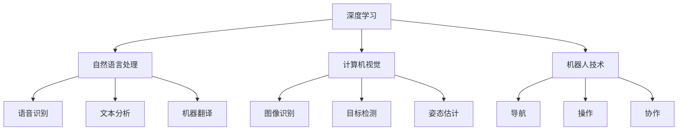
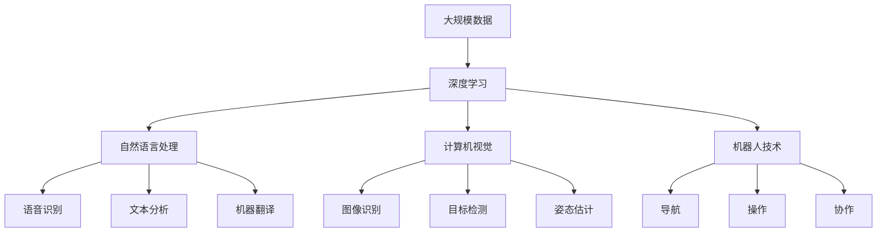

                 

# 李开复：AI 2.0 时代的价值

## 1. 背景介绍

### 1.1 问题由来
随着人工智能（AI）技术的发展，我们正在进入一个全新的人工智能时代，即AI 2.0时代。在这个时代，AI技术不仅在技术上有了突破性的进展，更在应用上展现出了巨大的潜力。李开复，作为一位AI领域的顶尖专家，对AI 2.0时代的价值有着深刻的理解。他认为，AI 2.0时代的到来，将彻底改变我们的工作方式、生活方式，乃至社会结构。

### 1.2 问题核心关键点
AI 2.0时代的核心价值在于其能够实现大规模的自动化、智能化和个性化。AI 2.0时代的技术包括深度学习、自然语言处理、计算机视觉、机器人技术等，这些技术的应用领域涵盖了医疗、教育、金融、交通、制造等各行各业，其价值主要体现在以下几个方面：

1. **自动化**：AI 2.0能够自动完成各种重复性、高风险或需要大量计算的工作，从而提升效率，降低成本。
2. **智能化**：AI 2.0能够通过学习和推理，做出复杂的决策和预测，从而提升决策的准确性和速度。
3. **个性化**：AI 2.0能够根据用户的行为和偏好，提供量身定制的服务，提升用户体验。

### 1.3 问题研究意义
研究AI 2.0时代的价值，对于我们理解AI技术的未来发展方向、应用场景以及潜在影响具有重要意义。它不仅有助于企业、政府、教育机构等制定相关政策，更有助于我们每个人更好地适应和利用AI技术，从而在未来的社会中占据更有利的地位。

## 2. 核心概念与联系

### 2.1 核心概念概述

AI 2.0时代的核心概念包括：深度学习、自然语言处理、计算机视觉、机器人技术等。这些概念之间的联系紧密，构成了AI 2.0时代的技术基础。

1. **深度学习**：一种基于神经网络的机器学习技术，能够自动从数据中学习特征，并用于分类、预测等任务。
2. **自然语言处理**：使计算机能够理解和处理人类语言的技术，包括语音识别、文本分析、机器翻译等。
3. **计算机视觉**：使计算机能够理解和处理视觉信息的技术，包括图像识别、目标检测、姿态估计等。
4. **机器人技术**：使机器人能够自动完成复杂任务的技术，包括导航、操作、协作等。

### 2.2 概念间的关系

这些核心概念之间的联系可以通过以下Mermaid流程图来展示：



这个流程图展示了深度学习、自然语言处理、计算机视觉和机器人技术之间的联系。深度学习作为AI 2.0的基础，被广泛应用于自然语言处理和计算机视觉任务中。而机器人技术则利用了深度学习、计算机视觉等技术，实现自动导航、操作和协作等功能。

### 2.3 核心概念的整体架构

最后，我们用一个综合的流程图来展示这些核心概念在大规模应用中的整体架构：



这个综合流程图展示了深度学习、自然语言处理、计算机视觉和机器人技术在大规模应用中的整体架构。大规模数据经过深度学习处理后，被应用于自然语言处理和计算机视觉任务中，最终实现各种智能功能。

## 3. 核心算法原理 & 具体操作步骤
### 3.1 算法原理概述

AI 2.0时代的核心算法原理包括深度学习、迁移学习、强化学习等。这些算法通过不断学习和优化，使得AI模型能够更好地适应各种任务。

1. **深度学习**：通过多层神经网络对数据进行非线性映射，从而实现复杂的特征提取和分类、预测等任务。
2. **迁移学习**：利用已有模型的知识和经验，在新任务上快速适应和提升性能。
3. **强化学习**：通过试错和奖励机制，训练模型在不同环境中做出最优决策。

### 3.2 算法步骤详解

AI 2.0时代的算法步骤主要包括数据准备、模型训练、模型评估和模型部署。

1. **数据准备**：收集和标注大规模数据，用于训练和验证模型。
2. **模型训练**：选择合适的模型架构和超参数，使用深度学习、迁移学习等技术进行训练。
3. **模型评估**：在验证集上评估模型的性能，调整模型参数和超参数，以提升性能。
4. **模型部署**：将训练好的模型部署到实际应用中，进行大规模落地。

### 3.3 算法优缺点

AI 2.0时代的算法优点包括：

1. **高效性**：AI 2.0算法能够自动学习和优化，从而在短时间内完成复杂任务。
2. **准确性**：AI 2.0算法通过深度学习等技术，实现了高精度的预测和分类。
3. **灵活性**：AI 2.0算法能够适应各种任务和环境，具有广泛的应用场景。

但其缺点也显而易见：

1. **数据依赖**：AI 2.0算法依赖于大规模数据，数据质量和数量对模型性能有重要影响。
2. **模型复杂性**：AI 2.0算法模型结构复杂，难以理解和调试。
3. **计算资源要求高**：AI 2.0算法需要高性能计算资源，如GPU、TPU等，增加了硬件成本。

### 3.4 算法应用领域

AI 2.0时代的算法在多个领域中得到了广泛应用，包括医疗、金融、教育、制造等。以下是几个典型的应用场景：

1. **医疗**：AI 2.0算法用于图像识别、自然语言处理等，辅助医生诊断和治疗。
2. **金融**：AI 2.0算法用于风险评估、投资决策、欺诈检测等。
3. **教育**：AI 2.0算法用于个性化推荐、智能辅导等，提升教育效果。
4. **制造**：AI 2.0算法用于质量检测、设备维护等，提升生产效率。

## 4. 数学模型和公式 & 详细讲解  
### 4.1 数学模型构建

AI 2.0时代的数学模型通常基于深度学习框架构建，如TensorFlow、PyTorch等。以深度学习模型为例，其构建过程如下：

1. **数据预处理**：将原始数据转化为模型能够处理的格式，如将图像数据转化为张量。
2. **模型定义**：定义模型的架构和参数，包括卷积层、池化层、全连接层等。
3. **损失函数**：定义损失函数，如交叉熵损失、均方误差损失等，用于评估模型性能。
4. **优化器**：选择优化器，如Adam、SGD等，用于更新模型参数。

### 4.2 公式推导过程

以卷积神经网络（CNN）为例，其数学模型构建和公式推导过程如下：

1. **数据输入**：输入为N个样本，每个样本为M维向量，即X ∈ ℝ^{N×M}。
2. **卷积操作**：对输入数据进行卷积操作，得到N×K×K×C的新数据Y ∈ ℝ^{N×K×K×C}。
3. **激活函数**：对卷积结果进行激活函数操作，如ReLU，得到N×K×K×C的新数据Z ∈ ℝ^{N×K×K×C}。
4. **池化操作**：对激活结果进行池化操作，得到N×K×K×C的新数据W ∈ ℝ^{N×K×K×C}。
5. **全连接层**：对池化结果进行全连接层操作，得到N×D的新数据V ∈ ℝ^{N×D}。
6. **输出层**：对全连接结果进行softmax函数操作，得到N×C的新数据U ∈ ℝ^{N×C}，其中C为类别数。

### 4.3 案例分析与讲解

以自然语言处理中的机器翻译为例，其数学模型构建和公式推导过程如下：

1. **数据输入**：输入为源语言序列X，长度为T，每个元素为C维向量，即X ∈ ℝ^{T×C}。
2. **编码器**：对输入序列进行编码器操作，得到N×D的新数据Y ∈ ℝ^{N×D}。
3. **解码器**：对编码器输出进行解码器操作，得到N×E的新数据Z ∈ ℝ^{N×E}。
4. **softmax函数**：对解码器输出进行softmax函数操作，得到N×C的新数据U ∈ ℝ^{N×C}，其中C为目标语言词汇表大小。
5. **交叉熵损失**：定义交叉熵损失函数，用于评估模型性能。

## 5. 项目实践：代码实例和详细解释说明
### 5.1 开发环境搭建

在进行AI 2.0项目实践前，我们需要准备好开发环境。以下是使用Python进行TensorFlow开发的环境配置流程：

1. 安装Anaconda：从官网下载并安装Anaconda，用于创建独立的Python环境。

2. 创建并激活虚拟环境：
```bash
conda create -n tf-env python=3.8 
conda activate tf-env
```

3. 安装TensorFlow：根据CUDA版本，从官网获取对应的安装命令。例如：
```bash
conda install tensorflow tensorflow-gpu=2.6 -c conda-forge -c pytorch
```

4. 安装各类工具包：
```bash
pip install numpy pandas scikit-learn matplotlib tqdm jupyter notebook ipython
```

完成上述步骤后，即可在`tf-env`环境中开始AI 2.0实践。

### 5.2 源代码详细实现

下面我们以计算机视觉中的图像分类任务为例，给出使用TensorFlow进行CNN模型训练的PyTorch代码实现。

首先，定义模型和优化器：

```python
import tensorflow as tf
from tensorflow.keras import layers, models

model = models.Sequential()
model.add(layers.Conv2D(32, (3, 3), activation='relu', input_shape=(28, 28, 1)))
model.add(layers.MaxPooling2D((2, 2)))
model.add(layers.Conv2D(64, (3, 3), activation='relu'))
model.add(layers.MaxPooling2D((2, 2)))
model.add(layers.Conv2D(64, (3, 3), activation='relu'))
model.add(layers.Flatten())
model.add(layers.Dense(64, activation='relu'))
model.add(layers.Dense(10))

optimizer = tf.keras.optimizers.Adam()

```

然后，定义训练和评估函数：

```python
def train_step(x, y):
    with tf.GradientTape() as tape:
        logits = model(x)
        loss = tf.keras.losses.sparse_categorical_crossentropy(y, logits)
    gradients = tape.gradient(loss, model.trainable_variables)
    optimizer.apply_gradients(zip(gradients, model.trainable_variables))

def evaluate(model, test_images, test_labels):
    predictions = model(test_images)
    return tf.keras.metrics.sparse_categorical_accuracy(test_labels, predictions)

```

最后，启动训练流程并在测试集上评估：

```python
epochs = 5
batch_size = 32

for epoch in range(epochs):
    for i in range(0, len(train_images), batch_size):
        x = train_images[i:i+batch_size]
        y = train_labels[i:i+batch_size]
        train_step(x, y)
    
    print(f"Epoch {epoch+1}, accuracy: {evaluate(model, test_images, test_labels)}")

```

以上就是使用TensorFlow进行CNN模型训练的完整代码实现。可以看到，通过TensorFlow提供的高级API，我们可以快速搭建和训练一个简单的CNN模型。

### 5.3 代码解读与分析

让我们再详细解读一下关键代码的实现细节：

**模型定义**：
- `Sequential`：创建序列模型，通过`.add`方法添加各种层。
- `Conv2D`：添加卷积层，通过`input_shape`设置输入维度。
- `MaxPooling2D`：添加池化层，通过`(2,2)`设置池化大小。
- `Dense`：添加全连接层，通过`relu`设置激活函数。

**训练函数**：
- `train_step`：定义一个训练步骤，通过`GradientTape`计算梯度，并使用`optimizer`更新模型参数。
- `evaluate`：定义一个评估函数，计算模型在测试集上的准确率。

**训练流程**：
- `epochs`：定义总的训练轮数。
- `batch_size`：定义每个批次的样本数。
- 在每个epoch内，通过`range`循环遍历训练集，每个批次调用`train_step`函数进行训练。
- 在每个epoch结束时，调用`evaluate`函数评估模型在测试集上的准确率。

通过TensorFlow提供的高级API，我们可以用相对简洁的代码完成CNN模型的训练。当然，在实际应用中，还需要针对具体任务进行优化设计，如增加正则化技术、搜索最优的超参数组合等，以进一步提升模型性能。

## 6. 实际应用场景
### 6.1 智能医疗

AI 2.0技术在智能医疗领域具有广阔的应用前景。通过AI 2.0技术，可以实现早期诊断、个性化治疗、手术辅助等，显著提升医疗服务的效率和质量。

在实际应用中，可以通过医疗影像数据、病历数据等进行预训练，然后在具体任务上微调，如图像分类、目标检测、自然语言处理等。例如，可以使用基于CNN的模型对医学影像进行分类，识别出病变区域；或者使用基于RNN的模型对病历数据进行分析，生成个性化治疗方案。

### 6.2 金融科技

AI 2.0技术在金融科技领域也有着广泛的应用，包括风险管理、信用评估、投资决策等。通过AI 2.0技术，可以提高金融服务的智能化水平，降低风险，提升用户体验。

在实际应用中，可以通过金融数据进行预训练，然后在具体任务上微调，如信用评分、股票预测、欺诈检测等。例如，可以使用基于RNN的模型对金融数据进行预测，评估客户的信用风险；或者使用基于深度学习的模型对股票市场进行预测，提供投资建议。

### 6.3 智能教育

AI 2.0技术在智能教育领域也有着广阔的应用前景。通过AI 2.0技术，可以实现智能辅导、个性化推荐、学习分析等，提升教育效果。

在实际应用中，可以通过教育数据进行预训练，然后在具体任务上微调，如图像识别、语音识别、自然语言处理等。例如，可以使用基于CNN的模型对教育资源进行分类，推荐适合学生学习的内容；或者使用基于RNN的模型对学生学习行为进行分析，生成个性化的学习路径。

## 7. 工具和资源推荐
### 7.1 学习资源推荐

为了帮助开发者系统掌握AI 2.0技术的理论基础和实践技巧，这里推荐一些优质的学习资源：

1. 《深度学习》课程：由斯坦福大学开设的深度学习课程，内容全面，涵盖深度学习的基础知识和高级技巧。
2. 《自然语言处理》课程：由Coursera和斯坦福大学合作开设的自然语言处理课程，讲解自然语言处理的理论基础和实践应用。
3. 《计算机视觉》课程：由斯坦福大学开设的计算机视觉课程，讲解计算机视觉的基础知识和高级技巧。
4. 《机器人学》课程：由MIT开设的机器人学课程，讲解机器人技术的基础知识和应用案例。

通过对这些资源的学习实践，相信你一定能够快速掌握AI 2.0技术的精髓，并用于解决实际的AI问题。

### 7.2 开发工具推荐

高效的开发离不开优秀的工具支持。以下是几款用于AI 2.0开发的工具：

1. TensorFlow：由Google主导开发的深度学习框架，易于使用，功能强大，适合大规模工程应用。
2. PyTorch：由Facebook开发的深度学习框架，灵活性高，适合快速迭代研究。
3. Keras：基于TensorFlow和Theano的高级深度学习框架，易于上手，适合初学者。
4. OpenCV：计算机视觉领域的开源库，提供各种图像处理和计算机视觉算法。
5. NVIDIA Tesla GPU：高性能计算资源，适合深度学习和计算机视觉任务。

合理利用这些工具，可以显著提升AI 2.0项目的开发效率，加快创新迭代的步伐。

### 7.3 相关论文推荐

AI 2.0技术的发展源于学界的持续研究。以下是几篇奠基性的相关论文，推荐阅读：

1. ImageNet Classification with Deep Convolutional Neural Networks（AlexNet论文）：提出AlexNet模型，奠定了深度学习在计算机视觉领域的突破。
2. A Few Simple Rules for Convolutional Neural Networks（VGG论文）：提出VGG模型，强调网络结构的重要性。
3. Deep Residual Learning for Image Recognition（ResNet论文）：提出ResNet模型，解决了深度网络退化的问题。
4. Attention Is All You Need（Transformer论文）：提出Transformer模型，开启了深度学习在自然语言处理领域的突破。
5. A Comprehensive Survey on GANs（GAN论文）：综述生成对抗网络的研究进展，推动了生成模型的发展。

这些论文代表了大规模深度学习模型的发展脉络。通过学习这些前沿成果，可以帮助研究者把握学科前进方向，激发更多的创新灵感。

除上述资源外，还有一些值得关注的前沿资源，帮助开发者紧跟AI 2.0技术的最新进展，例如：

1. arXiv论文预印本：人工智能领域最新研究成果的发布平台，包括大量尚未发表的前沿工作，学习前沿技术的必读资源。
2. 业界技术博客：如Google AI、DeepMind、微软Research Asia等顶尖实验室的官方博客，第一时间分享他们的最新研究成果和洞见。
3. 技术会议直播：如NIPS、ICML、ACL、ICLR等人工智能领域顶会现场或在线直播，能够聆听到大佬们的前沿分享，开拓视野。
4. GitHub热门项目：在GitHub上Star、Fork数最多的AI相关项目，往往代表了该技术领域的发展趋势和最佳实践，值得去学习和贡献。
5. 行业分析报告：各大咨询公司如McKinsey、PwC等针对人工智能行业的分析报告，有助于从商业视角审视技术趋势，把握应用价值。

总之，对于AI 2.0技术的学习和实践，需要开发者保持开放的心态和持续学习的意愿。多关注前沿资讯，多动手实践，多思考总结，必将收获满满的成长收益。

## 8. 总结：未来发展趋势与挑战
### 8.1 总结

本文对AI 2.0时代的核心算法原理和操作步骤进行了全面系统的介绍。首先阐述了AI 2.0时代的背景和价值，明确了AI 2.0技术在自动化、智能化和个性化方面的独特优势。其次，从原理到实践，详细讲解了深度学习、自然语言处理、计算机视觉、机器人技术等核心算法及其具体操作步骤，给出了AI 2.0技术在医疗、金融、教育等领域的实际应用实例。同时，本文还精选了AI 2.0技术的各类学习资源，力求为读者提供全方位的技术指引。

通过本文的系统梳理，可以看到，AI 2.0技术正在引领人工智能领域进入一个新的发展阶段，其强大的自动化和智能化能力将深刻影响各行各业，带来革命性的变化。

### 8.2 未来发展趋势

展望未来，AI 2.0技术将呈现以下几个发展趋势：

1. **自动化和智能化**：AI 2.0技术将进一步提升自动化和智能化水平，实现更加复杂、高精度的任务处理。
2. **多模态融合**：AI 2.0技术将实现视觉、语音、文本等多模态信息的融合，提升跨模态任务的表现。
3. **跨领域迁移**：AI 2.0技术将实现跨领域、跨任务的知识迁移，提升模型的泛化能力。
4. **联邦学习**：AI 2.0技术将通过联邦学习实现数据隐私保护和模型协作，提升隐私安全和数据利用效率。
5. **无监督学习**：AI 2.0技术将进一步发展无监督学习，实现数据的自我学习和知识发现。
6. **实时化**：AI 2.0技术将实现实时化的推理和决策，提升系统的响应速度和交互性。

### 8.3 面临的挑战

尽管AI 2.0技术已经取得了瞩目成就，但在迈向更加智能化、普适化应用的过程中，它仍面临诸多挑战：

1. **数据依赖**：AI 2.0技术依赖于大规模数据，数据质量和数量对模型性能有重要影响。
2. **模型复杂性**：AI 2.0技术模型结构复杂，难以理解和调试。
3. **计算资源要求高**：AI 2.0技术需要高性能计算资源，如GPU、TPU等，增加了硬件成本。
4. **可解释性不足**：AI 2.0技术的决策过程缺乏可解释性，难以对其推理逻辑进行分析和调试。
5. **安全性和隐私保护**：AI 2.0技术可能学习到有害信息，需要通过隐私保护和伦理审查等手段保障其安全性。
6. **法律法规和伦理问题**：AI 2.0技术的应用需要遵循法律法规和伦理准则，避免伦理风险。

### 8.4 研究展望

面对AI 2.0技术面临的诸多挑战，未来的研究需要在以下几个方面寻求新的突破：

1. **无监督学习**：发展无监督学习技术，减少对标注数据的依赖，提升模型的泛化能力。
2. **联邦学习**：研究联邦学习技术，实现数据隐私保护和模型协作，提升数据利用效率。
3. **多模态融合**：探索多模态融合技术，实现视觉、语音、文本等多种信息的高效融合。
4. **可解释性**：研究可解释性技术，提升AI 2.0技术的决策透明度和可理解性。
5. **伦理审查**：建立AI 2.0技术的伦理审查机制，确保其应用符合人类价值观和伦理道德。

这些研究方向将推动AI 2.0技术迈向更高的台阶，为构建安全、可靠、可解释、可控的智能系统铺平道路。面向未来，AI 2.0技术还需要与其他人工智能技术进行更深入的融合，如知识表示、因果推理、强化学习等，多路径协同发力，共同推动人工智能技术的发展和应用。

## 9. 附录：常见问题与解答
----------------------------------------------------------------
> 关键词：

**Q1：AI 2.0技术的优势和应用领域有哪些？**

A: AI 2.0技术的优势在于其能够实现大规模的自动化、智能化和个性化。其应用领域广泛，包括医疗、金融、教育、制造等。具体应用场景包括智能诊断、风险管理、个性化推荐、智能辅导等。

**Q2：AI 2.0技术的主要挑战有哪些？**

A: AI 2.0技术面临的主要挑战包括数据依赖、模型复杂性、计算资源要求高、可解释性不足、安全性和隐私保护、法律法规和伦理问题等。

**Q3：如何提升AI 2.0技术的泛化能力？**

A: 提升AI 2.0技术的泛化能力，可以从以下几个方面入手：
1. 发展无监督学习技术，减少对标注数据的依赖。
2. 探索多模态融合技术，实现视觉、语音、文本等多种信息的高效融合。
3. 研究可解释性技术，提升AI 2.0技术的决策透明度和可理解性。
4. 建立AI 2.0技术的伦理审查机制，确保其应用符合人类价值观和伦理道德。

**Q4：AI 2.0技术的未来发展趋势有哪些？**

A: AI 2.0技术的未来发展趋势包括自动化和智能化水平进一步提升、多模态融合、跨领域迁移、联邦学习、无监督学习、实时化推理和决策等。

**Q5：AI 2.0技术在实际应用中需要注意哪些问题？**

A: AI 2.0技术在实际应用中需要注意以下几个问题：
1. 数据依赖问题，需要收集和标注高质量的数据。
2. 模型复杂性问题，需要合理选择模型架构和超参数。
3. 计算资源要求高问题，需要选择合适的硬件设备和优化算法。
4. 可解释性不足问题，需要研究可解释性技术，提升AI 2.0技术的决策透明度和可理解性。
5. 安全性和隐私保护问题，需要建立隐私保护机制和伦理审查机制。
6. 法律法规和伦理问题，需要遵循相关法律法规和伦理准则。

通过上述问题的探讨，可以帮助开发者更好地理解AI 2.0技术的优势、挑战和未来发展趋势，从而在实际应用中充分发挥其潜力。

---

作者：禅与计算机程序设计艺术 / Zen and the Art of Computer Programming

