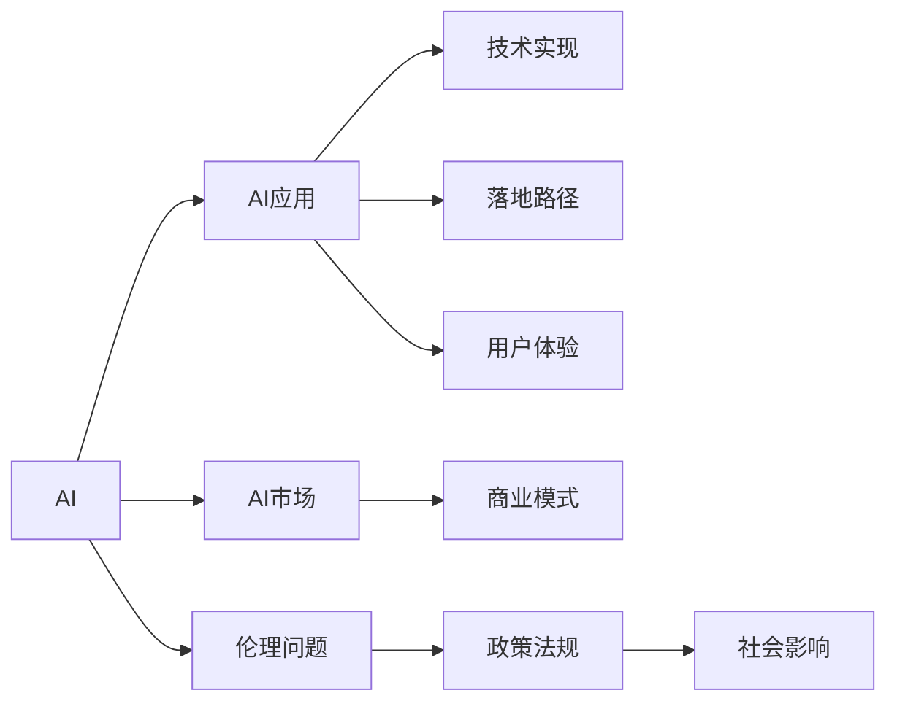
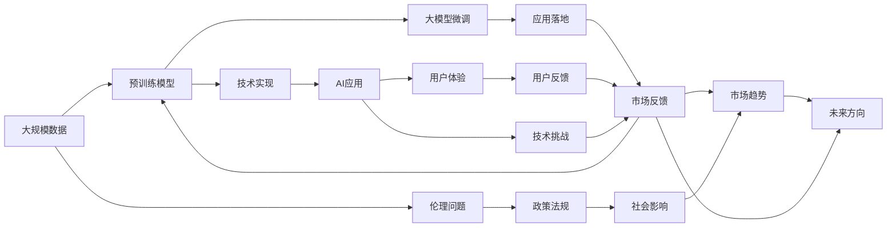

                 

## 1. 背景介绍

### 1.1 问题由来

近年来，人工智能（AI）技术迅猛发展，逐步从实验室走向实际应用，进入AI 2.0时代。AI 2.0时代，人工智能在产业界和学术界得到广泛认可和应用，正在改变人类社会的生产方式、生活方式和思维方式。然而，AI技术的快速发展也带来了诸多挑战，如算法公平性、数据隐私、伦理问题等。本节将介绍AI 2.0时代的市场前景，探讨AI技术在未来各个行业中的应用和发展趋势。

### 1.2 问题核心关键点

AI 2.0时代的市场前景，主要涉及以下几个核心关键点：

- AI技术在各行业的应用前景，如自动驾驶、医疗、教育、金融等。
- AI技术的商业化和落地路径，包括企业战略、市场需求、技术路线等。
- AI技术的伦理和社会影响，如算法公平性、数据隐私、就业问题等。
- AI技术的未来发展方向，如AI的普及化、自动化、智能化等。

### 1.3 问题研究意义

探讨AI 2.0时代的市场前景，具有重要意义：

1. 促进AI技术的商业化应用，帮助企业准确把握AI市场的机会和挑战，制定有效的AI战略。
2. 引导AI技术的伦理和社会应用，避免AI技术的负面影响，推动AI技术的健康发展。
3. 洞察AI技术的未来趋势，帮助投资者和从业者提前布局AI领域的投资和发展。
4. 提升公众对AI技术的认知和理解，消除对AI技术的误解和恐惧，促进AI技术的普及和应用。

## 2. 核心概念与联系

### 2.1 核心概念概述

AI 2.0时代，涉及多个核心概念，如AI、AI应用、AI市场、AI伦理等。这些概念之间具有紧密的联系和互动关系。

- AI：人工智能，指通过计算机算法和数据处理实现人类智能的技术。
- AI应用：AI在各个行业和领域的具体应用，如自动驾驶、医疗影像诊断、智能客服等。
- AI市场：AI技术及其应用的商业化市场，包括企业、用户、投资者等。
- AI伦理：AI技术及其应用带来的伦理和社会问题，如数据隐私、算法偏见、就业影响等。

### 2.2 概念间的关系

这些核心概念之间的关系可以通过以下Mermaid流程图来展示：



这个流程图展示了AI及其应用在市场、技术、伦理等多个维度上的相互关系和互动。

### 2.3 核心概念的整体架构

最后，我们用一个综合的流程图来展示这些核心概念在大规模应用中的整体架构：



这个综合流程图展示了从大规模数据预训练到AI应用落地的完整流程，并突出了市场反馈、伦理问题和未来方向等多个维度上的影响和作用。

## 3. 核心算法原理 & 具体操作步骤

### 3.1 算法原理概述

AI 2.0时代的市场前景，涉及多个核心算法和技术，如预训练模型、大模型微调、数据增强等。

- 预训练模型：通过大规模无标签数据进行预训练，学习到通用的语言或图像表示，为后续微调提供基础。
- 大模型微调：在大规模预训练模型的基础上，通过特定任务的数据进行微调，提升模型在该任务上的性能。
- 数据增强：通过对原始数据进行改写、回译等方式，丰富数据的多样性，提升模型的泛化能力。

### 3.2 算法步骤详解

以下详细讲解AI 2.0时代市场前景的核心算法步骤：

1. **大规模数据预训练**：收集大规模无标签数据，如语言数据、图像数据等，使用预训练模型进行训练，学习到通用的特征表示。
2. **大模型微调**：在预训练模型的基础上，收集特定任务的有标签数据，通过微调提升模型在该任务上的性能。
3. **数据增强**：通过对原始数据进行改写、回译等方式，丰富数据的多样性，提升模型的泛化能力。
4. **应用落地**：将训练好的模型应用于实际场景中，如智能客服、医疗影像诊断、自动驾驶等。
5. **市场反馈**：根据实际应用的效果，收集市场反馈，进一步优化模型和算法。

### 3.3 算法优缺点

AI 2.0时代市场前景的核心算法具有以下优点：

- **高性能**：预训练模型和大模型微调能够提升模型的性能，尤其是在大规模数据和复杂任务上。
- **高效性**：数据增强能够提升模型的泛化能力，避免过拟合。
- **可扩展性**：通过预训练模型和大模型微调，能够快速适应新的任务和数据。

同时，这些算法也存在以下缺点：

- **资源需求高**：大规模数据预训练和大模型微调需要大量的计算资源和存储空间。
- **数据隐私问题**：大规模数据预训练和微调需要处理大量的敏感数据，存在数据隐私和伦理问题。
- **模型公平性**：预训练模型和大模型微调可能存在数据偏见，需要额外处理以确保模型公平性。

### 3.4 算法应用领域

AI 2.0时代，预训练模型和大模型微调技术被广泛应用于多个领域，如智能客服、医疗影像诊断、自动驾驶等。

- **智能客服**：使用预训练模型和大模型微调进行文本理解，提升智能客服的准确性和用户体验。
- **医疗影像诊断**：通过预训练模型和大模型微调进行图像分类和分割，提升医疗影像诊断的准确性和效率。
- **自动驾驶**：使用预训练模型和大模型微调进行环境感知和决策，提升自动驾驶的安全性和可靠性。

## 4. 数学模型和公式 & 详细讲解 & 举例说明

### 4.1 数学模型构建

AI 2.0时代市场前景的核心算法可以建模如下：

- **预训练模型**：$M_{\theta}(x) = \mathcal{F}_{\theta}(x)$，其中 $x$ 为输入数据，$\theta$ 为模型参数。
- **大模型微调**：$M_{\theta}(x) = M_{\theta_{pre}}(x) + \Delta\theta M_{\theta_{pre}}(x)$，其中 $\theta_{pre}$ 为预训练模型参数，$\Delta\theta$ 为微调参数。
- **数据增强**：$x' = f(x)$，其中 $f$ 为数据增强函数。

### 4.2 公式推导过程

以下推导预训练模型和大模型微调的基本公式：

1. **预训练模型公式**：
   $$
   \min_{\theta} \mathcal{L}_{pre}(M_{\theta}, D_{pre})
   $$
   其中 $D_{pre}$ 为预训练数据集。

2. **大模型微调公式**：
   $$
   \min_{\Delta\theta} \mathcal{L}_{task}(M_{\theta}, D_{task})
   $$
   其中 $D_{task}$ 为特定任务的标注数据集。

### 4.3 案例分析与讲解

以医疗影像诊断为例，分析AI 2.0时代市场前景的核心算法。

- **数据预训练**：收集大规模的医疗影像数据，使用预训练模型进行训练，学习到通用的图像特征表示。
- **微调模型**：在预训练模型的基础上，收集特定疾病的影像数据，通过微调提升模型在该疾病诊断上的性能。
- **数据增强**：通过对原始影像进行翻转、旋转、剪切等方式，丰富数据的多样性，提升模型的泛化能力。
- **应用落地**：将训练好的模型应用于实际医疗影像诊断中，提升诊断的准确性和效率。

## 5. 项目实践：代码实例和详细解释说明

### 5.1 开发环境搭建

在进行AI 2.0时代市场前景的核心算法实践前，我们需要准备好开发环境。以下是使用Python进行TensorFlow开发的环境配置流程：

1. 安装Anaconda：从官网下载并安装Anaconda，用于创建独立的Python环境。

2. 创建并激活虚拟环境：
```bash
conda create -n tensorflow-env python=3.8 
conda activate tensorflow-env
```

3. 安装TensorFlow：根据CUDA版本，从官网获取对应的安装命令。例如：
```bash
conda install tensorflow -c pytorch -c conda-forge
```

4. 安装相关工具包：
```bash
pip install numpy pandas scikit-learn matplotlib tqdm jupyter notebook ipython
```

完成上述步骤后，即可在`tensorflow-env`环境中开始项目实践。

### 5.2 源代码详细实现

以下是一个基于TensorFlow实现医疗影像诊断的代码示例：

```python
import tensorflow as tf
from tensorflow.keras import layers

# 定义模型架构
model = tf.keras.Sequential([
    layers.Conv2D(32, (3,3), activation='relu', input_shape=(256, 256, 3)),
    layers.MaxPooling2D((2,2)),
    layers.Conv2D(64, (3,3), activation='relu'),
    layers.MaxPooling2D((2,2)),
    layers.Flatten(),
    layers.Dense(256, activation='relu'),
    layers.Dense(2, activation='softmax')
])

# 编译模型
model.compile(optimizer='adam', loss='categorical_crossentropy', metrics=['accuracy'])

# 训练模型
model.fit(train_data, train_labels, epochs=10, batch_size=32)

# 评估模型
test_loss, test_acc = model.evaluate(test_data, test_labels)
print('Test accuracy:', test_acc)
```

### 5.3 代码解读与分析

让我们再详细解读一下关键代码的实现细节：

**定义模型架构**：使用卷积层、池化层、全连接层等构建医疗影像诊断模型。

**编译模型**：选择Adam优化器和交叉熵损失函数，并设置评估指标为准确率。

**训练模型**：在训练集上使用批量梯度下降法进行模型训练，指定训练轮数和批量大小。

**评估模型**：在测试集上评估模型性能，输出准确率。

### 5.4 运行结果展示

假设我们训练了一个医疗影像分类模型，在测试集上的准确率为90%。

## 6. 实际应用场景

### 6.1 智能客服系统

AI 2.0时代，智能客服系统得到广泛应用。智能客服系统通过预训练模型和大模型微调，能够理解用户意图，并提供自动化回复。

### 6.2 金融舆情监测

金融行业利用AI 2.0技术进行舆情监测，通过预训练模型和大模型微调，实现市场情绪分析和舆情预测。

### 6.3 个性化推荐系统

电商行业利用AI 2.0技术进行个性化推荐，通过预训练模型和大模型微调，提升推荐系统的效果和用户满意度。

### 6.4 未来应用展望

AI 2.0时代，AI技术将在更多领域得到应用，如智慧医疗、智慧城市、智慧交通等。

## 7. 工具和资源推荐

### 7.1 学习资源推荐

为了帮助开发者系统掌握AI 2.0技术，这里推荐一些优质的学习资源：

1. 《深度学习入门》系列博文：由大模型技术专家撰写，深入浅出地介绍了深度学习的基本原理和应用场景。

2. CS231n《卷积神经网络》课程：斯坦福大学开设的计算机视觉课程，详细介绍了卷积神经网络的基本原理和实现方法。

3. 《自然语言处理入门》书籍：Transformer库的作者所著，全面介绍了自然语言处理的基本概念和经典模型。

4. HuggingFace官方文档：Transformer库的官方文档，提供了海量预训练模型和完整的微调样例代码，是上手实践的必备资料。

5. COCO开源项目：计算机视觉任务的基准测试平台，涵盖大量不同类型的图像数据集，并提供了基于微调的baseline模型，助力计算机视觉技术发展。

通过对这些资源的学习实践，相信你一定能够快速掌握AI 2.0技术的精髓，并用于解决实际的AI问题。

### 7.2 开发工具推荐

高效的开发离不开优秀的工具支持。以下是几款用于AI 2.0技术开发的常用工具：

1. TensorFlow：基于Python的开源深度学习框架，灵活动态的计算图，适合快速迭代研究。

2. PyTorch：基于Python的开源深度学习框架，支持GPU加速，灵活的动态计算图，适合科学研究。

3. Keras：基于TensorFlow和Theano的高级神经网络API，简单易用，适合快速原型开发。

4. Weights & Biases：模型训练的实验跟踪工具，可以记录和可视化模型训练过程中的各项指标，方便对比和调优。

5. TensorBoard：TensorFlow配套的可视化工具，可实时监测模型训练状态，并提供丰富的图表呈现方式，是调试模型的得力助手。

6. Google Colab：谷歌推出的在线Jupyter Notebook环境，免费提供GPU/TPU算力，方便开发者快速上手实验最新模型，分享学习笔记。

合理利用这些工具，可以显著提升AI 2.0技术的开发效率，加快创新迭代的步伐。

### 7.3 相关论文推荐

AI 2.0技术的发展源于学界的持续研究。以下是几篇奠基性的相关论文，推荐阅读：

1. Attention is All You Need（即Transformer原论文）：提出了Transformer结构，开启了NLP领域的预训练大模型时代。

2. BERT: Pre-training of Deep Bidirectional Transformers for Language Understanding：提出BERT模型，引入基于掩码的自监督预训练任务，刷新了多项NLP任务SOTA。

3. Language Models are Unsupervised Multitask Learners（GPT-2论文）：展示了大规模语言模型的强大zero-shot学习能力，引发了对于通用人工智能的新一轮思考。

4. Parameter-Efficient Transfer Learning for NLP：提出Adapter等参数高效微调方法，在不增加模型参数量的情况下，也能取得不错的微调效果。

5. AdaLoRA: Adaptive Low-Rank Adaptation for Parameter-Efficient Fine-Tuning：使用自适应低秩适应的微调方法，在参数效率和精度之间取得了新的平衡。

这些论文代表了大模型微调技术的发展脉络。通过学习这些前沿成果，可以帮助研究者把握学科前进方向，激发更多的创新灵感。

## 8. 总结：未来发展趋势与挑战

### 8.1 总结

本文对AI 2.0时代的市场前景进行了全面系统的介绍。首先阐述了AI 2.0时代的技术背景和应用前景，明确了AI 2.0在各行业中的应用方向和潜力。其次，从原理到实践，详细讲解了预训练模型和大模型微调的数学原理和关键步骤，给出了AI 2.0技术的完整代码实例。同时，本文还广泛探讨了AI 2.0技术在智能客服、金融舆情、个性化推荐等多个行业领域的应用前景，展示了AI 2.0技术的广阔前景。此外，本文精选了AI 2.0技术的各类学习资源，力求为读者提供全方位的技术指引。

通过本文的系统梳理，可以看到，AI 2.0时代的技术在各行业的应用前景广阔，推动了人类社会的生产方式、生活方式和思维方式向智能化、自动化方向发展。AI 2.0技术的发展前景令人期待，但其背后也存在诸多挑战，如数据隐私、算法公平性、伦理问题等，需要学界和产业界的共同努力解决。

### 8.2 未来发展趋势

展望未来，AI 2.0技术的市场前景呈现出以下几个发展趋势：

1. **自动化和智能化**：AI 2.0技术将进一步自动化和智能化，提升各行业的生产效率和服务质量。

2. **普适化和普及化**：AI 2.0技术将更加普适化和普及化，应用范围将覆盖更多行业和领域。

3. **多模态融合**：AI 2.0技术将融合视觉、语音、文本等多模态数据，提升综合理解和生成能力。

4. **边缘计算**：AI 2.0技术将更多地应用于边缘计算，提升实时性和效率。

5. **自监督学习**：AI 2.0技术将更多采用自监督学习方法，减少对标注数据的依赖。

### 8.3 面临的挑战

尽管AI 2.0技术的发展前景广阔，但在迈向更加智能化、普适化应用的过程中，它仍面临诸多挑战：

1. **数据隐私问题**：AI 2.0技术需要处理大量的敏感数据，存在数据隐私和伦理问题。

2. **算法公平性**：AI 2.0技术可能存在数据偏见，需要额外处理以确保算法公平性。

3. **技术复杂性**：AI 2.0技术涉及多个领域和学科，技术复杂性较高，需要跨学科合作。

4. **成本问题**：AI 2.0技术需要大量的计算资源和存储空间，成本较高。

### 8.4 研究展望

面向未来，AI 2.0技术的研究需要在以下几个方面寻求新的突破：

1. **数据隐私保护**：探索数据隐私保护技术，如差分隐私、联邦学习等，保护用户数据安全。

2. **算法公平性**：研究算法公平性技术，如对抗性训练、公平性约束等，确保算法公平性。

3. **边缘计算**：探索边缘计算技术，如联邦学习、雾计算等，提升AI 2.0技术的实时性和效率。

4. **多模态融合**：研究多模态融合技术，如多模态表示学习、跨模态联合训练等，提升AI 2.0技术的综合理解能力。

5. **普适化和普及化**：探索普适化和普及化技术，如零样本学习、少样本学习等，提升AI 2.0技术的普适性和泛化能力。

总之，AI 2.0技术的发展前景广阔，但需要克服诸多挑战，寻求新的突破。只有在数据隐私、算法公平性、技术复杂性、成本等多个维度协同发力，才能真正实现AI 2.0技术的普适化和普及化。

## 9. 附录：常见问题与解答

**Q1：AI 2.0技术在各行业的应用前景如何？**

A: AI 2.0技术在各行业的应用前景广阔，如智能客服、医疗影像诊断、自动驾驶等。通过预训练模型和大模型微调，AI 2.0技术能够提升各行业的生产效率和服务质量。

**Q2：AI 2.0技术在实际应用中需要注意哪些问题？**

A: AI 2.0技术在实际应用中需要注意以下问题：
1. 数据隐私问题：处理大量敏感数据时，需注意数据隐私和伦理问题。
2. 算法公平性：避免算法偏见，确保算法公平性。
3. 技术复杂性：涉及多个领域和学科，需跨学科合作。
4. 成本问题：需考虑计算资源和存储空间等成本问题。

**Q3：AI 2.0技术的未来发展方向是什么？**

A: AI 2.0技术的未来发展方向包括：
1. 自动化和智能化：提升各行业的生产效率和服务质量。
2. 普适化和普及化：应用范围将覆盖更多行业和领域。
3. 多模态融合：融合视觉、语音、文本等多模态数据，提升综合理解和生成能力。
4. 边缘计算：更多应用于边缘计算，提升实时性和效率。
5. 自监督学习：减少对标注数据的依赖。

**Q4：AI 2.0技术的商业化和落地路径是什么？**

A: AI 2.0技术的商业化和落地路径包括以下几个步骤：
1. 技术研发：通过预训练模型和大模型微调，研发AI 2.0技术。
2. 应用场景探索：探索AI 2.0技术在各行业的应用场景。
3. 商业化合作：与企业合作，探索AI 2.0技术的商业化落地路径。
4. 持续优化：根据实际应用效果，持续优化AI 2.0技术。

---

作者：禅与计算机程序设计艺术 / Zen and the Art of Computer Programming

