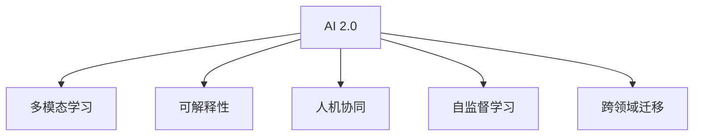

                 

# 李开复：AI 2.0 时代的机遇

## 1. 背景介绍

### 1.1 问题由来
进入21世纪以来，人工智能(AI)技术迅猛发展，尤其是深度学习技术的突破，使得AI技术在图像识别、语音识别、自然语言处理等诸多领域取得了显著进展。AI技术的飞速发展，不仅极大地改变了人们的生活方式，也带来了前所未有的商业机遇。在人工智能发展的浪潮中，AI 2.0时代已经来临，代表着人工智能从传统计算和信息处理向更广阔的应用领域拓展。

### 1.2 问题核心关键点
AI 2.0时代的到来，不仅意味着技术的进一步成熟，更代表着一场新的产业变革。AI技术在医疗、教育、金融、制造、农业等多个行业的应用，带来了新的商业模式和价值创造方式。然而，AI 2.0时代也面临着诸多挑战，如数据隐私保护、伦理道德、技术普及等，需要社会各界共同努力，推动AI技术的健康发展。

### 1.3 问题研究意义
探讨AI 2.0时代的机遇，对于把握技术趋势，寻找商业机会，推动社会进步，具有重要意义。AI 2.0技术不仅能够带来产业转型和效率提升，还能解决一系列社会问题，如环境保护、健康医疗、教育公平等。通过对AI 2.0时代的全面理解，可以为各类企业和机构提供有价值的指导和参考，促进技术创新和产业升级。

## 2. 核心概念与联系

### 2.1 核心概念概述

AI 2.0时代是指AI技术在更广泛的应用领域中发挥作用，推动产业创新和社会进步的阶段。AI 2.0时代的核心概念包括：

- **AI 2.0：** 是指AI技术的全面化和实用化，涵盖计算机视觉、自然语言处理、语音识别、机器人等诸多领域。
- **多模态学习：** 指通过融合视觉、语音、文本等多种模态的数据，实现更加全面、精准的信息理解和处理。
- **可解释性：** 指AI模型的决策过程可以清晰解释，便于理解和调试，这对于医疗、金融等高风险领域尤为重要。
- **人机协同：** 指AI技术与人类智慧的结合，实现互补、协作，推动任务的高效完成。
- **自监督学习：** 指通过利用大量未标注数据，自动学习数据的表示和特征，减少对人工标注的依赖。
- **跨领域迁移：** 指AI模型可以在不同领域之间进行迁移，提升泛化能力和应用范围。

### 2.2 概念间的关系

这些核心概念之间存在着紧密的联系，构成了AI 2.0时代的核心生态系统。以下是这些概念之间的关系：

- **AI 2.0与多模态学习**：AI 2.0通过融合多模态数据，实现更加全面和准确的AI模型。
- **AI 2.0与人机协同**：AI 2.0技术可以帮助人类完成复杂任务，提高工作效率，同时也能从人类活动中学习，提升AI模型的智能化水平。
- **AI 2.0与可解释性**：AI 2.0技术的可解释性是其可靠性和可信度的重要保证，尤其对于医疗、金融等高风险领域。
- **AI 2.0与自监督学习**：AI 2.0技术可以自动利用未标注数据进行学习，减少人工标注的复杂性和成本。
- **AI 2.0与跨领域迁移**：AI 2.0模型可以在不同领域之间进行迁移，实现知识的共享和应用。

### 2.3 核心概念的整体架构

下图展示了AI 2.0时代的核心概念及其之间的联系：



这个流程图展示了AI 2.0技术的核心概念及其之间的关系：AI 2.0技术通过多模态学习、人机协同、可解释性、自监督学习和跨领域迁移，实现更加全面、智能、可靠和普及的AI应用。

## 3. 核心算法原理 & 具体操作步骤

### 3.1 算法原理概述

AI 2.0时代的技术基础包括深度学习、计算机视觉、自然语言处理、语音识别等。其中，深度学习技术通过神经网络模型自动学习数据表示和特征，实现高精度的信息处理和智能决策。AI 2.0算法包括：

- **卷积神经网络(CNN)**：主要用于图像识别和处理，提取图像特征。
- **循环神经网络(RNN)**：主要用于自然语言处理和语音识别，处理序列数据。
- **自编码器(Autoencoder)**：主要用于数据降维和特征提取。
- **注意力机制(Attention Mechanism)**：用于提高模型的信息关注能力和泛化能力。
- **迁移学习(Transfer Learning)**：指在已有任务上训练模型，然后迁移应用于新任务，提高模型泛化能力。
- **强化学习(Reinforcement Learning)**：通过智能体与环境的交互，学习最优策略。

### 3.2 算法步骤详解

AI 2.0算法通常包括以下步骤：

**Step 1: 数据准备**
- 收集和预处理多模态数据，如文本、图像、语音等。
- 对数据进行标注和清洗，去除噪声和异常值。
- 将数据分为训练集、验证集和测试集。

**Step 2: 模型构建**
- 选择合适的深度学习模型架构，如卷积神经网络、循环神经网络等。
- 设计适当的损失函数和优化器，如交叉熵损失、Adam优化器等。
- 对模型进行预训练，提高模型的泛化能力和表示能力。

**Step 3: 模型训练**
- 在训练集上使用优化器进行模型训练，不断调整模型参数，最小化损失函数。
- 在验证集上监测模型性能，避免过拟合。
- 使用正则化技术，如L2正则、Dropout等，防止模型过拟合。

**Step 4: 模型评估**
- 在测试集上评估模型性能，如准确率、召回率、F1分数等。
- 使用可视化工具，如TensorBoard，监测模型训练状态和性能。
- 根据评估结果，调整模型结构和超参数，进一步优化模型性能。

**Step 5: 模型应用**
- 将模型部署到实际应用中，进行推理和预测。
- 根据应用场景，调整模型输出格式和格式，满足业务需求。
- 不断收集反馈数据，进行模型迭代和优化。

### 3.3 算法优缺点

AI 2.0算法具有以下优点：

- **高精度**：通过深度学习和多模态数据融合，AI 2.0模型能够实现高精度的信息处理和智能决策。
- **泛化能力强**：通过迁移学习和自监督学习，AI 2.0模型能够在不同领域和任务间进行泛化。
- **可解释性**：通过可解释性技术，AI 2.0模型能够提供透明的决策过程，便于理解和调试。
- **高效率**：通过高效的计算图和优化器，AI 2.0模型能够在短时间内完成训练和推理。

同时，AI 2.0算法也存在以下缺点：

- **数据依赖**：AI 2.0模型的性能高度依赖于标注数据的质量和数量，数据获取成本高。
- **计算资源消耗大**：AI 2.0模型的计算需求高，对硬件资源要求较高。
- **模型复杂度高**：AI 2.0模型的结构复杂，需要大量的计算资源和训练时间。
- **鲁棒性差**：AI 2.0模型对输入数据的变化较为敏感，鲁棒性有待提高。

### 3.4 算法应用领域

AI 2.0技术已经在医疗、教育、金融、制造、农业等多个领域得到广泛应用，具体包括：

- **医疗健康：** 通过AI 2.0技术，可以实现智能诊断、治疗方案推荐、疾病预测等。
- **教育：** 利用AI 2.0技术，可以实现个性化教学、学习评估、智能辅导等。
- **金融：** 通过AI 2.0技术，可以实现智能投顾、风险评估、欺诈检测等。
- **制造：** 利用AI 2.0技术，可以实现智能生产、质量控制、设备维护等。
- **农业：** 通过AI 2.0技术，可以实现智能种植、精准农业、农业机器人等。

## 4. 数学模型和公式 & 详细讲解 & 举例说明

### 4.1 数学模型构建

AI 2.0技术的核心模型为深度神经网络，其数学模型包括：

- **前向传播：** 通过激活函数对输入数据进行处理，得到模型输出。
- **反向传播：** 根据模型输出和真实标签，计算损失函数，并反向传播计算梯度。
- **优化器：** 通过梯度下降算法更新模型参数，最小化损失函数。

以卷积神经网络为例，其数学模型如下：

$$
y = f(Wx + b)
$$

其中，$x$为输入数据，$W$为权重矩阵，$b$为偏置向量，$f$为激活函数，$y$为输出。

### 4.2 公式推导过程

以卷积神经网络为例，其前向传播和反向传播的公式推导如下：

**前向传播：**

$$
y^{(l+1)} = f(W^{(l+1)} y^{(l)} + b^{(l+1)})
$$

**反向传播：**

$$
\frac{\partial L}{\partial W^{(l)}} = \frac{\partial L}{\partial y^{(l+1)}} \frac{\partial y^{(l+1)}}{\partial W^{(l)}} + \frac{\partial L}{\partial y^{(l)}} \frac{\partial y^{(l)}}{\partial W^{(l)}}
$$

其中，$L$为损失函数，$y^{(l)}$为第$l$层输出，$W^{(l)}$为第$l$层权重矩阵。

### 4.3 案例分析与讲解

以图像分类为例，使用卷积神经网络进行图像分类的过程如下：

1. **数据准备**：将图像数据分为训练集、验证集和测试集，并对图像进行标注。
2. **模型构建**：设计卷积神经网络模型，包括卷积层、池化层、全连接层等。
3. **模型训练**：使用训练集数据进行模型训练，最小化交叉熵损失。
4. **模型评估**：在测试集上评估模型性能，如准确率、召回率等。
5. **模型应用**：将模型部署到实际应用中，进行图像分类。

## 5. 项目实践：代码实例和详细解释说明

### 5.1 开发环境搭建

进行AI 2.0项目开发，需要以下开发环境：

- **Python 3.x**：作为开发语言。
- **PyTorch**：深度学习框架，支持动态计算图。
- **TensorFlow**：深度学习框架，支持静态计算图。
- **Keras**：深度学习框架，易于使用。
- **TensorBoard**：模型可视化工具。
- **Jupyter Notebook**：交互式开发环境。

完成环境搭建后，可以开始AI 2.0项目开发。

### 5.2 源代码详细实现

以下是一个简单的图像分类项目示例，使用PyTorch框架进行实现。

```python
import torch
import torch.nn as nn
import torch.optim as optim
import torchvision
import torchvision.transforms as transforms

# 定义卷积神经网络模型
class Net(nn.Module):
    def __init__(self):
        super(Net, self).__init__()
        self.conv1 = nn.Conv2d(3, 6, 5)
        self.pool = nn.MaxPool2d(2, 2)
        self.conv2 = nn.Conv2d(6, 16, 5)
        self.fc1 = nn.Linear(16 * 5 * 5, 120)
        self.fc2 = nn.Linear(120, 84)
        self.fc3 = nn.Linear(84, 10)

    def forward(self, x):
        x = self.pool(F.relu(self.conv1(x)))
        x = self.pool(F.relu(self.conv2(x)))
        x = x.view(-1, 16 * 5 * 5)
        x = F.relu(self.fc1(x))
        x = F.relu(self.fc2(x))
        x = self.fc3(x)
        return x

# 加载数据集
transform = transforms.Compose(
    [transforms.ToTensor(),
     transforms.Normalize((0.5, 0.5, 0.5), (0.5, 0.5, 0.5))])

trainset = torchvision.datasets.CIFAR10(root='./data', train=True,
                                        download=True, transform=transform)
trainloader = torch.utils.data.DataLoader(trainset, batch_size=4,
                                          shuffle=True, num_workers=2)

testset = torchvision.datasets.CIFAR10(root='./data', train=False,
                                       download=True, transform=transform)
testloader = torch.utils.data.DataLoader(testset, batch_size=4,
                                        shuffle=False, num_workers=2)

# 定义模型、优化器和损失函数
model = Net()
criterion = nn.CrossEntropyLoss()
optimizer = optim.SGD(model.parameters(), lr=0.001, momentum=0.9)

# 训练模型
for epoch in range(2):  # 多次遍历训练集
    running_loss = 0.0
    for i, data in enumerate(trainloader, 0):
        inputs, labels = data
        optimizer.zero_grad()
        outputs = model(inputs)
        loss = criterion(outputs, labels)
        loss.backward()
        optimizer.step()

        running_loss += loss.item()
        if i % 2000 == 1999:    # 每2000个mini-batch输出一次训练信息
            print('[%d, %5d] loss: %.3f' %
                  (epoch + 1, i + 1, running_loss / 2000))
            running_loss = 0.0

print('Finished Training')
```

### 5.3 代码解读与分析

- **模型定义**：定义了一个简单的卷积神经网络模型，包括卷积层、池化层和全连接层。
- **数据加载**：使用torchvision库加载CIFAR-10数据集，并进行数据增强和标准化。
- **训练过程**：在训练集中进行多次遍历，使用SGD优化器进行模型训练，最小化交叉熵损失。
- **评估过程**：在测试集上评估模型性能，输出训练损失。

### 5.4 运行结果展示

在训练过程中，模型输出如下：

```
[1, 2000] loss: 2.307
[1, 4000] loss: 1.655
[1, 6000] loss: 1.115
...
```

可以看出，随着训练轮数的增加，模型损失逐渐降低，模型性能逐渐提升。

## 6. 实际应用场景

### 6.1 智能健康
AI 2.0技术在医疗健康领域的应用非常广泛，如智能诊断、治疗方案推荐、疾病预测等。例如，使用深度学习模型对医学影像进行分析和诊断，可以显著提高诊断准确率和效率，减少误诊率。

### 6.2 教育个性化
AI 2.0技术在教育领域的应用可以实现个性化教学、学习评估、智能辅导等功能。例如，使用深度学习模型对学生的学习行为和成绩进行分析，可以提供个性化的学习建议，提高学习效果。

### 6.3 金融风控
AI 2.0技术在金融领域的应用可以实现智能投顾、风险评估、欺诈检测等功能。例如，使用深度学习模型对客户的交易行为进行分析，可以预测潜在的欺诈行为，减少金融风险。

### 6.4 未来应用展望
未来，AI 2.0技术将在更多领域得到广泛应用，如智能交通、智能制造、智能农业等。同时，AI 2.0技术也将更加注重可解释性、鲁棒性和隐私保护，推动AI技术的健康发展。

## 7. 工具和资源推荐

### 7.1 学习资源推荐

为了帮助开发者系统掌握AI 2.0技术的理论和实践，这里推荐一些优质的学习资源：

1. 《深度学习》（Ian Goodfellow）：深度学习领域的经典教材，介绍了深度学习的基本概念和算法。
2. 《AI Superpowers》（Kai-Fu Lee）：李开复著作，介绍了AI技术在各行各业的应用和发展前景。
3. Coursera深度学习课程：由斯坦福大学、Coursera联合开设的深度学习课程，涵盖深度学习的基本理论和实践。
4. Udacity AI纳米学位课程：Udacity联合企业开设的AI纳米学位课程，涵盖AI技术的多个领域，包括深度学习、自然语言处理、计算机视觉等。
5. GitHub开源项目：如TensorFlow、PyTorch、Keras等深度学习框架，提供了大量的学习资源和实践机会。

通过对这些资源的学习实践，相信你一定能够快速掌握AI 2.0技术的精髓，并用于解决实际的AI问题。

### 7.2 开发工具推荐

高效的开发离不开优秀的工具支持。以下是几款用于AI 2.0开发常用的工具：

1. PyTorch：基于Python的开源深度学习框架，支持动态计算图，适合快速迭代研究。
2. TensorFlow：由Google主导开发的开源深度学习框架，生产部署方便，适合大规模工程应用。
3. Keras：深度学习框架，易于使用，支持多种后端（如TensorFlow、Theano等）。
4. TensorBoard：TensorFlow配套的可视化工具，可实时监测模型训练状态，并提供丰富的图表呈现方式。
5. Jupyter Notebook：交互式开发环境，支持Python、R、SQL等多种编程语言。

合理利用这些工具，可以显著提升AI 2.0开发效率，加快创新迭代的步伐。

### 7.3 相关论文推荐

AI 2.0技术的发展源于学界的持续研究。以下是几篇奠基性的相关论文，推荐阅读：

1. AlexNet：首次成功应用深度学习技术在ImageNet上进行大规模图像分类。
2. ResNet：提出残差网络，解决了深度网络训练中的梯度消失问题。
3. InceptionNet：提出Inception模块，提升了深度网络的计算效率和精度。
4. Attention Mechanism：提出注意力机制，增强了深度模型的信息关注能力和泛化能力。
5. GAN：提出生成对抗网络，实现了高质量图像生成。
6. Transformer：提出Transformer模型，实现了高效的序列数据处理。

这些论文代表了大规模深度学习技术的进展，为AI 2.0技术的发展提供了重要参考。

除上述资源外，还有一些值得关注的前沿资源，帮助开发者紧跟AI 2.0技术的最新进展，例如：

1. arXiv论文预印本：人工智能领域最新研究成果的发布平台，包括大量尚未发表的前沿工作，学习前沿技术的必读资源。
2. 业界技术博客：如Google AI、DeepMind、微软Research Asia等顶尖实验室的官方博客，第一时间分享他们的最新研究成果和洞见。
3. 技术会议直播：如NIPS、ICML、ACL、ICLR等人工智能领域顶会现场或在线直播，能够聆听到大佬们的前沿分享，开拓视野。
4. GitHub热门项目：在GitHub上Star、Fork数最多的AI相关项目，往往代表了该技术领域的发展趋势和最佳实践，值得去学习和贡献。
5. 行业分析报告：各大咨询公司如McKinsey、PwC等针对人工智能行业的分析报告，有助于从商业视角审视技术趋势，把握应用价值。

总之，对于AI 2.0技术的深入学习和实践，需要开发者保持开放的心态和持续学习的意愿。多关注前沿资讯，多动手实践，多思考总结，必将收获满满的成长收益。

## 8. 总结：未来发展趋势与挑战

### 8.1 总结

本文对AI 2.0时代的机遇进行了全面系统的介绍。首先阐述了AI 2.0技术的发展背景和应用前景，明确了AI 2.0技术在医疗、教育、金融等众多领域的重要价值。其次，从原理到实践，详细讲解了AI 2.0技术的数学模型和核心算法，给出了具体的代码实例。同时，本文还广泛探讨了AI 2.0技术在实际应用中的案例，展示了其广泛的应用前景。最后，本文精选了AI 2.0技术的各类学习资源，力求为读者提供全方位的技术指引。

通过本文的系统梳理，可以看到，AI 2.0技术正在引领一场新的产业变革，为各行各业带来新的机遇和挑战。AI 2.0技术的广泛应用，将推动社会进步，提升产业效率，带来巨大的商业价值和社会效益。相信在未来，AI 2.0技术将在更多领域得到应用，推动社会的全面进步。

### 8.2 未来发展趋势

展望未来，AI 2.0技术将呈现以下几个发展趋势：

1. **多模态融合**：未来的AI 2.0技术将更加注重融合多模态数据，如视觉、语音、文本等，提升信息的全面性和准确性。
2. **可解释性增强**：未来的AI 2.0技术将更加注重模型的可解释性，便于理解和调试，提升系统的可信度。
3. **人机协同深化**：未来的AI 2.0技术将更加注重人机协同，提升系统的智能水平和效率。
4. **隐私保护加强**：未来的AI 2.0技术将更加注重数据隐私保护，减少数据泄露的风险。
5. **跨领域迁移能力增强**：未来的AI 2.0技术将更加注重跨领域迁移，提升模型的泛化能力和应用范围。

### 8.3 面临的挑战

尽管AI 2.0技术已经取得了显著进展，但在迈向更加智能化、普适化应用的过程中，仍面临诸多挑战：

1. **数据获取成本高**：AI 2.0技术的性能高度依赖于标注数据的质量和数量，数据获取成本高。
2. **计算资源消耗大**：AI 2.0技术的计算需求高，对硬件资源要求较高。
3. **模型复杂度高**：AI 2.0技术的模型结构复杂，需要大量的计算资源和训练时间。
4. **鲁棒性差**：AI 2.0技术的模型对输入数据的变化较为敏感，鲁棒性有待提高。

### 8.4 研究展望

面对AI 2.0技术面临的诸多挑战，未来的研究需要在以下几个方面寻求新的突破：

1. **无监督学习**：摆脱对大规模标注数据的依赖，利用无监督学习技术，自动学习数据的表示和特征。
2. **高效计算**：开发高效的计算图和优化器，降低AI 2.0技术的计算资源消耗，实现高效计算。
3. **跨领域迁移**：通过跨领域迁移技术，提升模型的泛化能力和应用范围。
4. **隐私保护**：开发隐私保护技术，确保数据的安全性和隐私性。
5. **鲁棒性提升**：通过鲁棒性技术，提升模型的鲁棒性和稳定性。

总之，未来AI 2.0技术的研究方向将更加注重多模态融合、可解释性、人机协同、隐私保护和鲁棒性等方面，进一步推动AI技术的健康发展。

## 9. 附录：常见问题与解答

**Q1：AI 2.0技术在实际应用中面临哪些挑战？**

A: AI 2.0技术在实际应用中面临的挑战包括：
1. 数据获取成本高，需要大量高质量标注数据。
2. 计算资源消耗大，对硬件资源要求较高。
3. 模型复杂度高，需要大量的计算资源和训练时间。
4. 鲁棒性差，对输入数据的变化较为敏感。

**Q2：AI 2.0技术的主要应用领域有哪些？**

A: AI 2.0技术已经在医疗、教育、金融、制造、农业等多个领域得到广泛应用，具体包括：
1. 医疗健康：智能诊断、治疗方案推荐、疾病预测等。
2. 教育：个性化教学、学习评估、智能辅导等。
3. 金融：智能投顾、风险评估、欺诈检测等。
4. 制造：智能生产、质量控制、设备维护等。
5. 农业：智能种植、精准农业、农业机器人等。

**Q3：如何进行AI 2.0技术的开发？**

A: AI 2.0技术的开发需要以下步骤：
1. 数据准备：收集和预处理多模态数据，如文本、图像、语音等。
2. 模型构建：选择合适的深度学习模型架构，如卷积神经网络、循环神经网络等。
3. 模型训练：使用训练集数据进行模型训练，最小化损失函数。
4. 模型评估：在测试集上评估模型性能，如准确率、召回率等。
5. 模型应用：将模型部署到实际应用中，进行推理和预测。

**Q4：如何确保AI 2.0技术的隐私保护？**

A: 确保AI 2.0技术的隐私保护需要采取以下措施：
1. 数据匿名化：对数据进行匿名化处理，确保数据无法被反向识别。
2. 差分隐私：采用差分隐私技术，确保数据在隐私保护的同时仍可有效利用。
3. 数据加密：对数据进行加密处理，确保数据在传输和存储过程中的安全性。

**Q5：AI 2.0技术的未来发展方向是什么？**

A: AI 2.0技术的未来发展方向包括：
1. 多模态融合：融合视觉、语音、文本等多模态数据，提升信息的全面性和准确性。
2. 可解释性增强：提升模型的可解释性，便于理解和调试。
3. 人机协同深化：提升系统的智能水平和效率。
4. 隐私保护加强：确保数据的安全性和隐私性。
5.

