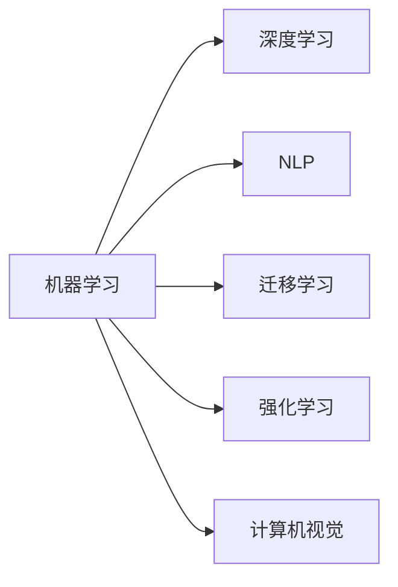
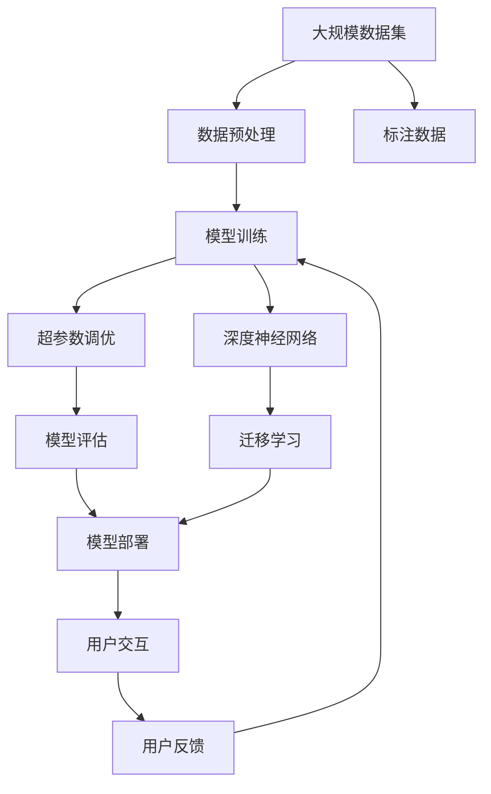

                 

## 1. 背景介绍

在科技领域，苹果（Apple）一直是全球公认的科技巨头，其产品在设计和用户体验上的卓越表现无人能敌。然而，苹果在人工智能（AI）技术上的布局和应用，在许多人的印象中并未占据显著位置。但实际上，苹果早在2017年便已发布了自己的首款AI应用——Siri。尽管如此，大多数人对苹果的AI应用可能仍感到陌生，甚至存在一些误解。本文将为您深入解读苹果AI应用背后的技术和理念，以及为何苹果能在AI领域取得如此成功。

## 2. 核心概念与联系

### 2.1 核心概念概述

为了更好地理解苹果AI应用的开发背景，我们需要先弄清楚几个关键概念：

1. **机器学习与深度学习**：机器学习（Machine Learning）是人工智能的一个分支，它通过让机器学习数据来自动改进性能。深度学习（Deep Learning）是机器学习的一种特殊形式，通过多层次的神经网络模型来提取和分析复杂的数据结构。

2. **自然语言处理（NLP）**：自然语言处理是计算机科学、人工智能和语言学的交叉领域，旨在让机器能够理解、处理和生成人类语言。

3. **迁移学习（Transfer Learning）**：迁移学习是一种机器学习方法，利用已有模型的知识来加速新任务上的学习过程。

4. **强化学习（Reinforcement Learning）**：强化学习是一种通过试错来学习最优策略的机器学习方法。

5. **计算机视觉（CV）**：计算机视觉是使用计算机处理和分析图像、视频和其他视觉数据的科学。

### 2.2 概念间的关系

接下来，我们用一个Mermaid流程图来展示这些核心概念之间的关系：



这个流程图展示了机器学习如何在深度学习、自然语言处理、迁移学习、强化学习和计算机视觉等领域发挥作用。

### 2.3 核心概念的整体架构

此外，我们还可以用一个更综合的流程图来展示这些核心概念如何共同构建了苹果AI应用的开发架构：



这个流程图展示了苹果AI应用开发的全流程，从数据预处理、模型训练到用户交互。其中，大规模数据集和标注数据的收集与处理是开发的基础，深度神经网络模型的训练与评估是关键步骤，而迁移学习的应用和用户反馈的收集则有助于模型的持续优化和用户满意度的提升。

## 3. 核心算法原理 & 具体操作步骤

### 3.1 算法原理概述

苹果AI应用的开发主要基于深度学习技术，尤其是卷积神经网络（Convolutional Neural Networks，CNN）和循环神经网络（Recurrent Neural Networks，RNN）等模型。这些模型通过在大规模数据集上进行训练，学习到数据中的特征和模式，然后应用到特定的任务中，如图像识别、语音识别和自然语言处理等。

### 3.2 算法步骤详解

苹果AI应用的开发步骤大致包括以下几个关键环节：

1. **数据收集与预处理**：收集和处理大规模的图像、音频和文本数据，以便用于模型的训练。

2. **模型选择与训练**：根据具体任务选择合适的深度学习模型，并进行模型训练。

3. **超参数调优**：对模型中的超参数（如学习率、批量大小等）进行调优，以获得最佳的模型性能。

4. **模型评估与测试**：对训练好的模型进行评估和测试，确保其能够准确地处理实际数据。

5. **模型部署与优化**：将模型部署到实际应用中，并根据用户反馈进行持续优化。

### 3.3 算法优缺点

苹果AI应用的开发过程具有以下优点：

1. **高效的数据处理能力**：苹果拥有大量自有数据，能够在大规模数据集上进行训练，从而提高模型的准确性和泛化能力。

2. **先进的深度学习技术**：苹果在深度学习领域投入大量资源，开发了高性能的深度学习框架和硬件设备。

3. **广泛的业务应用场景**：苹果的AI应用覆盖了多个业务领域，如产品推荐、语音识别、图像识别等。

4. **持续的优化与迭代**：苹果的AI应用能够根据用户反馈进行持续优化和迭代，提升用户体验。

然而，这些开发过程也存在一些缺点：

1. **数据隐私问题**：大规模数据集的收集和处理可能涉及到用户的隐私数据，如何保护用户隐私成为一大挑战。

2. **模型复杂度高**：深度学习模型通常具有很高的计算复杂度，对硬件资源的需求较高。

3. **高昂的开发成本**：深度学习模型的开发和优化需要大量的时间和资金投入，对于中小企业可能难以承担。

4. **模型泛化能力有限**：深度学习模型在特定任务上表现优异，但在通用性、泛化能力方面仍有所欠缺。

### 3.4 算法应用领域

苹果的AI应用主要应用于以下几个领域：

1. **产品推荐系统**：通过分析用户行为数据，为苹果商店中的产品推荐提供支持。

2. **语音识别与Siri**：利用自然语言处理技术，使Siri能够理解和响应用户的语音指令。

3. **图像识别**：通过计算机视觉技术，对照片和视频进行识别和标注。

4. **自然语言处理**：利用深度学习技术，实现文本分析和理解。

5. **自动驾驶**：利用计算机视觉和深度学习技术，开发自动驾驶系统。

6. **健康与健身**：通过分析用户数据，提供健康和健身建议。

## 4. 数学模型和公式 & 详细讲解 & 举例说明

### 4.1 数学模型构建

苹果AI应用的开发涉及多种数学模型和算法。下面以卷积神经网络为例，介绍其主要组成部分：

1. **卷积层（Convolutional Layer）**：卷积层通过卷积操作提取输入数据的特征。

2. **池化层（Pooling Layer）**：池化层通过降采样操作减少特征图的大小。

3. **全连接层（Fully Connected Layer）**：全连接层将卷积层的输出映射到最终的输出结果。

### 4.2 公式推导过程

卷积神经网络的数学模型可以表示为：

$$
y = h(Wx + b)
$$

其中，$y$ 表示输出，$h$ 表示激活函数（如ReLU），$W$ 表示权重矩阵，$x$ 表示输入，$b$ 表示偏置项。

卷积操作的数学公式为：

$$
f(x) = g(\sum_{i=0}^{n-1}w_i * x_i + b)
$$

其中，$w_i$ 表示卷积核（Filter），$x_i$ 表示输入数据的特征图，$g$ 表示激活函数。

### 4.3 案例分析与讲解

以Siri的语音识别为例，我们可以用卷积神经网络来处理音频信号，提取出语音特征，并将其转化为文本形式。在训练过程中，通过大量语音数据进行反向传播，优化模型参数，使模型能够准确地将语音转化为文本。

## 5. 项目实践：代码实例和详细解释说明

### 5.1 开发环境搭建

在搭建开发环境时，我们需要安装Python、TensorFlow或PyTorch等深度学习框架，以及一些必要的工具库。以下是一个基本的开发环境搭建步骤：

1. **安装Python**：选择适合自己系统的Python版本（如Python 3.6或更高），并确保安装过程中未出现错误。

2. **安装TensorFlow或PyTorch**：根据需求选择TensorFlow或PyTorch，并按照官方文档进行安装。

3. **安装必要的库**：安装numpy、scikit-learn、matplotlib等常用库，以便于数据处理和可视化。

4. **安装数据处理工具**：安装pandas、scrapy等工具，以便于数据收集和预处理。

5. **安装可视化工具**：安装matplotlib、seaborn等工具，以便于模型训练过程中的可视化。

### 5.2 源代码详细实现

以下是一个简单的图像分类示例代码，用于训练一个基本的卷积神经网络：

```python
import tensorflow as tf
from tensorflow import keras

# 加载数据集
(x_train, y_train), (x_test, y_test) = keras.datasets.mnist.load_data()

# 数据预处理
x_train = x_train / 255.0
x_test = x_test / 255.0

# 定义模型
model = keras.Sequential([
    keras.layers.Conv2D(32, (3,3), activation='relu', input_shape=(28, 28, 1)),
    keras.layers.MaxPooling2D((2,2)),
    keras.layers.Flatten(),
    keras.layers.Dense(10, activation='softmax')
])

# 编译模型
model.compile(optimizer='adam',
              loss='sparse_categorical_crossentropy',
              metrics=['accuracy'])

# 训练模型
model.fit(x_train, y_train, epochs=10, validation_data=(x_test, y_test))
```

### 5.3 代码解读与分析

在上述代码中，我们首先加载了MNIST手写数字数据集，并对数据进行了预处理。然后，定义了一个基本的卷积神经网络模型，包括卷积层、池化层和全连接层。最后，编译模型并开始训练。

### 5.4 运行结果展示

训练完成后，我们可以使用以下代码进行测试：

```python
test_loss, test_acc = model.evaluate(x_test, y_test)
print('Test accuracy:', test_acc)
```

运行结果将显示测试集上的准确率。

## 6. 实际应用场景

### 6.1 产品推荐系统

苹果的产品推荐系统通过分析用户的行为数据（如浏览记录、购买历史等），推荐个性化的产品。例如，如果用户在苹果商店中浏览了iPhone，系统可能会推荐其他相关的产品，如配件或相关配件。

### 6.2 语音识别与Siri

Siri是苹果的虚拟助手，通过自然语言处理技术，可以理解和响应用户的语音指令。Siri可以执行各种任务，如设定闹钟、发送信息、播放音乐等。

### 6.3 图像识别

苹果的图像识别技术可以识别照片和视频中的物体和场景，并进行标注。例如，当用户拍照时，系统可以自动识别照片中的物体，并提示用户。

### 6.4 自然语言处理

苹果的自然语言处理技术可以分析和理解文本，例如，当用户在Siri中输入文本时，系统可以将其转换为语音指令并执行相应的操作。

## 7. 工具和资源推荐

### 7.1 学习资源推荐

1. **TensorFlow官方文档**：TensorFlow提供了详细的教程和文档，涵盖了从基础到高级的各种主题。

2. **PyTorch官方文档**：PyTorch的文档也很全面，包括教程、API文档和案例研究。

3. **《深度学习》（Ian Goodfellow等）**：这本书是深度学习的经典教材，涵盖了深度学习的理论和实践。

4. **《TensorFlow实战》（Qi Lu）**：这本书提供了TensorFlow的实战案例和实践经验。

5. **《动手学深度学习》（李沐等）**：这是一本非常好的入门教材，适合初学者学习。

### 7.2 开发工具推荐

1. **Jupyter Notebook**：一个免费的开源交互式编程环境，适合进行数据处理和模型训练。

2. **PyCharm**：一个强大的Python IDE，提供了丰富的开发工具和功能。

3. **Google Colab**：一个免费的在线Jupyter Notebook环境，适合进行大规模数据处理和模型训练。

4. **Keras**：一个高级深度学习API，提供了简单易用的接口。

### 7.3 相关论文推荐

1. **《ImageNet分类与卷积神经网络架构》（Alex Krizhevsky等）**：介绍了卷积神经网络的经典结构。

2. **《语言模型的长短期记忆》（Yoshua Bengio等）**：介绍了循环神经网络在语言处理中的应用。

3. **《自然语言处理的深度学习框架》（Yann LeCun等）**：介绍了深度学习在自然语言处理中的应用。

## 8. 总结：未来发展趋势与挑战

### 8.1 研究成果总结

苹果在AI应用的开发中，采用了先进的深度学习技术和数据处理能力，取得了显著的成果。未来，苹果将在这方面的研究继续深入，并推出更多创新产品。

### 8.2 未来发展趋势

1. **更加智能的语音助手**：未来的Siri将更加智能，能够理解和执行更加复杂的语音指令。

2. **更精准的产品推荐**：产品推荐系统将更加精准，能够更好地预测用户的兴趣和需求。

3. **更先进的图像识别**：图像识别技术将更加准确，能够识别更多种类和场景的物体。

4. **更强大的自然语言处理**：自然语言处理技术将更加强大，能够更好地理解文本，并提供更准确的回答。

5. **更高效的计算架构**：苹果将推出更高效的计算架构，以支持大规模深度学习模型的训练和推理。

### 8.3 面临的挑战

1. **数据隐私和安全**：大规模数据集的收集和处理可能涉及到用户隐私数据，如何保护用户隐私成为一大挑战。

2. **计算资源限制**：深度学习模型通常具有很高的计算复杂度，对硬件资源的需求较高，如何优化模型和计算架构是一个挑战。

3. **模型泛化能力**：深度学习模型在特定任务上表现优异，但在通用性、泛化能力方面仍有所欠缺，如何提升模型的泛化能力是一个挑战。

4. **算法复杂度**：深度学习算法复杂度高，开发和优化需要大量时间和资源，如何降低算法复杂度是一个挑战。

### 8.4 研究展望

未来，苹果将继续在AI应用的开发中投入大量资源，推动技术的不断进步。同时，苹果也将积极应对各种挑战，不断优化和改进其产品和服务。

## 9. 附录：常见问题与解答

**Q1: 苹果是如何收集和处理数据的？**

A: 苹果通过各种渠道收集数据，如用户的使用数据、设备传感器数据、App Store的用户评价等。数据处理方面，苹果使用了先进的数据清洗和预处理技术，确保数据的准确性和完整性。

**Q2: 苹果的AI应用是否侵犯用户隐私？**

A: 苹果非常重视用户隐私保护，采取了多项措施来保护用户数据。例如，苹果要求开发者使用严格的加密措施，对用户数据进行保护。

**Q3: 苹果在AI领域的研究和应用有哪些？**

A: 苹果在AI领域的研究和应用涵盖了多个领域，如产品推荐、语音识别、图像识别、自然语言处理等。其中，Siri是苹果最著名的AI应用。

**Q4: 苹果的AI应用开发过程中有哪些难点？**

A: 苹果的AI应用开发过程中面临着数据隐私、计算资源限制、模型泛化能力不足等挑战。为此，苹果投入了大量资源进行技术研发和优化。

**Q5: 苹果未来的AI应用有哪些创新点？**

A: 苹果未来的AI应用将更加智能、精准和高效。例如，未来的Siri将能够更好地理解和执行复杂指令，产品推荐系统将更加精准，图像识别技术将更加准确等。

---

作者：禅与计算机程序设计艺术 / Zen and the Art of Computer Programming

