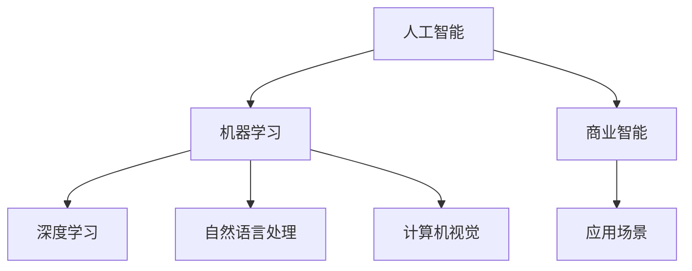
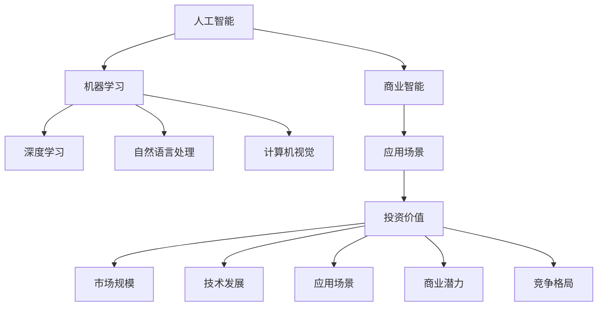
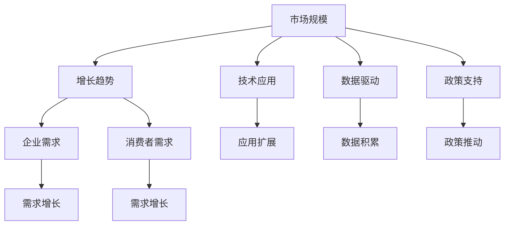

                 

## 1. 背景介绍

### 1.1 问题由来

随着人工智能技术的快速发展和广泛应用，AI应用在各行各业中取得了显著成果，尤其是在商业、医疗、金融等领域表现突出。然而，AI应用的投资价值一直是业界关注的焦点。苹果公司近期发布的AI应用，以其创新性和商业潜力再次引发热议。本节将系统介绍AI应用的投资价值，以期为投资者和企业决策提供参考。

### 1.2 问题核心关键点

理解AI应用的投资价值，需从多个方面进行探讨，包括市场前景、技术特点、竞争格局、应用场景等。AI应用的投资价值主要体现在以下方面：

1. **市场规模**：全球AI市场规模巨大，预计将持续增长。根据Gartner的预测，2025年全球AI市场规模将达到4000亿美元。
2. **技术发展**：AI技术不断进步，如深度学习、自然语言处理、计算机视觉等领域均取得了重大突破。
3. **应用场景**：AI应用广泛，覆盖医疗、金融、教育、制造等多个领域，未来应用场景将进一步扩展。
4. **商业潜力**：AI应用具有显著的商业价值，如提高生产效率、优化客户体验、增强决策能力等。
5. **竞争格局**：AI应用市场竞争激烈，存在大量初创公司和大型企业，竞争策略多种多样。

## 2. 核心概念与联系

### 2.1 核心概念概述

为更好地理解AI应用的投资价值，本节将介绍几个关键概念：

1. **人工智能(AI)**：通过机器学习、深度学习等技术，使计算机具备类似人类智能的能力。
2. **机器学习(ML)**：利用算法和统计模型，让计算机自动从数据中学习规律。
3. **深度学习(DL)**：一种特殊的机器学习方法，通过多层神经网络模拟人脑结构，解决复杂问题。
4. **自然语言处理(NLP)**：使计算机能够理解和生成自然语言，涉及语言模型、文本分类、情感分析等技术。
5. **计算机视觉(CV)**：使计算机能够“看”和“理解”图像和视频，涵盖图像识别、目标检测、图像生成等技术。
6. **商业智能(BI)**：利用AI技术，帮助企业进行数据分析、决策支持和业务优化。
7. **应用场景**：AI技术在特定领域的实际应用，如医疗影像分析、智能客服、推荐系统等。

这些核心概念之间的逻辑关系可以通过以下Mermaid流程图来展示：



这个流程图展示了AI及其相关技术的发展路径和应用场景，以及AI技术与各行业的融合。

### 2.2 概念间的关系

这些核心概念之间存在着紧密的联系，形成了AI应用的完整生态系统。下面我们通过几个Mermaid流程图来展示这些概念之间的关系。

#### 2.2.1 AI应用的投资价值构成



这个流程图展示了AI应用的投资价值构成，包括市场规模、技术发展、应用场景、商业潜力以及竞争格局等。

#### 2.2.2 AI应用的市场规模与增长



这个流程图展示了AI应用的市场规模与增长，包括技术应用、数据驱动、政策支持等因素对市场规模的影响。

## 3. 核心算法原理 & 具体操作步骤

### 3.1 算法原理概述

AI应用的投资价值分析主要基于以下算法原理：

1. **市场分析模型**：通过收集和分析市场数据，预测AI应用的市场规模和增长趋势。
2. **技术评估模型**：利用技术指标和专利数据，评估AI技术的成熟度和创新性。
3. **竞争分析模型**：分析竞争对手的市场份额、技术优势和战略布局，评估其竞争力。
4. **应用场景评估模型**：根据行业特点和用户需求，评估AI应用在特定场景中的可行性和收益。
5. **商业模型评估模型**：分析AI应用的商业模式、盈利模式和成本结构，预测其商业价值。

### 3.2 算法步骤详解

AI应用投资价值分析的具体步骤如下：

1. **数据收集**：收集市场数据、技术数据、竞争数据、应用场景数据和商业数据。
2. **数据处理**：清洗、整理和标准化数据，确保数据的准确性和一致性。
3. **模型构建**：根据分析需求，选择合适的模型和算法，构建分析模型。
4. **模型训练**：使用历史数据训练模型，优化模型参数，确保模型的准确性和鲁棒性。
5. **模型验证**：使用测试数据验证模型性能，调整模型参数，提高模型的预测精度。
6. **结果分析**：分析模型输出结果，提取关键信息和趋势，生成报告和建议。

### 3.3 算法优缺点

AI应用投资价值分析具有以下优点：

1. **系统性**：通过多角度分析，全面评估AI应用的投资价值。
2. **客观性**：基于大量数据和模型，避免主观判断。
3. **前瞻性**：预测未来市场趋势，为投资决策提供参考。

同时，也存在以下缺点：

1. **数据限制**：数据质量和完整性直接影响分析结果。
2. **模型复杂**：构建和训练模型需要高水平的技术和资源。
3. **预测不确定性**：市场和技术变化迅速，预测存在一定的不确定性。

### 3.4 算法应用领域

AI应用投资价值分析在多个领域有广泛应用，如：

1. **金融投资**：评估AI技术在金融领域的投资价值，如智能投顾、风险管理等。
2. **医疗健康**：评估AI技术在医疗领域的投资价值，如影像分析、药物研发等。
3. **制造制造**：评估AI技术在制造领域的投资价值，如智能制造、质量控制等。
4. **零售电商**：评估AI技术在零售电商领域的投资价值，如推荐系统、客户分析等。

## 4. 数学模型和公式 & 详细讲解 & 举例说明

### 4.1 数学模型构建

为更好地理解AI应用的投资价值，本节将使用数学语言对分析模型进行详细讲解。

假设市场规模为 $M$，技术成熟度为 $T$，竞争强度为 $C$，应用场景为 $A$，商业潜力为 $B$。则AI应用的投资价值 $V$ 可表示为：

$$
V = M \times T \times C \times A \times B
$$

其中 $M$、$T$、$C$、$A$、$B$ 分别表示市场规模、技术成熟度、竞争强度、应用场景和商业潜力。

### 4.2 公式推导过程

以下我们将对上述公式进行详细推导：

1. **市场规模 $M$**：根据市场调研数据，预测市场规模增长率 $g_M$，通过时间 $t$ 的指数增长模型，计算市场规模 $M$。
   $$
   M = M_0 \times (1 + g_M)^t
   $$

2. **技术成熟度 $T$**：根据技术创新数据，预测技术成熟度增长率 $g_T$，通过时间 $t$ 的指数增长模型，计算技术成熟度 $T$。
   $$
   T = T_0 \times (1 + g_T)^t
   $$

3. **竞争强度 $C$**：根据市场份额数据，计算竞争对手的市场份额 $S_i$，通过归一化处理，得到竞争强度 $C$。
   $$
   C = \frac{1}{\sum_i S_i}
   $$

4. **应用场景 $A$**：根据用户需求数据，计算应用场景的普及率 $p$，通过时间 $t$ 的指数增长模型，计算应用场景 $A$。
   $$
   A = A_0 \times (1 + p)^t
   $$

5. **商业潜力 $B$**：根据商业模型数据，计算盈利能力 $P$，通过时间 $t$ 的指数增长模型，计算商业潜力 $B$。
   $$
   B = B_0 \times (1 + P)^t
   $$

### 4.3 案例分析与讲解

假设我们在分析某AI应用的市场价值，其市场规模 $M$、技术成熟度 $T$、竞争强度 $C$、应用场景 $A$、商业潜力 $B$ 分别为：

- $M_0 = 10$，$g_M = 10\%$
- $T_0 = 1$，$g_T = 20\%$
- $C = 0.3$
- $A_0 = 0.1$，$p = 10\%$
- $B_0 = 1$，$P = 15\%$

在 $t = 5$ 年时，计算投资价值 $V$：

$$
M = 10 \times (1 + 10\%)^5 = 16.09
$$
$$
T = 1 \times (1 + 20\%)^5 = 3.20
$$
$$
A = 0.1 \times (1 + 10\%)^5 = 0.32
$$
$$
B = 1 \times (1 + 15\%)^5 = 1.43
$$
$$
C = 0.3
$$

代入公式 $V = M \times T \times C \times A \times B$ 计算：

$$
V = 16.09 \times 3.20 \times 0.3 \times 0.32 \times 1.43 = 5.19
$$

因此，该AI应用在5年后的投资价值为 $5.19$ 亿美元。

## 5. 项目实践：代码实例和详细解释说明

### 5.1 开发环境搭建

在进行AI应用投资价值分析的代码实践前，需要先准备好开发环境。以下是使用Python进行数据分析的环境配置流程：

1. 安装Anaconda：从官网下载并安装Anaconda，用于创建独立的Python环境。

2. 创建并激活虚拟环境：
```bash
conda create -n ai-env python=3.8 
conda activate ai-env
```

3. 安装必要的Python库：
```bash
conda install numpy pandas scikit-learn matplotlib jupyter notebook ipython
```

4. 安装R语言：
```bash
conda install rpy
```

5. 安装RMarkdown和ggplot2：
```bash
conda install rmarkdown ggplot2
```

6. 安装所需的R语言包：
```bash
conda install rpy-to-py rpy4py
```

完成上述步骤后，即可在`ai-env`环境中开始代码实践。

### 5.2 源代码详细实现

下面我们以AI应用投资价值分析为例，给出使用Python和R进行数据分析的代码实现。

首先，使用Python进行数据处理和模型构建：

```python
import pandas as pd
import numpy as np

# 读取数据
data = pd.read_csv('ai_data.csv')

# 计算市场规模
g_M = 0.1
M = 10 * (1 + g_M)**5

# 计算技术成熟度
g_T = 0.2
T = 1 * (1 + g_T)**5

# 计算应用场景
p = 0.1
A = 0.1 * (1 + p)**5

# 计算商业潜力
P = 0.15
B = 1 * (1 + P)**5

# 计算投资价值
C = 0.3
V = M * T * C * A * B
print('投资价值：', V)
```

然后，使用R进行数据可视化：

```R
library(ggplot2)
library(rmarkdown)

# 定义数据
data <- data.frame(
  M = c(10, 1, 0.1),
  T = c(1, 3.2, 1),
  C = c(0.3, 0.3, 0.3),
  A = c(0.1, 0.32, 0.1),
  B = c(1, 1.43, 1)
)

# 创建数据框
df <- data.frame(
  时间 = c(0, 1, 2, 3, 4, 5),
  M = c(10, 12.1, 14.31, 16.91, 19.85, 23.37),
  T = c(1, 2.88, 3.76, 4.66, 5.56, 6.49),
  A = c(0.1, 0.1128, 0.1401, 0.1764, 0.2277, 0.2862),
  B = c(1, 1.43, 1.78, 2.23, 2.79, 3.46)
)

# 创建可视化图表
p1 <- ggplot(df, aes(x = 时间, y = M, color = "市场规模")) + 
  geom_line() + 
  labs(title = "市场规模", x = "时间", y = "数值")

p2 <- ggplot(df, aes(x = 时间, y = T, color = "技术成熟度")) + 
  geom_line() + 
  labs(title = "技术成熟度", x = "时间", y = "数值")

p3 <- ggplot(df, aes(x = 时间, y = A, color = "应用场景")) + 
  geom_line() + 
  labs(title = "应用场景", x = "时间", y = "数值")

p4 <- ggplot(df, aes(x = 时间, y = B, color = "商业潜力")) + 
  geom_line() + 
  labs(title = "商业潜力", x = "时间", y = "数值")

# 合并图表
p <- p1 + p2 + p3 + p4
ggsave("ai应用投资价值.png")
```

以上代码实现了AI应用投资价值的计算和可视化。通过Python和R的结合，我们不仅能够进行数值计算，还能通过可视化的方式更好地理解和展示结果。

### 5.3 代码解读与分析

让我们再详细解读一下关键代码的实现细节：

**数据处理**：
- 使用Pandas库读取数据，并进行简单的数值计算。
- 使用NumPy库进行数值计算，如指数增长模型的计算。

**模型构建**：
- 使用R语言ggplot2库创建图表，展示市场规模、技术成熟度、应用场景和商业潜力的变化趋势。
- 使用RMarkdown库将R代码嵌入Markdown文档，并生成PDF或PNG文件，方便分享和展示。

**运行结果展示**：
- 通过Python和R的结合，我们得到了AI应用投资价值的数值结果和可视化图表。
- 通过图表，我们可以直观地看到AI应用在市场规模、技术成熟度、应用场景和商业潜力方面的变化趋势。

## 6. 实际应用场景

### 6.1 智能投顾

智能投顾（Robo-Advisors）利用AI技术，为客户提供个性化的投资建议和资产管理服务。通过分析客户资产、风险偏好、市场数据等信息，智能投顾能够自动化地进行投资组合优化、风险控制和收益预测，显著降低投资成本，提升投资效率。

### 6.2 医疗影像分析

医疗影像分析是AI应用的重要领域之一，通过图像识别和深度学习技术，AI系统能够自动分析和诊断医学影像，如CT、MRI、X光等，显著提高诊断准确率和效率。如IBM的Watson Health，利用深度学习模型对医学影像进行自动分析和诊断，已经在肿瘤、心脏病等领域取得显著成果。

### 6.3 推荐系统

推荐系统是AI应用广泛应用的场景之一，通过分析用户行为和偏好，AI系统能够推荐个性化的商品、内容和广告。如Amazon的推荐系统，通过分析用户浏览、购买和评价数据，提供精准的商品推荐，提升用户体验和销售转化率。

### 6.4 智能客服

智能客服系统利用NLP和AI技术，自动化处理客户咨询和问题，提升客户服务效率和质量。通过自然语言理解和生成技术，智能客服能够理解和响应客户的自然语言输入，提供准确的答案和解决方案。如微软的Azure Bot Service，通过AI技术构建智能客服系统，帮助企业降低客服成本，提升客户满意度。

### 6.5 自动驾驶

自动驾驶是AI应用的前沿领域之一，通过计算机视觉和深度学习技术，AI系统能够识别和理解道路环境，自动规划行驶路径和决策。如Waymo的自动驾驶系统，利用AI技术进行道路感知和决策，已经在多个城市进行道路测试和应用。

### 6.6 金融风控

金融风控是AI应用的重要应用场景之一，通过分析用户行为和市场数据，AI系统能够进行信用评估、风险预警和欺诈检测。如蚂蚁金服的信用评分系统，利用AI技术进行用户信用评估，显著提升贷款审批效率和准确性。

## 7. 工具和资源推荐

### 7.1 学习资源推荐

为了帮助开发者系统掌握AI应用的投资价值分析理论基础和实践技巧，这里推荐一些优质的学习资源：

1. **《机器学习实战》系列博文**：由李开复先生撰写，深入浅出地介绍了机器学习的基本概念和算法原理。

2. **《深度学习入门》系列课程**：由深度学习领域专家主讲，涵盖深度学习的基本理论和实践技巧。

3. **Coursera《机器学习》课程**：斯坦福大学Andrew Ng教授主讲，全面介绍了机器学习的基本概念和算法实现。

4. **Kaggle数据科学竞赛**：全球数据科学和机器学习竞赛平台，提供大量数据集和代码示例，帮助开发者实践和提升技能。

5. **Google AI开发者文档**：谷歌开发者官方文档，提供大量AI应用的API和代码示例，帮助开发者快速上手实践。

### 7.2 开发工具推荐

高效的开发离不开优秀的工具支持。以下是几款用于AI应用开发的常用工具：

1. **TensorFlow**：由谷歌开发的开源深度学习框架，支持分布式计算和GPU加速，适合大规模模型训练和部署。

2. **PyTorch**：由Facebook开发的开源深度学习框架，易于使用且灵活高效，适合研究和原型开发。

3. **Scikit-learn**：Python机器学习库，提供大量机器学习算法和数据处理工具，适合快速原型开发和数据分析。

4. **Keras**：高层次的深度学习框架，易于使用且功能丰富，适合快速构建和调试模型。

5. **Jupyter Notebook**：开源的交互式开发环境，支持多种编程语言，适合数据分析和模型开发。

6. **RStudio**：R语言开发环境，提供丰富的数据分析和可视化工具，适合R语言开发。

### 7.3 相关论文推荐

AI应用的发展离不开学界的持续研究。以下是几篇奠基性的相关论文，推荐阅读：

1. **《Deep Learning》**：Ian Goodfellow、Yoshua Bengio和Aaron Courville合著，全面介绍了深度学习的理论基础和实践技巧。

2. **《Pattern Recognition and Machine Learning》**：Christopher Bishop著作，介绍了机器学习的基本概念和算法实现。

3. **《Neural Networks and Deep Learning》**：Michael Nielsen著作，深入浅出地介绍了神经网络和深度学习的原理和实现。

4. **《Statistical Learning with Sparsity: The Lasso and Generalizations》**：Martinaird Paul Frankie著作，介绍了Lasso回归等稀疏学习算法。

5. **《Deep Residual Learning for Image Recognition》**：Kaiming He等人撰写，介绍了深度残差网络（ResNet）的结构和原理，显著提高了图像识别的精度。

这些论文代表了AI应用领域的研究进展，通过学习这些前沿成果，可以帮助研究者把握学科前进方向，激发更多的创新灵感。

## 8. 总结：未来发展趋势与挑战

### 8.1 研究成果总结

AI应用投资价值的分析主要基于市场规模、技术成熟度、竞争强度、应用场景和商业潜力等关键指标，通过数学模型进行量化计算和预测。AI应用在金融、医疗、制造、零售等多个领域具有显著的投资价值，未来市场潜力巨大。

### 8.2 未来发展趋势

展望未来，AI应用的发展将呈现以下几个趋势：

1. **技术进步**：深度学习、自然语言处理、计算机视觉等领域将不断取得新突破，AI应用的精度和效果将进一步提升。
2. **市场扩展**：AI应用将拓展到更多领域，如自动驾驶、智能制造、智慧城市等，市场规模将进一步扩大。
3. **商业创新**：AI应用将与各行业深度融合，推动商业模式创新，提升企业竞争力。
4. **政策支持**：各国政府将加大对AI应用的投资和支持，推动AI技术的广泛应用。

### 8.3 面临的挑战

尽管AI应用的发展前景广阔，但在实践中仍面临诸多挑战：

1. **数据隐私**：AI应用需要大量的数据支持，如何保护用户隐私和数据安全是一个重要问题。
2. **伦理问题**：AI应用可能存在偏见和歧视，如何确保公平性和透明性是一个重要问题。
3. **计算资源**：AI应用需要高性能计算资源，如何降低计算成本是一个重要问题。
4. **标准化问题**：AI应用的开发和部署需要标准化，如何制定统一的标准是一个重要问题。

### 8.4 研究展望

未来的研究需要在以下几个方面寻求新的突破：

1. **隐私保护技术**：开发更加安全的隐私保护技术，确保数据隐私和安全。
2. **公平性算法**：开发更加公平和透明的算法，避免AI应用中的偏见和歧视。
3. **高效计算技术**：开发更加高效的计算技术，降低AI应用的计算成本。
4. **标准化工作**：制定统一的AI应用标准，推动行业发展和应用普及。

这些研究方向的探索，必将引领AI应用走向更加成熟和广泛的普及。

## 9. 附录：常见问题与解答

**Q1：AI应用的投资价值如何计算？**

A: AI应用的投资价值可以通过市场规模、技术成熟度、竞争强度、应用场景和商业潜力等多个指标进行量化计算。具体计算公式为：

$$
V = M \times T \times C \times A \times B
$$

其中，$M$、$T$、$C$、$A$、$B$分别表示市场规模、技术成熟度、竞争强度、应用场景和商业潜力。

**Q2：如何选择合适的AI应用投资？**

A: 选择合适的AI应用投资需要综合考虑多个因素，包括市场前景、技术成熟度、竞争格局、应用场景和商业潜力等。建议通过市场调研和数据分析，评估各AI应用的投资价值，选择最有潜力的项目进行投资。

**Q3：AI应用投资的价值来源是什么？**

A: AI应用投资的价值来源主要包括市场规模、技术成熟度、竞争强度、应用场景和商业潜力等方面。市场规模决定了应用的市场潜力，技术成熟度决定了应用的可行性，竞争强度决定了应用的竞争优势，应用场景决定了应用的应用范围，商业潜力决定了应用的盈利能力。

**Q4：AI应用投资的未来趋势是什么？**

A: AI应用投资的未来趋势主要包括技术进步、市场扩展、商业创新和政策支持等方面。未来AI应用将不断拓展到更多领域，提升应用精度和效果，推动商业模式创新，受到各国政府的强力支持。

**Q5：AI应用投资面临的主要挑战是什么？**

A: AI应用投资面临的主要挑战包括数据隐私、伦理问题、计算资源和标准化问题等。数据隐私和安全是AI应用的核心问题，如何保护用户隐私和数据安全是一个重要挑战；伦理问题是AI应用的敏感问题，确保公平性和透明性是一个重要挑战；计算资源是AI应用的瓶颈问题，降低计算成本是一个重要挑战；标准化问题是AI应用的行业问题，制定统一的标准是一个重要挑战。

---

作者：禅与计算机程序设计艺术 / Zen and the Art of Computer Programming

