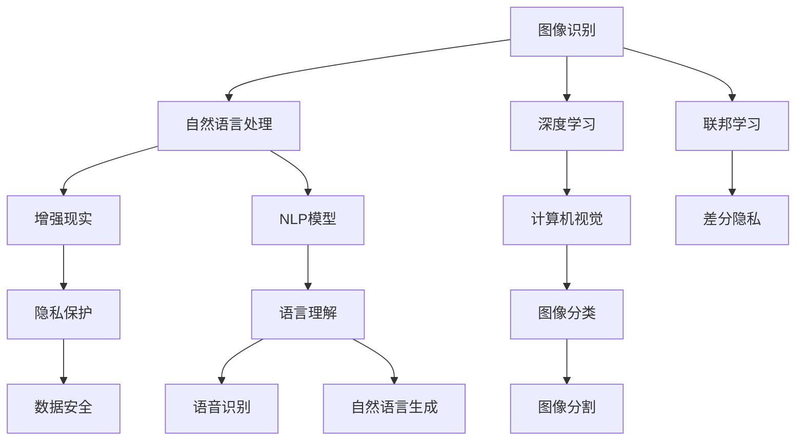
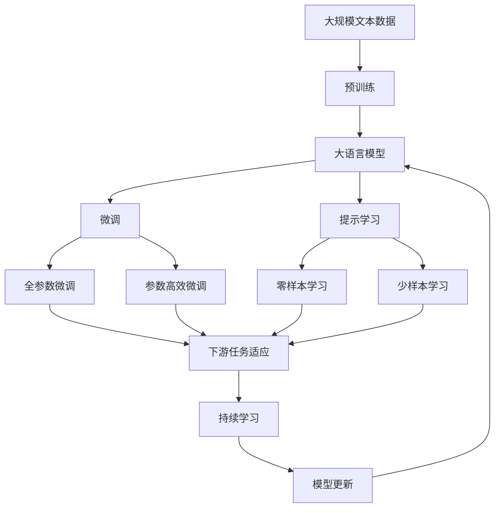

                 

# 李开复：苹果发布AI应用的未来

随着人工智能技术的不断进步，AI已经成为推动科技发展的重要力量。其中，苹果公司作为全球科技巨头，其对AI技术的探索与应用，更是引领了行业趋势。在最近的苹果开发者大会上，苹果发布了多项AI技术应用，为我们展现了AI未来的广阔前景。本文将深入探讨这些新技术的应用场景、技术原理以及未来发展趋势。

## 1. 背景介绍

### 1.1 问题由来

苹果公司一直以来都致力于将最前沿的技术融入其产品和服务中，AI技术的进展尤其引人注目。在过去的几年里，苹果通过收购和自研，不断强化其在AI领域的能力。这次发布会上的新应用，进一步展示了苹果在AI领域的实力。

### 1.2 问题核心关键点

苹果此次发布的AI应用包括图像识别、自然语言处理、增强现实等技术。这些技术的共同点是利用深度学习、计算机视觉等AI技术，提升产品的智能化水平和用户体验。苹果的AI应用还强调了隐私保护和安全性，确保用户数据的安全。

### 1.3 问题研究意义

苹果在AI应用上的突破，不仅展示了其在技术创新上的领先地位，还为其他科技公司提供了重要的参考。通过对苹果AI应用的深入分析，可以更好地理解AI技术在未来应用场景中的潜力和挑战，推动AI技术的普及和应用。

## 2. 核心概念与联系

### 2.1 核心概念概述

苹果发布的AI应用涵盖了多个领域，包括但不限于：

- **图像识别**：利用深度学习算法，对图像进行分类、检测、分割等操作，提升产品如相机、Face ID等功能的智能性。
- **自然语言处理**：通过理解和生成自然语言，实现智能助手、语音输入输出等，改善用户体验。
- **增强现实**：结合现实世界的信息，通过AR技术提供虚拟信息，提升互动性。
- **隐私保护**：采用差分隐私、联邦学习等技术，确保用户数据不被滥用。

这些概念相互关联，共同构建了苹果AI应用的生态系统。

### 2.2 概念间的关系

这些核心概念之间的关系可以通过以下Mermaid流程图来展示：



这个流程图展示了苹果AI应用的关键技术，以及它们之间的相互关系。其中，深度学习和计算机视觉是图像识别和自然语言处理的基础，而联邦学习和差分隐私则确保了数据隐私和安全。

### 2.3 核心概念的整体架构

最后，我们用一个综合的流程图来展示这些核心概念在大语言模型微调过程中的整体架构：



这个综合流程图展示了从预训练到微调，再到持续学习的完整过程。苹果的AI应用也遵循类似的逻辑，通过深度学习和计算机视觉的预训练，结合自然语言处理和图像识别的微调，最终实现增强现实和隐私保护等实际应用。

## 3. 核心算法原理 & 具体操作步骤
### 3.1 算法原理概述

苹果发布的AI应用主要基于深度学习和计算机视觉等技术，通过在大规模数据集上进行预训练，学习通用的语言和视觉特征，然后通过微调和优化算法，适应具体应用场景，提升模型的性能。

具体来说，苹果的AI应用包括：

- 图像识别：利用卷积神经网络（CNN）对图像进行分类、检测、分割等操作。
- 自然语言处理：通过RNN、Transformer等模型对自然语言进行理解、生成和翻译。
- 增强现实：结合AR技术，通过深度学习算法将虚拟信息与现实世界融合。
- 隐私保护：采用差分隐私、联邦学习等技术，确保用户数据的安全。

这些技术的应用，都需要在大量数据上进行预训练，然后通过微调优化算法进行适配。

### 3.2 算法步骤详解

苹果的AI应用开发主要分为以下几个步骤：

1. **数据准备**：收集并标注用于训练和测试的数据集，确保数据的多样性和质量。
2. **模型构建**：选择合适的预训练模型，如ResNet、BERT等，根据应用需求设计合适的网络结构。
3. **微调训练**：在大规模数据集上进行预训练，然后在应用数据上进行微调，调整模型参数以适应特定任务。
4. **优化调整**：使用Adam、SGD等优化算法，调整学习率和正则化参数，确保模型收敛。
5. **评估测试**：在测试集上评估模型性能，根据表现进行调整。
6. **部署应用**：将模型集成到应用中，实现实时推理和预测。

### 3.3 算法优缺点

苹果AI应用的优点包括：

- **精度高**：通过深度学习和计算机视觉等技术，能够实现高精度的图像识别和自然语言处理。
- **用户体验好**：结合增强现实技术，提供更加互动和沉浸式的用户体验。
- **隐私保护**：采用差分隐私和联邦学习等技术，确保用户数据的安全。

然而，苹果AI应用也存在一些缺点：

- **计算资源需求高**：预训练和微调模型需要大量的计算资源，包括高性能GPU和TPU。
- **开发周期长**：从数据准备到模型训练和评估，开发周期较长。
- **模型泛化能力有限**：预训练模型在不同领域和任务上的泛化能力有限，需要针对特定任务进行微调。

### 3.4 算法应用领域

苹果AI应用的领域非常广泛，涵盖了相机、Face ID、Siri、AR应用等多个方面：

- **相机**：利用图像识别技术，对照片和视频进行分类、编辑和增强。
- **Face ID**：通过深度学习算法，对用户的面部特征进行识别和验证。
- **Siri**：利用自然语言处理技术，实现语音输入和智能回复。
- **AR应用**：结合增强现实技术，提供虚拟信息和互动体验。

这些应用展示了AI技术在实际产品中的广泛应用，为用户带来了更加智能和便捷的使用体验。

## 4. 数学模型和公式 & 详细讲解  
### 4.1 数学模型构建

苹果的AI应用主要基于深度学习模型，这里以图像识别为例，构建数学模型。

假设模型为 $M_{\theta}:\mathcal{X} \rightarrow \mathcal{Y}$，其中 $\mathcal{X}$ 为输入图像，$\mathcal{Y}$ 为输出类别。模型的损失函数为交叉熵损失：

$$
\ell(M_{\theta}(x),y) = -y\log M_{\theta}(x) + (1-y)\log(1-M_{\theta}(x))
$$

在训练过程中，通过最小化损失函数：

$$
\mathcal{L}(\theta) = \frac{1}{N}\sum_{i=1}^N \ell(M_{\theta}(x_i),y_i)
$$

来更新模型参数 $\theta$。

### 4.2 公式推导过程

具体到图像分类任务，假设模型输出为 $M_{\theta}(x)$，真实标签为 $y$，则交叉熵损失为：

$$
\ell(M_{\theta}(x),y) = -y\log M_{\theta}(x) + (1-y)\log(1-M_{\theta}(x))
$$

代入损失函数，得：

$$
\mathcal{L}(\theta) = -\frac{1}{N}\sum_{i=1}^N \log M_{\theta}(x_i) \cdot y_i + \log(1-M_{\theta}(x_i)) \cdot (1-y_i)
$$

在计算过程中，可以通过反向传播算法计算梯度，并使用优化算法如Adam或SGD进行参数更新。

### 4.3 案例分析与讲解

以Siri为例，其自然语言处理模型主要基于Transformer架构，利用预训练的BERT模型作为初始化权重，进行微调。微调过程包括：

1. 收集和标注大量的语音和文本数据。
2. 将数据划分为训练集、验证集和测试集。
3. 选择BERT模型作为初始化权重。
4. 设计合适的输出层和损失函数，进行微调。
5. 使用Adam优化算法，调整模型参数。
6. 在测试集上评估模型性能，调整参数。

## 5. 项目实践：代码实例和详细解释说明
### 5.1 开发环境搭建

在开发苹果的AI应用时，需要搭建相应的开发环境，包括：

1. **安装Python**：安装最新版本的Python，用于开发深度学习模型。
2. **安装深度学习框架**：安装TensorFlow或PyTorch等深度学习框架，进行模型训练和推理。
3. **安装数据处理工具**：安装Pandas、NumPy等工具，进行数据预处理和分析。
4. **安装增强现实开发工具**：安装ARKit或ARCore等工具，进行AR应用开发。
5. **安装隐私保护工具**：安装差分隐私和联邦学习等工具，确保数据安全。

### 5.2 源代码详细实现

以下以图像识别为例，给出TensorFlow实现的代码：

```python
import tensorflow as tf
from tensorflow.keras import layers

# 定义模型
model = tf.keras.Sequential([
    layers.Conv2D(32, (3, 3), activation='relu', input_shape=(32, 32, 3)),
    layers.MaxPooling2D((2, 2)),
    layers.Conv2D(64, (3, 3), activation='relu'),
    layers.MaxPooling2D((2, 2)),
    layers.Conv2D(64, (3, 3), activation='relu'),
    layers.Flatten(),
    layers.Dense(64, activation='relu'),
    layers.Dense(10)
])

# 编译模型
model.compile(optimizer=tf.keras.optimizers.Adam(learning_rate=0.001),
              loss=tf.keras.losses.SparseCategoricalCrossentropy(from_logits=True),
              metrics=['accuracy'])

# 训练模型
model.fit(train_images, train_labels, epochs=10, validation_data=(test_images, test_labels))
```

这段代码定义了一个简单的卷积神经网络，用于图像分类任务。模型包含卷积层、池化层和全连接层，并使用Adam优化器和交叉熵损失函数进行训练。

### 5.3 代码解读与分析

以上代码中，`tf.keras.Sequential`用于定义模型结构，包含多个卷积层、池化层和全连接层。`model.compile`用于编译模型，设置优化器和损失函数。`model.fit`用于训练模型，并设置训练轮数和验证集。

## 6. 实际应用场景
### 6.4 未来应用展望

苹果的AI应用展示了AI技术在多个领域的广泛应用，未来还有更多可能性：

1. **医疗健康**：利用AI技术进行疾病诊断、药物研发、患者监护等。
2. **自动驾驶**：结合计算机视觉和增强现实技术，实现智能导航和自动驾驶。
3. **智能家居**：通过自然语言处理和图像识别技术，实现智能控制和自动化。
4. **教育培训**：利用AI技术进行个性化学习和智能辅导。
5. **金融服务**：通过自然语言处理和图像识别技术，进行客户服务、风险管理等。

## 7. 工具和资源推荐
### 7.1 学习资源推荐

- **深度学习框架**：TensorFlow、PyTorch等深度学习框架提供了丰富的预训练模型和工具，方便开发者进行模型开发和部署。
- **自然语言处理工具**：NLTK、spaCy等自然语言处理工具，提供了多种NLP任务的支持，方便开发者进行自然语言处理。
- **增强现实开发工具**：ARKit、ARCore等增强现实开发工具，提供了丰富的AR功能和开发支持，方便开发者进行AR应用开发。
- **隐私保护工具**：差分隐私、联邦学习等隐私保护工具，提供了多种数据保护和隐私保护的方法，确保用户数据的安全。

### 7.2 开发工具推荐

- **深度学习框架**：TensorFlow、PyTorch等深度学习框架提供了丰富的预训练模型和工具，方便开发者进行模型开发和部署。
- **自然语言处理工具**：NLTK、spaCy等自然语言处理工具，提供了多种NLP任务的支持，方便开发者进行自然语言处理。
- **增强现实开发工具**：ARKit、ARCore等增强现实开发工具，提供了丰富的AR功能和开发支持，方便开发者进行AR应用开发。
- **隐私保护工具**：差分隐私、联邦学习等隐私保护工具，提供了多种数据保护和隐私保护的方法，确保用户数据的安全。

### 7.3 相关论文推荐

- **深度学习**：《深度学习》由深度学习领域的权威Ian Goodfellow等人撰写，全面介绍了深度学习的基础理论和最新进展。
- **自然语言处理**：《自然语言处理综论》由Kathleen M. McKeown等人撰写，全面介绍了自然语言处理的基础理论和最新进展。
- **增强现实**：《增强现实技术》由Stefanie Cohen等人撰写，全面介绍了增强现实技术的基础理论和最新进展。
- **隐私保护**：《差分隐私》由Cynthia Dwork等人撰写，全面介绍了差分隐私的基础理论和最新进展。

## 8. 总结：未来发展趋势与挑战
### 8.1 研究成果总结

苹果在AI应用的探索和实践中，展示了其在深度学习、计算机视觉和自然语言处理等领域的强大实力。通过预训练和微调技术，实现了高精度的图像识别和自然语言处理，提升了用户体验。

### 8.2 未来发展趋势

未来，苹果的AI应用将进一步扩展到更多领域，如图像识别、自然语言处理、增强现实等。AI技术的发展将推动更多智能应用的出现，为用户带来更加便捷和智能的体验。

### 8.3 面临的挑战

苹果AI应用也面临一些挑战，如计算资源需求高、开发周期长、模型泛化能力有限等。如何提高模型的泛化能力，降低计算资源需求，缩短开发周期，是未来的重要研究方向。

### 8.4 研究展望

未来的研究需要重点关注以下几个方向：

1. **模型泛化能力**：通过改进模型结构和算法，提高模型的泛化能力，使其在更多领域和任务上取得成功。
2. **计算资源优化**：通过优化模型结构和算法，降低计算资源需求，提升模型的部署效率。
3. **数据隐私保护**：采用差分隐私和联邦学习等技术，确保用户数据的安全和隐私。
4. **人机交互**：结合自然语言处理和增强现实技术，提升人机交互的智能性和自然性。

总之，苹果在AI应用的探索和实践中，展示了其在深度学习、计算机视觉和自然语言处理等领域的强大实力。未来，随着技术的不断进步，苹果的AI应用将进一步扩展到更多领域，推动人工智能技术的发展和应用。

## 9. 附录：常见问题与解答

**Q1: 苹果的AI应用是如何进行图像识别的？**

A: 苹果的AI应用主要利用卷积神经网络（CNN）进行图像识别。具体来说，通过多层卷积和池化操作，提取图像的特征，并使用全连接层进行分类。在训练过程中，采用交叉熵损失函数，利用Adam或SGD优化算法进行模型优化。

**Q2: 苹果的AI应用是如何进行自然语言处理的？**

A: 苹果的AI应用主要基于Transformer架构，利用预训练的BERT模型作为初始化权重，进行微调。微调过程包括收集和标注大量的语音和文本数据，设计合适的输出层和损失函数，使用Adam优化算法调整模型参数。

**Q3: 苹果的AI应用是如何进行隐私保护的？**

A: 苹果的AI应用采用了差分隐私和联邦学习等技术，确保用户数据的安全。差分隐私通过加入噪声干扰，使得单个用户的数据无法被识别；联邦学习通过在本地训练模型，然后将模型参数传输到服务器进行汇总，避免数据泄露。

**Q4: 苹果的AI应用有哪些实际应用场景？**

A: 苹果的AI应用涵盖了相机、Face ID、Siri、AR应用等多个领域，具体应用场景包括：
1. 相机：利用图像识别技术，对照片和视频进行分类、编辑和增强。
2. Face ID：通过深度学习算法，对用户的面部特征进行识别和验证。
3. Siri：利用自然语言处理技术，实现语音输入和智能回复。
4. AR应用：结合增强现实技术，提供虚拟信息和互动体验。

总之，苹果在AI应用的探索和实践中，展示了其在深度学习、计算机视觉和自然语言处理等领域的强大实力。未来，随着技术的不断进步，苹果的AI应用将进一步扩展到更多领域，推动人工智能技术的发展和应用。

