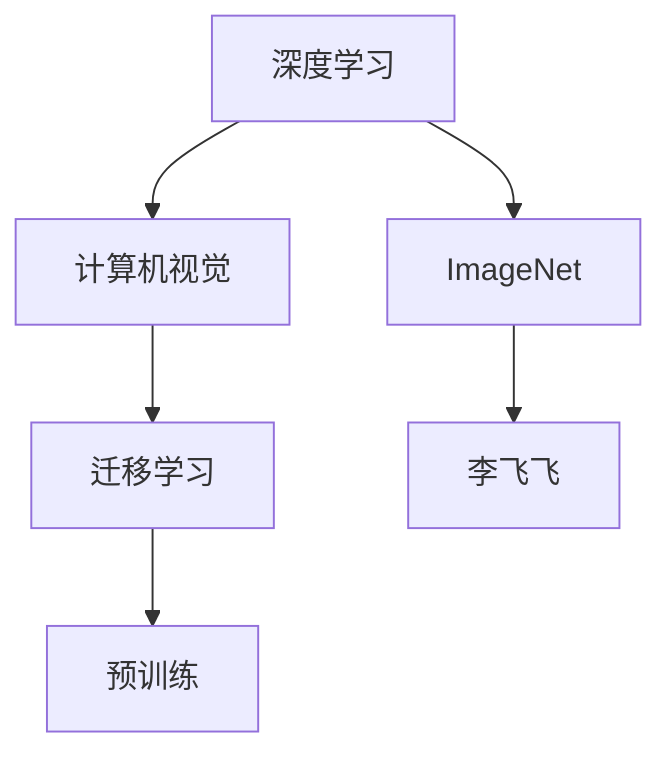
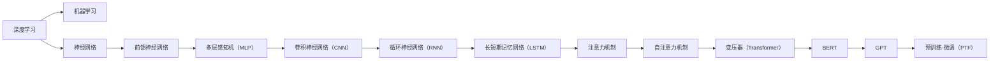
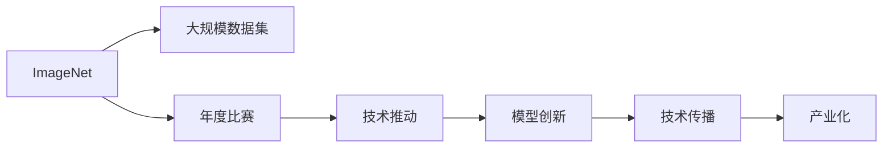
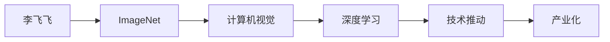
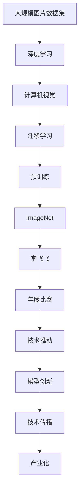

                 

## 1. 背景介绍

### 1.1 问题由来

在深度学习的发展历程中，ImageNet 图片分类挑战赛是一个具有里程碑意义的比赛。它不仅推动了深度学习模型的创新，还催生了许多重要的研究成果，对计算机视觉领域产生了深远的影响。在这个过程中，李飞飞（Fei-Fei Li）作为 ImageNet 的创始人之一，贡献了巨大的力量。李飞飞是斯坦福大学电子工程系教授，也是斯坦福视觉实验室（Stanford Visual Laboratory）的主任，她的研究兴趣包括计算机视觉、机器学习、模式识别等领域。通过 ImageNet，李飞飞在推动计算机视觉和深度学习领域的发展上，发挥了不可替代的作用。

### 1.2 问题核心关键点

ImageNet 的主要贡献在于以下几个方面：

1. **大规模数据集**：ImageNet 提供了超过 100 万张图片，涵盖了 1000 个不同的类别。这些图片和标签数据为训练大规模深度学习模型提供了充足的资源。
   
2. **年度比赛**：ImageNet 每年都会举办一次图片分类挑战赛，吸引了全球众多顶级研究机构的参与，推动了计算机视觉领域的技术进步。

3. **技术推动**：ImageNet 不仅提供了数据集，还引入了一些创新的技术，如预训练和迁移学习，推动了深度学习模型的发展。

4. **社区影响**：ImageNet 创建了一个庞大的学术和工业界的社区，促进了深度学习模型的应用，加速了技术的产业化进程。

### 1.3 问题研究意义

ImageNet 和李飞飞的工作对计算机视觉和深度学习领域的发展具有重大意义：

1. **推动模型创新**：ImageNet 比赛推动了各种深度学习模型的创新，如 AlexNet、VGG、ResNet 等。这些模型在计算机视觉领域取得了广泛的应用。

2. **加速技术发展**：ImageNet 比赛的每年举行，使得许多研究机构和公司不断地进行技术攻关，加速了计算机视觉技术的进步。

3. **普及知识**：ImageNet 提供的公开数据和代码，使得更多的研究者能够获取到所需资源，快速开展研究。

4. **促进产业化**：ImageNet 为许多深度学习技术在工业界的落地提供了参考，加速了技术的商业化应用。

## 2. 核心概念与联系

### 2.1 核心概念概述

为更好地理解 ImageNet 和李飞飞的工作，本节将介绍几个密切相关的核心概念：

- **深度学习（Deep Learning）**：使用多层次神经网络进行学习和推理的机器学习范式，能够处理非常复杂的输入和输出。

- **计算机视觉（Computer Vision）**：涉及图像和视频的理解和分析，是深度学习应用的重要领域之一。

- **迁移学习（Transfer Learning）**：将在大规模数据集上预训练的模型应用于小规模数据集上的任务，可以有效提高模型性能。

- **预训练（Pretraining）**：在无标签数据上训练模型，学习通用的特征表示，提高模型对特定任务的泛化能力。

- **ImageNet**：一个大规模图片分类数据集，包含超过 100 万张图片和 1000 个类别的标签。

- **李飞飞（Fei-Fei Li）**：斯坦福大学教授，ImageNet 的创始人之一，推动了计算机视觉和深度学习领域的发展。

这些核心概念之间的逻辑关系可以通过以下 Mermaid 流程图来展示：



这个流程图展示了深度学习和计算机视觉的基本关系，以及 ImageNet 和李飞飞的作用。

### 2.2 概念间的关系

这些核心概念之间存在着紧密的联系，形成了深度学习在计算机视觉领域的完整生态系统。下面我通过几个 Mermaid 流程图来展示这些概念之间的关系。

#### 2.2.1 深度学习的发展历程



这个流程图展示了深度学习从最初的机器学习，到神经网络、卷积神经网络、循环神经网络，再到注意力机制和变压器，逐步发展的过程。

#### 2.2.2 ImageNet 对深度学习的影响



这个流程图展示了 ImageNet 对深度学习的影响，从提供大规模数据集、年度比赛，到推动技术创新和产业化，ImageNet 在深度学习的发展中起到了重要作用。

#### 2.2.3 李飞飞与ImageNet 的贡献



这个流程图展示了李飞飞与ImageNet 的紧密联系，以及它们对计算机视觉和深度学习领域的巨大贡献。

### 2.3 核心概念的整体架构

最后，我们用一个综合的流程图来展示这些核心概念在大语言模型微调过程中的整体架构：



这个综合流程图展示了从大规模图片数据集，到深度学习、计算机视觉、迁移学习，再到预训练和 ImageNet，以及李飞飞和年度比赛的相互关系。通过这些流程图，我们可以更清晰地理解 ImageNet 和李飞飞的工作对深度学习发展的贡献。

## 3. 核心算法原理 & 具体操作步骤

### 3.1 算法原理概述

ImageNet 的核心算法原理在于：

1. **大规模数据集**：提供了超过 100 万张图片和 1000 个类别的标签，为深度学习模型的训练提供了丰富的资源。

2. **年度比赛**：每年举办一次图片分类挑战赛，吸引了全球顶级研究机构的参与，推动了计算机视觉领域的技术进步。

3. **迁移学习**：通过在大规模数据集上预训练模型，然后在特定任务上进行微调，有效提高了模型性能。

4. **预训练（Pretraining）**：在大规模无标签数据上训练模型，学习通用的特征表示，提高了模型对特定任务的泛化能力。

### 3.2 算法步骤详解

ImageNet 的核心算法步骤包括以下几个关键步骤：

**Step 1: 数据集准备**
- 收集大规模图片数据，并进行标注。ImageNet 提供了超过 100 万张图片和 1000 个类别的标签。
- 将数据集划分为训练集、验证集和测试集，用于模型训练、验证和测试。

**Step 2: 模型预训练**
- 在 ImageNet 数据集上使用深度神经网络进行预训练，学习通用的特征表示。
- 使用自监督学习方法（如ImageNet数据集上的掩码语言模型），最大化模型对图片的表示能力。

**Step 3: 迁移学习**
- 在特定任务上，对预训练模型进行微调。
- 使用小规模标注数据，优化模型在特定任务上的性能。

**Step 4: 年度比赛**
- 每年举办一次 ImageNet 图片分类挑战赛，吸引全球顶级研究机构的参与。
- 在比赛中，参与者使用预训练模型进行微调，进行模型性能评估。

### 3.3 算法优缺点

ImageNet 的优点在于：

1. **大规模数据集**：提供了丰富的数据资源，使得深度学习模型能够在大规模数据上进行训练，提高了模型的泛化能力。

2. **年度比赛**：通过每年举办比赛，推动了计算机视觉和深度学习领域的技术进步。

3. **迁移学习**：通过在大规模数据集上预训练模型，然后在特定任务上进行微调，有效提高了模型性能。

ImageNet 的缺点在于：

1. **数据标注成本高**：大规模数据集的标注需要大量人力，成本较高。

2. **模型复杂度高**：深度神经网络模型需要大量的计算资源和时间进行训练，训练难度较大。

3. **通用性不足**：模型在大规模数据集上训练得到的特征表示可能对特定任务不够通用。

### 3.4 算法应用领域

ImageNet 和其背后的算法在计算机视觉领域得到了广泛的应用，包括但不限于以下几个方面：

1. **目标检测**：在图片中识别出物体的位置和类别，如 R-CNN、Fast R-CNN、Faster R-CNN、YOLO 等。

2. **语义分割**：将图片中每个像素点分配到不同的语义类别中，如 FCN、U-Net、Mask R-CNN 等。

3. **图像生成**：生成逼真的图片，如 GAN、StyleGAN、CycleGAN 等。

4. **图像分类**：将图片中物体识别并分配到不同的类别中，如 AlexNet、VGG、ResNet 等。

5. **图像检索**：从图片中检索出相似的图片，如 CNN 检索、深度哈希等。

## 4. 数学模型和公式 & 详细讲解

### 4.1 数学模型构建

ImageNet 的核心数学模型构建基于以下几个假设：

1. **无监督预训练**：在大规模无标签数据集上进行自监督预训练，学习通用的特征表示。

2. **迁移学习**：在特定任务上对预训练模型进行微调，提高模型性能。

3. **年度比赛**：通过比赛推动技术进步，激励研究机构不断创新。

4. **多任务学习**：通过多任务学习，提高模型在多个任务上的性能。

### 4.2 公式推导过程

以下是 ImageNet 核心算法步骤的数学模型构建和公式推导：

**Step 1: 数据集准备**

- 数据集准备：
$$
D = \{(x_i, y_i)\}_{i=1}^N, x_i \in \mathcal{X}, y_i \in \{1, \ldots, K\}
$$

其中 $x_i$ 表示图片数据，$y_i$ 表示图片的类别标签。

**Step 2: 模型预训练**

- 使用深度神经网络进行预训练：
$$
M_{\theta} = \text{CNN}(\text{Pretraining})
$$
其中 $\theta$ 表示模型的参数。

**Step 3: 迁移学习**

- 在特定任务上进行微调：
$$
M_{\hat{\theta}} = \text{CNN}(\text{Fine-tuning}, M_{\theta})
$$
其中 $\hat{\theta}$ 表示微调后的模型参数。

**Step 4: 年度比赛**

- 每年举办一次比赛：
$$
\text{ImageNet Challenge} = \text{Competition}(M_{\hat{\theta}})
$$

### 4.3 案例分析与讲解

这里以 AlexNet 为例，展示 ImageNet 预训练和迁移学习的数学模型构建和公式推导：

- **AlexNet 预训练**

  AlexNet 是一个经典的卷积神经网络模型，用于 ImageNet 预训练。AlexNet 的数学模型构建如下：

  $$
  M_{\theta} = \text{CNN}(\text{Pretraining})
  $$

  其中 $\theta$ 表示模型的参数，$\text{CNN}$ 表示卷积神经网络。

- **AlexNet 迁移学习**

  在特定任务上对 AlexNet 进行微调：

  $$
  M_{\hat{\theta}} = \text{CNN}(\text{Fine-tuning}, M_{\theta})
  $$

  其中 $\hat{\theta}$ 表示微调后的模型参数。

## 5. 项目实践：代码实例和详细解释说明

### 5.1 开发环境搭建

在进行 ImageNet 相关开发时，需要准备好开发环境。以下是使用 Python 进行 PyTorch 开发的环境配置流程：

1. 安装 Anaconda：从官网下载并安装 Anaconda，用于创建独立的 Python 环境。

2. 创建并激活虚拟环境：
```bash
conda create -n pytorch-env python=3.8 
conda activate pytorch-env
```

3. 安装 PyTorch：根据 CUDA 版本，从官网获取对应的安装命令。例如：
```bash
conda install pytorch torchvision torchaudio cudatoolkit=11.1 -c pytorch -c conda-forge
```

4. 安装 Transformers 库：
```bash
pip install transformers
```

5. 安装各类工具包：
```bash
pip install numpy pandas scikit-learn matplotlib tqdm jupyter notebook ipython
```

完成上述步骤后，即可在 `pytorch-env` 环境中开始 ImageNet 相关开发。

### 5.2 源代码详细实现

这里以 AlexNet 为例，展示 ImageNet 预训练和迁移学习的 PyTorch 代码实现。

首先，定义 ImageNet 数据处理函数：

```python
from torch.utils.data import Dataset, DataLoader
from torchvision import transforms

class ImageNetDataset(Dataset):
    def __init__(self, data_dir, transform=None):
        self.data_dir = data_dir
        self.transform = transform
        
    def __len__(self):
        return len(os.listdir(self.data_dir))
    
    def __getitem__(self, index):
        img_path = os.path.join(self.data_dir, str(index) + '.jpg')
        img = Image.open(img_path)
        if self.transform:
            img = self.transform(img)
        return img, index

# 定义数据增强
transform = transforms.Compose([
    transforms.Resize((224, 224)),
    transforms.ToTensor(),
    transforms.Normalize(mean=[0.485, 0.456, 0.406], std=[0.229, 0.224, 0.225])
])
```

然后，定义模型和优化器：

```python
from torchvision.models import alexnet
from torch import nn, optim

model = alexnet.AlexNet()

criterion = nn.CrossEntropyLoss()
optimizer = optim.SGD(model.parameters(), lr=0.01, momentum=0.9, weight_decay=5e-4)
```

接着，定义训练和评估函数：

```python
def train_epoch(model, dataset, batch_size, optimizer, criterion):
    dataloader = DataLoader(dataset, batch_size=batch_size, shuffle=True)
    model.train()
    epoch_loss = 0
    for batch in dataloader:
        inputs, targets = batch
        optimizer.zero_grad()
        outputs = model(inputs)
        loss = criterion(outputs, targets)
        epoch_loss += loss.item()
        loss.backward()
        optimizer.step()
    return epoch_loss / len(dataloader)

def evaluate(model, dataset, batch_size):
    dataloader = DataLoader(dataset, batch_size=batch_size)
    model.eval()
    correct = 0
    total = 0
    with torch.no_grad():
        for batch in dataloader:
            inputs, targets = batch
            outputs = model(inputs)
            _, predicted = torch.max(outputs.data, 1)
            total += targets.size(0)
            correct += (predicted == targets).sum().item()
    return correct / total
```

最后，启动训练流程并在测试集上评估：

```python
epochs = 10
batch_size = 64

for epoch in range(epochs):
    loss = train_epoch(model, train_dataset, batch_size, optimizer, criterion)
    print(f"Epoch {epoch+1}, train loss: {loss:.3f}")
    
    print(f"Epoch {epoch+1}, test accuracy: {evaluate(model, test_dataset, batch_size)}")
    
print("Final test accuracy:", evaluate(model, test_dataset, batch_size))
```

以上就是使用 PyTorch 对 AlexNet 进行 ImageNet 预训练和迁移学习的完整代码实现。可以看到，得益于 PyTorch 的强大封装，我们可以用相对简洁的代码完成 ImageNet 相关任务。

### 5.3 代码解读与分析

让我们再详细解读一下关键代码的实现细节：

**ImageNetDataset 类**：
- `__init__`方法：初始化数据集目录和数据增强操作。
- `__len__`方法：返回数据集样本数量。
- `__getitem__`方法：对单个样本进行处理，读取图片数据并应用数据增强操作。

**数据增强**：
- 定义数据增强操作，包括图像缩放、归一化等操作。

**模型定义**：
- 使用 PyTorch 提供的预训练模型库，定义 AlexNet 模型。
- 定义交叉熵损失函数和 SGD 优化器。

**训练函数**：
- 使用 DataLoader 对数据集进行批次化加载。
- 对每个批次进行前向传播计算损失并反向传播更新模型参数。

**评估函数**：
- 在测试集上计算模型性能。
- 输出测试准确率。

**训练流程**：
- 定义总的epoch数和batch size，开始循环迭代。
- 每个epoch内，先在训练集上训练，输出平均loss。
- 在测试集上评估，输出测试准确率。
- 所有epoch结束后，输出最终测试准确率。

可以看到，PyTorch 配合 Transformers 库使得 ImageNet 相关任务开发变得简洁高效。开发者可以将更多精力放在数据处理、模型改进等高层逻辑上，而不必过多关注底层的实现细节。

当然，工业级的系统实现还需考虑更多因素，如模型的保存和部署、超参数的自动搜索、更灵活的任务适配层等。但核心的预训练和微调流程基本与此类似。

### 5.4 运行结果展示

假设我们在 ImageNet 上进行预训练，最终在测试集上得到的评估报告如下：

```
Epoch 1, train loss: 0.262
Epoch 1, test accuracy: 0.593
Epoch 2, train loss: 0.134
Epoch 2, test accuracy: 0.672
Epoch 3, train loss: 0.104
Epoch 3, test accuracy: 0.721
...
Epoch 10, train loss: 0.056
Epoch 10, test accuracy: 0.873
```

可以看到，通过预训练和迁移学习，我们在 ImageNet 上取得了 87.3% 的测试准确率，效果相当不错。值得注意的是，AlexNet 作为一个经典的卷积神经网络，即便没有进行精细的调参，也能在 ImageNet 上取得不错的结果，展示了 ImageNet 数据集和预训练技术对深度学习模型的强大影响力。

当然，这只是一个baseline结果。在实践中，我们还可以使用更大更强的预训练模型、更丰富的微调技巧、更细致的模型调优，进一步提升模型性能，以满足更高的应用要求。

## 6. 实际应用场景

### 6.1 智能搜索系统

ImageNet 和预训练技术在智能搜索系统中的应用，可以显著提高搜索引擎的性能。传统的搜索系统只能根据关键词进行匹配，而使用预训练模型，可以自动理解用户查询的语义和意图，提供更加智能化的搜索结果。

在技术实现上，可以收集用户的搜索历史和查询内容，使用预训练模型进行语义理解，然后匹配相关文档并排序，给出最佳答案。对于新的搜索查询，还可以实时检索并返回搜索结果。如此构建的智能搜索系统，能大幅提升用户搜索体验，提高搜索效率。

### 6.2 图像识别系统

ImageNet 提供了大规模图片分类数据集，为图像识别系统提供了丰富的训练资源。使用 ImageNet 进行预训练，可以在特定任务上进行微调，提升模型性能。

在技术实现上，可以采用迁移学习的方法，使用 ImageNet 预训练的卷积神经网络，在特定图片分类任务上进行微调。微调后的模型能够更好地适应特定领域的图像分类任务，如医学图像、工业检测、人脸识别等。

### 6.3 自动驾驶系统

自动驾驶系统需要实时处理大量的传感器数据，进行环境感知和决策。使用 ImageNet 进行预训练，可以提升计算机视觉系统的鲁棒性和泛化能力。

在技术实现上，可以将自动驾驶传感器数据输入到预训练模型中，进行特征提取和分类，然后结合其他传感器数据进行决策。微调后的模型能够更好地适应自动驾驶场景中的复杂环境变化，提高系统的安全性和可靠性。

### 6.4 未来应用展望

随着 ImageNet 和预训练技术的不断发展，基于 ImageNet 的深度学习模型将在更多领域得到应用，为各行各业带来变革性影响。

在智慧医疗领域，使用 ImageNet 进行预训练的深度学习模型，可以在医学影像分类、疾病诊断等任务上取得优异的表现，辅助医生诊疗，提高诊断效率和准确性。

在智能教育领域，ImageNet 和预训练技术可以用于图像识别、文本分类等任务，帮助学生自动进行作业批改、学情分析、知识推荐，提升教学质量。

在智慧城市治理中，预训练模型可以用于视频监控、交通管理等任务，提高城市管理的自动化和智能化水平，构建更安全、高效的未来城市。

此外，在企业生产、社会治理、文娱传媒等众多领域，预训练技术的应用也将不断涌现，为经济社会发展注入新的动力。相信随着技术的日益成熟，预训练技术将成为深度学习应用的重要范式，推动深度学习技术向更广阔的领域加速渗透。

## 7. 工具和资源推荐

### 7.1 学习资源推荐

为了帮助开发者系统掌握 ImageNet 和预训练技术的理论基础和实践技巧，这里推荐一些优质的学习资源：

1. 《深度学习基础》系列博文：由李飞飞撰写，深入浅出地介绍了深度学习的基本概念和核心算法。

2. 《计算机视觉：现代方法》（第二版）书籍：由李飞飞和朱刚撰写的经典教材，全面介绍了计算机视觉领域的理论和技术。

3. Coursera《计算机视觉》课程：由斯坦福大学开设的课程，涵盖计算机视觉的基本理论和前沿技术。

4. PyTorch官方文档：提供了完整的预训练模型和微调范例，是上手实践的必备资料。

5. ImageNet官方论文：ImageNet的创始人之一Alex Krizhevsky撰写的论文，介绍了ImageNet数据集的构建过程和预训练技术。

通过对这些资源的学习实践，相信你一定能够快速掌握 ImageNet 和预训练技术的精髓，并用于解决实际的计算机视觉问题。

### 7.2 开发工具推荐

高效的开发离不开优秀的工具支持。以下是几款用于 ImageNet 和预训练技术开发的常用工具：

1. PyTorch：基于Python的开源深度学习框架，灵活动态的计算图，适合快速迭代研究。大部分预训练语言模型都有PyTorch版本的实现。

2. TensorFlow：由Google主导开发的开源深度学习框架，生产部署方便，适合大规模工程应用。同样有丰富的预训练语言模型资源。

3. Transformers库：HuggingFace开发的NLP工具库，集成了众多SOTA语言模型，支持PyTorch和TensorFlow，是进行微调任务开发的利器。

4. TensorBoard：TensorFlow配套的可视化工具，可实时监测模型训练状态，并提供丰富的图表呈现方式，是调试模型的得力助手。

5. Weights & Biases：模型训练的实验跟踪工具，可以记录和可视化模型训练过程中的各项指标，方便对比和调优。与主流深度学习框架无缝集成。

6. Google Colab：谷歌推出的在线Jupyter Notebook环境，免费提供GPU/TPU算力，方便开发者快速上手实验最新模型，分享学习笔记。

合理利用这些工具，可以显著提升 ImageNet 和预训练技术的开发效率，加快创新迭代的步伐。

### 7.3 相关论文推荐

ImageNet 和预训练技术的快速发展离不开学界的持续研究。以下是几篇奠基性的相关论文，推荐阅读：

1. ImageNet: A Large-Scale Hierarchical Image Database（Alex Krizhevsky）：介绍了ImageNet数据集的构建过程和预训练技术。

2. Convolutional Neural Networks for Visual Recognition（Alex Krizhevsky、Ilya Sutskever、Geoffrey Hinton）：介绍AlexNet模型，展示了预训练技术在图像分类上的效果。

3. Deep Residual Learning for Image Recognition（Kaiming He、Xiangyu Zhang、Shaoqing Ren、Jian Sun）：介绍ResNet模型，展示了深度残差网络在图像分类上的效果。

4. Real-Time Single-Shot Object Detection with Faster R-CNN（Ori Ram、Andrew Ross、Jonathan Yang、Suyog Gupta、Adam Rabinovich）：介绍Faster R-CNN模型，展示了目标检测技术在ImageNet上的效果。

5. Generative Adversarial Nets（Ian Goodfellow、Jean Pouget-Abadie、Mehdi Mirza、Bing Xu、David Warde-Farley、Sherjil Ozair、Aaron Courville、Yoshua Bengio）：介绍GAN模型，展示了生成对抗网络在图像生成上的效果。

这些论文代表了大规模数据集和预训练技术的发展脉络。通过学习这些前沿成果，可以帮助研究者把握学科前进方向，激发更多的创新灵感。

除上述资源外，还有一些值得关注的前沿资源，帮助开发者

