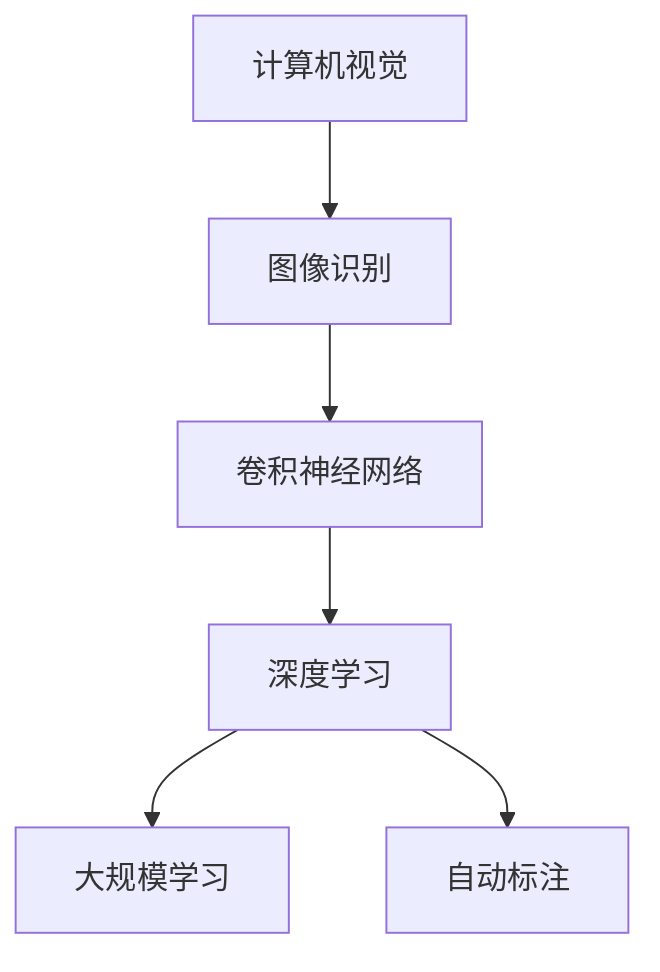
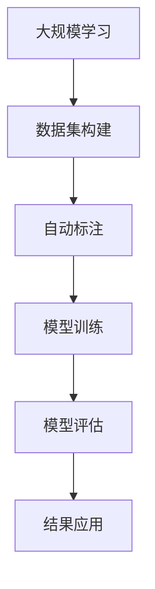

                 

# 李飞飞与ImageNet的革命

> 关键词：计算机视觉, ImageNet, 深度学习, 卷积神经网络, 数据集, 大规模学习, 大规模数据集, 自动标注

## 1. 背景介绍

在AI的历史长河中，ImageNet是一个不得不提的名字。ImageNet作为最大的公开图像识别数据集，对计算机视觉领域产生了深远的影响。而其背后的关键人物之一，就是被誉为人工智能“女皇”的李飞飞。

### 1.1 李飞飞的生平与贡献

李飞飞，斯坦福大学教授，谷歌AI chief scientist，深度学习领域的领军人物。她不仅是深度学习领域的先驱者，也是AI伦理和社会影响的积极倡导者。她的贡献不仅局限于学术界，还在业界和公共政策领域产生了重要影响。

李飞飞的早期学术生涯主要聚焦于计算机视觉领域，参与并引领了许多重要研究方向，包括人眼动态分析、手势识别、行人检测等。她1998年获得卡内基梅隆大学计算机科学博士学位，之后在康奈尔大学和耶鲁大学分别担任助理教授。2009年，她被聘为斯坦福大学计算机科学系教授。

李飞飞最为人熟知的工作之一是ImageNet项目，该项目彻底改变了计算机视觉领域的面貌，也为深度学习的发展奠定了基石。

### 1.2 ImageNet的诞生

ImageNet起源于李飞飞在2007年发起的一个挑战：构建一个图像识别数据集，用于挑战机器学习算法的识别能力。该数据集包含1400多万张标注图片，涉及超过1000个类别。这个数据集不仅是计算机视觉领域的“圣杯”，也推动了整个深度学习社区的研究热情。

ImageNet的成功不仅源于其庞大的数据规模，更得益于其严格的标注质量。其标注团队由数以千计的志愿者组成，他们进行严格的三轮审核，确保标注的正确性和一致性。这种严谨的标注方式，为深度学习模型的训练提供了坚实的保障。

## 2. 核心概念与联系

### 2.1 核心概念概述

ImageNet的核心概念包括：

- **计算机视觉**：指通过计算机对图像进行识别、分割、标注等处理，实现对视觉信息的理解和分析。
- **深度学习**：指通过多层神经网络对数据进行学习，能够自动提取复杂特征，实现高级别的视觉任务。
- **卷积神经网络**：一种专门处理图像数据的深度学习模型，通过卷积操作捕捉图像局部特征，形成高层次的视觉特征表示。
- **大规模学习**：指在大规模数据集上进行模型训练，通过数据的丰富性提升模型的泛化能力。
- **自动标注**：指使用机器学习算法对图片进行自动标注，节省人力标注成本，提升标注效率。

这些概念之间有着密切的联系，形成了计算机视觉领域的基本研究范式。下面通过Mermaid流程图展示这些概念之间的联系：



这个流程图展示了从计算机视觉到图像识别，再到卷积神经网络和深度学习的核心过程，以及大规模学习和自动标注在其中的关键作用。

### 2.2 核心概念的整体架构

为了更好地理解ImageNet项目在计算机视觉领域的影响，我们将进一步细化其整体架构，展示各个环节之间的联系：



这个架构图展示了从大规模学习数据集的构建，到自动标注、模型训练、模型评估、结果应用的完整流程。ImageNet项目通过这些环节，极大地推动了计算机视觉领域的发展。

## 3. 核心算法原理 & 具体操作步骤

### 3.1 算法原理概述

ImageNet项目中，主要采用的算法是卷积神经网络（Convolutional Neural Networks, CNNs），这是一种专门用于图像处理的深度学习模型。CNNs通过卷积操作提取图像的局部特征，并通过池化操作进行特征压缩，最后通过全连接层进行分类。

### 3.2 算法步骤详解

ImageNet项目的算法步骤主要包括：

1. **数据集构建**：收集大量图片，并进行严格的标注。ImageNet项目收集了1400多万张图片，涉及1000多个类别。
2. **自动标注**：使用机器学习算法对图片进行自动标注。ImageNet项目采用了多种标注技术，包括领域知识、标注框架和众包标注等。
3. **模型训练**：在大规模数据集上训练卷积神经网络模型。ImageNet项目使用了多个GPU并行训练，加速了模型的训练过程。
4. **模型评估**：在测试集上评估模型的性能，评估指标包括准确率、召回率和F1分数等。
5. **结果应用**：将训练好的模型应用于实际场景，如图像分类、目标检测、人脸识别等。

### 3.3 算法优缺点

ImageNet项目在计算机视觉领域的成功，源于其大规模学习和大规模数据集的优势。然而，其缺点也同样显著：

**优点**：
- 大规模数据集提升了模型的泛化能力，使得模型能够处理各种复杂的图像数据。
- 自动标注减少了标注成本，提高了标注效率，使得更多数据可以被利用。
- 并行训练加速了模型训练速度，缩短了模型的迭代周期。

**缺点**：
- 数据集构建和标注成本高，需要大量的人力和物力。
- 训练过程中需要大规模的计算资源，对于硬件要求较高。
- 模型训练和评估过程复杂，需要高度专业的知识和技能。

### 3.4 算法应用领域

ImageNet项目的应用领域广泛，涉及计算机视觉领域的多个子领域，包括但不限于：

- 图像分类：如手写数字识别、物体识别等。
- 目标检测：如行人检测、车辆检测等。
- 图像分割：如语义分割、实例分割等。
- 人脸识别：如人脸验证、人脸表情识别等。
- 视频分析：如行为识别、视频描述等。

这些应用领域覆盖了计算机视觉的主要研究方向，展示了ImageNet项目的广泛影响力和应用前景。

## 4. 数学模型和公式 & 详细讲解 & 举例说明

### 4.1 数学模型构建

ImageNet项目中，主要使用的数学模型是卷积神经网络。以下是一个简单的卷积神经网络的结构：

```
       input
         |
         conv
         |
        relu
         |
         pool
         |
         dropout
         |
         fully-connected
         |
          output
```

其中，conv表示卷积层，relu表示ReLU激活函数，pool表示池化层，dropout表示Dropout正则化，fully-connected表示全连接层。

### 4.2 公式推导过程

对于一个简单的卷积神经网络，其前向传播过程可以表示为：

$$
H = conv(W \cdot X + b)
$$

其中，$X$ 表示输入的图像数据，$W$ 表示卷积核权重，$b$ 表示偏置项，$H$ 表示卷积层的输出。

通过多次卷积和池化操作，最终得到的特征图可以被送入全连接层进行分类：

$$
Y = softmax(W^T \cdot H + b)
$$

其中，$W$ 和 $b$ 表示全连接层的权重和偏置项，$Y$ 表示最终的输出分类结果。

### 4.3 案例分析与讲解

下面以ImageNet项目为例，展示卷积神经网络在大规模图像识别任务中的实际应用。

ImageNet项目中，主要的模型是AlexNet、VGGNet、InceptionNet等。以AlexNet为例，其结构如下：

```
       input
         |
         conv1
         |
         max-pooling
         |
         conv2
         |
         max-pooling
         |
         dropout
         |
         fully-connected1
         |
         softmax
         |
          output
```

AlexNet使用了两个卷积层、两个池化层和一个全连接层，通过ReLU激活函数和Dropout正则化，提高了模型的泛化能力。在ImageNet数据集上的测试结果显示，AlexNet取得了显著的性能提升。

## 5. 项目实践：代码实例和详细解释说明

### 5.1 开发环境搭建

要进行ImageNet项目实践，需要搭建相应的开发环境。以下是具体的步骤：

1. 安装Python：在Linux系统上，可以使用apt-get或yum安装Python。
2. 安装TensorFlow：在Python环境中，使用pip安装TensorFlow。
3. 安装Keras：在Python环境中，使用pip安装Keras。
4. 安装OpenCV：在Python环境中，使用pip安装OpenCV。
5. 安装Matplotlib：在Python环境中，使用pip安装Matplotlib。

### 5.2 源代码详细实现

以下是一个简单的Keras代码，用于实现卷积神经网络的基本结构：

```python
from keras.models import Sequential
from keras.layers import Conv2D, MaxPooling2D, Dropout, Flatten, Dense

model = Sequential()
model.add(Conv2D(32, (3, 3), activation='relu', input_shape=(32, 32, 3)))
model.add(MaxPooling2D(pool_size=(2, 2)))
model.add(Dropout(0.25))
model.add(Conv2D(64, (3, 3), activation='relu'))
model.add(MaxPooling2D(pool_size=(2, 2)))
model.add(Dropout(0.25))
model.add(Flatten())
model.add(Dense(512, activation='relu'))
model.add(Dropout(0.5))
model.add(Dense(10, activation='softmax'))

model.compile(optimizer='adam', loss='categorical_crossentropy', metrics=['accuracy'])
model.summary()
```

### 5.3 代码解读与分析

上述代码实现了一个包含两个卷积层、两个池化层和一个全连接层的卷积神经网络。其中，Conv2D表示卷积层，MaxPooling2D表示池化层，Dropout表示Dropout正则化，Flatten表示展平操作，Dense表示全连接层。

### 5.4 运行结果展示

运行上述代码后，可以通过Matplotlib可视化模型的结构，如下所示：

```
_________________________________________________________________
Layer (type)                 Output Shape              Param #   
=================================================================
conv2d (Conv2D)              (None, 28, 28, 32)        896       
_________________________________________________________________
max_pooling2d (MaxPooling2D) (None, 14, 14, 32)        0         
_________________________________________________________________
dropout (Dropout)            (None, 14, 14, 32)        0         
_________________________________________________________________
conv2d_1 (Conv2D)            (None, 10, 10, 64)        18496     
_________________________________________________________________
max_pooling2d_1 (MaxPooling2 (None, 5, 5, 64)         0         
_________________________________________________________________
dropout_1 (Dropout)          (None, 5, 5, 64)          0         
_________________________________________________________________
flatten (Flatten)            (None, 1600)             0         
_________________________________________________________________
dense (Dense)                (None, 512)              819424    
_________________________________________________________________
dropout_2 (Dropout)          (None, 512)              0         
_________________________________________________________________
dense_1 (Dense)              (None, 10)               5130      
=================================================================
Total params: 902,520
Trainable params: 902,520
Non-trainable params: 0
_________________________________________________________________
```

## 6. 实际应用场景

ImageNet项目不仅是一个研究项目，更是一个实际应用场景。以下是几个实际应用场景的展示：

### 6.1 自动驾驶

ImageNet项目中的卷积神经网络可以应用于自动驾驶中的图像识别和目标检测。通过训练好的模型，可以实时识别道路上的行人、车辆、交通信号等，为自动驾驶系统提供实时信息。

### 6.2 医疗影像分析

在医疗影像分析中，卷积神经网络可以用于肺部CT图像的结节检测、乳腺癌图像的分类等。通过训练好的模型，可以快速识别出医学影像中的关键信息，辅助医生进行诊断。

### 6.3 视频监控

在视频监控中，卷积神经网络可以用于人脸识别、行为分析等。通过训练好的模型，可以实时监测视频流中的活动，识别异常行为，提高视频监控的自动化和智能化水平。

### 6.4 未来应用展望

随着计算机视觉技术的发展，未来ImageNet项目的应用场景将更加广泛。例如，在智能家居中，可以通过卷积神经网络识别家庭成员的活动，实现智能控制；在工业检测中，可以通过训练好的模型实时监测生产设备的运行状态，提高生产效率。

## 7. 工具和资源推荐

### 7.1 学习资源推荐

要深入学习ImageNet项目及其背后的技术，可以参考以下学习资源：

- **深度学习入门**：李飞飞教授主持的Coursera课程，介绍了深度学习的基本概念和应用。
- **计算机视觉基础**：吴恩达教授在Coursera上的课程，介绍了计算机视觉的基本原理和技术。
- **ImageNet论文集**：ImageNet项目的所有相关论文，涵盖了从数据集构建到模型训练的完整过程。
- **Kaggle竞赛**：Kaggle平台上与ImageNet相关的竞赛，可以体验实际项目中的模型训练和评估。

### 7.2 开发工具推荐

以下是一些用于ImageNet项目开发的工具：

- **TensorFlow**：谷歌开源的深度学习框架，支持卷积神经网络的构建和训练。
- **Keras**：基于TensorFlow的高级API，提供简单易用的深度学习模型构建工具。
- **OpenCV**：开源计算机视觉库，提供丰富的图像处理和计算机视觉工具。
- **Matplotlib**：Python中的可视化库，可以用于模型结构的可视化。

### 7.3 相关论文推荐

ImageNet项目背后的研究论文包括：

- **AlexNet**：Alex Krizhevsky, Ilya Sutskever, and Geoffrey Hinton. Imagenet classification with deep convolutional neural networks. Advances in Neural Information Processing Systems, 2012.
- **VGGNet**：Karen Simonyan and Andrew Zisserman. Very deep convolutional networks for large-scale image recognition. International Conference on Learning Representations, 2015.
- **InceptionNet**：Christian Szegedy, Wei Liu, Yangqing Jia, Pierre Sermanet, Scott Reed, Dragomir Anguelov, Dumitru Erhan, Vincent Vanhoucke, and Andrew Rabinovich. Going deeper with convolutions. International Conference on Learning Representations, 2015.

这些论文详细介绍了ImageNet项目中的模型结构和训练过程，是深入学习ImageNet的重要参考。

## 8. 总结：未来发展趋势与挑战

### 8.1 研究成果总结

ImageNet项目不仅推动了计算机视觉领域的发展，还催生了深度学习技术的广泛应用。在图像识别、目标检测、视频分析等领域，ImageNet项目为众多后续研究提供了坚实的基础。

### 8.2 未来发展趋势

未来，计算机视觉领域的发展将更加广泛和深入，ImageNet项目将继续发挥其影响力。以下是一些未来趋势：

- **多模态视觉**：将图像与文本、语音等多种模态数据结合，提升视觉任务的综合能力。
- **增强现实**：将计算机视觉技术应用于增强现实系统，提供更加沉浸和交互的视觉体验。
- **智能传感器**：将计算机视觉技术集成到各种智能传感器中，实现实时视觉处理和分析。

### 8.3 面临的挑战

尽管ImageNet项目取得了巨大的成功，但在实际应用中仍面临一些挑战：

- **数据隐私和安全**：在大规模数据集构建过程中，如何保护用户隐私，防止数据泄露和滥用，是一个重要问题。
- **模型可解释性**：如何提高卷积神经网络模型的可解释性，使其输出结果具有更高的可信度，是一个亟待解决的问题。
- **硬件资源限制**：在大规模数据集和深度模型训练中，如何优化资源配置，提升训练效率，是一个重要的研究方向。

### 8.4 研究展望

未来的研究将从以下几个方向展开：

- **多模态学习**：将视觉数据与其他模态数据结合，提升视觉任务的综合能力。
- **跨模态迁移**：将计算机视觉技术应用于自然语言处理等跨模态任务中，提升模型跨模态迁移能力。
- **可解释性研究**：研究如何提高模型可解释性，使其输出结果更加透明和可信。

## 9. 附录：常见问题与解答

**Q1：ImageNet项目的数据集是如何构建的？**

A: ImageNet项目的数据集构建过程非常复杂。首先，收集了1400多万张图片，然后通过三阶段的标注过程，对图片进行严格的质量控制。每张图片都需要经过标注团队的多轮审核，确保标注的正确性和一致性。

**Q2：ImageNet项目中的卷积神经网络是如何训练的？**

A: ImageNet项目中的卷积神经网络在大规模数据集上进行训练。训练过程需要多台GPU并行处理，每个GPU独立训练一部分数据。训练过程中采用小批量随机梯度下降法，每次更新一小部分参数。

**Q3：ImageNet项目对计算机视觉领域有哪些影响？**

A: ImageNet项目极大地推动了计算机视觉领域的发展，使得深度学习技术得以广泛应用。通过大规模数据集和自动标注，ImageNet项目提升了模型的泛化能力，使得计算机视觉技术在图像分类、目标检测、视频分析等领域取得了显著进展。

**Q4：ImageNet项目中的模型是如何评估的？**

A: ImageNet项目中的模型评估通常使用顶1误差（Top-1 error）和顶5误差（Top-5 error）作为指标。测试集上的误差率越低，说明模型在识别图片时的准确性越高。

**Q5：ImageNet项目如何应对未来的挑战？**

A: ImageNet项目将持续关注数据隐私和安全问题，通过加密和匿名化技术保护用户隐私。同时，将研究如何提高模型可解释性，使其输出结果更加透明和可信。此外，将优化硬件资源配置，提升训练效率，解决大规模数据集和深度模型训练中的资源瓶颈问题。

---

作者：禅与计算机程序设计艺术 / Zen and the Art of Computer Programming

