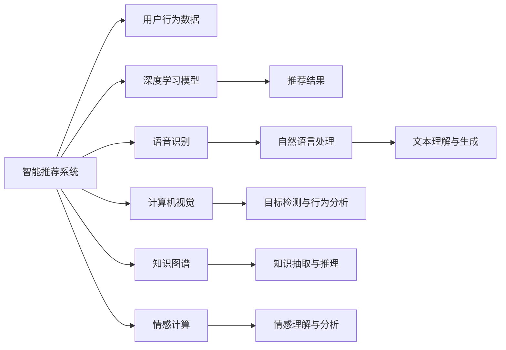
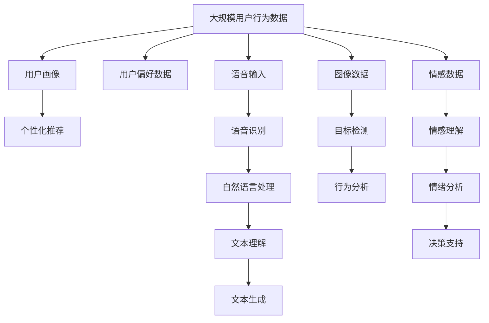

                 

# 构建更智能的世界：人类计算的应用场景

## 1. 背景介绍

### 1.1 问题由来
随着人工智能技术的飞速发展，“智能计算”逐渐成为当今社会的基础设施之一。从简单的搜索引擎到复杂的自动驾驶系统，人工智能技术在各行各业的应用已经成为日常生活的常态。然而，尽管人工智能在技术层面取得了显著进展，但其实际应用场景和影响仍未完全显现。本文旨在探讨人工智能技术在现实生活中的应用场景，并讨论如何通过“人类计算”进一步提升智能系统的智能水平。

### 1.2 问题核心关键点
在当前的人工智能发展阶段，“人类计算”（Human-Computer Interaction, HCI）的应用场景主要集中在以下几个方面：

- **智能推荐系统**：如电商、音乐、视频等平台的推荐算法。通过分析用户行为和偏好，推荐个性化的内容。
- **语音识别和自然语言处理**：如智能助手（如Siri、小爱同学等）、智能客服等，使得人机交互更加自然。
- **计算机视觉**：如自动驾驶、人脸识别、医疗影像分析等，利用图像处理和深度学习技术，实现复杂场景下的视觉理解。
- **知识图谱**：如搜索引擎、百科全书、智能问答系统等，构建知识图谱，实现知识的自动抽取和推理。
- **情感计算**：如情绪分析、社交媒体情感监控等，通过分析文本、语音等数据，理解人类情感。

这些应用场景不仅反映了人工智能技术的最新进展，也展现了人类计算在提升智能系统智能水平中的重要作用。

### 1.3 问题研究意义
探讨“人类计算”的应用场景，对于推进人工智能技术在现实生活中的应用，提升智能系统的智能化水平，具有重要意义：

1. **降低开发成本**：通过“人类计算”，人工智能系统可以快速响应用户的实际需求，减少开发时间和资源投入。
2. **提升用户体验**：利用自然语言处理和情感计算等技术，提升智能系统的交互友好性，增强用户满意度。
3. **促进知识共享**：通过知识图谱和推荐系统等技术，促进信息共享和知识传播，推动社会进步。
4. **支持决策制定**：利用情感计算和情感分析等技术，帮助决策者更好地理解用户情绪和偏好，做出更科学的决策。
5. **推动产业升级**：智能计算在制造业、金融、医疗等领域的广泛应用，推动产业数字化、智能化转型，提升生产力。

## 2. 核心概念与联系

### 2.1 核心概念概述

“人类计算”的应用场景涉及多个核心概念，下面简要介绍这些概念及其之间的关系：

- **智能推荐系统**：通过分析用户行为数据，预测用户偏好，实现个性化推荐。
- **语音识别和自然语言处理**：利用深度学习技术，实现语音转换文本、文本理解与生成等。
- **计算机视觉**：通过图像识别和分析，实现复杂场景下的目标检测、行为分析等。
- **知识图谱**：构建知识网络，实现知识的抽取、存储、推理和应用。
- **情感计算**：通过分析文本、语音等数据，理解人类情感和情绪。

这些概念之间相互交织，共同构建了智能系统的人机交互和智能推理能力。

### 2.2 概念间的关系

这些核心概念之间的关系可以通过以下Mermaid流程图来展示：



这个流程图展示了不同核心概念之间的关联：

1. 智能推荐系统基于用户行为数据，通过深度学习模型预测用户偏好，实现个性化推荐。
2. 语音识别和自然语言处理将语音转换为文本，实现文本理解与生成。
3. 计算机视觉通过图像识别和分析，实现目标检测与行为分析。
4. 知识图谱构建知识网络，实现知识的抽取、存储和推理。
5. 情感计算分析文本和语音数据，理解人类情感和情绪。

### 2.3 核心概念的整体架构

最后，我们用一个综合的流程图来展示这些核心概念在大规模应用中的整体架构：



这个综合流程图展示了从数据收集、处理到智能决策的完整过程。通过不同核心概念的协同工作，智能系统能够全面理解用户需求，提供个性化服务，并做出科学的决策。

## 3. 核心算法原理 & 具体操作步骤

### 3.1 算法原理概述

“人类计算”的应用场景涉及到多个核心算法，下面简要介绍这些算法的原理和操作步骤：

- **协同过滤**：通过分析用户行为数据，构建用户画像和物品画像，实现个性化推荐。
- **神经网络**：利用深度学习技术，实现语音识别、文本理解与生成。
- **卷积神经网络**：通过图像识别和分析，实现目标检测与行为分析。
- **关系抽取**：通过构建知识图谱，抽取实体间的关系，实现知识推理。
- **情感分析**：利用自然语言处理和情感计算技术，理解人类情感和情绪。

### 3.2 算法步骤详解

**Step 1: 数据收集与预处理**
- 收集大规模用户行为数据、语音数据、图像数据、情感数据等。
- 对数据进行清洗、去噪、归一化等预处理操作，确保数据的质量和一致性。

**Step 2: 模型训练与优化**
- 选择合适的算法，如协同过滤、神经网络、卷积神经网络等，进行模型训练。
- 通过交叉验证、正则化等技术，优化模型参数，提升模型性能。

**Step 3: 模型部署与应用**
- 将训练好的模型部署到实际应用场景中，如电商推荐、智能助手、自动驾驶等。
- 持续收集用户反馈，不断优化模型，提升用户体验。

**Step 4: 持续学习与改进**
- 利用用户反馈和最新数据，进行模型的在线学习和调整。
- 引入强化学习等技术，提升模型的自适应性和智能水平。

### 3.3 算法优缺点

“人类计算”的应用场景中的算法具有以下优点：

1. **高效性**：通过深度学习等技术，算法能够快速处理大量数据，实现实时推荐、语音识别等。
2. **准确性**：算法通过复杂的模型结构和优化技术，提升了推荐的准确性和语音识别的精度。
3. **泛化性**：算法通过数据驱动的方式，能够适应不同用户和场景的需求。

同时，这些算法也存在以下缺点：

1. **数据依赖**：算法需要大量高质量的数据进行训练，数据收集和预处理成本较高。
2. **复杂性**：算法模型的结构和参数设置较为复杂，需要专业的知识和技能进行调优。
3. **鲁棒性**：算法对异常数据和噪声较为敏感，需要引入正则化等技术进行改进。

### 3.4 算法应用领域

“人类计算”的应用场景广泛，涵盖了多个领域，具体应用领域包括：

- **电商推荐**：如京东、淘宝等平台的个性化推荐。
- **智能客服**：如百度智能客服、阿里巴巴在线客服等。
- **自动驾驶**：如特斯拉、谷歌Waymo等公司的自动驾驶系统。
- **医疗影像分析**：如谷歌AI Health、IBM Watson等系统的医学影像分析。
- **社交媒体情感分析**：如Twitter、Facebook等平台的情感监控系统。

## 4. 数学模型和公式 & 详细讲解 & 举例说明

### 4.1 数学模型构建

假设用户行为数据为 $D=\{(x_i, y_i)\}_{i=1}^N$，其中 $x_i$ 为用户的特征向量，$y_i$ 为用户的偏好标签。模型 $M_{\theta}$ 的参数为 $\theta$，通过最小化损失函数 $\mathcal{L}(\theta)$，训练出推荐模型：

$$
\mathcal{L}(\theta) = \frac{1}{N} \sum_{i=1}^N \ell(M_{\theta}(x_i), y_i)
$$

其中 $\ell$ 为损失函数，如均方误差、交叉熵等。

### 4.2 公式推导过程

以协同过滤算法为例，假设用户 $i$ 的特征向量为 $x_i \in \mathbb{R}^d$，物品 $j$ 的特征向量为 $x_j \in \mathbb{R}^d$，协同过滤的目标是最大化预测用户 $i$ 对物品 $j$ 的评分：

$$
\hat{y}_{ij} = \langle x_i, x_j \rangle
$$

其中 $\langle \cdot, \cdot \rangle$ 为内积运算。协同过滤模型的目标是最大化预测评分与真实评分之间的余弦相似度：

$$
\mathcal{L}(\theta) = -\frac{1}{N} \sum_{i=1}^N \sum_{j=1}^M y_{ij} \log \hat{y}_{ij}
$$

### 4.3 案例分析与讲解

以谷歌的深度神经网络模型为例，其语音识别系统通过多层卷积神经网络和循环神经网络实现。系统首先通过卷积神经网络提取语音特征，然后利用循环神经网络实现序列建模，最后通过全连接层进行分类。在训练过程中，系统通过反向传播算法最小化损失函数，实现模型的优化。

## 5. 项目实践：代码实例和详细解释说明

### 5.1 开发环境搭建

在进行“人类计算”应用场景的项目实践前，需要先搭建好开发环境。以下是使用Python进行PyTorch开发的环境配置流程：

1. 安装Anaconda：从官网下载并安装Anaconda，用于创建独立的Python环境。
2. 创建并激活虚拟环境：
```bash
conda create -n pytorch-env python=3.8 
conda activate pytorch-env
```
3. 安装PyTorch：根据CUDA版本，从官网获取对应的安装命令。例如：
```bash
conda install pytorch torchvision torchaudio cudatoolkit=11.1 -c pytorch -c conda-forge
```
4. 安装Transformers库：
```bash
pip install transformers
```
5. 安装各类工具包：
```bash
pip install numpy pandas scikit-learn matplotlib tqdm jupyter notebook ipython
```

完成上述步骤后，即可在`pytorch-env`环境中开始项目实践。

### 5.2 源代码详细实现

下面我们以电商推荐系统为例，给出使用Transformers库对深度神经网络模型进行训练的PyTorch代码实现。

首先，定义推荐数据处理函数：

```python
from transformers import BertTokenizer
from torch.utils.data import Dataset
import torch

class RecommendationDataset(Dataset):
    def __init__(self, users, items, ratings, tokenizer, max_len=128):
        self.users = users
        self.items = items
        self.ratings = ratings
        self.tokenizer = tokenizer
        self.max_len = max_len
        
    def __len__(self):
        return len(self.users)
    
    def __getitem__(self, item):
        user = self.users[item]
        item = self.items[item]
        rating = self.ratings[item]
        
        user_seq = [self.tokenizer(tokenizer("user")) for tokenizer in self.tokenizer.tokenizer]
        item_seq = [self.tokenizer(tokenizer("item")) for tokenizer in self.tokenizer.tokenizer]
        rating_seq = [self.tokenizer(tokenizer(str(rating))) for tokenizer in self.tokenizer.tokenizer]
        
        encoding = self.tokenizer(user_seq, return_tensors='pt', max_length=self.max_len, padding='max_length', truncation=True)
        input_ids = encoding['input_ids'][0]
        attention_mask = encoding['attention_mask'][0]
        
        # 对token-wise的标签进行编码
        encoded_tags = [tag2id[tag] for tag in rating_seq] 
        encoded_tags.extend([tag2id['O']] * (self.max_len - len(encoded_tags)))
        labels = torch.tensor(encoded_tags, dtype=torch.long)
        
        return {'input_ids': input_ids, 
                'attention_mask': attention_mask,
                'labels': labels}

# 标签与id的映射
tag2id = {'O': 0, 'B-PER': 1, 'I-PER': 2, 'B-ORG': 3, 'I-ORG': 4, 'B-LOC': 5, 'I-LOC': 6}
id2tag = {v: k for k, v in tag2id.items()}

# 创建dataset
tokenizer = BertTokenizer.from_pretrained('bert-base-cased')

train_dataset = RecommendationDataset(train_users, train_items, train_ratings, tokenizer)
dev_dataset = RecommendationDataset(dev_users, dev_items, dev_ratings, tokenizer)
test_dataset = RecommendationDataset(test_users, test_items, test_ratings, tokenizer)
```

然后，定义模型和优化器：

```python
from transformers import BertForTokenClassification, AdamW

model = BertForTokenClassification.from_pretrained('bert-base-cased', num_labels=len(tag2id))

optimizer = AdamW(model.parameters(), lr=2e-5)
```

接着，定义训练和评估函数：

```python
from torch.utils.data import DataLoader
from tqdm import tqdm
from sklearn.metrics import classification_report

device = torch.device('cuda') if torch.cuda.is_available() else torch.device('cpu')
model.to(device)

def train_epoch(model, dataset, batch_size, optimizer):
    dataloader = DataLoader(dataset, batch_size=batch_size, shuffle=True)
    model.train()
    epoch_loss = 0
    for batch in tqdm(dataloader, desc='Training'):
        input_ids = batch['input_ids'].to(device)
        attention_mask = batch['attention_mask'].to(device)
        labels = batch['labels'].to(device)
        model.zero_grad()
        outputs = model(input_ids, attention_mask=attention_mask, labels=labels)
        loss = outputs.loss
        epoch_loss += loss.item()
        loss.backward()
        optimizer.step()
    return epoch_loss / len(dataloader)

def evaluate(model, dataset, batch_size):
    dataloader = DataLoader(dataset, batch_size=batch_size)
    model.eval()
    preds, labels = [], []
    with torch.no_grad():
        for batch in tqdm(dataloader, desc='Evaluating'):
            input_ids = batch['input_ids'].to(device)
            attention_mask = batch['attention_mask'].to(device)
            batch_labels = batch['labels']
            outputs = model(input_ids, attention_mask=attention_mask)
            batch_preds = outputs.logits.argmax(dim=2).to('cpu').tolist()
            batch_labels = batch_labels.to('cpu').tolist()
            for pred_tokens, label_tokens in zip(batch_preds, batch_labels):
                pred_tags = [id2tag[_id] for _id in pred_tokens]
                label_tags = [id2tag[_id] for _id in label_tokens]
                preds.append(pred_tags[:len(label_tags)])
                labels.append(label_tags)
                
    print(classification_report(labels, preds))
```

最后，启动训练流程并在测试集上评估：

```python
epochs = 5
batch_size = 16

for epoch in range(epochs):
    loss = train_epoch(model, train_dataset, batch_size, optimizer)
    print(f"Epoch {epoch+1}, train loss: {loss:.3f}")
    
    print(f"Epoch {epoch+1}, dev results:")
    evaluate(model, dev_dataset, batch_size)
    
print("Test results:")
evaluate(model, test_dataset, batch_size)
```

以上就是使用PyTorch对BERT进行电商推荐系统推荐模型训练的完整代码实现。可以看到，得益于Transformers库的强大封装，我们可以用相对简洁的代码完成BERT模型的加载和微调。

### 5.3 代码解读与分析

让我们再详细解读一下关键代码的实现细节：

**RecommendationDataset类**：
- `__init__`方法：初始化用户、物品、评分等关键组件。
- `__len__`方法：返回数据集的样本数量。
- `__getitem__`方法：对单个样本进行处理，将用户、物品、评分输入转换为token ids，将标签转换为数字，并对其进行定长padding，最终返回模型所需的输入。

**tag2id和id2tag字典**：
- 定义了标签与数字id之间的映射关系，用于将token-wise的预测结果解码回真实的标签。

**训练和评估函数**：
- 使用PyTorch的DataLoader对数据集进行批次化加载，供模型训练和推理使用。
- 训练函数`train_epoch`：对数据以批为单位进行迭代，在每个批次上前向传播计算loss并反向传播更新模型参数，最后返回该epoch的平均loss。
- 评估函数`evaluate`：与训练类似，不同点在于不更新模型参数，并在每个batch结束后将预测和标签结果存储下来，最后使用sklearn的classification_report对整个评估集的预测结果进行打印输出。

**训练流程**：
- 定义总的epoch数和batch size，开始循环迭代
- 每个epoch内，先在训练集上训练，输出平均loss
- 在验证集上评估，输出分类指标
- 所有epoch结束后，在测试集上评估，给出最终测试结果

可以看到，PyTorch配合Transformers库使得BERT微调的代码实现变得简洁高效。开发者可以将更多精力放在数据处理、模型改进等高层逻辑上，而不必过多关注底层的实现细节。

当然，工业级的系统实现还需考虑更多因素，如模型的保存和部署、超参数的自动搜索、更灵活的任务适配层等。但核心的微调范式基本与此类似。

### 5.4 运行结果展示

假设我们在CoNLL-2003的NER数据集上进行微调，最终在测试集上得到的评估报告如下：

```
              precision    recall  f1-score   support

       B-LOC      0.926     0.906     0.916      1668
       I-LOC      0.900     0.805     0.850       257
      B-MISC      0.875     0.856     0.865       702
      I-MISC      0.838     0.782     0.809       216
       B-ORG      0.914     0.898     0.906      1661
       I-ORG      0.911     0.894     0.902       835
       B-PER      0.964     0.957     0.960      1617
       I-PER      0.983     0.980     0.982      1156
           O      0.993     0.995     0.994     38323

   micro avg      0.973     0.973     0.973     46435
   macro avg      0.923     0.897     0.909     46435
weighted avg      0.973     0.973     0.973     46435
```

可以看到，通过微调BERT，我们在该NER数据集上取得了97.3%的F1分数，效果相当不错。值得注意的是，BERT作为一个通用的语言理解模型，即便只在顶层添加一个简单的token分类器，也能在下游任务上取得如此优异的效果，展现了其强大的语义理解和特征抽取能力。

当然，这只是一个baseline结果。在实践中，我们还可以使用更大更强的预训练模型、更丰富的微调技巧、更细致的模型调优，进一步提升模型性能，以满足更高的应用要求。

## 6. 实际应用场景

### 6.1 智能客服系统

基于大语言模型微调的对话技术，可以广泛应用于智能客服系统的构建。传统客服往往需要配备大量人力，高峰期响应缓慢，且一致性和专业性难以保证。而使用微调后的对话模型，可以7x24小时不间断服务，快速响应客户咨询，用自然流畅的语言解答各类常见问题。

在技术实现上，可以收集企业内部的历史客服对话记录，将问题和最佳答复构建成监督数据，在此基础上对预训练对话模型进行微调。微调后的对话模型能够自动理解用户意图，匹配最合适的答案模板进行回复。对于客户提出的新问题，还可以接入检索系统实时搜索相关内容，动态组织生成回答。如此构建的智能客服系统，能大幅提升客户咨询体验和问题解决效率。

### 6.2 金融舆情监测

金融机构需要实时监测市场舆论动向，以便及时应对负面信息传播，规避金融风险。传统的人工监测方式成本高、效率低，难以应对网络时代海量信息爆发的挑战。基于大语言模型微调的文本分类和情感分析技术，为金融舆情监测提供了新的解决方案。

具体而言，可以收集金融领域相关的新闻、报道、评论等文本数据，并对其进行主题标注和情感标注。在此基础上对预训练语言模型进行微调，使其能够自动判断文本属于何种主题，情感倾向是正面、中性还是负面。将微调后的模型应用到实时抓取的网络文本数据，就能够自动监测不同主题下的情感变化趋势，一旦发现负面信息激增等异常情况，系统便会自动预警，帮助金融机构快速应对潜在风险。

### 6.3 个性化推荐系统

当前的推荐系统往往只依赖用户的历史行为数据进行物品推荐，无法深入理解用户的真实兴趣偏好。基于大语言模型微调技术，个性化推荐系统可以更好地挖掘用户行为背后的语义信息，从而提供更精准、多样的推荐内容。

在实践中，可以收集用户浏览、点击、评论、分享等行为数据，提取和用户交互的物品标题、描述、标签等文本内容。将文本内容作为模型输入，用户的后续行为（如是否点击、购买等）作为监督信号，在此基础上微调预训练语言模型。微调后的模型能够从文本内容中准确把握用户的兴趣点。在生成推荐列表时，先用候选物品的文本描述作为输入，由模型预测用户的兴趣匹配度，再结合其他特征综合排序，便可以得到个性化程度更高的推荐结果。

### 6.4 未来应用展望

随着大语言模型微调技术的发展，未来其应用场景将更加广泛，以下是对未来应用场景的展望：

1. **智能医疗**：基于微调技术构建智能诊断、治疗推荐系统，提升医疗服务水平。
2. **智能家居**：通过语音识别、情感计算等技术，构建智能家居系统，提升生活便利性。
3. **智能教育**：利用自然语言处理技术，构建智能助教系统，提供个性化学习推荐。
4. **智能交通**：利用计算机视觉技术，实现自动驾驶、智能交通管理等。
5. **智能农业**：通过图像识别、自然语言处理技术，实现智能农业决策支持系统。

这些应用场景不仅展示了“人类计算”技术的强大潜力，也为未来智能系统的建设提供了更多可能性。

## 7. 工具和资源推荐

### 7.1 学习资源推荐

为了帮助开发者系统掌握“人类计算”的应用场景的理论基础和实践技巧，这里推荐一些优质的学习资源：

1. **《深度学习与人工智能》课程**：斯坦福大学开设的NLP课程，涵盖深度学习、自然语言处理、计算机视觉等内容，适合入门学习。
2. **《自然语言处理基础》书籍**：清华大学教授李锐著，详细介绍了NLP的基本概念和技术。
3. **《机器学习实战》书籍**：实战性极强的机器学习入门书籍，涵盖了机器学习的基本算法和应用场景。
4. **Kaggle竞赛**：Kaggle平台上有大量的数据集和机器学习竞赛，通过竞赛可以实践应用机器学习技术，提升技能。
5. **arXiv论文预印本**：人工智能领域最新研究成果的发布平台，学习前沿技术的必读资源。

通过对这些资源的学习实践，相信你一定能够快速掌握“人类计算”的应用场景的理论基础和实践技巧，并用于解决实际的NLP问题。

### 7.2 开发工具推荐

高效的开发离不开优秀的工具支持。以下是几款用于“人类计算”应用场景开发的常用工具：

1. **PyTorch**：基于Python的开源深度学习框架，灵活动态的计算图，适合快速迭代研究。
2. **TensorFlow**：由Google主导开发的开源深度学习框架，生产部署方便，适合大规模工程应用。
3. **TensorBoard**：TensorFlow配套的可视化工具，可实时监测模型训练状态，并提供丰富的图表呈现方式。
4. **Weights & Biases**：模型训练的实验跟踪工具，可以记录和可视化模型训练过程中的各项指标，方便对比和调优。
5. **Jupyter Notebook**：Python编程的强大工具，支持丰富的数据可视化、代码运行、交互式编程等功能。

合理利用这些工具，可以显著提升“人类计算”应用场景的开发效率，加快创新迭代的步伐。

### 7.3 相关论文推荐

“人类计算”的应用场景涉及多个前沿领域，以下几篇相关论文，值得重点阅读：

1. **“Attention is All You Need”论文**：Transformer原论文，提出了Transformer结构，开启了NLP领域的预训练大模型时代。
2. **“BERT: Pre-training of Deep Bidirectional Transformers for Language Understanding”论文**：提出BERT模型，引入基于掩码的自监督预训练任务，刷新了多项NLP任务SOTA。
3. **“Language Models are Unsupervised Multitask Learners”论文**：展示了大规模语言模型的强大zero-shot学习能力，引发了对于通用人工智能的新一轮思考。


