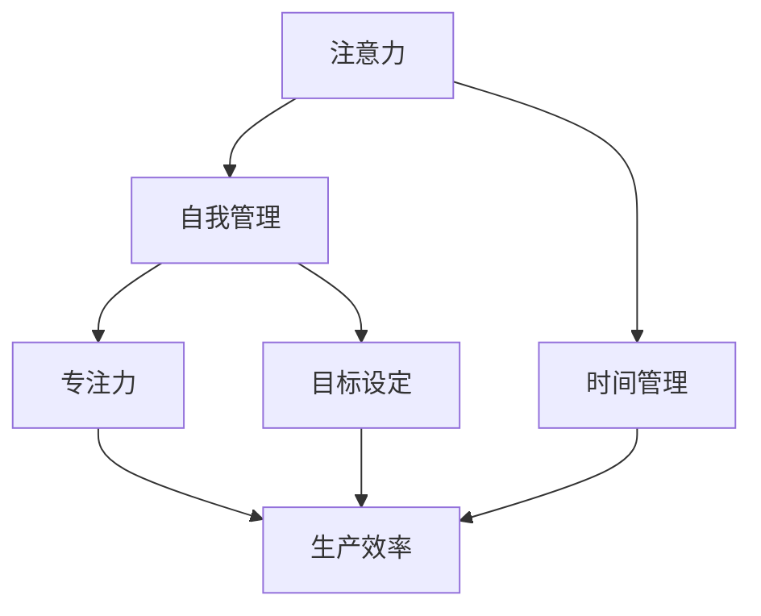
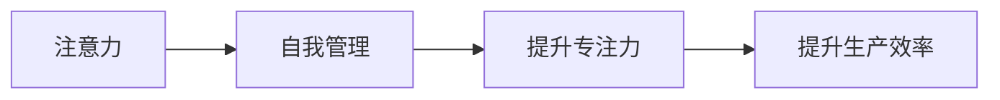
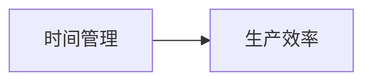
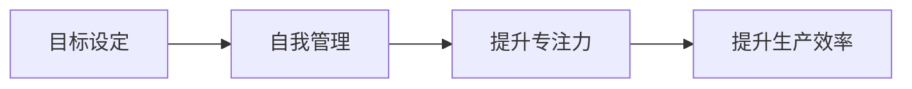
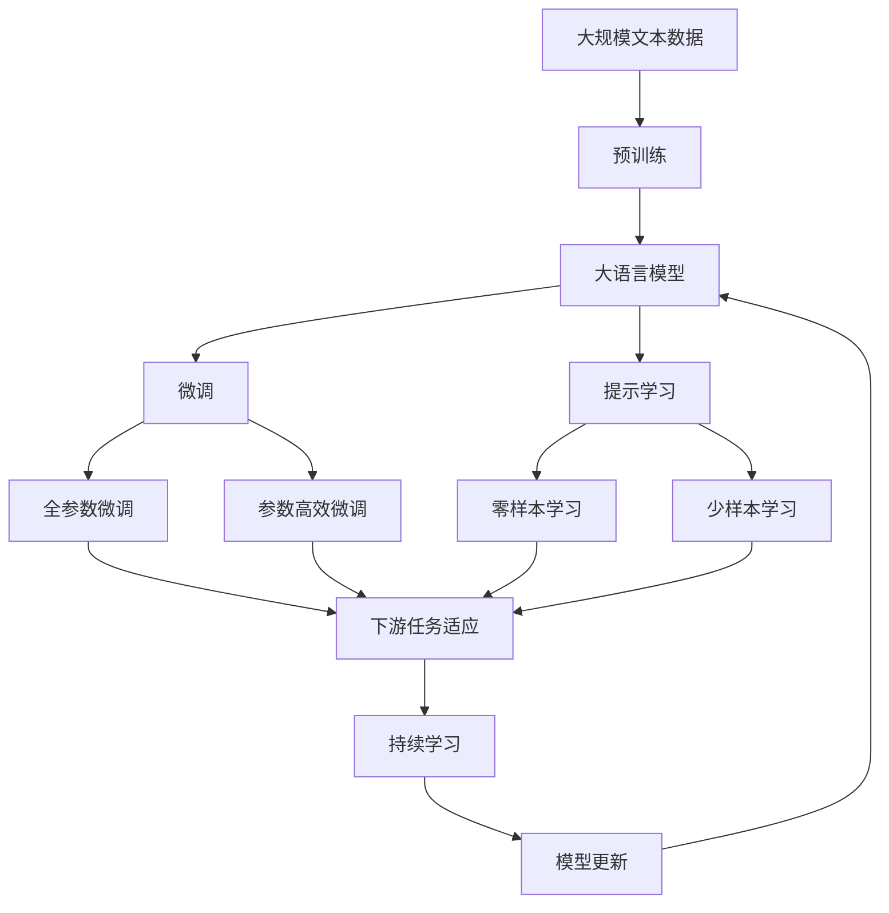

                 

# 注意力管理与自我管理策略：通过专注力增强个人和职业成功

> 关键词：注意力管理,自我管理,专注力,生产力,目标设定,时间管理

## 1. 背景介绍

在快节奏的现代社会，无论是职场精英还是学生、创业者，高效的时间管理和注意力管理对于提升个人及职业成功至关重要。然而，随着信息过载和注意力分散日益加剧，许多人陷入了“忙碌却无效”的困境。本文旨在探讨注意力管理与自我管理策略，通过专注力增强个人和职业成功。

### 1.1 问题由来
注意力管理与自我管理已经成为现代生活的核心技能。过去，人们主要依靠自上而下的管理，如领导层、规章制度等。但随着工作场景日益复杂多变，简单的自上而下管理已经无法满足需求。此时，自下而上的管理显得尤为重要。

随着AI、大数据、区块链等新技术的发展，个人和组织需要更高效、更智能的时间管理和注意力管理方法，以适应动态变化的工作环境。

### 1.2 问题核心关键点
当前注意力管理与自我管理的关键在于如何在信息碎片化的环境中，保持高专注度、高效产出、持续成长。

- **信息过载与注意力分散**：在社交媒体、邮件、消息推送等信息的干扰下，注意力变得容易分散。
- **任务切换成本高**：频繁切换任务导致心理负荷增加，降低了效率和效果。
- **目标冲突与优先级管理**：如何平衡各种任务和目标，合理设置优先级，是管理中的难点。
- **自我激励与自我约束**：保持长期的动力和自我控制，避免拖延和疲劳。

### 1.3 问题研究意义
注意力管理与自我管理技术的深入研究，对于提升个人效率、职业竞争力、生活质量具有重要意义：

- **提升生产效率**：通过有效的注意力管理，减少时间浪费，提升单位时间内的产出。
- **优化职业路径**：通过自我管理，明确职业目标，制定可行计划，稳步前进。
- **增强生活质量**：通过合理安排时间，缓解工作与生活压力，实现身心平衡。
- **适应新工作环境**：在不断变化的职业环境中，保持敏捷性和适应性。

## 2. 核心概念与联系

### 2.1 核心概念概述

注意力管理与自我管理涉及多个关键概念，主要包括以下几点：

- **注意力**：个体的注意力是指在特定时间内，对特定信息、任务或对象的专注与投入。
- **自我管理**：指个体对自己行为、情绪、目标等的规划、监控和调整，以实现个人发展与职业成长。
- **专注力**：专注力是指个体在特定时间内，专注于某项任务，不受外界干扰的能力。
- **生产效率**：衡量个体单位时间内完成工作的量与质。
- **目标设定**：明确短期和长期目标，并制定行动计划，分步骤实现。
- **时间管理**：对时间资源进行合理分配与使用，提升工作和生活质量。

为更好地理解这些概念之间的联系，本节通过Mermaid流程图来展示：



这个流程图展示了注意力管理与自我管理的整体架构：

- 注意力管理是自我管理的基础，通过提高专注力，提升生产效率。
- 目标设定指导注意力和时间的分配。
- 时间管理对注意力和专注力进行安排和调度。

### 2.2 概念间的关系

这些核心概念之间的关系紧密，形成了提升个人和职业成功的闭环。以下通过几个Mermaid流程图来展示这些概念之间的联系：

#### 2.2.1 注意力与自我管理


这个流程图展示了注意力管理对自我管理的推动作用：通过管理好注意力，提升专注力，进而提高生产效率。

#### 2.2.2 时间管理与生产效率


这个流程图展示了时间管理对生产效率的直接影响：通过合理分配时间，提高单位时间内的产出。

#### 2.2.3 目标设定与自我管理


这个流程图展示了目标设定对自我管理的促进作用：通过明确目标，合理分配注意力和时间，提高专注力和生产效率。

### 2.3 核心概念的整体架构

最后，我们用一个综合的流程图来展示这些核心概念在大语言模型微调过程中的整体架构：



这个综合流程图展示了从预训练到微调，再到持续学习的完整过程：

- 大语言模型首先在大规模文本数据上进行预训练，学习通用的语言表示。
- 通过微调，优化模型在特定任务上的性能。
- 提示学习可以实现零样本和少样本学习，无需更新模型参数。
- 持续学习使得模型能够不断学习新知识，适应数据分布的变化。

这些概念共同构成了提升个人和职业成功的技术框架，使得个人在面对复杂多变的工作环境时，能够高效应对，实现持续成长。

## 3. 核心算法原理 & 具体操作步骤
### 3.1 算法原理概述

注意力管理与自我管理的核心原理是通过对注意力和时间的精细管理，实现高效率、高效能的产出。其主要步骤如下：

1. **目标设定**：明确短期和长期目标，并制定详细的行动计划。
2. **时间管理**：合理安排每天、每周、每月的任务，确保任务按时完成。
3. **注意力管理**：分配专注时间，避免频繁切换任务，保持高专注度。
4. **自我监控**：定期检查进展，调整策略，保持进度与目标一致。
5. **持续优化**：根据反馈，不断调整策略，提升效率。

### 3.2 算法步骤详解

以下是具体的步骤：

**Step 1: 目标设定与分解**
- 确定个人或职业发展的长期目标，如晋升、创业等。
- 分解为具体的短期目标，如每周完成的项目，每日的任务清单。
- 制定详细的行动计划，如时间分配、资源调配、任务优先级等。

**Step 2: 时间管理与安排**
- 使用日历、任务管理工具（如Todoist、Trello等），安排每日、每周、每月的任务。
- 确定每项任务的优先级，优先处理高价值任务。
- 设定时间段，专注特定任务，避免任务切换。

**Step 3: 注意力管理与专注力提升**
- 采用番茄工作法（Pomodoro Technique），每25分钟专注一项任务，然后休息5分钟。
- 减少干扰源，如关闭社交媒体、邮件通知等。
- 使用专注力管理工具（如Focus@Will、Forest等），提高专注力。

**Step 4: 自我监控与反馈**
- 定期检查任务进展，调整计划。
- 使用反馈工具（如Notion、Omnifocus），记录完成情况，分析效率瓶颈。
- 根据反馈调整策略，优化时间管理和注意力管理。

**Step 5: 持续优化与迭代**
- 根据反馈和进展，不断优化目标设定、时间管理、注意力管理等策略。
- 定期回顾和复盘，总结经验教训，不断迭代改进。

### 3.3 算法优缺点

注意力管理与自我管理技术的主要优点：

- **提升效率**：通过精细的时间与注意力管理，减少时间浪费，提高生产效率。
- **优化目标**：通过目标设定与分解，确保长期目标的实现。
- **保持动力**：通过自我监控和反馈，保持动力和自控力。

主要缺点：

- **依赖执行力**：若执行力不足，管理策略难以实施。
- **个性化差异**：不同的人有不同的需求和习惯，通用方法未必适用。
- **外部干扰**：在复杂多变的环境中，外部干扰难以完全消除。

### 3.4 算法应用领域

注意力管理与自我管理技术在多个领域都有广泛的应用：

- **个人生产与管理**：用于提升日常工作和学习效率，实现个人目标。
- **项目管理**：用于团队任务分配与进度监控，提高项目管理水平。
- **人力资源管理**：用于员工绩效评估与激励机制设计，提升团队凝聚力。
- **职业发展**：用于职业路径规划与成长策略制定，促进职业成长。

## 4. 数学模型和公式 & 详细讲解 & 举例说明

### 4.1 数学模型构建

注意力管理与自我管理的数学模型通常涉及时间管理、任务优先级、注意力分配等元素。以下构建一个简单的数学模型，用于计算每天的时间分配：

**公式 1：时间分配模型**

$$
\text{Time Allocation} = \sum_{i=1}^{n} t_i \times f_i
$$

其中 $t_i$ 为第 $i$ 项任务所需时间，$f_i$ 为第 $i$ 项任务的优先级权重。

### 4.2 公式推导过程

假设一天有 $N$ 项任务，每项任务所需时间分别为 $t_1, t_2, ..., t_N$，优先级权重分别为 $f_1, f_2, ..., f_N$。

**公式推导：**

$$
\text{Time Allocation} = \sum_{i=1}^{N} t_i \times f_i
$$

该公式计算总时间分配，通过任务时间乘以优先级权重，得到不同任务在一天中所占的时间比例。

### 4.3 案例分析与讲解

**案例 1：每日时间管理**

某IT开发人员小张每天工作8小时，任务如下：
- 项目开发：3小时，优先级为0.8。
- 客户沟通：1小时，优先级为0.6。
- 文档编写：1小时，优先级为0.5。
- 技术学习：2小时，优先级为0.4。

代入公式，得：

$$
\text{Time Allocation} = 3 \times 0.8 + 1 \times 0.6 + 1 \times 0.5 + 2 \times 0.4 = 5.4
$$

即小张每天应将5.4小时用于高优先级任务，2.6小时用于低优先级任务。

**案例 2：番茄工作法**

采用番茄工作法，每25分钟专注一项任务，然后休息5分钟。假设小张每天工作8小时，进行8轮番茄钟：

- 第1-4轮：项目开发，每轮25分钟。
- 第5-8轮：客户沟通，每轮25分钟。

代入公式，得：

$$
\text{Time Allocation} = 4 \times 25 \times 0.8 + 4 \times 25 \times 0.6 = 400
$$

即小张每天应进行400分钟的番茄钟工作。

## 5. 项目实践：代码实例和详细解释说明

### 5.1 开发环境搭建

在进行注意力管理与自我管理实践前，需要准备好开发环境。以下是使用Python进行Todoist API开发的环境配置流程：

1. 安装Anaconda：从官网下载并安装Anaconda，用于创建独立的Python环境。

2. 创建并激活虚拟环境：
```bash
conda create -n todoist-env python=3.8 
conda activate todoist-env
```

3. 安装Python 3.8
```bash
conda install python=3.8
```

4. 安装Todoist API库：
```bash
pip install todoist-api
```

5. 安装各类工具包：
```bash
pip install numpy pandas scikit-learn matplotlib tqdm jupyter notebook ipython
```

完成上述步骤后，即可在`todoist-env`环境中开始注意力管理实践。

### 5.2 源代码详细实现

下面我们以Todoist任务管理为例，给出使用Todoist API进行任务时间管理的PyTorch代码实现。

首先，定义任务类和每日时间管理类：

```python
import todoist_api

class Task:
    def __init__(self, task_id, name, duration, priority):
        self.id = task_id
        self.name = name
        self.duration = duration
        self.priority = priority

class DailyTimeManagement:
    def __init__(self, tasks, api_key):
        self.tasks = tasks
        self.api = todoist_api.Client(api_key)
        self.data = self.fetch_data()

    def fetch_data(self):
        tasks = []
        for task in self.tasks:
            tasks.append({'id': task.id, 'name': task.name, 'duration': task.duration, 'priority': task.priority})
        return tasks

    def update_tasks(self):
        for task in self.tasks:
            task_obj = self.data[task.id]
            task_obj.update(name=task.name, due='TODAY', priority=task.priority)
```

然后，定义每日时间管理功能：

```python
class DailyTimeManagement:
    def __init__(self, tasks, api_key):
        self.tasks = tasks
        self.api = todoist_api.Client(api_key)
        self.data = self.fetch_data()

    def fetch_data(self):
        tasks = []
        for task in self.tasks:
            tasks.append({'id': task.id, 'name': task.name, 'duration': task.duration, 'priority': task.priority})
        return tasks

    def update_tasks(self):
        for task in self.tasks:
            task_obj = self.data[task.id]
            task_obj.update(name=task.name, due='TODAY', priority=task.priority)

    def allocate_time(self):
        total_time = 0
        for task in self.tasks:
            total_time += task.duration * task.priority
        return total_time / sum(task.duration for task in self.tasks)

    def allocate_priority(self):
        total_time = 0
        for task in self.tasks:
            total_time += task.duration * task.priority
        return total_time / sum(task.duration for task in self.tasks)
```

最后，启动每日任务管理流程：

```python
tasks = [Task(1, '项目开发', 3, 0.8), Task(2, '客户沟通', 1, 0.6), Task(3, '文档编写', 1, 0.5), Task(4, '技术学习', 2, 0.4)]

api_key = 'YOUR_API_KEY'
daily_manager = DailyTimeManagement(tasks, api_key)

daily_manager.update_tasks()
total_time = daily_manager.allocate_time()
priority_time = daily_manager.allocate_priority()

print(f"总时间分配: {total_time}")
print(f"按优先级分配时间: {priority_time}")
```

以上代码实现了使用Todoist API进行任务时间分配和优先级管理的完整功能，包括：

- 定义任务类和每日时间管理类。
- 定义每日任务管理功能，包括任务列表、更新任务、时间分配和优先级分配。
- 启动每日任务管理流程，并输出分配时间。

### 5.3 代码解读与分析

让我们再详细解读一下关键代码的实现细节：

**Task类**：
- `__init__`方法：初始化任务ID、任务名称、任务时间和优先级。

**DailyTimeManagement类**：
- `__init__`方法：初始化任务列表和Todoist API。
- `fetch_data`方法：获取Todoist任务数据，转换为任务列表。
- `update_tasks`方法：更新Todoist任务，根据任务优先级调整截止日期和优先级。
- `allocate_time`方法：计算总时间分配，使用任务时间和优先级计算。
- `allocate_priority`方法：计算按优先级分配时间，使用任务时间和优先级计算。

**每日任务管理流程**：
- 定义任务列表，创建每日时间管理对象。
- 使用Todoist API更新任务，并计算总时间分配和按优先级分配时间。
- 输出结果。

这个示例展示了如何使用Todoist API进行任务时间管理，并通过任务时间和优先级计算时间分配。在实际应用中，还可以进一步扩展功能，如任务依赖关系管理、任务完成率统计等。

## 6. 实际应用场景

### 6.1 智能客服系统

智能客服系统可以通过注意力管理与自我管理技术，实现更加高效、智能的客户交互。通过实时监测客户对话，自动识别关键信息，合理分配客服资源，提升客户满意度。

### 6.2 金融舆情监测

金融舆情监测系统可以利用注意力管理技术，实时抓取和分析社交媒体、新闻、论坛等平台上的金融信息，提前识别市场风险。通过自我管理，合理分配人力，高效处理舆情事件。

### 6.3 个性化推荐系统

个性化推荐系统可以结合注意力管理与自我管理技术，实现更加精准、灵活的推荐。通过用户行为数据，自动调整推荐策略，提升用户满意度和转化率。

### 6.4 未来应用展望

未来，随着AI技术的发展，注意力管理与自我管理技术将进一步智能化，更加贴合个体需求。例如：

- **智能助理**：通过AI技术，自动生成每日任务列表，优化时间分配。
- **情感分析**：通过情感分析技术，自动判断任务压力和情绪状态，合理调整任务安排。
- **知识推荐**：通过知识图谱技术，自动推荐相关知识和资源，提升学习效果。
- **场景感知**：通过多模态感知技术，自动调整任务优先级，适应不同场景需求。

总之，随着技术的不断进步，注意力管理与自我管理技术将更加智能化、个性化，助力个人和职业成功。

## 7. 工具和资源推荐

### 7.1 学习资源推荐

为帮助开发者系统掌握注意力管理与自我管理技术的理论基础和实践技巧，这里推荐一些优质的学习资源：

1. **《深度工作：如何有效利用每一点专注力》**：作者Cal Newport，介绍了如何在信息碎片化的环境下，通过深度工作提升生产力。

2. **《自控力》**：作者Kelly McGonigal，讲述了如何通过科学的方法提升自控力，实现目标设定和自我管理。

3. **《高效能人士的七个习惯》**：作者Stephen R. Covey，介绍了七个高效能人士的习惯，包括目标设定、时间管理、优先级管理等。

4. **《时间简史》**：作者James Clear，讲述了时间管理和注意力管理的科学原理和具体方法。

5. **Coursera《时间管理》课程**：由加州大学洛杉矶分校（UCLA）开设，系统介绍了时间管理和注意力管理的方法和策略。

6. **EdX《自我管理与领导力》课程**：由密歇根大学（UMich）开设，介绍了自我管理与领导力的实践技巧和方法。

通过这些资源的学习实践，相信你一定能够快速掌握注意力管理与自我管理技术的精髓，并用于解决实际问题。

### 7.2 开发工具推荐

高效的工具是提高注意力管理与自我管理效率的关键。以下是几款用于任务管理的常用工具：

1. **Todoist**：功能强大的任务管理工具，支持跨平台同步，适合个人和团队使用。

2. **Trello**：灵活的任务管理工具，支持看板视图和自定义标签，适合复杂项目管理。

3. **Notion**：综合性的笔记和任务管理工具，支持文本、表格、任务等多种格式，适合个性化定制。

4. **Focus@Will**：专注力管理工具，提供不同类型的音乐和音效，帮助用户进入高效工作状态。

5. **Forest**：番茄工作法工具，通过种树的形式，激励用户保持专注，避免干扰。

6. **Pomodoro Tracker**：番茄工作法计时器，帮助用户管理番茄钟时间和休息时间，保持高效工作节奏。

这些工具在实际应用中，可以大大提升注意力管理与自我管理的效率，帮助用户实现更高的生产力和职业成功。

### 7.3 相关论文推荐

注意力管理与自我管理技术的发展源于学界的持续研究。以下是几篇奠基性的相关论文，推荐阅读：

1. **《注意力是所有你需要的》**：论文介绍了注意力管理的基本原理和应用场景。

2. **《自控力：为何我们在做决定时，总是选择短期的快乐》**：论文讲述了自控力的科学原理和提升方法。

3. **《深度工作：如何有效利用每一点专注力》**：论文介绍了深度工作的重要性及其科学原理。

4. **《智能任务管理系统的设计与实现》**：论文介绍了智能任务管理系统的设计思路和实现方法。

5. **《智能时间管理系统的构建与应用》**：论文介绍了智能时间管理系统的构建思路和实际应用。

6. **《基于认知神经科学的时间管理策略研究》**：论文研究了基于认知神经科学的时间管理策略，提供了科学依据和具体方法。

这些论文代表了大语言模型微调技术的发展脉络。通过学习这些前沿成果，可以帮助研究者把握学科前进方向，激发更多的创新灵感。

## 8. 总结：未来发展趋势与挑战

### 8.1 研究成果总结

本文对注意力管理与自我管理技术的理论基础和实践技巧进行了系统梳理。主要内容包括：

- 注意力管理与自我管理的基本概念和原理。
- 注意力管理与自我管理在实际应用中的具体步骤和策略。
- 注意力管理与自我管理在多个领域的应用场景和未来展望。
- 推荐的开发工具和学习资源，帮助开发者系统掌握注意力管理与自我管理技术。

### 8.2 未来发展趋势

未来，注意力管理与自我管理技术将呈现以下几个发展趋势：

1. **智能化**：通过AI技术，实现任务自动生成、时间自动分配等智能化功能。
2. **个性化**：根据用户的行为数据和偏好，提供个性化的管理策略。
3. **场景感知**：结合多模态数据，自动调整任务优先级和分配。
4. **跨平台**：实现跨设备、跨平台的任务同步和管理。
5. **实时化**：实现实时监测和调整，提高任务管理效率。

### 8.3 面临的挑战

尽管注意力管理与自我管理技术已经取得了一定进展，但仍面临诸多挑战：

1. **个性化定制困难**：不同用户的个性化需求和习惯差异较大，如何提供个性化的管理策略是难点。
2. **数据隐私问题**：用户在任务管理过程中，会涉及个人数据隐私，如何保护用户隐私是关键。
3. **技术融合困难**：将AI、大数据、区块链等技术融合到任务管理中，面临技术复杂性和兼容性问题。
4. **用户接受度低**：新的技术需要用户改变习惯，如何提高用户接受度是重要挑战。
5. **实际应用限制**：技术在实际应用中，可能会受到用户工作环境、时间限制等因素的制约。

### 8.4 研究展望

未来，研究者需要在以下几个方面寻求新的突破：

1. **多模态数据融合**：将视觉、听觉、触觉等多模态数据与任务管理结合，提升管理效果。
2. **认知神经科学研究**：通过认知神经科学的研究，提升任务管理策略的科学性和合理性。
3. **跨领域应用**：将任务管理技术推广到更多领域，如教育、医疗、金融等。
4. **社会心理研究**：结合社会心理学的研究，提升任务管理的社会适应性和用户接受度。

通过以上研究，相信注意力管理与自我管理技术将不断进步，为个人和职业成功提供有力保障。

## 9. 附录：常见问题与解答

**Q1：注意力管理与自我管理是否可以相互独立？**

A: 注意力管理与自我管理是相互依赖的。注意力管理是自我管理的基础，通过提高专注度，提升生产效率；自我管理则是对注意力和时间的安排和监控，实现目标设定和持续优化。两者相辅相成，共同推动个人和职业成功。

**Q2：注意力管理与自我管理是否有普适性？**

A: 注意力管理与自我管理技术有普适性，但需要根据具体情境和个体差异进行调整。例如，对于不同类型的工作，任务优先级和分配方式可能不同；对于不同的人，个性和偏好也有所不同。

**Q3：如何平衡任务量和休息时间？**

A: 合理分配任务量和休息时间是提升生产力的关键。一般建议采用番茄工作法（Pomodoro Technique），每25分钟专注一项任务，然后休息5分钟。每天进行4-5轮，确保高效工作与适度休息相结合。

**Q4：如何提升自我监控能力？**

A: 提升自我监控能力需要定期复盘和反馈。可以使用任务管理工具（如Notion、Omnifocus），记录每日任务完成情况，分析效率瓶颈，及时调整策略。

**Q5：如何应对外部干扰？**

A: 减少外部干扰是提升专注度的重要手段。可以使用专注力管理工具（如Focus@Will、Forest），屏蔽干扰源，如社交媒体、邮件通知等。同时，设置固定的工作时间，避免被打断。

这些问题的解答，展示了注意力管理与自我管理技术的具体实践方法和注意事项，帮助读者更好地理解和应用这些技术。

