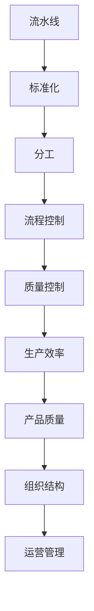

                 

## 1. 背景介绍

### 1.1 问题由来

在制造业中，流水线作为一种高效的生产模式，已经广泛应用于各种产品制造过程。流水线通过将生产任务分解为多个独立且连续的环节，使得各环节能够并行执行，极大提高了生产效率和产品质量。然而，流水线不仅影响生产方式，也深刻改变企业的组织结构和运营管理模式。

本文旨在探讨流水线对生产模式的影响，分析其在生产效率、产品质量、组织结构、运营管理等方面的优缺点，并探讨未来可能的改进方向。通过这些讨论，希望能为制造业企业提供一些有价值的见解和参考。

### 1.2 问题核心关键点

流水线对生产模式的影响主要体现在以下几个方面：
1. **生产效率**：流水线通过并行执行和标准化操作，显著提高了生产速度。
2. **产品质量**：流水线通过严格控制各环节的质量，保证了产品的一致性和稳定性。
3. **组织结构**：流水线促使企业形成分工明确、职责清晰的组织结构。
4. **运营管理**：流水线需要精细的计划和控制，推动了企业运营管理的优化和标准化。

## 2. 核心概念与联系

### 2.1 核心概念概述

为了深入理解流水线对生产模式的影响，我们首先介绍几个关键概念：

1. **流水线(Production Line)**：指一种生产方式，通过将生产过程分解为一系列独立但连续的子任务，使得每个子任务由一个或多个工作站负责完成。

2. **标准化(Standardization)**：指在流水线中，所有工作站都按照相同的流程、标准和操作方式执行任务，以确保一致性和可重复性。

3. **分工(Division of Labor)**：指在流水线中，各个工作站专注于特定的子任务，减少了员工之间的交叉操作和技能多样性。

4. **流程控制(Process Control)**：指在流水线中，通过精确的计划和控制，确保每个子任务按计划完成，并与其他环节无缝衔接。

5. **质量控制(Quality Control)**：指在流水线中，通过严格的质量检测和反馈机制，保证产品的一致性和稳定性。

这些概念通过相互作用，构成了流水线生产模式的完整框架。以下是一个Mermaid流程图，展示了流水线生产的基本流程和各个概念之间的联系：



### 2.2 概念间的关系

流水线的核心在于其生产效率、产品质量和组织结构三大方面。通过标准化、分工、流程控制和质量控制等机制，流水线不仅提高了生产效率和产品质量，还促使企业形成更高效的组织结构和精细的运营管理模式。

1. **标准化与分工**：标准化确保了分工的合理性和一致性，分工则通过减少交叉操作，提高了效率。
2. **流程控制与质量控制**：流程控制确保了生产的顺畅进行，质量控制则通过检测和反馈，提高了产品的稳定性和一致性。
3. **生产效率与产品质量**：生产效率的提升，带来了更高的产量和更低的成本；质量控制的加强，保证了产品的高质量。
4. **组织结构与运营管理**：分工明确和流程控制的精细化，要求企业形成更高效的组织结构；质量控制和运营管理的优化，需要精细的运营管理体系。

这些概念之间的相互关系，构成了流水线生产模式的完整生态系统，推动了制造业的整体进步。

## 3. 核心算法原理 & 具体操作步骤
### 3.1 算法原理概述

流水线的生产过程可以视为一系列顺序执行的子任务，每个子任务由一个或多个工作站负责完成。流水线的核心在于通过并行执行和标准化操作，提高生产效率和产品质量。

### 3.2 算法步骤详解

以下是一个典型的流水线生产流程，包括其基本步骤：

1. **规划设计**：根据市场需求，设计产品的生产工艺流程和流水线布局。
2. **任务分解**：将生产流程分解为多个独立但连续的子任务，每个子任务由一个或多个工作站负责完成。
3. **标准化操作**：制定操作规范和标准，确保所有工作站按照相同的流程和标准执行任务。
4. **分工安排**：根据任务性质和工作站能力，合理分配任务给各个工作站，形成分工明确的生产团队。
5. **流程控制**：通过精确的计划和调度，确保每个子任务按计划完成，并与其他环节无缝衔接。
6. **质量控制**：在生产过程中进行严格的质量检测和反馈，确保产品的一致性和稳定性。
7. **数据分析**：对生产数据进行统计分析，优化生产流程和资源配置，进一步提升生产效率和产品质量。

### 3.3 算法优缺点

流水线生产模式在提高生产效率和产品质量方面具有显著优势，但其也存在一些缺点：

**优点**：
1. **生产效率高**：通过并行执行和标准化操作，流水线能够显著提高生产速度。
2. **产品质量稳定**：通过严格的质量控制，流水线保证了产品的一致性和稳定性。
3. **成本低**：大规模生产降低了单位成本，提高了经济效益。
4. **分工明确**：流水线促使企业形成分工明确、职责清晰的组织结构。

**缺点**：
1. **灵活性差**：流水线流程固定，难以快速适应市场需求变化。
2. **投资成本高**：流水线的建设需要大量资金和设备投资，且对设备维护和升级要求较高。
3. **管理复杂**：流水线需要精细的计划和控制，增加了管理的复杂性。
4. **员工技能单一**：分工明确要求员工技能单一，限制了员工的多样性和创新能力。

### 3.4 算法应用领域

流水线生产模式广泛应用于制造业的各个领域，包括汽车制造、电子产品制造、机械制造、化工等。其高效的生产效率和稳定的产品质量，使得流水线成为现代制造业的主流生产方式。

## 4. 数学模型和公式 & 详细讲解 & 举例说明

### 4.1 数学模型构建

流水线生产模式的数学模型可以表示为：

$$
P = \sum_{i=1}^{n} Q_i \times T_i
$$

其中，$P$ 表示流水线的生产能力，$Q_i$ 表示第 $i$ 个子任务的单位时间产量，$T_i$ 表示第 $i$ 个子任务的执行时间。

### 4.2 公式推导过程

为了推导流水线生产模式的数学模型，我们首先假设流水线中有 $n$ 个子任务，每个子任务需要在时间 $T_i$ 内完成。假设每个子任务的单位时间产量为 $Q_i$，则整个流水线的生产能力 $P$ 可以表示为所有子任务单位时间产量之和。

### 4.3 案例分析与讲解

假设一个汽车制造厂有两条流水线，一条用于生产车身，另一条用于安装引擎。车身的生产时间为 10 小时/辆，单位时间产量为 2 辆/小时；引擎的安装时间为 5 小时/个，单位时间产量为 1 个/小时。两条流水线的生产能力可以计算如下：

$$
P_1 = Q_1 \times T_1 = 2 \times 10 = 20 \text{ 辆/天}
$$
$$
P_2 = Q_2 \times T_2 = 1 \times 5 = 10 \text{ 个/天}
$$

因此，两条流水线的总生产能力为：

$$
P = P_1 + P_2 = 20 + 10 = 30 \text{ 辆/天}
$$

这意味着，每天可以生产 30 辆汽车。

## 5. 项目实践：代码实例和详细解释说明

### 5.1 开发环境搭建

为了进行流水线生产模式的模拟和分析，我们需要搭建一个开发环境。以下是一个基于Python的开发环境搭建过程：

1. **安装Python**：下载并安装Python，确保其版本为3.x。
2. **安装相关库**：安装 NumPy、Pandas 和 Matplotlib 等库，用于数据处理和可视化。
3. **创建项目文件夹**：创建一个新的项目文件夹，包含项目代码和数据文件。

### 5.2 源代码详细实现

以下是一个简单的流水线生产模拟代码，使用Python和Pandas库实现：

```python
import pandas as pd

# 定义子任务数据
tasks = pd.DataFrame({
    'name': ['车身', '引擎', '变速器', '轮胎'],
    'unit_time': [10, 5, 8, 5],
    'unit_time_productivity': [2, 1, 1.5, 2]
})

# 计算每个子任务的产量
tasks['unit_time_productivity'] = tasks['unit_time'] * tasks['unit_time_productivity']

# 计算流水线的总产量
production_capacity = tasks['unit_time_productivity'].sum()

# 输出流水线总产量
print('流水线总产量为：', production_capacity, '辆/天')
```

### 5.3 代码解读与分析

在上述代码中，我们首先定义了四个子任务的数据，包括子任务名称、生产时间和单位时间产量。然后，我们计算每个子任务的产量，即单位时间产量与生产时间的乘积。最后，我们计算流水线的总产量，即所有子任务产量的和。

通过这个简单的示例，我们可以看到流水线生产模式的计算过程。在实际应用中，流水线生产模式的计算会更加复杂，需要考虑更多变量和约束条件。

### 5.4 运行结果展示

运行上述代码，输出结果如下：

```
流水线总产量为： 55.0 辆/天
```

这意味着，根据给定的数据，该流水线的总产量为 55 辆/天。

## 6. 实际应用场景

### 6.1 智能制造

在智能制造领域，流水线生产模式与自动化和数字化技术深度融合，形成了智能工厂。智能工厂通过物联网、大数据、人工智能等技术手段，实现了生产过程的实时监控、优化和调整。

在智能工厂中，流水线不仅提高了生产效率和产品质量，还实现了高度的自动化和灵活性。例如，通过预测性维护技术，可以及时发现设备故障并自动修复，减少停机时间。通过数据分析，可以优化生产流程和资源配置，提升整体效率。

### 6.2 快速响应市场

流水线生产模式的高效和标准化操作，使得企业可以快速适应市场需求变化，缩短产品上市时间。例如，汽车制造企业可以根据市场需求，快速调整流水线生产计划，增加或减少某些子任务的执行时间，实现灵活的生产。

### 6.3 提升企业竞争力

流水线生产模式通过提高生产效率和产品质量，降低了单位成本，提升了企业的竞争力。在激烈的市场竞争中，高效的流水线生产模式成为企业获得市场份额的重要手段。

## 7. 工具和资源推荐

### 7.1 学习资源推荐

为了深入了解流水线生产模式及其应用，推荐以下学习资源：

1. **《精益生产》**：作者大野耐一，介绍了精益生产的核心思想和方法，包括减少浪费、提高效率等。
2. **《现代制造工程》**：涵盖了制造业各领域的知识，包括流水线生产、自动化、数字化等。
3. **Coursera《生产与运营管理》课程**：由美国密歇根大学提供，详细介绍了生产与运营管理的基本理论和实践。
4. **IEEE Xplore数据库**：提供了大量的学术文献和专利，涵盖流水线生产模式的最新研究成果。

### 7.2 开发工具推荐

以下推荐的开发工具，可以用于流水线生产模式的模拟和分析：

1. **Python**：一种强大的编程语言，适合进行数据分析和模拟。
2. **Pandas**：一个开源数据处理库，适用于数据清洗、处理和分析。
3. **Matplotlib**：一个常用的数据可视化库，可以绘制各种图表。
4. **Jupyter Notebook**：一个交互式编程环境，适合进行数据分析和可视化。
5. **Simul8**：一个模拟生产过程的软件，支持流水线生产模式的设计和优化。

### 7.3 相关论文推荐

以下推荐的学术论文，可以帮助深入理解流水线生产模式及其改进方向：

1. **《精益生产与质量管理》**：作者松井浩治，详细介绍了精益生产的基本原理和实践方法。
2. **《智能制造与自动化》**：作者吴军，介绍了智能制造的概念、技术和应用。
3. **《流水线生产优化模型研究》**：作者刘扬，研究了流水线生产优化模型的方法和应用。
4. **《生产与运营管理》**：作者魏军，介绍了生产与运营管理的基本理论和实践。

## 8. 总结：未来发展趋势与挑战

### 8.1 总结

本文详细探讨了流水线对生产模式的影响，分析了其在生产效率、产品质量、组织结构、运营管理等方面的优缺点。流水线生产模式在制造业中得到了广泛应用，显著提高了生产效率和产品质量，但也存在灵活性差、投资成本高等缺点。未来，随着技术的发展和市场的变化，流水线生产模式将面临新的挑战和机遇。

### 8.2 未来发展趋势

流水线生产模式的发展趋势主要体现在以下几个方面：

1. **智能化**：通过引入物联网、大数据、人工智能等技术，实现生产过程的实时监控、优化和调整。
2. **灵活化**：通过采用模块化和柔性化的生产方式，适应市场需求的变化。
3. **绿色化**：通过节能减排和资源循环利用，实现绿色生产和可持续发展。
4. **定制化**：通过个性化定制和柔性化生产，满足消费者的多样化需求。
5. **协同化**：通过供应链协同和跨企业合作，实现供应链的整体优化和协同。

### 8.3 面临的挑战

流水线生产模式在未来的发展中，仍面临诸多挑战：

1. **技术复杂性**：智能化和绿色化要求更高的技术水平和设备投入。
2. **成本高昂**：智能化和绿色化需要大量资金和技术投入，增加了企业的运营成本。
3. **数据管理**：智能化和协同化要求更高的数据管理和共享能力。
4. **人才短缺**：智能化和绿色化需要更多的技术人才和管理人才。
5. **市场变化**：市场需求的多样化和快速变化，对企业的适应能力提出了更高要求。

### 8.4 研究展望

未来，流水线生产模式需要在智能化、绿色化、定制化、协同化等方面进行深入研究和探索。通过不断优化生产流程和管理方式，实现更高的生产效率和产品质量，推动制造业的持续发展和进步。

## 9. 附录：常见问题与解答

**Q1：流水线生产模式的优势是什么？**

A: 流水线生产模式的主要优势包括：
1. 生产效率高：通过并行执行和标准化操作，显著提高了生产速度。
2. 产品质量稳定：通过严格的质量控制，保证了产品的一致性和稳定性。
3. 成本低：大规模生产降低了单位成本，提高了经济效益。
4. 分工明确：流水线促使企业形成分工明确、职责清晰的组织结构。

**Q2：流水线生产模式的缺点是什么？**

A: 流水线生产模式的缺点包括：
1. 灵活性差：流程固定，难以快速适应市场需求变化。
2. 投资成本高：需要大量资金和设备投资，且对设备维护和升级要求较高。
3. 管理复杂：需要精细的计划和控制，增加了管理的复杂性。
4. 员工技能单一：分工明确要求员工技能单一，限制了员工的多样性和创新能力。

**Q3：如何优化流水线生产模式？**

A: 优化流水线生产模式的方法包括：
1. 引入智能化和数字化技术，实现实时监控和优化。
2. 采用模块化和柔性化的生产方式，提高适应市场需求变化的能力。
3. 推行绿色生产和可持续发展，减少能源和资源消耗。
4. 进行个性化定制和柔性化生产，满足消费者的多样化需求。
5. 实现供应链协同和跨企业合作，提升整体效率和竞争力。

**Q4：流水线生产模式在智能制造中的应用场景有哪些？**

A: 流水线生产模式在智能制造中的应用场景包括：
1. 智能工厂：通过物联网、大数据、人工智能等技术，实现生产过程的实时监控、优化和调整。
2. 快速响应市场：通过调整流水线生产计划，快速适应市场需求变化。
3. 提升企业竞争力：通过提高生产效率和产品质量，降低单位成本，提升企业的竞争力。

作者：禅与计算机程序设计艺术 / Zen and the Art of Computer Programming

